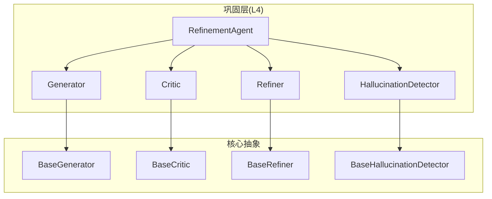
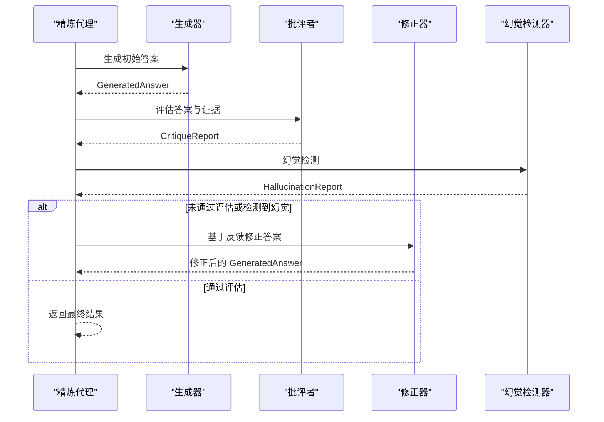
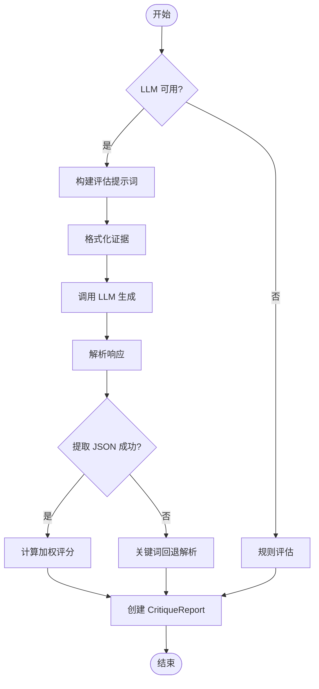
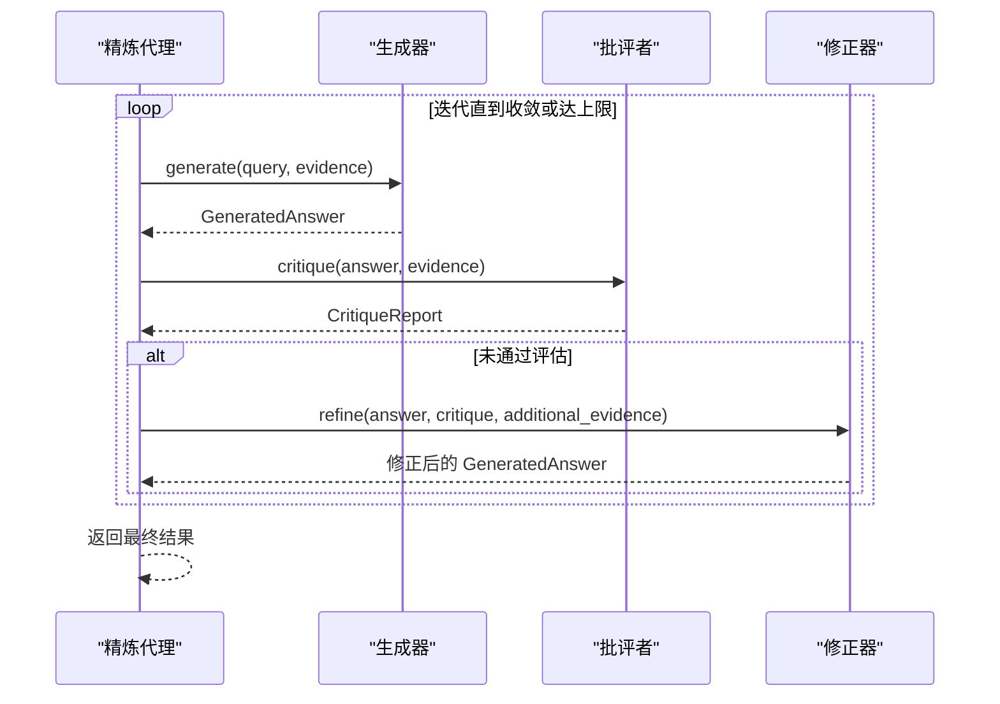
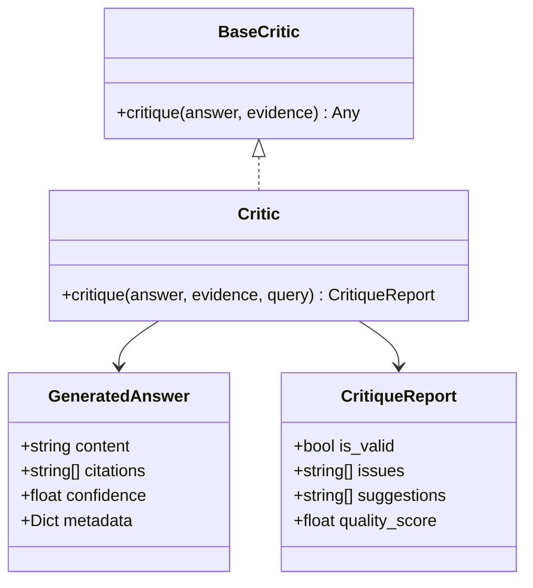
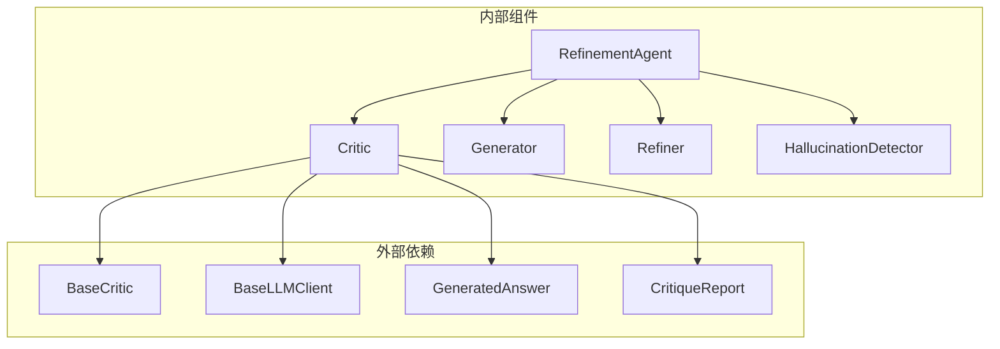

# 批评者组件

<cite>
**本文引用的文件**
- [critic.py](file://src/refinement/critic.py)
- [models.py](file://src/refinement/models.py)
- [generator.py](file://src/refinement/generator.py)
- [refiner.py](file://src/refinement/refiner.py)
- [agent.py](file://src/refinement/agent.py)
- [hallucination.py](file://src/refinement/hallucination.py)
- [base.py](file://src/core/base.py)
- [example_usage.py](file://example/example_usage.py)
- [metrics.py](file://src/monitoring/metrics.py)
</cite>

## 目录
1. [引言](#引言)
2. [项目结构](#项目结构)
3. [核心组件](#核心组件)
4. [架构总览](#架构总览)
5. [详细组件分析](#详细组件分析)
6. [依赖分析](#依赖分析)
7. [性能考量](#性能考量)
8. [故障排查指南](#故障排查指南)
9. [结论](#结论)
10. [附录](#附录)

## 引言
本文件面向开发者与质量工程师，系统化阐述“批评者（Critic）”组件的设计与实现，重点覆盖以下方面：
- 批判评估算法与质量判断标准
- 评估维度、评分体系与反馈生成机制
- 与生成器、修正器、幻觉检测器的协作模式与迭代优化策略
- 性能监控与可观测性方法
- 使用示例、配置参数与最佳实践

目标是帮助读者快速理解并高效构建可复用、可扩展的质量控制系统。

## 项目结构
批评者组件位于“巩固层（L4）”的“精炼流水线”中，与生成器、修正器、幻觉检测器共同构成“生成-批判-修正”的闭环，并通过精炼代理进行编排与调度。

图表来源
- [agent.py:20-64](file://src/refinement/agent.py#L20-L64)
- [generator.py:16-51](file://src/refinement/generator.py#L16-L51)
- [critic.py:18-56](file://src/refinement/critic.py#L18-L56)
- [refiner.py:18-53](file://src/refinement/refiner.py#L18-L53)
- [hallucination.py:18-56](file://src/refinement/hallucination.py#L18-L56)
- [base.py:448-538](file://src/core/base.py#L448-L538)

章节来源
- [agent.py:20-64](file://src/refinement/agent.py#L20-L64)
- [base.py:448-538](file://src/core/base.py#L448-L538)

## 核心组件
- 批评者（Critic）：对生成的答案进行多维度质量评估，产出质量评分与改进建议，驱动后续修正。
- 生成器（Generator）：基于检索证据生成候选答案，并估计置信度。
- 修正器（Refiner）：依据批评反馈迭代改进答案，必要时融合补充证据。
- 幻觉检测器（HallucinationDetector）：检测事实一致性、逻辑连贯性与证据支撑度，辅助质量判定。
- 精炼代理（RefinementAgent）：编排上述组件，执行迭代优化与最终决策。

章节来源
- [critic.py:18-56](file://src/refinement/critic.py#L18-L56)
- [generator.py:16-51](file://src/refinement/generator.py#L16-L51)
- [refiner.py:18-53](file://src/refinement/refiner.py#L18-L53)
- [hallucination.py:18-56](file://src/refinement/hallucination.py#L18-L56)
- [agent.py:20-64](file://src/refinement/agent.py#L20-L64)

## 架构总览
批评者在“生成-批判-修正”闭环中的位置与交互如下：

图表来源
- [agent.py:65-141](file://src/refinement/agent.py#L65-L141)
- [critic.py:90-113](file://src/refinement/critic.py#L90-L113)
- [hallucination.py:136-157](file://src/refinement/hallucination.py#L136-L157)
- [refiner.py:98-131](file://src/refinement/refiner.py#L98-L131)

## 详细组件分析

### 批评者（Critic）算法与评估维度
- 评估维度
  - 事实性（factuality）：答案与证据是否一致，是否存在矛盾或错误事实
  - 完整性（completeness）：是否完整回答问题，是否遗漏关键信息
  - 相关性（relevance）：答案与问题的相关程度，是否存在无关或冗余内容
- 评分体系
  - 加权总分：质量总分 = 事实性×权重 + 完整性×权重 + 相关性×权重
  - 权重默认：事实性 0.4、完整性 0.3、相关性 0.3
  - 判定阈值：质量总分 ≥ 0.6 且问题数量 ≤ 2 时视为有效
- 反馈生成
  - 从 LLM 响应中抽取评分、问题清单、建议与摘要
  - 若 JSON 解析失败，退化为关键词匹配的回退解析，仍给出质量分数与建议
  - 规则模式（无 LLM 时）：基于证据引用、置信度、答案长度、关键词重叠等规则打分与提供建议

图表来源
- [critic.py:114-193](file://src/refinement/critic.py#L114-L193)
- [critic.py:232-309](file://src/refinement/critic.py#L232-L309)

章节来源
- [critic.py:18-56](file://src/refinement/critic.py#L18-L56)
- [critic.py:90-113](file://src/refinement/critic.py#L90-L113)
- [critic.py:143-193](file://src/refinement/critic.py#L143-L193)
- [critic.py:194-231](file://src/refinement/critic.py#L194-L231)
- [critic.py:232-309](file://src/refinement/critic.py#L232-L309)

### 与生成器的协作与迭代优化
- 协作模式
  - 生成器负责生成候选答案并估计置信度
  - 批评者对答案进行质量评估，输出质量评分与问题清单
  - 修正器基于反馈迭代改进答案，必要时融合补充证据
- 迭代策略
  - 精炼代理在每次迭代中依次执行：生成 → 批判 → 幻觉检测 → 修正（如需）→ 决策
  - 当答案通过评估且未检测到幻觉时终止；否则继续迭代，直至达到最大迭代次数
  - 若检测到幻觉，降低置信度以抑制风险传播

图表来源
- [agent.py:65-141](file://src/refinement/agent.py#L65-L141)
- [generator.py:68-102](file://src/refinement/generator.py#L68-L102)
- [refiner.py:98-176](file://src/refinement/refiner.py#L98-L176)
- [critic.py:90-113](file://src/refinement/critic.py#L90-L113)

章节来源
- [agent.py:65-141](file://src/refinement/agent.py#L65-L141)
- [generator.py:68-102](file://src/refinement/generator.py#L68-L102)
- [refiner.py:98-176](file://src/refinement/refiner.py#L98-L176)

### 与幻觉检测器的协同
- 幻觉检测器独立于批评者，分别评估事实一致性、逻辑连贯性与证据支撑度
- 精炼代理在每次迭代后执行幻觉检测，若检测到幻觉则降低置信度，避免将不可靠答案输出
- 仅当“批评者判定有效 且 幻觉检测未发现问题”时，认为答案可接受

章节来源
- [agent.py:98-131](file://src/refinement/agent.py#L98-L131)
- [hallucination.py:136-157](file://src/refinement/hallucination.py#L136-L157)

### 数据模型与接口契约
- GeneratedAnswer：生成的答案，包含内容、引用、置信度与元数据
- CritiqueReport：批评报告，包含有效性、问题清单、建议与质量评分
- BaseCritic：抽象接口，约束实现需提供 critique 方法

图表来源
- [models.py:19-35](file://src/refinement/models.py#L19-L35)
- [base.py:472-491](file://src/core/base.py#L472-L491)
- [critic.py:18-56](file://src/refinement/critic.py#L18-L56)

章节来源
- [models.py:19-35](file://src/refinement/models.py#L19-L35)
- [base.py:472-491](file://src/core/base.py#L472-L491)
- [critic.py:18-56](file://src/refinement/critic.py#L18-L56)

### 使用示例与最佳实践
- 使用示例
  - 参考示例脚本中对精炼代理的调用，展示从检索证据到生成、评估、幻觉检测与最终输出的完整流程
- 最佳实践
  - 为 LLM 客户端设置合适的 temperature（评估阶段通常较低以稳定输出）
  - 在证据不足时启用规则评估回退，保障系统鲁棒性
  - 将“质量阈值 + 问题数量阈值”作为迭代收敛的关键参数
  - 结合幻觉检测与置信度衰减策略，降低不可靠输出的风险

章节来源
- [example_usage.py:139-173](file://example/example_usage.py#L139-L173)
- [critic.py:136-142](file://src/refinement/critic.py#L136-L142)
- [agent.py:98-131](file://src/refinement/agent.py#L98-L131)

## 依赖分析
- 批评者依赖关系
  - 抽象层：BaseCritic、BaseLLMClient
  - 数据模型：GeneratedAnswer、CritiqueReport
  - 业务组件：精炼代理（编排）、生成器（输入）、修正器（反馈来源）、幻觉检测器（协同）
- 耦合与内聚
  - 批评者职责单一、内聚性高
  - 通过抽象接口与数据模型解耦具体实现，便于替换与扩展

图表来源
- [critic.py:11-15](file://src/refinement/critic.py#L11-L15)
- [base.py:472-491](file://src/core/base.py#L472-L491)
- [models.py:19-35](file://src/refinement/models.py#L19-L35)
- [agent.py:20-64](file://src/refinement/agent.py#L20-L64)

章节来源
- [critic.py:11-15](file://src/refinement/critic.py#L11-L15)
- [base.py:472-491](file://src/core/base.py#L472-L491)
- [models.py:19-35](file://src/refinement/models.py#L19-L35)
- [agent.py:20-64](file://src/refinement/agent.py#L20-L64)

## 性能考量
- LLM 调用优化
  - 评估阶段使用较低 temperature（如 0.3）以稳定输出，减少 token 消耗
  - 提示词模板结构化，避免冗余信息
- 错误处理与降级
  - LLM 调用异常时自动回退至规则解析或规则评估，保障系统可用性
- 评分与判定
  - 加权评分与阈值控制在保证质量的同时，避免过度严苛导致迭代停滞
- 监控与可观测性
  - 使用系统指标与应用指标收集器记录关键性能与运行状态，便于定位瓶颈与异常

章节来源
- [critic.py:136-142](file://src/refinement/critic.py#L136-L142)
- [metrics.py:126-203](file://src/monitoring/metrics.py#L126-L203)

## 故障排查指南
- LLM 评估失败
  - 现象：调用 LLM 抛出异常
  - 排查：检查 LLM 客户端配置、网络连通性与令牌限制
  - 处理：自动回退至规则解析；若规则解析也失败，检查输入格式与证据可用性
- 评分异常或不稳定
  - 现象：质量评分波动较大
  - 排查：确认 temperature 设置、提示词格式与 JSON 提取正则
  - 处理：适当降低 temperature，确保提示词严格遵循 JSON 输出约定
- 反馈建议不相关
  - 现象：建议与问题不匹配
  - 排查：检查提示词模板与 JSON 字段映射
  - 处理：完善提示词与解析逻辑，必要时增加回退解析
- 迭代不收敛
  - 现象：多次迭代后仍未达标
  - 排查：检查证据质量、置信度估计与阈值设置
  - 处理：提升证据质量、调整阈值或增加最大迭代次数

章节来源
- [critic.py:136-142](file://src/refinement/critic.py#L136-L142)
- [critic.py:194-231](file://src/refinement/critic.py#L194-L231)
- [agent.py:90-141](file://src/refinement/agent.py#L90-L141)

## 结论
批评者组件通过“多维度评估 + 加权评分 + 规则回退”的设计，在保证质量的同时兼顾鲁棒性与可扩展性。配合生成器、修正器与幻觉检测器，形成高效的闭环质量控制体系。建议在生产环境中结合监控指标与阈值调优，持续迭代以获得更稳定的输出质量。

## 附录

### 评估指标与阈值配置
- 评估维度与权重
  - 事实性：权重 0.4
  - 完整性：权重 0.3
  - 相关性：权重 0.3
- 质量判定阈值
  - 质量总分 ≥ 0.6 且问题数量 ≤ 2 时为有效
- 温度参数
  - 评估阶段 temperature ≈ 0.3（稳定输出）
- 最大迭代次数
  - 由精炼代理配置，影响收敛速度与成本

章节来源
- [critic.py:28-56](file://src/refinement/critic.py#L28-L56)
- [critic.py:164-187](file://src/refinement/critic.py#L164-L187)
- [agent.py:31-64](file://src/refinement/agent.py#L31-L64)

### 使用示例（路径）
- 完整工作流示例：从感知、记忆、检索到精炼与响应
- 示例脚本路径：[example_usage.py:139-173](file://example/example_usage.py#L139-L173)

章节来源
- [example_usage.py:139-173](file://example/example_usage.py#L139-L173)