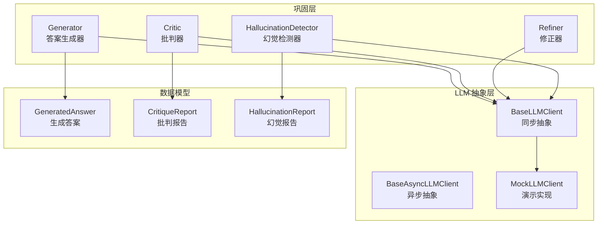
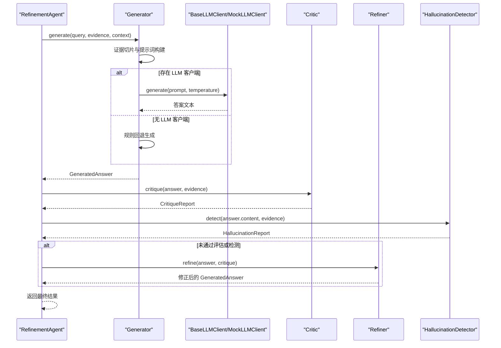
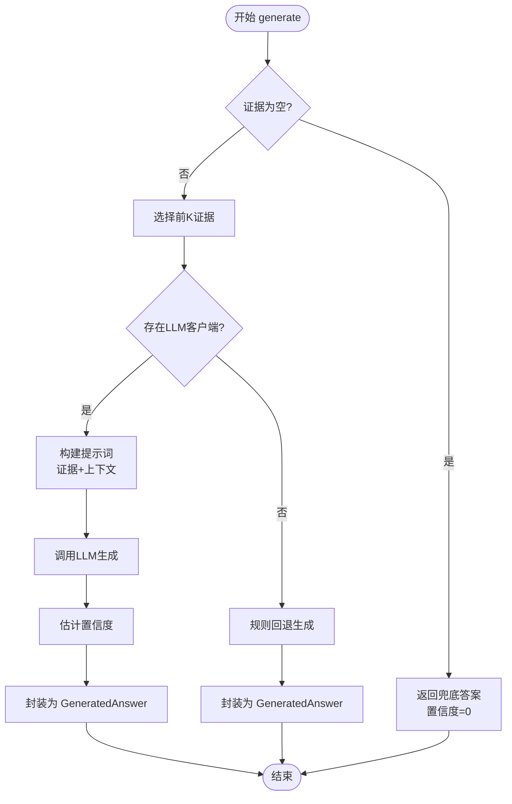
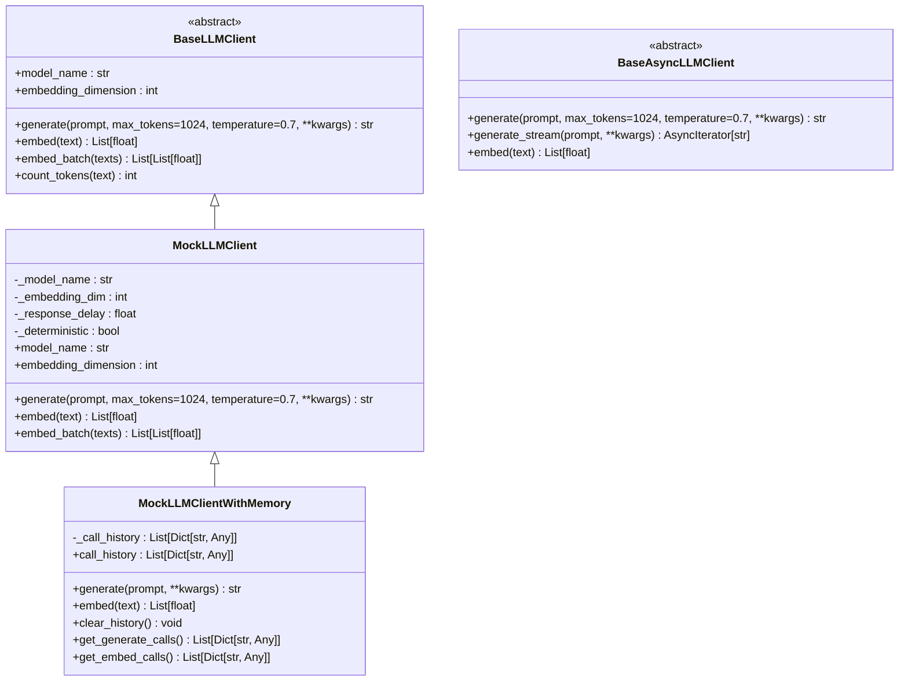
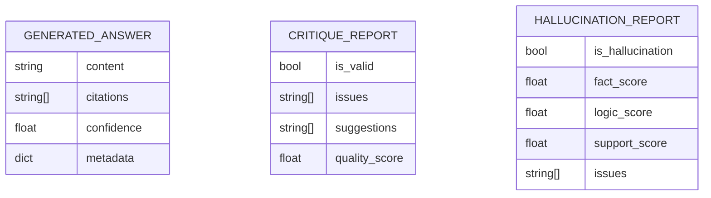
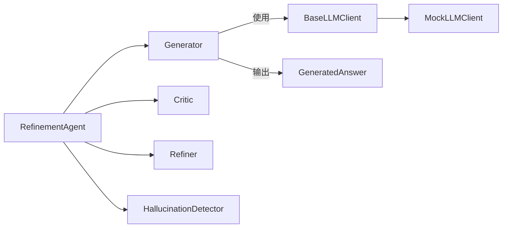

# 生成器组件

<cite>
**本文引用的文件**
- [src/refinement/generator.py](file://src/refinement/generator.py)
- [src/refinement/models.py](file://src/refinement/models.py)
- [src/refinement/agent.py](file://src/refinement/agent.py)
- [src/refinement/critic.py](file://src/refinement/critic.py)
- [src/refinement/refiner.py](file://src/refinement/refiner.py)
- [src/refinement/hallucination.py](file://src/refinement/hallucination.py)
- [src/core/llm/base.py](file://src/core/llm/base.py)
- [src/core/llm/mock.py](file://src/core/llm/mock.py)
- [src/core/base.py](file://src/core/base.py)
- [src/core/config.py](file://src/core/config.py)
- [example/example_usage.py](file://example/example_usage.py)
- [wiki/wiki/巩固层模块/生成器组件.md](file://wiki/wiki/巩固层模块/生成器组件.md)
</cite>

## 目录
1. [简介](#简介)
2. [项目结构](#项目结构)
3. [核心组件](#核心组件)
4. [架构总览](#架构总览)
5. [详细组件分析](#详细组件分析)
6. [依赖分析](#依赖分析)
7. [性能考虑](#性能考虑)
8. [故障排查指南](#故障排查指南)
9. [结论](#结论)
10. [附录](#附录)

## 简介
本文件聚焦“生成器组件”，系统阐述 Generator 类的实现原理与答案生成算法，包括上下文理解、证据利用机制、提示工程与模板设计、输出格式化、置信度计算与引用标注、配置选项、性能优化与调试方法，并提供使用示例与最佳实践。生成器通过“证据选择-提示工程-LLM 生成-置信度估计-引用标注”的完整流程，实现了可控、可追溯、可评估的答案生成，并与批判、修正、幻觉检测的闭环配合，进一步提升了答案质量与可靠性。

## 项目结构
生成器组件位于“巩固层”模块，与批判器、修正器、幻觉检测器协同工作，形成“生成-评估-修正-验证”的闭环。其核心依赖 LLM 客户端抽象，支持注入式替换，既可使用真实 LLM，也可使用 Mock 实现以满足开发与演示需求。

**图表来源**
- [src/refinement/generator.py:16-209](file://src/refinement/generator.py#L16-L209)
- [src/refinement/critic.py:18-309](file://src/refinement/critic.py#L18-L309)
- [src/refinement/refiner.py:18-371](file://src/refinement/refiner.py#L18-L371)
- [src/refinement/hallucination.py:18-507](file://src/refinement/hallucination.py#L18-L507)
- [src/core/llm/base.py:16-122](file://src/core/llm/base.py#L16-L122)
- [src/core/llm/mock.py:16-313](file://src/core/llm/mock.py#L16-L313)
- [src/refinement/models.py:19-66](file://src/refinement/models.py#L19-L66)

**章节来源**
- [src/refinement/generator.py:16-209](file://src/refinement/generator.py#L16-L209)
- [src/refinement/agent.py:20-164](file://src/refinement/agent.py#L20-L164)
- [src/core/llm/base.py:16-122](file://src/core/llm/base.py#L16-L122)
- [src/core/llm/mock.py:16-313](file://src/core/llm/mock.py#L16-L313)
- [src/refinement/models.py:19-66](file://src/refinement/models.py#L19-L66)

## 核心组件
- Generator：基于检索证据生成答案，支持 LLM 客户端依赖注入，内置规则回退路径，提供置信度估计与引用标注。
- BaseLLMClient：LLM 客户端抽象，定义 generate、embed、embed_batch 等接口，提供默认实现与工具函数。
- MockLLMClient：演示用 LLM 客户端，提供确定性响应与向量，便于测试与演示。
- GeneratedAnswer：标准化输出数据模型，包含 content、citations、confidence、metadata。
- RefinementAgent：整合 Generator、Critic、Refiner、HallucinationDetector 的闭环代理，负责迭代优化与质量控制。

**章节来源**
- [src/refinement/generator.py:16-209](file://src/refinement/generator.py#L16-L209)
- [src/core/llm/base.py:16-122](file://src/core/llm/base.py#L16-L122)
- [src/core/llm/mock.py:16-313](file://src/core/llm/mock.py#L16-L313)
- [src/refinement/models.py:19-66](file://src/refinement/models.py#L19-L66)
- [src/refinement/agent.py:20-164](file://src/refinement/agent.py#L20-L164)

## 架构总览
生成器组件在“巩固层”中承担答案生成职责，向上游提供标准化输出，向下与 LLM 客户端解耦。其与批判器、修正器、幻觉检测器协作，形成质量闭环；与 RefinementAgent 协同，实现多轮迭代优化。

**图表来源**
- [src/refinement/agent.py:65-141](file://src/refinement/agent.py#L65-L141)
- [src/refinement/generator.py:68-141](file://src/refinement/generator.py#L68-L141)
- [src/refinement/critic.py:90-142](file://src/refinement/critic.py#L90-L142)
- [src/refinement/refiner.py:98-175](file://src/refinement/refiner.py#L98-L175)
- [src/refinement/hallucination.py:136-193](file://src/refinement/hallucination.py#L136-L193)

## 详细组件分析

### Generator 类实现与算法
- 初始化与依赖注入
  - 接收可选的 LLM 客户端；若为空则自动注入 Mock 实现，保证开发/演示可用。
  - 维护最大证据数量与生成温度参数，影响提示词构建与 LLM 采样多样性。
- 输入处理与证据选择
  - 当证据为空时，直接返回兜底答案与零置信度。
  - 对证据进行切片，限制最大使用数量，避免上下文过长与成本过高。
- LLM 生成路径
  - 将证据格式化为带编号的证据段，拼接至模板提示词；若提供上下文，将其前置到提示词。
  - 调用 LLM 的生成接口，传入温度参数，得到答案文本。
  - 基于证据数量、答案长度与关键词覆盖度估算置信度，并封装为 GeneratedAnswer。
- 规则回退路径
  - 若无 LLM 客户端，则采用规则化生成：拼接证据要点、添加兜底说明，并基于证据数量粗略估计置信度。
- 置信度计算
  - 初始置信度基线，叠加证据数量因子、答案长度适中性因子、查询词覆盖因子，上限约束，形成最终置信度。

**图表来源**
- [src/refinement/generator.py:68-141](file://src/refinement/generator.py#L68-L141)
- [src/refinement/generator.py:143-175](file://src/refinement/generator.py#L143-L175)
- [src/refinement/generator.py:177-209](file://src/refinement/generator.py#L177-L209)

**章节来源**
- [src/refinement/generator.py:26-51](file://src/refinement/generator.py#L26-L51)
- [src/refinement/generator.py:68-101](file://src/refinement/generator.py#L68-L101)
- [src/refinement/generator.py:103-141](file://src/refinement/generator.py#L103-L141)
- [src/refinement/generator.py:143-175](file://src/refinement/generator.py#L143-L175)
- [src/refinement/generator.py:177-209](file://src/refinement/generator.py#L177-L209)
- [wiki/wiki/巩固层模块/生成器组件.md:125-139](file://wiki/wiki/巩固层模块/生成器组件.md#L125-L139)

### LLM 客户端抽象与 Mock 实现
- 抽象接口
  - BaseLLMClient 定义同步生成、向量化、批处理与工具函数（如 token 估算、提示词构造）。
- Mock 实现
  - MockLLMClient 提供确定性响应与向量，便于测试与演示；支持“带记忆”的变体记录调用历史。
- 依赖注入
  - Generator 默认注入 Mock，也可注入真实 LLM 客户端以获得真实生成能力。

**图表来源**
- [src/core/llm/base.py:16-122](file://src/core/llm/base.py#L16-L122)
- [src/core/llm/mock.py:16-313](file://src/core/llm/mock.py#L16-L313)

**章节来源**
- [src/core/llm/base.py:16-122](file://src/core/llm/base.py#L16-L122)
- [src/core/llm/mock.py:16-313](file://src/core/llm/mock.py#L16-L313)
- [wiki/wiki/巩固层模块/生成器组件.md:260-272](file://wiki/wiki/巩固层模块/生成器组件.md#L260-L272)

### 数据模型与输出格式
- GeneratedAnswer：标准化输出数据模型，包含 content、citations、confidence、metadata，用于统一下游处理。
- CritiqueReport：批判报告，包含 is_valid、issues、suggestions、quality_score。
- HallucinationReport：幻觉检测报告，包含 is_hallucination、fact_score、logic_score、support_score、issues。

**图表来源**
- [src/refinement/models.py:19-66](file://src/refinement/models.py#L19-L66)

**章节来源**
- [src/refinement/models.py:19-66](file://src/refinement/models.py#L19-L66)

### API 接口文档
- 生成器接口
  - 方法：generate(query: str, evidence: List[str], context: Optional[Dict[str, Any]] = None) -> GeneratedAnswer
  - 参数：
    - query：查询文本
    - evidence：证据列表
    - context：上下文信息（可选）
  - 返回：GeneratedAnswer
- 批判器接口
  - 方法：critique(answer: GeneratedAnswer, evidence: List[str], query: Optional[str] = None) -> CritiqueReport
- 修正器接口
  - 方法：refine(answer: GeneratedAnswer, critique: CritiqueReport, additional_evidence: Optional[List[str]] = None, query: Optional[str] = None, original_evidence: Optional[List[str]] = None) -> GeneratedAnswer
- 幻觉检测器接口
  - 方法：detect(answer: str, evidence: List[str]) -> HallucinationReport

**章节来源**
- [src/refinement/generator.py:68-101](file://src/refinement/generator.py#L68-L101)
- [src/refinement/critic.py:90-112](file://src/refinement/critic.py#L90-L112)
- [src/refinement/refiner.py:98-130](file://src/refinement/refiner.py#L98-L130)
- [src/refinement/hallucination.py:136-156](file://src/refinement/hallucination.py#L136-L156)

### 使用示例
- 完整工作流程示例展示了从感知层到记忆层、检索层、巩固层再到交互层的端到端使用方式，其中巩固层通过 RefinementAgent 调用 Generator 生成答案并进行质量控制。

**章节来源**
- [example/example_usage.py:139-173](file://example/example_usage.py#L139-L173)

## 依赖分析
- 组件耦合
  - Generator 依赖 LLM 客户端抽象，支持注入式替换；默认回退到 Mock。
  - 与 GeneratedAnswer 数据模型强绑定，输出标准化。
  - 与 RefinementAgent 协同工作，参与闭环评估与修正。
- 外部依赖
  - LLM 提供商可通过配置切换（Mock/OpenAI/Ollama/vLLM/Azure/Claude），通过统一配置类管理。
- 潜在循环依赖
  - 通过 TYPE_CHECKING 导入避免运行时循环导入；整体结构清晰，无循环依赖风险。

**图表来源**
- [src/refinement/generator.py:16-209](file://src/refinement/generator.py#L16-L209)
- [src/refinement/agent.py:20-164](file://src/refinement/agent.py#L20-L164)
- [src/core/llm/base.py:16-122](file://src/core/llm/base.py#L16-L122)
- [src/core/llm/mock.py:16-313](file://src/core/llm/mock.py#L16-L313)

**章节来源**
- [src/refinement/generator.py:16-209](file://src/refinement/generator.py#L16-L209)
- [src/refinement/agent.py:20-164](file://src/refinement/agent.py#L20-L164)
- [src/core/llm/base.py:16-122](file://src/core/llm/base.py#L16-L122)
- [src/core/llm/mock.py:16-313](file://src/core/llm/mock.py#L16-L313)
- [wiki/wiki/巩固层模块/生成器组件.md:274-282](file://wiki/wiki/巩固层模块/生成器组件.md#L274-L282)

## 性能考虑
- 上下文长度控制
  - 通过 max_evidence 控制证据数量，避免提示词过长导致成本上升与延迟增加。
- 采样温度调优
  - temperature 控制生成多样性，默认值平衡创造性与稳定性；在需要确定性输出时可降低温度。
- 提示词模板优化
  - 明确指令与格式，减少无关信息，有助于缩短生成时间与提升质量。
- 批量处理与缓存
  - 对嵌入与向量操作尽量使用批量接口，结合缓存策略减少重复计算。
- LLM 选择与资源调度
  - 根据场景选择合适的 LLM 提供商与模型，合理设置超时与重试策略。

[本节为通用性能指导，无需特定文件引用]

## 故障排查指南
- 无证据场景
  - 现象：直接返回兜底答案，置信度为 0。
  - 处理：确认检索阶段是否正确返回证据；必要时放宽检索阈值。
- 答案过短或过长
  - 现象：置信度偏低。
  - 处理：调整证据数量与长度，或优化提示词引导答案结构。
- 关键词覆盖不足
  - 现象：查询词未充分体现在答案中。
  - 处理：优化检索与证据组织，确保关键信息完整呈现。
- 幻觉检测触发
  - 现象：事实一致性或证据支撑度不足。
  - 处理：增加证据数量与来源多样性，必要时开启重排序与 HyDE。
- LLM 客户端缺失
  - 现象：回退到规则回退路径。
  - 处理：注入真实 LLM 客户端或检查依赖安装。

**章节来源**
- [src/refinement/generator.py:85-91](file://src/refinement/generator.py#L85-L91)
- [src/refinement/generator.py:177-209](file://src/refinement/generator.py#L177-L209)
- [src/refinement/hallucination.py:136-193](file://src/refinement/hallucination.py#L136-L193)
- [src/refinement/agent.py:96-130](file://src/refinement/agent.py#L96-L130)

## 结论
Generator 通过“证据选择-提示工程-LLM 生成-置信度估计-引用标注”的完整流程，实现了可控、可追溯、可评估的答案生成。其与批判、修正、幻觉检测的闭环配合，进一步提升了答案质量与可靠性。通过合理的配置与性能优化策略，可在不同场景下取得稳定而高效的问答效果。

[本节为总结性内容，无需特定文件引用]

## 附录

### 配置参数与最佳实践
- 生成器配置
  - max_evidence：控制每次生成使用的证据数量，建议根据上下文窗口与成本预算设定。
  - temperature：控制生成多样性，0.0-1.0 范围内调优；追求稳定性可降低温度。
- LLM 提供商配置
  - 通过统一配置类管理 LLM 提供商、模型名称、API Key、超时等参数，支持从环境变量覆盖。
- 场景化建议
  - 开发/演示：使用 MockLLMClient，确保快速迭代与可重复性。
  - 生产环境：选择稳定可靠的 LLM 提供商，结合重试与熔断策略。
  - 高质量问答：适当提高 max_evidence 与迭代次数，启用重排序与 HyDE。

**章节来源**
- [src/core/config.py:82-101](file://src/core/config.py#L82-L101)
- [src/core/config.py:338-377](file://src/core/config.py#L338-L377)
- [src/core/config.py:390-420](file://src/core/config.py#L390-L420)
- [src/refinement/generator.py:26-51](file://src/refinement/generator.py#L26-L51)