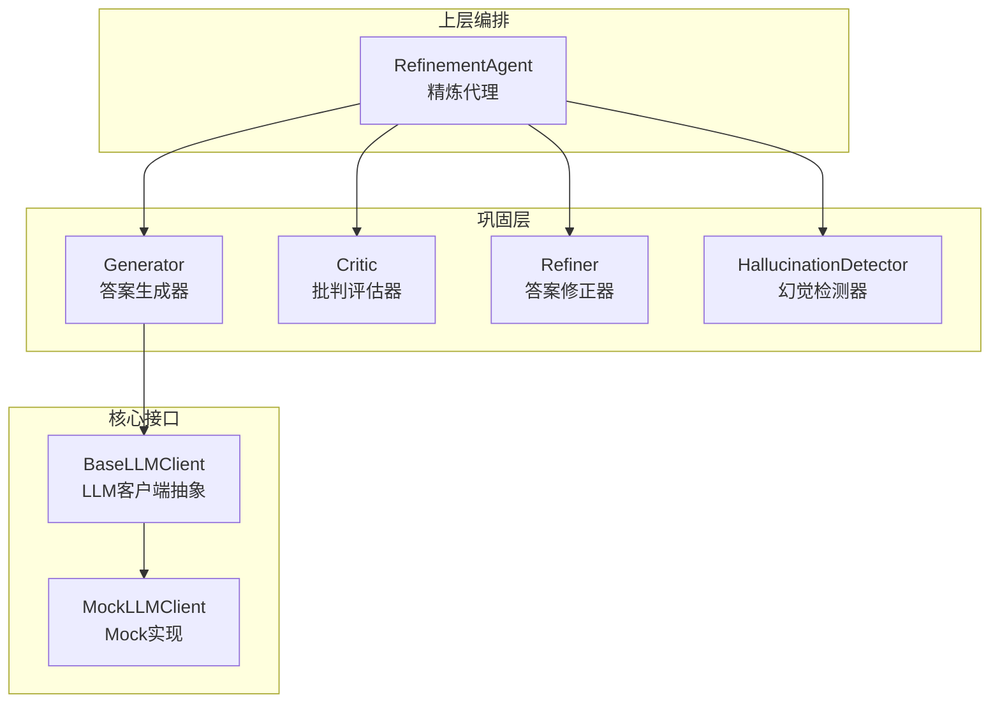
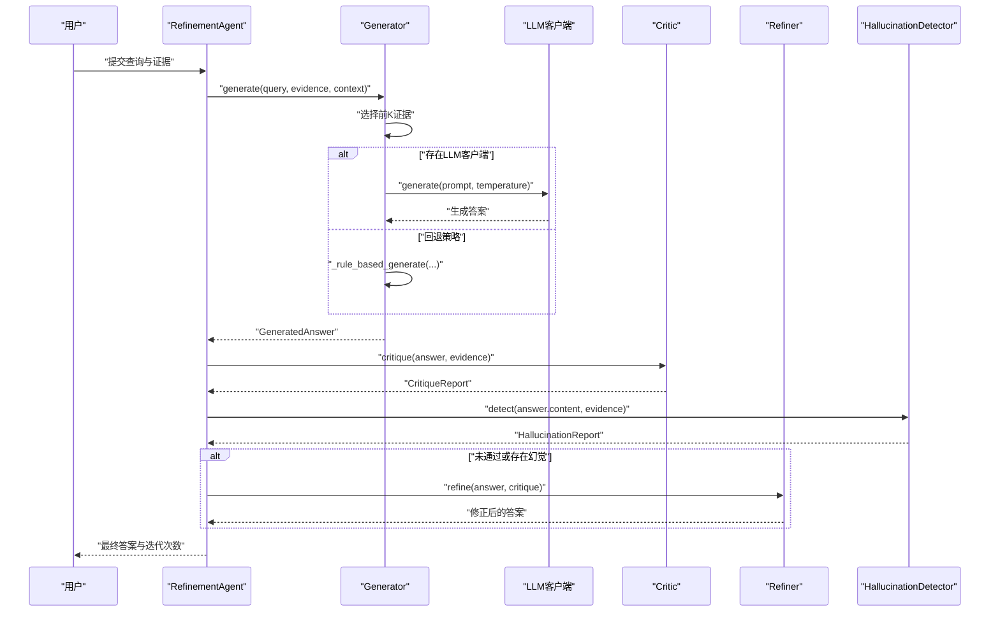
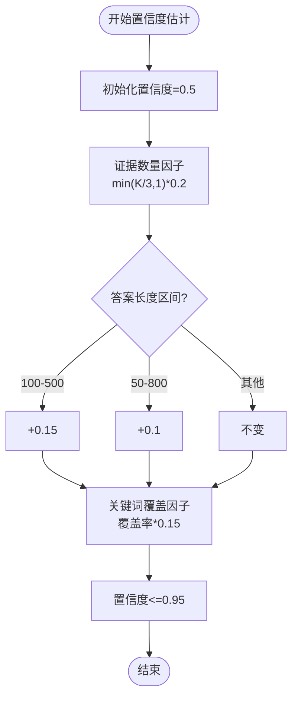
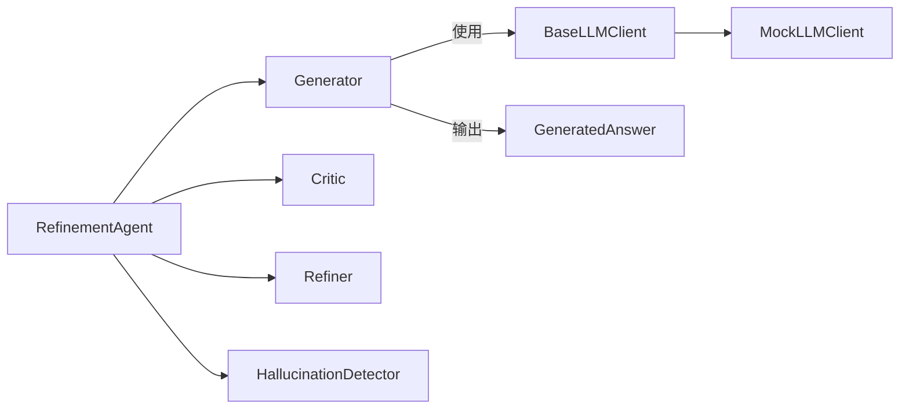

# 生成器组件

<cite>
**本文引用的文件**
- [src/refinement/generator.py](file://src/refinement/generator.py)
- [src/refinement/models.py](file://src/refinement/models.py)
- [src/refinement/agent.py](file://src/refinement/agent.py)
- [src/refinement/critic.py](file://src/refinement/critic.py)
- [src/refinement/refiner.py](file://src/refinement/refiner.py)
- [src/refinement/hallucination.py](file://src/refinement/hallucination.py)
- [src/core/llm/base.py](file://src/core/llm/base.py)
- [src/core/llm/mock.py](file://src/core/llm/mock.py)
- [src/memory/models.py](file://src/memory/models.py)
- [example/example_usage.py](file://example/example_usage.py)
- [src/core/config.py](file://src/core/config.py)
</cite>

## 目录
1. [简介](#简介)
2. [项目结构](#项目结构)
3. [核心组件](#核心组件)
4. [架构总览](#架构总览)
5. [详细组件分析](#详细组件分析)
6. [依赖分析](#依赖分析)
7. [性能考虑](#性能考虑)
8. [故障排查指南](#故障排查指南)
9. [结论](#结论)
10. [附录](#附录)

## 简介
本文件聚焦“生成器组件”，系统阐述 Generator 类的实现原理与答案生成算法，包括上下文理解、证据利用机制、提示工程与模板设计、输出格式化、置信度计算与引用标注、配置选项、性能优化与调试方法，并提供使用示例与最佳实践。

## 项目结构
生成器位于“巩固层”（Refinement）模块，与“批判器”“修正器”“幻觉检测器”共同构成“生成-评估-修正-验证”的闭环；同时，生成器可由“精炼代理”统一编排，接入记忆与检索结果，形成端到端的问答流水线。

图表来源
- [src/refinement/generator.py:15-23](file://src/refinement/generator.py#L15-L23)
- [src/refinement/agent.py:16-60](file://src/refinement/agent.py#L16-L60)
- [src/core/llm/base.py:11-72](file://src/core/llm/base.py#L11-L72)
- [src/core/llm/mock.py:16-71](file://src/core/llm/mock.py#L16-L71)

章节来源
- [src/refinement/generator.py:1-208](file://src/refinement/generator.py#L1-L208)
- [src/refinement/agent.py:1-151](file://src/refinement/agent.py#L1-L151)

## 核心组件
- Generator：基于检索证据生成答案，支持 LLM 客户端注入与回退策略；内置提示词模板、证据截取、置信度估计与引用标注。
- GeneratedAnswer：生成答案的数据模型，包含内容、引用 ID 列表与置信度，以及扩展元数据字段。
- RefinementAgent：编排生成-批判-修正-验证流程，控制最大迭代次数与最低置信度阈值。
- 批判/修正/幻觉检测：对生成答案进行质量评估、证据支撑度检查与事实一致性校验。

章节来源
- [src/refinement/generator.py:15-208](file://src/refinement/generator.py#L15-L208)
- [src/refinement/models.py:19-26](file://src/refinement/models.py#L19-L26)
- [src/refinement/agent.py:16-128](file://src/refinement/agent.py#L16-L128)
- [src/refinement/critic.py:9-72](file://src/refinement/critic.py#L9-L72)
- [src/refinement/refiner.py:8-64](file://src/refinement/refiner.py#L8-L64)
- [src/refinement/hallucination.py:9-154](file://src/refinement/hallucination.py#L9-L154)

## 架构总览
生成器在“精炼代理”中被调用，接收查询、证据与上下文，先按证据数量与长度做初步筛选，再通过 LLM 生成答案；随后进入“批判-修正-验证”闭环，直至满足质量与置信度要求或达到最大迭代次数。

图表来源
- [src/refinement/agent.py:61-128](file://src/refinement/agent.py#L61-L128)
- [src/refinement/generator.py:67-101](file://src/refinement/generator.py#L67-L101)
- [src/refinement/critic.py:25-72](file://src/refinement/critic.py#L25-L72)
- [src/refinement/refiner.py:24-64](file://src/refinement/refiner.py#L24-L64)
- [src/refinement/hallucination.py:34-75](file://src/refinement/hallucination.py#L34-L75)

## 详细组件分析

### Generator 类实现与算法
- 初始化与依赖注入
  - 接收可选的 LLM 客户端；若为空则自动注入 Mock 实现，保证开发/演示可用。
  - 维护最大证据数量与生成温度参数，影响提示词构建与 LLM 采样多样性。
- 输入处理与证据选择
  - 当证据为空时，直接返回兜底答案与零置信度。
  - 对证据进行切片，限制最大使用数量，避免上下文过长与成本过高。
- LLM 生成路径
  - 将证据格式化为带编号的证据段，拼接至模板提示词；若提供上下文，将其前置到提示词。
  - 调用 LLM 的生成接口，传入温度参数，得到答案文本。
  - 基于证据数量、答案长度与关键词覆盖度估算置信度，并封装为 GeneratedAnswer。
- 规则回退路径
  - 若无 LLM 客户端，则采用规则化生成：拼接证据要点、添加兜底说明，并基于证据数量粗略估计置信度。
- 置信度计算
  - 初始置信度基线，叠加证据数量因子、答案长度适中性因子、查询词覆盖因子，上限约束，形成最终置信度。

图表来源
- [src/refinement/generator.py:67-101](file://src/refinement/generator.py#L67-L101)
- [src/refinement/generator.py:102-141](file://src/refinement/generator.py#L102-L141)
- [src/refinement/generator.py:142-174](file://src/refinement/generator.py#L142-L174)
- [src/refinement/generator.py:176-208](file://src/refinement/generator.py#L176-L208)

章节来源
- [src/refinement/generator.py:25-50](file://src/refinement/generator.py#L25-L50)
- [src/refinement/generator.py:67-101](file://src/refinement/generator.py#L67-L101)
- [src/refinement/generator.py:102-141](file://src/refinement/generator.py#L102-L141)
- [src/refinement/generator.py:142-174](file://src/refinement/generator.py#L142-L174)
- [src/refinement/generator.py:176-208](file://src/refinement/generator.py#L176-L208)

### 数据模型与引用标注
- GeneratedAnswer
  - 字段：内容、引用 ID 列表、置信度、元数据。
  - 引用 ID 通常与证据顺序一一对应，便于溯源与可视化。
- RefinementResult
  - 包含查询、答案、置信度、引用列表、幻觉报告、迭代次数与元数据，作为“精炼代理”的统一输出。

章节来源
- [src/refinement/models.py:19-26](file://src/refinement/models.py#L19-L26)
- [src/refinement/models.py:38-47](file://src/refinement/models.py#L38-L47)

### 上下文理解与证据利用机制
- 上下文注入
  - 若传入上下文字典，将其序列化后置于提示词头部，引导 LLM 在生成时结合上下文约束。
- 证据利用
  - 证据按顺序编号展示，生成器在提示词中明确要求“基于证据回答”“引用相关证据”，确保答案可追溯。
- 证据截断
  - 规则回退路径中对证据片段进行长度截断，避免冗长证据影响可读性与成本。

章节来源
- [src/refinement/generator.py:116-126](file://src/refinement/generator.py#L116-L126)
- [src/refinement/generator.py:112-114](file://src/refinement/generator.py#L112-L114)
- [src/refinement/generator.py:157-161](file://src/refinement/generator.py#L157-L161)

### 提示工程与模板设计
- 模板要素
  - 明确角色定位（专业问答助手）、生成约束（基于证据、清晰专业、引用证据）、证据块、问题、上下文。
- 模板复用
  - 通过字符串格式化将证据与查询注入模板，保证一致性与可维护性。
- 上下文前置
  - 将上下文信息置于证据之前，有助于 LLM 更贴合业务语境生成答案。

章节来源
- [src/refinement/generator.py:52-65](file://src/refinement/generator.py#L52-L65)
- [src/refinement/generator.py:117-125](file://src/refinement/generator.py#L117-L125)

### 输出格式化与引用标注
- 结构化输出
  - LLM 生成文本作为最终内容；规则回退路径生成结构化要点列表。
- 引用标注
  - 生成器为每个证据分配引用 ID，便于后续可视化与溯源。
- 元数据扩展
  - GeneratedAnswer 支持附加元数据，可用于记录生成策略、迭代标记等。

章节来源
- [src/refinement/generator.py:136-140](file://src/refinement/generator.py#L136-L140)
- [src/refinement/generator.py:170-173](file://src/refinement/generator.py#L170-L173)
- [src/refinement/models.py](file://src/refinement/models.py#L25)

### 置信度计算方法
- 影响因素
  - 证据数量：证据越多，置信度越高，但存在上限。
  - 答案长度：适中长度（如 100-500 字）加分，过短或过长扣分。
  - 关键词覆盖：查询词在答案中的覆盖率越高，置信度越高。
- 计算流程
  - 以基线置信度起步，累加各因子，最终裁剪至上限。

图表来源
- [src/refinement/generator.py:176-208](file://src/refinement/generator.py#L176-L208)

章节来源
- [src/refinement/generator.py:176-208](file://src/refinement/generator.py#L176-L208)

### 与“精炼代理”的集成
- RefinementAgent 负责：
  - 初始化 Generator/Critic/Refiner/HallucinationDetector。
  - 调用 Generator 生成初始答案。
  - 通过 Critic 与 HallucinationDetector 进行质量与事实性评估。
  - 若未通过，调用 Refiner 修正答案并调整置信度。
  - 控制最大迭代次数与最低置信度阈值，决定最终输出。

章节来源
- [src/refinement/agent.py:48-128](file://src/refinement/agent.py#L48-L128)

### LLM 客户端抽象与 Mock 实现
- 抽象接口
  - BaseLLMClient 定义同步生成、向量化、批处理与工具函数（如 token 估算、提示词构造）。
- Mock 实现
  - MockLLMClient 提供确定性响应与向量，便于测试与演示；支持“带记忆”的变体记录调用历史。
- 依赖注入
  - Generator 默认注入 Mock，也可注入真实 LLM 客户端以获得真实生成能力。

章节来源
- [src/core/llm/base.py:11-72](file://src/core/llm/base.py#L11-L72)
- [src/core/llm/base.py:138-178](file://src/core/llm/base.py#L138-L178)
- [src/core/llm/mock.py:16-71](file://src/core/llm/mock.py#L16-L71)
- [src/core/llm/mock.py:137-204](file://src/core/llm/mock.py#L137-L204)

## 依赖分析
- 组件耦合
  - Generator 依赖 LLM 客户端抽象，支持注入式替换；默认回退到 Mock。
  - 与 GeneratedAnswer 数据模型强绑定，输出标准化。
  - 与 RefinementAgent 协同工作，参与闭环评估与修正。
- 外部依赖
  - LLM 提供商可通过配置切换（Mock/OpenAI/Ollama/vLLM/Azure/Claude），通过统一配置类管理。
- 潜在循环依赖
  - 通过 TYPE_CHECKING 导入避免运行时循环导入；整体结构清晰，无循环依赖风险。

图表来源
- [src/refinement/generator.py:7-12](file://src/refinement/generator.py#L7-L12)
- [src/refinement/models.py:19-26](file://src/refinement/models.py#L19-L26)
- [src/refinement/agent.py:48-56](file://src/refinement/agent.py#L48-L56)
- [src/core/llm/base.py:11-72](file://src/core/llm/base.py#L11-L72)
- [src/core/llm/mock.py:16-71](file://src/core/llm/mock.py#L16-L71)

章节来源
- [src/refinement/generator.py:7-12](file://src/refinement/generator.py#L7-L12)
- [src/refinement/agent.py:48-56](file://src/refinement/agent.py#L48-L56)
- [src/core/llm/base.py:11-72](file://src/core/llm/base.py#L11-L72)
- [src/core/llm/mock.py:16-71](file://src/core/llm/mock.py#L16-L71)

## 性能考虑
- 证据数量控制
  - 通过最大证据数量参数限制上下文长度，降低 token 消耗与延迟。
- 温度参数
  - 适度降低温度可减少创造性偏差，提升答案稳定性与可重复性。
- 规则回退
  - 在无 LLM 或资源受限时，规则回退路径可快速给出结构化要点，兼顾性能与可用性。
- Token 估算
  - 使用统一的 token 估算工具辅助预算与成本控制。
- 配置优化
  - 生产环境可适当提高最大迭代次数与重排序开关，平衡质量与性能。

章节来源
- [src/refinement/generator.py:28-30](file://src/refinement/generator.py#L28-L30)
- [src/core/llm/base.py:73-84](file://src/core/llm/base.py#L73-L84)
- [src/core/config.py:389-396](file://src/core/config.py#L389-L396)

## 故障排查指南
- 无证据场景
  - 现象：直接返回兜底答案，置信度为 0。
  - 处理：确认检索阶段是否正确返回证据；必要时放宽检索阈值。
- 答案过短或过长
  - 现象：置信度偏低。
  - 处理：调整证据数量与长度，或优化提示词引导答案结构。
- 关键词覆盖不足
  - 现象：查询词未充分体现在答案中。
  - 处理：优化检索与证据组织，确保关键信息完整呈现。
- 幻觉检测触发
  - 现象：事实一致性或证据支撑度不足。
  - 处理：增加证据数量与来源多样性，必要时开启重排序与 HyDE。
- LLM 客户端缺失
  - 现象：回退到规则回退路径。
  - 处理：注入真实 LLM 客户端或检查依赖安装。

章节来源
- [src/refinement/generator.py:84-90](file://src/refinement/generator.py#L84-L90)
- [src/refinement/generator.py:176-208](file://src/refinement/generator.py#L176-L208)
- [src/refinement/hallucination.py:34-75](file://src/refinement/hallucination.py#L34-L75)
- [src/refinement/agent.py:96-118](file://src/refinement/agent.py#L96-L118)

## 结论
Generator 通过“证据选择-提示工程-LLM 生成-置信度估计-引用标注”的完整流程，实现了可控、可追溯、可评估的答案生成。其与批判、修正、幻觉检测的闭环配合，进一步提升了答案质量与可靠性。通过合理的配置与性能优化策略，可在不同场景下取得稳定而高效的问答效果。

## 附录

### 使用示例与最佳实践
- 快速上手
  - 使用示例脚本演示从感知、记忆、检索到精炼与响应的完整流程，可直接运行体验。
- 最佳实践
  - 明确提示词模板与上下文注入策略，确保 LLM 严格基于证据生成。
  - 控制证据数量与长度，结合规则回退路径提升鲁棒性。
  - 在生产环境启用重排序与 HyDE，提高检索质量与生成稳定性。
  - 通过配置类集中管理 LLM 提供商、温度、最大 token 等参数，便于运维与迁移。

章节来源
- [example/example_usage.py:139-173](file://example/example_usage.py#L139-L173)
- [src/core/config.py:389-396](file://src/core/config.py#L389-L396)