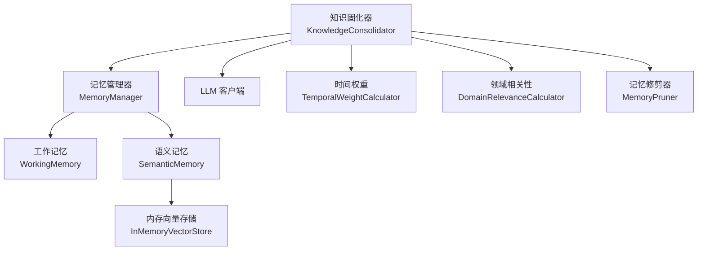
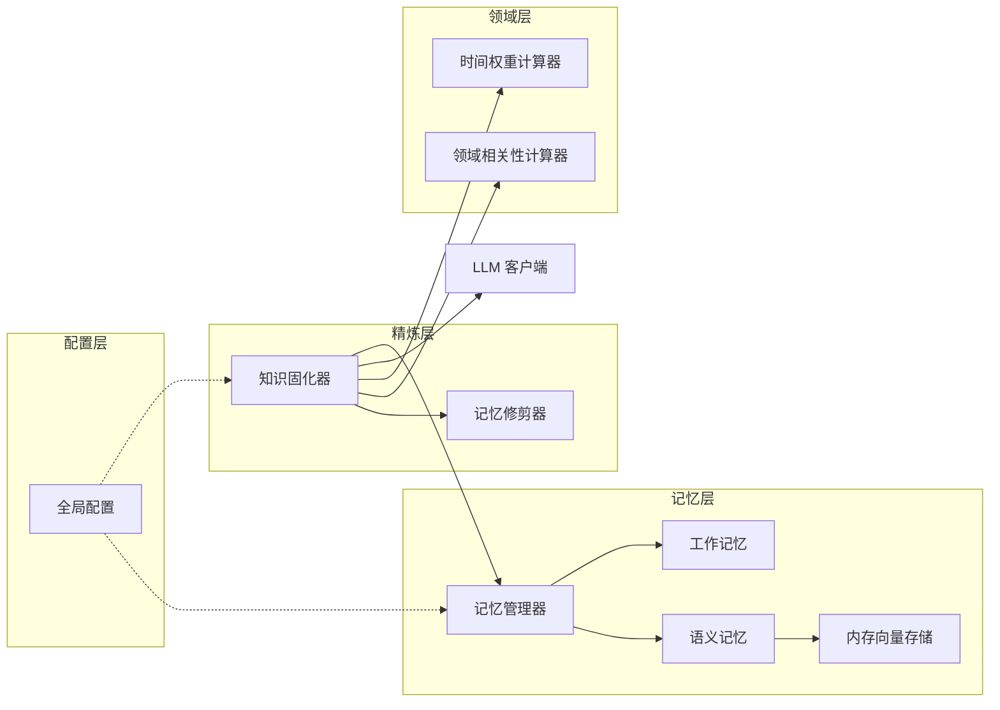
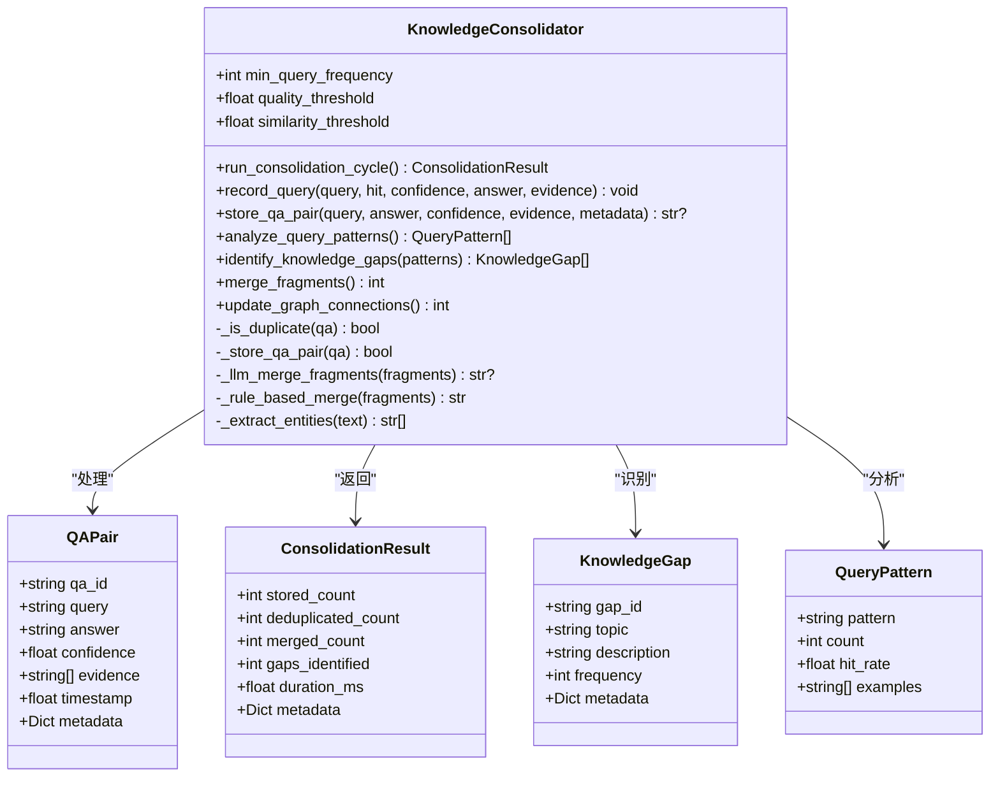
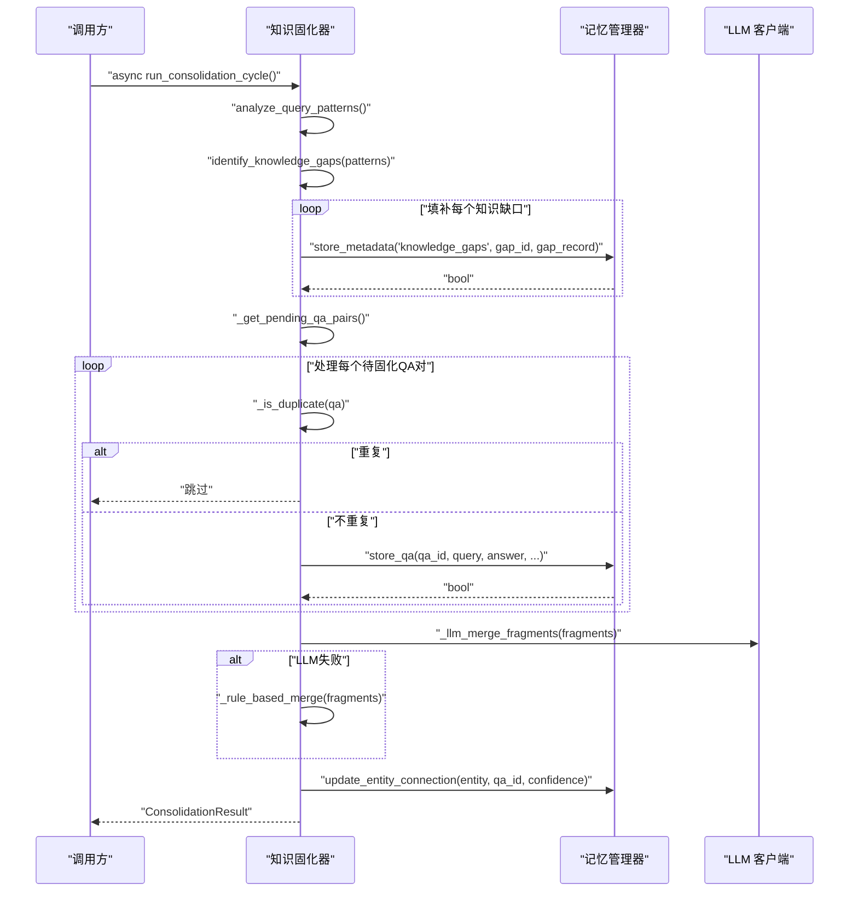
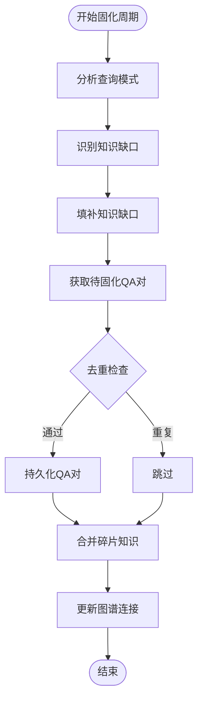
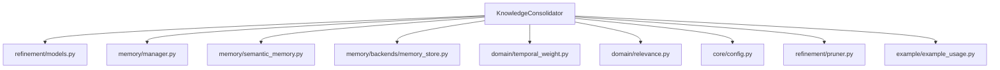

# 知识固化系统

<cite>
**本文档引用的文件**
- [consolidator.py](file://src/refinement/consolidator.py)
- [models.py（精炼）](file://src/refinement/models.py)
- [manager.py](file://src/memory/manager.py)
- [memory_store.py](file://src/memory/backends/memory_store.py)
- [config.py](file://src/core/config.py)
- [temporal_weight.py](file://src/domain/temporal_weight.py)
- [relevance.py](file://src/domain/relevance.py)
- [pruner.py](file://src/refinement/pruner.py)
- [working_memory.py](file://src/memory/working_memory.py)
- [semantic_memory.py](file://src/memory/semantic_memory.py)
- [example_usage.py](file://example/example_usage.py)
- [metrics.py](file://src/knowledge_evolution/metrics.py)
- [models.py（知识演化）](file://src/knowledge_evolution/models.py)
</cite>

## 目录
1. [简介](#简介)
2. [项目结构](#项目结构)
3. [核心组件](#核心组件)
4. [架构总览](#架构总览)
5. [详细组件分析](#详细组件分析)
6. [依赖关系分析](#依赖关系分析)
7. [性能考量](#性能考量)
8. [故障排查指南](#故障排查指南)
9. [结论](#结论)
10. [附录](#附录)

## 简介
知识固化系统是精炼层的核心组件之一，负责将高质量问答对（QA）进行持久化、去重与合并，识别知识缺口并自动补充，同时维护知识图谱的连接关系。其目标是将临时信息转化为长期稳定的知识，并建立知识之间的关联，从而提升检索与推理的准确性与时效性。

## 项目结构
围绕知识固化器的相关模块分布如下：
- 精炼层：consolidator.py、models.py（精炼）、agent.py、pruner.py
- 记忆层：manager.py、working_memory.py、semantic_memory.py、backends/memory_store.py
- 领域层：temporal_weight.py、relevance.py
- 配置层：core/config.py
- 示例：example/example_usage.py
- 知识演化与监控：knowledge_evolution/metrics.py、knowledge_evolution/models.py

**图表来源**
- [consolidator.py:53-84](file://src/refinement/consolidator.py#L53-L84)
- [manager.py:44-47](file://src/memory/manager.py#L44-L47)
- [semantic_memory.py:21-49](file://src/memory/semantic_memory.py#L21-L49)
- [memory_store.py:20-38](file://src/memory/backends/memory_store.py#L20-L38)
- [temporal_weight.py:47-52](file://src/domain/temporal_weight.py#L47-L52)
- [relevance.py:29-41](file://src/domain/relevance.py#L29-L41)
- [pruner.py:20-40](file://src/refinement/pruner.py#L20-L40)

**章节来源**
- [consolidator.py:53-84](file://src/refinement/consolidator.py#L53-L84)
- [manager.py:44-47](file://src/memory/manager.py#L44-L47)
- [semantic_memory.py:21-49](file://src/memory/semantic_memory.py#L21-L49)
- [memory_store.py:20-38](file://src/memory/backends/memory_store.py#L20-L38)
- [temporal_weight.py:47-52](file://src/domain/temporal_weight.py#L47-L52)
- [relevance.py:29-41](file://src/domain/relevance.py#L29-L41)
- [pruner.py:20-40](file://src/refinement/pruner.py#L20-L40)

## 核心组件
- 知识固化器（KnowledgeConsolidator）
  - 分析查询模式：统计查询频率与命中率，提取模式并排序
  - 识别知识缺口：对低命中率且高频的模式标记缺口
  - 填补知识缺口：将缺口记录持久化，便于后续处理
  - 去重与合并：基于缓存与相似度阈值去重，对相似片段进行合并
  - 更新图谱连接：从答案中抽取实体，更新图谱连接强度
- 关键流程
  - 运行固化周期：串行执行模式分析、缺口识别、QA固化、碎片合并、图谱更新
  - 记录查询：将命中且高置信度的回答加入待固化队列
  - 存储QA对：若满足质量阈值且非重复，则持久化
- 算法要点
  - 查询模式提取：去除停用词与标点，提取关键词组合作为模式
  - 去重策略：以查询哈希为键，缓存中保留更高置信度的版本
  - 合并策略：优先使用 LLM 合并，失败时采用规则合并（保留高置信度内容并附加补充信息）
  - 实体抽取：中文连续汉字与英文首字母大写短语作为候选实体

**章节来源**
- [consolidator.py:105-160](file://src/refinement/consolidator.py#L105-L160)
- [consolidator.py:162-216](file://src/refinement/consolidator.py#L162-L216)
- [consolidator.py:217-248](file://src/refinement/consolidator.py#L217-L248)
- [consolidator.py:250-281](file://src/refinement/consolidator.py#L250-L281)
- [consolidator.py:401-441](file://src/refinement/consolidator.py#L401-L441)
- [consolidator.py:282-322](file://src/refinement/consolidator.py#L282-L322)
- [consolidator.py:323-357](file://src/refinement/consolidator.py#L323-L357)

## 架构总览
知识固化系统与记忆管理、领域权重、相关性计算、记忆修剪器协同工作，形成从临时信息到长期知识的转化闭环。

**图表来源**
- [consolidator.py:53-84](file://src/refinement/consolidator.py#L53-L84)
- [manager.py:44-47](file://src/memory/manager.py#L44-L47)
- [semantic_memory.py:21-49](file://src/memory/semantic_memory.py#L21-L49)
- [memory_store.py:20-38](file://src/memory/backends/memory_store.py#L20-L38)
- [temporal_weight.py:47-52](file://src/domain/temporal_weight.py#L47-L52)
- [relevance.py:29-41](file://src/domain/relevance.py#L29-L41)
- [pruner.py:20-40](file://src/refinement/pruner.py#L20-L40)
- [config.py:278-294](file://src/core/config.py#L278-L294)

**章节来源**
- [consolidator.py:53-84](file://src/refinement/consolidator.py#L53-L84)
- [manager.py:44-47](file://src/memory/manager.py#L44-L47)
- [semantic_memory.py:21-49](file://src/memory/semantic_memory.py#L21-L49)
- [memory_store.py:20-38](file://src/memory/backends/memory_store.py#L20-L38)
- [temporal_weight.py:47-52](file://src/domain/temporal_weight.py#L47-L52)
- [relevance.py:29-41](file://src/domain/relevance.py#L29-L41)
- [pruner.py:20-40](file://src/refinement/pruner.py#L20-L40)
- [config.py:278-294](file://src/core/config.py#L278-L294)

## 详细组件分析

### 知识固化器（KnowledgeConsolidator）
知识固化器是系统的核心，负责QA对的提取、去重、合并与持久化，同时识别知识缺口并更新知识图谱连接。

**图表来源**
- [consolidator.py:41-160](file://src/refinement/consolidator.py#L41-L160)
- [consolidator.py:18-39](file://src/refinement/consolidator.py#L18-L39)
- [models.py（精炼）:50-66](file://src/refinement/models.py#L50-L66)

**章节来源**
- [consolidator.py:41-160](file://src/refinement/consolidator.py#L41-L160)
- [models.py（精炼）:50-66](file://src/refinement/models.py#L50-L66)

### 异步执行流程（run_consolidation_cycle）
知识固化器支持异步运行固化周期，避免阻塞主线程。该流程包含查询模式分析、知识缺口识别、QA固化、碎片合并与图谱更新。

**图表来源**
- [consolidator.py:105-160](file://src/refinement/consolidator.py#L105-L160)
- [consolidator.py:250-281](file://src/refinement/consolidator.py#L250-L281)
- [consolidator.py:282-321](file://src/refinement/consolidator.py#L282-L321)
- [consolidator.py:323-357](file://src/refinement/consolidator.py#L323-L357)
- [models.py（精炼）:50-66](file://src/refinement/models.py#L50-L66)

**章节来源**
- [consolidator.py:105-160](file://src/refinement/consolidator.py#L105-L160)
- [consolidator.py:250-281](file://src/refinement/consolidator.py#L250-L281)
- [consolidator.py:282-321](file://src/refinement/consolidator.py#L282-L321)
- [consolidator.py:323-357](file://src/refinement/consolidator.py#L323-L357)
- [models.py（精炼）:50-66](file://src/refinement/models.py#L50-L66)

### 知识固化算法
系统采用多阶段算法实现高质量知识固化：

**图表来源**
- [consolidator.py:105-160](file://src/refinement/consolidator.py#L105-L160)
- [consolidator.py:162-216](file://src/refinement/consolidator.py#L162-L216)
- [consolidator.py:217-248](file://src/refinement/consolidator.py#L217-L248)
- [consolidator.py:250-281](file://src/refinement/consolidator.py#L250-L281)
- [consolidator.py:401-441](file://src/refinement/consolidator.py#L401-L441)
- [consolidator.py:282-322](file://src/refinement/consolidator.py#L282-L322)
- [consolidator.py:323-357](file://src/refinement/consolidator.py#L323-L357)

**章节来源**
- [consolidator.py:105-160](file://src/refinement/consolidator.py#L105-L160)
- [consolidator.py:162-216](file://src/refinement/consolidator.py#L162-L216)
- [consolidator.py:217-248](file://src/refinement/consolidator.py#L217-L248)
- [consolidator.py:250-281](file://src/refinement/consolidator.py#L250-L281)
- [consolidator.py:401-441](file://src/refinement/consolidator.py#L401-L441)
- [consolidator.py:282-322](file://src/refinement/consolidator.py#L282-L322)
- [consolidator.py:323-357](file://src/refinement/consolidator.py#L323-L357)

### 知识存储格式与检索优化
- 存储格式
  - QA对：包含qa_id、query、answer、confidence、evidence、timestamp、metadata
  - 知识缺口：包含gap_id、topic、description、frequency、metadata
  - 查询模式：包含pattern、count、hit_rate、examples
- 检索优化
  - 语义记忆采用内存向量存储，适合小规模场景；生产环境建议替换为外部向量数据库
  - 记忆管理器支持统一存储，便于跨层检索
  - 时间权重与领域相关性结合，平衡知识时效性与稳定性

**章节来源**
- [consolidator.py:18-39](file://src/refinement/consolidator.py#L18-L39)
- [models.py（精炼）:50-66](file://src/refinement/models.py#L50-L66)
- [manager.py:44-47](file://src/memory/manager.py#L44-L47)
- [semantic_memory.py:21-49](file://src/memory/semantic_memory.py#L21-L49)
- [memory_store.py:20-38](file://src/memory/backends/memory_store.py#L20-L38)

### 知识固化与记忆管理系统的集成
- 记忆管理器提供统一的存储接口，支持QA对的持久化与检索
- 语义记忆模块负责向量存储与检索，支持混合搜索
- 内存向量存储模块提供基于内存的向量与图存储实现
- 记忆修剪器与知识固化器协同工作，维持知识库质量

**章节来源**
- [manager.py:52-123](file://src/memory/manager.py#L52-L123)
- [semantic_memory.py:50-79](file://src/memory/semantic_memory.py#L50-L79)
- [memory_store.py:41-141](file://src/memory/backends/memory_store.py#L41-L141)
- [pruner.py:41-69](file://src/refinement/pruner.py#L41-L69)

## 依赖关系分析
知识固化器与多个模块存在紧密依赖关系，形成完整的知识处理链路。

**图表来源**
- [consolidator.py:12-15](file://src/refinement/consolidator.py#L12-L15)
- [manager.py:8-14](file://src/memory/manager.py#L8-L14)
- [semantic_memory.py:8-9](file://src/memory/semantic_memory.py#L8-L9)
- [memory_store.py:13-17](file://src/memory/backends/memory_store.py#L13-L17)
- [temporal_weight.py:7-11](file://src/domain/temporal_weight.py#L7-L11)
- [relevance.py:13](file://src/domain/relevance.py#L13)
- [config.py:7-12](file://src/core/config.py#L7-L12)
- [pruner.py:6](file://src/refinement/pruner.py#L6)
- [example_usage.py:7](file://example/example_usage.py#L7)

**章节来源**
- [consolidator.py:12-15](file://src/refinement/consolidator.py#L12-L15)
- [manager.py:8-14](file://src/memory/manager.py#L8-L14)
- [semantic_memory.py:8-9](file://src/memory/semantic_memory.py#L8-L9)
- [memory_store.py:13-17](file://src/memory/backends/memory_store.py#L13-L17)
- [temporal_weight.py:7-11](file://src/domain/temporal_weight.py#L7-L11)
- [relevance.py:13](file://src/domain/relevance.py#L13)
- [config.py:7-12](file://src/core/config.py#L7-L12)
- [pruner.py:6](file://src/refinement/pruner.py#L6)
- [example_usage.py:7](file://example/example_usage.py#L7)

## 性能考量
- 缓存与内存
  - 巩固器内置 QA 缓存，限制缓存大小并淘汰低置信度条目，减少重复处理与存储压力
- 检索与存储
  - 记忆管理器的语义记忆采用内存向量存储，适合小规模场景；生产环境建议替换为外部向量数据库
- 时间权重
  - 合理设置衰减率与分层权重，平衡知识时效性与稳定性
- 并发与异步
  - 巩固器支持异步运行固化周期，可在后台任务中执行，避免阻塞主线程

**章节来源**
- [consolidator.py:482-502](file://src/refinement/consolidator.py#L482-L502)
- [manager.py:44-47](file://src/memory/manager.py#L44-L47)
- [temporal_weight.py:211-227](file://src/domain/temporal_weight.py#L211-L227)

## 故障排查指南
- 巩固结果为空
  - 检查查询日志是否足够，确认最小查询频率阈值设置是否合理
  - 确认质量阈值与相似度阈值是否过高导致 QA 被过滤
- 无法持久化
  - 检查记忆管理器是否正确初始化，存储后端是否可用
  - 确认 QA 对的置信度是否满足质量阈值
- 图谱连接未更新
  - 检查实体抽取逻辑是否正确，确认记忆管理器具备更新图谱连接的接口
- 性能问题
  - 关注缓存大小与淘汰策略，适当调整缓存上限与淘汰数量
  - 评估向量存储后端的性能瓶颈，必要时迁移至外部数据库

**章节来源**
- [consolidator.py:105-160](file://src/refinement/consolidator.py#L105-L160)
- [consolidator.py:516-536](file://src/refinement/consolidator.py#L516-L536)
- [consolidator.py:323-357](file://src/refinement/consolidator.py#L323-L357)
- [manager.py:52-123](file://src/memory/manager.py#L52-L123)

## 结论
知识固化器通过查询模式分析、知识缺口识别、QA 去重与合并、图谱连接更新等机制，实现了从临时信息到长期知识的转化。结合时间权重与领域相关性，巩固器能够有效维护知识的时效性与准确性，并通过与记忆修剪器的协作，持续优化知识库的整体质量。在工程实践中，建议根据业务场景调整阈值与策略，并结合外部存储后端提升性能与可靠性。

## 附录
- 质量评估与效果监控
  - 知识演化系统提供健康度指标计算，包括规模、新鲜度、质量、连通性四个维度
  - 支持实时更新与定时更新两种模式，跟踪知识库更新成功率与质量
  - 通过异常检测机制实现智能化的健康度预警

**章节来源**
- [metrics.py:424-576](file://src/knowledge_evolution/metrics.py#L424-L576)
- [models.py（知识演化）:194-310](file://src/knowledge_evolution/models.py#L194-L310)