# 知识固化系统

<cite>
**本文档引用的文件**
- [consolidator.py](file://src/refinement/consolidator.py)
- [models.py](file://src/refinement/models.py)
- [manager.py](file://src/memory/manager.py)
- [memory_store.py](file://src/memory/backends/memory_store.py)
- [config.py](file://src/core/config.py)
- [temporal_weight.py](file://src/domain/temporal_weight.py)
- [relevance.py](file://src/domain/relevance.py)
- [pruner.py](file://src/refinement/pruner.py)
- [working_memory.py](file://src/memory/working_memory.py)
- [semantic_memory.py](file://src/memory/semantic_memory.py)
- [example_usage.py](file://example/example_usage.py)
- [updater.py](file://src/knowledge_evolution/updater.py)
- [scheduler.py](file://src/knowledge_evolution/scheduler.py)
</cite>

## 目录
1. [简介](#简介)
2. [项目结构](#项目结构)
3. [核心组件](#核心组件)
4. [架构总览](#架构总览)
5. [详细组件分析](#详细组件分析)
6. [依赖关系分析](#依赖关系分析)
7. [性能考量](#性能考量)
8. [故障排查指南](#故障排查指南)
9. [结论](#结论)
10. [附录](#附录)

## 简介
知识固化系统是 NecoRAG 精炼层的核心组件之一，负责将高质量问答对（QA）进行持久化、去重与合并，识别知识缺口并自动补充，同时维护知识图谱的连接关系。其目标是将临时信息转化为长期稳定的知识，并建立知识之间的关联，从而提升检索与推理的准确性与时效性。

## 项目结构
围绕知识固化器的相关模块分布如下：
- 精炼层：consolidator.py、models.py、agent.py、pruner.py
- 记忆层：manager.py、working_memory.py、semantic_memory.py、backends/memory_store.py
- 领域层：temporal_weight.py、relevance.py
- 配置层：core/config.py
- 示例：example/example_usage.py
- 知识演化：updater.py、scheduler.py

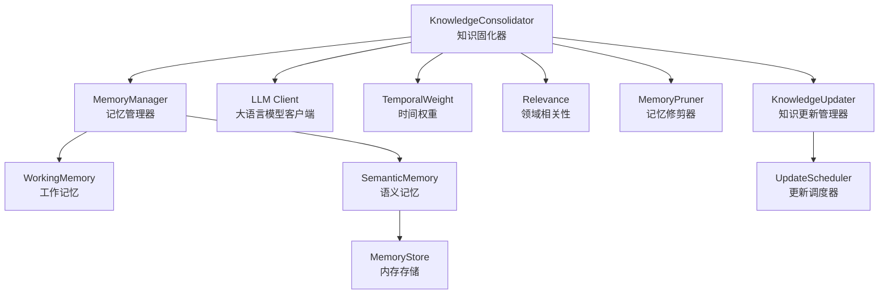

**图表来源**
- [consolidator.py:53-84](file://src/refinement/consolidator.py#L53-L84)
- [manager.py:44-47](file://src/memory/manager.py#L44-L47)
- [semantic_memory.py:21-49](file://src/memory/semantic_memory.py#L21-L49)
- [memory_store.py:20-38](file://src/memory/backends/memory_store.py#L20-L38)
- [temporal_weight.py:47-52](file://src/domain/temporal_weight.py#L47-L52)
- [relevance.py:29-41](file://src/domain/relevance.py#L29-L41)

## 核心组件
知识固化系统由多个核心组件协同工作，形成完整的知识固化流程：

### KnowledgeConsolidator 类
知识固化器是系统的核心，负责：
- 分析查询模式并识别高频未命中查询
- 自动补充知识缺口
- 合并碎片化知识
- 更新过时信息
- 持久化高质量 QA 对

### MemoryManager 类
统一管理三层记忆：
- L1 工作记忆（短期存储）
- L2 语义记忆（向量存储）
- L3 情景图谱（关系存储）

### MemoryPruner 类
模拟猫的梳理行为，清理噪声数据、强化重要连接、保持知识时效性。

**章节来源**
- [consolidator.py:41-84](file://src/refinement/consolidator.py#L41-L84)
- [manager.py:20-51](file://src/memory/manager.py#L20-L51)
- [pruner.py:10-40](file://src/refinement/pruner.py#L10-L40)

## 架构总览
知识固化系统采用分层架构设计，各层职责明确，通过接口契约实现松耦合集成。

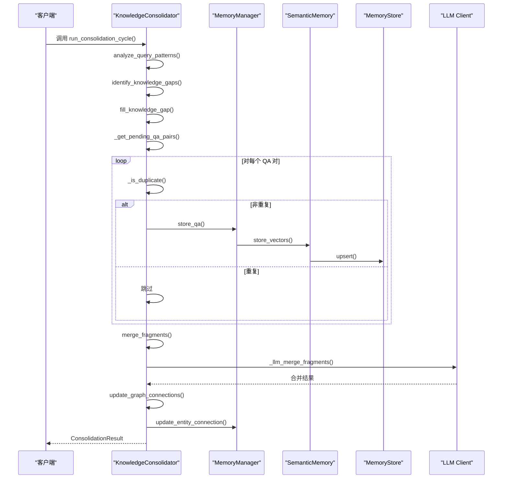

**图表来源**
- [consolidator.py:105-160](file://src/refinement/consolidator.py#L105-L160)
- [consolidator.py:516-536](file://src/refinement/consolidator.py#L516-L536)
- [manager.py:52-123](file://src/memory/manager.py#L52-L123)
- [semantic_memory.py:50-79](file://src/memory/semantic_memory.py#L50-L79)
- [memory_store.py:41-54](file://src/memory/backends/memory_store.py#L41-L54)

## 详细组件分析

### KnowledgeConsolidator 类详解

#### 核心数据结构
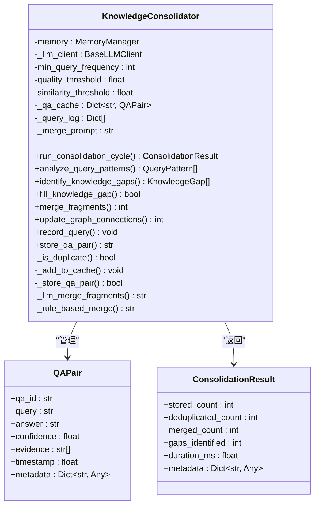

**图表来源**
- [consolidator.py:18-39](file://src/refinement/consolidator.py#L18-L39)
- [consolidator.py:41-160](file://src/refinement/consolidator.py#L41-L160)

#### 查询模式分析机制
知识固化器通过分析查询日志中的查询模式，识别高频未命中的查询模式：

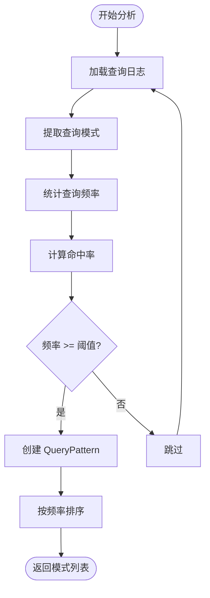

**图表来源**
- [consolidator.py:162-215](file://src/refinement/consolidator.py#L162-L215)

#### 知识缺口识别与填补
系统通过查询模式分析识别知识缺口，并自动填补：

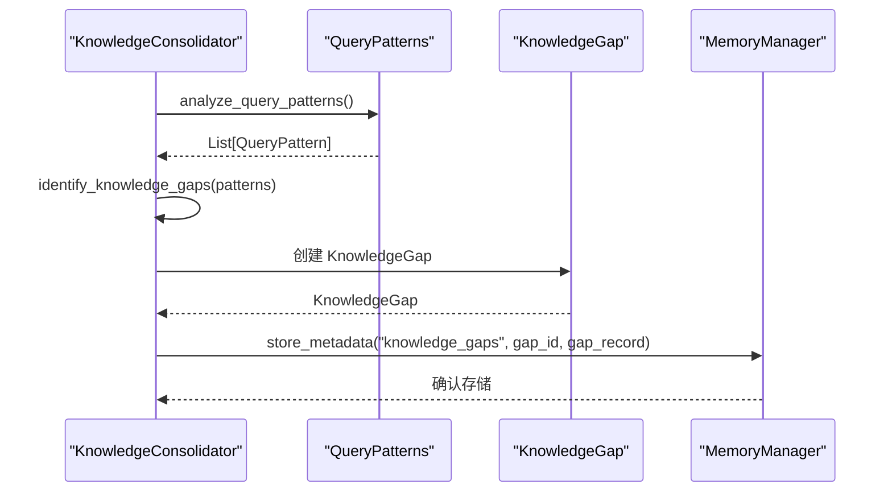

**图表来源**
- [consolidator.py:217-281](file://src/refinement/consolidator.py#L217-L281)

#### QA 对去重与合并机制
系统采用多层去重策略和智能合并算法：

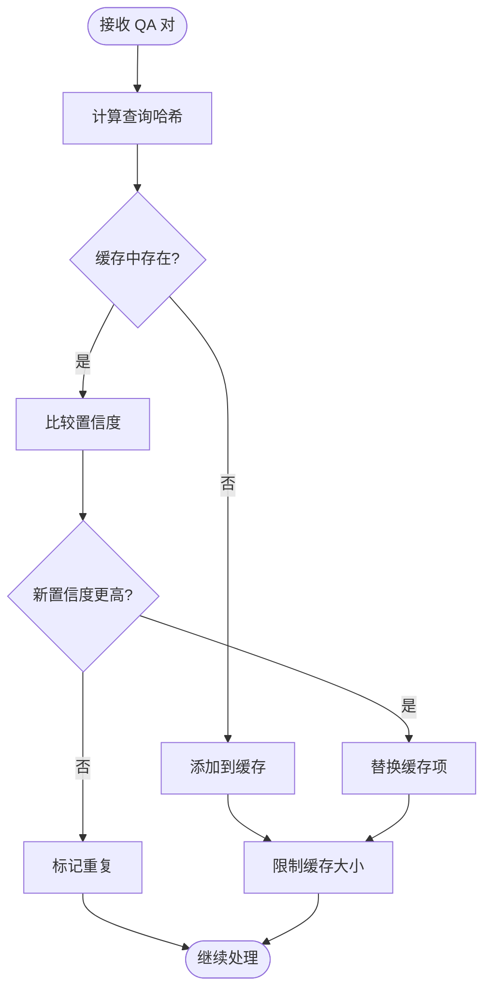

**图表来源**
- [consolidator.py:466-502](file://src/refinement/consolidator.py#L466-L502)

#### 知识合并策略
系统提供基于 LLM 的智能合并和基于规则的合并两种策略：

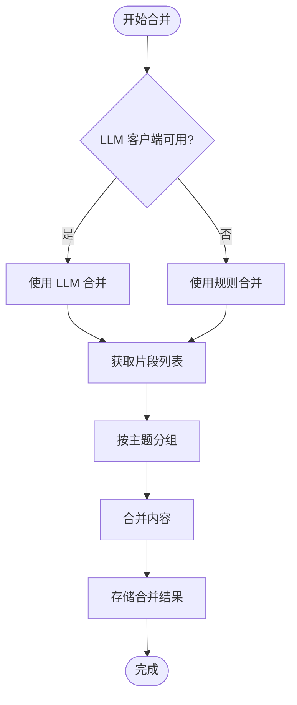

**图表来源**
- [consolidator.py:282-322](file://src/refinement/consolidator.py#L282-L322)
- [consolidator.py:567-617](file://src/refinement/consolidator.py#L567-L617)

**章节来源**
- [consolidator.py:18-659](file://src/refinement/consolidator.py#L18-L659)

### MemoryManager 类详解

#### 记忆层次管理
记忆管理器统一管理三层记忆系统：

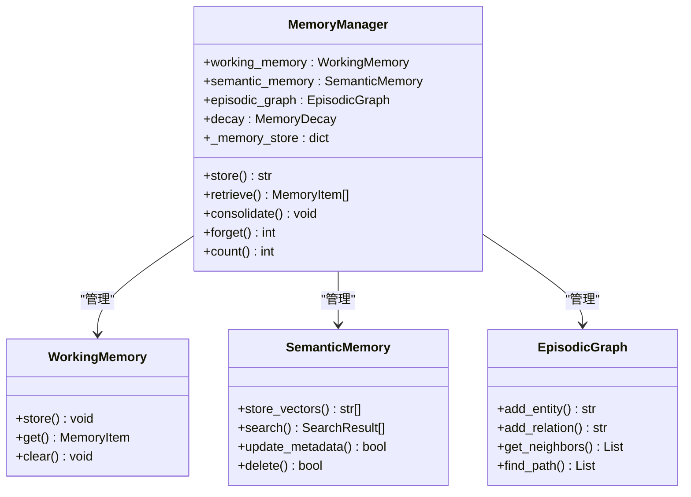

**图表来源**
- [manager.py:20-212](file://src/memory/manager.py#L20-L212)

#### 记忆存储流程
记忆存储采用多层同步策略：

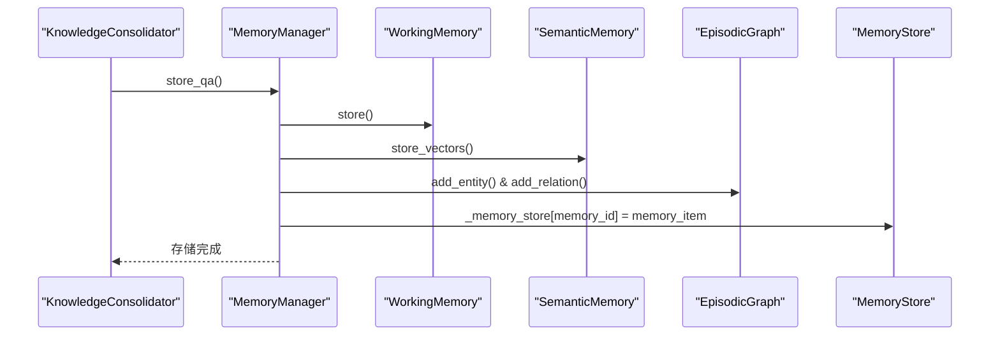

**图表来源**
- [manager.py:52-123](file://src/memory/manager.py#L52-L123)

**章节来源**
- [manager.py:20-212](file://src/memory/manager.py#L20-L212)

### 领域权重与相关性系统

#### 时间权重计算
系统提供多种时间权重计算方法：

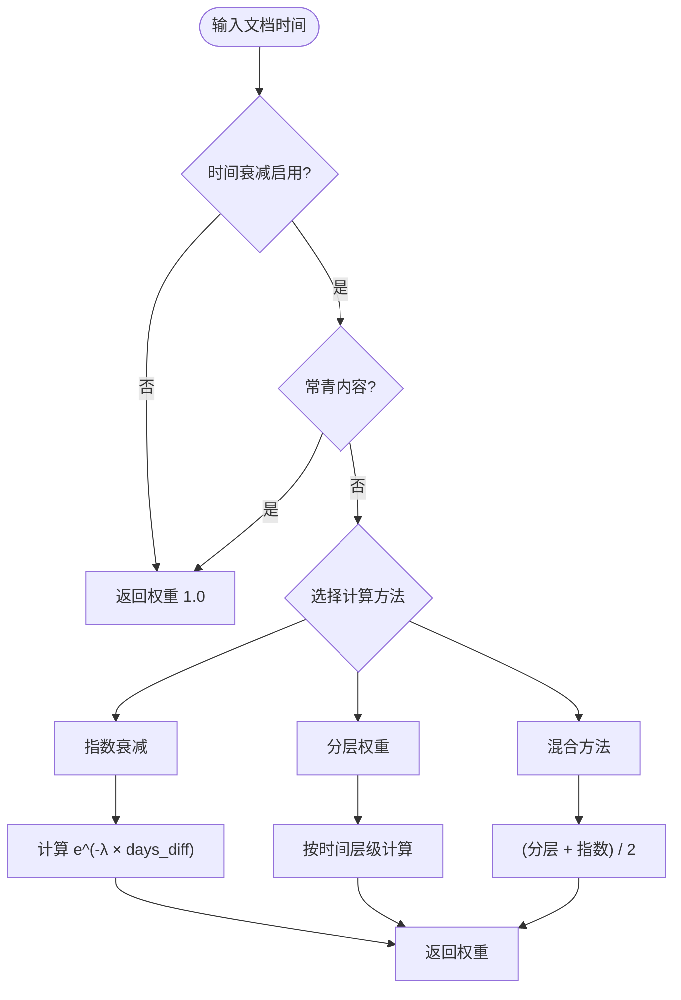

**图表来源**
- [temporal_weight.py:160-195](file://src/domain/temporal_weight.py#L160-L195)

#### 领域相关性评分
系统通过关键字匹配和密度分析计算相关性：

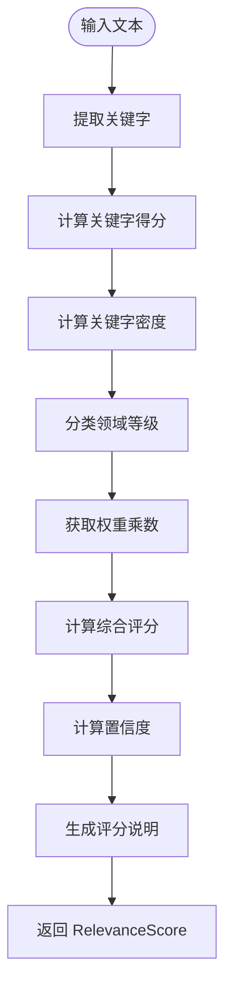

**图表来源**
- [relevance.py:198-242](file://src/domain/relevance.py#L198-L242)

**章节来源**
- [temporal_weight.py:47-271](file://src/domain/temporal_weight.py#L47-L271)
- [relevance.py:29-328](file://src/domain/relevance.py#L29-L328)

## 依赖关系分析

### 组件耦合度分析
知识固化系统采用松耦合设计，主要依赖关系如下：

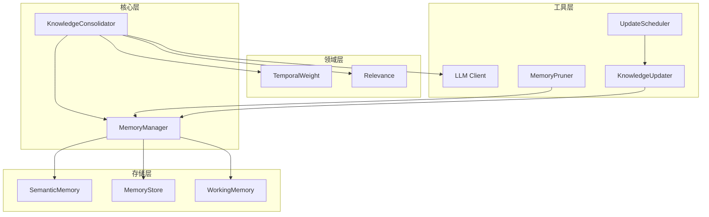

**图表来源**
- [consolidator.py:53-84](file://src/refinement/consolidator.py#L53-L84)
- [manager.py:44-47](file://src/memory/manager.py#L44-L47)

### 外部依赖与集成点
系统通过以下接口与外部组件集成：
- LLM 客户端接口：用于智能知识合并
- 记忆存储接口：支持多种存储后端
- 领域配置接口：提供权重计算能力
- 调度器接口：支持定时任务执行

**章节来源**
- [consolidator.py:77-84](file://src/refinement/consolidator.py#L77-L84)
- [manager.py:27-47](file://src/memory/manager.py#L27-L47)

## 性能考量

### 缓存与内存优化
- QA 缓存限制：最大 1000 个条目，淘汰置信度最低的 200 个条目
- 查询日志限制：最多 10000 条，超过 5000 条时进行截断
- 内存向量存储：使用内存模拟向量数据库，适合小规模场景

### 检索与存储性能
- 语义记忆采用余弦相似度计算，时间复杂度 O(n*m*d)
- 支持向量+关键词混合检索（预留接口）
- 图存储使用邻接表结构，支持 BFS 遍历

### 并发与异步处理
- 巩固器支持异步运行固化周期
- 记忆管理器支持并发访问
- 知识更新管理器支持批量处理

**章节来源**
- [consolidator.py:493-502](file://src/refinement/consolidator.py#L493-L502)
- [manager.py:44-47](file://src/memory/manager.py#L44-L47)
- [temporal_weight.py:211-227](file://src/domain/temporal_weight.py#L211-L227)

## 故障排查指南

### 常见问题诊断
- **巩固结果为空**：检查查询日志是否足够，确认最小查询频率阈值设置
- **无法持久化**：检查记忆管理器是否正确初始化，存储后端是否可用
- **图谱连接未更新**：检查实体抽取逻辑是否正确，确认记忆管理器具备更新接口
- **性能问题**：关注缓存大小与淘汰策略，评估向量存储后端性能瓶颈

### 错误处理机制
系统采用多层次错误处理：
- 异常捕获：所有外部调用都包含异常处理
- 降级策略：LLM 合并失败时自动切换到规则合并
- 日志记录：详细的调试信息和错误日志

### 调试建议
- 启用详细日志模式观察固化流程
- 监控缓存命中率和去重效果
- 定期检查知识缺口填补情况
- 监控存储后端性能指标

**章节来源**
- [consolidator.py:311-323](file://src/refinement/consolidator.py#L311-L323)
- [consolidator.py:516-536](file://src/refinement/consolidator.py#L516-L536)
- [manager.py:52-123](file://src/memory/manager.py#L52-L123)

## 结论
知识固化系统通过查询模式分析、知识缺口识别、QA 去重与合并、图谱连接更新等机制，实现了从临时信息到长期知识的转化。结合时间权重与领域相关性，巩固器能够有效维护知识的时效性与准确性，并通过与记忆修剪器的协作，持续优化知识库的整体质量。在工程实践中，建议根据业务场景调整阈值与策略，并结合外部存储后端提升性能与可靠性。

## 附录

### 配置参数说明
- **min_query_frequency**: 最小查询频率阈值（默认 5）
- **quality_threshold**: 质量阈值（默认 0.7）
- **similarity_threshold**: 相似度阈值（默认 0.85）
- **consolidation_interval**: 巩固周期间隔（默认 3600 秒）

### 使用示例
系统提供了完整的使用示例，展示如何集成各个组件：

```python
# 初始化知识固化器
consolidator = KnowledgeConsolidator(
    memory_manager=memory_manager,
    llm_client=llm_client,
    min_query_frequency=5,
    quality_threshold=0.7,
    similarity_threshold=0.85
)

# 记录查询
consolidator.record_query(
    query="深度学习应用",
    hit=True,
    confidence=0.9,
    answer="深度学习在图像识别、自然语言处理等领域有广泛应用",
    evidence=["文献1", "文献2"]
)

# 执行固化周期
result = await consolidator.run_consolidation_cycle()
```

### 最佳实践
- 定期监控知识缺口填补情况
- 调整质量阈值以平衡知识质量和数量
- 结合领域权重系统提升相关性评分
- 使用外部存储后端替代内存存储
- 实施定期的批量更新任务

### 维护指南
- 定期清理低质量知识和过时信息
- 监控缓存使用情况和性能指标
- 根据业务需求调整时间权重衰减参数
- 建立知识更新的变更日志和回滚机制

**章节来源**
- [config.py:195-216](file://src/core/config.py#L195-L216)
- [example/example_usage.py:12-252](file://example/example_usage.py#L12-L252)