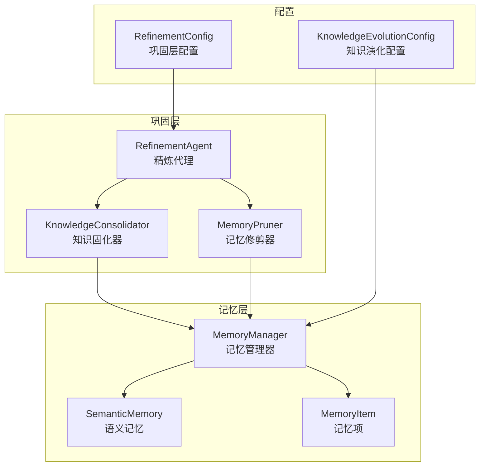
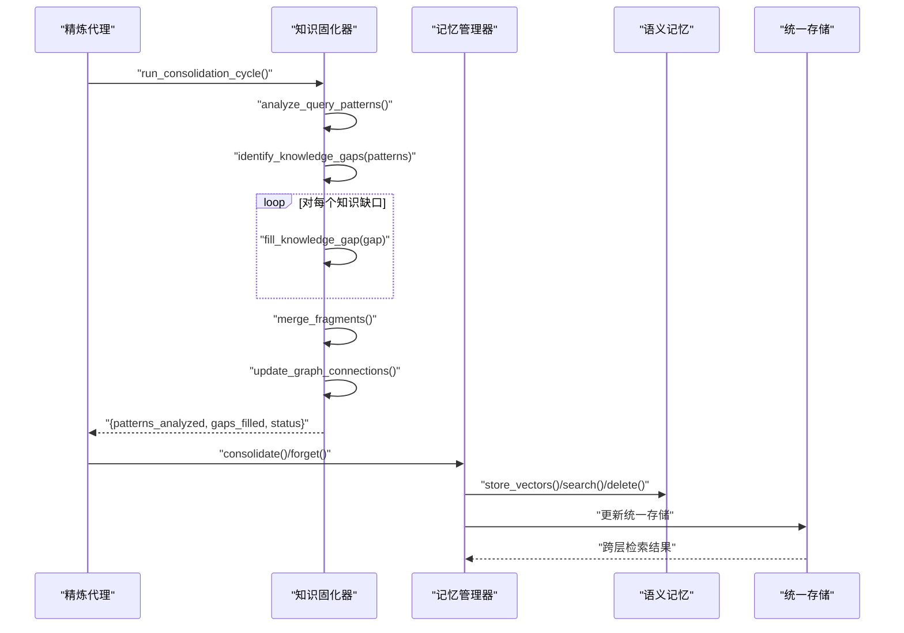
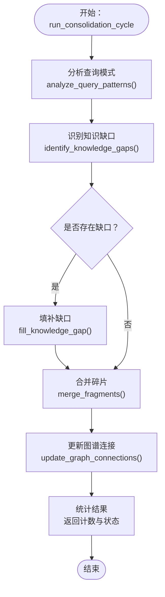
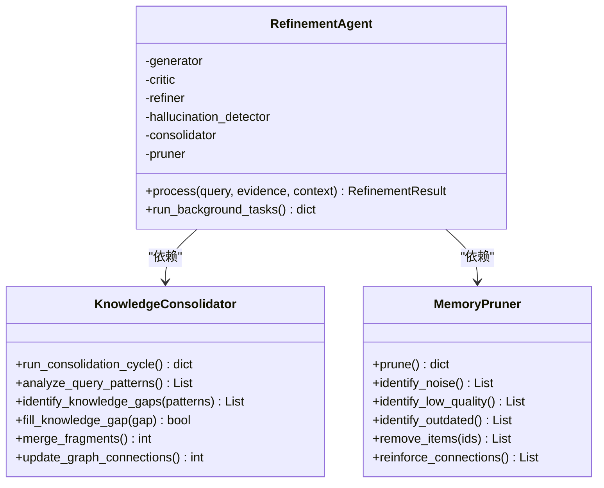
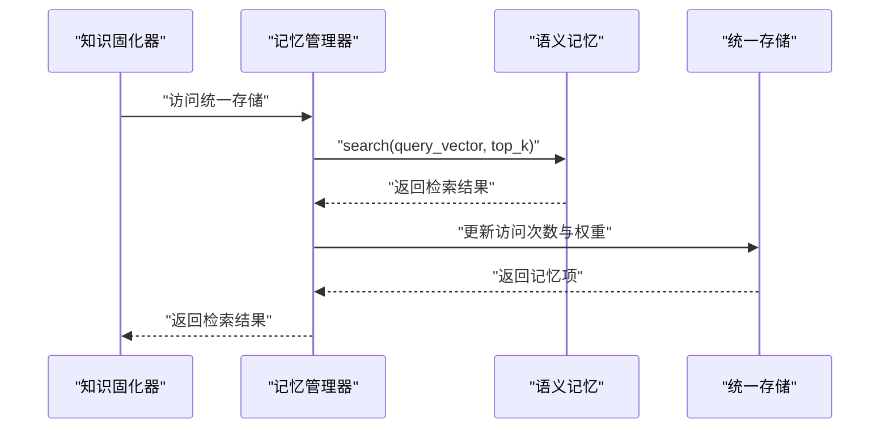
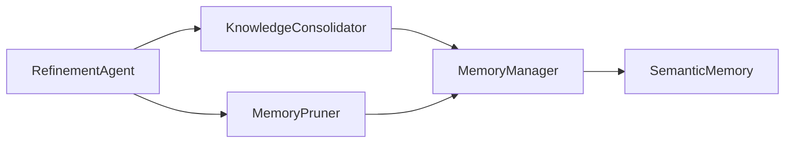

# 知识固化系统

<cite>
**本文引用的文件**
- [consolidator.py](file://src/refinement/consolidator.py)
- [models.py（精炼）](file://src/refinement/models.py)
- [agent.py](file://src/refinement/agent.py)
- [pruner.py](file://src/refinement/pruner.py)
- [manager.py](file://src/memory/manager.py)
- [models.py（记忆）](file://src/memory/models.py)
- [semantic_memory.py](file://src/memory/semantic_memory.py)
- [config.py（核心配置）](file://src/core/config.py)
- [config.py（知识演化）](file://src/knowledge_evolution/config.py)
- [example_usage.py](file://example/example_usage.py)
</cite>

## 目录
1. [简介](#简介)
2. [项目结构](#项目结构)
3. [核心组件](#核心组件)
4. [架构总览](#架构总览)
5. [详细组件分析](#详细组件分析)
6. [依赖分析](#依赖分析)
7. [性能考虑](#性能考虑)
8. [故障排查指南](#故障排查指南)
9. [结论](#结论)
10. [附录](#附录)

## 简介
本文件面向“知识固化系统”的设计与实现，围绕 KnowledgeConsolidator 类展开，系统性阐述其知识整合机制与固化流程，包括证据聚合、模式识别与知识结构化过程；解释固化算法的实现原理与质量保证机制；说明与记忆管理器的交互方式与数据同步策略；并提供固化任务的配置选项、性能监控与效果评估方法，辅以具体固化示例、质量检查流程与优化建议。

## 项目结构
本项目采用按层与按功能混合组织的结构：感知层负责文档编码与实体抽取；记忆层统一管理三层记忆（工作记忆、语义记忆、情景图谱）；检索层提供智能检索与重排序；巩固层由精炼代理与知识固化器组成，负责答案生成、幻觉检测与知识固化；响应层负责情境自适应输出。知识固化系统位于巩固层，核心文件包括：
- 知识固化器：src/refinement/consolidator.py
- 精炼数据模型：src/refinement/models.py
- 精炼代理：src/refinement/agent.py
- 记忆修剪器：src/refinement/pruner.py
- 记忆管理器：src/memory/manager.py
- 记忆数据模型：src/memory/models.py
- 语义记忆（向量检索）：src/memory/semantic_memory.py
- 配置：src/core/config.py、src/knowledge_evolution/config.py
- 示例：example/example_usage.py

**图表来源**
- [agent.py:16-60](file://src/refinement/agent.py#L16-L60)
- [consolidator.py:9-34](file://src/refinement/consolidator.py#L9-L34)
- [pruner.py:10-40](file://src/refinement/pruner.py#L10-L40)
- [manager.py:16-47](file://src/memory/manager.py#L16-L47)
- [semantic_memory.py:21-49](file://src/memory/semantic_memory.py#L21-L49)
- [models.py（记忆）:14-26](file://src/memory/models.py#L14-L26)
- [config.py（核心配置）:186-204](file://src/core/config.py#L186-L204)
- [config.py（知识演化）:15-62](file://src/knowledge_evolution/config.py#L15-L62)

**章节来源**
- [agent.py:16-60](file://src/refinement/agent.py#L16-L60)
- [consolidator.py:9-34](file://src/refinement/consolidator.py#L9-L34)
- [pruner.py:10-40](file://src/refinement/pruner.py#L10-L40)
- [manager.py:16-47](file://src/memory/manager.py#L16-L47)
- [semantic_memory.py:21-49](file://src/memory/semantic_memory.py#L21-L49)
- [models.py（记忆）:14-26](file://src/memory/models.py#L14-L26)
- [config.py（核心配置）:186-204](file://src/core/config.py#L186-L204)
- [config.py（知识演化）:15-62](file://src/knowledge_evolution/config.py#L15-L62)

## 核心组件
- 知识固化器（KnowledgeConsolidator）：负责运行固化周期，分析查询模式、识别知识缺口、填补缺口、合并碎片、更新图谱连接，并返回固化统计结果。
- 精炼代理（RefinementAgent）：封装生成-批判-修正闭环，集成知识固化器与记忆修剪器，提供后台任务执行入口。
- 记忆管理器（MemoryManager）：统一管理三层记忆，提供存储、检索、巩固与主动遗忘能力，维护统一存储字典以实现跨层检索与同步。
- 记忆修剪器（MemoryPruner）：模拟“猫舔毛”行为，识别噪声、低质量与过时知识并修剪，同时强化高频访问的重要连接。
- 精炼数据模型：定义知识缺口、查询模式等关键数据结构，支撑固化流程的数据流转。
- 配置体系：提供巩固层与知识演化的配置项，涵盖迭代次数、阈值、更新策略与监控指标。

**章节来源**
- [consolidator.py:9-61](file://src/refinement/consolidator.py#L9-L61)
- [agent.py:16-60](file://src/refinement/agent.py#L16-L60)
- [manager.py:16-195](file://src/memory/manager.py#L16-L195)
- [pruner.py:10-157](file://src/refinement/pruner.py#L10-L157)
- [models.py（精炼）:50-66](file://src/refinement/models.py#L50-L66)
- [config.py（核心配置）:186-204](file://src/core/config.py#L186-L204)
- [config.py（知识演化）:15-62](file://src/knowledge_evolution/config.py#L15-L62)

## 架构总览
知识固化系统在巩固层与记忆层之间建立紧密协作：精炼代理在后台任务中调用知识固化器，后者通过记忆管理器读取与写入三层记忆；记忆修剪器独立执行，清理噪声与过时知识，强化重要连接；语义记忆提供向量检索能力，支撑检索与融合；统一存储字典确保跨层可见性与一致性。

**图表来源**
- [agent.py:130-151](file://src/refinement/agent.py#L130-L151)
- [consolidator.py:35-61](file://src/refinement/consolidator.py#L35-L61)
- [manager.py:149-195](file://src/memory/manager.py#L149-L195)
- [semantic_memory.py:50-118](file://src/memory/semantic_memory.py#L50-L118)
- [models.py（记忆）:14-26](file://src/memory/models.py#L14-L26)

## 详细组件分析

### 知识固化器（KnowledgeConsolidator）
- 职责与流程
  - 运行固化周期：分析查询模式、识别知识缺口、填补缺口、合并碎片、更新图谱连接。
  - 查询模式分析：预留实现，当前返回空列表，后续可接入查询日志统计与模式识别。
  - 知识缺口识别：基于命中率与查询频率阈值筛选缺口，构造知识缺口对象。
  - 知识补充：预留实现，当前直接返回成功，后续可对接外部知识源或人工审核。
  - 碎片合并与图谱更新：预留实现，当前返回零计数，后续可实现相似度聚类与图谱连边增强。
- 数据结构
  - KnowledgeGap：标识缺口主题、描述、频率与元数据。
  - QueryPattern：记录模式、计数、命中率与示例。
- 质量保证
  - 频率阈值控制：min_query_frequency避免噪声干扰。
  - 命中率阈值：hit_rate < 0.3 识别低满足度查询。
  - 异步化：run_consolidation_cycle声明为异步，便于与外部系统解耦。
- 与记忆管理器交互
  - 通过 memory_manager 访问三层记忆，但当前实现未直接调用，后续可扩展为从语义记忆检索证据、向图谱添加实体关系等。

**图表来源**
- [consolidator.py:35-61](file://src/refinement/consolidator.py#L35-L61)
- [consolidator.py:75-102](file://src/refinement/consolidator.py#L75-L102)
- [consolidator.py:104-141](file://src/refinement/consolidator.py#L104-L141)
- [models.py（精炼）:50-66](file://src/refinement/models.py#L50-L66)

**章节来源**
- [consolidator.py:9-142](file://src/refinement/consolidator.py#L9-L142)
- [models.py（精炼）:50-66](file://src/refinement/models.py#L50-L66)

### 精炼代理（RefinementAgent）
- 职责
  - 封装生成-批判-修正闭环，进行幻觉检测与质量评估。
  - 集成知识固化器与记忆修剪器，提供后台任务执行入口。
- 与固化器的协作
  - 当提供 memory 参数时，构造 KnowledgeConsolidator 与 MemoryPruner。
  - run_background_tasks 并行执行固化与修剪，汇总结果返回。
- 配置影响
  - max_iterations、min_confidence 控制迭代上限与最低置信度阈值。
  - 与巩固层配置 RefinementConfig 协同生效。

**图表来源**
- [agent.py:16-60](file://src/refinement/agent.py#L16-L60)
- [agent.py:130-151](file://src/refinement/agent.py#L130-L151)
- [consolidator.py:9-34](file://src/refinement/consolidator.py#L9-L34)
- [pruner.py:10-40](file://src/refinement/pruner.py#L10-L40)

**章节来源**
- [agent.py:16-151](file://src/refinement/agent.py#L16-L151)

### 记忆管理器（MemoryManager）
- 职责
  - 统一管理 L1、L2、L3 三层记忆，提供存储、检索、巩固与主动遗忘。
  - 维护统一存储字典，实现跨层检索与同步。
- 存储与检索
  - store：将编码块持久化至语义记忆，同时向图谱添加实体与关系。
  - retrieve：基于向量检索与衰减强化访问记忆，返回记忆项列表。
  - consolidate/forget：应用衰减、识别归档与遗忘目标，删除对应记忆。
- 与固化器的协作
  - 作为知识固化器的依赖，提供统一的三层记忆访问接口。
  - 通过统一存储字典，确保检索结果与固化操作的一致性。

**图表来源**
- [manager.py:114-147](file://src/memory/manager.py#L114-L147)
- [semantic_memory.py:80-118](file://src/memory/semantic_memory.py#L80-L118)
- [models.py（记忆）:14-26](file://src/memory/models.py#L14-L26)

**章节来源**
- [manager.py:16-195](file://src/memory/manager.py#L16-L195)
- [semantic_memory.py:21-179](file://src/memory/semantic_memory.py#L21-L179)
- [models.py（记忆）:14-26](file://src/memory/models.py#L14-L26)

### 记忆修剪器（MemoryPruner）
- 职责
  - 识别噪声、低质量与过时知识，执行修剪与强化。
- 识别策略
  - 噪声：基于权重与访问次数阈值。
  - 低质量：基于内容长度与权重阈值。
  - 过时：基于最后访问时间与阈值天数。
- 强化策略
  - 对高频访问记忆提升权重，增强重要连接。
- 与记忆管理器交互
  - 直接调用语义记忆删除接口，同步更新统一存储。

**章节来源**
- [pruner.py:10-157](file://src/refinement/pruner.py#L10-L157)

### 精炼数据模型
- KnowledgeGap：固化流程的核心数据载体，包含缺口标识、主题、描述、频率与元数据。
- QueryPattern：查询模式抽象，包含模式、计数、命中率与示例，用于缺口识别。

**章节来源**
- [models.py（精炼）:50-66](file://src/refinement/models.py#L50-L66)

## 依赖分析
- 组件耦合
  - 精炼代理依赖知识固化器与记忆修剪器，形成闭环控制流。
  - 知识固化器依赖记忆管理器，当前实现为弱耦合（预留接口），未来可深度集成。
  - 记忆修剪器直接依赖记忆管理器，耦合度较高。
- 外部依赖
  - 语义记忆提供向量检索能力，当前为内存实现，后续可替换为 Qdrant/Milvus。
  - 配置系统提供运行参数，影响迭代次数、阈值与更新策略。
- 潜在循环依赖
  - 当前文件间无循环导入，结构清晰。

**图表来源**
- [agent.py:16-60](file://src/refinement/agent.py#L16-L60)
- [consolidator.py:9-34](file://src/refinement/consolidator.py#L9-L34)
- [pruner.py:10-40](file://src/refinement/pruner.py#L10-L40)
- [manager.py:16-47](file://src/memory/manager.py#L16-L47)
- [semantic_memory.py:21-49](file://src/memory/semantic_memory.py#L21-L49)

**章节来源**
- [agent.py:16-60](file://src/refinement/agent.py#L16-L60)
- [consolidator.py:9-34](file://src/refinement/consolidator.py#L9-L34)
- [pruner.py:10-40](file://src/refinement/pruner.py#L10-L40)
- [manager.py:16-47](file://src/memory/manager.py#L16-L47)
- [semantic_memory.py:21-49](file://src/memory/semantic_memory.py#L21-L49)

## 性能考虑
- 异步化与并发
  - 知识固化器声明为异步，可在后台任务中并行执行，减少主线程阻塞。
- 检索效率
  - 语义记忆当前为内存实现，建议在生产环境替换为高性能向量库（如 Qdrant），并启用索引与缓存。
- 衰减与修剪
  - 记忆管理器的衰减与修剪策略可显著降低存储与检索开销，建议结合业务场景调整阈值。
- 配置优化
  - 结合 RefinementConfig 与 KnowledgeEvolutionConfig 的阈值与间隔，平衡质量与性能。

[本节为通用指导，无需特定文件来源]

## 故障排查指南
- 知识固化未生效
  - 检查精炼代理是否正确初始化记忆管理器与固化器。
  - 确认 run_background_tasks 被调用且返回非跳过状态。
- 查询模式分析为空
  - 当前实现返回空列表，需实现查询日志统计与模式识别。
- 知识缺口未填补
  - 留待实现，当前直接返回成功；建议增加外部知识源对接与人工审核流程。
- 记忆修剪误删
  - 检查噪声、低质量与过时识别阈值，必要时提高阈值或增加人工复核。
- 检索命中率低
  - 检查向量维度、索引与检索参数，结合语义记忆的混合检索策略优化。

**章节来源**
- [agent.py:130-151](file://src/refinement/agent.py#L130-L151)
- [consolidator.py:63-141](file://src/refinement/consolidator.py#L63-L141)
- [pruner.py:71-157](file://src/refinement/pruner.py#L71-L157)
- [manager.py:114-147](file://src/memory/manager.py#L114-L147)

## 结论
知识固化系统通过精炼代理与知识固化器实现了“模式识别—缺口填补—碎片合并—图谱更新”的闭环流程；记忆管理器提供统一的三层记忆访问与同步；记忆修剪器保障知识库的健康度。当前实现以预留接口为主，建议在后续版本中完善查询模式分析、知识缺口填补、碎片合并与图谱更新的具体算法，并结合高性能向量库与配置体系实现可调优的固化策略。

[本节为总结，无需特定文件来源]

## 附录

### 固化任务配置选项
- 巩固层配置（RefinementConfig）
  - 最大迭代次数：max_iterations
  - 置信度阈值：confidence_threshold
  - 幻觉检测阈值：factual_threshold、logical_threshold、evidence_threshold
  - 启用固化与固化间隔：enable_consolidation、consolidation_interval
  - 启用修剪与修剪阈值：enable_pruning、pruning_threshold
- 知识演化配置（KnowledgeEvolutionConfig）
  - 实时更新开关与阈值：enable_realtime_update、realtime_quality_threshold、auto_approve_threshold
  - 定时更新间隔与时间：enable_scheduled_update、batch_update_interval、batch_update_time
  - 健康度阈值与指标间隔：health_warning_threshold、health_critical_threshold、metrics_calculation_interval
  - 查询驱动积累与缺口检测：enable_query_driven_accumulation、gap_detection_enabled

**章节来源**
- [config.py（核心配置）:186-204](file://src/core/config.py#L186-L204)
- [config.py（知识演化）:15-62](file://src/knowledge_evolution/config.py#L15-L62)

### 性能监控与效果评估
- 监控指标
  - 固化统计：patterns_analyzed、gaps_filled、状态。
  - 记忆层指标：总条目数、各层条目数、检索命中率、碎片率、健康分。
- 评估方法
  - 通过 QueryRecord 与 KnowledgeMetrics 计算命中率、新鲜度与健康度。
  - 结合 ChangeLogEntry 进行回滚与审计。

**章节来源**
- [consolidator.py:57-61](file://src/refinement/consolidator.py#L57-L61)
- [manager.py:187-195](file://src/memory/manager.py#L187-L195)
- [models.py（知识演化）:195-272](file://src/knowledge_evolution/models.py#L195-L272)
- [models.py（知识演化）:313-342](file://src/knowledge_evolution/models.py#L313-L342)
- [models.py（知识演化）:162-191](file://src/knowledge_evolution/models.py#L162-L191)

### 固化示例与最佳实践
- 示例流程
  - 使用示例脚本展示从感知层到响应层的完整流程，其中巩固层由精炼代理驱动。
- 最佳实践
  - 启用异步固化，定期执行 run_background_tasks。
  - 结合查询日志与模式识别，动态调整 min_query_frequency 与命中率阈值。
  - 在生产环境替换语义记忆实现，启用索引与缓存。
  - 定期评估健康度与指标，根据阈值调整更新策略。

**章节来源**
- [example_usage.py:139-173](file://example/example_usage.py#L139-L173)
- [agent.py:130-151](file://src/refinement/agent.py#L130-L151)