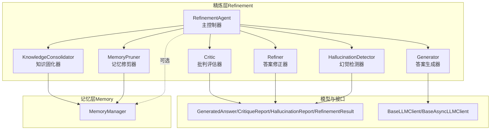
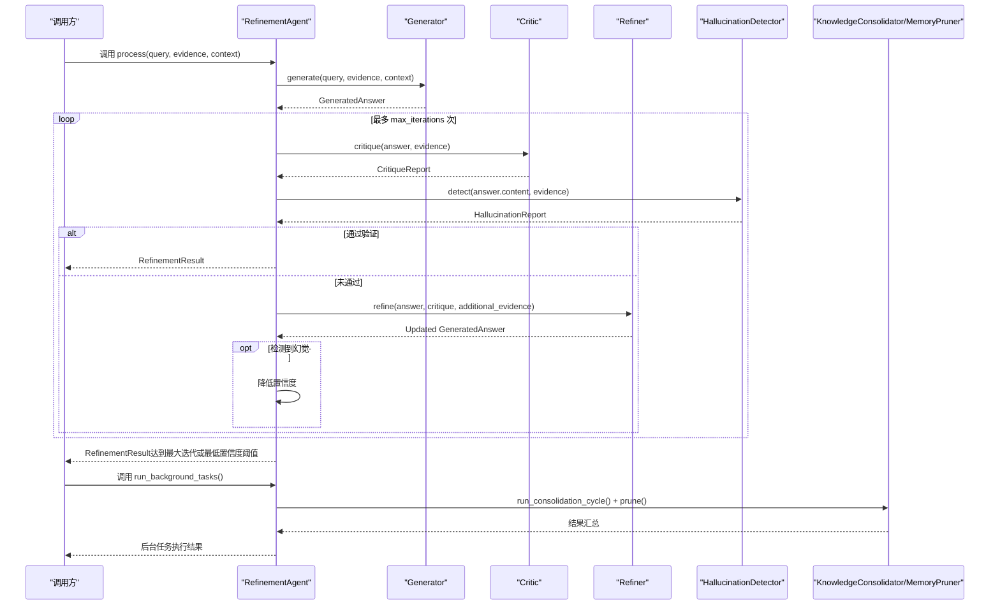
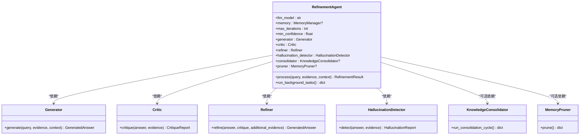
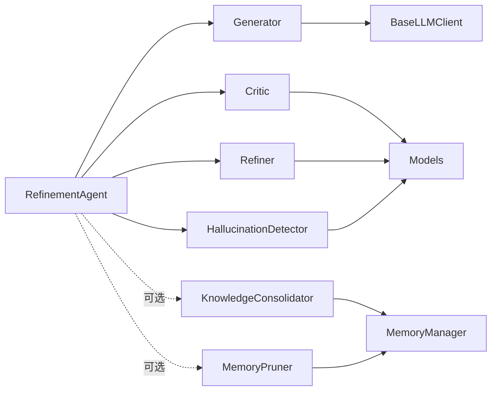

# 精炼代理核心

<cite>
**本文引用的文件**
- [agent.py](file://src/refinement/agent.py)
- [generator.py](file://src/refinement/generator.py)
- [critic.py](file://src/refinement/critic.py)
- [refiner.py](file://src/refinement/refiner.py)
- [hallucination.py](file://src/refinement/hallucination.py)
- [models.py](file://src/refinement/models.py)
- [consolidator.py](file://src/refinement/consolidator.py)
- [pruner.py](file://src/refinement/pruner.py)
- [manager.py](file://src/memory/manager.py)
- [base.py](file://src/core/llm/base.py)
- [example_usage.py](file://example/example_usage.py)
- [README.md](file://README.md)
</cite>

## 目录
1. [简介](#简介)
2. [项目结构](#项目结构)
3. [核心组件](#核心组件)
4. [架构总览](#架构总览)
5. [详细组件分析](#详细组件分析)
6. [依赖关系分析](#依赖关系分析)
7. [性能考量](#性能考量)
8. [故障排查指南](#故障排查指南)
9. [结论](#结论)
10. [附录](#附录)

## 简介
本文件聚焦“精炼代理”（RefinementAgent）核心组件，系统阐述其设计架构、初始化流程、参数配置、组件依赖关系，以及 process 方法的完整执行流程（生成-批判-修正-幻觉检测-结果返回）。同时介绍异步知识固化任务的运行机制与后台任务管理，并提供使用模式与最佳实践，帮助读者正确配置与高效使用精炼代理。

## 项目结构
精炼代理位于 src/refinement 目录，围绕“生成-批判-修正-幻觉检测”的闭环设计，配合记忆管理器实现异步知识固化与记忆修剪。

图表来源
- [agent.py:16-151](file://src/refinement/agent.py#L16-L151)
- [generator.py:15-208](file://src/refinement/generator.py#L15-L208)
- [critic.py:9-72](file://src/refinement/critic.py#L9-L72)
- [refiner.py:8-64](file://src/refinement/refiner.py#L8-L64)
- [hallucination.py:9-154](file://src/refinement/hallucination.py#L9-L154)
- [consolidator.py:9-142](file://src/refinement/consolidator.py#L9-L142)
- [pruner.py:10-157](file://src/refinement/pruner.py#L10-L157)
- [models.py:9-66](file://src/refinement/models.py#L9-L66)
- [base.py:11-178](file://src/core/llm/base.py#L11-L178)
- [manager.py:16-195](file://src/memory/manager.py#L16-L195)

章节来源
- [agent.py:16-151](file://src/refinement/agent.py#L16-L151)
- [generator.py:15-208](file://src/refinement/generator.py#L15-L208)
- [critic.py:9-72](file://src/refinement/critic.py#L9-L72)
- [refiner.py:8-64](file://src/refinement/refiner.py#L8-L64)
- [hallucination.py:9-154](file://src/refinement/hallucination.py#L9-L154)
- [consolidator.py:9-142](file://src/refinement/consolidator.py#L9-L142)
- [pruner.py:10-157](file://src/refinement/pruner.py#L10-L157)
- [models.py:9-66](file://src/refinement/models.py#L9-L66)
- [base.py:11-178](file://src/core/llm/base.py#L11-L178)
- [manager.py:16-195](file://src/memory/manager.py#L16-L195)

## 核心组件
- RefinementAgent：主控制器，协调 Generator、Critic、Refiner、HallucinationDetector，并在有记忆管理器时启用 KnowledgeConsolidator 与 MemoryPruner。
- Generator：基于证据生成答案，支持 LLM 客户端注入与规则回退。
- Critic：对答案进行质量评估，产出批判报告。
- Refiner：根据批判意见修正答案并调整置信度。
- HallucinationDetector：检测事实一致性、逻辑连贯性与证据支撑度。
- KnowledgeConsolidator：异步知识固化周期，分析查询模式、识别知识缺口并补充。
- MemoryPruner：模拟猫“舔毛”行为，清理噪声、强化重要连接、维持知识时效性。
- 数据模型：GeneratedAnswer、CritiqueReport、HallucinationReport、RefinementResult 等。

章节来源
- [agent.py:16-151](file://src/refinement/agent.py#L16-L151)
- [generator.py:15-208](file://src/refinement/generator.py#L15-L208)
- [critic.py:9-72](file://src/refinement/critic.py#L9-L72)
- [refiner.py:8-64](file://src/refinement/refiner.py#L8-L64)
- [hallucination.py:9-154](file://src/refinement/hallucination.py#L9-L154)
- [consolidator.py:9-142](file://src/refinement/consolidator.py#L9-L142)
- [pruner.py:10-157](file://src/refinement/pruner.py#L10-L157)
- [models.py:9-66](file://src/refinement/models.py#L9-L66)

## 架构总览
精炼代理采用“生成-批判-修正-幻觉检测”的闭环，结合记忆管理器实现异步知识固化与修剪，形成“认知-验证-优化-沉淀”的完整流程。

图表来源
- [agent.py:61-151](file://src/refinement/agent.py#L61-L151)
- [generator.py:67-101](file://src/refinement/generator.py#L67-L101)
- [critic.py:25-72](file://src/refinement/critic.py#L25-L72)
- [refiner.py:24-64](file://src/refinement/refiner.py#L24-L64)
- [hallucination.py:34-75](file://src/refinement/hallucination.py#L34-L75)
- [consolidator.py:35-61](file://src/refinement/consolidator.py#L35-L61)
- [pruner.py:41-69](file://src/refinement/pruner.py#L41-L69)

## 详细组件分析

### RefinementAgent 主类
- 设计目标：实现 Generator-Critic-Refiner 三重验证闭环，内置幻觉自检与异步知识固化/修剪。
- 初始化参数
  - llm_model：LLM 模型名（字符串）
  - memory：MemoryManager 实例（可选）
  - max_iterations：最大迭代次数（默认 3）
  - min_confidence：最低置信度阈值（默认 0.7）
- 子组件装配
  - Generator、Critic、Refiner、HallucinationDetector
  - 若提供 memory：装配 KnowledgeConsolidator 与 MemoryPruner；否则跳过
- process 执行流程
  - 生成初始答案
  - 循环：批判评估 + 幻觉检测
  - 通过则返回；未通过则修正并可能降低置信度
  - 达到最大迭代或低于最低置信度阈值时返回当前结果
- 异步后台任务
  - run_background_tasks：依次执行知识固化与记忆修剪，返回结果字典

章节来源
- [agent.py:27-60](file://src/refinement/agent.py#L27-L60)
- [agent.py:61-128](file://src/refinement/agent.py#L61-L128)
- [agent.py:130-151](file://src/refinement/agent.py#L130-L151)

#### 类关系图

图表来源
- [agent.py:16-151](file://src/refinement/agent.py#L16-L151)
- [generator.py:15-208](file://src/refinement/generator.py#L15-L208)
- [critic.py:9-72](file://src/refinement/critic.py#L9-L72)
- [refiner.py:8-64](file://src/refinement/refiner.py#L8-L64)
- [hallucination.py:9-154](file://src/refinement/hallucination.py#L9-L154)
- [consolidator.py:9-142](file://src/refinement/consolidator.py#L9-L142)
- [pruner.py:10-157](file://src/refinement/pruner.py#L10-L157)

### Generator 答案生成器
- 功能：基于检索证据生成高质量答案，支持 LLM 客户端注入与规则回退。
- 关键点
  - LLM 客户端注入：若未提供则回退到 Mock 实现
  - 提示词模板：包含证据与上下文
  - 置信度估计：综合证据数量、答案长度、关键词覆盖
- 输出：GeneratedAnswer（content、citations、confidence、metadata）

章节来源
- [generator.py:25-50](file://src/refinement/generator.py#L25-L50)
- [generator.py:67-101](file://src/refinement/generator.py#L67-L101)
- [generator.py:102-140](file://src/refinement/generator.py#L102-L140)
- [generator.py:142-174](file://src/refinement/generator.py#L142-L174)
- [generator.py:176-208](file://src/refinement/generator.py#L176-L208)

### Critic 批判评估器
- 功能：评估答案质量，产出批判报告
- 评估维度：证据支撑、置信度、答案完整性
- 输出：CritiqueReport（is_valid、issues、suggestions、quality_score）

章节来源
- [critic.py:25-72](file://src/refinement/critic.py#L25-L72)

### Refiner 答案修正器
- 功能：根据批判意见修正答案并调整置信度
- 当前实现：简单修正（追加补充证据片段）、按质量分数微调置信度
- 输出：Updated GeneratedAnswer（含 metadata 标记）

章节来源
- [refiner.py:24-64](file://src/refinement/refiner.py#L24-L64)

### HallucinationDetector 幻觉检测器
- 功能：检测事实一致性、逻辑连贯性与证据支撑度
- 评估指标：fact_score、logic_score、support_score
- 输出：HallucinationReport（is_hallucination、issues）

章节来源
- [hallucination.py:34-75](file://src/refinement/hallucination.py#L34-L75)
- [hallucination.py:77-108](file://src/refinement/hallucination.py#L77-L108)
- [hallucination.py:109-129](file://src/refinement/hallucination.py#L109-L129)
- [hallucination.py:131-154](file://src/refinement/hallucination.py#L131-L154)

### KnowledgeConsolidator 知识固化器
- 功能：分析查询模式、识别知识缺口、补充知识、合并碎片、更新图谱连接
- 当前实现：最小可用实现（占位），后续可接入外部知识源或提示管理员

章节来源
- [consolidator.py:35-61](file://src/refinement/consolidator.py#L35-L61)
- [consolidator.py:75-102](file://src/refinement/consolidator.py#L75-L102)
- [consolidator.py:104-117](file://src/refinement/consolidator.py#L104-L117)
- [consolidator.py:119-129](file://src/refinement/consolidator.py#L119-L129)
- [consolidator.py:131-141](file://src/refinement/consolidator.py#L131-L141)

### MemoryPruner 记忆修剪器
- 功能：模拟猫“舔毛”行为，清理噪声、强化重要连接、维持知识时效性
- 识别策略：噪声数据、低质量知识、过时信息
- 输出：修剪统计（移除数量、强化数量等）

章节来源
- [pruner.py:41-69](file://src/refinement/pruner.py#L41-L69)
- [pruner.py:71-85](file://src/refinement/pruner.py#L71-L85)
- [pruner.py:87-101](file://src/refinement/pruner.py#L87-L101)
- [pruner.py:103-118](file://src/refinement/pruner.py#L103-L118)
- [pruner.py:120-137](file://src/refinement/pruner.py#L120-L137)
- [pruner.py:139-157](file://src/refinement/pruner.py#L139-L157)

### 数据模型
- GeneratedAnswer：生成的答案结构
- CritiqueReport：批判报告
- HallucinationReport：幻觉检测报告
- RefinementResult：精炼结果（包含迭代次数、幻觉报告等）

章节来源
- [models.py:9-66](file://src/refinement/models.py#L9-L66)

### LLM 客户端接口
- BaseLLMClient/BaseAsyncLLMClient：抽象接口，定义 generate/embed 等方法
- 作用：为 Generator 等组件提供统一的 LLM 能力

章节来源
- [base.py:11-178](file://src/core/llm/base.py#L11-L178)

## 依赖关系分析
- RefinementAgent 依赖 Generator、Critic、Refiner、HallucinationDetector
- 若提供 MemoryManager，则依赖 KnowledgeConsolidator 与 MemoryPruner
- Generator 依赖 LLM 客户端接口（可注入或回退到 Mock）
- 各组件之间通过数据模型进行解耦

图表来源
- [agent.py:16-151](file://src/refinement/agent.py#L16-L151)
- [generator.py:15-208](file://src/refinement/generator.py#L15-L208)
- [critic.py:9-72](file://src/refinement/critic.py#L9-L72)
- [refiner.py:8-64](file://src/refinement/refiner.py#L8-L64)
- [hallucination.py:9-154](file://src/refinement/hallucination.py#L9-L154)
- [consolidator.py:9-142](file://src/refinement/consolidator.py#L9-L142)
- [pruner.py:10-157](file://src/refinement/pruner.py#L10-L157)
- [models.py:9-66](file://src/refinement/models.py#L9-L66)
- [base.py:11-178](file://src/core/llm/base.py#L11-L178)
- [manager.py:16-195](file://src/memory/manager.py#L16-L195)

## 性能考量
- 生成阶段
  - LLM 调用成本较高，建议控制 max_evidence 与 temperature，避免过度生成
  - 规则回退在无 LLM 客户端时可快速返回，但置信度较低
- 批判与修正
  - 批判评估与修正为轻量计算，主要影响迭代次数
- 幻觉检测
  - 当前实现为启发式规则，复杂度低；后续可引入更强的检测模型
- 异步知识固化
  - run_consolidation_cycle 为异步，适合后台任务调度，避免阻塞主线程
- 记忆修剪
  - prune 为同步操作，建议在低峰时段执行，减少对检索性能的影响

## 故障排查指南
- 置信度过低
  - 检查 evidence 是否为空或过少
  - 调整 temperature 与 max_evidence
- 幻觉风险
  - 关注 HallucinationReport 的 issues 与分数
  - 增加证据数量或提高支持度阈值
- 迭代次数过多
  - 调整 max_iterations 与 min_confidence
  - 优化提示词模板与上下文
- 后台任务未执行
  - 确认 MemoryManager 是否传入
  - 检查 KnowledgeConsolidator/MemoryPruner 的实现状态

章节来源
- [agent.py:61-128](file://src/refinement/agent.py#L61-L128)
- [agent.py:130-151](file://src/refinement/agent.py#L130-L151)
- [hallucination.py:34-75](file://src/refinement/hallucination.py#L34-L75)
- [pruner.py:41-69](file://src/refinement/pruner.py#L41-L69)

## 结论
精炼代理通过“生成-批判-修正-幻觉检测”的闭环，有效提升答案质量与可靠性；结合记忆管理器实现的异步知识固化与修剪，形成持续优化的知识体系。建议在生产环境中合理配置参数、监控幻觉报告，并将后台任务纳入调度系统，以获得稳定高效的问答体验。

## 附录

### 使用模式与示例
- 基础使用
  - 初始化 RefinementAgent（可选传入 MemoryManager）
  - 准备 evidence（通常来自检索层结果）
  - 调用 process 获取 RefinementResult
- 异步知识固化
  - 调用 run_background_tasks 获取固化与修剪结果
- 完整示例参考
  - [example_usage.py:139-173](file://example/example_usage.py#L139-L173)

章节来源
- [example_usage.py:139-173](file://example/example_usage.py#L139-L173)
- [README.md:290-329](file://README.md#L290-L329)