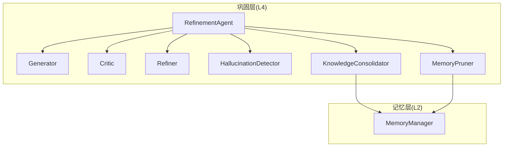
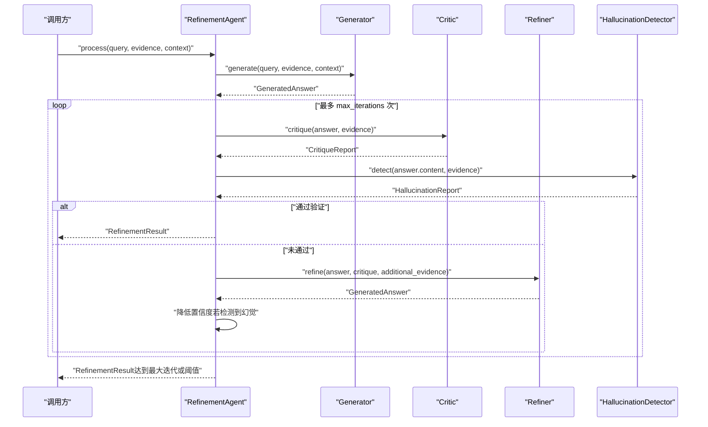
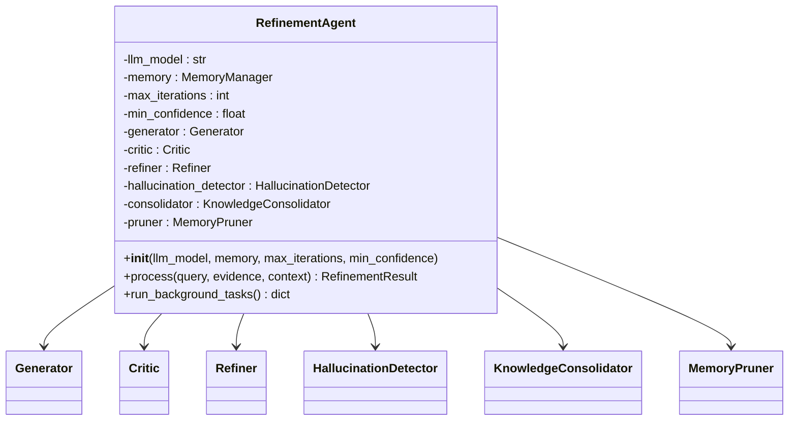
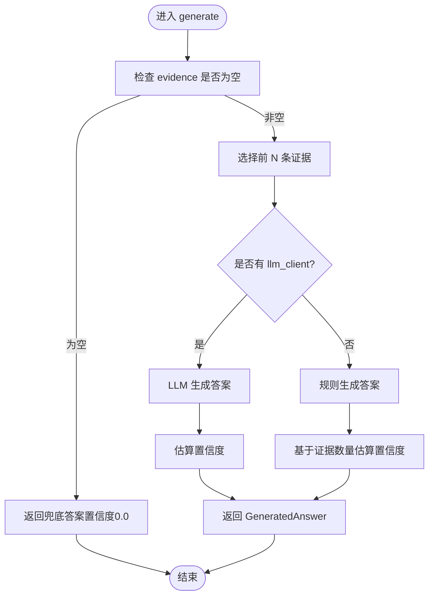
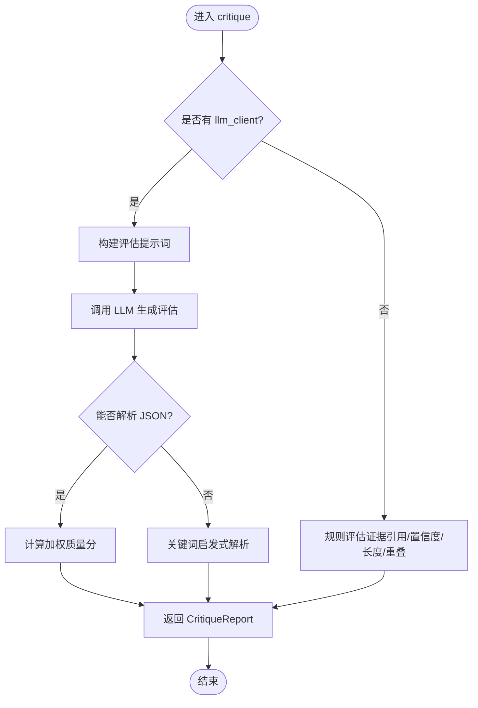
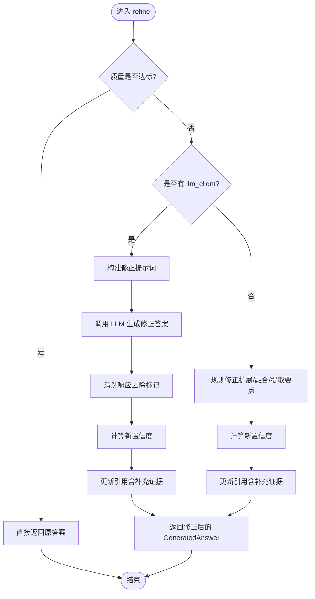
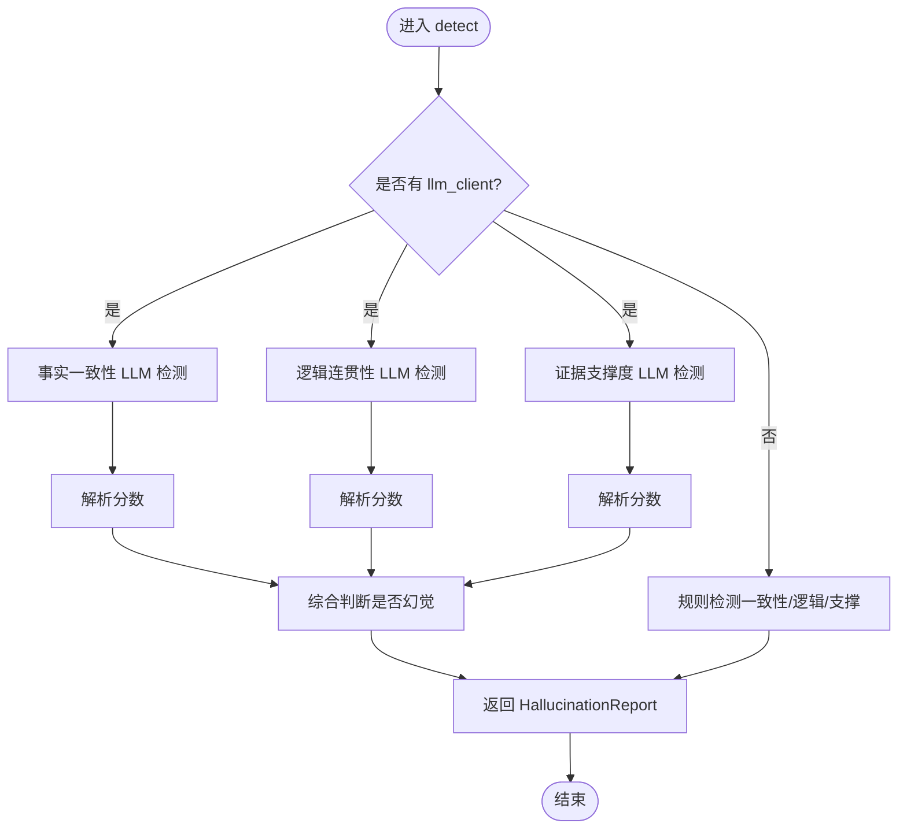
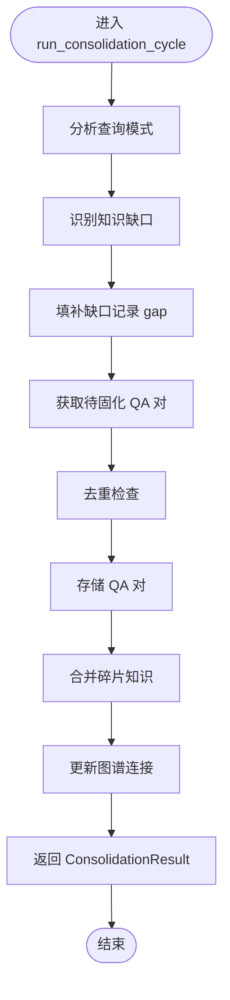
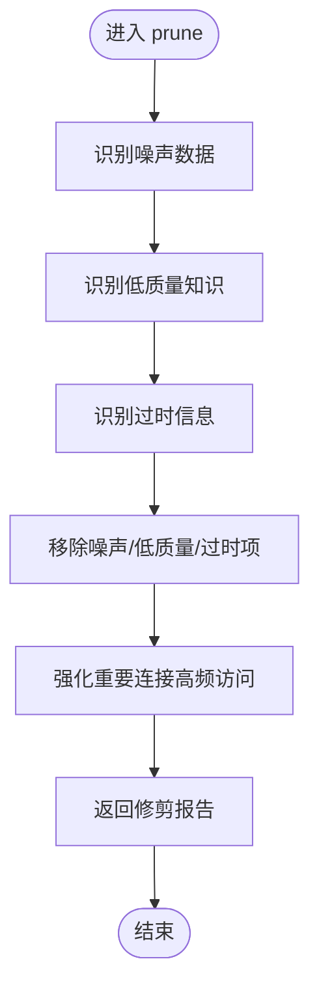
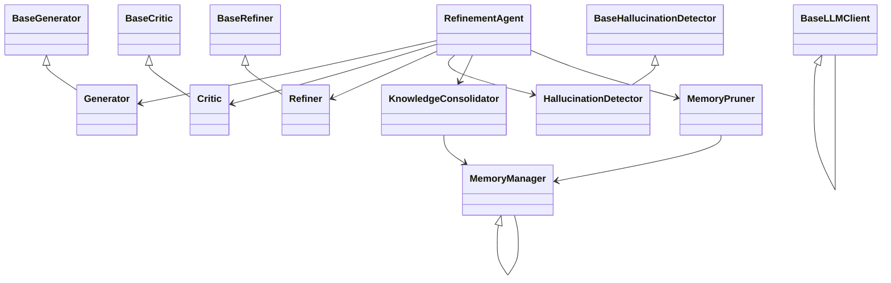

# 精炼代理核心

<cite>
**本文引用的文件**
- [agent.py](file://src/refinement/agent.py)
- [generator.py](file://src/refinement/generator.py)
- [critic.py](file://src/refinement/critic.py)
- [refiner.py](file://src/refinement/refiner.py)
- [hallucination.py](file://src/refinement/hallucination.py)
- [models.py](file://src/refinement/models.py)
- [consolidator.py](file://src/refinement/consolidator.py)
- [pruner.py](file://src/refinement/pruner.py)
- [manager.py](file://src/memory/manager.py)
- [base.py](file://src/core/base.py)
- [example_usage.py](file://example/example_usage.py)
- [README.md](file://README.md)
</cite>

## 目录
1. [简介](#简介)
2. [项目结构](#项目结构)
3. [核心组件](#核心组件)
4. [架构总览](#架构总览)
5. [详细组件分析](#详细组件分析)
6. [依赖关系分析](#依赖关系分析)
7. [性能考量](#性能考量)
8. [故障排查指南](#故障排查指南)
9. [结论](#结论)
10. [附录](#附录)

## 简介
本文件聚焦“精炼代理”（RefinementAgent）核心组件，系统阐述其设计架构、初始化流程、参数配置、组件依赖关系，以及 process 方法的完整执行流程（生成-批判-修正-幻觉检测-结果返回）。同时介绍异步知识固化任务的运行机制与后台任务管理，并提供使用模式与最佳实践，帮助读者正确配置与高效使用精炼代理。

## 项目结构
精炼代理位于巩固层（L4），与感知层（L1）、记忆层（L2）、检索层（L3）、交互层（L5）协同工作，形成完整的五层认知架构。精炼代理通过三重验证闭环（Generator-Critic-Refiner）保障答案质量，并集成幻觉检测与知识固化/记忆修剪等能力。

图表来源
- [agent.py:20-63](file://src/refinement/agent.py#L20-L63)
- [consolidator.py:41-86](file://src/refinement/consolidator.py#L41-L86)
- [pruner.py:10-39](file://src/refinement/pruner.py#L10-L39)
- [manager.py:16-195](file://src/memory/manager.py#L16-L195)

章节来源
- [agent.py:20-63](file://src/refinement/agent.py#L20-L63)
- [consolidator.py:41-86](file://src/refinement/consolidator.py#L41-L86)
- [pruner.py:10-39](file://src/refinement/pruner.py#L10-L39)
- [manager.py:16-195](file://src/memory/manager.py#L16-L195)

## 核心组件
- RefinementAgent：三重验证闭环的编排器，负责迭代生成、批判、修正与幻觉检测，最终产出高质量答案。
- Generator：基于检索证据生成答案，支持 LLM 客户端注入与规则回退。
- Critic：多维度评估答案质量（事实性、完整性、相关性），支持 LLM 与规则双通道。
- Refiner：基于批判反馈修正答案，支持迭代修正与证据融合。
- HallucinationDetector：检测答案中的事实一致性、逻辑连贯性与证据支撑度。
- KnowledgeConsolidator：异步知识固化，识别缺口、去重合并、持久化高质量 QA 对。
- MemoryPruner：模拟猫“舔毛梳理”行为，清理噪声、低质量与过时信息，强化重要连接。

章节来源
- [agent.py:20-63](file://src/refinement/agent.py#L20-L63)
- [generator.py:16-51](file://src/refinement/generator.py#L16-L51)
- [critic.py:18-47](file://src/refinement/critic.py#L18-L47)
- [refiner.py:18-44](file://src/refinement/refiner.py#L18-L44)
- [hallucination.py:18-47](file://src/refinement/hallucination.py#L18-L47)
- [consolidator.py:41-86](file://src/refinement/consolidator.py#L41-L86)
- [pruner.py:10-39](file://src/refinement/pruner.py#L10-L39)

## 架构总览
精炼代理采用“生成-批判-修正-幻觉检测”的闭环设计，配合知识固化与记忆修剪，形成持续优化的质量保障体系。Agent 的 process 流程在每次迭代中依次执行生成、批判、幻觉检测与必要时的修正，直至满足质量阈值或达到最大迭代次数。

图表来源
- [agent.py:65-141](file://src/refinement/agent.py#L65-L141)
- [generator.py:68-101](file://src/refinement/generator.py#L68-L101)
- [critic.py:90-112](file://src/refinement/critic.py#L90-L112)
- [refiner.py:98-130](file://src/refinement/refiner.py#L98-L130)
- [hallucination.py:136-156](file://src/refinement/hallucination.py#L136-L156)

章节来源
- [agent.py:65-141](file://src/refinement/agent.py#L65-L141)

## 详细组件分析

### RefinementAgent 类
- 职责：编排三重验证闭环，管理迭代流程，协调幻觉检测与知识固化/修剪。
- 关键参数：
  - llm_model：LLM 模型标识
  - memory：MemoryManager 实例（可选）
  - max_iterations：最大迭代次数
  - min_confidence：最低置信度阈值
- 生命周期：
  - 初始化：创建 Generator、Critic、Refiner、HallucinationDetector；若提供 memory，则创建 KnowledgeConsolidator 与 MemoryPruner。
  - process：执行一次完整的生成-批判-修正-幻觉检测循环，返回 RefinementResult。
  - run_background_tasks：异步运行知识固化与记忆修剪，返回执行结果字典。
- 处理逻辑要点：
  - 若通过批判且非幻觉，直接返回当前答案；
  - 若批判未通过，调用 Refiner 修正；
  - 若检测到幻觉，降低置信度；
  - 达到最大迭代次数后，若置信度仍低于阈值，返回兜底消息。

图表来源
- [agent.py:31-63](file://src/refinement/agent.py#L31-L63)
- [agent.py:65-163](file://src/refinement/agent.py#L65-L163)

章节来源
- [agent.py:31-63](file://src/refinement/agent.py#L31-L63)
- [agent.py:65-163](file://src/refinement/agent.py#L65-L163)

### Generator 类
- 职责：基于检索证据生成答案，支持 LLM 与规则两种生成路径。
- 关键参数：
  - llm_client：LLM 客户端（可注入）
  - max_evidence：最大使用证据数量
  - temperature：生成温度
- 生成策略：
  - 若提供 llm_client：构建提示词，调用 LLM 生成，随后估算置信度；
  - 否则：基于规则生成，汇总证据要点，估算置信度。
- 置信度估算：综合证据数量、答案长度、关键词覆盖度。

图表来源
- [generator.py:68-101](file://src/refinement/generator.py#L68-L101)
- [generator.py:103-175](file://src/refinement/generator.py#L103-L175)
- [generator.py:177-209](file://src/refinement/generator.py#L177-L209)

章节来源
- [generator.py:68-101](file://src/refinement/generator.py#L68-L101)
- [generator.py:103-175](file://src/refinement/generator.py#L103-L175)
- [generator.py:177-209](file://src/refinement/generator.py#L177-L209)

### Critic 类
- 职责：多维度评估答案质量（事实性、完整性、相关性）。
- 关键参数：
  - llm_client：LLM 客户端（可注入）
  - factuality_weight、completeness_weight、relevance_weight：各维度权重
- 评估流程：
  - 若提供 llm_client：构造提示词，调用 LLM，解析 JSON 结果，计算加权质量分；
  - 否则：基于规则评估（证据引用、置信度、答案长度、关键词重叠）。
- 解析策略：优先解析 JSON，失败则关键词启发式判断，再退化到规则评估。

图表来源
- [critic.py:90-112](file://src/refinement/critic.py#L90-L112)
- [critic.py:114-142](file://src/refinement/critic.py#L114-L142)
- [critic.py:143-230](file://src/refinement/critic.py#L143-L230)
- [critic.py:232-308](file://src/refinement/critic.py#L232-L308)

章节来源
- [critic.py:90-112](file://src/refinement/critic.py#L90-L112)
- [critic.py:114-142](file://src/refinement/critic.py#L114-L142)
- [critic.py:143-230](file://src/refinement/critic.py#L143-L230)
- [critic.py:232-308](file://src/refinement/critic.py#L232-L308)

### Refiner 类
- 职责：基于批判反馈修正答案，支持迭代修正与证据融合。
- 关键参数：
  - llm_client：LLM 客户端（可注入）
  - max_iterations：最大迭代次数
  - quality_threshold：质量阈值
- 修正策略：
  - 若提供 llm_client：构造修正提示词，调用 LLM 生成新答案，清洗响应，更新置信度与引用；
  - 否则：基于规则扩展答案、融合补充证据、提取关键要点。
- 迭代修正：refine_iterative 支持多次迭代直到达标或达到上限。

图表来源
- [refiner.py:98-130](file://src/refinement/refiner.py#L98-L130)
- [refiner.py:132-175](file://src/refinement/refiner.py#L132-L175)
- [refiner.py:177-244](file://src/refinement/refiner.py#L177-L244)
- [refiner.py:246-296](file://src/refinement/refiner.py#L246-L296)

章节来源
- [refiner.py:98-130](file://src/refinement/refiner.py#L98-L130)
- [refiner.py:132-175](file://src/refinement/refiner.py#L132-L175)
- [refiner.py:177-244](file://src/refinement/refiner.py#L177-L244)
- [refiner.py:246-296](file://src/refinement/refiner.py#L246-L296)

### HallucinationDetector 类
- 职责：检测答案中的事实一致性、逻辑连贯性与证据支撑度。
- 关键参数：
  - llm_client：LLM 客户端（可注入）
  - fact_threshold、logic_threshold、support_threshold：检测阈值
- 检测流程：
  - 若提供 llm_client：分别调用三项 LLM 检测，解析 JSON 得分，综合判断是否幻觉；
  - 否则：基于规则方法（关键词重叠、逻辑连接词、声明覆盖度）评估。
- 解析策略：优先 JSON，其次正则提取分数，最后关键词启发式。

图表来源
- [hallucination.py:136-156](file://src/refinement/hallucination.py#L136-L156)
- [hallucination.py:158-257](file://src/refinement/hallucination.py#L158-L257)
- [hallucination.py:308-339](file://src/refinement/hallucination.py#L308-L339)

章节来源
- [hallucination.py:136-156](file://src/refinement/hallucination.py#L136-L156)
- [hallucination.py:158-257](file://src/refinement/hallucination.py#L158-L257)
- [hallucination.py:308-339](file://src/refinement/hallucination.py#L308-L339)

### KnowledgeConsolidator 类
- 职责：异步知识固化，识别缺口、去重合并、持久化 QA 对、更新图谱连接。
- 关键参数：
  - memory_manager：MemoryManager 实例
  - llm_client：LLM 客户端（可注入）
  - min_query_frequency、quality_threshold、similarity_threshold：固化阈值
- 固化流程：
  - 分析查询模式，识别知识缺口；
  - 填补缺口（记录 gap）；
  - 处理待固化 QA 对（去重、存储）；
  - 合并碎片知识；
  - 更新图谱连接。
- 结果：返回 ConsolidationResult，包含存储数量、去重数量、合并数量、缺口识别数与耗时。

图表来源
- [consolidator.py:105-160](file://src/refinement/consolidator.py#L105-L160)
- [consolidator.py:217-248](file://src/refinement/consolidator.py#L217-L248)
- [consolidator.py:250-280](file://src/refinement/consolidator.py#L250-L280)
- [consolidator.py:282-321](file://src/refinement/consolidator.py#L282-L321)
- [consolidator.py:323-357](file://src/refinement/consolidator.py#L323-L357)

章节来源
- [consolidator.py:105-160](file://src/refinement/consolidator.py#L105-L160)
- [consolidator.py:217-248](file://src/refinement/consolidator.py#L217-L248)
- [consolidator.py:250-280](file://src/refinement/consolidator.py#L250-L280)
- [consolidator.py:282-321](file://src/refinement/consolidator.py#L282-L321)
- [consolidator.py:323-357](file://src/refinement/consolidator.py#L323-L357)

### MemoryPruner 类
- 职责：模拟猫“舔毛梳理”，清理噪声、低质量与过时信息，强化重要连接。
- 关键参数：
  - memory_manager：MemoryManager 实例
  - noise_threshold、quality_threshold、outdated_days：修剪阈值
- 修剪策略：
  - 识别噪声：权重低且访问次数少；
  - 识别低质量：内容短且权重低；
  - 识别过时：最后访问时间早于阈值；
  - 执行修剪：删除噪声/低质量/过时项；
  - 强化连接：提升高频访问记忆权重。
- 结果：返回包含移除数量、强化数量、各类识别数量的字典。

图表来源
- [pruner.py:41-69](file://src/refinement/pruner.py#L41-L69)
- [pruner.py:71-118](file://src/refinement/pruner.py#L71-L118)
- [pruner.py:120-157](file://src/refinement/pruner.py#L120-L157)

章节来源
- [pruner.py:41-69](file://src/refinement/pruner.py#L41-L69)
- [pruner.py:71-118](file://src/refinement/pruner.py#L71-L118)
- [pruner.py:120-157](file://src/refinement/pruner.py#L120-L157)

## 依赖关系分析
- 组件耦合：
  - RefinementAgent 依赖 Generator、Critic、Refiner、HallucinationDetector；
  - 若提供 MemoryManager，Agent 依赖 KnowledgeConsolidator 与 MemoryPruner；
  - 各组件均继承自对应抽象基类，确保可替换性与一致性。
- 外部依赖：
  - LLM 客户端：可注入 BaseLLMClient 或 BaseAsyncLLMClient；
  - MemoryManager：用于知识固化与修剪的数据持久化与检索。

图表来源
- [base.py:448-537](file://src/core/base.py#L448-L537)
- [agent.py:31-63](file://src/refinement/agent.py#L31-L63)
- [consolidator.py:41-86](file://src/refinement/consolidator.py#L41-L86)
- [pruner.py:10-39](file://src/refinement/pruner.py#L10-L39)

章节来源
- [base.py:448-537](file://src/core/base.py#L448-L537)
- [agent.py:31-63](file://src/refinement/agent.py#L31-L63)
- [consolidator.py:41-86](file://src/refinement/consolidator.py#L41-L86)
- [pruner.py:10-39](file://src/refinement/pruner.py#L10-L39)

## 性能考量
- 迭代次数与置信度阈值：max_iterations 与 min_confidence 控制收敛速度与质量边界，建议根据业务场景平衡成本与准确性。
- LLM 调用开销：生成、批判、修正、幻觉检测均可能触发 LLM 调用，建议在高并发场景启用缓存与限流策略。
- 知识固化与修剪：run_background_tasks 为异步执行，避免阻塞主线程；建议在低峰时段运行，或拆分为多个子任务。
- 规则回退：当 LLM 不可用时自动降级至规则路径，保证系统可用性，但质量可能下降，需关注阈值设置。

## 故障排查指南
- LLM 客户端不可用：
  - 现象：组件自动使用 MockLLMClient，功能降级；
  - 处理：检查 LLM 客户端初始化与可用性，恢复后自动切换至 LLM 路径。
- 批判解析失败：
  - 现象：JSON 解析异常或 LLM 调用异常；
  - 处理：回退到规则评估，检查提示词与模型输出稳定性。
- 幻觉检测阈值过高：
  - 现象：频繁误报为幻觉；
  - 处理：适当降低 fact_threshold、logic_threshold、support_threshold。
- 知识固化未生效：
  - 现象：run_background_tasks 返回 skipped；
  - 处理：确认 MemoryManager 已初始化，且具备存储能力。
- 记忆修剪过度：
  - 现象：重要知识被误删；
  - 处理：调整 noise_threshold、quality_threshold、outdated_days，或增加高频访问权重强化。

章节来源
- [agent.py:143-163](file://src/refinement/agent.py#L143-L163)
- [critic.py:136-141](file://src/refinement/critic.py#L136-L141)
- [hallucination.py:215-219](file://src/refinement/hallucination.py#L215-L219)
- [pruner.py:41-69](file://src/refinement/pruner.py#L41-L69)

## 结论
精炼代理通过三重验证闭环与异步知识管理，有效提升了答案质量与系统长期稳定性。合理配置参数、选择合适的 LLM 客户端、并结合规则回退与后台任务，可在保证性能的同时获得可靠的输出质量。

## 附录

### API 接口说明
- RefinementAgent.process
  - 参数：query（查询文本）、evidence（证据列表）、context（上下文，可选）
  - 返回：RefinementResult（包含答案、置信度、引用、幻觉报告、迭代次数等）
- RefinementAgent.run_background_tasks
  - 返回：dict（包含 consolidation 与 pruning 的执行结果）
- Generator.generate
  - 返回：GeneratedAnswer（包含 content、citations、confidence、metadata）
- Critic.critique
  - 返回：CritiqueReport（包含 is_valid、issues、suggestions、quality_score）
- Refiner.refine/refine_iterative
  - 返回：GeneratedAnswer（修正后的答案）
- HallucinationDetector.detect
  - 返回：HallucinationReport（包含 is_hallucination、各项分数与问题列表）
- KnowledgeConsolidator.run_consolidation_cycle
  - 返回：ConsolidationResult（包含存储、去重、合并数量与耗时）
- MemoryPruner.prune
  - 返回：dict（包含移除数量、强化数量、各类识别数量）

章节来源
- [agent.py:65-163](file://src/refinement/agent.py#L65-L163)
- [generator.py:68-101](file://src/refinement/generator.py#L68-L101)
- [critic.py:90-112](file://src/refinement/critic.py#L90-L112)
- [refiner.py:98-175](file://src/refinement/refiner.py#L98-L175)
- [hallucination.py:136-156](file://src/refinement/hallucination.py#L136-L156)
- [consolidator.py:105-160](file://src/refinement/consolidator.py#L105-L160)
- [pruner.py:41-69](file://src/refinement/pruner.py#L41-L69)

### 使用示例与最佳实践
- 使用示例：参见 example/example_usage.py 中的 example_refinement，展示如何初始化 RefinementAgent 并处理查询。
- 最佳实践：
  - 根据业务场景调整 max_iterations 与 min_confidence；
  - 在高并发场景下启用 LLM 客户端池化与限流；
  - 定期运行 run_background_tasks，保持知识库新鲜度；
  - 监控幻觉检测报告，动态调整阈值；
  - 对关键路径启用 LLM，非关键路径使用规则回退。

章节来源
- [example_usage.py:139-173](file://example/example_usage.py#L139-L173)