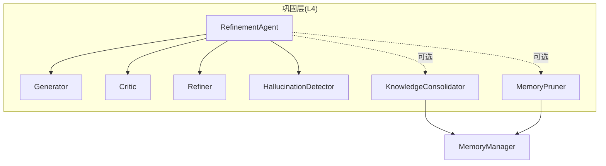
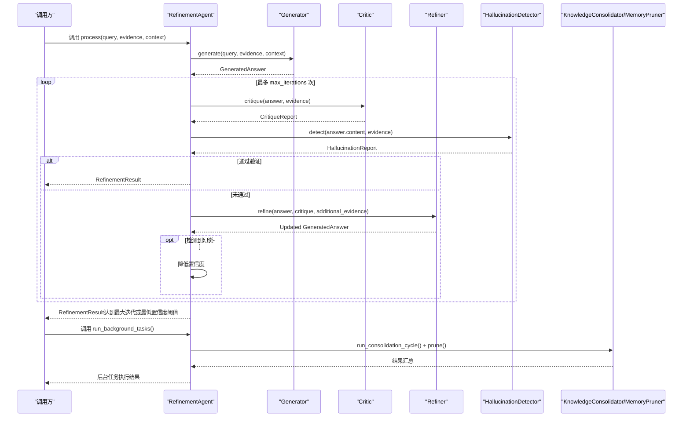
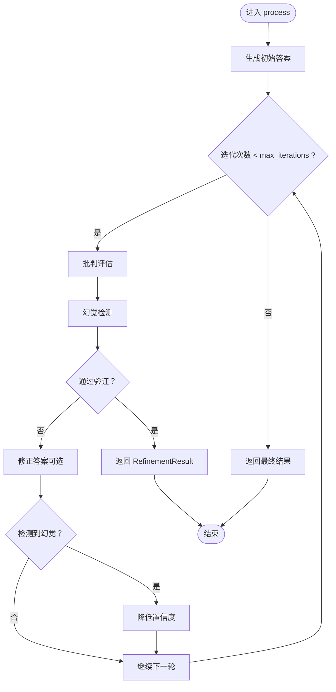
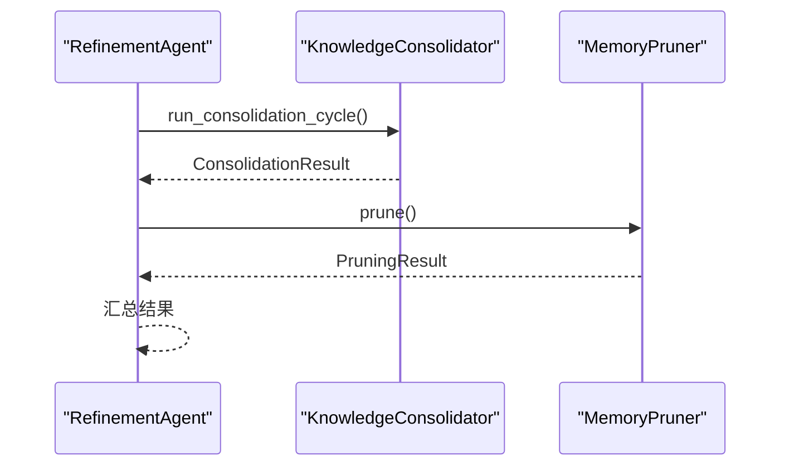

# 精炼代理核心

<cite>
**本文引用的文件**
- [agent.py](file://src/refinement/agent.py)
- [generator.py](file://src/refinement/generator.py)
- [critic.py](file://src/refinement/critic.py)
- [refiner.py](file://src/refinement/refiner.py)
- [hallucination.py](file://src/refinement/hallucination.py)
- [models.py](file://src/refinement/models.py)
- [consolidator.py](file://src/refinement/consolidator.py)
- [pruner.py](file://src/refinement/pruner.py)
- [manager.py](file://src/memory/manager.py)
- [base.py](file://src/core/llm/base.py)
- [example_usage.py](file://example/example_usage.py)
- [README.md](file://README.md)
- [necorag.py](file://src/necorag.py)
- [config.py](file://src/core/config.py)
</cite>

## 目录
1. [简介](#简介)
2. [项目结构](#项目结构)
3. [核心组件](#核心组件)
4. [架构总览](#架构总览)
5. [详细组件分析](#详细组件分析)
6. [依赖关系分析](#依赖关系分析)
7. [性能考量](#性能考量)
8. [故障排查指南](#故障排查指南)
9. [结论](#结论)
10. [附录](#附录)

## 简介
本文件聚焦“精炼代理”（RefinementAgent）核心组件，系统阐述其设计架构、初始化流程、参数配置、组件依赖关系，以及 process 方法的完整执行流程（生成-批判-修正-幻觉检测-结果返回）。同时介绍异步知识固化任务的运行机制与后台任务管理，并提供使用模式与最佳实践，帮助读者正确配置与高效使用精炼代理。

## 项目结构
精炼代理位于 src/refinement 目录，围绕 RefinementAgent 主类组织生成、批判、修正、幻觉检测、知识固化与记忆修剪等子模块，并通过 MemoryManager 与记忆层交互，形成“认知-验证-优化-沉淀”的完整流程。

图表来源
- [agent.py:16-151](file://src/refinement/agent.py#L16-L151)
- [generator.py:15-208](file://src/refinement/generator.py#L15-L208)
- [critic.py:9-72](file://src/refinement/critic.py#L9-L72)
- [refiner.py:8-64](file://src/refinement/refiner.py#L8-L64)
- [hallucination.py:9-154](file://src/refinement/hallucination.py#L9-L154)
- [consolidator.py:9-142](file://src/refinement/consolidator.py#L9-L142)
- [pruner.py:10-157](file://src/refinement/pruner.py#L10-L157)
- [manager.py:20-212](file://src/memory/manager.py#L20-L212)

章节来源
- [agent.py:16-151](file://src/refinement/agent.py#L16-L151)
- [generator.py:15-208](file://src/refinement/generator.py#L15-L208)
- [critic.py:9-72](file://src/refinement/critic.py#L9-L72)
- [refiner.py:8-64](file://src/refinement/refiner.py#L8-L64)
- [hallucination.py:9-154](file://src/refinement/hallucination.py#L9-L154)
- [consolidator.py:9-142](file://src/refinement/consolidator.py#L9-L142)
- [pruner.py:10-157](file://src/refinement/pruner.py#L10-L157)
- [manager.py:20-212](file://src/memory/manager.py#L20-L212)

## 核心组件
- RefinementAgent：主控制器，协调生成、批判、修正、幻觉检测与后台任务。
- Generator：基于证据生成答案，支持 LLM 与规则回退。
- Critic：多维度评估答案质量，支持 LLM 与规则回退。
- Refiner：基于批判反馈修正答案，支持 LLM 与规则回退。
- HallucinationDetector：检测事实一致性、逻辑连贯性与证据支撑度。
- KnowledgeConsolidator：异步知识固化，识别知识缺口、合并碎片知识、更新图谱连接。
- MemoryPruner：模拟猫“舔毛”行为，清理噪声、强化重要连接、修剪过时信息。
- MemoryManager：统一管理三层记忆，为固化与修剪提供持久化能力。

章节来源
- [agent.py:20-64](file://src/refinement/agent.py#L20-L64)
- [generator.py:16-52](file://src/refinement/generator.py#L16-L52)
- [critic.py:18-57](file://src/refinement/critic.py#L18-L57)
- [refiner.py:18-53](file://src/refinement/refiner.py#L18-L53)
- [hallucination.py:18-56](file://src/refinement/hallucination.py#L18-L56)
- [consolidator.py:41-87](file://src/refinement/consolidator.py#L41-L87)
- [pruner.py:10-40](file://src/refinement/pruner.py#L10-L40)
- [manager.py:20-51](file://src/memory/manager.py#L20-L51)

## 架构总览
精炼代理采用“生成-批判-修正-幻觉检测”的闭环，结合记忆管理器实现异步知识固化与修剪，形成“认知-验证-优化-沉淀”的完整流程。

图表来源
- [agent.py:65-164](file://src/refinement/agent.py#L65-L164)
- [generator.py:68-102](file://src/refinement/generator.py#L68-L102)
- [critic.py:90-113](file://src/refinement/critic.py#L90-L113)
- [refiner.py:98-131](file://src/refinement/refiner.py#L98-L131)
- [hallucination.py:136-157](file://src/refinement/hallucination.py#L136-L157)
- [consolidator.py:105-161](file://src/refinement/consolidator.py#L105-L161)
- [pruner.py:41-69](file://src/refinement/pruner.py#L41-L69)

## 详细组件分析

### RefinementAgent 设计与初始化
- 职责：协调生成-批判-修正-幻觉检测闭环，管理异步知识固化与修剪。
- 初始化参数：
  - llm_model：LLM 模型标识（用于子组件注入）。
  - memory：MemoryManager（可选），用于知识固化与修剪。
  - max_iterations：最大迭代次数（控制生成-批判-修正闭环的上限）。
  - min_confidence：最低置信度阈值（决定最终答案是否接受）。
- 子组件装配：在初始化时创建 Generator、Critic、Refiner、HallucinationDetector；若提供 MemoryManager，则创建 KnowledgeConsolidator 与 MemoryPruner。

图表来源
- [agent.py:20-64](file://src/refinement/agent.py#L20-L64)
- [generator.py:16-209](file://src/refinement/generator.py#L16-L209)
- [critic.py:18-309](file://src/refinement/critic.py#L18-L309)
- [refiner.py:18-371](file://src/refinement/refiner.py#L18-L371)
- [hallucination.py:18-507](file://src/refinement/hallucination.py#L18-L507)
- [consolidator.py:41-659](file://src/refinement/consolidator.py#L41-L659)
- [pruner.py:10-157](file://src/refinement/pruner.py#L10-L157)

章节来源
- [agent.py:31-64](file://src/refinement/agent.py#L31-L64)

### process 方法执行流程（生成-批判-修正-幻觉检测-闭环）
- 输入：query、evidence、context。
- 步骤：
  1) 生成初始答案：调用 Generator.generate。
  2) 迭代闭环（最多 max_iterations 次）：
     - 批判评估：调用 Critic.critique。
     - 幻觉检测：调用 HallucinationDetector.detect。
     - 通过验证：返回 RefinementResult。
     - 未通过：若批判无效则调用 Refiner.refine；若检测到幻觉则降低置信度。
  3) 达到最大迭代或最低置信度阈值：返回当前答案或兜底文本。

图表来源
- [agent.py:65-141](file://src/refinement/agent.py#L65-L141)
- [generator.py:68-102](file://src/refinement/generator.py#L68-L102)
- [critic.py:90-113](file://src/refinement/critic.py#L90-L113)
- [refiner.py:98-131](file://src/refinement/refiner.py#L98-L131)
- [hallucination.py:136-157](file://src/refinement/hallucination.py#L136-L157)

章节来源
- [agent.py:65-141](file://src/refinement/agent.py#L65-L141)

### max_iterations 与 min_confidence 参数
- max_iterations：
  - 控制生成-批判-修正闭环的迭代上限，平衡质量与性能。
  - 建议：在生产环境适度提高（如 3~5），以提升答案稳定性。
- min_confidence：
  - 决定最终答案是否接受，低于阈值返回兜底文本。
  - 建议：结合业务场景设定（如 0.7~0.8），兼顾准确性与可用性。
- 调优策略：
  - 通过 RefinementConfig 或构造函数传参调整。
  - 结合 Critic 与 HallucinationDetector 的评分与报告进行动态校准。

章节来源
- [agent.py:35-50](file://src/refinement/agent.py#L35-L50)
- [config.py:198-216](file://src/core/config.py#L198-L216)

### 异步后台任务处理（run_background_tasks）
- 作用：异步执行知识固化与记忆修剪，避免阻塞主线程。
- 逻辑：
  - 若未提供 MemoryManager，返回跳过原因。
  - 调用 KnowledgeConsolidator.run_consolidation_cycle，执行知识缺口识别、QA 对固化、碎片合并与图谱更新。
  - 调用 MemoryPruner.prune，执行噪声、低质量与过时信息的修剪，并强化重要连接。
  - 返回结果字典，包含各阶段统计与耗时。

图表来源
- [agent.py:143-164](file://src/refinement/agent.py#L143-L164)
- [consolidator.py:105-161](file://src/refinement/consolidator.py#L105-L161)
- [pruner.py:41-69](file://src/refinement/pruner.py#L41-L69)

章节来源
- [agent.py:143-164](file://src/refinement/agent.py#L143-L164)

### 组件协作与数据流
- 数据模型：
  - GeneratedAnswer：包含 content、citations、confidence、metadata。
  - CritiqueReport：包含 is_valid、issues、suggestions、quality_score。
  - HallucinationReport：包含 is_hallucination、fact_score、logic_score、support_score、issues。
  - RefinementResult：包含 query、answer、confidence、citations、hallucination_report、iterations、metadata。
- 协作流程：
  - Generator 产出 GeneratedAnswer，传递给 Critic 与 Refiner。
  - HallucinationDetector 对 GeneratedAnswer.content 与 evidence 进行检测。
  - RefinementAgent 根据评估结果迭代修正，必要时降低置信度。
  - KnowledgeConsolidator 与 MemoryPruner 通过 MemoryManager 持久化与维护知识。

章节来源
- [models.py:9-66](file://src/refinement/models.py#L9-L66)
- [generator.py:19-26](file://src/refinement/generator.py#L19-L26)
- [critic.py:29-35](file://src/refinement/critic.py#L29-L35)
- [hallucination.py:10-17](file://src/refinement/hallucination.py#L10-L17)
- [manager.py:20-51](file://src/memory/manager.py#L20-L51)

## 依赖关系分析
- RefinementAgent 依赖各子组件的实现类，通过构造函数注入。
- 子组件均继承自对应抽象基类，确保接口一致性。
- KnowledgeConsolidator 与 MemoryPruner 依赖 MemoryManager，若未提供则跳过相关功能。
- LLM 客户端可注入，若未提供则使用 Mock 实现，保证系统在无 LLM 环境下仍可运行。

章节来源
- [agent.py:52-64](file://src/refinement/agent.py#L52-L64)
- [base.py:448-537](file://src/core/base.py#L448-L537)
- [manager.py:20-51](file://src/memory/manager.py#L20-L51)

## 性能考量
- 迭代上限与置信度阈值：通过 max_iterations 与 min_confidence 控制收敛速度与质量。
- 证据数量限制：Generator 默认限制最大证据数量，减少上下文开销。
- LLM 调用降级：当 LLM 客户端不可用时自动回退到规则实现，保障可用性。
- 异步固化与修剪：run_background_tasks 采用异步/同步分离策略，避免阻塞主线程。
- 日志与监控：建议在生产环境开启详细日志，记录迭代次数、置信度变化与幻觉检测结果，便于性能分析与问题定位。

## 故障排查指南
- 幻觉检测触发：
  - 检查 HallucinationReport 的各项指标与 issues，针对性优化证据与提示词。
- 批判评估不通过：
  - 关注 CritiqueReport 的 issues 与 suggestions，指导 Refiner 进行定向修正。
- 置信度过低：
  - 适当提高 min_confidence 或增加证据数量；检查 Generator 的置信度估算逻辑。
- 后台任务未执行：
  - 确认 MemoryManager 是否传入；检查 run_background_tasks 返回的状态字段。
- LLM 调用异常：
  - 检查 LLM 客户端配置与网络；观察回退到规则实现的日志。

章节来源
- [agent.py:90-141](file://src/refinement/agent.py#L90-L141)
- [hallucination.py:171-193](file://src/refinement/hallucination.py#L171-L193)
- [critic.py:136-142](file://src/refinement/critic.py#L136-L142)
- [refiner.py:242-245](file://src/refinement/refiner.py#L242-L245)

## 结论
精炼代理通过“生成-批判-修正-幻觉检测”的闭环，有效提升答案质量与可靠性；结合记忆管理器实现的异步知识固化与修剪，形成持续优化的知识体系。建议在生产环境中合理配置参数、监控幻觉报告，并将后台任务纳入调度系统，以获得稳定高效的问答体验。

## 附录

### 使用模式与示例
- 基础使用
  - 初始化 RefinementAgent（可选传入 MemoryManager）
  - 准备 evidence（通常来自检索层结果）
  - 调用 process 获取 RefinementResult
- 异步知识固化
  - 调用 run_background_tasks 获取固化与修剪结果
- 完整示例参考
  - [example_usage.py:139-173](file://example/example_usage.py#L139-L173)

章节来源
- [example_usage.py:139-173](file://example/example_usage.py#L139-L173)
- [README.md:290-329](file://README.md#L290-L329)