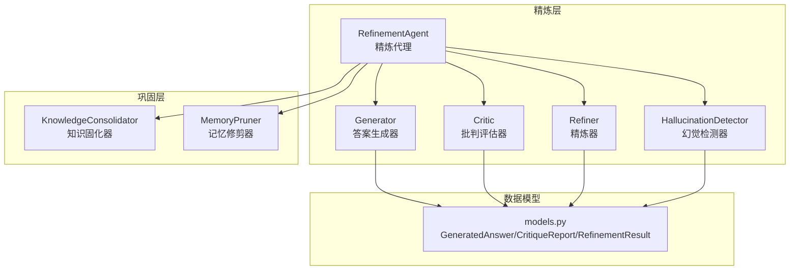
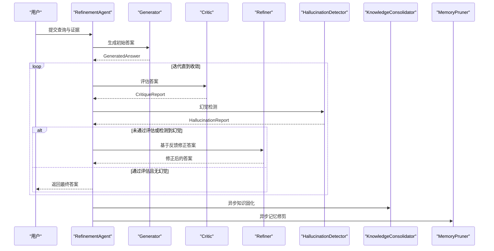
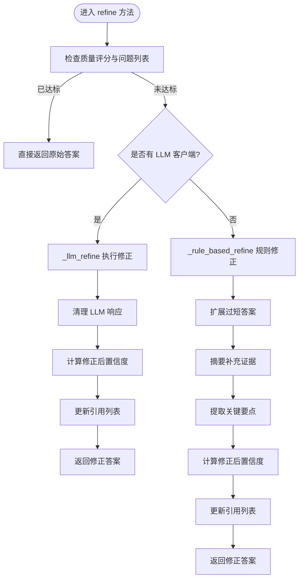
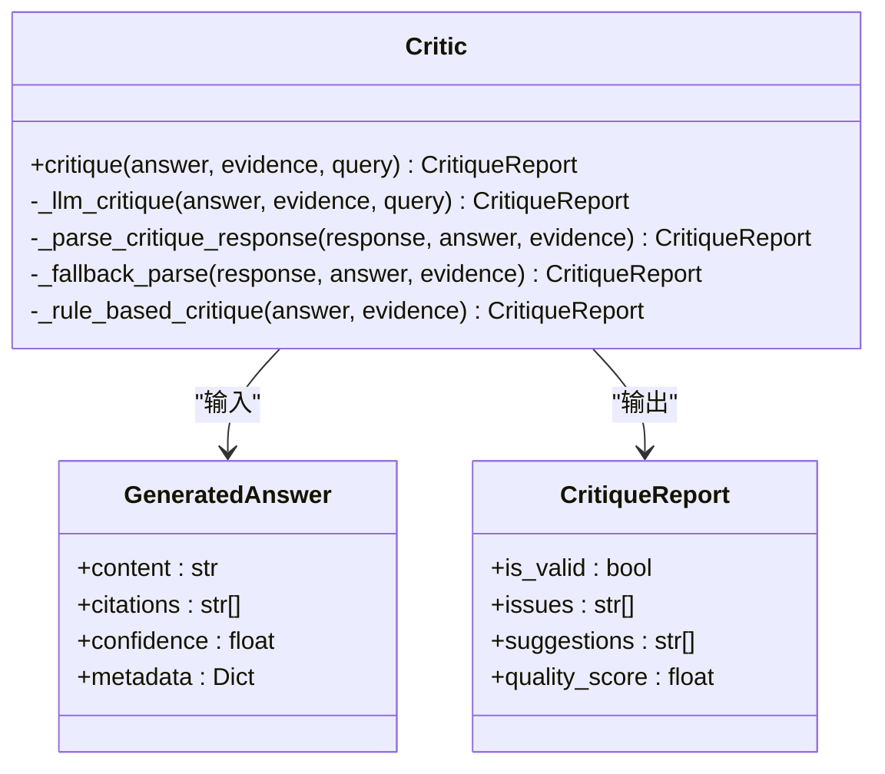
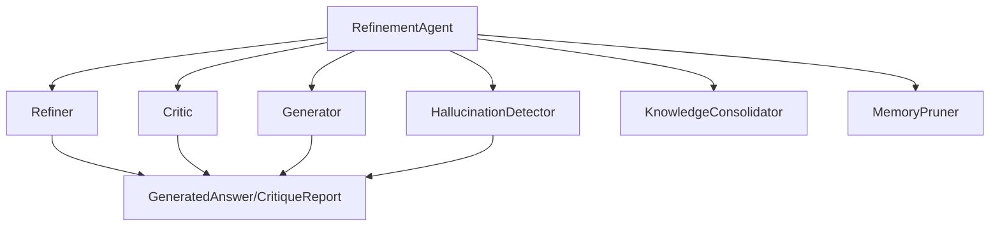

# 精炼器组件

<cite>
**本文引用的文件**
- [src/refinement/refiner.py](file://src/refinement/refiner.py)
- [src/refinement/critic.py](file://src/refinement/critic.py)
- [src/refinement/models.py](file://src/refinement/models.py)
- [src/refinement/agent.py](file://src/refinement/agent.py)
- [src/refinement/generator.py](file://src/refinement/generator.py)
- [src/refinement/hallucination.py](file://src/refinement/hallucination.py)
- [src/refinement/consolidator.py](file://src/refinement/consolidator.py)
- [src/refinement/pruner.py](file://src/refinement/pruner.py)
- [src/core/base.py](file://src/core/base.py)
- [src/core/config.py](file://src/core/config.py)
- [wiki/wiki/配置管理/巩固层配置.md](file://wiki/wiki/配置管理/巩固层配置.md)
- [src/dashboard/static/index.html](file://src/dashboard/static/index.html)
</cite>

## 目录
1. [简介](#简介)
2. [项目结构](#项目结构)
3. [核心组件](#核心组件)
4. [架构总览](#架构总览)
5. [详细组件分析](#详细组件分析)
6. [依赖关系分析](#依赖关系分析)
7. [性能考量](#性能考量)
8. [故障排查指南](#故障排查指南)
9. [结论](#结论)
10. [附录](#附录)

## 简介
本文件面向精炼器组件（Refiner）的深入技术文档，聚焦于答案修正与优化机制，包括基于批判反馈的迭代改进流程、证据补充与上下文调整、质量评估与改进跟踪、配置选项与个性化调整，以及与批评者（Critic）的协作关系。同时涵盖精炼过程的性能优化与资源控制策略，帮助开发者与使用者高效理解与应用该组件。

## 项目结构
精炼器组件位于 src/refinement 目录，围绕“生成-批判-修正”的闭环构建，配合幻觉检测、知识固化与记忆修剪形成完整的巩固层能力。

图表来源
- [src/refinement/agent.py:20-164](file://src/refinement/agent.py#L20-L164)
- [src/refinement/generator.py:16-209](file://src/refinement/generator.py#L16-L209)
- [src/refinement/critic.py:18-309](file://src/refinement/critic.py#L18-L309)
- [src/refinement/refiner.py:18-371](file://src/refinement/refiner.py#L18-L371)
- [src/refinement/hallucination.py:18-507](file://src/refinement/hallucination.py#L18-L507)
- [src/refinement/consolidator.py:41-659](file://src/refinement/consolidator.py#L41-L659)
- [src/refinement/pruner.py:10-157](file://src/refinement/pruner.py#L10-L157)
- [src/refinement/models.py:9-66](file://src/refinement/models.py#L9-L66)

章节来源
- [src/refinement/agent.py:20-164](file://src/refinement/agent.py#L20-L164)
- [src/refinement/models.py:9-66](file://src/refinement/models.py#L9-L66)

## 核心组件
- 精炼器（Refiner）：基于批判反馈进行答案修正与迭代优化，支持 LLM 与规则两种修正路径，具备证据融合与置信度调整能力。
- 批评者（Critic）：对生成答案进行多维度质量评估（事实性、完整性、相关性），输出质量评分与改进建议。
- 生成器（Generator）：基于检索证据生成初始答案，提供置信度估计。
- 幻觉检测器（HallucinationDetector）：检测事实一致性、逻辑连贯性与证据支撑度，辅助精炼决策。
- 精炼代理（RefinementAgent）：协调生成-批判-修正-幻觉检测-固化-修剪的完整流程。
- 知识固化器（KnowledgeConsolidator）：异步固化高质量 QA 对，识别知识缺口并合并碎片知识。
- 记忆修剪器（MemoryPruner）：清理噪声、低质量与过时信息，强化重要连接。

章节来源
- [src/refinement/refiner.py:18-371](file://src/refinement/refiner.py#L18-L371)
- [src/refinement/critic.py:18-309](file://src/refinement/critic.py#L18-L309)
- [src/refinement/generator.py:16-209](file://src/refinement/generator.py#L16-L209)
- [src/refinement/hallucination.py:18-507](file://src/refinement/hallucination.py#L18-L507)
- [src/refinement/agent.py:20-164](file://src/refinement/agent.py#L20-L164)
- [src/refinement/consolidator.py:41-659](file://src/refinement/consolidator.py#L41-L659)
- [src/refinement/pruner.py:10-157](file://src/refinement/pruner.py#L10-L157)

## 架构总览
精炼器在“生成-批判-修正-幻觉检测-固化-修剪”的闭环中扮演关键角色：先由生成器产出答案，Critic 进行质量评估，Refiner 基于反馈修正答案，HallucinationDetector 检测潜在幻觉并调整置信度，Agent 协调各组件并触发后台固化与修剪任务。

图表来源
- [src/refinement/agent.py:65-141](file://src/refinement/agent.py#L65-L141)
- [src/refinement/generator.py:68-141](file://src/refinement/generator.py#L68-L141)
- [src/refinement/critic.py:90-142](file://src/refinement/critic.py#L90-L142)
- [src/refinement/refiner.py:98-175](file://src/refinement/refiner.py#L98-L175)
- [src/refinement/hallucination.py:136-193](file://src/refinement/hallucination.py#L136-L193)

## 详细组件分析

### 精炼器（Refiner）核心机制
- 输入输出与职责
  - 输入：GeneratedAnswer、CritiqueReport、可选补充证据、原始查询、原始证据
  - 输出：修正后的 GeneratedAnswer，包含内容、引用、置信度与元数据
- 修正策略
  - LLM 修正：构造包含问题、当前答案、质量评分、问题清单、建议与证据的提示词，调用 LLM 生成修正答案，清理响应格式并更新置信度与引用。
  - 规则修正：在无 LLM 客户端时的降级方案，针对“过于简短”“证据关联度低”等常见问题进行扩展与融合。
- 迭代修正
  - refine_iterative 方法在给定批判函数与证据集合上循环执行，直至达到质量阈值或最大迭代次数，记录每次迭代信息与总迭代次数。
- 置信度调整
  - 基于原始置信度与质量评分计算修正后的置信度，质量越高置信度提升越明显，但受上限约束。
- 证据融合
  - 将原始证据与补充证据合并，格式化为“证据编号 + 内容”的形式，用于提示词与修正过程。
- 错误识别与修正策略
  - 通过 Critic 的问题清单与建议进行针对性修正，例如扩展内容、融合证据、强调关键要点等。
- 清理与规范化
  - 清理 LLM 响应中的代码块标记与解释性文字，保证输出纯答案文本。

图表来源
- [src/refinement/refiner.py:98-175](file://src/refinement/refiner.py#L98-L175)
- [src/refinement/refiner.py:177-244](file://src/refinement/refiner.py#L177-L244)
- [src/refinement/refiner.py:246-296](file://src/refinement/refiner.py#L246-L296)

章节来源
- [src/refinement/refiner.py:18-371](file://src/refinement/refiner.py#L18-L371)

### 批评者（Critic）协作关系
- 评估维度
  - 事实性（factuality）、完整性（completeness）、相关性（relevance），分别赋予权重并综合计算质量评分。
- 评估流程
  - LLM 评估：构造包含问题、答案与证据的提示词，解析 JSON 输出，提取评分、问题与建议；若解析失败则回退到关键词匹配策略。
  - 规则评估：在无 LLM 客户端时，基于证据引用、置信度、答案长度与关键词重叠度进行评分与建议生成。
- 输出
  - CritiqueReport，包含 is_valid（是否通过）、issues（问题列表）、suggestions（建议）、quality_score（质量评分）。

图表来源
- [src/refinement/critic.py:18-309](file://src/refinement/critic.py#L18-L309)
- [src/refinement/models.py:19-35](file://src/refinement/models.py#L19-L35)

章节来源
- [src/refinement/critic.py:18-309](file://src/refinement/critic.py#L18-L309)
- [src/refinement/models.py:19-35](file://src/refinement/models.py#L19-L35)

### 证据补充与上下文调整机制
- 证据合并
  - 将原始证据与补充证据合并，统一编号并格式化，便于提示词与修正过程使用。
- 上下文注入
  - 生成器支持在提示词中注入上下文信息，提升答案的准确性与相关性。
- 关键信息提取
  - 规则修正阶段从补充证据中提取关键要点，自然融入答案，避免生硬拼接。

章节来源
- [src/refinement/refiner.py:192-199](file://src/refinement/refiner.py#L192-L199)
- [src/refinement/refiner.py:357-370](file://src/refinement/refiner.py#L357-L370)
- [src/refinement/generator.py:112-127](file://src/refinement/generator.py#L112-L127)

### 精炼效果评估与质量改进跟踪
- 质量指标
  - 质量评分（quality_score）：综合事实性、完整性、相关性的加权得分。
  - 问题清单（issues）：发现的具体问题，指导修正方向。
  - 建议（suggestions）：可操作的改进建议。
  - 置信度（confidence）：修正前后置信度变化，反映答案可信度提升。
- 迭代统计
  - refine_iterative 记录每次迭代次数与总迭代次数，便于评估收敛效率。
- 幻觉检测
  - 幻觉检测器提供事实一致性、逻辑连贯性与证据支撑度三类指标，辅助质量改进与置信度调整。

章节来源
- [src/refinement/critic.py:164-187](file://src/refinement/critic.py#L164-L187)
- [src/refinement/refiner.py:171-175](file://src/refinement/refiner.py#L171-L175)
- [src/refinement/hallucination.py:171-193](file://src/refinement/hallucination.py#L171-L193)

### 精炼策略配置与个性化调整
- RefinementConfig（核心配置）
  - max_iterations：循环最大迭代次数，影响收敛速度与成本。
  - confidence_threshold：核心循环收敛阈值，控制是否继续迭代。
  - factual_threshold、logical_threshold、evidence_threshold：幻觉检测阈值，影响最终答案质量。
  - enable_consolidation、consolidation_interval：是否启用知识固化及固化周期。
  - enable_pruning、pruning_threshold：是否启用记忆修剪及修剪阈值。
- 前端配置（仪表板）
  - min_confidence：最终结果最低置信度阈值。
  - hallucination_threshold：整体幻觉风险控制阈值。
  - min_query_frequency、gap_fill_strategy：知识缺口识别与填充策略。
  - noise_threshold、quality_threshold、outdated_days：记忆修剪参数。
- 个性化调整建议
  - 提升 max_iterations 与 enable_consolidation 以获得更高质量与知识积累。
  - 调整 factual_threshold、logical_threshold、evidence_threshold 以平衡严格性与召回。
  - 在低资源环境下适当降低 temperature 与 max_tokens，减少 LLM 调用成本。

章节来源
- [src/core/config.py:197-216](file://src/core/config.py#L197-L216)
- [wiki/wiki/配置管理/巩固层配置.md:128-147](file://wiki/wiki/配置管理/巩固层配置.md#L128-L147)
- [src/dashboard/static/index.html:619-645](file://src/dashboard/static/index.html#L619-L645)

### 精炼器在流程中的关键作用与协作关系
- 与生成器（Generator）协作
  - 生成器提供初始答案与置信度，Refiner 基于反馈进行修正与置信度再评估。
- 与批评者（Critic）协作
  - Critic 提供质量评分与问题建议，Refiner 依据反馈进行针对性修正。
- 与幻觉检测器（HallucinationDetector）协作
  - 幻觉检测结果影响置信度调整，避免输出不可靠答案。
- 与精炼代理（RefinementAgent）协作
  - Agent 协调整个流程，控制迭代次数与收敛条件，触发后台任务。

章节来源
- [src/refinement/agent.py:65-141](file://src/refinement/agent.py#L65-L141)
- [src/refinement/generator.py:68-141](file://src/refinement/generator.py#L68-L141)
- [src/refinement/critic.py:90-142](file://src/refinement/critic.py#L90-L142)
- [src/refinement/refiner.py:98-175](file://src/refinement/refiner.py#L98-L175)
- [src/refinement/hallucination.py:136-193](file://src/refinement/hallucination.py#L136-L193)

### 性能优化与资源控制
- LLM 调用优化
  - 控制 temperature 与 max_tokens，减少生成开销。
  - 在无 LLM 客户端时自动降级至规则修正，保障可用性。
- 迭代次数控制
  - 通过 max_iterations 限制循环次数，避免无限迭代。
  - refine_iterative 记录迭代次数，便于性能分析与调优。
- 置信度与质量阈值
  - 合理设置 confidence_threshold 与 quality_score 阈值，平衡质量与成本。
- 后台任务
  - 知识固化与记忆修剪异步执行，避免阻塞主流程。

章节来源
- [src/refinement/refiner.py:28-53](file://src/refinement/refiner.py#L28-L53)
- [src/refinement/refiner.py:154-175](file://src/refinement/refiner.py#L154-L175)
- [src/refinement/agent.py:143-163](file://src/refinement/agent.py#L143-L163)

## 依赖关系分析
- 组件耦合
  - Refiner 依赖 GeneratedAnswer 与 CritiqueReport 数据模型，与 Critic 协作进行反馈驱动修正。
  - RefinementAgent 作为编排器，依赖 Generator、Critic、Refiner、HallucinationDetector、KnowledgeConsolidator、MemoryPruner。
- 外部依赖
  - LLM 客户端（BaseLLMClient）用于 LLM 修正与评估；在无 LLM 客户端时自动降级。
  - 记忆管理器（MemoryManager）用于知识固化与记忆修剪。

图表来源
- [src/refinement/agent.py:20-164](file://src/refinement/agent.py#L20-L164)
- [src/refinement/models.py:19-35](file://src/refinement/models.py#L19-L35)

章节来源
- [src/refinement/agent.py:20-164](file://src/refinement/agent.py#L20-L164)
- [src/refinement/models.py:19-35](file://src/refinement/models.py#L19-L35)

## 性能考量
- 生成与评估成本
  - LLM 调用成本与迭代次数、提示词长度正相关，可通过降低 temperature、限制 max_iterations 与证据数量来控制成本。
- 置信度与收敛
  - 合理设置 confidence_threshold 与 quality_score 阈值，避免过度迭代导致性能下降。
- 异步任务
  - 知识固化与记忆修剪异步执行，减少主流程等待时间，提升吞吐量。

## 故障排查指南
- LLM 调用失败
  - 现象：Refiner 在 LLM 修正阶段抛出异常。
  - 处理：自动降级至规则修正，检查 LLM 客户端配置与网络连接。
- 质量评分异常
  - 现象：Critic 返回 JSON 解析失败或评分偏低。
  - 处理：检查提示词格式与 LLM 输出稳定性；必要时启用规则评估回退。
- 幻觉风险
  - 现象：幻觉检测器报告事实一致性或证据支撑度不足。
  - 处理：增加补充证据、调整提示词、降低置信度阈值以避免输出不可靠答案。
- 迭代不收敛
  - 现象：refine_iterative 达到最大迭代次数仍未收敛。
  - 处理：检查 Critic 的建议是否可执行、证据是否充足、max_iterations 是否过低。

章节来源
- [src/refinement/refiner.py:242-244](file://src/refinement/refiner.py#L242-L244)
- [src/refinement/critic.py:136-141](file://src/refinement/critic.py#L136-L141)
- [src/refinement/hallucination.py:151-156](file://src/refinement/hallucination.py#L151-L156)
- [src/refinement/refiner.py:154-175](file://src/refinement/refiner.py#L154-L175)

## 结论
精炼器组件通过“生成-批判-修正-幻觉检测-固化-修剪”的闭环，实现了基于批判反馈的迭代优化与质量提升。其 LLM 与规则双路径设计兼顾性能与可靠性，证据融合与上下文调整机制增强了答案的准确性与相关性。配合完善的配置体系与后台任务，可在不同场景下实现个性化调整与资源控制，满足多样化应用需求。

## 附录
- 数据模型
  - GeneratedAnswer：包含 content、citations、confidence、metadata。
  - CritiqueReport：包含 is_valid、issues、suggestions、quality_score。
  - RefinementResult：包含 query、answer、confidence、citations、hallucination_report、iterations、metadata。
- 关键接口
  - Refiner.refine：基于反馈修正答案。
  - Refiner.refine_iterative：迭代修正直到收敛。
  - Critic.critique：多维度评估答案质量。
  - HallucinationDetector.detect：检测幻觉并返回报告。
  - RefinementAgent.process：协调全流程并返回结果。

章节来源
- [src/refinement/models.py:19-66](file://src/refinement/models.py#L19-L66)
- [src/refinement/refiner.py:98-175](file://src/refinement/refiner.py#L98-L175)
- [src/refinement/critic.py:90-142](file://src/refinement/critic.py#L90-L142)
- [src/refinement/hallucination.py:136-193](file://src/refinement/hallucination.py#L136-L193)
- [src/refinement/agent.py:65-141](file://src/refinement/agent.py#L65-L141)