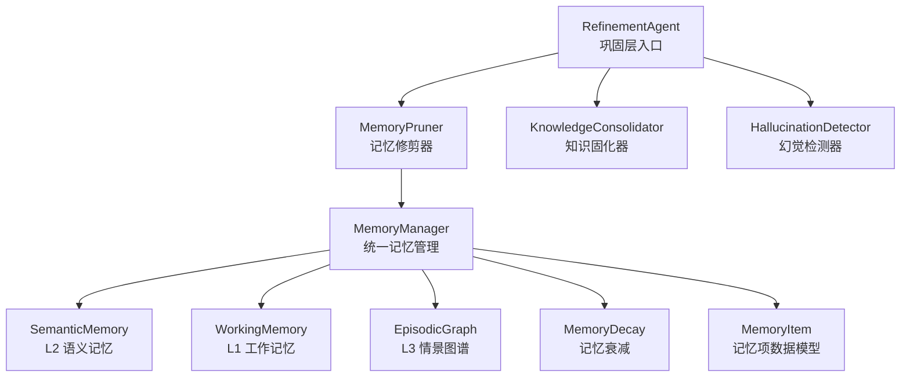
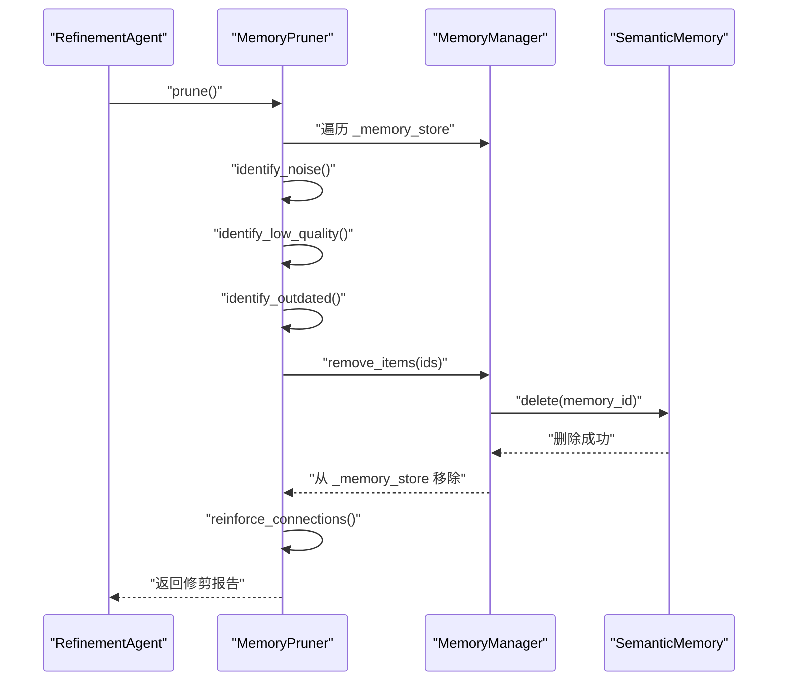
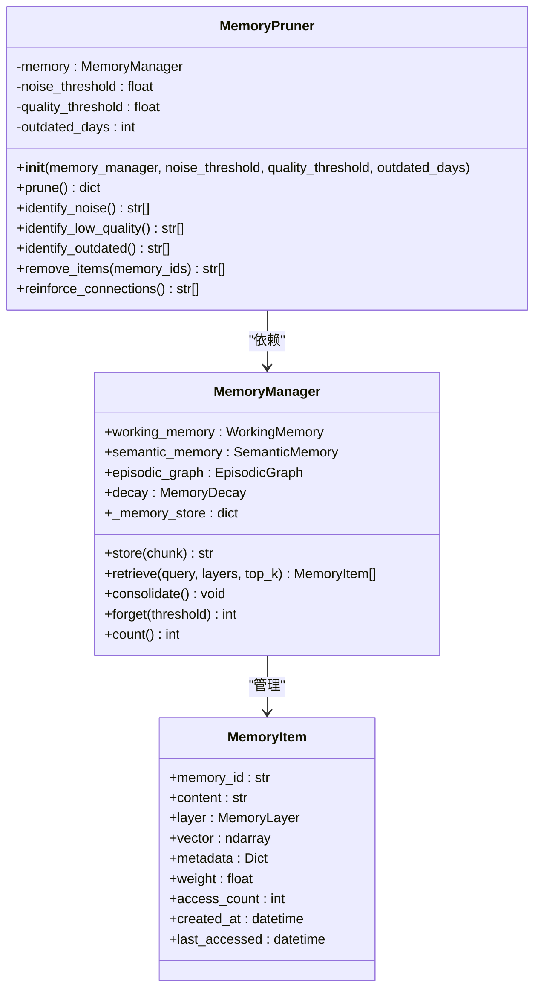
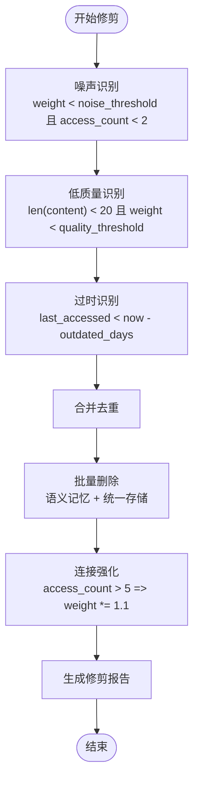
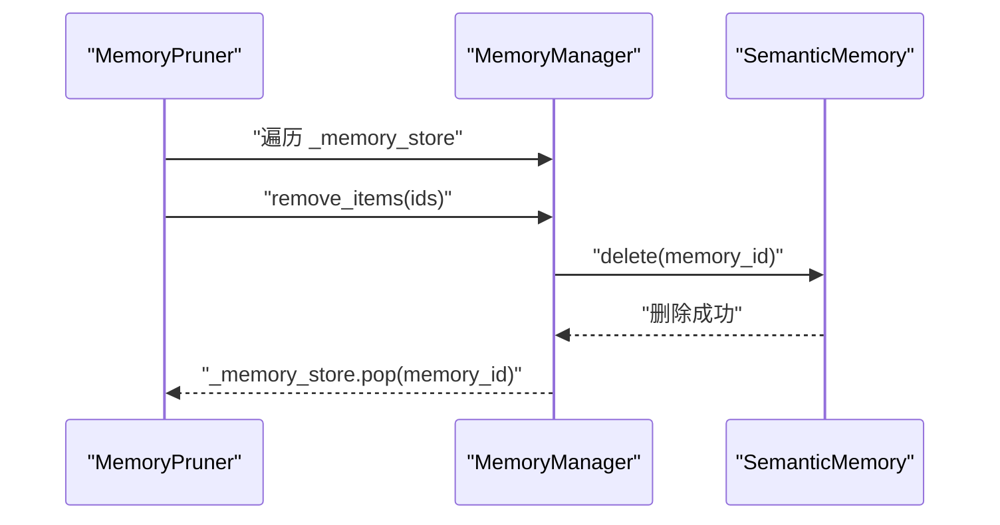
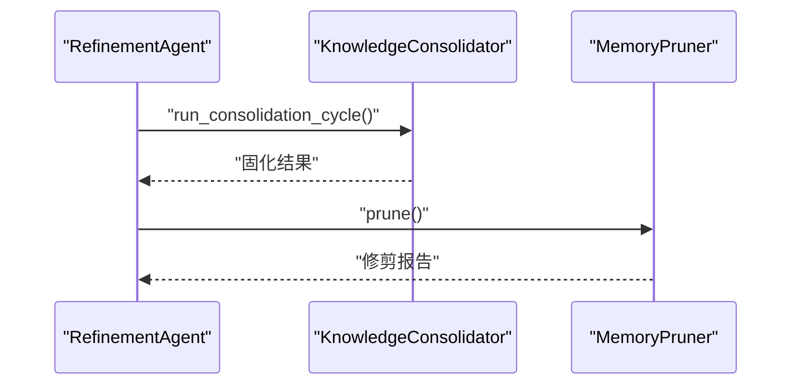
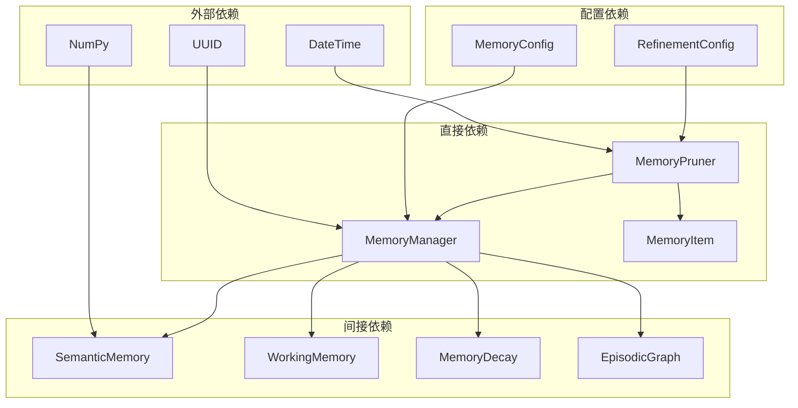

# 记忆修剪系统

<cite>
**本文引用的文件**
- [src/refinement/pruner.py](file://src/refinement/pruner.py)
- [src/memory/manager.py](file://src/memory/manager.py)
- [src/memory/models.py](file://src/memory/models.py)
- [src/memory/semantic_memory.py](file://src/memory/semantic_memory.py)
- [src/refinement/agent.py](file://src/refinement/agent.py)
- [src/core/config.py](file://src/core/config.py)
- [src/memory/README.md](file://src/memory/README.md)
- [src/refinement/models.py](file://src/refinement/models.py)
</cite>

## 目录
1. [简介](#简介)
2. [项目结构](#项目结构)
3. [核心组件](#核心组件)
4. [架构总览](#架构总览)
5. [详细组件分析](#详细组件分析)
6. [依赖分析](#依赖分析)
7. [性能考量](#性能考量)
8. [故障排除指南](#故障排除指南)
9. [结论](#结论)
10. [附录](#附录)

## 简介
本文件为记忆修剪系统的技术文档，聚焦 MemoryPruner 类的实现与工作机制，涵盖其在巩固层（Refinement Agent）中的角色、与记忆管理器的协作方式、修剪策略（噪声识别、低质量检测、过时清理）、批量清理流程、连接强化策略、性能影响与资源回收机制，并提供配置选项、效果监控指标、使用示例、最佳实践与性能调优建议，帮助开发者维持系统的高效运行与合理的内存占用。

## 项目结构
记忆修剪系统位于“巩固层”模块，与精炼代理（RefinementAgent）紧密协作，通过统一的记忆管理器（MemoryManager）访问三层记忆（工作记忆、语义记忆、情景图谱）。MemoryPruner 以独立类的形式存在，依赖 MemoryManager 提供的记忆存储与检索能力。

**图表来源**
- [src/refinement/agent.py:58-63](file://src/refinement/agent.py#L58-L63)
- [src/refinement/pruner.py:10-39](file://src/refinement/pruner.py#L10-L39)
- [src/memory/manager.py:20-47](file://src/memory/manager.py#L20-L47)
- [src/memory/models.py:14-26](file://src/memory/models.py#L14-L26)

**章节来源**
- [src/refinement/agent.py:58-63](file://src/refinement/agent.py#L58-L63)
- [src/refinement/pruner.py:10-39](file://src/refinement/pruner.py#L10-L39)
- [src/memory/manager.py:20-47](file://src/memory/manager.py#L20-L47)
- [src/memory/models.py:14-26](file://src/memory/models.py#L14-L26)

## 核心组件
- MemoryPruner：执行记忆修剪的主体，包含噪声识别、低质量检测、过时清理、批量删除与连接强化等方法。
- MemoryManager：统一管理三层记忆，维护统一存储（_memory_store），提供检索、巩固、主动遗忘与计数等能力。
- MemoryItem：记忆项的数据模型，包含内容、向量、元数据、权重、访问计数、时间戳等字段。
- SemanticMemory：L2 语义记忆的向量存储与检索实现，提供删除接口供修剪器使用。
- RefinementAgent：巩固层主控，按需初始化 MemoryPruner，并在后台任务中协调修剪与固化。

**章节来源**
- [src/refinement/pruner.py:10-157](file://src/refinement/pruner.py#L10-L157)
- [src/memory/manager.py:20-212](file://src/memory/manager.py#L20-L212)
- [src/memory/models.py:14-26](file://src/memory/models.py#L14-L26)
- [src/memory/semantic_memory.py:21-179](file://src/memory/semantic_memory.py#L21-L179)
- [src/refinement/agent.py:20-63](file://src/refinement/agent.py#L20-L63)

## 架构总览
MemoryPruner 在精炼代理的后台任务中被调用，先识别三类需要修剪的记忆，再执行批量删除，最后对高频访问的记忆进行权重强化，从而在保持知识新鲜度的同时减少冗余与噪声。

**图表来源**
- [src/refinement/agent.py:150-163](file://src/refinement/agent.py#L150-L163)
- [src/refinement/pruner.py:41-69](file://src/refinement/pruner.py#L41-L69)
- [src/refinement/pruner.py:120-137](file://src/refinement/pruner.py#L120-L137)
- [src/memory/semantic_memory.py:164-179](file://src/memory/semantic_memory.py#L164-L179)

## 详细组件分析

### MemoryPruner 类设计与职责
- 职责边界清晰：专注于“识别 + 删除 + 强化”的修剪闭环。
- 依赖关系：依赖 MemoryManager 的统一存储与语义记忆删除接口；内部不直接访问工作记忆或图谱，避免跨层耦合。
- 关键字段：噪声阈值、质量阈值、过时天数，均支持外部配置注入。
- 关键方法：
  - prune：串联识别与删除，返回修剪报告。
  - identify_noise/identify_low_quality/identify_outdated：三类识别策略。
  - remove_items：批量删除并同步清理统一存储。
  - reinforce_connections：对高频访问的记忆进行权重强化。

**图表来源**
- [src/refinement/pruner.py:10-157](file://src/refinement/pruner.py#L10-L157)
- [src/memory/manager.py:20-212](file://src/memory/manager.py#L20-L212)
- [src/memory/models.py:14-26](file://src/memory/models.py#L14-L26)

**章节来源**
- [src/refinement/pruner.py:10-157](file://src/refinement/pruner.py#L10-L157)
- [src/memory/models.py:14-26](file://src/memory/models.py#L14-L26)

### 修剪策略与算法流程
- 噪声识别：基于权重与访问次数的双重阈值，过滤低价值且极少访问的记忆。
- 低质量识别：基于内容长度与权重的双重阈值，过滤短内容且权重低的记忆。
- 过时识别：基于最后访问时间与过时天数阈值，过滤长时间未访问的记忆。
- 批量删除：对三类识别结果合并去重后，逐个调用语义记忆删除接口，并同步从统一存储移除。
- 连接强化：对访问计数超过阈值的记忆提升权重，作为“重要连接”的强化手段。

**图表来源**
- [src/refinement/pruner.py:71-118](file://src/refinement/pruner.py#L71-L118)
- [src/refinement/pruner.py:120-137](file://src/refinement/pruner.py#L120-L137)
- [src/refinement/pruner.py:139-156](file://src/refinement/pruner.py#L139-L156)

**章节来源**
- [src/refinement/pruner.py:71-156](file://src/refinement/pruner.py#L71-L156)

### 与记忆管理器的协作
- 统一存储：MemoryPruner 通过遍历 MemoryManager 的 _memory_store 获取待评估的记忆项。
- 删除接口：调用 SemanticMemory.delete 删除向量与元数据，确保与统一存储的一致性。
- 计数与检索：MemoryManager 提供 count 与 retrieve 等能力，支持上层监控与审计。

**图表来源**
- [src/refinement/pruner.py:80-84](file://src/refinement/pruner.py#L80-L84)
- [src/refinement/pruner.py:132-136](file://src/refinement/pruner.py#L132-L136)
- [src/memory/semantic_memory.py:164-179](file://src/memory/semantic_memory.py#L164-L179)

**章节来源**
- [src/refinement/pruner.py:80-136](file://src/refinement/pruner.py#L80-L136)
- [src/memory/semantic_memory.py:164-179](file://src/memory/semantic_memory.py#L164-L179)

### 与精炼代理的集成
- RefinementAgent 在初始化时根据是否存在 MemoryManager 决定是否启用 KnowledgeConsolidator 与 MemoryPruner。
- 后台任务 run_background_tasks 中，先执行知识固化，再执行记忆修剪，形成“固化 + 修剪”的闭环。

**图表来源**
- [src/refinement/agent.py:58-63](file://src/refinement/agent.py#L58-L63)
- [src/refinement/agent.py:150-163](file://src/refinement/agent.py#L150-L163)

**章节来源**
- [src/refinement/agent.py:58-63](file://src/refinement/agent.py#L58-L63)
- [src/refinement/agent.py:150-163](file://src/refinement/agent.py#L150-L163)

## 依赖分析
- 直接依赖：MemoryPruner 依赖 MemoryManager；MemoryManager 依赖 MemoryItem、WorkingMemory、SemanticMemory、EpisodicGraph、MemoryDecay。
- 间接依赖：SemanticMemory 依赖 MemoryItem；图谱层依赖实体与关系模型。
- 配置依赖：RefinementConfig 提供修剪开关与阈值；MemoryConfig 提供衰减速率与阈值；全局配置 NecoRAGConfig 统一承载各层配置。
- 外部依赖：NumPy 用于向量运算；DateTime 用于时间戳管理；UUID 用于生成唯一标识符。

**图表来源**
- [src/refinement/pruner.py:6-39](file://src/refinement/pruner.py#L6-L39)
- [src/memory/manager.py:8-47](file://src/memory/manager.py#L8-L47)
- [src/core/config.py:136-156](file://src/core/config.py#L136-L156)

**章节来源**
- [src/refinement/pruner.py:6-39](file://src/refinement/pruner.py#L6-L39)
- [src/memory/manager.py:8-47](file://src/memory/manager.py#L8-L47)
- [src/core/config.py:136-156](file://src/core/config.py#L136-L156)

## 性能考量
- 时间复杂度：每类识别均为 O(n)，整体修剪为 O(n)。
- 空间复杂度：存储待删 ID 列表与临时数据，空间开销 O(n)。
- 优化建议：
  - 批量操作：删除阶段尽量合并请求，减少多次往返。
  - 索引优化：为 last_accessed 与 weight 建立索引，加速识别阶段。
  - 异步处理：将修剪任务放入后台队列，避免阻塞主线程。
  - 增量修剪：仅扫描新增或变更的记忆项，而非全量扫描。
  - 并发控制：在高并发场景下限制修剪任务数量，避免资源争用。

[本节为通用性能指导，无需特定文件来源]

## 故障排除指南
- 删除失败：确认语义记忆后端可用，检查 memory_id 是否存在于 _memory_store 与向量存储中。
- 重复删除：remove_items 已做去重处理，若仍出现异常，检查 _memory_store 与后端状态一致性。
- 强化无效：reinforce_connections 仅对高频访问的记忆生效，检查 access_count 是否超过阈值。
- 配置不当：若修剪过于激进或保守，调整 RefinementConfig.enable_pruning、pruning_threshold 与 MemoryConfig.decay_threshold。

**章节来源**
- [src/refinement/pruner.py:120-137](file://src/refinement/pruner.py#L120-L137)
- [src/refinement/pruner.py:139-156](file://src/refinement/pruner.py#L139-L156)
- [src/core/config.py:197-216](file://src/core/config.py#L197-L216)
- [src/core/config.py:136-156](file://src/core/config.py#L136-L156)

## 结论
MemoryPruner 通过“噪声识别—低质量检测—过时清理—批量删除—连接强化”的闭环策略，在不破坏关键知识的前提下有效降低冗余与噪声，维持知识库的健康与新鲜度。配合 MemoryManager 的统一存储与语义记忆后端，以及 RefinementAgent 的后台调度，系统能够在保证检索质量的同时，持续优化内存占用与运行效率。

[本节为总结性内容，无需特定文件来源]

## 附录

### 修剪规则说明
- 噪声识别：当记忆权重低于噪声阈值且访问次数小于 2 时，视为噪声。
- 低质量识别：当记忆内容长度小于阈值且权重低于质量阈值时，视为低质量。
- 过时识别：当记忆最后访问时间早于当前时间减去过时天数时，视为过时。
- 批量删除：对三类识别结果合并去重后，调用语义记忆删除接口并同步清理统一存储。
- 连接强化：对访问次数超过阈值的记忆提升权重，强化其重要性。

**章节来源**
- [src/refinement/pruner.py:71-156](file://src/refinement/pruner.py#L71-L156)

### 配置选项
- 巩固层配置（RefinementConfig）
  - enable_pruning：是否启用记忆修剪
  - pruning_threshold：修剪阈值（用于控制修剪强度）
- 记忆层配置（MemoryConfig）
  - decay_rate：记忆衰减速率
  - decay_threshold：归档阈值（与修剪策略协同）

**章节来源**
- [src/core/config.py:197-216](file://src/core/config.py#L197-L216)
- [src/core/config.py:136-156](file://src/core/config.py#L136-L156)

### 效果监控指标
- 修剪报告字段：removed_count、reinforced_count、noise_count、low_quality_count、outdated_count。
- 记忆总量：通过 MemoryManager.count 获取当前记忆条目总数。
- 健康度指标：可结合知识演化系统的健康度计算与缓存机制进行综合评估。

**章节来源**
- [src/refinement/pruner.py:63-69](file://src/refinement/pruner.py#L63-L69)
- [src/memory/manager.py:204-212](file://src/memory/manager.py#L204-L212)
- [src/knowledge_evolution/metrics.py:136-150](file://src/knowledge_evolution/metrics.py#L136-L150)

### 使用示例与最佳实践
- 初始化与运行
  - 在 RefinementAgent 中传入 MemoryManager，即可启用 MemoryPruner。
  - 通过后台任务 run_background_tasks 触发“固化 + 修剪”流程。
- 参数调优
  - 根据业务场景调整 pruning_threshold 与 outdated_days，平衡清理速度与知识保留。
  - 若系统写入频繁但访问稀少，适当降低 noise_threshold 与 quality_threshold。
- 最佳实践
  - 定期观察修剪报告与记忆总量趋势，动态调整阈值。
  - 对关键领域设置更高的 access_count 阈值，确保重要连接不会被误删。
  - 在高峰期避免大规模修剪，采用异步与增量策略。

**章节来源**
- [src/refinement/agent.py:58-63](file://src/refinement/agent.py#L58-L63)
- [src/refinement/agent.py:150-163](file://src/refinement/agent.py#L150-L163)
- [src/memory/README.md:194-229](file://src/memory/README.md#L194-L229)