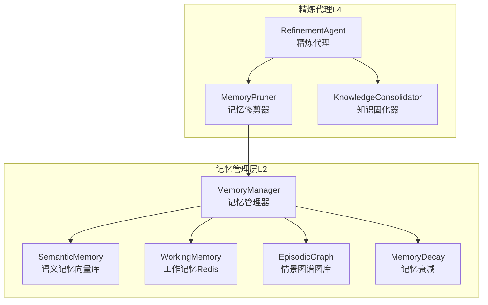
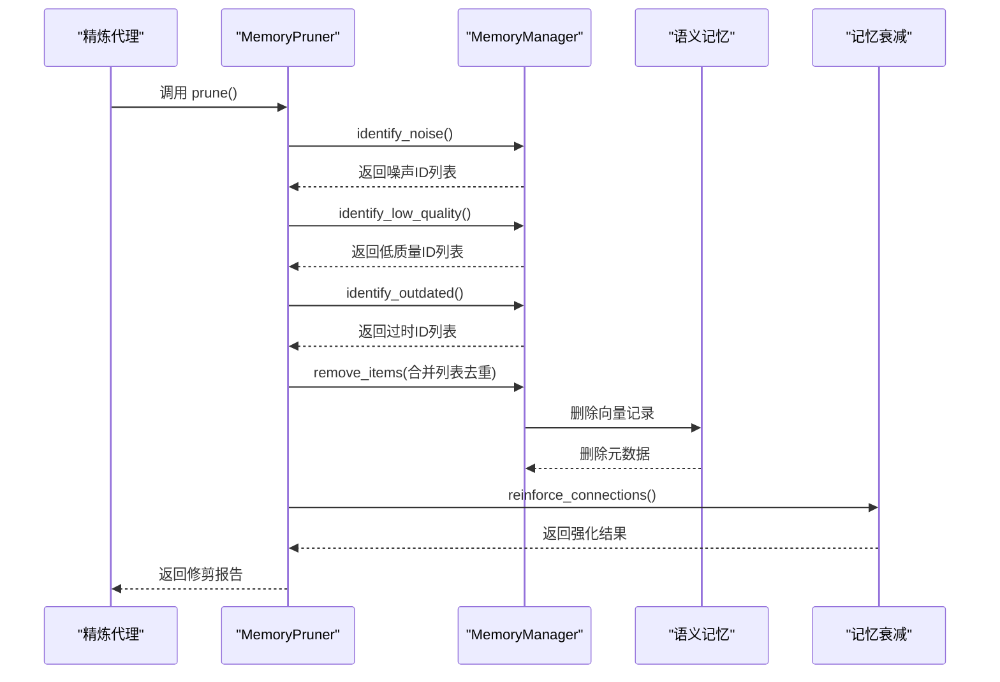
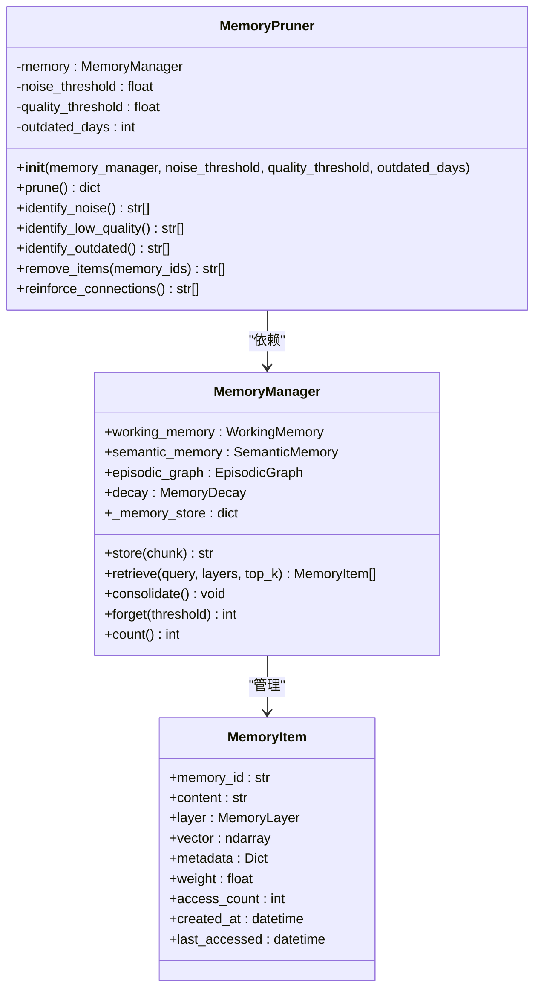
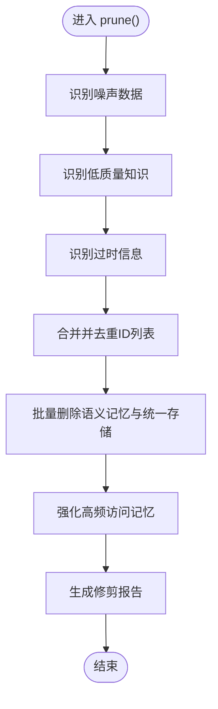
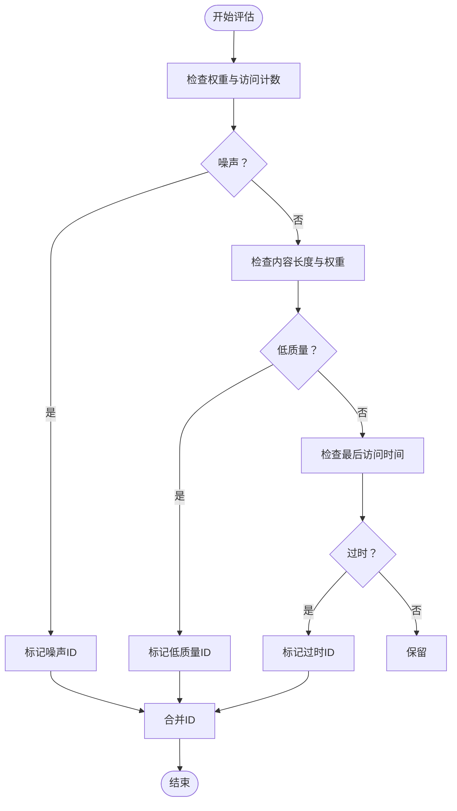
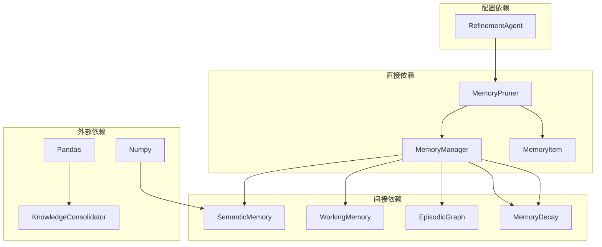

# 记忆修剪系统

<cite>
**本文引用的文件**
- [src/refinement/pruner.py](file://src/refinement/pruner.py)
- [src/refinement/agent.py](file://src/refinement/agent.py)
- [src/memory/manager.py](file://src/memory/manager.py)
- [src/memory/models.py](file://src/memory/models.py)
- [src/memory/semantic_memory.py](file://src/memory/semantic_memory.py)
- [src/memory/working_memory.py](file://src/memory/working_memory.py)
- [src/memory/episodic_graph.py](file://src/memory/episodic_graph.py)
- [src/memory/decay.py](file://src/memory/decay.py)
</cite>

## 目录
1. [引言](#引言)
2. [项目结构](#项目结构)
3. [核心组件](#核心组件)
4. [架构总览](#架构总览)
5. [详细组件分析](#详细组件分析)
6. [依赖分析](#依赖分析)
7. [性能考量](#性能考量)
8. [故障排除指南](#故障排除指南)
9. [结论](#结论)
10. [附录](#附录)

## 引言
本文件围绕记忆修剪系统，聚焦 MemoryPruner 类在无效信息清理与存储空间管理方面的机制，系统阐述其过期数据识别与清理策略、prune 方法的执行流程（含内存使用监控、清理优先级与批量操作）、修剪算法（重要性评估、时间衰减与冗余检测），并提供修剪效果的量化指标与存储效率提升评估方法，同时说明修剪策略的配置选项、自定义规则、与存储系统的协调机制，以及安全性保障与数据完整性维护。

## 项目结构
记忆修剪系统位于“巩固层（L4）”的精炼代理子系统中，核心由 MemoryPruner、MemoryManager、MemoryItem 以及各记忆层后端（语义记忆、工作记忆、情景图谱）构成。精炼代理负责周期性运行知识固化与记忆修剪任务，并将二者结果汇总上报。

**图表来源**
- [src/refinement/agent.py:143-163](file://src/refinement/agent.py#L143-L163)
- [src/refinement/pruner.py:10-39](file://src/refinement/pruner.py#L10-L39)
- [src/memory/manager.py:20-47](file://src/memory/manager.py#L20-L47)

**章节来源**
- [src/refinement/agent.py:20-64](file://src/refinement/agent.py#L20-L64)
- [src/refinement/pruner.py:10-39](file://src/refinement/pruner.py#L10-L39)
- [src/memory/manager.py:20-47](file://src/memory/manager.py#L20-L47)

## 核心组件
- MemoryPruner：负责识别噪声、低质量与过时记忆，执行批量删除与连接强化，输出修剪统计报告。
- MemoryManager：统一管理三层记忆（工作记忆、语义记忆、情景图谱），维护统一内存存储映射，提供检索、巩固、主动遗忘与计数能力。
- MemoryItem：记忆单元的数据模型，包含内容、向量、元数据、权重、访问计数、创建与最后访问时间等字段。
- 各记忆后端：SemanticMemory（向量存储与检索）、WorkingMemory（会话上下文与意图轨迹）、EpisodicGraph（实体关系网络）。
- MemoryDecay：提供权重衰减、强化与归档阈值判断，支撑修剪与巩固流程。

**章节来源**
- [src/refinement/pruner.py:10-157](file://src/refinement/pruner.py#L10-L157)
- [src/memory/manager.py:20-212](file://src/memory/manager.py#L20-L212)
- [src/memory/models.py:14-26](file://src/memory/models.py#L14-L26)
- [src/memory/semantic_memory.py:21-179](file://src/memory/semantic_memory.py#L21-L179)
- [src/memory/working_memory.py:11-120](file://src/memory/working_memory.py#L11-L120)
- [src/memory/episodic_graph.py:10-194](file://src/memory/episodic_graph.py#L10-L194)
- [src/memory/decay.py:11-155](file://src/memory/decay.py#L11-L155)

## 架构总览
精炼代理在后台任务中依次执行知识固化与记忆修剪。修剪流程以 MemoryPruner 为核心，调用 MemoryManager 的识别与删除接口，最终更新语义记忆后端与统一存储映射。

**图表来源**
- [src/refinement/agent.py:143-163](file://src/refinement/agent.py#L143-L163)
- [src/refinement/pruner.py:41-69](file://src/refinement/pruner.py#L41-L69)
- [src/memory/manager.py:161-182](file://src/memory/manager.py#L161-L182)
- [src/memory/semantic_memory.py:164-179](file://src/memory/semantic_memory.py#L164-L179)
- [src/memory/decay.py:120-142](file://src/memory/decay.py#L120-L142)

## 详细组件分析

### MemoryPruner 类设计与职责
- 依赖关系：依赖 MemoryManager 提供的记忆存储映射与各层后端；依赖 MemoryItem 字段进行评估。
- 职责划分：
  - 识别噪声：基于权重与访问次数的双重阈值。
  - 识别低质量：基于内容长度与权重的综合阈值。
  - 识别过时：基于最后访问时间与阈值天数。
  - 执行删除：对合并后的 ID 列表进行去重与批量删除，同步更新统一存储映射。
  - 连接强化：对高频访问的记忆进行权重增强（最小实现）。

**图表来源**
- [src/refinement/pruner.py:10-157](file://src/refinement/pruner.py#L10-L157)
- [src/memory/manager.py:20-212](file://src/memory/manager.py#L20-L212)
- [src/memory/models.py:14-26](file://src/memory/models.py#L14-L26)

**章节来源**
- [src/refinement/pruner.py:10-157](file://src/refinement/pruner.py#L10-L157)
- [src/memory/models.py:14-26](file://src/memory/models.py#L14-L26)

### prune 方法执行逻辑
- 步骤分解：
  1) 识别噪声数据：遍历统一存储映射，筛选权重低于阈值且访问次数小于阈值的记忆 ID。
  2) 识别低质量知识：筛选内容长度过短且权重低于阈值的记忆 ID。
  3) 识别过时信息：基于最后访问时间与阈值天数，筛选过期记忆 ID。
  4) 执行修剪：对三类 ID 合并后去重，逐个调用语义记忆删除接口，成功删除后从统一存储映射中移除对应项。
  5) 强化重要连接：对访问次数超过阈值的记忆进行权重增强（最小实现）。
- 返回报告：包含移除数量、强化数量及各类别计数，便于量化评估。

**图表来源**
- [src/refinement/pruner.py:41-69](file://src/refinement/pruner.py#L41-L69)
- [src/refinement/pruner.py:120-137](file://src/refinement/pruner.py#L120-L137)
- [src/refinement/pruner.py:139-156](file://src/refinement/pruner.py#L139-L156)

**章节来源**
- [src/refinement/pruner.py:41-69](file://src/refinement/pruner.py#L41-L69)
- [src/refinement/pruner.py:120-137](file://src/refinement/pruner.py#L120-L137)
- [src/refinement/pruner.py:139-156](file://src/refinement/pruner.py#L139-L156)

### 修剪算法与策略
- 重要性评估（权重与访问计数）：
  - 噪声识别：权重过低且访问次数极少，视为无价值或干扰信息。
  - 强化策略：访问次数较高时，对权重进行倍增式增强，提升检索与巩固优先级。
- 时间衰减（过时检测）：
  - 基于最后访问时间与阈值天数比较，剔除长期未被使用的记忆。
  - 与 MemoryDecay 的衰减公式协同，确保低价值记忆逐步被归档或修剪。
- 冗余检测（低质量）：
  - 内容长度过短且权重偏低，通常代表噪声或无意义片段，纳入清理范围。

**图表来源**
- [src/refinement/pruner.py:71-118](file://src/refinement/pruner.py#L71-L118)
- [src/memory/decay.py:39-70](file://src/memory/decay.py#L39-L70)

**章节来源**
- [src/refinement/pruner.py:71-118](file://src/refinement/pruner.py#L71-L118)
- [src/memory/decay.py:39-70](file://src/memory/decay.py#L39-L70)

### 存储空间管理与协调机制
- 统一存储映射：MemoryManager 维护 _memory_store，作为跨层检索与修剪的依据。
- 语义记忆后端：MemoryPruner 通过 MemoryManager 调用语义记忆删除接口，同步清理向量与元数据。
- 工作记忆与情景图谱：当前修剪逻辑主要针对语义记忆与统一存储映射；工作记忆与情景图谱的清理可由各自模块独立处理或在更高层协调。
- 与记忆衰减的协作：修剪与巩固均依赖 MemoryDecay 的权重计算与归档阈值，形成“动态权重—低频降权—归档/修剪”的闭环。

**章节来源**
- [src/memory/manager.py:49-50](file://src/memory/manager.py#L49-L50)
- [src/memory/semantic_memory.py:164-179](file://src/memory/semantic_memory.py#L164-L179)
- [src/memory/decay.py:96-118](file://src/memory/decay.py#L96-L118)

### 修剪效果量化指标与存储效率评估
- 量化指标（来自修剪报告）：
  - 移除数量：被成功删除的记忆条目数。
  - 强化数量：被增强权重的记忆条目数。
  - 噪声数量、低质量数量、过时数量：分别反映三类策略的覆盖范围。
- 存储效率提升评估：
  - 通过对比修剪前后 MemoryManager 的计数与语义记忆后端的向量规模变化，评估存储占用下降幅度。
  - 结合访问日志与检索命中率，评估修剪后检索质量是否维持稳定或提升。

**章节来源**
- [src/refinement/pruner.py:63-69](file://src/refinement/pruner.py#L63-L69)
- [src/memory/manager.py:204-212](file://src/memory/manager.py#L204-L212)
- [src/memory/semantic_memory.py:46-48](file://src/memory/semantic_memory.py#L46-L48)

### 配置选项与自定义规则
- 默认配置（构造函数参数）：
  - 噪声阈值：用于噪声识别的权重阈值。
  - 质量阈值：用于低质量识别的内容长度与权重阈值。
  - 过时天数：用于过时识别的时间阈值（天）。
- 自定义规则建议：
  - 噪声识别：可按领域调整权重与访问次数阈值，平衡噪声剔除与误删风险。
  - 低质量识别：结合内容长度分布与领域特征，动态设置阈值。
  - 过时识别：根据知识时效性与访问模式，调整过时天数。
- 与记忆衰减联动：可将修剪阈值与 MemoryDecay 的归档阈值协同设置，避免重复清理。

**章节来源**
- [src/refinement/pruner.py:20-39](file://src/refinement/pruner.py#L20-L39)
- [src/memory/decay.py:24-37](file://src/memory/decay.py#L24-L37)

### 安全性保障与数据完整性
- 删除前的幂等与去重：对待删除 ID 进行去重处理，避免重复删除引发异常。
- 语义记忆与统一存储的一致性：先删除语义记忆后端，再从统一存储映射中移除，确保一致性。
- 访问计数与时间戳更新：在检索与强化过程中正确更新访问计数与最后访问时间，保证评估准确性。
- 异常处理：MemoryManager 在存储失败时抛出异常，需在上层捕获并记录，避免静默失败。

**章节来源**
- [src/refinement/pruner.py:130-137](file://src/refinement/pruner.py#L130-L137)
- [src/memory/manager.py:120-122](file://src/memory/manager.py#L120-L122)
- [src/memory/decay.py:120-142](file://src/memory/decay.py#L120-L142)

## 依赖分析
- 直接依赖：MemoryPruner 依赖 MemoryManager；MemoryManager 依赖语义记忆、工作记忆、情景图谱与记忆衰减。
- 间接依赖：语义记忆与情景图谱为最小实现的内存存储，工作记忆提供会话上下文与意图轨迹。
- 配置依赖：精炼代理在初始化时注入 MemoryManager，MemoryPruner 从 MemoryManager 获取统一存储映射与后端接口。

**图表来源**
- [src/refinement/pruner.py:6-39](file://src/refinement/pruner.py#L6-L39)
- [src/memory/manager.py:8-47](file://src/memory/manager.py#L8-L47)
- [src/refinement/agent.py:58-63](file://src/refinement/agent.py#L58-L63)

**章节来源**
- [src/refinement/pruner.py:6-39](file://src/refinement/pruner.py#L6-L39)
- [src/memory/manager.py:8-47](file://src/memory/manager.py#L8-L47)
- [src/refinement/agent.py:58-63](file://src/refinement/agent.py#L58-L63)

## 性能考量
- 时间复杂度：每类识别均为 O(n)，整体修剪为 O(n)。
- 空间复杂度：存储 ID 列表与临时数据，空间复杂度 O(n)。
- 优化建议：
  - 批量删除：减少多次后端调用开销。
  - 索引优化：为访问时间与权重建立索引（当前为内存实现，可扩展至持久化索引）。
  - 异步处理：支持后台异步修剪，避免阻塞主线程。
  - 增量修剪：按时间窗口或阈值变化触发，减少全量扫描。

**章节来源**
- [src/refinement/pruner.py:258-275](file://src/refinement/pruner.py#L258-L275)

## 故障排除指南
- 修剪后检索命中率下降：
  - 检查阈值设置是否过于严格，适当提高质量阈值或延长过时天数。
  - 核对统一存储映射是否同步清理，避免残留导致误判。
- 删除失败或异常：
  - 检查语义记忆后端状态与权限，确认删除接口返回值。
  - 在 MemoryManager 存储异常处增加日志与重试机制。
- 强化效果不明显：
  - 调整访问次数阈值与权重增强倍数，观察强化比例与检索表现。

**章节来源**
- [src/refinement/pruner.py:130-137](file://src/refinement/pruner.py#L130-L137)
- [src/memory/semantic_memory.py:164-179](file://src/memory/semantic_memory.py#L164-L179)
- [src/memory/manager.py:120-122](file://src/memory/manager.py#L120-L122)

## 结论
MemoryPruner 通过噪声、低质量与过时三类策略，结合统一存储映射与语义记忆后端，实现了高效、可控的记忆清理与强化。配合 MemoryDecay 的权重衰减与归档阈值，形成“动态权重—低频降权—归档/修剪”的闭环。通过修剪报告与存储规模对比，可量化评估存储效率提升；通过合理配置阈值与自定义规则，可在不同场景下取得更优的检索质量与资源利用平衡。

## 附录
- 关键流程路径参考：
  - prune 主流程：[src/refinement/pruner.py:41-69](file://src/refinement/pruner.py#L41-L69)
  - 噪声识别：[src/refinement/pruner.py:71-85](file://src/refinement/pruner.py#L71-L85)
  - 低质量识别：[src/refinement/pruner.py:87-101](file://src/refinement/pruner.py#L87-L101)
  - 过时识别：[src/refinement/pruner.py:103-118](file://src/refinement/pruner.py#L103-L118)
  - 删除与一致性：[src/refinement/pruner.py:120-137](file://src/refinement/pruner.py#L120-L137)
  - 强化连接（最小实现）：[src/refinement/pruner.py:139-156](file://src/refinement/pruner.py#L139-L156)
  - 统一存储映射与后端：[src/memory/manager.py:49-50](file://src/memory/manager.py#L49-L50), [src/memory/semantic_memory.py:164-179](file://src/memory/semantic_memory.py#L164-L179)
  - 记忆衰减与归档：[src/memory/decay.py:96-118](file://src/memory/decay.py#L96-L118)