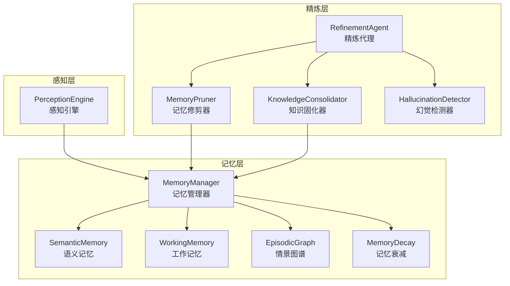
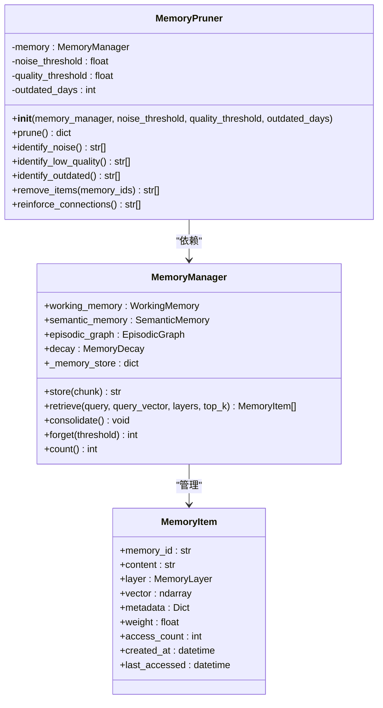
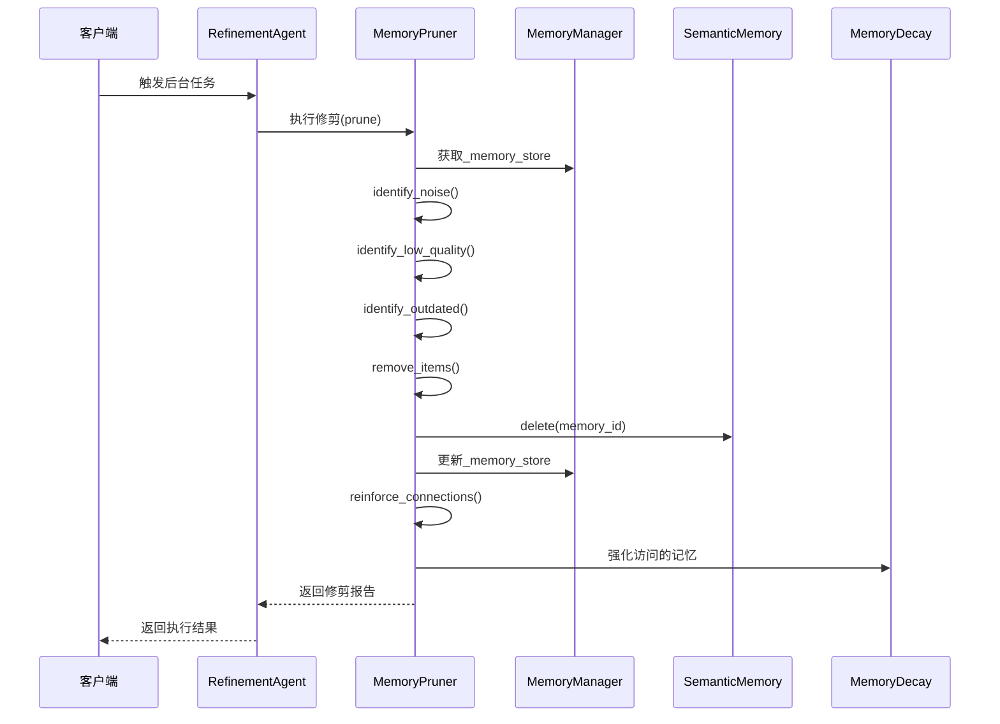
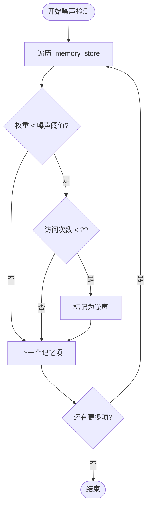
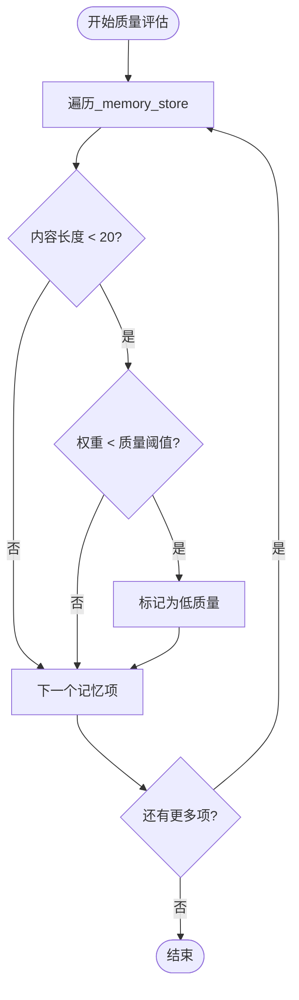
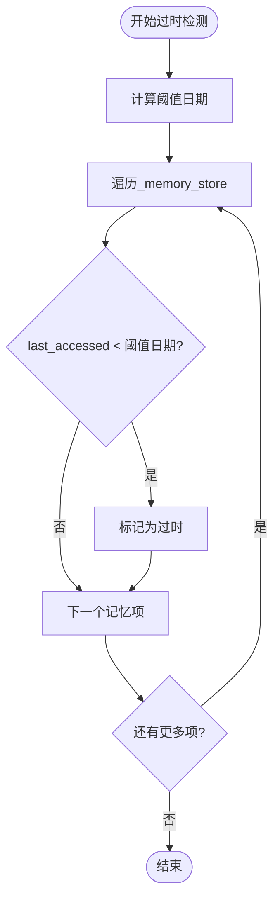
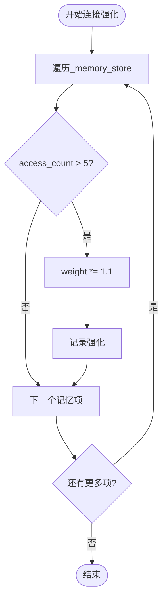
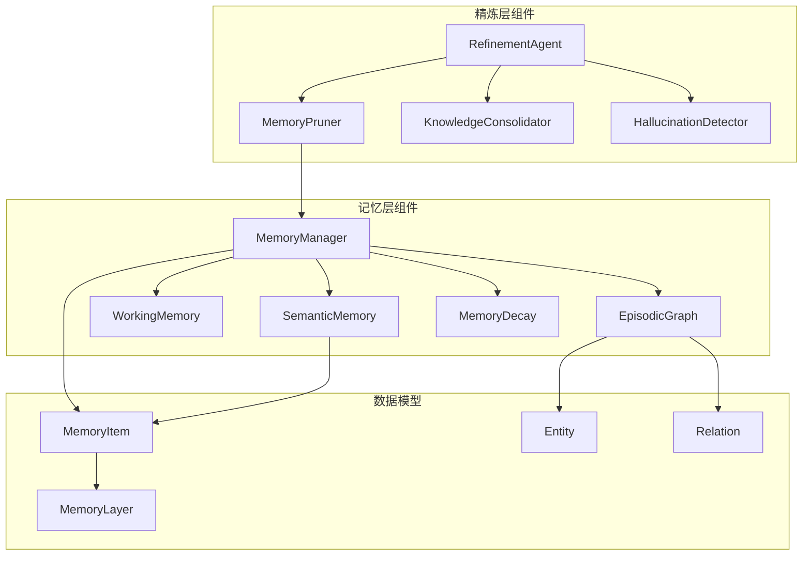
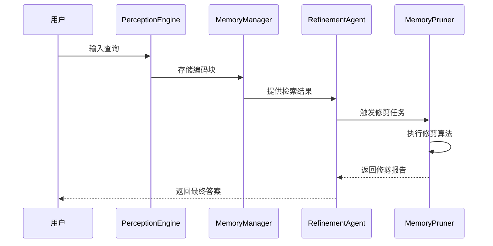

# 记忆修剪系统

<cite>
**本文档引用的文件**
- [pruner.py](file://src/refinement/pruner.py)
- [manager.py](file://src/memory/manager.py)
- [models.py](file://src/memory/models.py)
- [semantic_memory.py](file://src/memory/semantic_memory.py)
- [working_memory.py](file://src/memory/working_memory.py)
- [episodic_graph.py](file://src/memory/episodic_graph.py)
- [decay.py](file://src/memory/decay.py)
- [agent.py](file://src/refinement/agent.py)
- [consolidator.py](file://src/refinement/consolidator.py)
- [hallucination.py](file://src/refinement/hallucination.py)
- [example_usage.py](file://example/example_usage.py)
</cite>

## 目录
1. [简介](#简介)
2. [项目结构](#项目结构)
3. [核心组件](#核心组件)
4. [架构概览](#架构概览)
5. [详细组件分析](#详细组件分析)
6. [依赖关系分析](#依赖关系分析)
7. [性能考虑](#性能考虑)
8. [故障排除指南](#故障排除指南)
9. [结论](#结论)
10. [附录](#附录)

## 简介

记忆修剪系统是NecoRAG框架中的关键组件，负责维护和优化记忆库的健康状态。该系统模拟猫的"舔毛梳理"行为，通过智能识别和清理低质量、过时或噪声数据，同时强化重要的知识连接，确保记忆系统的高效运行和数据质量。

系统采用多层次的修剪策略，包括噪声检测、质量评估和时效性检查，通过与记忆管理器的紧密协作，实现数据一致性保证和性能优化。

## 项目结构

记忆修剪系统位于项目的精炼层(refinement)，与感知层、记忆层、检索层等其他组件协同工作：

**图表来源**
- [pruner.py:1-157](file://src/refinement/pruner.py#L1-L157)
- [manager.py:1-195](file://src/memory/manager.py#L1-L195)
- [agent.py:1-151](file://src/refinement/agent.py#L1-L151)

**章节来源**
- [pruner.py:1-157](file://src/refinement/pruner.py#L1-L157)
- [manager.py:1-195](file://src/memory/manager.py#L1-L195)
- [agent.py:1-151](file://src/refinement/agent.py#L1-L151)

## 核心组件

### MemoryPruner类

MemoryPruner是记忆修剪系统的核心类，实现了完整的修剪算法和策略：

**图表来源**
- [pruner.py:10-157](file://src/refinement/pruner.py#L10-L157)
- [manager.py:16-195](file://src/memory/manager.py#L16-L195)
- [models.py:14-26](file://src/memory/models.py#L14-L26)

### 修剪策略分类

系统采用三种主要的修剪策略：

1. **噪声数据识别**：基于权重和访问频率的双重阈值判断
2. **低质量知识检测**：结合内容长度和权重质量评估
3. **过时信息清理**：基于最后访问时间的时效性检查

**章节来源**
- [pruner.py:41-157](file://src/refinement/pruner.py#L41-L157)

## 架构概览

记忆修剪系统在整个NecoRAG框架中的位置和作用：

**图表来源**
- [agent.py:130-151](file://src/refinement/agent.py#L130-L151)
- [pruner.py:41-157](file://src/refinement/pruner.py#L41-L157)
- [manager.py:149-185](file://src/memory/manager.py#L149-L185)

## 详细组件分析

### 内存修剪算法实现

#### 噪声检测算法

噪声检测基于双阈值策略，综合考虑权重和访问频率：

**图表来源**
- [pruner.py:71-85](file://src/refinement/pruner.py#L71-L85)

#### 低质量知识评估

低质量检测采用多维度评估机制：

**图表来源**
- [pruner.py:87-101](file://src/refinement/pruner.py#L87-L101)

#### 过时信息识别

过时检测基于时间窗口的判断机制：

**图表来源**
- [pruner.py:103-118](file://src/refinement/pruner.py#L103-L118)

### 数据一致性保证机制

系统通过以下机制确保数据一致性：

1. **原子性操作**：删除操作在语义记忆和统一存储中同时进行
2. **去重处理**：对重复的内存ID进行去重处理
3. **事务性保证**：确保删除操作的完整性

**章节来源**
- [pruner.py:120-137](file://src/refinement/pruner.py#L120-L137)

### 连接强化策略

当前实现采用简单的访问频率强化策略：

**图表来源**
- [pruner.py:139-156](file://src/refinement/pruner.py#L139-L156)

**章节来源**
- [pruner.py:139-156](file://src/refinement/pruner.py#L139-L156)

## 依赖关系分析

### 组件间依赖关系

**图表来源**
- [pruner.py:1-157](file://src/refinement/pruner.py#L1-L157)
- [manager.py:1-195](file://src/memory/manager.py#L1-L195)
- [models.py:1-43](file://src/memory/models.py#L1-L43)

### 外部依赖分析

系统的主要外部依赖包括：

1. **NumPy**：用于向量运算和数学计算
2. **DateTime**：用于时间戳管理和过时检测
3. **UUID**：用于生成唯一标识符

**章节来源**
- [pruner.py:6-7](file://src/refinement/pruner.py#L6-L7)
- [manager.py:13](file://src/memory/manager.py#L13)

## 性能考虑

### 时间复杂度分析

1. **修剪操作**：O(n)，其中n是记忆项数量
2. **噪声检测**：O(n)
3. **质量评估**：O(n)
4. **过时检测**：O(n)
5. **删除操作**：O(m)，其中m是被删除的项数

### 空间复杂度分析

- **内存使用**：O(n)用于存储记忆项
- **临时存储**：O(k)，其中k是被识别的异常项数量

### 性能优化建议

1. **批量处理**：对于大量记忆项，考虑分批处理以减少内存峰值
2. **索引优化**：为访问时间和权重建立索引以提高查询效率
3. **缓存策略**：缓存频繁访问的记忆项以提高性能
4. **并发处理**：利用异步特性并行处理多个修剪任务

## 故障排除指南

### 常见问题及解决方案

#### 修剪结果不准确

**问题描述**：修剪结果包含过多或过少的项

**可能原因**：
1. 阈值设置不当
2. 记忆项权重异常
3. 访问统计信息缺失

**解决方案**：
1. 调整噪声阈值、质量阈值和过时天数
2. 检查记忆项的权重和访问统计
3. 确保访问统计功能正常工作

#### 数据不一致问题

**问题描述**：删除操作后数据状态不一致

**可能原因**：
1. 删除操作失败
2. 统一存储更新延迟
3. 并发访问冲突

**解决方案**：
1. 检查删除操作的返回值
2. 确保语义记忆和统一存储的同步更新
3. 实施适当的锁机制防止并发冲突

#### 性能问题

**问题描述**：修剪操作执行缓慢

**可能原因**：
1. 记忆项数量过大
2. 缺乏必要的索引
3. 内存不足

**解决方案**：
1. 实施分批处理策略
2. 为常用查询字段建立索引
3. 增加系统内存或实施数据分片

**章节来源**
- [pruner.py:120-137](file://src/refinement/pruner.py#L120-L137)
- [manager.py:168-185](file://src/memory/manager.py#L168-L185)

## 结论

记忆修剪系统通过智能化的算法设计和严格的执行流程，有效维护了NecoRAG框架中记忆库的质量和效率。系统采用多层次的修剪策略，结合噪声检测、质量评估和时效性检查，确保只有高质量的知识得以保留。

通过与记忆管理器的紧密协作，系统实现了数据一致性保证和性能优化。未来可以进一步完善连接强化算法，增加更多的质量评估维度，并优化大规模数据处理的性能表现。

## 附录

### 配置参数参考

| 参数名 | 类型 | 默认值 | 描述 |
|--------|------|--------|------|
| noise_threshold | float | 0.1 | 噪声判定阈值 |
| quality_threshold | float | 0.3 | 质量判定阈值 |
| outdated_days | int | 90 | 过时天数判定 |
| min_query_frequency | int | 5 | 最小查询频率阈值 |
| decay_rate | float | 0.1 | 衰减速率 |
| archive_threshold | float | 0.05 | 归档阈值 |

### 最佳实践指南

1. **定期监控**：建立定期的修剪报告监控机制
2. **阈值调优**：根据实际使用情况调整修剪阈值
3. **备份策略**：在执行大规模修剪前做好数据备份
4. **性能监控**：监控修剪操作的性能影响
5. **错误处理**：实施完善的错误处理和恢复机制

### 使用示例

系统在完整的工作流程中发挥重要作用：

**图表来源**
- [example_usage.py:139-173](file://example/example_usage.py#L139-L173)
- [agent.py:130-151](file://src/refinement/agent.py#L130-L151)