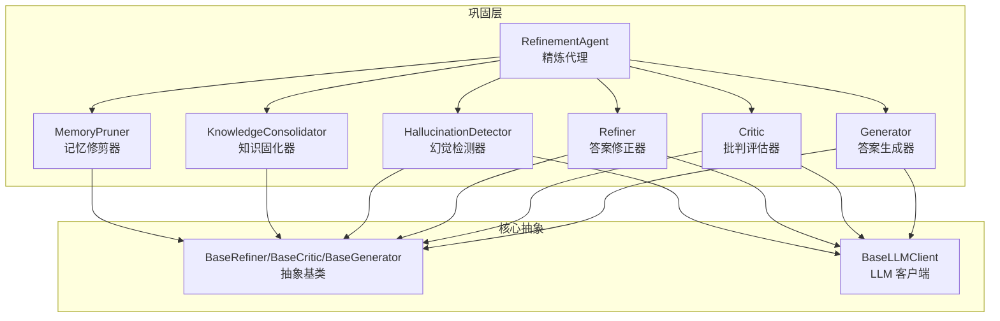
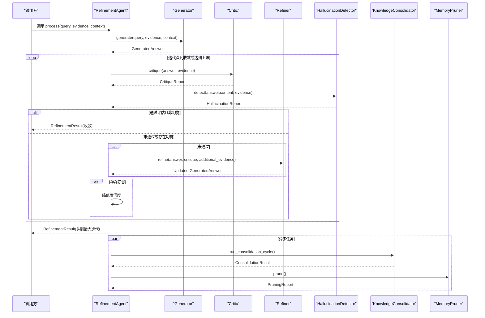
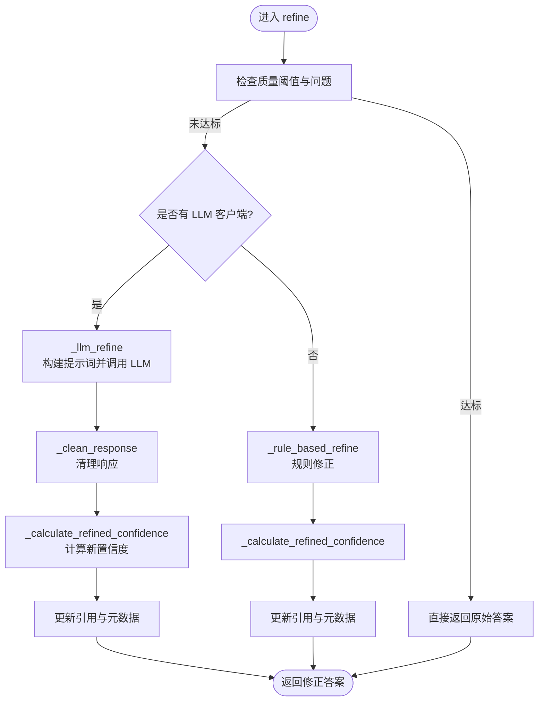
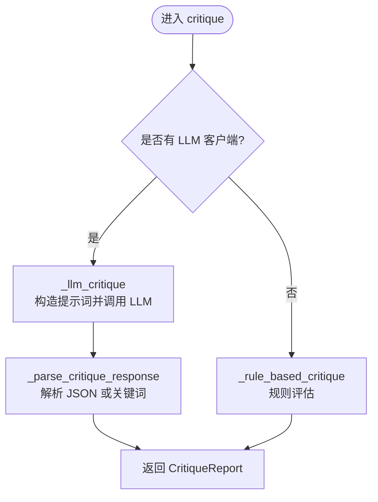
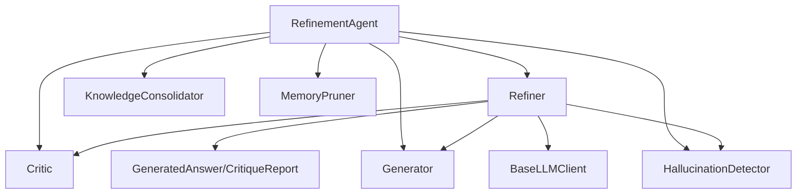

# 重构器组件

<cite>
**本文引用的文件**
- [src/refinement/refiner.py](file://src/refinement/refiner.py)
- [src/refinement/models.py](file://src/refinement/models.py)
- [src/refinement/critic.py](file://src/refinement/critic.py)
- [src/refinement/agent.py](file://src/refinement/agent.py)
- [src/refinement/generator.py](file://src/refinement/generator.py)
- [src/refinement/hallucination.py](file://src/refinement/hallucination.py)
- [src/refinement/consolidator.py](file://src/refinement/consolidator.py)
- [src/refinement/pruner.py](file://src/refinement/pruner.py)
- [src/core/base.py](file://src/core/base.py)
- [src/core/config.py](file://src/core/config.py)
- [src/dashboard/models.py](file://src/dashboard/models.py)
- [src/dashboard/static/index.html](file://src/dashboard/static/index.html)
- [example/example_usage.py](file://example/example_usage.py)
</cite>

## 目录
1. [简介](#简介)
2. [项目结构](#项目结构)
3. [核心组件](#核心组件)
4. [架构总览](#架构总览)
5. [详细组件分析](#详细组件分析)
6. [依赖关系分析](#依赖关系分析)
7. [性能考量](#性能考量)
8. [故障排查指南](#故障排查指南)
9. [结论](#结论)
10. [附录](#附录)

## 简介
重构器组件（Refiner）是巩固层的核心组件之一，负责在“生成-批判-修正-幻觉检测-收敛/输出”的闭环中，基于批评者的反馈对答案进行迭代修正与质量提升。它支持两种修正路径：基于 LLM 的智能修正与规则驱动的退化修正；具备证据整合能力，能够将补充证据自然融入现有答案；并通过置信度动态调整机制，持续优化输出的可靠性。

## 项目结构
重构器位于 src/refinement/refiner.py，配合数据模型、生成器、批判器、幻觉检测器、精炼代理、知识固化器与记忆修剪器共同构成巩固层闭环。

**图表来源**
- [src/refinement/agent.py:20-142](file://src/refinement/agent.py#L20-L142)
- [src/refinement/generator.py:16-102](file://src/refinement/generator.py#L16-L102)
- [src/refinement/critic.py:18-113](file://src/refinement/critic.py#L18-L113)
- [src/refinement/refiner.py:18-131](file://src/refinement/refiner.py#L18-L131)
- [src/refinement/hallucination.py:18-157](file://src/refinement/hallucination.py#L18-L157)
- [src/refinement/consolidator.py:41-161](file://src/refinement/consolidator.py#L41-L161)
- [src/refinement/pruner.py:10-70](file://src/refinement/pruner.py#L10-L70)

**章节来源**
- [src/refinement/refiner.py:18-131](file://src/refinement/refiner.py#L18-L131)
- [src/refinement/models.py:9-66](file://src/refinement/models.py#L9-L66)
- [src/refinement/agent.py:20-142](file://src/refinement/agent.py#L20-L142)

## 核心组件
- Refiner（答案修正器）：根据批判报告对答案进行迭代修正，支持 LLM 修正与规则修正双路径，具备证据整合与置信度调整能力。
- Critic（批判评估器）：对答案进行多维度质量评估，输出质量评分与问题清单，为修正提供依据。
- Generator（答案生成器）：基于检索证据生成初始答案，提供置信度估计。
- HallucinationDetector（幻觉检测器）：检测事实一致性、逻辑连贯性与证据支撑度，辅助收敛。
- KnowledgeConsolidator（知识固化器）：异步固化高质量 QA 对，合并碎片知识，更新图谱连接。
- MemoryPruner（记忆修剪器）：识别噪声、低质量与过时知识，执行修剪与连接强化。

**章节来源**
- [src/refinement/refiner.py:18-131](file://src/refinement/refiner.py#L18-L131)
- [src/refinement/critic.py:18-113](file://src/refinement/critic.py#L18-L113)
- [src/refinement/generator.py:16-102](file://src/refinement/generator.py#L16-L102)
- [src/refinement/hallucination.py:18-157](file://src/refinement/hallucination.py#L18-L157)
- [src/refinement/consolidator.py:41-161](file://src/refinement/consolidator.py#L41-L161)
- [src/refinement/pruner.py:10-70](file://src/refinement/pruner.py#L10-L70)

## 架构总览
重构器在精炼代理的闭环中承担“修正”角色，与生成器、批判器、幻觉检测器协同工作，并与知识固化器、记忆修剪器进行异步协作。

**图表来源**
- [src/refinement/agent.py:65-164](file://src/refinement/agent.py#L65-L164)
- [src/refinement/generator.py:68-102](file://src/refinement/generator.py#L68-L102)
- [src/refinement/critic.py:90-113](file://src/refinement/critic.py#L90-L113)
- [src/refinement/refiner.py:98-131](file://src/refinement/refiner.py#L98-L131)
- [src/refinement/hallucination.py:136-157](file://src/refinement/hallucination.py#L136-L157)
- [src/refinement/consolidator.py:105-161](file://src/refinement/consolidator.py#L105-L161)
- [src/refinement/pruner.py:41-69](file://src/refinement/pruner.py#L41-L69)

## 详细组件分析

### Refiner（答案修正器）
- 角色定位：在“生成-批判-修正-幻觉检测-收敛/输出”闭环中，基于批判报告对答案进行迭代修正与质量提升。
- 关键能力：
  - 基于 LLM 的智能修正：使用定制提示词模板，融合原始问题、当前答案、批判反馈、可用证据，输出修正后的答案。
  - 规则驱动的退化修正：在无 LLM 客户端时，依据问题清单与建议进行规则化修正，包括答案扩展、证据摘要与要点抽取等。
  - 证据整合：支持将补充证据自然融入现有答案，保持连贯性并优先采用新证据。
  - 置信度调整：根据批判质量评分与原始置信度动态计算修正后的置信度，提升输出可靠性。
  - 迭代修正：支持 refine_iterative 接口，自动循环评估-修正直至达标或达到最大迭代次数。
- 输入输出：
  - 输入：GeneratedAnswer、CritiqueReport、可选的 additional_evidence、query、original_evidence。
  - 输出：修正后的 GeneratedAnswer，包含内容、引用、置信度与元数据。
- 修正规则与质量控制：
  - 质量阈值：当质量评分达标且无问题时直接返回。
  - LLM 修正失败降级：捕获异常后自动切换至规则修正。
  - 响应清理：去除代码块标记与解释性前缀，保证输出整洁。
  - 置信度策略：高质量评分提升置信度，低质量评分经修正后适度提升，上限控制。
- 使用示例：
  - 在精炼代理中调用 refine 或 refine_iterative，结合批判器与生成器形成闭环。
  - 参考示例工程中的 RefinementAgent 使用方式。

**图表来源**
- [src/refinement/refiner.py:98-131](file://src/refinement/refiner.py#L98-L131)
- [src/refinement/refiner.py:177-245](file://src/refinement/refiner.py#L177-L245)
- [src/refinement/refiner.py:246-296](file://src/refinement/refiner.py#L246-L296)

**章节来源**
- [src/refinement/refiner.py:18-131](file://src/refinement/refiner.py#L18-L131)
- [src/refinement/refiner.py:177-245](file://src/refinement/refiner.py#L177-L245)
- [src/refinement/refiner.py:246-296](file://src/refinement/refiner.py#L246-L296)
- [example/example_usage.py:139-173](file://example/example_usage.py#L139-L173)

### Critic（批判评估器）
- 评估维度：事实性、完整性、相关性，分别赋予权重并综合计算质量评分。
- 评估流程：
  - LLM 评估：构造提示词，调用 LLM，解析 JSON 结果，提取评分、问题与建议。
  - 回退解析：若 JSON 解析失败，基于关键词统计计算质量评分。
  - 规则评估：在无 LLM 时，基于证据引用、置信度、答案长度与关键词重叠进行评估。
- 输出：CritiqueReport，包含 is_valid、issues、suggestions、quality_score。

**图表来源**
- [src/refinement/critic.py:90-113](file://src/refinement/critic.py#L90-L113)
- [src/refinement/critic.py:114-142](file://src/refinement/critic.py#L114-L142)
- [src/refinement/critic.py:232-309](file://src/refinement/critic.py#L232-L309)

**章节来源**
- [src/refinement/critic.py:18-113](file://src/refinement/critic.py#L18-L113)
- [src/refinement/critic.py:114-142](file://src/refinement/critic.py#L114-L142)
- [src/refinement/critic.py:232-309](file://src/refinement/critic.py#L232-L309)

### Generator（答案生成器）
- 生成策略：优先使用 LLM，构造包含证据与上下文的提示词；在无 LLM 时采用规则生成，构建要点列表并估算置信度。
- 置信度估计：考虑证据数量、答案长度与关键词覆盖度，限制在合理区间。

**章节来源**
- [src/refinement/generator.py:16-102](file://src/refinement/generator.py#L16-L102)
- [src/refinement/generator.py:103-142](file://src/refinement/generator.py#L103-L142)
- [src/refinement/generator.py:143-175](file://src/refinement/generator.py#L143-L175)
- [src/refinement/generator.py:177-209](file://src/refinement/generator.py#L177-L209)

### HallucinationDetector（幻觉检测器）
- 检测类型：事实一致性、逻辑连贯性、证据支撑度。
- 检测流程：分别调用三项 LLM 检测（事实一致性、逻辑连贯性、证据支撑度），或使用规则方法进行退化检测。
- 输出：HallucinationReport，包含 is_hallucination 与各维度分数及问题列表。

**章节来源**
- [src/refinement/hallucination.py:18-157](file://src/refinement/hallucination.py#L18-L157)
- [src/refinement/hallucination.py:158-307](file://src/refinement/hallucination.py#L158-L307)
- [src/refinement/hallucination.py:308-507](file://src/refinement/hallucination.py#L308-L507)

### KnowledgeConsolidator（知识固化器）
- 功能：分析查询模式、识别知识缺口、补充缺口、去重与合并碎片知识、更新图谱连接。
- 流程：运行固化周期，返回存储、去重、合并与缺口识别数量等指标。

**章节来源**
- [src/refinement/consolidator.py:41-161](file://src/refinement/consolidator.py#L41-L161)
- [src/refinement/consolidator.py:282-322](file://src/refinement/consolidator.py#L282-L322)
- [src/refinement/consolidator.py:323-358](file://src/refinement/consolidator.py#L323-L358)

### MemoryPruner（记忆修剪器）
- 功能：识别噪声、低质量与过时知识，执行删除与连接强化。
- 流程：识别三类记忆 → 执行删除 → 强化高频访问连接。

**章节来源**
- [src/refinement/pruner.py:10-70](file://src/refinement/pruner.py#L10-L70)
- [src/refinement/pruner.py:71-157](file://src/refinement/pruner.py#L71-L157)

## 依赖关系分析
- 组件耦合：
  - Refiner 依赖 Critic 的评估结果与 GeneratedAnswer 的输入输出数据结构。
  - RefinementAgent 协调 Generator、Critic、Refiner、HallucinationDetector、KnowledgeConsolidator、MemoryPruner。
  - 所有组件均实现抽象基类，便于替换与扩展。
- 外部依赖：
  - LLM 客户端接口（BaseLLMClient）用于 LLM 调用与嵌入。
  - 配置系统（RefinementConfig）提供参数化控制。

**图表来源**
- [src/refinement/refiner.py:18-131](file://src/refinement/refiner.py#L18-L131)
- [src/refinement/critic.py:18-113](file://src/refinement/critic.py#L18-L113)
- [src/refinement/generator.py:16-102](file://src/refinement/generator.py#L16-L102)
- [src/refinement/hallucination.py:18-157](file://src/refinement/hallucination.py#L18-L157)
- [src/refinement/agent.py:20-142](file://src/refinement/agent.py#L20-L142)
- [src/core/base.py:494-515](file://src/core/base.py#L494-L515)

**章节来源**
- [src/core/base.py:494-515](file://src/core/base.py#L494-L515)
- [src/core/base.py:542-604](file://src/core/base.py#L542-L604)

## 性能考量
- LLM 调用成本：
  - Refiner 与 Critic、HallucinationDetector 均可能触发 LLM 调用，建议在无 LLM 时启用规则退化路径，减少外部依赖。
  - 控制提示词长度与温度参数，平衡质量与速度。
- 迭代次数与收敛：
  - 通过 max_iterations 与 quality_threshold 控制收敛速度，避免过度迭代。
  - 在 RefinementAgent 中根据 is_valid 与 hallucination_report 提前终止。
- 置信度动态调整：
  - 修正后置信度受质量评分影响，避免过度乐观估计，有助于下游决策稳定。
- 异步任务：
  - 知识固化与记忆修剪在后台运行，不影响主流程响应时间。

[本节为通用指导，无需特定文件引用]

## 故障排查指南
- LLM 调用失败：
  - 现象：修正或评估过程中抛出异常。
  - 处理：Refiner 与 Critic、HallucinationDetector 均具备异常捕获与规则退化逻辑，自动切换至规则路径。
- 输出格式异常：
  - 现象：LLM 返回包含代码块或解释性前缀。
  - 处理：Refiner 使用响应清理方法去除标记与前缀，确保输出整洁。
- 质量评分不稳定：
  - 现象：评估结果波动较大。
  - 处理：调整温度参数与提示词稳定性；必要时增加迭代次数或收紧阈值。
- 幻觉风险：
  - 现象：检测到事实一致性或证据支撑度不足。
  - 处理：降低置信度并结合规则修正；补充高质量证据；优化提示词与评估权重。

**章节来源**
- [src/refinement/refiner.py:242-245](file://src/refinement/refiner.py#L242-L245)
- [src/refinement/critic.py:136-142](file://src/refinement/critic.py#L136-L142)
- [src/refinement/hallucination.py:216-220](file://src/refinement/hallucination.py#L216-L220)
- [src/refinement/refiner.py:298-314](file://src/refinement/refiner.py#L298-L314)

## 结论
重构器组件通过“生成-批判-修正-幻觉检测-收敛/输出”的闭环，结合证据整合与置信度动态调整，显著提升了答案的准确性与可靠性。其 LLM 与规则双路径设计增强了鲁棒性，异步知识固化与记忆修剪进一步保障了知识库的健康与高效。配合完善的配置系统与可视化界面，开发者可以灵活调优参数，实现稳定高效的 AI 输出质量控制。

[本节为总结性内容，无需特定文件引用]

## 附录

### 参数配置与质量控制指标
- 核心配置（运行期控制）：
  - max_iterations：循环最大迭代次数。
  - confidence_threshold：循环收敛阈值。
  - factual_threshold、logical_threshold、evidence_threshold：幻觉检测阈值。
  - enable_consolidation、consolidation_interval：知识固化开关与周期。
  - enable_pruning、pruning_threshold：记忆修剪开关与阈值。
- 前端配置（可视化调参）：
  - min_confidence、max_iterations、hallucination_threshold、min_query_frequency、gap_fill_strategy、noise_threshold、quality_threshold、outdated_days。
- 质量控制指标：
  - 质量评分（quality_score）、问题数量（critique_issues）、迭代次数（iterations）、置信度（confidence）。

**章节来源**
- [src/core/config.py:197-216](file://src/core/config.py#L197-L216)
- [src/dashboard/models.py:119-138](file://src/dashboard/models.py#L119-L138)
- [src/dashboard/static/index.html:619-645](file://src/dashboard/static/index.html#L619-L645)

### 使用示例与最佳实践
- 使用示例：参考示例工程中的 RefinementAgent 使用方式，准备证据列表并调用 process。
- 最佳实践：
  - 合理设置 max_iterations 与 quality_threshold，避免过度迭代。
  - 在无 LLM 环境下启用规则退化路径，确保系统可用性。
  - 结合知识固化与记忆修剪，持续优化知识库质量。
  - 使用 refine_iterative 自动循环修正，提升收敛效率。

**章节来源**
- [example/example_usage.py:139-173](file://example/example_usage.py#L139-L173)