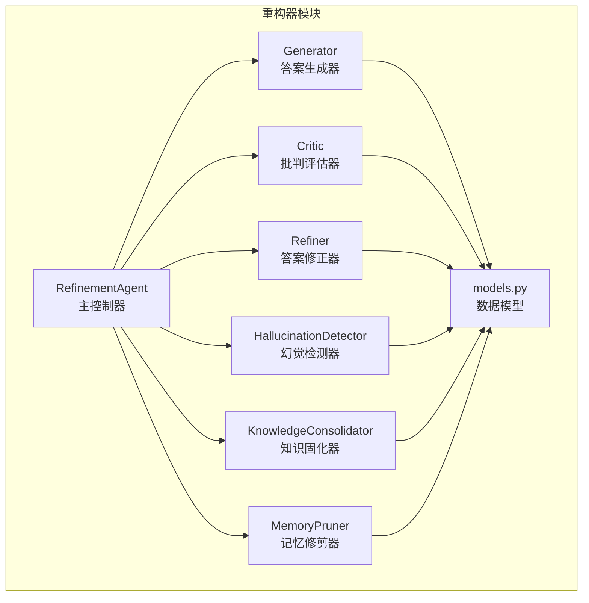
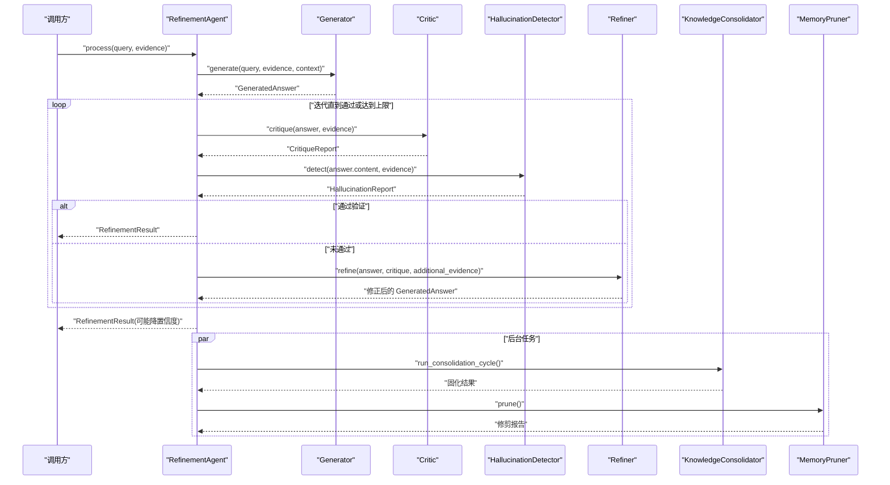
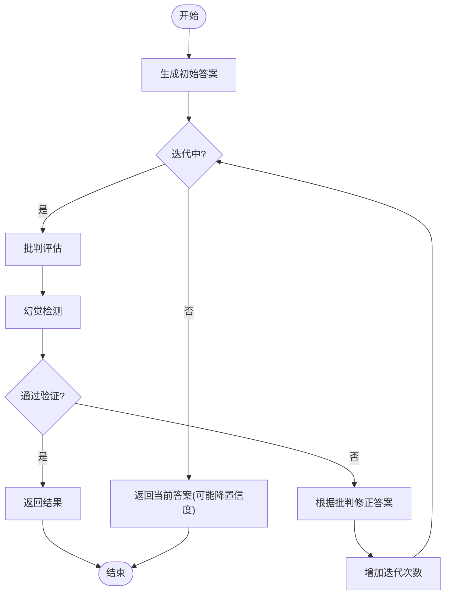
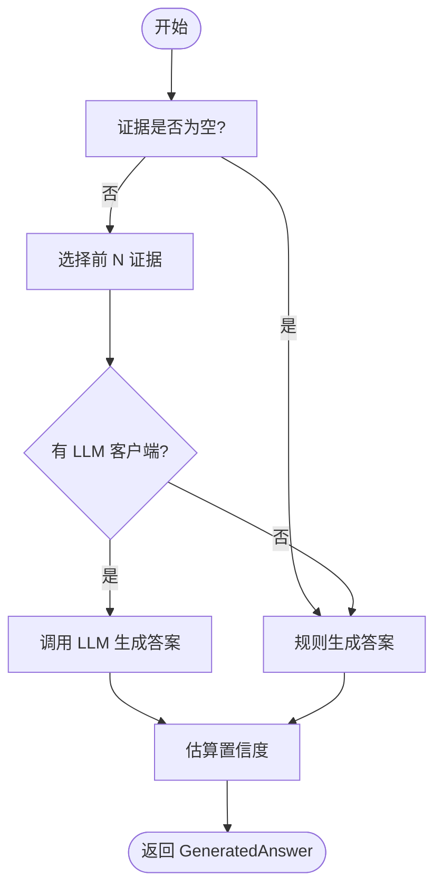
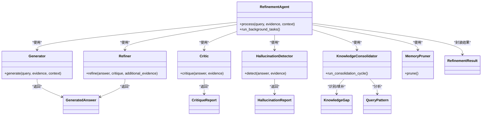

# 重构器组件

<cite>
**本文引用的文件**
- [src/refinement/agent.py](file://src/refinement/agent.py)
- [src/refinement/refiner.py](file://src/refinement/refiner.py)
- [src/refinement/critic.py](file://src/refinement/critic.py)
- [src/refinement/generator.py](file://src/refinement/generator.py)
- [src/refinement/hallucination.py](file://src/refinement/hallucination.py)
- [src/refinement/consolidator.py](file://src/refinement/consolidator.py)
- [src/refinement/pruner.py](file://src/refinement/pruner.py)
- [src/refinement/models.py](file://src/refinement/models.py)
- [src/refinement/README.md](file://src/refinement/README.md)
- [README.md](file://README.md)
- [example/example_usage.py](file://example/example_usage.py)
</cite>

## 目录
1. [简介](#简介)
2. [项目结构](#项目结构)
3. [核心组件](#核心组件)
4. [架构总览](#架构总览)
5. [详细组件分析](#详细组件分析)
6. [依赖关系分析](#依赖关系分析)
7. [性能考量](#性能考量)
8. [故障排查指南](#故障排查指南)
9. [结论](#结论)
10. [附录](#附录)

## 简介
重构器组件是 NecoRAG 的“巩固层”核心，负责在生成-评估-修正的闭环中持续提升答案质量，同时通过幻觉检测、知识固化与记忆修剪维持知识库的准确性与时效性。该组件以“猫舔毛梳理”的隐喻命名，强调对知识库的精细化维护与持续优化。

## 项目结构
重构器相关模块位于 src/refinement 目录，包含主控制器、生成器、批判器、修正器、幻觉检测器、知识固化器与记忆修剪器，以及统一的数据模型定义。

图表来源
- [src/refinement/agent.py:16-60](file://src/refinement/agent.py#L16-L60)
- [src/refinement/generator.py:15-50](file://src/refinement/generator.py#L15-L50)
- [src/refinement/critic.py:9-24](file://src/refinement/critic.py#L9-L24)
- [src/refinement/refiner.py:8-23](file://src/refinement/refiner.py#L8-L23)
- [src/refinement/hallucination.py:9-33](file://src/refinement/hallucination.py#L9-L33)
- [src/refinement/consolidator.py:9-34](file://src/refinement/consolidator.py#L9-L34)
- [src/refinement/pruner.py:10-39](file://src/refinement/pruner.py#L10-L39)
- [src/refinement/models.py:9-66](file://src/refinement/models.py#L9-L66)

章节来源
- [src/refinement/README.md:1-428](file://src/refinement/README.md#L1-L428)
- [README.md:290-329](file://README.md#L290-L329)

## 核心组件
- RefinementAgent：主控制器，协调生成、评估、修正、幻觉检测与后台固化/修剪任务。
- Generator：基于证据生成答案，支持 LLM 客户端与规则回退，估算置信度。
- Critic：对答案进行质量评估，给出问题与建议，并输出质量评分。
- Refiner：根据批判意见与补充证据修正答案，调整置信度与引用。
- HallucinationDetector：检测事实一致性、逻辑连贯性与证据支撑度，输出幻觉报告。
- KnowledgeConsolidator：异步分析查询模式、识别知识缺口、补充与合并知识。
- MemoryPruner：模拟“舔毛”行为，清理噪声、低质量与过时信息，强化重要连接。
- models：统一的数据模型，承载 GeneratedAnswer、CritiqueReport、HallucinationReport、RefinementResult、KnowledgeGap、QueryPattern 等。

章节来源
- [src/refinement/agent.py:16-60](file://src/refinement/agent.py#L16-L60)
- [src/refinement/generator.py:15-50](file://src/refinement/generator.py#L15-L50)
- [src/refinement/critic.py:9-24](file://src/refinement/critic.py#L9-L24)
- [src/refinement/refiner.py:8-23](file://src/refinement/refiner.py#L8-L23)
- [src/refinement/hallucination.py:9-33](file://src/refinement/hallucination.py#L9-L33)
- [src/refinement/consolidator.py:9-34](file://src/refinement/consolidator.py#L9-L34)
- [src/refinement/pruner.py:10-39](file://src/refinement/pruner.py#L10-L39)
- [src/refinement/models.py:9-66](file://src/refinement/models.py#L9-L66)

## 架构总览
重构器采用“生成-评估-修正-幻觉检测”的同步闭环，配合“知识固化-记忆修剪”的异步维护，形成完整的质量保障体系。

图表来源
- [src/refinement/agent.py:61-151](file://src/refinement/agent.py#L61-L151)
- [src/refinement/generator.py:67-101](file://src/refinement/generator.py#L67-L101)
- [src/refinement/critic.py:25-72](file://src/refinement/critic.py#L25-L72)
- [src/refinement/refiner.py:24-64](file://src/refinement/refiner.py#L24-L64)
- [src/refinement/hallucination.py:34-76](file://src/refinement/hallucination.py#L34-L76)
- [src/refinement/consolidator.py:35-61](file://src/refinement/consolidator.py#L35-L61)
- [src/refinement/pruner.py:41-69](file://src/refinement/pruner.py#L41-L69)

## 详细组件分析

### RefinementAgent 主控制器
- 职责：协调各子组件，执行迭代优化与后台任务。
- 关键点：
  - 生成初始答案后进入循环：批判评估 + 幻觉检测 → 未通过则修正 → 达到最大迭代或满足条件后返回。
  - 若检测到幻觉，降低置信度；若最终置信度低于阈值，返回兜底提示。
  - 异步运行知识固化与记忆修剪，返回执行结果。

图表来源
- [src/refinement/agent.py:61-129](file://src/refinement/agent.py#L61-L129)

章节来源
- [src/refinement/agent.py:16-151](file://src/refinement/agent.py#L16-L151)

### Generator 答案生成器
- 职责：基于证据生成答案，支持 LLM 客户端与规则回退，估算置信度。
- 关键点：
  - 证据为空时返回兜底答案与零置信度。
  - 选择前 N 个证据，构造提示词并调用 LLM；否则走规则生成。
  - 置信度估计综合证据数量、答案长度与关键词覆盖度。

图表来源
- [src/refinement/generator.py:67-174](file://src/refinement/generator.py#L67-L174)
- [src/refinement/generator.py:176-208](file://src/refinement/generator.py#L176-L208)

章节来源
- [src/refinement/generator.py:15-208](file://src/refinement/generator.py#L15-L208)

### Critic 批判评估器
- 职责：评估答案质量，识别证据缺失、置信度过低、答案过短等问题，输出质量评分。
- 关键点：
  - 基于规则检查：无引用、置信度阈值、答案长度阈值。
  - 质量评分按问题数量线性扣分，不低于 0。

章节来源
- [src/refinement/critic.py:9-72](file://src/refinement/critic.py#L9-L72)

### Refiner 答案修正器
- 职责：根据批判意见与补充证据修正答案，调整置信度与引用。
- 当前实现要点：
  - 简单拼接补充证据片段。
  - 基于质量评分微调置信度（提高或降低）。
  - 附加引用标识，记录修正元数据。

章节来源
- [src/refinement/refiner.py:8-64](file://src/refinement/refiner.py#L8-L64)

### HallucinationDetector 幻觉检测器
- 职责：检测事实一致性、逻辑连贯性与证据支撑度，输出幻觉报告。
- 当前实现要点：
  - 事实一致性：基于答案与证据的词集重叠比例。
  - 逻辑连贯性：基于长度与逻辑连接词存在性。
  - 证据支撑度：基于证据数量的简单估计。
  - 综合阈值判断是否为幻觉。

章节来源
- [src/refinement/hallucination.py:9-154](file://src/refinement/hallucination.py#L9-L154)

### KnowledgeConsolidator 知识固化器
- 职责：异步分析查询模式、识别知识缺口、补充与合并知识、更新图谱连接。
- 当前实现要点：
  - 查询模式分析、知识缺口识别、填补缺口、碎片合并、图谱连接更新（均为 TODO 待实现）。

章节来源
- [src/refinement/consolidator.py:9-142](file://src/refinement/consolidator.py#L9-L142)

### MemoryPruner 记忆修剪器
- 职责：模拟“舔毛”行为，清理噪声、低质量与过时信息，强化重要连接。
- 当前实现要点：
  - 噪声识别：低权重且低访问次数。
  - 低质量识别：短内容且低权重。
  - 过时识别：最后访问时间早于阈值。
  - 修剪与强化：删除冗余、提升高频访问项权重。

章节来源
- [src/refinement/pruner.py:10-157](file://src/refinement/pruner.py#L10-L157)

### 数据模型
- GeneratedAnswer：生成的答案，包含内容、引用、置信度与元数据。
- CritiqueReport：批判报告，包含是否有效、问题列表、建议与质量评分。
- HallucinationReport：幻觉检测报告，包含事实一致性、逻辑连贯性、证据支撑度与问题列表。
- RefinementResult：精炼结果，包含查询、答案、置信度、引用、幻觉报告、迭代次数与元数据。
- KnowledgeGap：知识缺口，包含缺口 ID、主题、描述、频率与元数据。
- QueryPattern：查询模式，包含模式、计数、命中率与示例列表。

章节来源
- [src/refinement/models.py:9-66](file://src/refinement/models.py#L9-L66)

## 依赖关系分析
- RefinementAgent 依赖 Generator、Critic、Refiner、HallucinationDetector、KnowledgeConsolidator、MemoryPruner。
- 各组件均依赖 models 中的数据模型。
- 生成器可选依赖 LLM 客户端，否则使用规则回退。
- 知识固化器与记忆修剪器依赖 MemoryManager（由 RefinementAgent 注入）。

图表来源
- [src/refinement/agent.py:16-60](file://src/refinement/agent.py#L16-L60)
- [src/refinement/generator.py:15-50](file://src/refinement/generator.py#L15-L50)
- [src/refinement/critic.py:9-24](file://src/refinement/critic.py#L9-L24)
- [src/refinement/refiner.py:8-23](file://src/refinement/refiner.py#L8-L23)
- [src/refinement/hallucination.py:9-33](file://src/refinement/hallucination.py#L9-L33)
- [src/refinement/consolidator.py:9-34](file://src/refinement/consolidator.py#L9-L34)
- [src/refinement/pruner.py:10-39](file://src/refinement/pruner.py#L10-L39)
- [src/refinement/models.py:9-66](file://src/refinement/models.py#L9-L66)

## 性能考量
- 生成阶段：证据数量与长度影响置信度与生成成本；建议控制 max_evidence 与 temperature 以平衡质量与速度。
- 评估与修正：批判与修正的复杂度较低，主要瓶颈在 LLM 调用；可通过缓存与批量化优化。
- 幻觉检测：当前实现为启发式规则，计算开销小；后续可引入更高效的事实一致性检测模型。
- 知识固化与修剪：异步执行，避免阻塞主流程；建议设置合理的调度间隔与阈值，防止过度扫描。

## 故障排查指南
- 答案置信度过低
  - 检查证据数量与质量，必要时增加 max_evidence 或提升检索质量。
  - 关注 Critic 的质量评分与问题列表，针对性补充证据或改写答案。
- 幻觉风险
  - 关注 HallucinationDetector 的事实一致性与证据支撑度；若持续偏弱，考虑更强的 LLM 或更严格的证据筛选。
- 迭代次数过多
  - 调整 max_iterations 与 min_confidence；检查 Refiner 的修正策略是否有效。
- 后台任务未生效
  - 确认 MemoryManager 已注入；检查 KnowledgeConsolidator 与 MemoryPruner 的阈值与实现状态。

章节来源
- [src/refinement/agent.py:61-151](file://src/refinement/agent.py#L61-L151)
- [src/refinement/critic.py:25-72](file://src/refinement/critic.py#L25-L72)
- [src/refinement/hallucination.py:34-76](file://src/refinement/hallucination.py#L34-L76)
- [src/refinement/consolidator.py:35-61](file://src/refinement/consolidator.py#L35-L61)
- [src/refinement/pruner.py:41-69](file://src/refinement/pruner.py#L41-L69)

## 结论
重构器组件通过“生成-评估-修正-幻觉检测”的闭环与“知识固化-记忆修剪”的异步维护，构建了从答案质量到知识库健康度的双重保障。当前实现以启发式规则为主，具备良好的可扩展性，后续可在 LLM 集成、检测算法与自动化策略上进一步深化，以实现更稳健的迭代优化与质量提升。

## 附录

### 配置选项与参数
- RefinementAgent
  - llm_model：LLM 模型名称
  - memory：记忆管理器（可选）
  - max_iterations：最大迭代次数
  - min_confidence：最低置信度阈值
- Generator
  - llm_client：LLM 客户端（可选）
  - max_evidence：最大使用证据数量
  - temperature：生成温度
- HallucinationDetector
  - fact_threshold：事实一致性阈值
  - support_threshold：证据支撑度阈值
- KnowledgeConsolidator
  - memory_manager：记忆管理器
  - min_query_frequency：最小查询频率阈值
- MemoryPruner
  - memory_manager：记忆管理器
  - noise_threshold：噪声判定阈值
  - quality_threshold：质量判定阈值
  - outdated_days：过时天数判定

章节来源
- [src/refinement/agent.py:27-60](file://src/refinement/agent.py#L27-L60)
- [src/refinement/generator.py:25-42](file://src/refinement/generator.py#L25-L42)
- [src/refinement/hallucination.py:19-33](file://src/refinement/hallucination.py#L19-L33)
- [src/refinement/consolidator.py:20-34](file://src/refinement/consolidator.py#L20-L34)
- [src/refinement/pruner.py:20-39](file://src/refinement/pruner.py#L20-L39)

### 使用示例与最佳实践
- 使用示例
  - 参考示例脚本中的 RefinementAgent 使用方式，准备证据列表并调用 process 获取结果。
- 最佳实践
  - 控制证据数量与质量，避免冗余证据导致生成成本上升。
  - 通过 Critic 的问题列表与建议进行针对性改进。
  - 对高置信幻觉采取“不知道”策略，对中低置信幻觉补充证据或提示用户。
  - 定期运行后台任务，保持知识库的活跃度与准确性。

章节来源
- [example/example_usage.py:139-174](file://example/example_usage.py#L139-L174)
- [README.md:290-329](file://README.md#L290-L329)