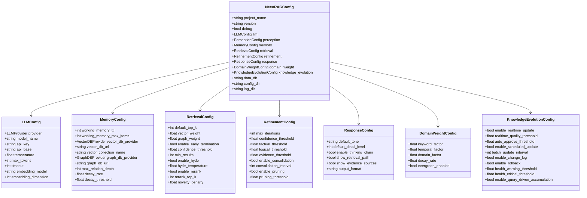
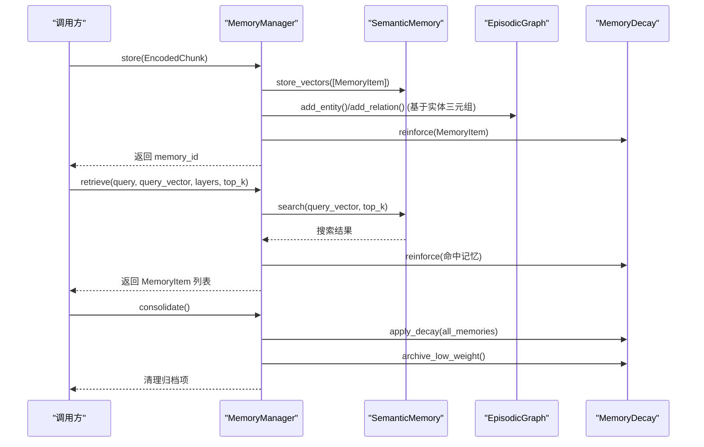
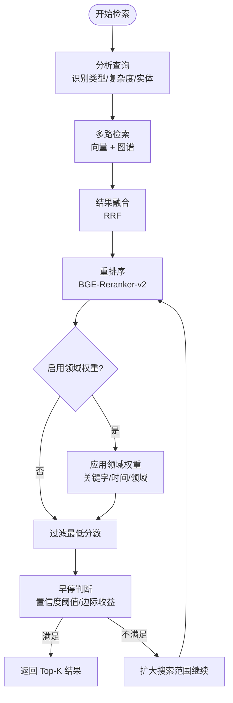
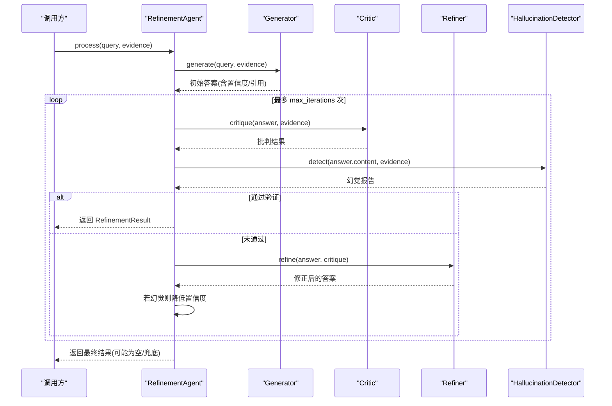
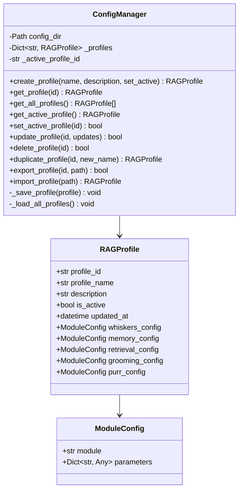
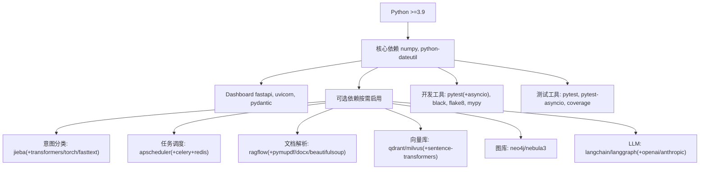

# 开发与测试

<cite>
**本文引用的文件**
- [README.md](file://README.md)
- [QUICKSTART.md](file://QUICKSTART.md)
- [CONTRIBUTING.md](file://CONTRIBUTING.md)
- [pyproject.toml](file://pyproject.toml)
- [requirements.txt](file://requirements.txt)
- [opdev/Dockerfile](file://opdev/Dockerfile)
- [opdev/docker-compose.yml](file://opdev/docker-compose.yml)
- [test_init.py](file://test_init.py)
- [tools/test_imports.py](file://tools/test_imports.py)
- [example/example_usage.py](file://example/example_usage.py)
- [src/core/config.py](file://src/core/config.py)
- [src/dashboard/config_manager.py](file://src/dashboard/config_manager.py)
- [src/memory/manager.py](file://src/memory/manager.py)
- [src/retrieval/retriever.py](file://src/retrieval/retriever.py)
- [src/refinement/agent.py](file://src/refinement/agent.py)
- [tests/conftest.py](file://tests/conftest.py)
- [tests/__init__.py](file://tests/__init__.py)
- [tests/test_core/test_config.py](file://tests/test_core/test_config.py)
- [tests/test_core/test_protocols.py](file://tests/test_core/test_protocols.py)
- [tests/test_integration/test_necorag.py](file://tests/test_integration/test_necorag.py)
- [tests/test_intent/test_classifier.py](file://tests/test_intent/test_classifier.py)
- [tests/test_memory/test_decay.py](file://tests/test_memory/test_decay.py)
- [tests/test_memory/test_working_memory.py](file://tests/test_memory/test_working_memory.py)
- [tests/test_perception/test_chunker.py](file://tests/test_perception/test_chunker.py)
- [tests/test_retrieval/test_retriever.py](file://tests/test_retrieval/test_retriever.py)
</cite>

## 更新摘要
**变更内容**
- 新增完整的测试基础设施目录结构：tests/ 目录包含 6 个专门的测试模块
- 添加测试配置系统：tests/conftest.py 提供共享的测试夹具和样本数据
- 扩展测试覆盖范围：涵盖核心配置、协议、集成、意图分析、记忆管理和感知处理
- 增强测试工具链：使用 pytest 作为主要测试框架，支持异步测试

## 目录
1. [引言](#引言)
2. [项目结构](#项目结构)
3. [核心组件](#核心组件)
4. [架构总览](#架构总览)
5. [详细组件分析](#详细组件分析)
6. [测试基础设施](#测试基础设施)
7. [依赖分析](#依赖分析)
8. [性能考量](#性能考量)
9. [故障排除指南](#故障排除指南)
10. [结论](#结论)
11. [附录](#附录)

## 引言
本文件面向开发与测试团队，提供从环境搭建、依赖安装、测试策略到代码规范、质量标准、调试与故障排除以及性能优化与监控的全流程指导。文档结合仓库中的安装说明、配置管理、模块实现与容器化部署方案，帮助开发者快速建立一致的开发与测试环境，并稳定交付高质量代码。

**更新** 新增完整的测试基础设施，包含 6 个专门的测试模块和统一的测试配置系统

## 项目结构
项目采用"五层认知"架构，围绕感知、记忆、检索、巩固与交互五大层组织模块；同时提供 Dashboard 配置管理与容器化一键部署方案。关键目录与文件如下：
- 核心模块：src/perception、src/memory、src/retrieval、src/refinement、src/response、src/dashboard
- 配置与核心：src/core/config.py
- 开发与测试：tools/test_imports.py、example/example_usage.py、test_init.py、**tests/**（新增）
- 容器化：opdev/Dockerfile、opdev/docker-compose.yml
- 项目配置：pyproject.toml、requirements.txt
- 文档与指南：README.md、QUICKSTART.md、CONTRIBUTING.md

```mermaid
graph TB
A["项目根目录"] --> B["src 核心模块"]
A --> C["tools 测试与辅助脚本"]
A --> D["example 示例"]
A --> E["opdev 容器化与编排"]
A --> F["配置与清单"]
A --> G["tests 测试基础设施"]
B --> B1["perception 感知层"]
B --> B2["memory 记忆层"]
B --> B3["retrieval 检索层"]
B --> B4["refinement 巩固层"]
B --> B5["response 交互层"]
B --> B6["dashboard 配置管理"]
B --> B7["core 配置与协议"]
C --> C1["test_imports.py"]
D --> D1["example_usage.py"]
E --> E1["Dockerfile"]
E --> E2["docker-compose.yml"]
F --> F1["pyproject.toml"]
F --> F2["requirements.txt"]
G --> G1["test_core 核心配置测试"]
G --> G2["test_integration 集成测试"]
G --> G3["test_intent 意图分析测试"]
G --> G4["test_memory 记忆管理测试"]
G --> G5["test_perception 感知处理测试"]
G --> G6["test_retrieval 检索系统测试"]
G --> G7["conftest.py 测试配置"]
```



**章节来源**
- [README.md:1-678](file://README.md#L1-L678)
- [QUICKSTART.md:1-325](file://QUICKSTART.md#L1-L325)

## 核心组件
- 配置管理：统一的 NecoRAGConfig 与各层子配置，支持文件与环境变量加载，提供开发/生产/最小化预设。
- 记忆管理：MemoryManager 统一管理 L1/L2/L3 三层记忆，支持向量检索、实体图谱与记忆衰减。
- 自适应检索：AdaptiveRetriever 集成 HyDE、重排序、领域权重与早停机制。
- 精炼代理：RefinementAgent 实现 Generator-Critic-Refiner 闭环与幻觉检测。
- Dashboard：ConfigManager 提供 Profile 的创建、切换、导入导出与参数管理。

**章节来源**
- [src/core/config.py:1-405](file://src/core/config.py#L1-L405)
- [src/memory/manager.py:1-195](file://src/memory/manager.py#L1-L195)
- [src/retrieval/retriever.py:1-440](file://src/retrieval/retriever.py#L1-L440)
- [src/refinement/agent.py:1-151](file://src/refinement/agent.py#L1-L151)
- [src/dashboard/config_manager.py:1-315](file://src/dashboard/config_manager.py#L1-L315)

## 架构总览
下图展示了从感知到交互的五层架构，以及配置与 Dashboard 的集成关系。

```mermaid
graph TB
subgraph "感知层"
P["PerceptionEngine<br/>文档解析与编码"]
end
subgraph "记忆层"
M["MemoryManager<br/>L1/L2/L3 统一管理"]
end
subgraph "检索层"
R["AdaptiveRetriever<br/>HyDE/重排序/早停/领域权重"]
end
subgraph "巩固层"
G["RefinementAgent<br/>Generator/Critic/Refiner/幻觉检测"]
end
subgraph "交互层"
I["ResponseInterface<br/>情境自适应与思维链可视化"]
end
subgraph "配置与管理"
CFG["NecoRAGConfig<br/>各层配置"]
DASH["ConfigManager<br/>Profile 管理"]
END
P --> M
M --> R
R --> G
G --> I
CFG --> P
CFG --> M
CFG --> R
CFG --> G
CFG --> I
DASH --> CFG
```

**图表来源**
- [src/core/config.py:265-405](file://src/core/config.py#L265-L405)
- [src/memory/manager.py:16-195](file://src/memory/manager.py#L16-L195)
- [src/retrieval/retriever.py:122-440](file://src/retrieval/retriever.py#L122-L440)
- [src/refinement/agent.py:16-151](file://src/refinement/agent.py#L16-L151)
- [src/dashboard/config_manager.py:14-315](file://src/dashboard/config_manager.py#L14-L315)

## 详细组件分析

### 配置管理与加载
- 支持从文件与环境变量加载，优先级：环境变量 > 配置文件 > 默认值。
- 预设配置：development、production、minimal，便于不同场景快速切换。
- 枚举类型安全：LLM/向量/图数据库提供商等均以枚举形式保证取值合法。



**图表来源**
- [src/core/config.py:45-318](file://src/core/config.py#L45-L318)

**章节来源**
- [src/core/config.py:323-362](file://src/core/config.py#L323-L362)
- [src/core/config.py:375-405](file://src/core/config.py#L375-L405)

### 记忆管理器（三层记忆）
- 统一存储：以 memory_id 为中心，聚合 L2 向量与 L3 实体关系。
- 记忆巩固与主动遗忘：基于 MemoryDecay 的权重衰减与归档策略。
- 跨层检索：根据查询向量在 L2 检索，再强化访问并回填统一存储。



**图表来源**
- [src/memory/manager.py:48-195](file://src/memory/manager.py#L48-L195)

**章节来源**
- [src/memory/manager.py:16-195](file://src/memory/manager.py#L16-L195)

### 自适应检索器（HyDE/重排序/早停/领域权重）
- 多路检索：向量检索 + 图谱检索（实体）。
- 结果融合：使用倒数秩融合策略。
- 重排序：基于 BGE-Reranker-v2。
- 领域权重：可选的复合权重计算与查询增强。
- 早停机制：基于置信度阈值与边际收益的智能终止。



**图表来源**
- [src/retrieval/retriever.py:177-254](file://src/retrieval/retriever.py#L177-L254)
- [src/retrieval/retriever.py:307-332](file://src/retrieval/retriever.py#L307-L332)
- [src/retrieval/retriever.py:333-364](file://src/retrieval/retriever.py#L333-L364)

**章节来源**
- [src/retrieval/retriever.py:122-440](file://src/retrieval/retriever.py#L122-L440)

### 精炼代理（Generator-Critic-Refiner 闭环）
- 迭代验证：生成 → 批判 → 修正 → 幻觉检测。
- 置信度控制：未通过时降低置信度，达到阈值才返回。
- 异步任务：知识固化与记忆修剪（需 MemoryManager）。



**图表来源**
- [src/refinement/agent.py:61-129](file://src/refinement/agent.py#L61-L129)

**章节来源**
- [src/refinement/agent.py:16-151](file://src/refinement/agent.py#L16-L151)

### Dashboard 配置管理
- Profile 生命周期：创建、激活、更新、复制、导入导出、删除。
- 参数管理：按模块（whiskers/memory/retrieval/grooming/purr）更新参数。
- 默认配置：首次启动自动创建默认 Profile 并设为活动。



**图表来源**
- [src/dashboard/config_manager.py:14-315](file://src/dashboard/config_manager.py#L14-L315)

**章节来源**
- [src/dashboard/config_manager.py:14-315](file://src/dashboard/config_manager.py#L14-L315)

## 测试基础设施

### 测试目录结构
项目新增了完整的测试基础设施，采用模块化的目录结构，每个功能模块都有对应的测试套件：

- **test_core/**：核心配置与协议测试
- **test_integration/**：端到端集成测试
- **test_intent/**：意图分类器测试
- **test_memory/**：记忆管理测试（衰减、工作记忆）
- **test_perception/**：感知处理测试（分块策略）
- **test_retrieval/**：检索系统测试（早停控制器、自适应检索器）

### 测试配置系统
tests/conftest.py 提供了统一的测试配置系统，包含以下功能：

#### 配置夹具（Fixtures）
- **默认配置**：NecoRAGConfig、LLMConfig、PerceptionConfig、MemoryConfig、RetrievalConfig、RefinementConfig、ResponseConfig
- **预设配置**：development_config、minimal_config、custom_config
- **Mock 客户端**：MockLLMClient 及其变体
- **样本数据**：Document、Chunk、Query、Entity、Relation、UserProfile、Memory 等

#### 样本文本夹具
- **短/中/长文本**：sample_text_short、sample_text_medium、sample_text_long
- **多语言文本**：sample_text_chinese、sample_text_english、sample_text_mixed
- **时间夹具**：current_time、past_time、future_time

#### 辅助夹具
- **时间相关**：用于测试时间敏感的功能
- **数据验证**：提供各种测试场景的数据

### 核心测试模块

#### test_core 模块
涵盖配置系统和数据协议的全面测试：

**配置测试**（test_config.py）
- NecoRAGConfig 创建与配置验证
- 各子配置（LLMConfig、PerceptionConfig、MemoryConfig 等）测试
- 配置序列化/反序列化测试
- ConfigPresets 预设配置测试
- 枚举类型测试（LLMProvider、VectorDBProvider、GraphDBProvider）

**协议测试**（test_protocols.py）
- 所有统一数据模型的创建和字段验证
- 枚举类型测试（DocumentType、ChunkType、MemoryLayer、ResponseTone、DetailLevel、IntentType）
- Document、Chunk、Entity、Relation、Response、UserProfile 等数据类测试
- 嵌入向量、编码分块、检索结果等中间数据结构测试

#### 集成测试模块
**端到端测试**（test_necorag.py）
- NecoRAG 主类初始化测试
- 端到端 query 流程测试（使用 MockLLMClient）
- 文档导入流程测试
- 意图分析、知识演化、自适应学习等功能测试
- 生命周期管理测试（clear、context manager、close）
- 工厂方法测试（quick_start、from_config_file、create_rag）
- 完整工作流测试和多查询会话测试
- 边界情况测试（Unicode、超长内容、特殊字符）

#### 意图分析测试
**分类器测试**（test_classifier.py）
- 意图分类器初始化测试
- 基于规则的分类测试（解释、操作指导、比较分析、推理、摘要、探索、事实查询）
- 意图结果数据类测试（IntentResult）
- 关键词提取和实体提取测试
- 多意图支持测试
- 后端切换和回退机制测试
- 批量分类测试
- IntentConfig 和 IntentRoutingStrategy 测试

#### 记忆管理测试
**衰减测试**（test_decay.py）
- 记忆衰减计算测试
- 不同衰减策略测试
- 归档判断测试
- 记忆强化测试
- 衰减率影响测试
- 边界情况测试

**工作记忆测试**（test_working_memory.py）
- 工作记忆存储和检索测试
- 容量限制测试
- 会话管理测试
- 意图轨迹跟踪测试
- 多会话隔离测试
- 边界情况测试

#### 感知处理测试
**分块策略测试**（test_chunker.py）
- 弹性切割（elastic strategy）测试
- 按段落切割、按句子切割测试
- 中英文混合内容测试
- 边界情况测试（空文本、超长文本、单字符）
- 分块大小参数测试
- 分块元数据测试
- 辅助方法测试

#### 检索系统测试
**检索器测试**（test_retriever.py）
- 早停控制器测试（EarlyTerminationController）
- AdaptiveRetriever 初始化测试
- 基本检索流程测试
- 检索路径追踪测试
- 查询分析测试
- HyDE 增强检索测试
- 多跳检索测试
- 边界情况测试

### 测试工具链
- **pytest**：主要测试框架，支持标记、夹具、参数化测试
- **pytest-asyncio**：支持异步测试
- **测试覆盖率**：支持代码覆盖率分析
- **测试并行化**：支持多线程测试执行

**章节来源**
- [tests/conftest.py:1-330](file://tests/conftest.py#L1-L330)
- [tests/test_core/test_config.py:1-397](file://tests/test_core/test_config.py#L1-L397)
- [tests/test_core/test_protocols.py:1-494](file://tests/test_core/test_protocols.py#L1-L494)
- [tests/test_integration/test_necorag.py:1-580](file://tests/test_integration/test_necorag.py#L1-L580)
- [tests/test_intent/test_classifier.py:1-493](file://tests/test_intent/test_classifier.py#L1-L493)
- [tests/test_memory/test_decay.py:1-544](file://tests/test_memory/test_decay.py#L1-L544)
- [tests/test_memory/test_working_memory.py:1-307](file://tests/test_memory/test_working_memory.py#L1-L307)
- [tests/test_perception/test_chunker.py:1-532](file://tests/test_perception/test_chunker.py#L1-L532)
- [tests/test_retrieval/test_retriever.py:1-410](file://tests/test_retrieval/test_retriever.py#L1-L410)

## 依赖分析
- Python 版本：要求 3.9+，项目元数据与工具链均针对该版本范围配置。
- 核心依赖：numpy、python-dateutil。
- Dashboard 依赖：fastapi、uvicorn、pydantic。
- 可选依赖：意图分类（jieba、transformers/torch、fasttext）、任务调度（apscheduler、celery+redis）、文档解析（RAGFlow）、向量/图数据库（Qdrant/Milvus、Neo4j/NebulaGraph）、嵌入模型（BGE 系列）、LLM（langchain/langgraph/openai/anthropic）等。
- 开发工具：pytest、pytest-asyncio、black、flake8、mypy。



**图表来源**
- [pyproject.toml:27-39](file://pyproject.toml#L27-L39)
- [requirements.txt:3-71](file://requirements.txt#L3-L71)

**章节来源**
- [pyproject.toml:10-25](file://pyproject.toml#L10-L25)
- [pyproject.toml:32-63](file://pyproject.toml#L32-L63)
- [requirements.txt:1-71](file://requirements.txt#L1-L71)

## 性能考量
- 检索性能：通过早停机制在达到置信度阈值时立即返回，减少不必要的重排序与领域权重计算；合理设置 top_k 与 rerank_top_k。
- 记忆衰减：通过权重衰减与归档策略降低上下文规模，提升检索效率。
- 重排序与领域权重：仅在必要时启用，避免对简单查询造成额外开销。
- 容器化与资源：Docker Compose 提供 Redis/Qdrant/Neo4j/Ollama/Grafana 等服务编排，建议按需启用与资源限制。

**章节来源**
- [src/retrieval/retriever.py:30-120](file://src/retrieval/retriever.py#L30-L120)
- [src/memory/manager.py:149-185](file://src/memory/manager.py#L149-L185)
- [opdev/docker-compose.yml:1-164](file://opdev/docker-compose.yml#L1-L164)

## 故障排除指南
- 环境与依赖
  - Python 版本不符：确认使用 3.9+。
  - 依赖缺失：执行安装命令，参考 requirements.txt 与 pyproject.toml 的 dev 依赖。
- Dashboard 启动失败
  - 端口占用：检查 8000 端口，必要时更换端口。
  - 服务健康检查：容器编排中包含健康检查，确认依赖服务（Redis/Qdrant/Neo4j/Ollama）可用。
- 模块导入与基础功能
  - 使用导入测试脚本验证模块导入与基础初始化。
  - 运行完整示例，观察各层协同行为。
- 配置问题
  - 通过 ConfigManager 管理 Profile，确保活动 Profile 正确设置。
  - 使用环境变量覆盖关键配置（如 LLM/向量/图数据库提供商与地址）。
- **测试问题**
  - **测试环境**：确保 tests/ 目录结构正确，conftest.py 配置正常。
  - **测试夹具**：检查 conftest.py 中的夹具是否正确导入和使用。
  - **模块导入**：某些模块可能存在导入问题，测试中使用了 try-except 处理。
  - **Mock 依赖**：确保 MockLLMClient 等 Mock 依赖正确配置。

**章节来源**
- [QUICKSTART.md:237-277](file://QUICKSTART.md#L237-L277)
- [tools/test_imports.py:1-64](file://tools/test_imports.py#L1-L64)
- [example/example_usage.py:1-252](file://example/example_usage.py#L1-L252)
- [src/core/config.py:323-362](file://src/core/config.py#L323-L362)

## 结论
本指南提供了从环境搭建、依赖安装、测试策略到代码规范、质量标准、调试与性能优化的完整路径。**新增的完整测试基础设施**为项目的稳定性和可靠性提供了坚实保障，包含：

- **全面的测试覆盖**：从核心配置到具体功能模块的全方位测试
- **统一的测试配置**：通过 conftest.py 提供共享的测试夹具和样本数据
- **模块化的测试结构**：按功能模块组织的测试套件，便于维护和扩展
- **完善的测试工具链**：支持同步和异步测试，具备良好的可扩展性

建议在开发过程中遵循统一的配置管理与模块化设计，结合容器化部署与 Dashboard 实时监控，持续提升系统的稳定性与可维护性。

## 附录

### 开发环境搭建步骤
- 克隆仓库并进入目录
- 创建并激活虚拟环境
- 安装依赖：核心依赖与可选依赖按需安装
- **运行测试**：使用 pytest 运行测试套件，验证环境
- 运行导入测试与示例，验证环境
- 启动 Dashboard 进行可视化配置与监控

**章节来源**
- [CONTRIBUTING.md:18-38](file://CONTRIBUTING.md#L18-L38)
- [QUICKSTART.md:5-21](file://QUICKSTART.md#L5-L21)
- [README.md:89-101](file://README.md#L89-L101)

### 测试策略与工具
- **单元测试**：使用 pytest 与 pytest-asyncio，覆盖关键模块与异常路径。
- **集成测试**：通过 example_usage.py 演示端到端流程，验证模块间协作。
- **导入测试**：tools/test_imports.py 确保包结构与导出无误。
- **性能测试**：结合早停与重排序策略，评估不同查询复杂度下的延迟与吞吐。
- **测试配置**：利用 tests/conftest.py 提供的共享夹具和样本数据。
- **模块化测试**：按功能模块组织的测试套件，便于维护和扩展。

**章节来源**
- [pyproject.toml:33-39](file://pyproject.toml#L33-L39)
- [tools/test_imports.py:1-64](file://tools/test_imports.py#L1-L64)
- [example/example_usage.py:1-252](file://example/example_usage.py#L1-L252)
- [tests/conftest.py:1-330](file://tests/conftest.py#L1-L330)

### 代码规范与质量标准
- Python 版本：3.9+
- 风格：PEP 8
- 类型注解：尽量添加
- 文档字符串：使用中文
- 静态分析：mypy、flake8
- 格式化：black（行宽 100）
- **测试规范**：pytest 标准，使用夹具和参数化测试

**章节来源**
- [CONTRIBUTING.md:40-46](file://CONTRIBUTING.md#L40-L46)
- [pyproject.toml:74-83](file://pyproject.toml#L74-L83)

### 调试技巧与最佳实践
- 使用 ConfigManager 的活动 Profile 快速切换配置。
- 启用 NecoRAGConfig.debug 以获取更详细的日志与行为。
- 利用 Dashboard 的实时统计与 API 文档进行问题定位。
- 在容器化环境中，结合 Grafana 进行可视化监控。
- **测试调试**：使用 pytest 的 -v、-s、--tb 等选项进行详细输出和调试。
- **测试覆盖率**：使用 pytest-cov 分析测试覆盖率，识别未覆盖的代码路径。

**章节来源**
- [src/core/config.py:266-287](file://src/core/config.py#L266-L287)
- [README.md:138-157](file://README.md#L138-L157)
- [opdev/docker-compose.yml:100-117](file://opdev/docker-compose.yml#L100-L117)