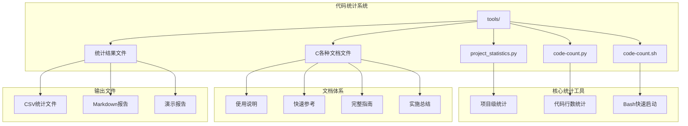
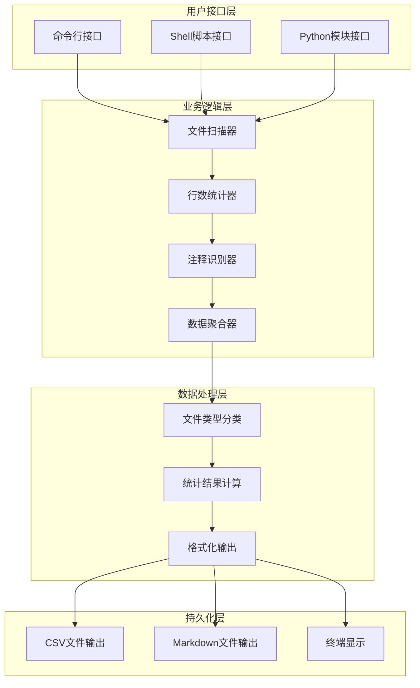
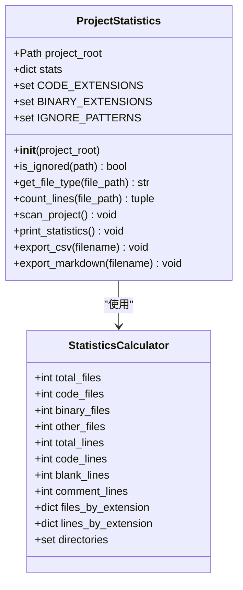
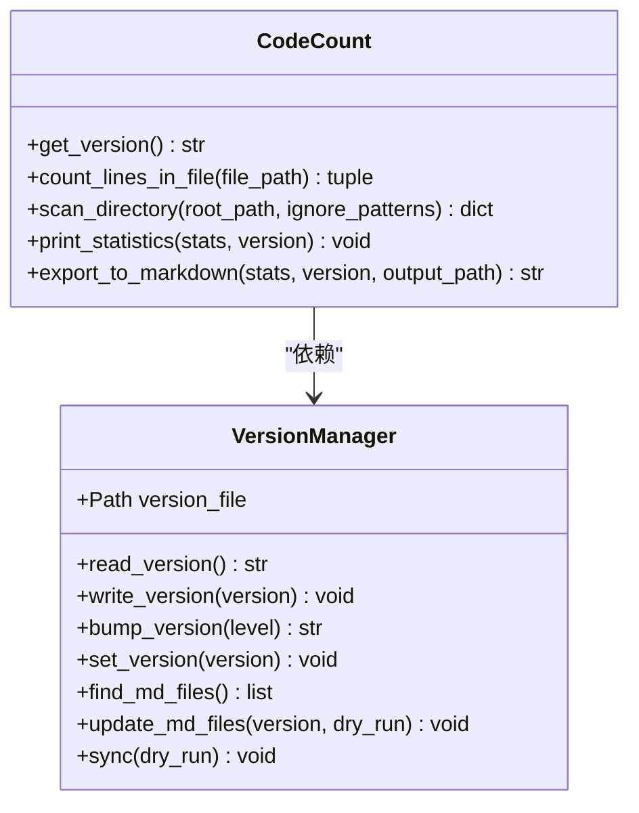
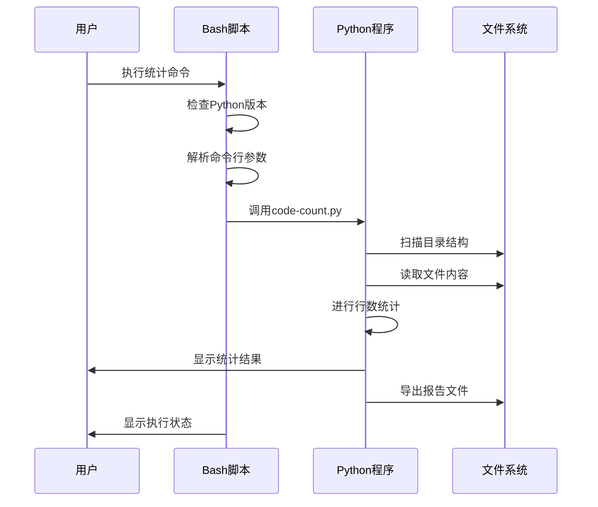
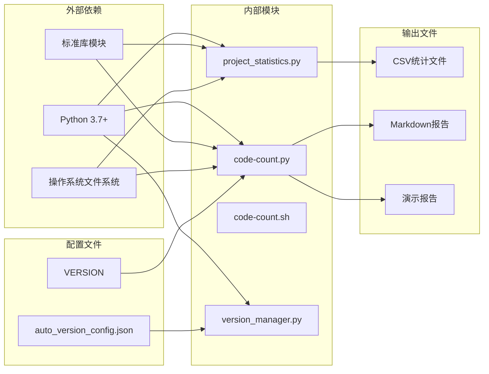
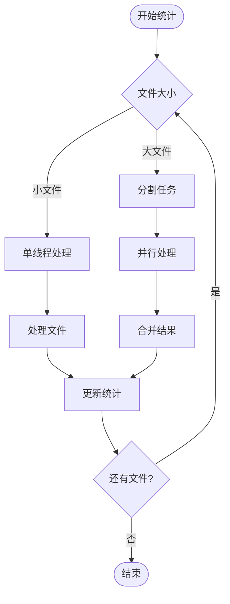

# 代码统计系统

<cite>
**本文档引用的文件**
- [tools/project_statistics.py](file://tools/project_statistics.py)
- [tools/code-count.py](file://tools/code-count.py)
- [tools/code-count.sh](file://tools/code-count.sh)
- [tools/CODE_COUNT_SUMMARY.md](file://tools/CODE_COUNT_SUMMARY.md)
- [tools/PROJECT_STATISTICS_README.md](file://tools/PROJECT_STATISTICS_README.md)
- [tools/CODE_COUNT_README.md](file://tools/CODE_COUNT_README.md)
- [tools/CODE_COUNT_GUIDE.md](file://tools/CODE_COUNT_GUIDE.md)
- [tools/code-count-quickref.md](file://tools/code-count-quickref.md)
- [tools/project_statistics.md](file://tools/project_statistics.md)
- [tools/project_statistics.csv](file://tools/project_statistics.csv)
- [tools/project_full_statistics.csv](file://tools/project_full_statistics.csv)
- [tools/demo_report.md](file://tools/demo_report.md)
- [tools/auto_version_config.json](file://tools/auto_version_config.json)
- [tools/version_manager.py](file://tools/version_manager.py)
- [VERSION](file://VERSION)
</cite>

## 目录
1. [简介](#简介)
2. [项目结构](#项目结构)
3. [核心组件](#核心组件)
4. [架构概览](#架构概览)
5. [详细组件分析](#详细组件分析)
6. [依赖关系分析](#依赖关系分析)
7. [性能考虑](#性能考虑)
8. [故障排除指南](#故障排除指南)
9. [结论](#结论)
10. [附录](#附录)

## 简介

NecoRAG 代码统计系统是一套完整的项目代码行数统计和分析工具集，旨在为 NecoRAG 项目提供精确、可追溯的代码统计能力。该系统包含两个主要的统计工具：`project_statistics.py` 和 `code-count.py`，以及配套的文档和自动化脚本。

该系统的核心目标是：
- 自动统计项目中所有文件的行数和类型分布
- 提供版本化的统计报告，便于历史追踪
- 支持多种输出格式（终端显示、CSV、Markdown）
- 智能识别和分类不同编程语言的注释语法
- 提供完整的项目结构分析和代码质量指标

## 项目结构

代码统计系统位于项目的 `tools/` 目录下，采用模块化设计，包含以下主要组件：



**图表来源**
- [tools/project_statistics.py:1-433](file://tools/project_statistics.py#L1-L433)
- [tools/code-count.py:1-413](file://tools/code-count.py#L1-L413)
- [tools/code-count.sh:1-108](file://tools/code-count.sh#L1-L108)

**章节来源**
- [tools/project_statistics.py:1-433](file://tools/project_statistics.py#L1-L433)
- [tools/code-count.py:1-413](file://tools/code-count.py#L1-L413)
- [tools/code-count.sh:1-108](file://tools/code-count.sh#L1-L108)

## 核心组件

### 项目统计器 (ProjectStatistics)

`project_statistics.py` 提供了完整的项目级统计功能，是一个面向对象的设计，包含以下核心功能：

- **文件类型识别**：支持 20+ 种编程语言和文件格式
- **智能注释识别**：针对不同语言的注释语法进行精确识别
- **多维度统计**：文件数量、行数、目录结构等全方位分析
- **灵活输出**：支持终端显示、CSV导出、Markdown报告

### 代码行数统计器 (CodeCount)

`code-count.py` 专注于代码行数的精确统计，具有以下特点：

- **版本集成**：自动从 VERSION 文件读取项目版本号
- **时间戳记录**：精确到秒的统计时间记录
- **多格式输出**：终端彩色输出 + Markdown 报告导出
- **智能分类**：区分代码行、空行、注释行

### Bash 快速启动器

`code-count.sh` 提供了便捷的命令行接口，包含：
- Python 版本检测和兼容性检查
- 参数解析和错误处理
- 彩色终端输出和用户体验优化

**章节来源**
- [tools/project_statistics.py:16-56](file://tools/project_statistics.py#L16-L56)
- [tools/code-count.py:31-118](file://tools/code-count.py#L31-L118)
- [tools/code-count.sh:20-97](file://tools/code-count.sh#L20-L97)

## 架构概览

代码统计系统采用分层架构设计，确保了良好的可维护性和扩展性：



**图表来源**
- [tools/project_statistics.py:146-196](file://tools/project_statistics.py#L146-L196)
- [tools/code-count.py:121-189](file://tools/code-count.py#L121-L189)

系统的核心处理流程包括：

1. **输入验证**：检查目标路径和权限
2. **文件扫描**：遍历目录树，识别文件类型
3. **智能过滤**：忽略不需要统计的目录和文件
4. **逐文件统计**：读取文件内容，进行行数和注释识别
5. **数据聚合**：汇总统计结果，计算各种比率和指标
6. **格式化输出**：生成多种格式的输出文件

**章节来源**
- [tools/project_statistics.py:146-270](file://tools/project_statistics.py#L146-L270)
- [tools/code-count.py:121-264](file://tools/code-count.py#L121-L264)

## 详细组件分析

### 项目统计器类分析



**图表来源**
- [tools/project_statistics.py:16-56](file://tools/project_statistics.py#L16-L56)
- [tools/project_statistics.py:78-144](file://tools/project_statistics.py#L78-L144)

#### 核心统计功能

项目统计器实现了以下核心统计功能：

**文件类型识别**：
- 代码文件：.py, .js, .ts, .java, .cpp 等 20+ 种语言
- 二进制文件：.png, .jpg, .pdf, .exe 等
- 文档文件：.md, .rst, .txt 等
- 配置文件：.yaml, .json, .xml 等

**智能注释识别**：
- Python：#, """, '''
- JavaScript/TypeScript：//, /* */
- HTML/XML：<!-- -->
- YAML：#
- SQL：--, /* */
- Shell：#

**统计指标计算**：
- 文件数量统计（总数、代码、二进制、其他）
- 行数统计（总行数、代码行、空行、注释行）
- 比例计算（各类型占比）
- 平均值计算（平均每文件行数）

**章节来源**
- [tools/project_statistics.py:19-33](file://tools/project_statistics.py#L19-L33)
- [tools/project_statistics.py:78-144](file://tools/project_statistics.py#L78-L144)
- [tools/project_statistics.py:197-380](file://tools/project_statistics.py#L197-L380)

### 代码行数统计器分析



**图表来源**
- [tools/code-count.py:15-118](file://tools/code-count.py#L15-L118)
- [tools/version_manager.py:27-123](file://tools/version_manager.py#L27-L123)

#### 版本集成机制

代码行数统计器通过 `get_version()` 函数实现了与项目版本管理的深度集成：

**版本号读取**：
- 从项目根目录的 VERSION 文件读取版本号
- 支持语义化版本格式（主版本.次版本.修订版）
- 支持预发布标识（alpha, beta 等）

**时间戳记录**：
- 使用 Python 的 datetime 模块获取精确时间
- 格式化为 YYYY-MM-DD HH:MM:SS
- 用于报告生成和文件命名

**章节来源**
- [tools/code-count.py:15-28](file://tools/code-count.py#L15-L28)
- [tools/code-count.py:367-398](file://tools/code-count.py#L367-L398)

### Bash 快速启动器分析



**图表来源**
- [tools/code-count.sh:20-97](file://tools/code-count.sh#L20-L97)

#### Shell 脚本功能特性

Bash 快速启动器提供了以下功能：

**Python 环境检测**：
- 自动检测 python3 或 python 命令
- 版本兼容性检查（Python 3.7+）
- 错误处理和用户提示

**参数解析**：
- 支持 -p 参数指定目标路径
- 支持 -o 参数导出报告
- 支持 -v 参数显示详细信息
- 支持 -h 参数显示帮助

**用户体验优化**：
- 彩色终端输出
- 进度指示和状态反馈
- 优雅的错误处理

**章节来源**
- [tools/code-count.sh:20-97](file://tools/code-count.sh#L20-L97)

## 依赖关系分析

代码统计系统具有清晰的依赖关系结构：



**图表来源**
- [tools/project_statistics.py:8-13](file://tools/project_statistics.py#L8-L13)
- [tools/code-count.py:8-12](file://tools/code-count.py#L8-L12)
- [tools/version_manager.py:20-24](file://tools/version_manager.py#L20-L24)

### 核心依赖关系

**Python 标准库依赖**：
- os：文件系统操作
- sys：系统接口
- pathlib：路径操作
- typing：类型注解
- argparse：命令行解析
- collections：数据结构
- csv：CSV文件处理
- datetime：时间戳处理

**项目内部依赖**：
- `code-count.py` 依赖 `version_manager.py` 进行版本号管理
- `project_statistics.py` 和 `code-count.py` 都依赖相同的文件扫描逻辑
- Bash 脚本依赖 Python 脚本进行实际统计工作

**配置文件依赖**：
- VERSION 文件提供版本号信息
- auto_version_config.json 提供版本管理配置
- 各种统计配置参数

**章节来源**
- [tools/project_statistics.py:8-13](file://tools/project_statistics.py#L8-L13)
- [tools/code-count.py:8-12](file://tools/code-count.py#L8-L12)
- [tools/version_manager.py:20-24](file://tools/version_manager.py#L20-L24)

## 性能考虑

代码统计系统在设计时充分考虑了性能优化：

### 文件扫描优化

**目录过滤**：
- 预先过滤忽略的目录（__pycache__, .git, node_modules 等）
- 使用列表推导式进行高效过滤
- 避免不必要的文件系统访问

**内存管理**：
- 逐文件处理，避免一次性加载所有文件
- 使用生成器表达式减少内存占用
- 及时释放不再使用的变量

### 统计算法优化

**行数统计优化**：
- 使用 readline() 逐行读取，避免一次性读取大文件
- 缓存文件扩展名判断结果
- 智能注释识别使用字典映射提高查找效率

**数据聚合优化**：
- 使用 defaultdict 自动初始化计数器
- 批量排序操作减少比较次数
- 限制输出结果数量（Top N）

### 并发处理考虑

虽然当前实现是单线程的，但系统设计支持未来的并发扩展：



**图表来源**
- [tools/project_statistics.py:146-196](file://tools/project_statistics.py#L146-L196)

## 故障排除指南

### 常见问题及解决方案

**问题1：找不到 Python 环境**

症状：
```
❌ 错误：找不到 Python
```

解决方案：
1. 检查 Python 是否已安装
2. 使用 `python --version` 或 `python3 --version` 验证
3. 确保 Python 版本 >= 3.7

**问题2：权限不足**

症状：
```
Permission denied: ./code-count.sh
```

解决方案：
```bash
chmod +x tools/code-count.sh
bash tools/code-count.sh
```

**问题3：路径不存在**

症状：
```
❌ 错误：路径不存在 - /some/path
```

解决方案：
```bash
ls -la /some/path
python tools/code-count.py -p /absolute/path/to/project
```

**问题4：VERSION 文件缺失**

症状：
```
版本号显示为 unknown
```

解决方案：
1. 在项目根目录创建 VERSION 文件
2. 文件内容格式：`3.2.0-alpha`
3. 确保文件编码为 UTF-8

### 性能问题诊断

**问题：统计速度慢**

可能原因：
1. 项目包含大量大文件（>10MB）
2. 项目包含大量小文件
3. 磁盘 I/O 性能问题

优化建议：
1. 使用 `-v` 参数查看详细进度
2. 考虑分批统计大型模块
3. 清理不必要的缓存文件

**问题：内存使用过高**

可能原因：
1. 项目文件过多
2. 大文件导致内存峰值

解决方案：
1. 分批处理大型目录
2. 增加系统内存
3. 使用更高效的文件系统

### 统计准确性问题

**问题：注释识别不准确**

可能原因：
1. 多行注释只统计第一行
2. 字符串中的注释标记被误计
3. 特殊格式的注释语法

改进建议：
- 将统计结果作为参考指标
- 结合人工审核进行质量评估
- 定期更新注释识别规则

**章节来源**
- [tools/CODE_COUNT_GUIDE.md:374-424](file://tools/CODE_COUNT_GUIDE.md#L374-L424)
- [tools/CODE_COUNT_README.md:245-260](file://tools/CODE_COUNT_README.md#L245-L260)

## 结论

NecoRAG 代码统计系统是一个设计精良、功能完备的项目统计工具集。系统的主要优势包括：

**技术优势**：
- 面向对象的设计提供了良好的可维护性
- 智能的文件类型识别和注释处理
- 多格式输出支持满足不同使用场景
- 完善的错误处理和用户反馈机制

**实用性优势**：
- 自动版本集成便于历史追踪
- 灵活的参数配置适应各种统计需求
- 丰富的文档体系降低使用门槛
- Bash 脚本提供便捷的命令行接口

**扩展性优势**：
- 清晰的模块化架构支持功能扩展
- 标准化的接口便于集成其他工具
- 可配置的参数便于定制化需求

该系统为 NecoRAG 项目提供了可靠的代码统计基础，支持项目管理和质量控制的各个方面。随着项目的不断发展，该系统还可以进一步扩展以支持更高级的功能，如 Git 历史统计、代码复杂度分析等。

## 附录

### 使用示例

**基本统计命令**：
```bash
# 项目级统计
python tools/project_statistics.py -p src

# 代码行数统计
python tools/code-count.py -p ..

# 导出报告
python tools/code-count.py -p .. -o report.md
```

**批量统计脚本**：
```bash
#!/bin/bash
# 统计核心模块
python tools/code-count.py -p src -o src_stats.md
python tools/code-count.py -p tests -o tests_stats.md
python tools/code-count.py -p docs -o docs_stats.md
```

### 统计结果解读

**关键指标说明**：
- **代码行占比**：代码行数 / 总行数 × 100%
- **注释率**：注释行数 / 代码行数 × 100%
- **空行率**：空行数 / 总行数 × 100%
- **平均每文件行数**：代码行数 / 代码文件数

**质量评估标准**：
- 注释率：建议 8-12%
- 平均文件大小：< 500 行
- 代码密度：> 70%

### 版本管理集成

系统与版本管理的集成体现在多个方面：

**自动版本读取**：
- 从 VERSION 文件获取版本号
- 支持语义化版本格式
- 预发布标识支持

**报告版本化**：
- 统计报告包含版本信息
- 文件名包含版本和时间戳
- 便于历史版本对比

**章节来源**
- [tools/CODE_COUNT_SUMMARY.md:244-290](file://tools/CODE_COUNT_SUMMARY.md#L244-L290)
- [tools/PROJECT_STATISTICS_README.md:184-226](file://tools/PROJECT_STATISTICS_README.md#L184-L226)