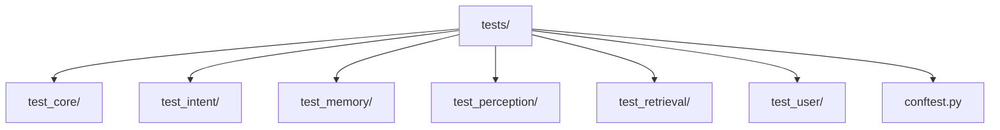
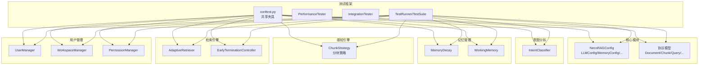
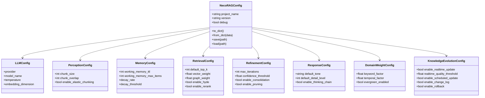
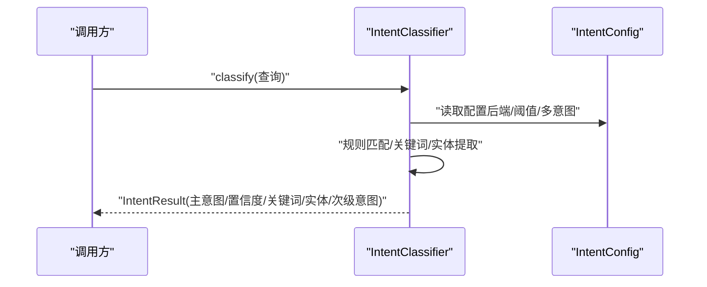
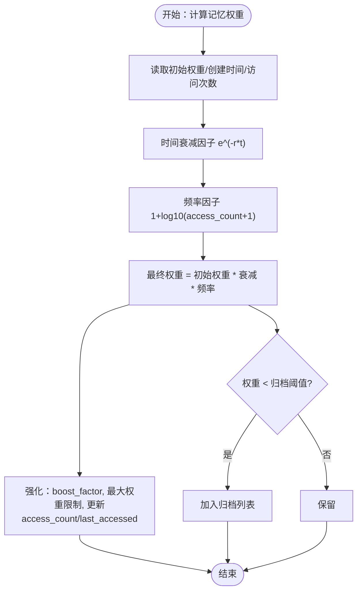
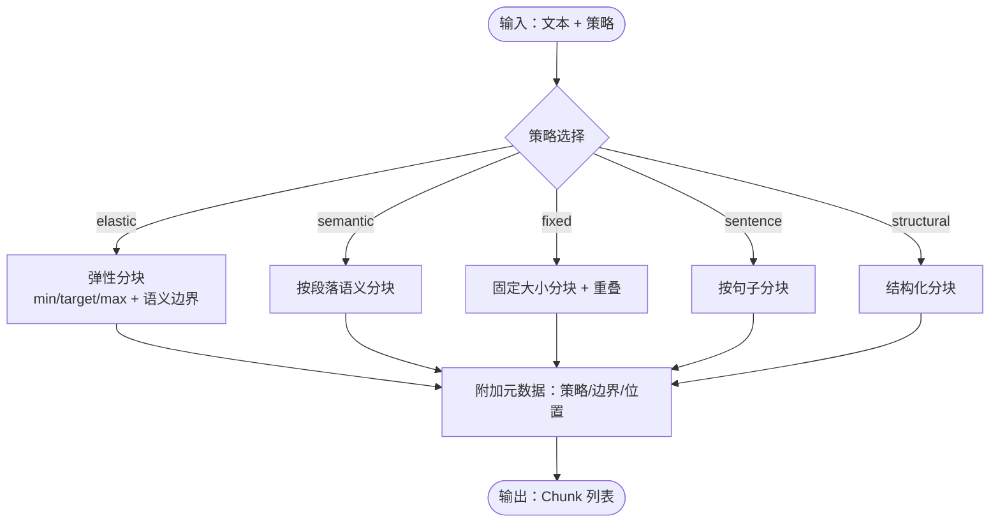
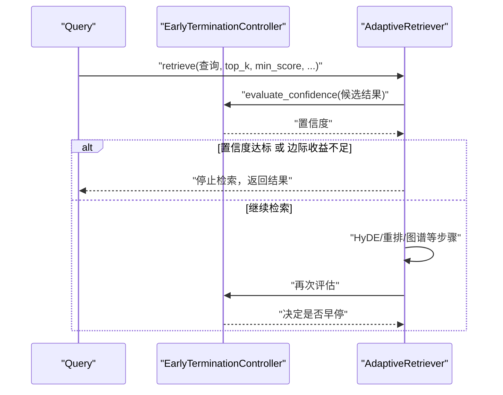
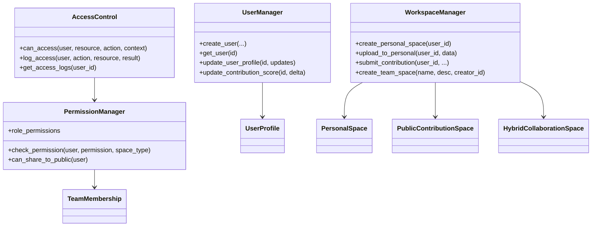
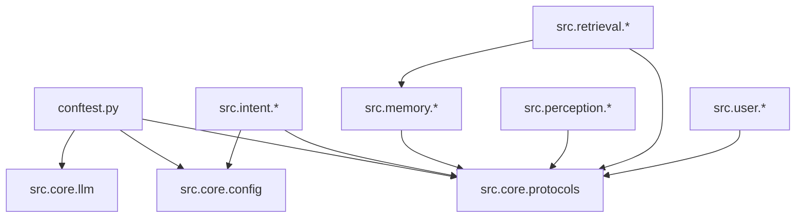

# 单元测试

<cite>
**本文引用的文件**
- [tests/README.md](file://tests/README.md)
- [tests/__init__.py](file://tests/__init__.py)
- [tests/conftest.py](file://tests/conftest.py)
- [tests/test_core/test_config.py](file://tests/test_core/test_config.py)
- [tests/test_core/test_protocols.py](file://tests/test_core/test_protocols.py)
- [tests/test_intent/test_classifier.py](file://tests/test_intent/test_classifier.py)
- [tests/test_memory/test_decay.py](file://tests/test_memory/test_decay.py)
- [tests/test_memory/test_working_memory.py](file://tests/test_memory/test_working_memory.py)
- [tests/test_perception/test_chunker.py](file://tests/test_perception/test_chunker.py)
- [tests/test_retrieval/test_retriever.py](file://tests/test_retrieval/test_retriever.py)
- [tests/test_user/test_multi_user_system.py](file://tests/test_user/test_multi_user_system.py)
</cite>

## 目录
1. [简介](#简介)
2. [项目结构](#项目结构)
3. [核心组件](#核心组件)
4. [架构总览](#架构总览)
5. [详细组件分析](#详细组件分析)
6. [依赖分析](#依赖分析)
7. [性能考量](#性能考量)
8. [故障排除指南](#故障排除指南)
9. [结论](#结论)
10. [附录](#附录)

## 简介
本文件面向 NecoRAG 项目的单元测试体系，系统梳理各模块的测试组织方式与实现细节，覆盖核心模块测试、意图分析测试、记忆管理测试、感知引擎测试、检索引擎测试与用户管理测试。文档重点阐述：
- 测试用例设计原则与断言方法
- 测试数据准备策略与共享夹具（fixtures）
- 可维护的测试代码编写规范与 pytest 最佳实践
- 测试覆盖率统计方法与持续集成建议
- 具体测试示例与模拟对象使用技巧
- 测试环境配置与运行方式

## 项目结构
NecoRAG 的测试套件位于 tests/ 目录，采用“按模块分层”的组织方式：
- tests/test_core：核心配置与协议测试
- tests/test_intent：意图分类器测试
- tests/test_memory：记忆衰减与工作记忆测试
- tests/test_perception：分块策略测试
- tests/test_retrieval：检索器与早停控制器测试
- tests/test_user：多用户系统与权限测试
- tests/conftest.py：共享夹具与测试数据工厂
- tests/README.md：测试框架说明与最佳实践

图表来源
- [tests/README.md:67-79](file://tests/README.md#L67-L79)

章节来源
- [tests/README.md:1-252](file://tests/README.md#L1-L252)
- [tests/__init__.py:1-20](file://tests/__init__.py#L1-L20)

## 核心组件
本节聚焦单元测试的关键组成与职责：
- 测试运行与套件：tests/__init__.py 暴露 TestRunner、TestSuite、TestCase、PerformanceTester、IntegrationTester 等核心能力，便于统一调度与扩展。
- 共享夹具：tests/conftest.py 提供配置、模型、数据与时间等通用夹具，减少重复构造，提升测试可维护性。
- 测试组织：各模块测试文件按“模块名/功能名”命名，使用 pytest 的类与方法组织用例，配合断言与参数化。

章节来源
- [tests/__init__.py:9-20](file://tests/__init__.py#L9-L20)
- [tests/conftest.py:1-330](file://tests/conftest.py#L1-L330)

## 架构总览
下图展示测试框架与被测模块之间的关系，以及测试夹具在不同模块中的复用方式。

图表来源
- [tests/conftest.py:15-43](file://tests/conftest.py#L15-L43)
- [tests/test_core/test_config.py:16-32](file://tests/test_core/test_config.py#L16-L32)
- [tests/test_core/test_protocols.py:13-43](file://tests/test_core/test_protocols.py#L13-L43)
- [tests/test_intent/test_classifier.py:13-15](file://tests/test_intent/test_classifier.py#L13-L15)
- [tests/test_memory/test_decay.py:15-16](file://tests/test_memory/test_decay.py#L15-L16)
- [tests/test_memory/test_working_memory.py:14-15](file://tests/test_memory/test_working_memory.py#L14-L15)
- [tests/test_perception/test_chunker.py:17-21](file://tests/test_perception/test_chunker.py#L17-L21)
- [tests/test_retrieval/test_retriever.py:14-16](file://tests/test_retrieval/test_retriever.py#L14-L16)
- [tests/test_user/test_multi_user_system.py:7-14](file://tests/test_user/test_multi_user_system.py#L7-L14)

## 详细组件分析

### 核心模块测试（配置与协议）
- 配置模块测试要点
  - 默认与自定义配置创建、字段校验与序列化/反序列化
  - 子配置（LLMConfig、PerceptionConfig、MemoryConfig、RetrievalConfig 等）的默认值与枚举值验证
  - ConfigPresets 的开发/生产/最小预设行为
  - load_config 的文件加载与回退行为
- 协议模块测试要点
  - 枚举类型（DocumentType、ChunkType、MemoryLayer、ResponseTone、DetailLevel、IntentType 等）的值正确性
  - 数据模型（Document、Chunk、Query、Memory、Entity、Relation、Response、UserProfile 等）的字段完整性与默认值
  - 嵌入向量、编码分块、检索结果、生成答案、批判结果、幻觉报告等结构的构造与转换

图表来源
- [tests/test_core/test_config.py:35-338](file://tests/test_core/test_config.py#L35-L338)

章节来源
- [tests/test_core/test_config.py:1-397](file://tests/test_core/test_config.py#L1-L397)
- [tests/test_core/test_protocols.py:1-494](file://tests/test_core/test_protocols.py#L1-L494)

### 意图分析测试（IntentClassifier）
- 初始化与后端选择：默认规则后端、自定义配置、后端切换与回退
- 规则分类：中文/英文解释、操作指导、比较分析、推理、摘要、探索、事实查询等意图识别
- 关键词与实体提取：中英混合文本的关键词抽取与实体识别
- 多意图支持：开启/关闭多意图与 top 意图获取
- 批量分类与边缘情况：空查询、空白字符、超长查询、Unicode 混合、异常输入
- 路由策略：检索模式、HyDE 启用、Top-K 等策略合并

图表来源
- [tests/test_intent/test_classifier.py:18-473](file://tests/test_intent/test_classifier.py#L18-L473)

章节来源
- [tests/test_intent/test_classifier.py:1-493](file://tests/test_intent/test_classifier.py#L1-L493)

### 记忆管理测试（MemoryDecay 与 WorkingMemory）
- 记忆衰减
  - 权重计算：时间衰减、访问频率因子、初始权重影响
  - 批量衰减：多条记忆同时更新
  - 归档判断：阈值策略与自定义阈值
  - 强化机制：boost 因子、最大权重限制、访问计数与时间更新
  - 边界情况：极旧记忆、未来创建时间、零初始权重、极高访问次数
- 工作记忆
  - 上下文操作：新增/覆盖/获取/清空、时间戳
  - 意图轨迹：多意图记录与轨迹获取
  - 会话管理：多会话隔离、清空与存在性检查、过期清理
  - 边界情况：空上下文、大型上下文、特殊字符会话 ID、Unicode 内容

图表来源
- [tests/test_memory/test_decay.py:37-544](file://tests/test_memory/test_decay.py#L37-L544)

章节来源
- [tests/test_memory/test_decay.py:1-544](file://tests/test_memory/test_decay.py#L1-L544)
- [tests/test_memory/test_working_memory.py:1-307](file://tests/test_memory/test_working_memory.py#L1-L307)

### 感知引擎测试（ChunkStrategy 分块策略）
- 统一分块入口：支持 elastic、semantic、fixed、sentence、structural 策略
- 弹性分块：最小/目标/最大块大小约束、段落合并、中英混合文本
- 语义/固定/句子/结构化分块：边界检测、重叠、位置信息与元数据
- 边界情况：空文本、空白、超长文本、无段落分隔、仅标点、单字符
- 辅助方法：段落/句子/子句/词边界检测、边界类型判定
- 参数影响：min/target/max 对块数量与大小的影响

图表来源
- [tests/test_perception/test_chunker.py:76-532](file://tests/test_perception/test_chunker.py#L76-L532)

章节来源
- [tests/test_perception/test_chunker.py:1-532](file://tests/test_perception/test_chunker.py#L1-L532)

### 检索引擎测试（AdaptiveRetriever 与 EarlyTerminationController）
- 早停控制器
  - 置信度评估：基于 top-1 分数与分数差距
  - 早停判断：阈值与边际收益递减
  - 自适应阈值：短查询降低阈值、长查询保持不变
- 检索器
  - 初始化：HyDE、重排器、早停控制器、自定义阈值
  - 基本检索：top_k、最低分数过滤、查询向量
  - 检索追踪：记录检索路径
  - 查询分析：类型、复杂度、实体、意图
  - HyDE 增强与回退、多跳检索与追踪
  - 边界情况：空查询、超长查询、Unicode、top_k=0、负最低分数

图表来源
- [tests/test_retrieval/test_retriever.py:19-410](file://tests/test_retrieval/test_retriever.py#L19-L410)

章节来源
- [tests/test_retrieval/test_retriever.py:1-410](file://tests/test_retrieval/test_retriever.py#L1-L410)

### 用户管理测试（多用户系统）
- 用户模型：UserProfile、UserPreference、UserRole、KnowledgeContribution、TeamMembership、TeamRole、PermissionType、SpaceType 等
- 空间模型：PersonalSpace、PublicContributionSpace、HybridCollaborationSpace
- 用户管理器：异步创建、获取、更新资料、贡献积分与角色升级
- 工作空间管理器：个人空间创建、文档上传、知识贡献提交、团队空间创建与成员管理
- 权限管理器：角色权限映射、权限检查、分享到公共空间策略
- 访问控制：资源访问决策与访问日志记录

图表来源
- [tests/test_user/test_multi_user_system.py:17-420](file://tests/test_user/test_multi_user_system.py#L17-L420)

章节来源
- [tests/test_user/test_multi_user_system.py:1-420](file://tests/test_user/test_multi_user_system.py#L1-L420)

## 依赖分析
- 测试夹具依赖
  - tests/conftest.py 导入 src.core.config、src.core.protocols、src.core.llm 等模块，提供默认/自定义配置与样本数据夹具，贯穿核心模块、协议、意图、记忆、感知、检索、用户等测试。
- 模块间耦合
  - 意图分类依赖配置与模型枚举；记忆模块依赖协议模型；感知模块依赖协议与分块策略；检索模块依赖记忆管理与协议；用户模块依赖权限与空间模型。
- 外部依赖
  - pytest、numpy（检索测试）、asyncio（用户管理测试）

图表来源
- [tests/conftest.py:15-43](file://tests/conftest.py#L15-L43)
- [tests/test_intent/test_classifier.py:13-15](file://tests/test_intent/test_classifier.py#L13-L15)
- [tests/test_memory/test_decay.py:15-16](file://tests/test_memory/test_decay.py#L15-L16)
- [tests/test_perception/test_chunker.py:17-21](file://tests/test_perception/test_chunker.py#L17-L21)
- [tests/test_retrieval/test_retriever.py:14-16](file://tests/test_retrieval/test_retriever.py#L14-L16)
- [tests/test_user/test_multi_user_system.py:7-14](file://tests/test_user/test_multi_user_system.py#L7-L14)

章节来源
- [tests/conftest.py:1-330](file://tests/conftest.py#L1-L330)

## 性能考量
- 基准与并发测试
  - tests/README.md 提供 PerformanceTester 的使用示例，支持单操作基准、并发用户基准与压力测试。
- 测试性能关注点
  - 控制测试规模与数据量，避免 IO 与外部服务依赖
  - 使用夹具复用配置与数据，减少重复初始化成本
  - 对耗时操作（如检索、分块）采用参数化与小样本验证
- 持续集成
  - tests/README.md 提供 GitHub Actions 示例，可在 CI 中运行测试套件

章节来源
- [tests/README.md:97-157](file://tests/README.md#L97-L157)
- [tests/README.md:210-222](file://tests/README.md#L210-L222)

## 故障排除指南
- 常见问题
  - 测试超时：增大超时设置或优化被测代码
  - 内存不足：降低并发用户数或分批执行大型测试
  - 测试不稳定：检查测试数据依赖，确保环境一致性
- 分块策略不可用
  - tests/test_perception/test_chunker.py 中对 ChunkStrategy 的导入/实例化做了保护，若不可用会跳过测试；需先修复源码兼容性问题
- 配置序列化问题
  - tests/test_core/test_config.py 中对配置序列化/反序列化的异常做了跳过处理，提示已知问题

章节来源
- [tests/README.md:224-239](file://tests/README.md#L224-L239)
- [tests/test_perception/test_chunker.py:16-27](file://tests/test_perception/test_chunker.py#L16-L27)
- [tests/test_core/test_config.py:114-121](file://tests/test_core/test_config.py#L114-L121)

## 结论
NecoRAG 的单元测试体系以 pytest 为核心，结合共享夹具与模块化组织，覆盖核心配置、协议模型、意图分析、记忆管理、感知引擎、检索引擎与用户管理等关键模块。通过规范的断言方法、严谨的测试数据准备与边界情况覆盖，测试具备良好的可维护性与可扩展性。建议在持续集成中引入覆盖率统计，并逐步完善跨模块集成测试与性能测试，以进一步提升质量保障水平。

## 附录
- 测试运行
  - 运行所有测试：tests/demo_test_runner.py 或 pytest tests/test_core/ -v
  - 运行特定模块：pytest tests/test_intent/ -v
- 测试覆盖率
  - 建议使用 pytest-cov 在 CI 中统计覆盖率，结合阈值与报告输出
- 最佳实践清单
  - 使用描述性测试命名与分组
  - 优先使用夹具与参数化，减少重复代码
  - 明确断言目的，必要时提供断言消息
  - 保持测试数据隔离，避免跨用例依赖
  - 对外部依赖进行模拟或使用最小化配置