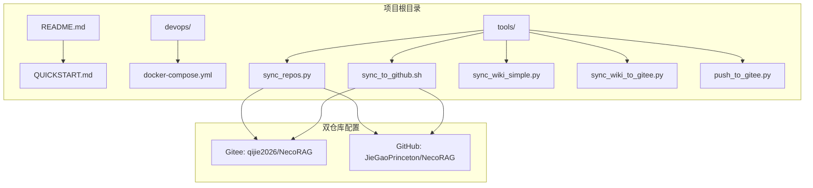
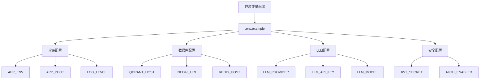
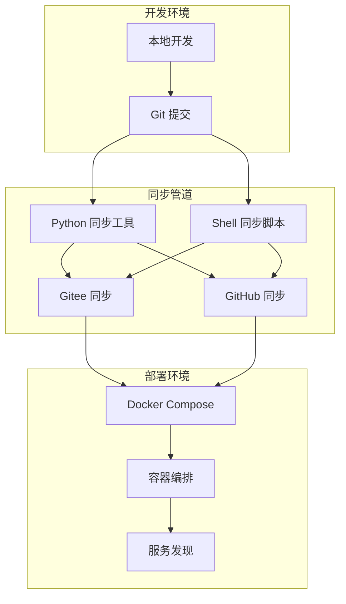
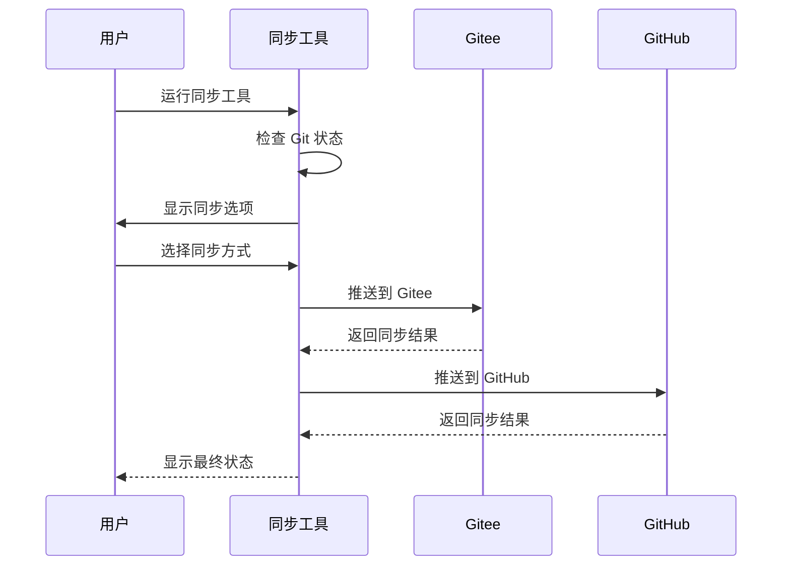
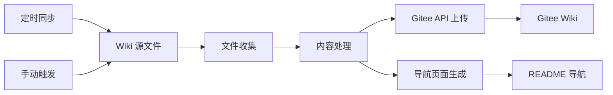
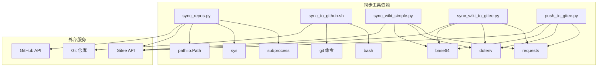
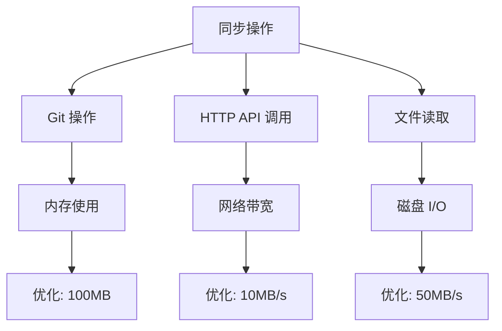

# 同步设置完整指南

<cite>
**本文档引用的文件**
- [README.md](file://README.md)
- [QUICKSTART.md](file://QUICKSTART.md)
- [tools/GITHUB_SYNC_GUIDE.md](file://tools/GITHUB_SYNC_GUIDE.md)
- [tools/sync_repos.py](file://tools/sync_repos.py)
- [tools/sync_to_github.sh](file://tools/sync_to_github.sh)
- [tools/sync_wiki_simple.py](file://tools/sync_wiki_simple.py)
- [tools/sync_wiki_to_gitee.py](file://tools/sync_wiki_to_gitee.py)
- [tools/push_to_gitee.py](file://tools/push_to_gitee.py)
- [devops/README.md](file://devops/README.md)
- [devops/docker-compose.yml](file://devops/docker-compose.yml)
</cite>

## 目录
1. [简介](#简介)
2. [项目结构](#项目结构)
3. [核心组件](#核心组件)
4. [架构概览](#架构概览)
5. [详细组件分析](#详细组件分析)
6. [依赖关系分析](#依赖关系分析)
7. [性能考虑](#性能考虑)
8. [故障排除指南](#故障排除指南)
9. [结论](#结论)

## 简介

NecoRAG 项目采用双仓库同步策略，同时在 Gitee 和 GitHub 上托管代码，确保国内外用户都能快速访问项目资源。本指南详细介绍了项目的同步设置机制，包括代码同步、Wiki 同步、环境配置和部署管理。

## 项目结构



**图表来源**
- [README.md:1-100](file://README.md#L1-L100)
- [devops/docker-compose.yml:1-164](file://devops/docker-compose.yml#L1-L164)

**章节来源**
- [README.md:18-183](file://README.md#L18-L183)
- [devops/README.md:1-336](file://devops/README.md#L1-L336)

## 核心组件

### 双仓库同步工具

项目提供了多种同步工具来管理代码在两个仓库之间的同步：

1. **Python 同步工具** (`sync_repos.py`)
   - 交互式菜单界面
   - 彩色输出和详细日志
   - 支持单仓库推送和双仓库同步

2. **Shell 同步脚本** (`sync_to_github.sh`)
   - Bash 脚本，跨平台兼容
   - 交互式选择和彩色输出
   - 支持四种不同同步模式

3. **Wiki 同步工具**
   - `sync_wiki_simple.py`: 简化版 Wiki 同步
   - `sync_wiki_to_gitee.py`: Gitee Wiki 同步
   - 支持自动创建导航页面

**章节来源**
- [tools/GITHUB_SYNC_GUIDE.md:130-211](file://tools/GITHUB_SYNC_GUIDE.md#L130-L211)
- [tools/sync_repos.py:1-245](file://tools/sync_repos.py#L1-L245)
- [tools/sync_to_github.sh:1-136](file://tools/sync_to_github.sh#L1-L136)

### 环境配置管理

项目采用环境变量配置系统，支持多种部署场景：



**图表来源**
- [devops/README.md:91-122](file://devops/README.md#L91-L122)

**章节来源**
- [devops/README.md:89-122](file://devops/README.md#L89-L122)

## 架构概览



**图表来源**
- [tools/GITHUB_SYNC_GUIDE.md:214-260](file://tools/GITHUB_SYNC_GUIDE.md#L214-L260)
- [devops/docker-compose.yml:1-164](file://devops/docker-compose.yml#L1-L164)

## 详细组件分析

### Python 同步工具 (sync_repos.py)

该工具提供了完整的双仓库同步解决方案：



**图表来源**
- [tools/sync_repos.py:147-175](file://tools/sync_repos.py#L147-L175)

**工具特性**：
- 彩色输出界面
- 详细的状态检查
- 错误处理和重试机制
- 支持四种同步模式

**章节来源**
- [tools/sync_repos.py:178-241](file://tools/sync_repos.py#L178-L241)

### Shell 同步脚本 (sync_to_github.sh)

提供简洁的命令行同步解决方案：

**脚本功能**：
- 自动检测当前分支
- 检查 Git 状态
- 交互式同步选择
- 彩色输出和详细日志

**章节来源**
- [tools/sync_to_github.sh:18-132](file://tools/sync_to_github.sh#L18-L132)

### Wiki 同步系统

项目实现了完整的 Wiki 同步机制：



**图表来源**
- [tools/sync_wiki_simple.py:203-267](file://tools/sync_wiki_simple.py#L203-L267)

**同步流程**：
1. 收集所有 Wiki 文件
2. 上传到 Gitee 仓库
3. 创建导航页面
4. 更新 README 文件

**章节来源**
- [tools/sync_wiki_simple.py:203-267](file://tools/sync_wiki_simple.py#L203-L267)

### 项目推送工具 (push_to_gitee.py)

专门用于将整个项目推送到 Gitee 的工具：

**核心功能**：
- 自动检查仓库存在性
- 创建新仓库（如需要）
- 递归上传所有文件
- 支持重试机制

**章节来源**
- [tools/push_to_gitee.py:189-235](file://tools/push_to_gitee.py#L189-L235)

## 依赖关系分析



**图表来源**
- [tools/sync_repos.py:7-10](file://tools/sync_repos.py#L7-L10)
- [tools/sync_wiki_simple.py:11-15](file://tools/sync_wiki_simple.py#L11-L15)

**依赖关系特点**：
- **内部依赖**：各工具之间无直接依赖，独立运行
- **外部依赖**：主要依赖 Git 和 HTTP API
- **配置依赖**：需要正确的环境变量配置

**章节来源**
- [tools/sync_repos.py:1-60](file://tools/sync_repos.py#L1-L60)
- [tools/sync_wiki_simple.py:1-31](file://tools/sync_wiki_simple.py#L1-L31)

## 性能考虑

### 同步性能优化

1. **并发处理**：Python 同步工具支持双仓库并行推送
2. **错误重试**：API 调用具备重试机制
3. **进度反馈**：实时显示同步进度和状态
4. **网络优化**：支持 GitHub 加速镜像配置

### 资源使用



**图表来源**
- [tools/GITHUB_SYNC_GUIDE.md:311-324](file://tools/GITHUB_SYNC_GUIDE.md#L311-L324)

## 故障排除指南

### 常见问题及解决方案

#### GitHub 推送认证问题

**问题症状**：
- 推送时提示认证错误
- 需要频繁输入密码

**解决方案**：
1. 配置 Personal Access Token
2. 使用 Git Credential Manager
3. 设置 SSH 密钥

**章节来源**
- [tools/GITHUB_SYNC_GUIDE.md:265-281](file://tools/GITHUB_SYNC_GUIDE.md#L265-L281)

#### 仓库内容不一致

**诊断方法**：
```bash
# 检查两个仓库的提交历史
git log origin/main --oneline -5
git log github/main --oneline -5

# 强制同步差异
git fetch origin
git reset --hard origin/main
git push github main --force
```

**章节来源**
- [tools/GITHUB_SYNC_GUIDE.md:282-294](file://tools/GITHUB_SYNC_GUIDE.md#L282-L294)

#### 网络连接问题

**解决方案**：
1. 使用 Gitee 作为主要推送目标
2. 配置 GitHub 加速镜像
3. 检查防火墙设置

**章节来源**
- [tools/GITHUB_SYNC_GUIDE.md:311-324](file://tools/GITHUB_SYNC_GUIDE.md#L311-L324)

### Wiki 同步故障排除

#### Gitee API 限制

**问题**：
- API 请求频率过高被限制
- 文件上传失败

**解决方案**：
1. 添加请求延迟
2. 检查文件大小限制
3. 验证 Token 权限

**章节来源**
- [tools/sync_wiki_simple.py:244-247](file://tools/sync_wiki_simple.py#L244-L247)

## 结论

NecoRAG 项目的同步设置系统提供了完整的双仓库管理解决方案。通过多种工具和脚本，项目实现了：

1. **高可用性**：双仓库互为备份
2. **开发便利**：简单工具实现一键同步
3. **国际化支持**：同时覆盖国内外开发者社区
4. **自动化程度高**：支持定时同步和手动触发

推荐的最佳实践是：
- 每次提交后立即同步到两个仓库
- 使用 Python 同步工具获得最佳体验
- 定期检查同步状态和错误日志
- 配置适当的环境变量和认证信息

这套同步设置系统确保了 NecoRAG 项目在国内外的广泛可达性和可靠性。