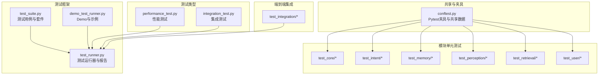
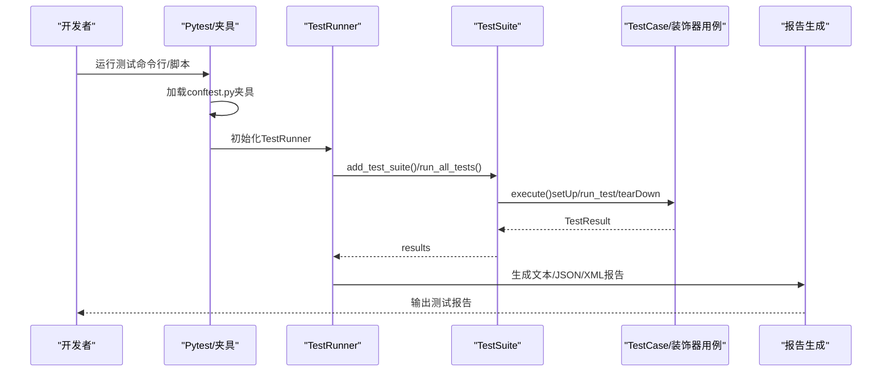
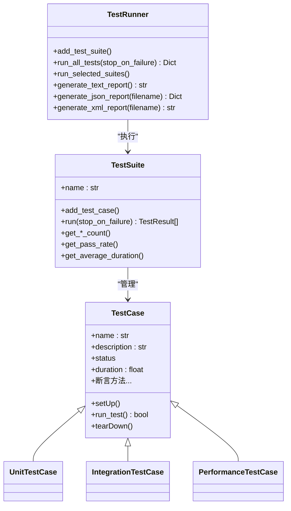
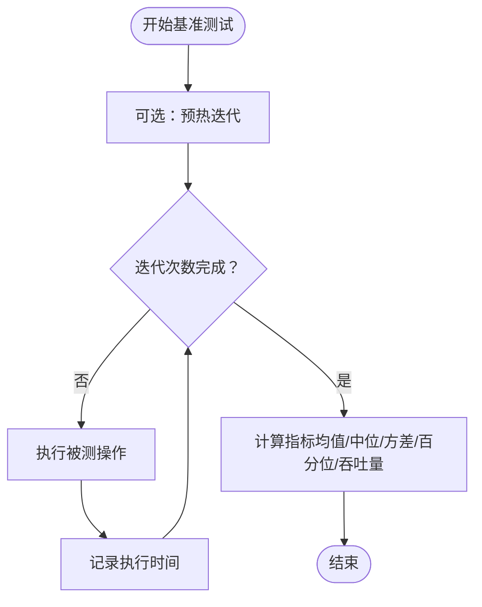
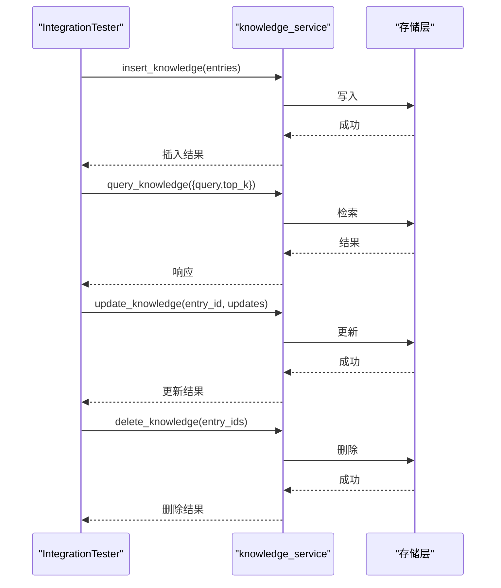
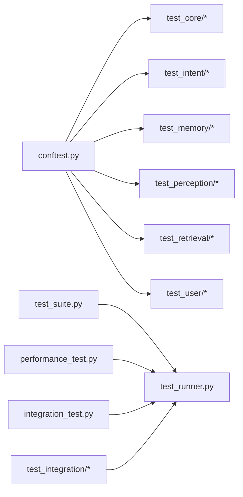

# 开发与测试

<cite>
**本文引用的文件**
- [tests/README.md](file://tests/README.md)
- [tests/conftest.py](file://tests/conftest.py)
- [tests/test_runner.py](file://tests/test_runner.py)
- [tests/demo_test_runner.py](file://tests/demo_test_runner.py)
- [tests/integration_test.py](file://tests/integration_test.py)
- [tests/performance_test.py](file://tests/performance_test.py)
- [tests/test_suite.py](file://tests/test_suite.py)
- [tests/test_core/test_config.py](file://tests/test_core/test_config.py)
- [tests/test_core/test_protocols.py](file://tests/test_core/test_protocols.py)
- [tests/test_integration/test_necorag.py](file://tests/test_integration/test_necorag.py)
- [tests/test_intent/test_classifier.py](file://tests/test_intent/test_classifier.py)
- [tests/test_memory/test_decay.py](file://tests/test_memory/test_decay.py)
- [tests/test_memory/test_working_memory.py](file://tests/test_memory/test_working_memory.py)
- [tests/test_perception/test_chunker.py](file://tests/test_perception/test_chunker.py)
- [tests/test_retrieval/test_retriever.py](file://tests/test_retrieval/test_retriever.py)
- [tests/test_user/test_multi_user_system.py](file://tests/test_user/test_multi_user_system.py)
</cite>

## 目录
1. [简介](#简介)
2. [项目结构](#项目结构)
3. [核心组件](#核心组件)
4. [架构总览](#架构总览)
5. [详细组件分析](#详细组件分析)
6. [依赖分析](#依赖分析)
7. [性能考量](#性能考量)
8. [故障排除指南](#故障排除指南)
9. [结论](#结论)
10. [附录](#附录)

## 简介
本文件面向开发与测试工程师，系统化阐述 NecoRAG 项目的测试体系：单元测试、集成测试、性能测试与系统测试的组织结构、执行流程与评估标准；详解测试工具使用方法、测试覆盖率统计与持续集成配置；说明测试数据准备策略、模拟对象使用技巧与测试环境搭建；并提供最佳实践、调试技巧与性能优化建议，帮助团队建立完善的质量保证体系。

## 项目结构
测试相关代码主要位于 tests 目录，采用“按功能模块分层”的组织方式：
- 测试框架与运行器：tests/test_suite.py、tests/test_runner.py、tests/demo_test_runner.py
- 测试类型与报告：tests/performance_test.py、tests/integration_test.py
- 测试夹具与共享数据：tests/conftest.py
- 模块级单元测试：tests/test_core、tests/test_intent、tests/test_memory、tests/test_perception、tests/test_retrieval、tests/test_user
- 端到端集成测试：tests/test_integration

图表来源
- [tests/test_suite.py:1-287](file://tests/test_suite.py#L1-L287)
- [tests/test_runner.py:1-327](file://tests/test_runner.py#L1-L327)
- [tests/demo_test_runner.py:1-292](file://tests/demo_test_runner.py#L1-L292)
- [tests/performance_test.py:1-322](file://tests/performance_test.py#L1-L322)
- [tests/integration_test.py:1-377](file://tests/integration_test.py#L1-L377)
- [tests/conftest.py:1-330](file://tests/conftest.py#L1-L330)

章节来源
- [tests/README.md:65-79](file://tests/README.md#L65-L79)

## 核心组件
- 测试用例与套件：提供统一的 TestCase 基类、TestSuite 管理、断言方法与装饰器，支持单元、集成、性能三类测试。
- 测试运行器：集中执行测试套件、收集结果、生成文本/JSON/JUnit XML 报告，并支持按套件选择与失败中断。
- 性能测试器：提供单操作基准、并发基准、压力测试、内存使用测试与指标统计。
- 集成测试器：封装知识服务调用、数据生命周期（插入/查询/更新/删除）、并发访问测试与查询流水线验证。
- Pytest 夹具：提供配置、协议数据、Mock LLM 客户端与文本样本等共享资源，减少重复构造。

章节来源
- [tests/test_suite.py:1-287](file://tests/test_suite.py#L1-L287)
- [tests/test_runner.py:1-327](file://tests/test_runner.py#L1-L327)
- [tests/performance_test.py:1-322](file://tests/performance_test.py#L1-L322)
- [tests/integration_test.py:1-377](file://tests/integration_test.py#L1-L377)
- [tests/conftest.py:1-330](file://tests/conftest.py#L1-L330)

## 架构总览
测试架构围绕“测试框架—运行器—报告”主线，结合“夹具—模块测试—集成测试—性能测试”的层次化组织，形成从单元到系统的完整测试闭环。

图表来源
- [tests/test_runner.py:36-66](file://tests/test_runner.py#L36-L66)
- [tests/test_suite.py:100-143](file://tests/test_suite.py#L100-L143)
- [tests/conftest.py:12-14](file://tests/conftest.py#L12-L14)

## 详细组件分析

### 测试框架与运行器
- 统一测试基类：提供断言方法（assertEqual/assertTrue/assertIn 等）、执行流程（setUp/run_test/tearDown）、状态机与结果封装。
- 测试套件：支持批量添加用例、按状态统计、通过率与平均耗时计算。
- 测试运行器：集中执行、失败中断、报告生成（文本/JSON/JUnit XML），并支持按套件选择运行。
- Demo 程序：演示单元/性能/集成/系统集成测试的组合执行与结果汇总。

图表来源
- [tests/test_suite.py:35-287](file://tests/test_suite.py#L35-L287)
- [tests/test_runner.py:16-327](file://tests/test_runner.py#L16-L327)

章节来源
- [tests/test_suite.py:1-287](file://tests/test_suite.py#L1-L287)
- [tests/test_runner.py:1-327](file://tests/test_runner.py#L1-L327)
- [tests/demo_test_runner.py:1-292](file://tests/demo_test_runner.py#L1-L292)

### 性能测试模块
- 单操作基准：支持预热、迭代次数、失败容忍与指标统计（最小/最大/平均/中位/标准差/百分位/吞吐量/总执行时间）。
- 并发基准：多线程并发执行，统计总时间与吞吐量。
- 压力测试：持续运行至超时或失败率阈值，输出成功/失败次数、失败率与性能指标。
- 内存使用测试：可选依赖 psutil，统计初始/峰值/平均/最终内存变化。
- 性能断言：在用例中对平均时延、吞吐量、百分位等设定阈值。

图表来源
- [tests/performance_test.py:37-82](file://tests/performance_test.py#L37-L82)

章节来源
- [tests/performance_test.py:1-322](file://tests/performance_test.py#L1-L322)

### 集成测试模块
- 完整查询流水线：调用知识服务，校验响应结构、结果数量与执行时间上限。
- 数据生命周期：插入→查询→更新→删除，逐阶段断言成功与耗时。
- 并发访问：多线程随机查询，统计请求总数、成功数、失败数与响应时间分布。
- 响应验证：对必需字段、最小结果数、最大执行时间与期望内容进行断言。

图表来源
- [tests/integration_test.py:88-184](file://tests/integration_test.py#L88-L184)

章节来源
- [tests/integration_test.py:1-377](file://tests/integration_test.py#L1-L377)

### 模块单元测试（示例）
- 核心配置与协议：覆盖配置类创建、序列化/反序列化、枚举与数据模型字段验证。
- 意图分类：规则/多意图/关键词/实体提取/后端切换/批量分类。
- 记忆衰减：权重计算、批量衰减、归档判断、强化与边界情况。
- 工作记忆：上下文存储/检索、会话管理、意图轨迹、多会话隔离。
- 分块策略：弹性/语义/固定/句子/结构化分块，边界与元数据。
- 检索器：早停控制器、自适应检索、HyDE 增强、多跳检索与查询分析。
- 多用户系统：用户模型、权限、空间与工作区、访问控制与日志。

章节来源
- [tests/test_core/test_config.py:1-397](file://tests/test_core/test_config.py#L1-L397)
- [tests/test_core/test_protocols.py:1-494](file://tests/test_core/test_protocols.py#L1-L494)
- [tests/test_intent/test_classifier.py:1-493](file://tests/test_intent/test_classifier.py#L1-L493)
- [tests/test_memory/test_decay.py:1-544](file://tests/test_memory/test_decay.py#L1-L544)
- [tests/test_memory/test_working_memory.py:1-307](file://tests/test_memory/test_working_memory.py#L1-L307)
- [tests/test_perception/test_chunker.py:1-532](file://tests/test_perception/test_chunker.py#L1-L532)
- [tests/test_retrieval/test_retriever.py:1-410](file://tests/test_retrieval/test_retriever.py#L1-L410)
- [tests/test_user/test_multi_user_system.py:1-420](file://tests/test_user/test_multi_user_system.py#L1-L420)

## 依赖分析
- 测试运行器依赖测试套件与结果数据结构，负责聚合与报告生成。
- 性能/集成测试器依赖框架提供的断言与日志能力。
- 模块测试依赖 Pytest 夹具提供的共享配置、协议与 Mock 资源。
- 端到端测试依赖 src 接口模块（如 knowledge_service）与核心组件初始化。

图表来源
- [tests/conftest.py:15-43](file://tests/conftest.py#L15-L43)
- [tests/test_suite.py:1-287](file://tests/test_suite.py#L1-L287)
- [tests/test_runner.py:1-327](file://tests/test_runner.py#L1-L327)
- [tests/performance_test.py:1-322](file://tests/performance_test.py#L1-L322)
- [tests/integration_test.py:1-377](file://tests/integration_test.py#L1-L377)

章节来源
- [tests/conftest.py:1-330](file://tests/conftest.py#L1-L330)

## 性能考量
- 基准测试：合理设置迭代次数与预热轮次，避免冷启动影响；关注吞吐量与百分位延迟。
- 并发测试：控制并发用户数与持续时间，观察资源瓶颈（CPU/内存/网络）。
- 压力测试：设定失败率阈值，及时发现系统脆弱点；记录关键指标与错误堆栈。
- 报告与回归：定期对比历史报告，建立性能基线与回归阈值，纳入 CI。

## 故障排除指南
- 测试超时：增大超时设置或优化被测代码；拆分大测试为小用例。
- 内存不足：降低并发、分批执行、释放中间资源；使用内存测试定位泄漏。
- 测试不稳定：消除跨用例状态耦合；确保夹具隔离与数据清理。
- 报告缺失：确认报告生成路径与权限；检查异常捕获与日志级别。

章节来源
- [tests/README.md:224-239](file://tests/README.md#L224-L239)

## 结论
本测试体系以统一框架为基础，覆盖单元、集成、性能与系统测试，配合夹具与报告工具，形成可维护、可观测的质量保障闭环。建议在 CI 中引入覆盖率统计与性能回归基线，持续完善测试矩阵与自动化流程。

## 附录

### 测试工具与使用方法
- 运行全部测试：使用命令行或 Demo 程序。
- 选择性运行：通过 TestRunner 的按套件选择或 pytest 选择器。
- 报告导出：文本/JSON/JUnit XML 三种格式，便于与 CI/CD 集成。

章节来源
- [tests/README.md:27-38](file://tests/README.md#L27-L38)
- [tests/test_runner.py:97-234](file://tests/test_runner.py#L97-L234)
- [tests/demo_test_runner.py:1-292](file://tests/demo_test_runner.py#L1-L292)

### 测试数据准备与模拟对象
- 夹具提供默认/开发/最小配置、LLM 客户端、协议数据与文本样本，减少手工构造。
- 使用 MockLLMClient 与 MockProvider 降低外部依赖风险。
- 通过 pytest.mark.skipif 处理模块不可用场景，保证测试可运行性。

章节来源
- [tests/conftest.py:46-330](file://tests/conftest.py#L46-L330)

### 测试环境搭建
- 安装依赖后，确保 src 目录在 Python 路径中；必要时在测试脚本中追加路径。
- 在 CI 中预装性能测试所需的 psutil（可选）。

章节来源
- [tests/demo_test_runner.py:11-23](file://tests/demo_test_runner.py#L11-L23)
- [tests/performance_test.py:194-229](file://tests/performance_test.py#L194-L229)

### 持续集成配置
- 使用 GitHub Actions 触发测试；推荐在作业中缓存依赖、并行执行不同套件。
- 将测试报告与覆盖率上传至 CI 平台，建立质量门禁。

章节来源
- [tests/README.md:208-223](file://tests/README.md#L208-L223)