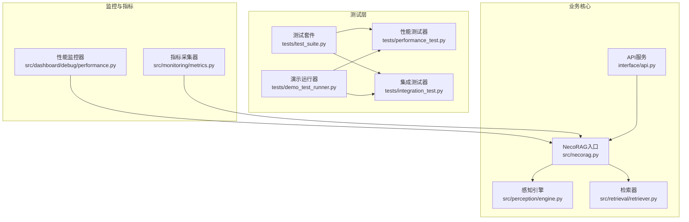
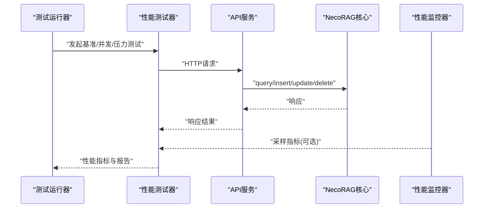
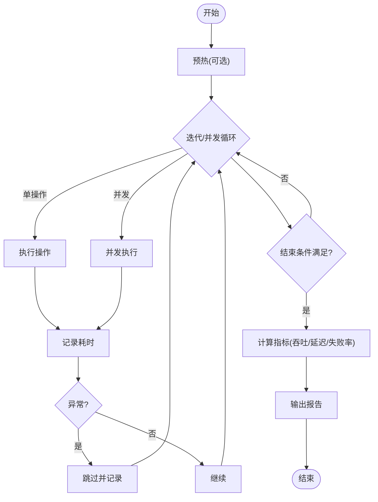
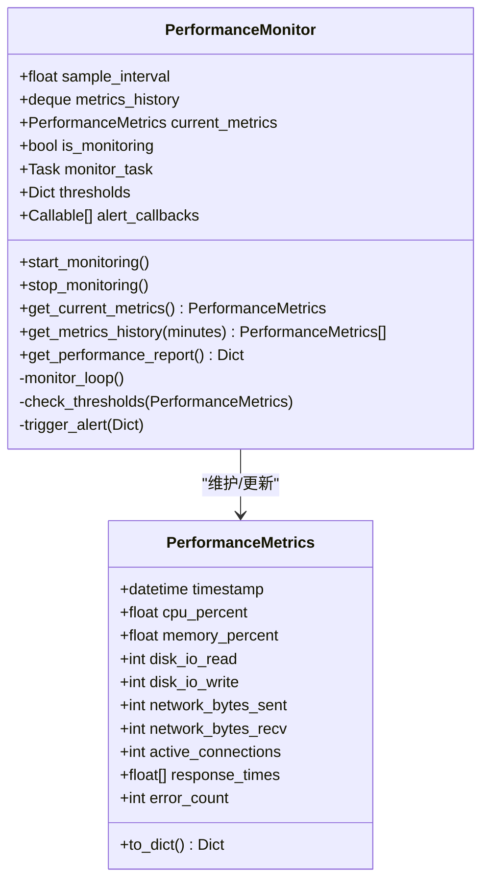
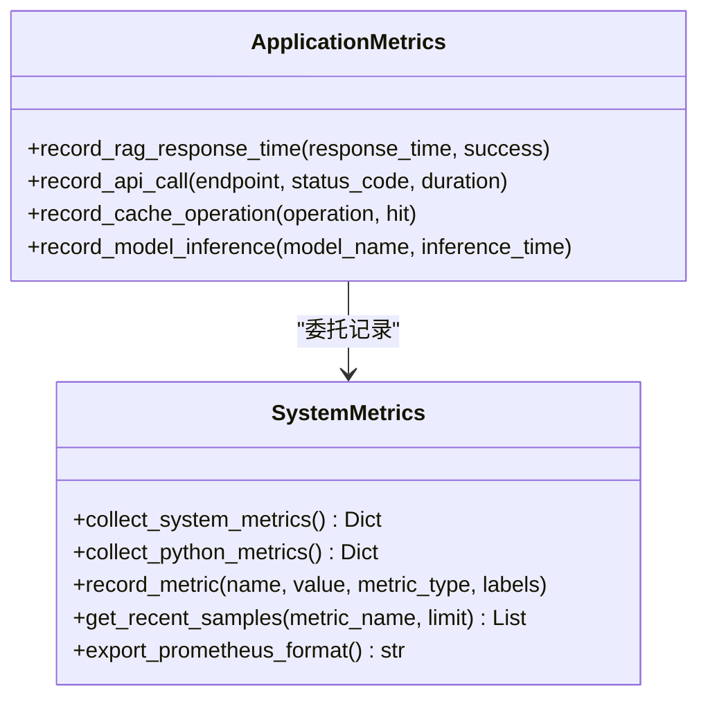
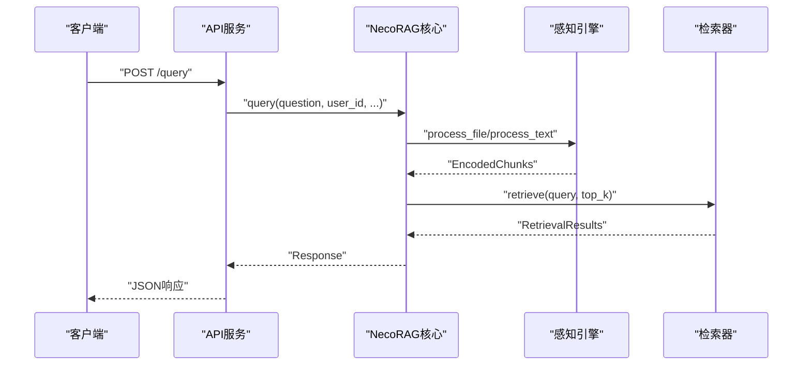
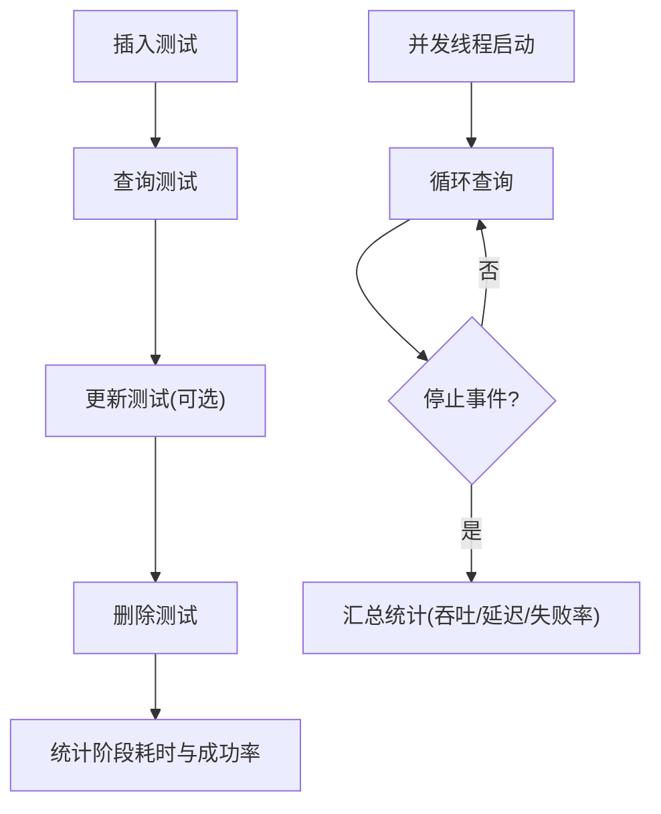
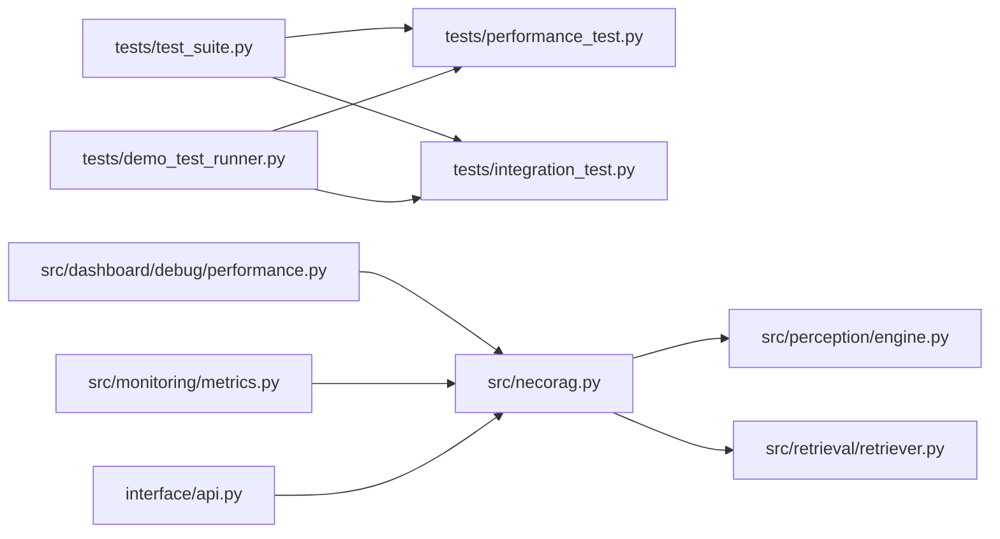

# 性能测试

<cite>
**本文引用的文件**
- [tests/performance_test.py](file://tests/performance_test.py)
- [src/dashboard/debug/performance.py](file://src/dashboard/debug/performance.py)
- [src/monitoring/metrics.py](file://src/monitoring/metrics.py)
- [src/necorag.py](file://src/necorag.py)
- [tests/test_suite.py](file://tests/test_suite.py)
- [interface/api.py](file://interface/api.py)
- [src/perception/engine.py](file://src/perception/engine.py)
- [src/retrieval/retriever.py](file://src/retrieval/retriever.py)
- [tests/integration_test.py](file://tests/integration_test.py)
- [tests/demo_test_runner.py](file://tests/demo_test_runner.py)
</cite>

## 目录
1. [引言](#引言)
2. [项目结构](#项目结构)
3. [核心组件](#核心组件)
4. [架构总览](#架构总览)
5. [详细组件分析](#详细组件分析)
6. [依赖分析](#依赖分析)
7. [性能考量](#性能考量)
8. [故障排查指南](#故障排查指南)
9. [结论](#结论)
10. [附录](#附录)

## 引言
本技术文档面向构建高性能的认知RAG系统，聚焦于性能测试的系统化实践。内容涵盖性能测试目标设定、测试场景设计、关键指标评估、负载与压力测试策略、瓶颈定位方法，以及吞吐量、延迟与资源消耗的分析手段。文档同时给出性能基准线建立、测试报告解读与优化建议，帮助开发者在NecoRAG项目中实现稳定、可预期的高性能表现。

## 项目结构
围绕性能测试的关键代码分布在以下模块：
- 测试框架与性能测试器：tests/performance_test.py、tests/test_suite.py
- 系统性能监控与错误处理：src/dashboard/debug/performance.py
- 指标采集与导出：src/monitoring/metrics.py
- RAG核心流程与API：src/necorag.py、interface/api.py
- 感知与检索关键路径：src/perception/engine.py、src/retrieval/retriever.py
- 集成测试与并发验证：tests/integration_test.py、tests/demo_test_runner.py

图表来源
- [tests/test_suite.py:1-287](file://tests/test_suite.py#L1-L287)
- [tests/performance_test.py:1-322](file://tests/performance_test.py#L1-L322)
- [tests/integration_test.py:1-377](file://tests/integration_test.py#L1-L377)
- [tests/demo_test_runner.py:1-292](file://tests/demo_test_runner.py#L1-L292)
- [src/dashboard/debug/performance.py:1-658](file://src/dashboard/debug/performance.py#L1-L658)
- [src/monitoring/metrics.py:1-207](file://src/monitoring/metrics.py#L1-L207)
- [src/necorag.py:1-920](file://src/necorag.py#L1-L920)
- [interface/api.py:1-162](file://interface/api.py#L1-L162)
- [src/perception/engine.py:1-195](file://src/perception/engine.py#L1-L195)
- [src/retrieval/retriever.py:1-644](file://src/retrieval/retriever.py#L1-L644)

章节来源
- [tests/performance_test.py:1-322](file://tests/performance_test.py#L1-L322)
- [src/dashboard/debug/performance.py:1-658](file://src/dashboard/debug/performance.py#L1-L658)
- [src/monitoring/metrics.py:1-207](file://src/monitoring/metrics.py#L1-L207)
- [src/necorag.py:1-920](file://src/necorag.py#L1-L920)
- [tests/test_suite.py:1-287](file://tests/test_suite.py#L1-L287)
- [interface/api.py:1-162](file://interface/api.py#L1-L162)
- [src/perception/engine.py:1-195](file://src/perception/engine.py#L1-L195)
- [src/retrieval/retriever.py:1-644](file://src/retrieval/retriever.py#L1-L644)
- [tests/integration_test.py:1-377](file://tests/integration_test.py#L1-L377)
- [tests/demo_test_runner.py:1-292](file://tests/demo_test_runner.py#L1-L292)

## 核心组件
- 性能测试器：提供单操作基准、并发基准、压力测试与内存使用测试能力，并输出吞吐量、延迟分布与失败率等关键指标。
- 性能监控器：异步采集系统资源与响应时间，支持阈值告警与性能报告生成。
- 指标采集器：提供系统与Python运行时指标采集、Prometheus格式导出，便于外部监控平台接入。
- NecoRAG核心：封装感知、记忆、检索、精炼、响应等模块，暴露查询与知识管理接口，是性能测试的主要目标。
- API服务：FastAPI提供REST接口，承载外部负载，是压测与负载测试的入口。
- 集成测试器：验证数据生命周期、并发访问与查询流水线，支撑端到端性能评估。

章节来源
- [tests/performance_test.py:31-291](file://tests/performance_test.py#L31-L291)
- [src/dashboard/debug/performance.py:103-372](file://src/dashboard/debug/performance.py#L103-L372)
- [src/monitoring/metrics.py:25-203](file://src/monitoring/metrics.py#L25-L203)
- [src/necorag.py:43-800](file://src/necorag.py#L43-L800)
- [interface/api.py:19-162](file://interface/api.py#L19-L162)
- [tests/integration_test.py:14-281](file://tests/integration_test.py#L14-L281)

## 架构总览
性能测试贯穿测试层、监控层与业务核心，形成闭环：
- 测试层负责构造场景、执行基准/并发/压力测试并产出指标。
- 监控层实时采集系统与应用指标，辅助定位瓶颈。
- 业务核心承载真实负载，API作为外部入口，感知与检索是关键路径。

图表来源
- [tests/performance_test.py:31-192](file://tests/performance_test.py#L31-L192)
- [interface/api.py:73-124](file://interface/api.py#L73-L124)
- [src/necorag.py:354-477](file://src/necorag.py#L354-L477)
- [src/dashboard/debug/performance.py:130-246](file://src/dashboard/debug/performance.py#L130-L246)

## 详细组件分析

### 性能测试器（单操作、并发、压力、内存）
- 单操作基准：支持预热、迭代计时、异常容错与统计输出，适合评估原子操作稳定性与延迟分布。
- 并发基准：多线程并发执行，统计总吞吐与每用户贡献，适合评估系统在并发下的稳定性与资源竞争。
- 压力测试：持续执行直到失败率阈值或超时，输出成功率、失败率与性能指标，适合评估系统极限。
- 内存使用测试：基于psutil采样进程内存，统计初始/峰值/平均/增量，辅助发现内存泄漏与增长趋势。

图表来源
- [tests/performance_test.py:37-135](file://tests/performance_test.py#L37-L135)
- [tests/performance_test.py:137-192](file://tests/performance_test.py#L137-L192)
- [tests/performance_test.py:194-228](file://tests/performance_test.py#L194-L228)

章节来源
- [tests/performance_test.py:31-291](file://tests/performance_test.py#L31-L291)

### 性能监控器（系统指标与阈值告警）
- 异步采样：周期性采集CPU、内存、磁盘、网络、连接数、负载与进程信息。
- 阈值告警：对CPU、内存、响应时间设置告警阈值，触发回调。
- 性能报告：聚合最近1小时指标，输出统计摘要，辅助定位异常时段。

图表来源
- [src/dashboard/debug/performance.py:103-372](file://src/dashboard/debug/performance.py#L103-L372)

章节来源
- [src/dashboard/debug/performance.py:103-372](file://src/dashboard/debug/performance.py#L103-L372)

### 指标采集器（系统与应用指标）
- 系统指标：CPU、内存、磁盘、网络、进程数、运行时等。
- Python运行时：GC统计、Python内存、版本信息等。
- 应用指标：RAG响应时间、API调用、缓存操作、模型推理时间等。
- Prometheus导出：将最近样本按Gauge格式导出，便于Prometheus抓取。

图表来源
- [src/monitoring/metrics.py:25-203](file://src/monitoring/metrics.py#L25-L203)

章节来源
- [src/monitoring/metrics.py:1-207](file://src/monitoring/metrics.py#L1-L207)

### NecoRAG核心（查询与知识管理）
- 查询流程：意图分析、HyDE增强、检索、证据提取、答案精炼、响应适配与统计更新。
- 知识管理：导入/查询/更新/删除、健康报告与仪表盘数据。
- 性能关注点：感知编码、检索融合与重排序、领域权重计算、多跳检索与网络回退。

图表来源
- [interface/api.py:73-84](file://interface/api.py#L73-L84)
- [src/necorag.py:354-477](file://src/necorag.py#L354-L477)
- [src/perception/engine.py:140-195](file://src/perception/engine.py#L140-L195)
- [src/retrieval/retriever.py:224-308](file://src/retrieval/retriever.py#L224-L308)

章节来源
- [src/necorag.py:354-477](file://src/necorag.py#L354-L477)
- [src/perception/engine.py:140-195](file://src/perception/engine.py#L140-L195)
- [src/retrieval/retriever.py:224-308](file://src/retrieval/retriever.py#L224-L308)
- [interface/api.py:73-84](file://interface/api.py#L73-L84)

### 集成测试器（并发与生命周期）
- 生命周期测试：插入→查询→更新→删除，统计阶段耗时与成功率。
- 并发访问测试：多线程随机查询，统计总请求数、成功数、失败数与响应时间分布。
- 查询流水线验证：校验响应结构、结果数量与执行时间上限。

图表来源
- [tests/integration_test.py:88-183](file://tests/integration_test.py#L88-L183)
- [tests/integration_test.py:185-281](file://tests/integration_test.py#L185-L281)

章节来源
- [tests/integration_test.py:14-281](file://tests/integration_test.py#L14-L281)

## 依赖分析
- 测试框架与测试器：测试套件提供断言与结果统计；性能测试器与集成测试器依赖测试套件的基类。
- 监控与指标：性能监控器依赖psutil与异步事件循环；指标采集器依赖psutil与配置模块。
- 核心流程：API服务依赖知识服务；NecoRAG核心依赖感知与检索模块；检索器依赖记忆管理与领域权重模块。
- 并发与压力：集成测试器与性能测试器均使用线程与时间控制，注意共享状态与异常隔离。

图表来源
- [tests/test_suite.py:1-287](file://tests/test_suite.py#L1-L287)
- [tests/performance_test.py:1-322](file://tests/performance_test.py#L1-L322)
- [tests/integration_test.py:1-377](file://tests/integration_test.py#L1-L377)
- [tests/demo_test_runner.py:1-292](file://tests/demo_test_runner.py#L1-L292)
- [src/dashboard/debug/performance.py:1-658](file://src/dashboard/debug/performance.py#L1-L658)
- [src/monitoring/metrics.py:1-207](file://src/monitoring/metrics.py#L1-L207)
- [src/necorag.py:1-920](file://src/necorag.py#L1-L920)
- [interface/api.py:1-162](file://interface/api.py#L1-L162)
- [src/perception/engine.py:1-195](file://src/perception/engine.py#L1-L195)
- [src/retrieval/retriever.py:1-644](file://src/retrieval/retriever.py#L1-L644)

章节来源
- [tests/test_suite.py:1-287](file://tests/test_suite.py#L1-L287)
- [tests/performance_test.py:1-322](file://tests/performance_test.py#L1-L322)
- [tests/integration_test.py:1-377](file://tests/integration_test.py#L1-L377)
- [tests/demo_test_runner.py:1-292](file://tests/demo_test_runner.py#L1-L292)
- [src/dashboard/debug/performance.py:1-658](file://src/dashboard/debug/performance.py#L1-L658)
- [src/monitoring/metrics.py:1-207](file://src/monitoring/metrics.py#L1-L207)
- [src/necorag.py:1-920](file://src/necorag.py#L1-L920)
- [interface/api.py:1-162](file://interface/api.py#L1-L162)
- [src/perception/engine.py:1-195](file://src/perception/engine.py#L1-L195)
- [src/retrieval/retriever.py:1-644](file://src/retrieval/retriever.py#L1-L644)

## 性能考量
- 目标设定
  - 延迟目标：单查询P95/P99延迟阈值、并发下目标吞吐。
  - 资源目标：CPU/内存/磁盘/网络使用上限，连接数与文件句柄上限。
  - 可靠性目标：失败率、超时率与SLA达成率。
- 场景设计
  - 负载测试：逐步增加并发用户/请求速率，观察延迟与资源变化。
  - 压力测试：持续施压至系统崩溃点，记录失败率与恢复时间。
  - 端到端：结合API与核心流程，验证真实业务路径的性能。
- 指标评估
  - 延迟：平均/中位数/分位数（P50/P90/P95/P99）、标准差。
  - 吞吐：请求/秒、操作/秒。
  - 资源：CPU/内存/IO/网络带宽、连接数、GC与进程数。
  - 可靠性：成功率、失败率、错误分布与恢复时间。
- 瓶颈定位
  - 通过性能监控器与指标采集器对比不同阶段的资源占用，结合日志与追踪信息定位热点模块（感知编码、检索融合、重排序、领域权重、网络回退）。
- 基准线建立
  - 在稳定环境下多次运行基准测试，记录延迟分布与吞吐，形成基线与回归阈值。
- 报告解读
  - 关注分位数与标准差，识别尾部延迟与抖动；对比并发与单线程差异，判断扩展性。
- 优化建议
  - 感知层：优化分块策略与编码并行度；减少无效打标。
  - 检索层：调整top_k与融合策略；优化重排序与领域权重计算；合理使用HyDE与网络回退。
  - 响应层：减少冗余拼接与格式化开销；缓存常用模板。
  - 基础设施：合理设置线程池与连接池；启用异步I/O；优化存储后端与网络配置。

## 故障排查指南
- 常见问题
  - 延迟突增：检查是否存在大量GC、磁盘IO争用或网络回退频繁。
  - 吞吐下降：排查连接池耗尽、队列积压或上游依赖超时。
  - 内存增长：确认是否存在未释放对象或缓存未清理。
- 定位方法
  - 使用性能监控器与指标采集器在异常时段采集数据，核对CPU/内存/IO与连接数。
  - 在NecoRAG核心查询路径中埋点，记录关键阶段耗时。
  - 并发测试中观察失败率与错误类型分布，区分瞬时异常与结构性问题。
- 建议措施
  - 为关键路径添加装饰器或中间件，统一记录响应时间与错误信息。
  - 对易波动的外部依赖（如网络搜索）设置超时与熔断策略。
  - 优化配置参数（如top_k、重排序窗口、领域权重阈值）以平衡质量与性能。

章节来源
- [src/dashboard/debug/performance.py:374-515](file://src/dashboard/debug/performance.py#L374-L515)
- [src/monitoring/metrics.py:177-203](file://src/monitoring/metrics.py#L177-L203)
- [src/necorag.py:354-477](file://src/necorag.py#L354-L477)
- [tests/integration_test.py:185-281](file://tests/integration_test.py#L185-L281)

## 结论
通过测试框架、监控与指标体系、核心流程与API的协同，NecoRAG具备了系统化的性能测试能力。建议在持续集成中引入基准与回归测试，在预生产环境执行负载与压力测试，并结合监控与指标导出，形成闭环的质量保障。针对感知与检索两大关键路径，持续优化配置与实现细节，确保系统在高并发与大数据规模下仍能稳定达标。

## 附录
- 测试运行示例：演示运行器展示了如何组织单元、性能、集成与系统集成测试，并输出汇总报告。
- API参考：REST接口提供查询、插入、更新、删除与健康检查，是外部压测与负载测试的入口。

章节来源
- [tests/demo_test_runner.py:137-231](file://tests/demo_test_runner.py#L137-L231)
- [interface/api.py:49-151](file://interface/api.py#L49-L151)