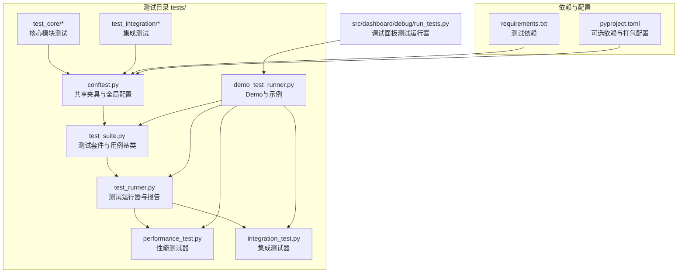
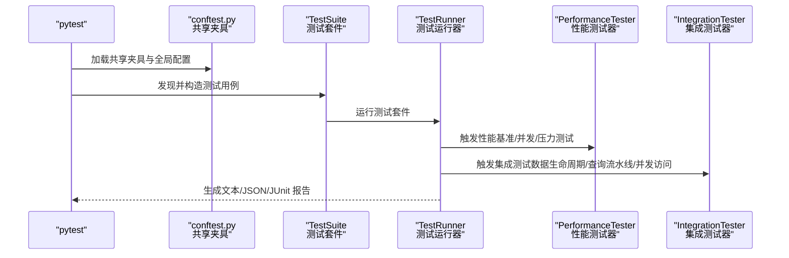
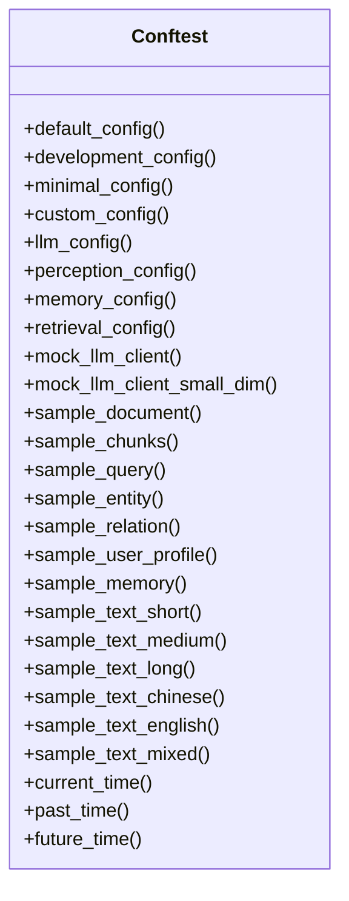
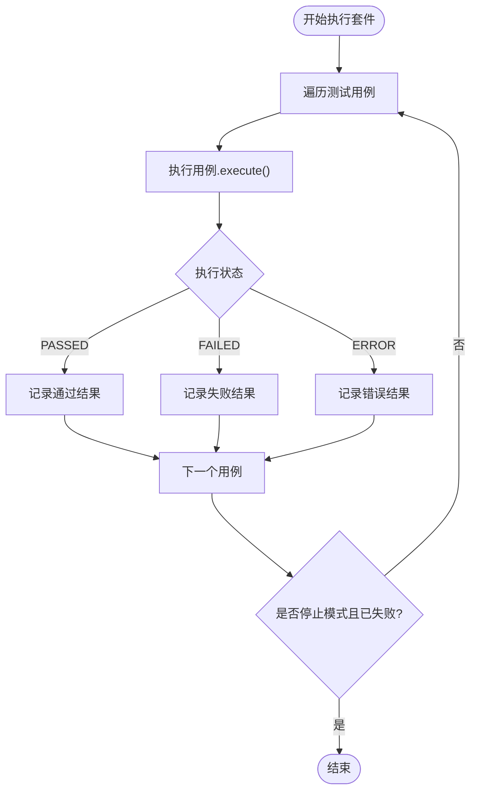
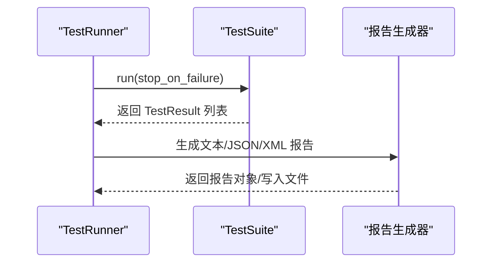
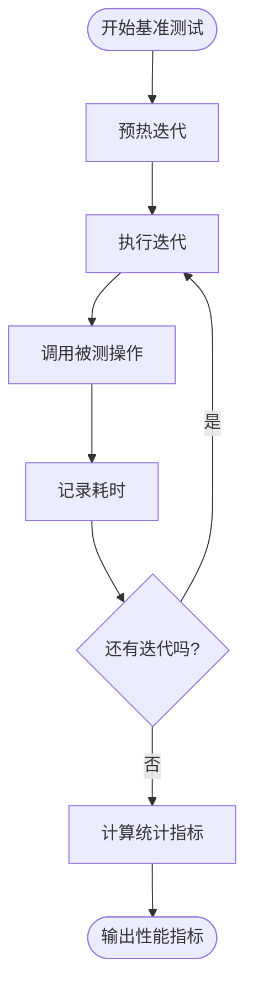
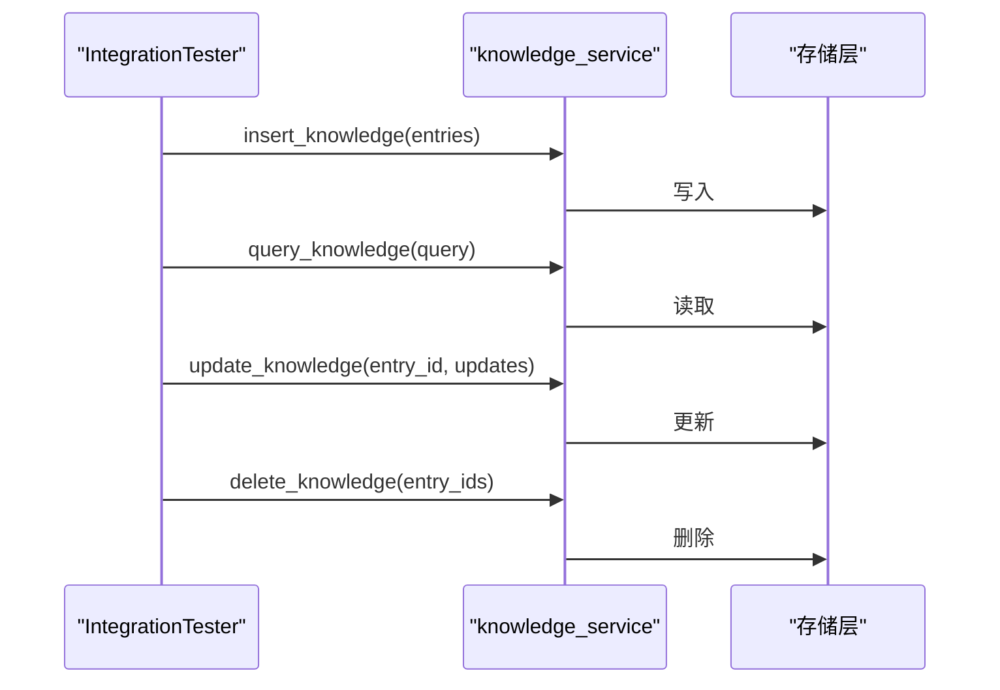
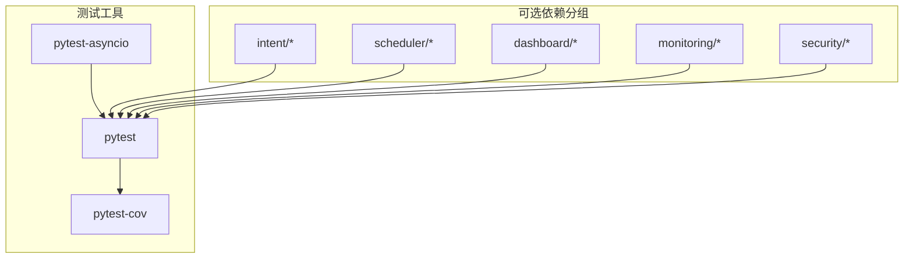

# 测试工具与配置

<cite>
**本文引用的文件**
- [tests/conftest.py](file://tests/conftest.py)
- [tests/__init__.py](file://tests/__init__.py)
- [tests/test_runner.py](file://tests/test_runner.py)
- [tests/demo_test_runner.py](file://tests/demo_test_runner.py)
- [tests/test_suite.py](file://tests/test_suite.py)
- [tests/performance_test.py](file://tests/performance_test.py)
- [tests/integration_test.py](file://tests/integration_test.py)
- [tests/README.md](file://tests/README.md)
- [tests/test_core/test_config.py](file://tests/test_core/test_config.py)
- [tests/test_core/test_protocols.py](file://tests/test_core/test_protocols.py)
- [tests/test_integration/test_necorag.py](file://tests/test_integration/test_necorag.py)
- [requirements.txt](file://requirements.txt)
- [pyproject.toml](file://pyproject.toml)
- [src/dashboard/debug/run_tests.py](file://src/dashboard/debug/run_tests.py)
</cite>

## 目录
1. [引言](#引言)
2. [项目结构](#项目结构)
3. [核心组件](#核心组件)
4. [架构总览](#架构总览)
5. [详细组件分析](#详细组件分析)
6. [依赖分析](#依赖分析)
7. [性能考虑](#性能考虑)
8. [故障排除指南](#故障排除指南)
9. [结论](#结论)
10. [附录](#附录)

## 引言
本文件面向开发者与测试工程师，系统化阐述 NecoRAG 项目的测试工具与配置体系，涵盖以下主题：
- pytest 配置与夹具（fixtures）机制
- 全局测试设置与环境管理策略
- 测试运行器的工作原理与报告生成
- 测试套件组织结构与分类
- 测试环境变量、数据库连接与依赖管理
- 测试工具安装、常用命令与调试技巧

目标是帮助团队高效编写、运行与维护测试，确保系统质量与稳定性。

## 项目结构
测试相关代码主要位于 tests/ 目录，配合 src/ 中的核心模块进行单元、集成与端到端测试；同时提供自定义测试运行器与演示脚本，便于快速上手与持续集成。

**图表来源**
- [tests/conftest.py:1-330](file://tests/conftest.py#L1-L330)
- [tests/test_suite.py:1-287](file://tests/test_suite.py#L1-L287)
- [tests/test_runner.py:1-327](file://tests/test_runner.py#L1-L327)
- [tests/performance_test.py:1-322](file://tests/performance_test.py#L1-L322)
- [tests/integration_test.py:1-377](file://tests/integration_test.py#L1-L377)
- [tests/demo_test_runner.py:1-292](file://tests/demo_test_runner.py#L1-L292)
- [requirements.txt:128-132](file://requirements.txt#L128-L132)
- [pyproject.toml:32-80](file://pyproject.toml#L32-L80)
- [src/dashboard/debug/run_tests.py:1-88](file://src/dashboard/debug/run_tests.py#L1-L88)

**章节来源**
- [tests/README.md:65-79](file://tests/README.md#L65-L79)

## 核心组件
- 共享夹具与全局配置：通过 conftest.py 提供跨测试模块复用的配置、Mock 客户端与样本数据，统一测试环境。
- 测试套件与用例基类：test_suite.py 定义了通用的 TestCase、TestSuite 与断言工具，支持装饰器风格的测试用例。
- 测试运行器：test_runner.py 负责批量执行测试套件、聚合结果与生成多种格式报告（文本、JSON、JUnit XML）。
- 性能测试器：performance_test.py 提供基准、并发、压力与内存使用测试能力。
- 集成测试器：integration_test.py 封装知识服务的完整查询流水线、数据生命周期与并发访问测试。
- Demo 与示例：demo_test_runner.py 展示如何组合单元、性能与集成测试，形成可执行的 Demo。
- 调试面板测试运行器：src/dashboard/debug/run_tests.py 用于调试面板的快速测试执行与结果汇总。

**章节来源**
- [tests/conftest.py:1-330](file://tests/conftest.py#L1-L330)
- [tests/test_suite.py:1-287](file://tests/test_suite.py#L1-L287)
- [tests/test_runner.py:1-327](file://tests/test_runner.py#L1-L327)
- [tests/performance_test.py:1-322](file://tests/performance_test.py#L1-L322)
- [tests/integration_test.py:1-377](file://tests/integration_test.py#L1-L377)
- [tests/demo_test_runner.py:1-292](file://tests/demo_test_runner.py#L1-L292)
- [src/dashboard/debug/run_tests.py:1-88](file://src/dashboard/debug/run_tests.py#L1-L88)

## 架构总览
下图展示了测试框架从“夹具注入”到“测试执行与报告”的整体流程。

**图表来源**
- [tests/conftest.py:1-330](file://tests/conftest.py#L1-L330)
- [tests/test_suite.py:145-245](file://tests/test_suite.py#L145-L245)
- [tests/test_runner.py:36-101](file://tests/test_runner.py#L36-L101)
- [tests/performance_test.py:31-193](file://tests/performance_test.py#L31-L193)
- [tests/integration_test.py:14-184](file://tests/integration_test.py#L14-L184)

## 详细组件分析

### 测试夹具与全局设置（pytest 配置与 conftest）
- 作用机制
  - 在 tests/ 目录下，pytest 会自动发现并加载 conftest.py，将其作为共享夹具与全局配置的入口。
  - 通过 @pytest.fixture 定义的配置夹具（如 default_config、development_config、minimal_config、custom_config）与 Mock 客户端（如 mock_llm_client）可在任意测试中按需注入。
  - 样本数据夹具（如 sample_document、sample_chunks、sample_query 等）提供稳定、可重复的测试输入。
- 管理策略
  - 将“环境无关”的配置与数据集中于 conftest.py，避免在各测试文件中重复定义。
  - 使用命名清晰的夹具，结合参数化与条件 skip，提升可维护性与可读性。
- 与核心模块的耦合
  - 夹具直接依赖 src.core.config、src.core.protocols 与 src.core.llm 的 Mock 实现，确保测试在无外部依赖的情况下稳定运行。

**图表来源**
- [tests/conftest.py:48-330](file://tests/conftest.py#L48-L330)

**章节来源**
- [tests/conftest.py:1-330](file://tests/conftest.py#L1-L330)

### 测试套件与用例基类（TestSuite 与 TestCase）
- 设计要点
  - TestCase 抽象类提供 setUp/tearDown 生命周期钩子与丰富的断言方法（assertEqual、assertTrue、assertIn 等）。
  - TestSuite 负责批量执行测试用例，支持按状态筛选、统计通过率与平均耗时，并在 stop_on_failure 模式下遇错即停。
  - 装饰器 test_case 可将普通函数包装为测试用例，降低样板代码。
- 执行流程
  - TestSuite.run() 遍历用例，调用 TestCase.execute()，捕获异常并记录 TestResult。
  - 统计完成后输出日志摘要，便于快速定位问题。

**图表来源**
- [tests/test_suite.py:165-198](file://tests/test_suite.py#L165-L198)

**章节来源**
- [tests/test_suite.py:1-287](file://tests/test_suite.py#L1-L287)

### 测试运行器（TestRunner）与报告生成
- 工作原理
  - TestRunner 维护测试套件列表与全局结果，支持批量运行与按名称选择运行。
  - run_all_tests()/run_selected_suites() 串联执行，遇到失败可选择停止。
- 报告生成
  - 文本报告：包含总体统计、按套件分组的明细与错误信息。
  - JSON 报告：包含摘要与详情，便于后续分析与集成。
  - JUnit XML 报告：兼容 CI/CD 平台，包含 testsuite/testcase/failure/error 节点。
- 统计指标
  - 总测试数、通过数、失败数、错误数、跳过数、成功率、执行时间、开始/结束时间等。

**图表来源**
- [tests/test_runner.py:36-235](file://tests/test_runner.py#L36-L235)

**章节来源**
- [tests/test_runner.py:1-327](file://tests/test_runner.py#L1-L327)

### 性能测试器（PerformanceTester）
- 能力范围
  - 单操作基准测试：warmup + 多轮迭代，统计 min/max/avg/median/std/percentiles/throughput。
  - 并发性能测试：多线程模拟并发用户，统计吞吐与响应时间分布。
  - 压力测试：持续运行直至失败率超过阈值，输出成功/失败次数与失败率。
  - 内存使用测试：基于 psutil 统计初始/峰值/平均内存变化。
- 使用建议
  - 基准测试前先进行 warmup，避免冷启动影响。
  - 并发测试注意资源限制，合理设置并发用户数与持续时间。
  - 压力测试设定合理的失败率阈值，避免过度放宽或收紧。

**图表来源**
- [tests/performance_test.py:37-82](file://tests/performance_test.py#L37-L82)

**章节来源**
- [tests/performance_test.py:1-322](file://tests/performance_test.py#L1-L322)

### 集成测试器（IntegrationTester）
- 能力范围
  - 完整查询流水线：从请求到响应校验，统计执行时间与成功率。
  - 数据生命周期：插入→查询→更新→删除，逐阶段断言与计时。
  - 并发访问：多线程随机查询，统计成功/失败与响应时间分布。
- 与知识服务对接
  - 通过 src.interface.knowledge_service 提供的接口完成端到端验证，确保各层协同工作正常。

**图表来源**
- [tests/integration_test.py:88-184](file://tests/integration_test.py#L88-L184)

**章节来源**
- [tests/integration_test.py:1-377](file://tests/integration_test.py#L1-L377)

### Demo 与示例（demo_test_runner）
- 目的
  - 展示如何组合单元、性能与集成测试，形成可执行的 Demo 程序，便于快速验证测试框架可用性。
- 关键流程
  - 定义 UnitTestCase 与装饰器测试用例，构建 TestSuite 并运行。
  - 使用 PerformanceTester 与 IntegrationTester 执行性能与集成测试，并汇总结果。

**章节来源**
- [tests/demo_test_runner.py:1-292](file://tests/demo_test_runner.py#L1-L292)

### 调试面板测试运行器（src/dashboard/debug/run_tests.py）
- 目的
  - 在调试面板环境中快速执行测试文件，汇总状态并输出通过率。
- 特点
  - 通过 subprocess 调用测试脚本，捕获 stdout/stderr，支持超时控制。
  - 输出友好，便于在本地或 CI 环境中快速查看结果。

**章节来源**
- [src/dashboard/debug/run_tests.py:1-88](file://src/dashboard/debug/run_tests.py#L1-L88)

## 依赖分析
- 测试工具与框架
  - pytest、pytest-asyncio、pytest-cov：核心测试运行与覆盖率统计。
- 可选依赖与模块化
  - pyproject.toml 提供可选依赖分组（intent、scheduler、dashboard、monitoring、security 等），便于按需安装。
- 测试与核心模块的耦合
  - 测试通过 conftest.py 注入的 Mock 与配置，隔离外部系统（如 LLM、向量库、图数据库），保证测试稳定性与可重复性。

**图表来源**
- [requirements.txt:128-132](file://requirements.txt#L128-L132)
- [pyproject.toml:32-80](file://pyproject.toml#L32-L80)

**章节来源**
- [requirements.txt:1-160](file://requirements.txt#L1-L160)
- [pyproject.toml:1-100](file://pyproject.toml#L1-L100)

## 性能考虑
- 测试执行效率
  - 使用并发测试与压力测试评估系统在高负载下的表现，合理设置并发用户数与持续时间。
  - 通过 warmup 与统计指标（中位数、95 分位数）更准确反映真实性能。
- 报告生成开销
  - 大规模测试时优先生成 JSON/Xml 报告，减少控制台输出带来的额外开销。
- 资源占用
  - 内存使用测试有助于发现内存泄漏与峰值占用，建议在 CI 环境中设置内存上限。

[本节为通用指导，无需具体文件分析]

## 故障排除指南
- 测试超时
  - 增加测试超时设置或优化被测代码性能。
- 内存不足
  - 减少并发用户数或分批执行大型测试。
- 测试不稳定
  - 检查测试数据依赖，确保测试环境一致性；必要时使用夹具提供稳定的输入。
- 报告缺失或格式异常
  - 确认 TestRunner 的报告生成逻辑未被异常中断；检查文件权限与路径。

**章节来源**
- [tests/README.md:224-239](file://tests/README.md#L224-L239)

## 结论
本测试框架以 pytest 为核心，结合自定义的测试套件、运行器与报告生成器，覆盖单元、性能与集成测试场景。通过 conftest.py 提供的共享夹具与 Mock 配置，测试能够在隔离环境中稳定运行。建议在日常开发中：
- 优先使用夹具与装饰器风格的测试用例，保持简洁与可读。
- 将性能与集成测试纳入 CI，定期评估系统稳定性与性能趋势。
- 使用统一的报告格式对接 CI/CD 平台，便于追踪与回溯。

[本节为总结性内容，无需具体文件分析]

## 附录

### 测试工具安装与常用命令
- 安装测试依赖
  - 仅安装核心测试依赖：pip install -r requirements.txt
  - 安装开发依赖（含 pytest、覆盖率、格式化与类型检查）：pip install pytest pytest-cov black flake8 mypy
- 常用命令
  - 运行 Demo 测试：python tests/demo_test_runner.py
  - 运行核心模块测试：python -m pytest tests/test_core/ -v
  - 运行端到端集成测试：python -m pytest tests/test_integration/ -v
  - 生成覆盖率报告：pytest --cov=src tests/ --cov-report=html --cov-report=term

**章节来源**
- [tests/README.md:27-38](file://tests/README.md#L27-L38)
- [requirements.txt:144-154](file://requirements.txt#L144-L154)

### 测试夹具与配置示例（路径指引）
- 共享夹具与 Mock 客户端：参见 [tests/conftest.py:48-147](file://tests/conftest.py#L48-L147)
- 样本数据夹具（文档/查询/实体/关系/用户画像/记忆）：参见 [tests/conftest.py:149-253](file://tests/conftest.py#L149-L253)
- 文本样本夹具（短/中/长、中文/英文/混合）：参见 [tests/conftest.py:255-310](file://tests/conftest.py#L255-L310)

**章节来源**
- [tests/conftest.py:1-330](file://tests/conftest.py#L1-L330)

### 测试套件与用例基类（路径指引）
- 测试套件与用例基类：参见 [tests/test_suite.py:145-287](file://tests/test_suite.py#L145-L287)
- 装饰器测试用例：参见 [tests/test_suite.py:247-264](file://tests/test_suite.py#L247-L264)

**章节来源**
- [tests/test_suite.py:1-287](file://tests/test_suite.py#L1-L287)

### 测试运行器与报告（路径指引）
- 测试运行器与报告生成：参见 [tests/test_runner.py:36-235](file://tests/test_runner.py#L36-L235)

**章节来源**
- [tests/test_runner.py:1-327](file://tests/test_runner.py#L1-L327)

### 性能测试器（路径指引）
- 性能测试器与指标：参见 [tests/performance_test.py:31-291](file://tests/performance_test.py#L31-L291)

**章节来源**
- [tests/performance_test.py:1-322](file://tests/performance_test.py#L1-L322)

### 集成测试器（路径指引）
- 集成测试器与知识服务对接：参见 [tests/integration_test.py:14-184](file://tests/integration_test.py#L14-L184)

**章节来源**
- [tests/integration_test.py:1-377](file://tests/integration_test.py#L1-L377)

### Demo 与调试面板（路径指引）
- Demo 测试运行：参见 [tests/demo_test_runner.py:233-292](file://tests/demo_test_runner.py#L233-L292)
- 调试面板测试运行器：参见 [src/dashboard/debug/run_tests.py:1-88](file://src/dashboard/debug/run_tests.py#L1-L88)

**章节来源**
- [tests/demo_test_runner.py:1-292](file://tests/demo_test_runner.py#L1-L292)
- [src/dashboard/debug/run_tests.py:1-88](file://src/dashboard/debug/run_tests.py#L1-L88)

### 核心模块测试（路径指引）
- 配置模块测试：参见 [tests/test_core/test_config.py:1-397](file://tests/test_core/test_config.py#L1-L397)
- 数据协议模块测试：参见 [tests/test_core/test_protocols.py:1-494](file://tests/test_core/test_protocols.py#L1-L494)
- 端到端集成测试：参见 [tests/test_integration/test_necorag.py:1-580](file://tests/test_integration/test_necorag.py#L1-L580)

**章节来源**
- [tests/test_core/test_config.py:1-397](file://tests/test_core/test_config.py#L1-L397)
- [tests/test_core/test_protocols.py:1-494](file://tests/test_core/test_protocols.py#L1-L494)
- [tests/test_integration/test_necorag.py:1-580](file://tests/test_integration/test_necorag.py#L1-L580)