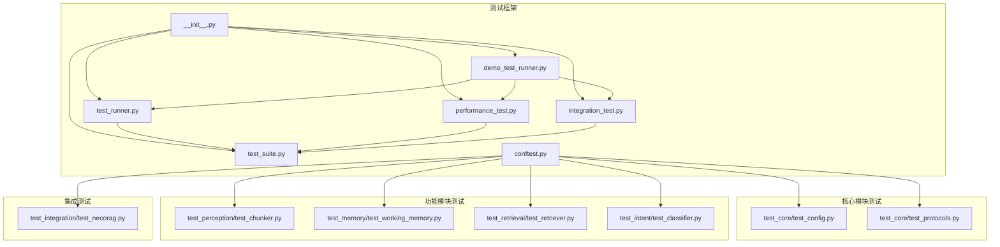
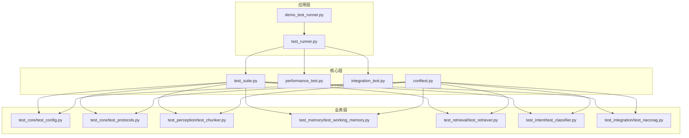
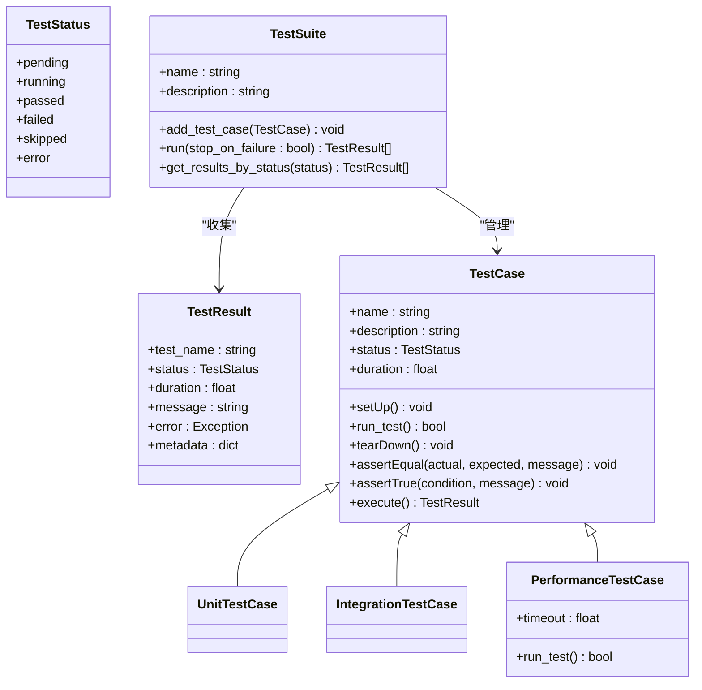
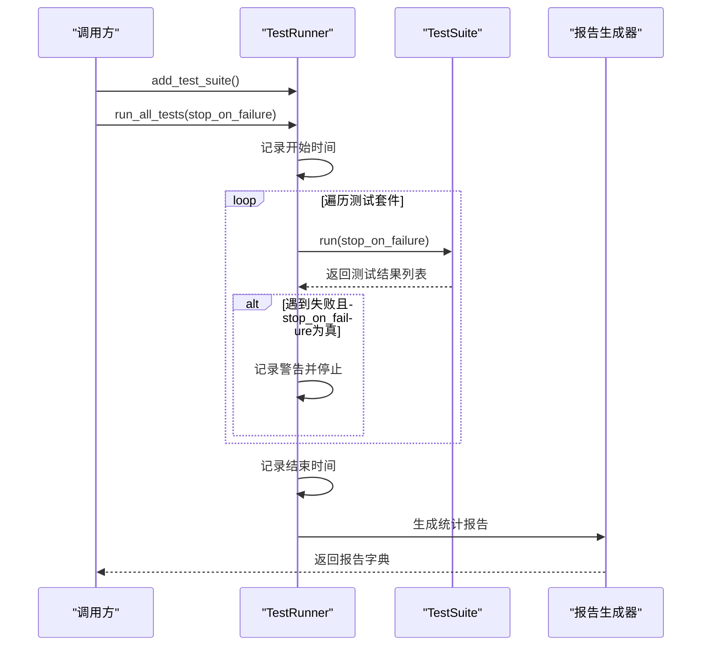
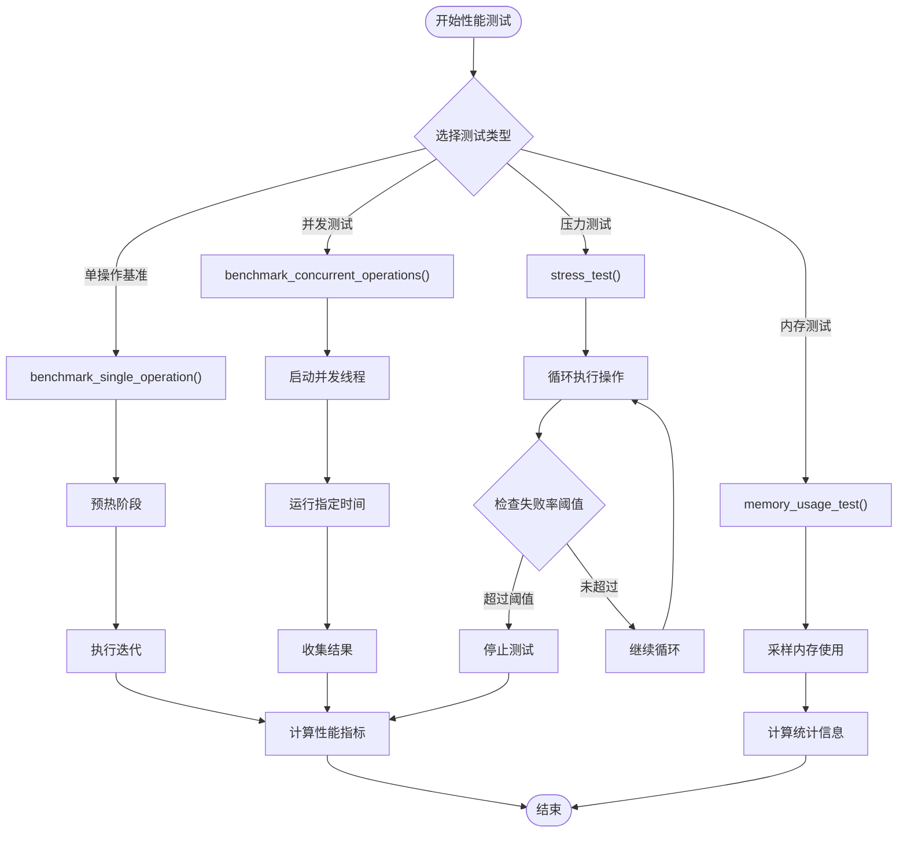
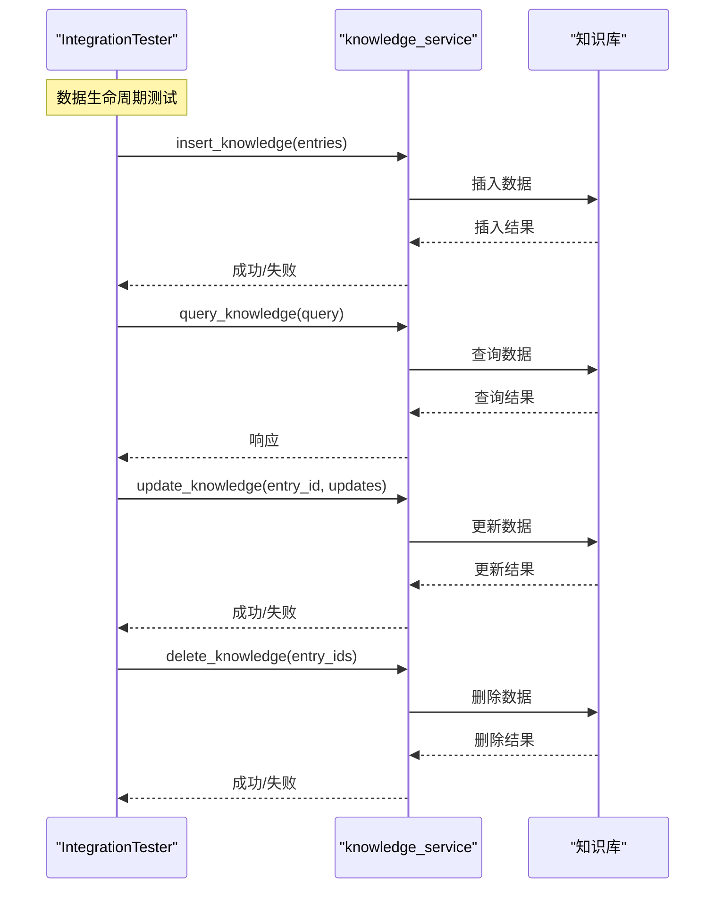
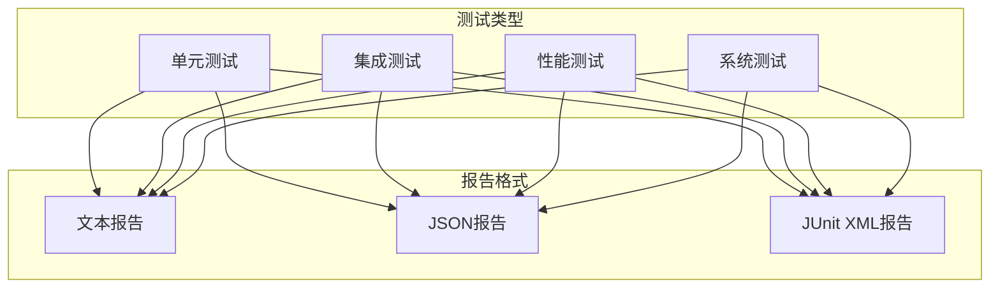
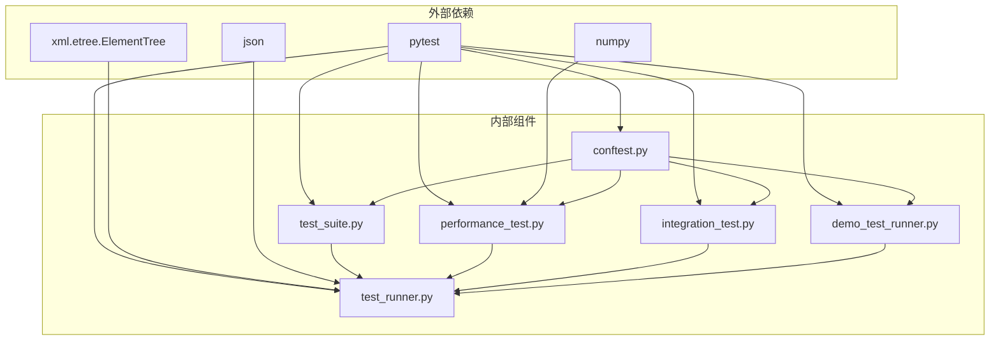

# 测试框架

<cite>
**本文档引用的文件**
- [tests/__init__.py](file://tests/__init__.py)
- [tests/conftest.py](file://tests/conftest.py)
- [tests/test_runner.py](file://tests/test_runner.py)
- [tests/test_suite.py](file://tests/test_suite.py)
- [tests/demo_test_runner.py](file://tests/demo_test_runner.py)
- [tests/performance_test.py](file://tests/performance_test.py)
- [tests/integration_test.py](file://tests/integration_test.py)
- [tests/README.md](file://tests/README.md)
- [tests/test_core/test_config.py](file://tests/test_core/test_config.py)
- [tests/test_core/test_protocols.py](file://tests/test_core/test_protocols.py)
- [tests/test_integration/test_necorag.py](file://tests/test_integration/test_necorag.py)
- [tests/test_intent/test_classifier.py](file://tests/test_intent/test_classifier.py)
- [tests/test_memory/test_working_memory.py](file://tests/test_memory/test_working_memory.py)
- [tests/test_perception/test_chunker.py](file://tests/test_perception/test_chunker.py)
- [tests/test_retrieval/test_retriever.py](file://tests/test_retrieval/test_retriever.py)
</cite>

## 目录
1. [简介](#简介)
2. [项目结构](#项目结构)
3. [核心组件](#核心组件)
4. [架构概览](#架构概览)
5. [详细组件分析](#详细组件分析)
6. [依赖分析](#依赖分析)
7. [性能考量](#性能考量)
8. [故障排除指南](#故障排除指南)
9. [结论](#结论)
10. [附录](#附录)

## 简介
本测试框架为 NecoRAG 项目提供完整的测试体系，涵盖单元测试、集成测试、性能测试与系统测试四大类别。框架采用模块化设计，支持灵活的测试组合与报告输出，并内置丰富的 fixtures 以简化测试编写。通过统一的测试运行器与测试套件，开发者可以高效地构建、执行与维护测试。

## 项目结构
测试框架位于 tests 目录下，采用按功能模块划分的组织方式：
- 核心测试：验证配置与协议数据模型
- 功能模块测试：覆盖感知、记忆、检索、意图等子系统
- 集成测试：端到端工作流与系统级集成
- 性能测试：基准测试、并发测试与压力测试
- 工具与示例：测试运行器演示与报告生成

**图表来源**
- [tests/__init__.py:1-20](file://tests/__init__.py#L1-L20)
- [tests/test_runner.py:1-327](file://tests/test_runner.py#L1-L327)
- [tests/test_suite.py:1-287](file://tests/test_suite.py#L1-L287)
- [tests/performance_test.py:1-322](file://tests/performance_test.py#L1-L322)
- [tests/integration_test.py:1-377](file://tests/integration_test.py#L1-L377)
- [tests/demo_test_runner.py:1-292](file://tests/demo_test_runner.py#L1-L292)
- [tests/conftest.py:1-330](file://tests/conftest.py#L1-L330)

**章节来源**
- [tests/README.md:65-79](file://tests/README.md#L65-L79)
- [tests/__init__.py:1-20](file://tests/__init__.py#L1-L20)

## 核心组件
测试框架由以下核心组件构成：

- 测试套件与用例基类：提供统一的测试生命周期管理与断言工具
- 测试运行器：负责测试套件的调度、执行与报告生成
- 性能测试器：提供基准测试、并发测试与压力测试能力
- 集成测试器：封装系统级集成测试流程与验证逻辑
- 共享 fixtures：集中管理配置、Mock 对象与测试数据

这些组件协同工作，形成从单元到系统的完整测试覆盖。

**章节来源**
- [tests/test_suite.py:14-287](file://tests/test_suite.py#L14-L287)
- [tests/test_runner.py:16-327](file://tests/test_runner.py#L16-L327)
- [tests/performance_test.py:31-322](file://tests/performance_test.py#L31-L322)
- [tests/integration_test.py:14-377](file://tests/integration_test.py#L14-L377)
- [tests/conftest.py:1-330](file://tests/conftest.py#L1-L330)

## 架构概览
测试框架采用分层架构，上层为测试运行器与演示程序，中层为核心测试组件，下层为各功能模块的测试与共享 fixtures。

**图表来源**
- [tests/demo_test_runner.py:19-23](file://tests/demo_test_runner.py#L19-L23)
- [tests/test_runner.py:13-14](file://tests/test_runner.py#L13-L14)
- [tests/test_suite.py:145-287](file://tests/test_suite.py#L145-L287)
- [tests/performance_test.py:31-322](file://tests/performance_test.py#L31-L322)
- [tests/integration_test.py:14-377](file://tests/integration_test.py#L14-L377)
- [tests/conftest.py:15-44](file://tests/conftest.py#L15-L44)

## 详细组件分析

### 测试套件与用例基类
测试套件提供统一的测试生命周期管理，包括 setUp/tearDown、断言工具与结果收集。测试用例基类支持装饰器与继承两种方式定义测试逻辑。

**图表来源**
- [tests/test_suite.py:14-287](file://tests/test_suite.py#L14-L287)

**章节来源**
- [tests/test_suite.py:35-143](file://tests/test_suite.py#L35-L143)
- [tests/test_suite.py:145-245](file://tests/test_suite.py#L145-L245)

### 测试运行器
测试运行器负责协调多个测试套件的执行，支持选择性运行与多种报告格式输出（文本、JSON、JUnit XML）。

**图表来源**
- [tests/test_runner.py:36-66](file://tests/test_runner.py#L36-L66)
- [tests/test_runner.py:162-234](file://tests/test_runner.py#L162-L234)

**章节来源**
- [tests/test_runner.py:16-66](file://tests/test_runner.py#L16-L66)
- [tests/test_runner.py:97-161](file://tests/test_runner.py#L97-L161)
- [tests/test_runner.py:173-234](file://tests/test_runner.py#L173-L234)

### 性能测试器
性能测试器提供多种性能测试能力，包括单操作基准测试、并发性能测试、压力测试与内存使用监控。

**图表来源**
- [tests/performance_test.py:37-82](file://tests/performance_test.py#L37-L82)
- [tests/performance_test.py:83-135](file://tests/performance_test.py#L83-L135)
- [tests/performance_test.py:137-192](file://tests/performance_test.py#L137-L192)
- [tests/performance_test.py:194-228](file://tests/performance_test.py#L194-L228)

**章节来源**
- [tests/performance_test.py:31-82](file://tests/performance_test.py#L31-L82)
- [tests/performance_test.py:83-135](file://tests/performance_test.py#L83-L135)
- [tests/performance_test.py:137-192](file://tests/performance_test.py#L137-L192)
- [tests/performance_test.py:194-228](file://tests/performance_test.py#L194-L228)

### 集成测试器
集成测试器封装系统级集成测试流程，包括数据生命周期测试、查询流水线测试与并发访问测试。

**图表来源**
- [tests/integration_test.py:88-183](file://tests/integration_test.py#L88-L183)

**章节来源**
- [tests/integration_test.py:14-87](file://tests/integration_test.py#L14-L87)
- [tests/integration_test.py:88-183](file://tests/integration_test.py#L88-L183)
- [tests/integration_test.py:185-281](file://tests/integration_test.py#L185-L281)

### 共享 fixtures
共享 fixtures 提供测试中复用的配置、Mock 对象与样本数据，包括配置 fixtures、Mock 客户端 fixtures 与样本数据 fixtures。

**章节来源**
- [tests/conftest.py:46-81](file://tests/conftest.py#L46-L81)
- [tests/conftest.py:127-147](file://tests/conftest.py#L127-L147)
- [tests/conftest.py:149-330](file://tests/conftest.py#L149-L330)

### 核心模块测试

#### 配置模块测试
验证 NecoRAGConfig 及各子配置的创建、序列化/反序列化与预设配置。

**章节来源**
- [tests/test_core/test_config.py:35-122](file://tests/test_core/test_config.py#L35-L122)
- [tests/test_core/test_config.py:124-161](file://tests/test_core/test_config.py#L124-L161)
- [tests/test_core/test_config.py:163-201](file://tests/test_core/test_config.py#L163-L201)
- [tests/test_core/test_config.py:203-230](file://tests/test_core/test_config.py#L203-L230)
- [tests/test_core/test_config.py:231-251](file://tests/test_core/test_config.py#L231-L251)
- [tests/test_core/test_config.py:253-266](file://tests/test_core/test_config.py#L253-L266)
- [tests/test_core/test_config.py:267-279](file://tests/test_core/test_config.py#L267-L279)
- [tests/test_core/test_config.py:280-292](file://tests/test_core/test_config.py#L280-L292)
- [tests/test_core/test_config.py:294-307](file://tests/test_core/test_config.py#L294-L307)
- [tests/test_core/test_config.py:309-338](file://tests/test_core/test_config.py#L309-L338)
- [tests/test_core/test_config.py:340-397](file://tests/test_core/test_config.py#L340-L397)

#### 协议数据模型测试
验证统一数据模型的创建与字段验证，包括枚举类型、文档、分块、实体、关系、查询、响应与用户画像等。

**章节来源**
- [tests/test_core/test_protocols.py:46-102](file://tests/test_core/test_protocols.py#L46-L102)
- [tests/test_core/test_protocols.py:104-132](file://tests/test_core/test_protocols.py#L104-L132)
- [tests/test_core/test_protocols.py:134-180](file://tests/test_core/test_protocols.py#L134-L180)
- [tests/test_core/test_protocols.py:182-210](file://tests/test_core/test_protocols.py#L182-L210)
- [tests/test_core/test_protocols.py:212-241](file://tests/test_core/test_protocols.py#L212-L241)
- [tests/test_core/test_protocols.py:243-257](file://tests/test_core/test_protocols.py#L243-L257)
- [tests/test_core/test_protocols.py:259-288](file://tests/test_core/test_protocols.py#L259-L288)
- [tests/test_core/test_protocols.py:290-330](file://tests/test_core/test_protocols.py#L290-L330)
- [tests/test_core/test_protocols.py:332-355](file://tests/test_core/test_protocols.py#L332-L355)
- [tests/test_core/test_protocols.py:357-384](file://tests/test_core/test_protocols.py#L357-L384)
- [tests/test_core/test_protocols.py:386-401](file://tests/test_core/test_protocols.py#L386-L401)
- [tests/test_core/test_protocols.py:403-418](file://tests/test_core/test_protocols.py#L403-L418)
- [tests/test_core/test_protocols.py:420-436](file://tests/test_core/test_protocols.py#L420-L436)
- [tests/test_core/test_protocols.py:438-469](file://tests/test_core/test_protocols.py#L438-L469)
- [tests/test_core/test_protocols.py:471-494](file://tests/test_core/test_protocols.py#L471-L494)

### 功能模块测试

#### 分块策略测试
验证弹性分块、语义分块、句子级分块、固定大小分块与结构化分块的正确性与边界情况处理。

**章节来源**
- [tests/test_perception/test_chunker.py:43-74](file://tests/test_perception/test_chunker.py#L43-L74)
- [tests/test_perception/test_chunker.py:76-139](file://tests/test_perception/test_chunker.py#L76-L139)
- [tests/test_perception/test_chunker.py:141-171](file://tests/test_perception/test_chunker.py#L141-L171)
- [tests/test_perception/test_chunker.py:172-219](file://tests/test_perception/test_chunker.py#L172-L219)
- [tests/test_perception/test_chunker.py:221-243](file://tests/test_perception/test_chunker.py#L221-L243)
- [tests/test_perception/test_chunker.py:245-273](file://tests/test_perception/test_chunker.py#L245-L273)
- [tests/test_perception/test_chunker.py:275-305](file://tests/test_perception/test_chunker.py#L275-L305)
- [tests/test_perception/test_chunker.py:307-318](file://tests/test_perception/test_chunker.py#L307-L318)
- [tests/test_perception/test_chunker.py:320-388](file://tests/test_perception/test_chunker.py#L320-L388)
- [tests/test_perception/test_chunker.py:390-424](file://tests/test_perception/test_chunker.py#L390-L424)
- [tests/test_perception/test_chunker.py:426-490](file://tests/test_perception/test_chunker.py#L426-L490)
- [tests/test_perception/test_chunker.py:492-532](file://tests/test_perception/test_chunker.py#L492-L532)

#### 工作记忆测试
验证工作记忆的上下文存储与检索、容量限制、会话管理与意图轨迹跟踪。

**章节来源**
- [tests/test_memory/test_working_memory.py:18-36](file://tests/test_memory/test_working_memory.py#L18-L36)
- [tests/test_memory/test_working_memory.py:38-104](file://tests/test_memory/test_working_memory.py#L38-L104)
- [tests/test_memory/test_working_memory.py:106-164](file://tests/test_memory/test_working_memory.py#L106-L164)
- [tests/test_memory/test_working_memory.py:166-212](file://tests/test_memory/test_working_memory.py#L166-L212)
- [tests/test_memory/test_working_memory.py:214-259](file://tests/test_memory/test_working_memory.py#L214-L259)
- [tests/test_memory/test_working_memory.py:261-307](file://tests/test_memory/test_working_memory.py#L261-L307)

#### 检索器测试
验证早停控制器、自适应检索器的初始化与检索流程、HyDE 增强与多跳检索。

**章节来源**
- [tests/test_retrieval/test_retriever.py:19-117](file://tests/test_retrieval/test_retriever.py#L19-L117)
- [tests/test_retrieval/test_retriever.py:119-145](file://tests/test_retrieval/test_retriever.py#L119-L145)
- [tests/test_retrieval/test_retriever.py:147-201](file://tests/test_retrieval/test_retriever.py#L147-L201)
- [tests/test_retrieval/test_retriever.py:203-250](file://tests/test_retrieval/test_retriever.py#L203-L250)
- [tests/test_retrieval/test_retriever.py:252-281](file://tests/test_retrieval/test_retriever.py#L252-L281)
- [tests/test_retrieval/test_retriever.py:283-315](file://tests/test_retrieval/test_retriever.py#L283-L315)
- [tests/test_retrieval/test_retriever.py:317-331](file://tests/test_retrieval/test_retriever.py#L317-L331)
- [tests/test_retrieval/test_retriever.py:333-356](file://tests/test_retrieval/test_retriever.py#L333-L356)
- [tests/test_retrieval/test_retriever.py:358-410](file://tests/test_retrieval/test_retriever.py#L358-L410)

#### 意图分类器测试
验证基于规则的分类、关键词与实体提取、多意图支持与后端切换。

**章节来源**
- [tests/test_intent/test_classifier.py:18-47](file://tests/test_intent/test_classifier.py#L18-L47)
- [tests/test_intent/test_classifier.py:49-134](file://tests/test_intent/test_classifier.py#L49-L134)
- [tests/test_intent/test_classifier.py:136-174](file://tests/test_intent/test_classifier.py#L136-L174)
- [tests/test_intent/test_classifier.py:176-258](file://tests/test_intent/test_classifier.py#L176-L258)
- [tests/test_intent/test_classifier.py:260-287](file://tests/test_intent/test_classifier.py#L260-L287)
- [tests/test_intent/test_classifier.py:289-308](file://tests/test_intent/test_classifier.py#L289-L308)
- [tests/test_intent/test_classifier.py:310-332](file://tests/test_intent/test_classifier.py#L310-L332)
- [tests/test_intent/test_classifier.py:334-373](file://tests/test_intent/test_classifier.py#L334-L373)
- [tests/test_intent/test_classifier.py:375-401](file://tests/test_intent/test_classifier.py#L375-L401)
- [tests/test_intent/test_classifier.py:403-445](file://tests/test_intent/test_classifier.py#L403-L445)
- [tests/test_intent/test_classifier.py:447-493](file://tests/test_intent/test_classifier.py#L447-L493)

### 端到端集成测试
验证 NecoRAG 主类初始化、文档导入流程、查询与搜索、意图分析、知识演化与自适应学习、生命周期管理与工厂方法。

**章节来源**
- [tests/test_integration/test_necorag.py:48-98](file://tests/test_integration/test_necorag.py#L48-L98)
- [tests/test_integration/test_necorag.py:100-124](file://tests/test_integration/test_necorag.py#L100-L124)
- [tests/test_integration/test_necorag.py:125-194](file://tests/test_integration/test_necorag.py#L125-L194)
- [tests/test_integration/test_necorag.py:196-267](file://tests/test_integration/test_necorag.py#L196-L267)
- [tests/test_integration/test_necorag.py:269-289](file://tests/test_integration/test_necorag.py#L269-L289)
- [tests/test_integration/test_necorag.py:291-310](file://tests/test_integration/test_necorag.py#L291-L310)
- [tests/test_integration/test_necorag.py:312-351](file://tests/test_integration/test_necorag.py#L312-L351)
- [tests/test_integration/test_necorag.py:361-401](file://tests/test_integration/test_necorag.py#L361-L401)
- [tests/test_integration/test_necorag.py:403-432](file://tests/test_integration/test_necorag.py#L403-L432)
- [tests/test_integration/test_necorag.py:434-474](file://tests/test_integration/test_necorag.py#L434-L474)
- [tests/test_integration/test_necorag.py:476-545](file://tests/test_integration/test_necorag.py#L476-L545)
- [tests/test_integration/test_necorag.py:547-580](file://tests/test_integration/test_necorag.py#L547-L580)

### 概念性概览
测试框架支持多种测试类型与报告格式，提供从单元到系统的完整测试覆盖。

[此图为概念性说明，不对应具体源码结构]

## 依赖分析
测试框架内部依赖关系清晰，核心组件之间耦合度适中，便于扩展与维护。

**图表来源**
- [tests/test_runner.py:6-13](file://tests/test_runner.py#L6-L13)
- [tests/performance_test.py:6-14](file://tests/performance_test.py#L6-L14)
- [tests/integration_test.py:6-12](file://tests/integration_test.py#L6-L12)
- [tests/demo_test_runner.py:6-22](file://tests/demo_test_runner.py#L6-L22)
- [tests/conftest.py:7-44](file://tests/conftest.py#L7-L44)

**章节来源**
- [tests/test_runner.py:6-13](file://tests/test_runner.py#L6-L13)
- [tests/performance_test.py:6-14](file://tests/performance_test.py#L6-L14)
- [tests/integration_test.py:6-12](file://tests/integration_test.py#L6-L12)
- [tests/demo_test_runner.py:6-22](file://tests/demo_test_runner.py#L6-L22)
- [tests/conftest.py:7-44](file://tests/conftest.py#L7-L44)

## 性能考量
- 测试运行器支持多种报告格式，便于性能对比与趋势分析
- 性能测试器提供基准测试、并发测试与压力测试，帮助识别性能瓶颈
- 集成测试器支持并发访问测试，验证系统在高负载下的稳定性
- 共享 fixtures 通过 Mock 对象减少外部依赖，提高测试执行效率

## 故障排除指南
常见问题与解决方案：
- 测试超时：增加测试超时设置或优化被测代码性能
- 内存不足：减少并发用户数或分批执行大型测试
- 测试不稳定：检查测试数据依赖，确保测试环境一致性
- 导入问题：确认模块依赖正确安装，避免循环导入

**章节来源**
- [tests/README.md:224-239](file://tests/README.md#L224-L239)

## 结论
NecoRAG 测试框架提供了完善的测试基础设施，覆盖从单元到系统的各个层面。通过统一的测试运行器、灵活的测试套件与丰富的性能测试能力，开发者可以高效地保证代码质量与系统稳定性。建议在日常开发中充分利用 fixtures 与测试装饰器，遵循测试最佳实践，持续完善测试覆盖率。

## 附录
- 快速开始：运行 Demo 测试或使用 pytest 执行特定模块测试
- 测试最佳实践：使用描述性测试名称、按功能模块组织测试文件、合理使用断言与测试数据
- 持续集成：可参考 GitHub Actions 配置示例

**章节来源**
- [tests/README.md:27-37](file://tests/README.md#L27-L37)
- [tests/README.md:103-122](file://tests/README.md#L103-L122)
- [tests/README.md:208-223](file://tests/README.md#L208-L223)