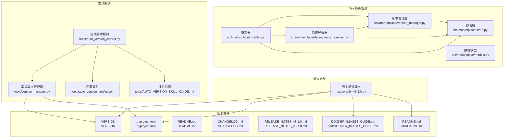
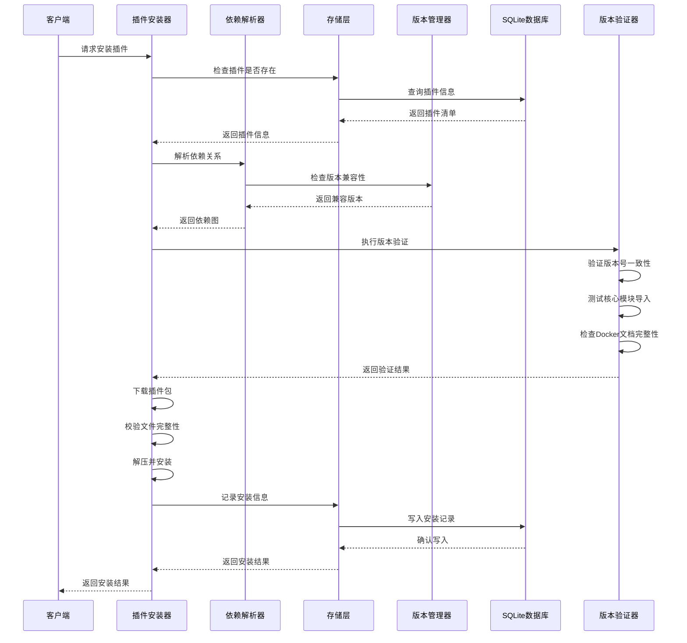
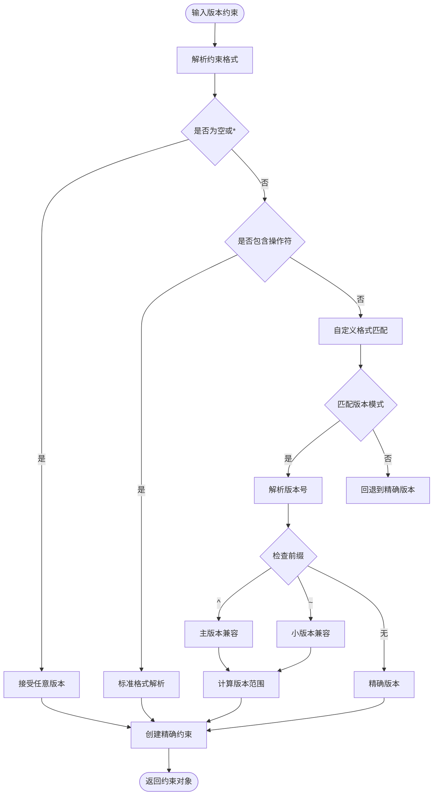
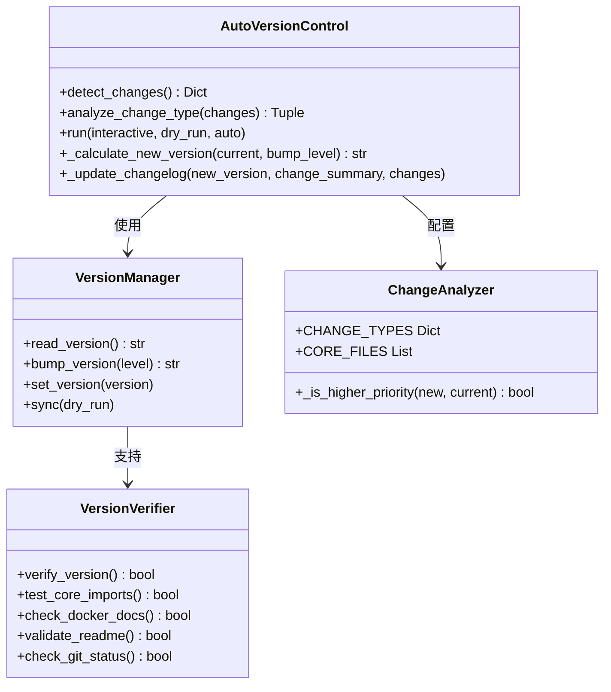
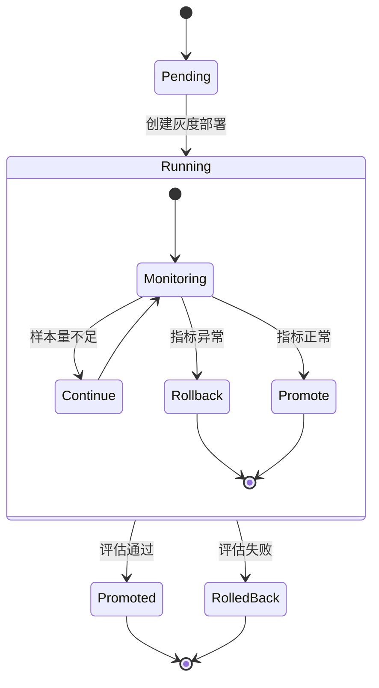
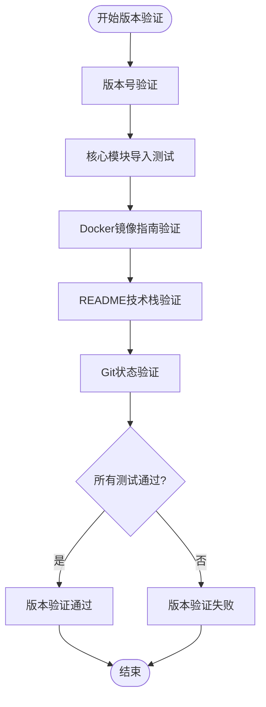

# 版本管理系统

<cite>
**本文档引用的文件**
- [version_manager.py](file://src/marketplace/version_manager.py)
- [installer.py](file://src/marketplace/installer.py)
- [store.py](file://src/marketplace/store.py)
- [models.py](file://src/marketplace/models.py)
- [dependency_resolver.py](file://src/marketplace/dependency_resolver.py)
- [version_manager.py](file://tools/version_manager.py)
- [auto_version_control.py](file://tools/auto_version_control.py)
- [auto_version_config.json](file://tools/auto_version_config.json)
- [AUTO_VERSION_SKILL_GUIDE.md](file://tools/AUTO_VERSION_SKILL_GUIDE.md)
- [verify_v3.2.0.py](file://tests/verify_v3.2.0.py)
- [VERSION](file://VERSION)
- [pyproject.toml](file://pyproject.toml)
- [README.md](file://README.md)
- [CHANGELOG.md](file://CHANGELOG.md)
- [RELEASE_NOTES_v3.1.0.md](file://RELEASE_NOTES_v3.1.0.md)
- [DOCKER_IMAGES_GUIDE.md](file://3rd/DOCKER_IMAGES_GUIDE.md)
- [README.md](file://3rd/README.md)
</cite>

## 更新摘要
**所做变更**
- 新增自动化版本验证系统 tests/verify_v3.2.0.py，提供版本一致性测试、核心模块导入测试、Docker镜像文档完整性验证
- 版本系统升级至 v3.2.0-alpha，反映新增的自动化验证流程和增强的版本管理能力
- 更新依赖管理和版本约束解析器以支持 v3.2.0-alpha 的新功能和架构变更

## 目录
1. [简介](#简介)
2. [项目结构](#项目结构)
3. [核心组件](#核心组件)
4. [架构概览](#架构概览)
5. [详细组件分析](#详细组件分析)
6. [依赖关系分析](#依赖关系分析)
7. [性能考虑](#性能考虑)
8. [故障排除指南](#故障排除指南)
9. [结论](#结论)

## 简介

NecoRAG 版本管理系统是一个完整的软件版本控制解决方案，涵盖了从项目版本管理到插件市场的完整生命周期管理。该系统提供了语义版本控制、版本约束解析、依赖管理、灰度发布、自动版本控制等功能，支持 NecoRAG 生态系统中各个组件的版本统一管理。

**重要变更**：系统已升级到 v3.2.0-alpha 版本，这是功能增强版本，主要包含新增的自动化版本验证系统、增强的 Docker 镜像支持、OCR 集成功能以及 23 个第三方系统的完整技术栈覆盖。系统现在支持更智能的版本变更检测、自动化的版本验证流程和更完善的版本管理生态系统。

系统主要分为两个层面：
- **项目版本管理**：通过工具脚本管理整个项目的版本号和相关文件同步
- **插件版本管理**：通过插件市场实现插件的版本控制、依赖解析和生命周期管理
- **自动化验证系统**：通过测试脚本确保版本发布的一致性和完整性

## 项目结构



**图表来源**
- [version_manager.py:1-956](file://src/marketplace/version_manager.py#L1-L956)
- [installer.py:1-1375](file://src/marketplace/installer.py#L1-L1375)
- [store.py:1-1692](file://src/marketplace/store.py#L1-L1692)
- [models.py:1-756](file://src/marketplace/models.py#L1-L756)
- [auto_version_control.py:1-462](file://tools/auto_version_control.py#L1-L462)
- [verify_v3.2.0.py:1-226](file://tests/verify_v3.2.0.py#L1-L226)

**章节来源**
- [version_manager.py:1-956](file://src/marketplace/version_manager.py#L1-L956)
- [installer.py:1-1375](file://src/marketplace/installer.py#L1-L1375)
- [store.py:1-1692](file://src/marketplace/store.py#L1-L1692)
- [models.py:1-756](file://src/marketplace/models.py#L1-L756)
- [verify_v3.2.0.py:1-226](file://tests/verify_v3.2.0.py#L1-L226)

## 核心组件

### 版本管理器 (VersionManager)

版本管理器是系统的核心组件，负责处理语义版本控制的各种操作：

- **版本解析**：支持多种版本格式的解析和验证
- **版本比较**：提供精确的版本比较算法
- **约束检查**：支持复杂的版本约束解析和验证
- **升级路径规划**：智能规划从当前版本到目标版本的升级路径

**重要变更**：版本管理器现已支持 v3.2.0-alpha 版本的复杂约束，包括预发布版本标识符和更严格的版本格式验证。新增的自动化验证系统进一步增强了版本管理的可靠性。

### 插件安装器 (PluginInstaller)

插件安装器管理插件的完整生命周期：

- **安装流程**：从下载、校验到安装的完整流程
- **卸载管理**：安全卸载插件，处理依赖关系
- **升级机制**：支持插件的平滑升级
- **钩子系统**：提供安装过程中的扩展点

### 存储层 (MarketplaceStore)

基于 SQLite 的持久化存储，提供：

- **插件元数据管理**：插件的基本信息存储
- **版本发布管理**：版本历史和发布信息
- **安装记录管理**：插件安装状态跟踪
- **全文搜索**：FTS5 全文搜索支持
- **灰度部署管理**：支持 v3.2.0-alpha 版本的灰度发布

### 数据模型 (Models)

定义了系统中使用的所有数据结构：

- **枚举类型**：插件类型、状态、权限等
- **核心模型**：插件清单、发布记录、安装信息等
- **辅助模型**：依赖图、版本冲突、灰度部署等

### 自动化版本验证系统 (VerifySystem)

**新增功能**：自动化版本验证系统提供全面的版本发布质量保证：

- **版本号验证**：确保 VERSION 文件和 pyproject.toml 中的版本一致
- **核心模块导入测试**：验证所有核心模块的可导入性和功能完整性
- **Docker 镜像指南验证**：检查 Docker 镜像文档的完整性和准确性
- **README 技术栈验证**：确保技术栈文档的准确性和完整性
- **Git 状态验证**：检查工作区状态，确保发布前的代码完整性

**章节来源**
- [version_manager.py:179-956](file://src/marketplace/version_manager.py#L179-L956)
- [installer.py:152-1375](file://src/marketplace/installer.py#L152-L1375)
- [store.py:41-1692](file://src/marketplace/store.py#L41-L1692)
- [models.py:21-756](file://src/marketplace/models.py#L21-L756)
- [verify_v3.2.0.py:18-177](file://tests/verify_v3.2.0.py#L18-L177)

## 架构概览



**图表来源**
- [installer.py:217-402](file://src/marketplace/installer.py#L217-L402)
- [dependency_resolver.py:44-112](file://src/marketplace/dependency_resolver.py#L44-L112)
- [version_manager.py:214-243](file://src/marketplace/version_manager.py#L214-L243)
- [verify_v3.2.0.py:179-222](file://tests/verify_v3.2.0.py#L179-L222)

## 详细组件分析

### 版本约束解析器

版本约束解析器支持多种约束格式，现已适配 v3.2.0-alpha 的增强版本约束：



**图表来源**
- [version_manager.py:65-131](file://src/marketplace/version_manager.py#L65-L131)

### 自动版本控制系统

自动版本控制系统提供了智能化的版本管理，现已整合到 v3.2.0-alpha 版本：



**新增功能**：自动版本控制技能现已整合到项目中，提供智能的版本变更检测和更新功能，支持 Code Count 指令系统和三级用户系统的版本管理。新增的版本验证器确保每次版本发布都经过全面的质量检查。

**图表来源**
- [auto_version_control.py:31-462](file://tools/auto_version_control.py#L31-L462)
- [version_manager.py:27-387](file://tools/version_manager.py#L27-L387)
- [verify_v3.2.0.py:13-177](file://tests/verify_v3.2.0.py#L13-L177)

### 灰度发布管理

灰度发布系统提供了渐进式的版本发布策略，现已适配 v3.2.0-alpha 的版本约束：



**图表来源**
- [version_manager.py:582-796](file://src/marketplace/version_manager.py#L582-L796)

### 自动化版本验证流程

**新增功能**：自动化版本验证系统提供五个层次的验证测试：



**图表来源**
- [verify_v3.2.0.py:179-222](file://tests/verify_v3.2.0.py#L179-L222)

**章节来源**
- [version_manager.py:23-177](file://src/marketplace/version_manager.py#L23-L177)
- [auto_version_control.py:31-462](file://tools/auto_version_control.py#L31-L462)
- [version_manager.py:27-387](file://tools/version_manager.py#L27-L387)
- [verify_v3.2.0.py:13-222](file://tests/verify_v3.2.0.py#L13-L222)

## 依赖关系分析

```mermaid
graph TB
subgraph "外部依赖"
PACKAGING[packaging>=21.0]
SQLITE[sqlite3内置]
JSON[json标准库]
THREADING[threading标准库]
SUBPROCESS[subprocess标准库]
END
subgraph "内部组件"
VM[VersionManager]
IM[PluginInstaller]
DR[DependencyResolver]
SM[MarketplaceStore]
DM[Models]
end
subgraph "工具系统"
TVM[Tools VersionManager]
AVC[Auto Version Control]
AVC_GUIDE[Auto Version Skill Guide]
end
subgraph "验证系统"
VERIFY[Version Verifier]
end
VM --> PACKAGING
DR --> VM
DR --> SM
IM --> VM
IM --> DR
IM --> SM
SM --> SQLITE
TVM --> JSON
TVM --> THREADING
AVC --> TVM
AVC --> JSON
AVC_GUIDE --> AVC
VERIFY --> SUBPROCESS
VERIFY --> END
```

**图表来源**
- [pyproject.toml:27-31](file://pyproject.toml#L27-L31)
- [version_manager.py:7-18](file://src/marketplace/version_manager.py#L7-L18)
- [dependency_resolver.py:7-16](file://src/marketplace/dependency_resolver.py#L7-L16)
- [verify_v3.2.0.py:7-11](file://tests/verify_v3.2.0.py#L7-L11)

系统采用松耦合的设计，各组件之间通过清晰的接口进行交互，便于维护和扩展。

**章节来源**
- [pyproject.toml:27-31](file://pyproject.toml#L27-L31)
- [version_manager.py:7-18](file://src/marketplace/version_manager.py#L7-L18)
- [dependency_resolver.py:7-16](file://src/marketplace/dependency_resolver.py#L7-L16)

## 性能考虑

### 版本比较优化

系统采用了高效的版本比较算法，支持以下优化：

- **早期退出**：在发现不匹配时立即停止比较
- **缓存机制**：对常用版本比较结果进行缓存
- **增量更新**：仅在必要时重新计算版本信息

### 存储性能

SQLite 存储层采用了多项性能优化：

- **WAL 模式**：提升并发读写性能
- **索引优化**：为常用查询字段建立索引
- **事务管理**：批量操作使用事务提升性能

### 内存管理

系统实现了智能的内存管理策略：

- **连接池**：复用数据库连接
- **缓存策略**：对频繁访问的数据进行缓存
- **垃圾回收**：及时释放不再使用的资源

### 验证系统性能

**新增功能**：自动化验证系统采用异步和并行处理策略：

- **模块导入测试**：使用延迟导入避免不必要的模块加载
- **文件验证**：采用流式读取减少内存占用
- **Git 操作**：设置超时机制防止长时间阻塞
- **并行验证**：多个独立验证任务可以并行执行

## 故障排除指南

### 常见问题及解决方案

#### 版本解析失败
**症状**：版本约束解析抛出异常
**原因**：版本格式不符合规范
**解决方案**：
1. 检查版本字符串格式
2. 确认使用支持的约束语法
3. 查看日志获取详细错误信息

#### 依赖冲突
**症状**：安装插件时提示依赖冲突
**原因**：插件间的版本约束不兼容
**解决方案**：
1. 检查冲突的具体依赖和版本
2. 调整插件版本或移除冲突插件
3. 使用依赖解析器查看详细冲突信息

#### 数据库连接问题
**症状**：存储操作失败
**原因**：数据库连接异常或文件权限问题
**解决方案**：
1. 检查数据库文件路径和权限
2. 确认数据库文件未被其他进程占用
3. 重启应用以重新建立连接

#### 自动版本控制问题
**症状**：自动版本控制无法正常工作
**原因**：Git 状态检测失败或配置错误
**解决方案**：
1. 检查 Git 仓库状态
2. 验证配置文件格式
3. 确认核心文件列表正确
4. 查看自动版本控制技能指南获取详细帮助

#### 版本同步问题
**症状**：版本号不同步或更新失败
**原因**：VERSION 文件或 pyproject.toml 更新异常
**解决方案**：
1. 检查 VERSION 文件格式和权限
2. 验证 pyproject.toml 中的版本配置
3. 确认所有 Markdown 文件的版本引用已更新
4. 查看 RELEASE_NOTES_v3.1.0.md 获取详细的版本变更信息

#### 自动化验证失败
**症状**：版本验证脚本执行失败
**原因**：核心模块导入失败、Docker 文档缺失或 Git 状态异常
**解决方案**：
1. 检查核心模块的导入路径和类名
2. 验证 Docker 镜像文档的完整性
3. 确认 README 技术栈文档的准确性
4. 检查 Git 工作区状态，确保无未提交更改
5. 查看验证脚本的详细输出信息

#### Docker 镜像文档不完整
**症状**：Docker 镜像指南验证失败
**原因**：缺少必要的镜像文档或配置信息
**解决方案**：
1. 检查 DOCKER_IMAGES_GUIDE.md 中的镜像列表
2. 确认所有必需镜像都有对应的文档说明
3. 验证镜像版本和用途描述的准确性
4. 更新镜像大小和 Docker Hub 链接信息

#### 核心模块导入错误
**症状**：核心模块导入测试失败
**原因**：模块路径错误、类名不匹配或依赖缺失
**解决方案**：
1. 检查模块导入路径是否正确
2. 验证类名与实际模块结构一致
3. 确认所有依赖包已正确安装
4. 检查 Python 路径配置

**章节来源**
- [version_manager.py:57-63](file://src/marketplace/version_manager.py#L57-L63)
- [dependency_resolver.py:104-111](file://src/marketplace/dependency_resolver.py#L104-L111)
- [store.py:77-85](file://src/marketplace/store.py#L77-L85)
- [AUTO_VERSION_SKILL_GUIDE.md:252-298](file://tools/AUTO_VERSION_SKILL_GUIDE.md#L252-L298)
- [verify_v3.2.0.py:13-222](file://tests/verify_v3.2.0.py#L13-L222)

## 结论

NecoRAG 版本管理系统是一个功能完整、设计合理的软件版本控制解决方案。系统通过模块化的设计，将复杂的版本管理任务分解为独立的功能组件，既保证了系统的可维护性，又提供了强大的功能支持。

**主要优势**

1. **全面的功能覆盖**：从基础的版本解析到高级的灰度发布，系统提供了完整的版本管理功能
2. **智能的自动化**：自动版本控制系统能够根据代码变更智能地决定版本升级策略
3. **可靠的存储**：基于 SQLite 的存储方案提供了良好的数据持久化和查询性能
4. **完善的验证**：新增的自动化版本验证系统确保每次版本发布都经过全面的质量检查
5. **灵活的扩展**：清晰的接口设计使得系统易于扩展和定制

**版本升级影响**

系统已成功升级到 v3.2.0-alpha 版本，这一变更带来了以下影响：

- **自动化验证系统**：新增的 tests/verify_v3.2.0.py 提供了全面的版本发布质量保证
- **增强的 Docker 支持**：完整的 Docker 镜像文档和验证机制
- **OCR 集成**：新增 PaddleOCR、Tesseract 等 OCR 系统支持
- **技术栈扩展**：从 20+ 系统扩展到 23 个第三方系统的完整覆盖
- **Git 集成**：增强的 Git 状态检查和版本控制流程
- **核心模块验证**：确保所有核心模块的导入和功能完整性

**未来改进方向**

1. **分布式支持**：考虑支持分布式部署场景
2. **监控集成**：集成更完善的监控和告警机制
3. **API 扩展**：提供更丰富的 API 接口支持
4. **用户体验**：改善用户界面和交互体验
5. **CI/CD 集成**：将自动化验证系统集成到持续集成流程中

该版本管理系统为 NecoRAG 生态系统提供了坚实的版本管理基础，支持项目的持续发展和演进。新增的自动化验证系统进一步提升了版本发布的可靠性和质量保证水平。