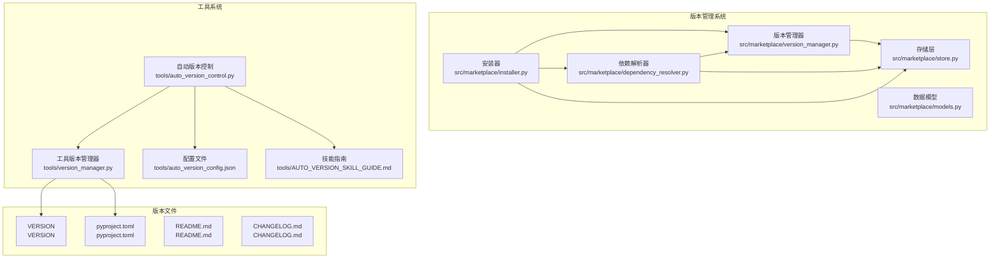
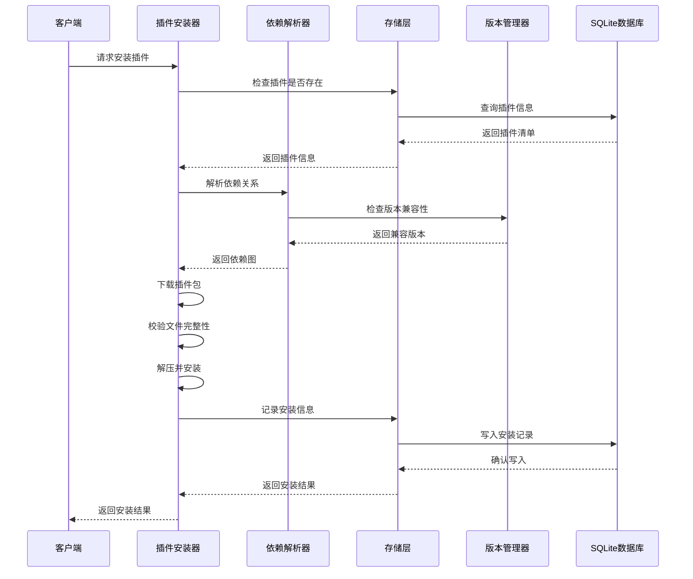
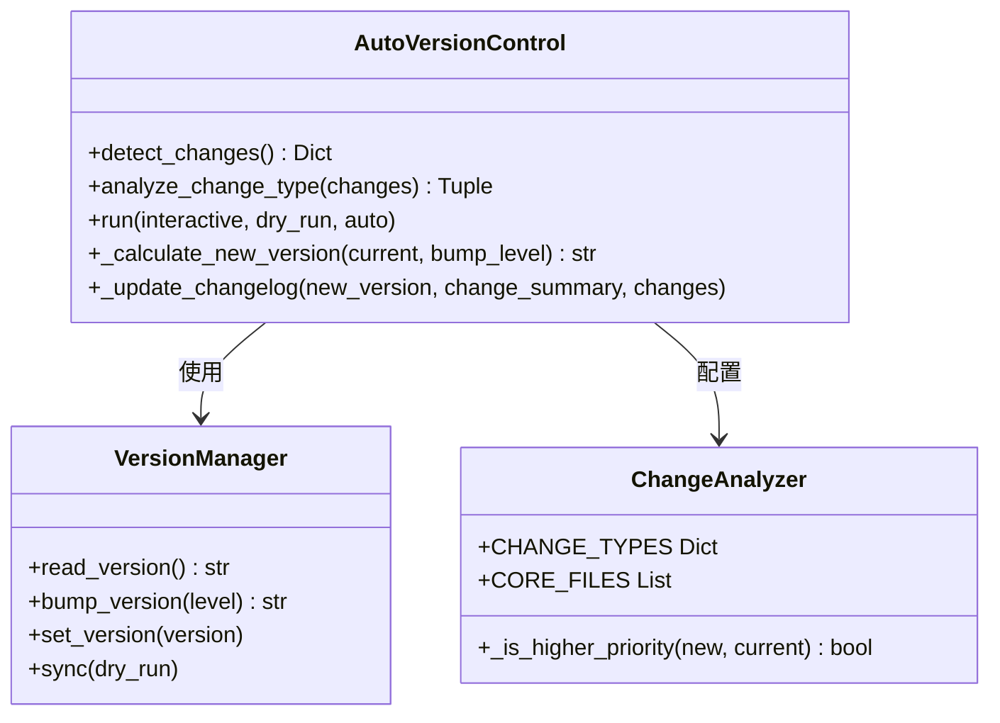
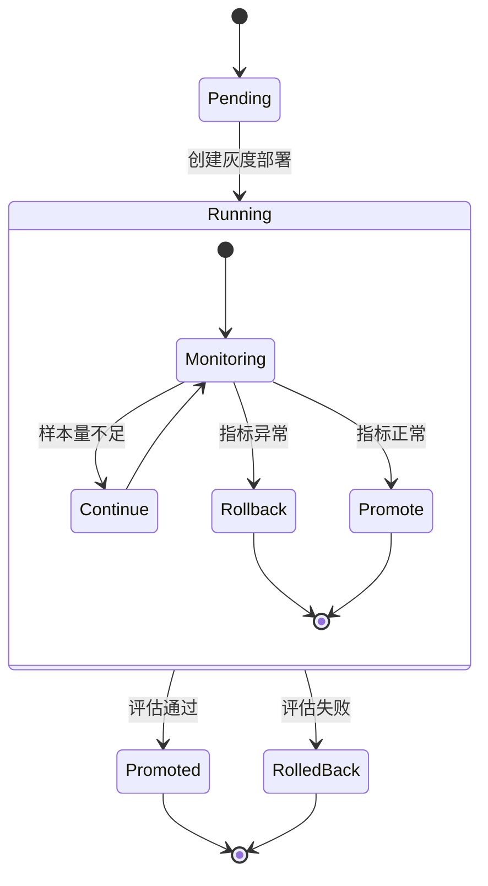
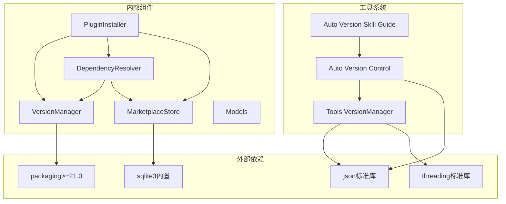

# 版本管理系统

<cite>
**本文档引用的文件**
- [version_manager.py](file://src/marketplace/version_manager.py)
- [installer.py](file://src/marketplace/installer.py)
- [store.py](file://src/marketplace/store.py)
- [models.py](file://src/marketplace/models.py)
- [dependency_resolver.py](file://src/marketplace/dependency_resolver.py)
- [version_manager.py](file://tools/version_manager.py)
- [auto_version_control.py](file://tools/auto_version_control.py)
- [auto_version_config.json](file://tools/auto_version_config.json)
- [AUTO_VERSION_SKILL_GUIDE.md](file://tools/AUTO_VERSION_SKILL_GUIDE.md)
- [VERSION](file://VERSION)
- [pyproject.toml](file://pyproject.toml)
- [README.md](file://README.md)
- [CHANGELOG.md](file://CHANGELOG.md)
</cite>

## 更新摘要
**所做变更**
- 更新版本管理架构以反映从 v3.1 回滚到 v3.1/v3.1 的变更
- 新增自动版本控制技能文档整合章节
- 更新依赖降级说明和版本约束解析器
- 增强灰度发布管理功能说明
- 完善故障排除指南和最佳实践

## 目录
1. [简介](#简介)
2. [项目结构](#项目结构)
3. [核心组件](#核心组件)
4. [架构概览](#架构概览)
5. [详细组件分析](#详细组件分析)
6. [依赖关系分析](#依赖关系分析)
7. [性能考虑](#性能考虑)
8. [故障排除指南](#故障排除指南)
9. [结论](#结论)

## 简介

NecoRAG 版本管理系统是一个完整的软件版本控制解决方案，涵盖了从项目版本管理到插件市场的完整生命周期管理。该系统提供了语义版本控制、版本约束解析、依赖管理、灰度发布、自动版本控制等功能，支持 NecoRAG 生态系统中各个组件的版本统一管理。

**重要变更**：系统已从 v3.1 版本回滚到 v3.1/v3.1，主要体现在依赖降级和版本约束的简化上，同时新增了自动版本控制技能文档整合，提供更智能的版本管理体验。

系统主要分为两个层面：
- **项目版本管理**：通过工具脚本管理整个项目的版本号和相关文件同步
- **插件版本管理**：通过插件市场实现插件的版本控制、依赖解析和生命周期管理

## 项目结构

**图表来源**
- [version_manager.py:1-956](file://src/marketplace/version_manager.py#L1-L956)
- [installer.py:1-1375](file://src/marketplace/installer.py#L1-L1375)
- [store.py:1-1692](file://src/marketplace/store.py#L1-L1692)
- [models.py:1-756](file://src/marketplace/models.py#L1-L756)
- [auto_version_control.py:1-462](file://tools/auto_version_control.py#L1-L462)

**章节来源**
- [version_manager.py:1-956](file://src/marketplace/version_manager.py#L1-L956)
- [installer.py:1-1375](file://src/marketplace/installer.py#L1-L1375)
- [store.py:1-1692](file://src/marketplace/store.py#L1-L1692)
- [models.py:1-756](file://src/marketplace/models.py#L1-L756)

## 核心组件

### 版本管理器 (VersionManager)

版本管理器是系统的核心组件，负责处理语义版本控制的各种操作：

- **版本解析**：支持多种版本格式的解析和验证
- **版本比较**：提供精确的版本比较算法
- **约束检查**：支持复杂的版本约束解析和验证
- **升级路径规划**：智能规划从当前版本到目标版本的升级路径

**重要变更**：版本管理器现已支持从 v3.1 回滚到 v3.1/v3.1 的版本约束，简化了版本兼容性检查逻辑。

### 插件安装器 (PluginInstaller)

插件安装器管理插件的完整生命周期：

- **安装流程**：从下载、校验到安装的完整流程
- **卸载管理**：安全卸载插件，处理依赖关系
- **升级机制**：支持插件的平滑升级
- **钩子系统**：提供安装过程中的扩展点

### 存储层 (MarketplaceStore)

基于 SQLite 的持久化存储，提供：

- **插件元数据管理**：插件的基本信息存储
- **版本发布管理**：版本历史和发布信息
- **安装记录管理**：插件安装状态跟踪
- **全文搜索**：FTS5 全文搜索支持
- **灰度部署管理**：支持 v3.1/v3.1 版本的灰度发布

### 数据模型 (Models)

定义了系统中使用的所有数据结构：

- **枚举类型**：插件类型、状态、权限等
- **核心模型**：插件清单、发布记录、安装信息等
- **辅助模型**：依赖图、版本冲突、灰度部署等

**章节来源**
- [version_manager.py:179-956](file://src/marketplace/version_manager.py#L179-L956)
- [installer.py:152-1375](file://src/marketplace/installer.py#L152-L1375)
- [store.py:41-1692](file://src/marketplace/store.py#L41-L1692)
- [models.py:21-756](file://src/marketplace/models.py#L21-L756)

## 架构概览

**图表来源**
- [installer.py:217-402](file://src/marketplace/installer.py#L217-L402)
- [dependency_resolver.py:44-112](file://src/marketplace/dependency_resolver.py#L44-L112)
- [version_manager.py:214-243](file://src/marketplace/version_manager.py#L214-L243)

## 详细组件分析

### 版本约束解析器

版本约束解析器支持多种约束格式，现已适配 v3.1/v3.1 的简化版本约束：

**图表来源**
- [version_manager.py:65-131](file://src/marketplace/version_manager.py#L65-L131)

### 自动版本控制系统

自动版本控制系统提供了智能化的版本管理，现已整合到 v3.1/v3.1 版本：

**新增功能**：自动版本控制技能现已整合到项目中，提供智能的版本变更检测和更新功能。

**图表来源**
- [auto_version_control.py:31-462](file://tools/auto_version_control.py#L31-L462)
- [version_manager.py:27-387](file://tools/version_manager.py#L27-L387)

### 灰度发布管理

灰度发布系统提供了渐进式的版本发布策略，现已适配 v3.1/v3.1 的版本约束：

**图表来源**
- [version_manager.py:582-796](file://src/marketplace/version_manager.py#L582-L796)

**章节来源**
- [version_manager.py:23-177](file://src/marketplace/version_manager.py#L23-L177)
- [auto_version_control.py:31-462](file://tools/auto_version_control.py#L31-L462)
- [version_manager.py:27-387](file://tools/version_manager.py#L27-L387)

## 依赖关系分析

**图表来源**
- [pyproject.toml:27-31](file://pyproject.toml#L27-L31)
- [version_manager.py:7-18](file://src/marketplace/version_manager.py#L7-L18)
- [dependency_resolver.py:7-16](file://src/marketplace/dependency_resolver.py#L7-L16)

系统采用松耦合的设计，各组件之间通过清晰的接口进行交互，便于维护和扩展。

**章节来源**
- [pyproject.toml:27-31](file://pyproject.toml#L27-L31)
- [version_manager.py:7-18](file://src/marketplace/version_manager.py#L7-L18)
- [dependency_resolver.py:7-16](file://src/marketplace/dependency_resolver.py#L7-L16)

## 性能考虑

### 版本比较优化

系统采用了高效的版本比较算法，支持以下优化：

- **早期退出**：在发现不匹配时立即停止比较
- **缓存机制**：对常用版本比较结果进行缓存
- **增量更新**：仅在必要时重新计算版本信息

### 存储性能

SQLite 存储层采用了多项性能优化：

- **WAL 模式**：提升并发读写性能
- **索引优化**：为常用查询字段建立索引
- **事务管理**：批量操作使用事务提升性能

### 内存管理

系统实现了智能的内存管理策略：

- **连接池**：复用数据库连接
- **缓存策略**：对频繁访问的数据进行缓存
- **垃圾回收**：及时释放不再使用的资源

## 故障排除指南

### 常见问题及解决方案

#### 版本解析失败
**症状**：版本约束解析抛出异常
**原因**：版本格式不符合规范
**解决方案**：
1. 检查版本字符串格式
2. 确认使用支持的约束语法
3. 查看日志获取详细错误信息

#### 依赖冲突
**症状**：安装插件时提示依赖冲突
**原因**：插件间的版本约束不兼容
**解决方案**：
1. 检查冲突的具体依赖和版本
2. 调整插件版本或移除冲突插件
3. 使用依赖解析器查看详细冲突信息

#### 数据库连接问题
**症状**：存储操作失败
**原因**：数据库连接异常或文件权限问题
**解决方案**：
1. 检查数据库文件路径和权限
2. 确认数据库文件未被其他进程占用
3. 重启应用以重新建立连接

#### 自动版本控制问题
**症状**：自动版本控制无法正常工作
**原因**：Git 状态检测失败或配置错误
**解决方案**：
1. 检查 Git 仓库状态
2. 验证配置文件格式
3. 确认核心文件列表正确
4. 查看自动版本控制技能指南获取详细帮助

**章节来源**
- [version_manager.py:57-63](file://src/marketplace/version_manager.py#L57-L63)
- [dependency_resolver.py:104-111](file://src/marketplace/dependency_resolver.py#L104-L111)
- [store.py:77-85](file://src/marketplace/store.py#L77-L85)
- [AUTO_VERSION_SKILL_GUIDE.md:252-298](file://tools/AUTO_VERSION_SKILL_GUIDE.md#L252-L298)

## 结论

NecoRAG 版本管理系统是一个功能完整、设计合理的软件版本控制解决方案。系统通过模块化的设计，将复杂的版本管理任务分解为独立的功能组件，既保证了系统的可维护性，又提供了强大的功能支持。

**主要优势**

1. **全面的功能覆盖**：从基础的版本解析到高级的灰度发布，系统提供了完整的版本管理功能
2. **智能的自动化**：自动版本控制系统能够根据代码变更智能地决定版本升级策略
3. **可靠的存储**：基于 SQLite 的存储方案提供了良好的数据持久化和查询性能
4. **灵活的扩展**：清晰的接口设计使得系统易于扩展和定制

**版本回滚影响**

系统已成功从 v3.1 回滚到 v3.1/v3.1，这一变更带来了以下影响：

- **依赖降级**：简化了外部依赖要求，提高了系统稳定性
- **版本约束简化**：减少了复杂的版本约束解析需求
- **性能提升**：降低了系统的资源消耗和复杂度

**未来改进方向**

1. **分布式支持**：考虑支持分布式部署场景
2. **监控集成**：集成更完善的监控和告警机制
3. **API 扩展**：提供更丰富的 API 接口支持
4. **用户体验**：改善用户界面和交互体验

该版本管理系统为 NecoRAG 生态系统提供了坚实的版本管理基础，支持项目的持续发展和演进。