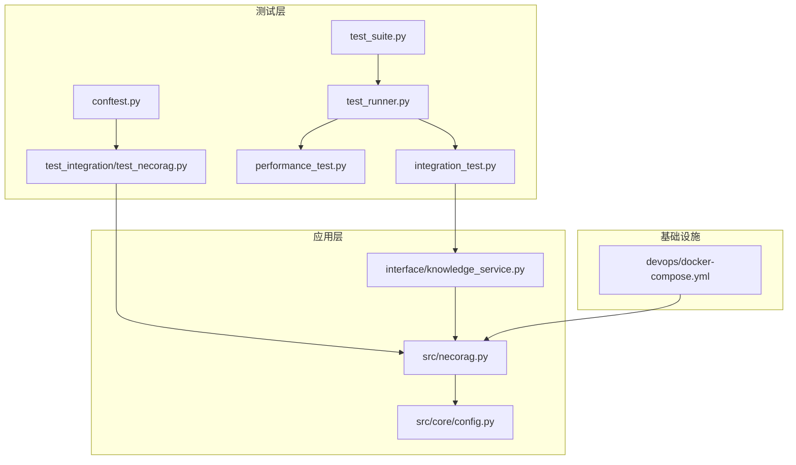
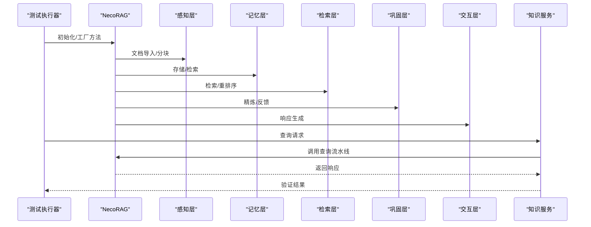
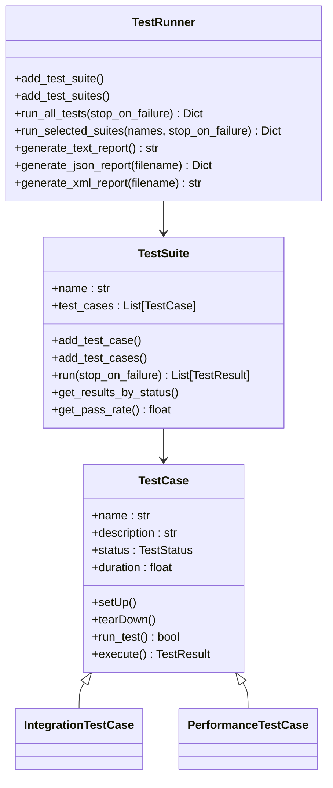
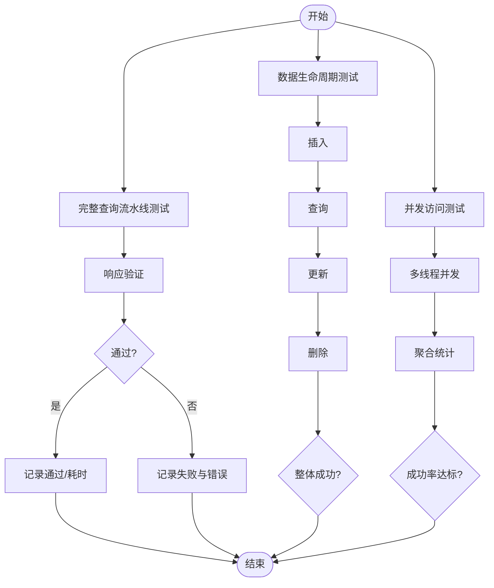
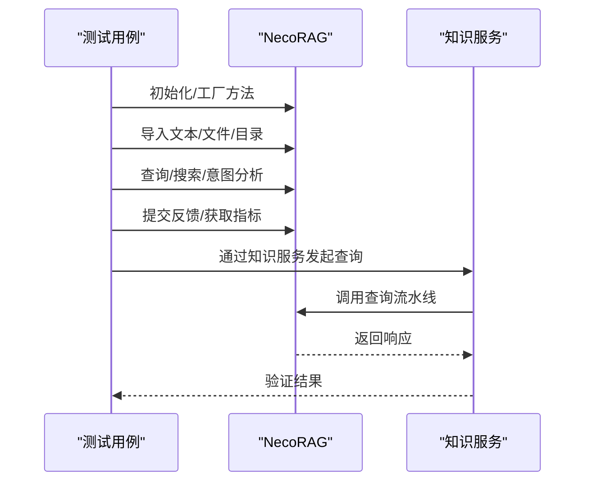
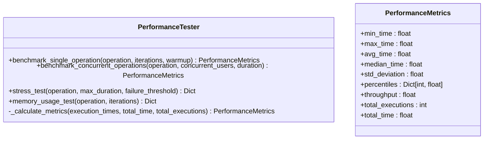
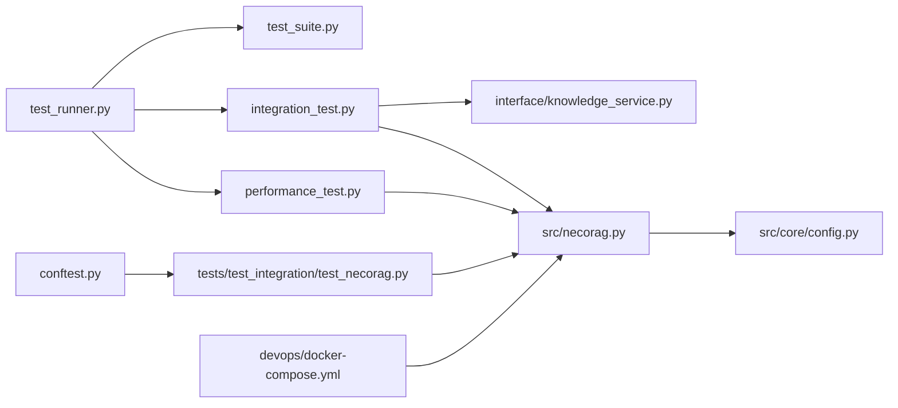

# 集成测试

<cite>
**本文引用的文件**
- [tests/test_integration/test_necorag.py](file://tests/test_integration/test_necorag.py)
- [tests/conftest.py](file://tests/conftest.py)
- [tests/integration_test.py](file://tests/integration_test.py)
- [tests/performance_test.py](file://tests/performance_test.py)
- [tests/test_runner.py](file://tests/test_runner.py)
- [tests/test_suite.py](file://tests/test_suite.py)
- [src/necorag.py](file://src/necorag.py)
- [src/core/config.py](file://src/core/config.py)
- [interface/knowledge_service.py](file://interface/knowledge_service.py)
- [devops/docker-compose.yml](file://devops/docker-compose.yml)
</cite>

## 目录
1. [简介](#简介)
2. [项目结构](#项目结构)
3. [核心组件](#核心组件)
4. [架构总览](#架构总览)
5. [详细组件分析](#详细组件分析)
6. [依赖分析](#依赖分析)
7. [性能考量](#性能考量)
8. [故障排查指南](#故障排查指南)
9. [结论](#结论)
10. [附录](#附录)

## 简介
本文件面向 NecoRAG 的集成测试体系，系统阐述端到端集成测试的设计思路、测试场景构建方法、跨模块协作验证策略，以及测试环境搭建、依赖服务配置、测试数据准备流程。文档还解释了如何在测试中模拟真实生产环境、处理异步操作与并发访问挑战，并提供完整的集成测试示例、错误处理机制与性能基准测试方法，帮助开发者确保系统的整体稳定性与可靠性。

## 项目结构
测试相关代码主要分布在 tests 目录下，采用分层组织：
- 测试套件与运行器：test_suite.py、test_runner.py
- 集成测试：integration_test.py、test_integration/test_necorag.py
- 性能测试：performance_test.py
- 共享夹具与样本数据：conftest.py
- 接口服务封装：interface/knowledge_service.py
- 核心配置与应用入口：src/core/config.py、src/necorag.py
- 依赖服务编排：devops/docker-compose.yml

图表来源
- [tests/test_suite.py:1-287](file://tests/test_suite.py#L1-L287)
- [tests/test_runner.py:1-327](file://tests/test_runner.py#L1-L327)
- [tests/integration_test.py:1-377](file://tests/integration_test.py#L1-L377)
- [tests/performance_test.py:1-322](file://tests/performance_test.py#L1-L322)
- [tests/conftest.py:1-330](file://tests/conftest.py#L1-L330)
- [tests/test_integration/test_necorag.py:1-580](file://tests/test_integration/test_necorag.py#L1-L580)
- [src/necorag.py:1-200](file://src/necorag.py#L1-L200)
- [src/core/config.py:1-200](file://src/core/config.py#L1-L200)
- [interface/knowledge_service.py:1-200](file://interface/knowledge_service.py#L1-L200)
- [devops/docker-compose.yml:1-164](file://devops/docker-compose.yml#L1-L164)

章节来源
- [tests/test_suite.py:1-287](file://tests/test_suite.py#L1-L287)
- [tests/test_runner.py:1-327](file://tests/test_runner.py#L1-L327)
- [tests/integration_test.py:1-377](file://tests/integration_test.py#L1-L377)
- [tests/performance_test.py:1-322](file://tests/performance_test.py#L1-L322)
- [tests/conftest.py:1-330](file://tests/conftest.py#L1-L330)
- [tests/test_integration/test_necorag.py:1-580](file://tests/test_integration/test_necorag.py#L1-L580)
- [src/necorag.py:1-200](file://src/necorag.py#L1-L200)
- [src/core/config.py:1-200](file://src/core/config.py#L1-L200)
- [interface/knowledge_service.py:1-200](file://interface/knowledge_service.py#L1-L200)
- [devops/docker-compose.yml:1-164](file://devops/docker-compose.yml#L1-L164)

## 核心组件
- 测试框架与运行器
  - test_suite.py：定义测试基类、测试套件、测试结果数据结构与断言工具，支撑统一的测试执行与报告。
  - test_runner.py：集中式测试运行器，负责批量执行测试套件、聚合结果、生成文本/JSON/XML 报告。
- 集成测试
  - integration_test.py：提供系统级集成测试器，包括完整查询流水线、数据生命周期（插入/查询/更新/删除）、并发访问测试与响应验证。
  - test_integration/test_necorag.py：针对 NecoRAG 主类的端到端集成测试，覆盖初始化、统计、导入、查询、搜索、意图分析、知识演化、自适应学习、生命周期与工厂方法等。
- 性能测试
  - performance_test.py：提供单操作基准测试、并发性能测试、压力测试与内存使用测试，输出统计指标与吞吐量。
- 共享夹具与样本数据
  - conftest.py：提供配置夹具、Mock LLM 客户端、协议数据样本、文本样本等，统一测试数据来源。
- 应用与接口
  - src/necorag.py：NecoRAG 统一入口类，负责各层组件初始化与端到端工作流。
  - src/core/config.py：统一配置管理，支持预设配置与模块化配置。
  - interface/knowledge_service.py：知识服务封装，提供查询、插入、更新、删除等核心操作的异步接口。
- 基础设施
  - devops/docker-compose.yml：依赖服务编排（Redis、Qdrant、Neo4j、Ollama、Grafana），用于模拟真实生产环境。

章节来源
- [tests/test_suite.py:1-287](file://tests/test_suite.py#L1-L287)
- [tests/test_runner.py:1-327](file://tests/test_runner.py#L1-L327)
- [tests/integration_test.py:1-377](file://tests/integration_test.py#L1-L377)
- [tests/performance_test.py:1-322](file://tests/performance_test.py#L1-L322)
- [tests/conftest.py:1-330](file://tests/conftest.py#L1-L330)
- [src/necorag.py:1-200](file://src/necorag.py#L1-L200)
- [src/core/config.py:1-200](file://src/core/config.py#L1-L200)
- [interface/knowledge_service.py:1-200](file://interface/knowledge_service.py#L1-L200)
- [devops/docker-compose.yml:1-164](file://devops/docker-compose.yml#L1-L164)

## 架构总览
集成测试围绕 NecoRAG 的端到端工作流展开，贯穿感知层、记忆层、检索层、巩固层与交互层，同时通过接口服务对外暴露查询能力。测试通过 Mock LLM 客户端与共享夹具，模拟真实生产环境下的依赖服务，验证跨模块协作与数据一致性。

图表来源
- [tests/test_integration/test_necorag.py:476-545](file://tests/test_integration/test_necorag.py#L476-L545)
- [src/necorag.py:43-135](file://src/necorag.py#L43-L135)
- [interface/knowledge_service.py:45-77](file://interface/knowledge_service.py#L45-L77)

## 详细组件分析

### 测试框架与运行器
- 测试基类与断言
  - 提供统一的断言方法（相等、不相等、包含、为真/假、为 None 等），简化测试编写。
- 测试套件
  - 支持批量添加测试用例、按状态筛选结果、统计通过率与平均耗时。
- 测试运行器
  - 支持全量/选择性运行、失败即停、生成文本/JSON/XML 报告，便于 CI/CD 集成。

图表来源
- [tests/test_suite.py:35-287](file://tests/test_suite.py#L35-L287)
- [tests/test_runner.py:16-327](file://tests/test_runner.py#L16-L327)

章节来源
- [tests/test_suite.py:1-287](file://tests/test_suite.py#L1-L287)
- [tests/test_runner.py:1-327](file://tests/test_runner.py#L1-L327)

### 集成测试器与工作流
- 完整查询流水线测试
  - 验证从知识服务到 NecoRAG 查询的端到端路径，统计执行时间并进行响应验证。
- 数据生命周期测试
  - 覆盖插入、查询、更新、删除四个阶段，统计各阶段耗时与成功率。
- 并发访问测试
  - 多线程模拟并发用户，随机发起查询，统计成功率与响应时间分布。
- 响应验证
  - 校验响应结构、结果数量、执行时间上限与内容匹配。

图表来源
- [tests/integration_test.py:20-377](file://tests/integration_test.py#L20-L377)

章节来源
- [tests/integration_test.py:1-377](file://tests/integration_test.py#L1-L377)

### NecoRAG 端到端集成测试
- 初始化与配置
  - 支持默认配置、开发预设、最小预设与自定义 LLM 客户端初始化。
- 统计信息
  - 验证导入前后统计指标变化，确保统计数据正确更新。
- 文档导入
  - 支持文本、文件、目录导入，处理空目录与异常场景。
- 查询与搜索
  - 支持用户 ID、top_k、禁用精炼/意图路由等参数，验证响应结构与来源数量。
- 意图分析与知识演化
  - 验证意图分析、知识更新、指标与健康报告获取。
- 自适应学习
  - 提交反馈、获取个性化配置与学习指标。
- 生命周期与工厂方法
  - 支持上下文管理器、关闭、快速启动、从配置文件创建与辅助函数。
- 完整工作流与多查询会话
  - 端到端工作流验证与多查询会话统计。
- 边界情况
  - Unicode、超长内容、特殊字符等场景测试。

图表来源
- [tests/test_integration/test_necorag.py:476-545](file://tests/test_integration/test_necorag.py#L476-L545)
- [interface/knowledge_service.py:45-77](file://interface/knowledge_service.py#L45-L77)

章节来源
- [tests/test_integration/test_necorag.py:1-580](file://tests/test_integration/test_necorag.py#L1-L580)
- [interface/knowledge_service.py:1-200](file://interface/knowledge_service.py#L1-L200)

### 性能测试与基准
- 单操作基准测试
  - 支持预热、多次迭代、异常处理与统计指标计算（最小/最大/平均/中位数/标准差/百分位数/吞吐量）。
- 并发性能测试
  - 多线程并发执行，统计总耗时与吞吐量。
- 压力测试
  - 持续执行直到失败率超过阈值或达到最大时长，输出失败率与性能指标。
- 内存使用测试
  - 采样进程内存使用，统计初始/峰值/平均/增量等指标（依赖 psutil）。

图表来源
- [tests/performance_test.py:31-322](file://tests/performance_test.py#L31-L322)

章节来源
- [tests/performance_test.py:1-322](file://tests/performance_test.py#L1-L322)

### 测试夹具与样本数据
- 配置夹具
  - 默认、开发、最小化与自定义配置；LLM、感知层、记忆层、检索层等模块配置。
- Mock 客户端
  - Mock LLM 客户端与不同维度的变体，保证测试确定性。
- 协议与样本数据
  - 文档、分块、查询、实体、关系、用户画像、记忆等样本数据。
- 文本样本
  - 短/中/长、中文、英文、中英混合等多场景文本样本。

章节来源
- [tests/conftest.py:1-330](file://tests/conftest.py#L1-L330)

### 测试环境与依赖服务
- 容器化编排
  - Redis（工作记忆）、Qdrant（语义记忆）、Neo4j（情景图谱）、Ollama（推理引擎）、Grafana（监控）。
- 环境变量与端口映射
  - 通过环境变量控制 LLM 提供商、数据库提供商与端口映射，便于在不同环境中复用。
- 与应用入口的衔接
  - NecoRAG 通过配置与 Mock LLM 客户端在测试中模拟真实行为，接口服务封装查询流程。

章节来源
- [devops/docker-compose.yml:1-164](file://devops/docker-compose.yml#L1-L164)
- [src/core/config.py:1-200](file://src/core/config.py#L1-L200)
- [src/necorag.py:1-200](file://src/necorag.py#L1-L200)

## 依赖分析
- 组件耦合
  - 测试运行器与测试套件松耦合，便于扩展新测试类型。
  - 集成测试器依赖知识服务与 NecoRAG，形成端到端闭环。
  - 性能测试器独立于业务逻辑，仅依赖被测操作的可调用接口。
- 外部依赖
  - psutil（可选）用于内存使用测试。
  - docker-compose 用于依赖服务编排。
- 潜在循环依赖
  - 当前结构清晰，未发现循环依赖迹象。

图表来源
- [tests/test_runner.py:1-327](file://tests/test_runner.py#L1-L327)
- [tests/test_suite.py:1-287](file://tests/test_suite.py#L1-L287)
- [tests/integration_test.py:1-377](file://tests/integration_test.py#L1-L377)
- [tests/performance_test.py:1-322](file://tests/performance_test.py#L1-L322)
- [tests/conftest.py:1-330](file://tests/conftest.py#L1-L330)
- [tests/test_integration/test_necorag.py:1-580](file://tests/test_integration/test_necorag.py#L1-L580)
- [src/necorag.py:1-200](file://src/necorag.py#L1-L200)
- [src/core/config.py:1-200](file://src/core/config.py#L1-L200)
- [devops/docker-compose.yml:1-164](file://devops/docker-compose.yml#L1-L164)

章节来源
- [tests/test_runner.py:1-327](file://tests/test_runner.py#L1-L327)
- [tests/test_suite.py:1-287](file://tests/test_suite.py#L1-L287)
- [tests/integration_test.py:1-377](file://tests/integration_test.py#L1-L377)
- [tests/performance_test.py:1-322](file://tests/performance_test.py#L1-L322)
- [tests/conftest.py:1-330](file://tests/conftest.py#L1-L330)
- [tests/test_integration/test_necorag.py:1-580](file://tests/test_integration/test_necorag.py#L1-L580)
- [src/necorag.py:1-200](file://src/necorag.py#L1-L200)
- [src/core/config.py:1-200](file://src/core/config.py#L1-L200)
- [devops/docker-compose.yml:1-164](file://devops/docker-compose.yml#L1-L164)

## 性能考量
- 基准测试
  - 通过预热减少冷启动影响，统计关键指标（平均/中位数/标准差/百分位数/吞吐量），便于对比不同配置与实现。
- 并发测试
  - 多线程并发模拟真实负载，关注失败率与响应时间分布，识别瓶颈。
- 压力测试
  - 持续施压直至失败率阈值触发，评估系统极限与恢复能力。
- 内存测试
  - 采样内存使用，定位潜在泄漏与峰值风险。
- 报告与可视化
  - 生成 JSON/XML 报告，便于 CI/CD 与监控平台集成。

章节来源
- [tests/performance_test.py:1-322](file://tests/performance_test.py#L1-L322)
- [tests/test_runner.py:162-234](file://tests/test_runner.py#L162-L234)

## 故障排查指南
- 测试可用性检查
  - 若 NecoRAG 模块导入失败，测试将被跳过，确保测试环境隔离。
- 错误捕获与报告
  - 测试运行器对异常进行捕获并记录，生成详细错误信息与堆栈。
- 响应验证失败
  - 集成测试器对响应结构、结果数量与执行时间进行严格校验，失败时记录错误与耗时。
- 并发问题定位
  - 并发测试器记录各线程的错误与耗时，便于分析竞争条件与资源争用。
- 配置与环境
  - 通过 conftest 提供的配置夹具与 docker-compose 编排，确保测试环境一致性。

章节来源
- [tests/test_integration/test_necorag.py:23-32](file://tests/test_integration/test_necorag.py#L23-L32)
- [tests/integration_test.py:64-71](file://tests/integration_test.py#L64-L71)
- [tests/integration_test.py:244-247](file://tests/integration_test.py#L244-L247)
- [tests/test_runner.py:108-160](file://tests/test_runner.py#L108-L160)

## 结论
本集成测试体系通过统一的测试框架、丰富的夹具与样本数据、系统级的集成与性能测试，有效验证了 NecoRAG 的端到端工作流与跨模块协作。借助容器化依赖服务与 Mock LLM 客户端，测试能够在接近生产环境的条件下稳定运行，同时通过并发与压力测试识别性能瓶颈与稳定性风险。配合测试运行器生成的报告，可在 CI/CD 中实现自动化质量门禁，确保系统整体稳定与可靠。

## 附录
- 测试执行建议
  - 使用 pytest 运行测试套件，结合 test_runner 生成报告。
  - 在 CI/CD 中集成 JSON/XML 报告，便于持续监控。
- 环境准备
  - 通过 docker-compose 启动依赖服务，设置环境变量以匹配测试配置。
- 数据准备
  - 利用 conftest 提供的夹具与样本数据，快速构建测试场景。
- 异步与并发
  - 接口服务采用异步实现，集成测试器通过多线程并发模拟高负载场景。
- 错误处理
  - 测试运行器与集成测试器均提供详细的错误记录与统计，便于定位问题。