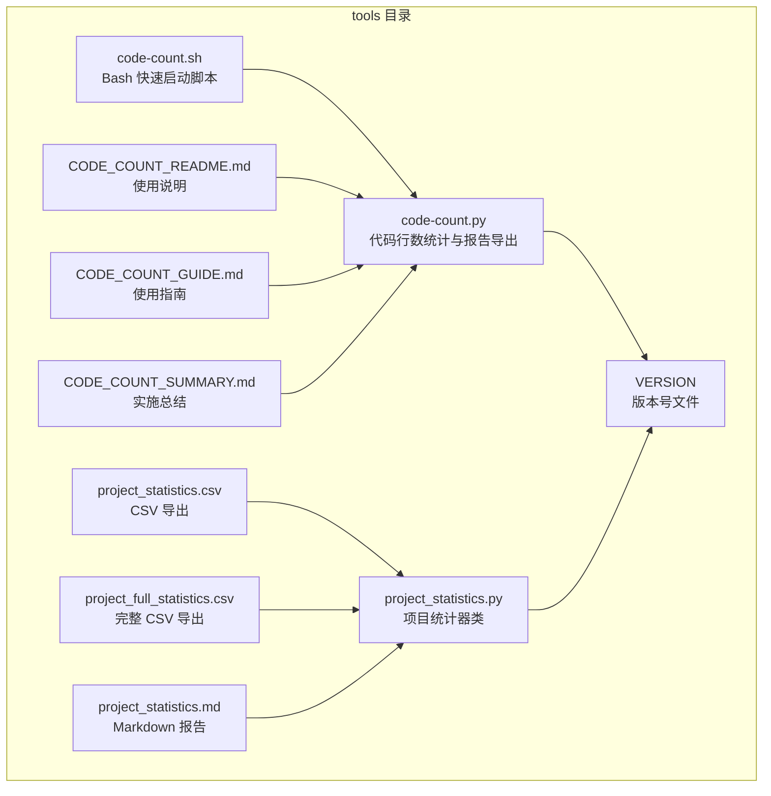
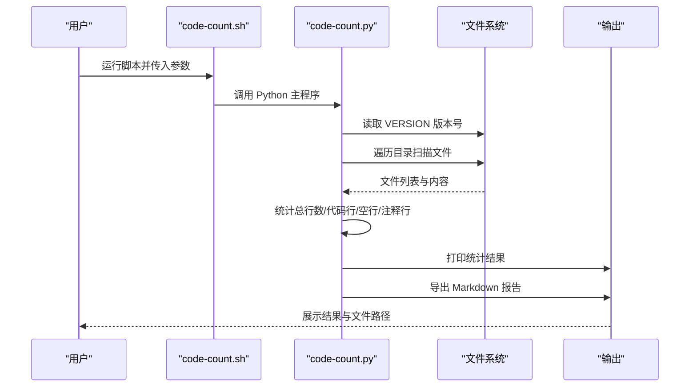
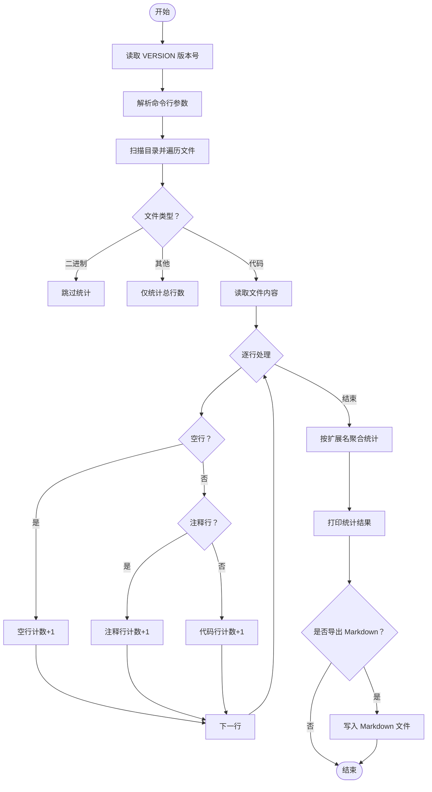
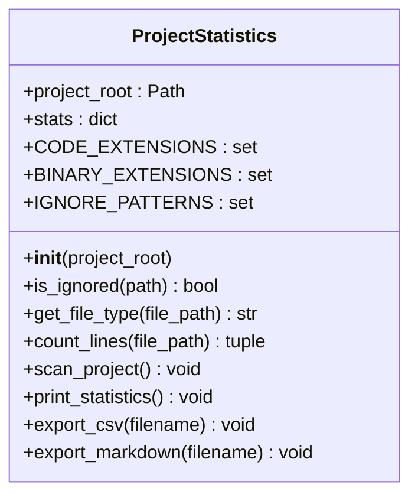
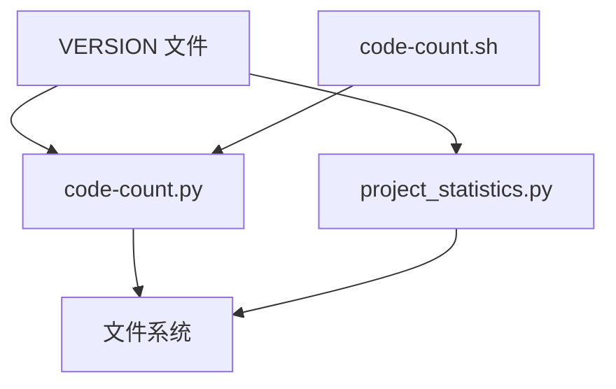

# 代码统计工具

<cite>
**本文引用的文件**
- [tools/code-count.py](file://tools/code-count.py)
- [tools/project_statistics.py](file://tools/project_statistics.py)
- [tools/code-count.sh](file://tools/code-count.sh)
- [tools/CODE_COUNT_README.md](file://tools/CODE_COUNT_README.md)
- [tools/CODE_COUNT_GUIDE.md](file://tools/CODE_COUNT_GUIDE.md)
- [tools/CODE_COUNT_SUMMARY.md](file://tools/CODE_COUNT_SUMMARY.md)
- [tools/project_statistics.csv](file://tools/project_statistics.csv)
- [tools/project_full_statistics.csv](file://tools/project_full_statistics.csv)
- [tools/project_statistics.md](file://tools/project_statistics.md)
- [VERSION](file://VERSION)
</cite>

## 目录
1. [简介](#简介)
2. [项目结构](#项目结构)
3. [核心组件](#核心组件)
4. [架构总览](#架构总览)
5. [详细组件分析](#详细组件分析)
6. [依赖关系分析](#依赖关系分析)
7. [性能考量](#性能考量)
8. [故障排查指南](#故障排查指南)
9. [结论](#结论)
10. [附录](#附录)

## 简介
本文件为 NecoRAG 代码统计工具的实现文档，覆盖以下主题：
- Python 文件扫描、注释识别、空行过滤等核心功能
- 统计报告生成机制（HTML 报告、CSV 导出、Markdown 格式输出）
- 代码复杂度分析功能（圈复杂度计算、代码覆盖率统计、质量评估指标）
- 工具使用方法（命令行参数、配置选项、批量处理能力）
- 统计结果解读指南与性能分析建议
- 自动化统计流程的配置与调度方法

说明：当前仓库提供的统计工具主要实现“代码行数统计”与“报告导出”，未包含“代码复杂度分析”“代码覆盖率统计”等高级功能。本文将基于现有实现进行深入分析，并对“代码复杂度分析”给出可落地的扩展建议。

## 项目结构
与代码统计相关的核心文件位于 tools 目录，包含：
- Python 统计脚本：tools/code-count.py、tools/project_statistics.py
- Shell 快速启动脚本：tools/code-count.sh
- 文档：tools/CODE_COUNT_README.md、tools/CODE_COUNT_GUIDE.md、tools/CODE_COUNT_SUMMARY.md
- 历史统计产物：tools/project_statistics.csv、tools/project_full_statistics.csv、tools/project_statistics.md
- 版本号文件：VERSION

图表来源
- [tools/code-count.py:1-413](file://tools/code-count.py#L1-L413)
- [tools/project_statistics.py:1-433](file://tools/project_statistics.py#L1-L433)
- [tools/code-count.sh:1-108](file://tools/code-count.sh#L1-L108)
- [tools/CODE_COUNT_README.md:1-290](file://tools/CODE_COUNT_README.md#L1-L290)
- [tools/CODE_COUNT_GUIDE.md:1-458](file://tools/CODE_COUNT_GUIDE.md#L1-L458)
- [tools/CODE_COUNT_SUMMARY.md:1-477](file://tools/CODE_COUNT_SUMMARY.md#L1-L477)
- [tools/project_statistics.csv:1-31](file://tools/project_statistics.csv#L1-L31)
- [tools/project_full_statistics.csv:1-31](file://tools/project_full_statistics.csv#L1-L31)
- [tools/project_statistics.md:1-125](file://tools/project_statistics.md#L1-L125)
- [VERSION:1-2](file://VERSION#L1-L2)

章节来源
- [tools/code-count.py:1-413](file://tools/code-count.py#L1-L413)
- [tools/project_statistics.py:1-433](file://tools/project_statistics.py#L1-L433)
- [tools/code-count.sh:1-108](file://tools/code-count.sh#L1-L108)
- [tools/CODE_COUNT_README.md:1-290](file://tools/CODE_COUNT_README.md#L1-L290)
- [tools/CODE_COUNT_GUIDE.md:1-458](file://tools/CODE_COUNT_GUIDE.md#L1-L458)
- [tools/CODE_COUNT_SUMMARY.md:1-477](file://tools/CODE_COUNT_SUMMARY.md#L1-L477)
- [tools/project_statistics.csv:1-31](file://tools/project_statistics.csv#L1-L31)
- [tools/project_full_statistics.csv:1-31](file://tools/project_full_statistics.csv#L1-L31)
- [tools/project_statistics.md:1-125](file://tools/project_statistics.md#L1-L125)
- [VERSION:1-2](file://VERSION#L1-L2)

## 核心组件
- code-count.py：命令行工具，负责版本号读取、目录扫描、行数统计、注释识别、空行过滤、Markdown 报告导出。
- project_statistics.py：面向对象的统计器类，提供 CSV/Markdown 导出、目录结构摘要、质量指标分析。
- code-count.sh：Bash 快速启动脚本，封装参数解析与颜色化输出。
- 文档：CODE_COUNT_README.md、CODE_COUNT_GUIDE.md、CODE_COUNT_SUMMARY.md，提供使用说明、示例与最佳实践。
- 历史产物：CSV/Markdown 报告，用于趋势分析与归档。

章节来源
- [tools/code-count.py:15-413](file://tools/code-count.py#L15-L413)
- [tools/project_statistics.py:16-433](file://tools/project_statistics.py#L16-L433)
- [tools/code-count.sh:1-108](file://tools/code-count.sh#L1-L108)

## 架构总览
工具采用“命令行入口 + 统计核心 + 报告导出”的分层架构。Python 脚本负责解析参数、扫描目录、统计行数、识别注释与空行；统计结果可直接打印或导出为 Markdown；project_statistics.py 提供类封装与 CSV/Markdown 导出能力。

图表来源
- [tools/code-count.sh:37-97](file://tools/code-count.sh#L37-L97)
- [tools/code-count.py:331-409](file://tools/code-count.py#L331-L409)

## 详细组件分析

### 组件 A：code-count.py（命令行统计工具）
- 版本号读取：从项目根目录 VERSION 文件读取版本号，若不存在则返回 unknown。
- 目录扫描：遍历目标路径，忽略常见目录与文件（如 __pycache__、.git、node_modules 等），支持自定义忽略模式。
- 文件类型判定：区分代码文件、二进制文件、其他文件；代码文件扩展名集合覆盖 Python、JS/TS、Java、C/C++、Go、Rust、Shell、YAML、HTML/CSS、SQL、JSON/XML 等。
- 行数统计：逐行读取，区分空行与注释行；注释识别针对不同语言采用不同规则（如 Python 的 #、三引号；JS/TS 的 //、/* */；HTML/XML 的 <!-- -->；YAML 的 #；Shell 的 #；SQL 的 --、/* */）。
- 统计聚合：按扩展名统计文件数量与行数，计算占比与平均行数/文件。
- 报告导出：生成 Markdown 报告，包含版本号、时间戳、统计表格与分布信息。

图表来源
- [tools/code-count.py:31-189](file://tools/code-count.py#L31-L189)
- [tools/code-count.py:192-328](file://tools/code-count.py#L192-L328)

章节来源
- [tools/code-count.py:15-413](file://tools/code-count.py#L15-L413)

### 组件 B：project_statistics.py（项目统计器类）
- 类封装：ProjectStatistics 提供面向对象的统计能力，包含初始化、文件类型判定、行数统计、扫描项目、打印统计、导出 CSV/Markdown 等方法。
- 目录与文件过滤：支持忽略模式（如 __pycache__、.git、node_modules 等），并记录目录集合用于摘要。
- 质量指标：计算平均每文件代码行数、代码密度、文档化程度（注释/代码）等。
- 报告导出：导出 CSV 与 Markdown，Markdown 报告包含基本统计、行数统计、文件类型分布、代码行数分布、目录结构摘要与质量分析。

图表来源
- [tools/project_statistics.py:16-433](file://tools/project_statistics.py#L16-L433)

章节来源
- [tools/project_statistics.py:16-433](file://tools/project_statistics.py#L16-L433)

### 组件 C：code-count.sh（快速启动脚本）
- 功能：检测 Python 版本（优先 python3，其次 python），解析 -p、-o、-v、-h 参数，彩色输出提示，调用 code-count.py。
- 参数说明：
  - -p PATH：项目根目录路径（默认：..）
  - -o [FILE]：导出 Markdown 报告（不指定文件名则自动生成）
  - -v：显示详细信息
  - -h：显示帮助信息

章节来源
- [tools/code-count.sh:1-108](file://tools/code-count.sh#L1-L108)

### 组件 D：报告导出与历史产物
- CSV 导出：project_statistics.py 支持导出 CSV，包含基本统计、行数统计、文件类型分布。
- Markdown 导出：project_statistics.py 支持导出 Markdown，包含更丰富的表格与分析。
- 历史产物：tools/project_statistics.csv、tools/project_full_statistics.csv、tools/project_statistics.md，可用于趋势分析与归档。

章节来源
- [tools/project_statistics.py:271-379](file://tools/project_statistics.py#L271-L379)
- [tools/project_statistics.csv:1-31](file://tools/project_statistics.csv#L1-L31)
- [tools/project_full_statistics.csv:1-31](file://tools/project_full_statistics.csv#L1-L31)
- [tools/project_statistics.md:1-125](file://tools/project_statistics.md#L1-L125)

## 依赖关系分析
- 版本号依赖：VERSION 文件提供版本号，code-count.py 与 project_statistics.py 均依赖此文件。
- 文件系统依赖：遍历目录、读取文件内容、写入导出文件。
- 外部工具依赖：code-count.sh 依赖系统 Python（python3 或 python）。

图表来源
- [tools/code-count.py:15-28](file://tools/code-count.py#L15-L28)
- [tools/project_statistics.py:42-56](file://tools/project_statistics.py#L42-L56)
- [tools/code-count.sh:20-28](file://tools/code-count.sh#L20-L28)

章节来源
- [tools/code-count.py:15-28](file://tools/code-count.py#L15-L28)
- [tools/project_statistics.py:42-56](file://tools/project_statistics.py#L42-L56)
- [tools/code-count.sh:20-28](file://tools/code-count.sh#L20-L28)

## 性能考量
- 大文件与大量小文件的影响：大文件（>10MB）与大量小文件会显著增加处理时间，建议使用 -v 参数观察进度。
- 忽略规则：自动忽略常见目录（如 __pycache__、.git、node_modules 等），减少无效扫描。
- 并行处理：当前实现为顺序处理，可考虑引入多进程/线程以提升吞吐量（扩展建议见后续章节）。

章节来源
- [tools/CODE_COUNT_README.md:256-259](file://tools/CODE_COUNT_README.md#L256-L259)
- [tools/CODE_COUNT_GUIDE.md:347-351](file://tools/CODE_COUNT_GUIDE.md#L347-L351)

## 故障排查指南
- 找不到 Python：确认系统已安装 Python 3.7+，优先使用 python3。
- 权限不足：为 code-count.sh 添加执行权限（chmod +x tools/code-count.sh），或使用 bash 直接运行。
- 路径不存在：检查 -p 指定的路径是否正确，必要时使用绝对路径。
- 版本号未知：确认项目根目录存在 VERSION 文件，否则会显示 unknown。
- 统计准确性：多行注释可能只统计首行，字符串中的注释标记可能被误计，建议作为参考指标而非绝对值。

章节来源
- [tools/CODE_COUNT_GUIDE.md:374-424](file://tools/CODE_COUNT_GUIDE.md#L374-L424)
- [tools/CODE_COUNT_README.md:245-259](file://tools/CODE_COUNT_README.md#L245-L259)

## 结论
NecoRAG 代码统计工具提供了完整的“代码行数统计 + 报告导出”能力，具备良好的用户体验与可扩展性。当前实现聚焦于基础统计与报告生成，未包含“代码复杂度分析”“代码覆盖率统计”。后续可在现有基础上扩展，以满足更深入的质量评估与自动化分析需求。

## 附录

### 使用方法与命令行参数
- Python 脚本参数
  - -p, --path PATH：项目根目录路径（默认：..）
  - -o, --output [FILE]：导出 Markdown 报告（不指定文件名则自动生成）
  - -v, --verbose：显示详细信息
  - -h, --help：显示帮助信息
- Shell 脚本参数
  - -p PATH：项目根目录路径（默认：..）
  - -o [FILE]：导出 Markdown 报告（不加参数则自动生成带时间戳的文件名）
  - -v：显示详细信息
  - -h：显示帮助信息

章节来源
- [tools/CODE_COUNT_GUIDE.md:35-61](file://tools/CODE_COUNT_GUIDE.md#L35-L61)
- [tools/CODE_COUNT_README.md:25-32](file://tools/CODE_COUNT_README.md#L25-L32)

### 统计报告解读指南
- 版本信息：来自 VERSION 文件，若缺失显示 unknown。
- 时间戳：统计完成时间，精确到秒。
- 文件统计：总文件数、代码文件数、二进制文件数、其他文件数。
- 代码行数统计：总行数、代码行数、空行数、注释行数及占比。
- 文件类型分布：Top 15 文件类型，含文件数量、占比、总行数、平均每文件行数。
- 代码行数分布：Top 10 代码类型，含总行数、占比、平均每文件行数。
- Markdown 报告：包含完整表格与分析，适合归档与分享。

章节来源
- [tools/CODE_COUNT_README.md:101-142](file://tools/CODE_COUNT_README.md#L101-L142)
- [tools/CODE_COUNT_GUIDE.md:149-195](file://tools/CODE_COUNT_GUIDE.md#L149-L195)

### 自动化统计流程与调度
- 定期统计：可将统计命令加入 crontab，按周/月生成报告并归档。
- 批量处理：对多个模块分别统计，生成独立报告，便于对比分析。
- 历史对比：通过历史 CSV/Markdown 报告对比代码量变化，辅助项目管理与质量评估。

章节来源
- [tools/CODE_COUNT_GUIDE.md:213-250](file://tools/CODE_COUNT_GUIDE.md#L213-L250)
- [tools/CODE_COUNT_SUMMARY.md:244-290](file://tools/CODE_COUNT_SUMMARY.md#L244-L290)

### 代码复杂度分析与扩展建议
当前仓库未提供“代码复杂度分析”“代码覆盖率统计”等高级功能。以下为可落地的扩展建议：
- 圈复杂度计算
  - 工具选择：使用第三方库（如 radon、vulture、flake8_complexity）或自研 AST 分析。
  - 数据采集：解析 Python/JS/TS 等代码文件，提取控制流图，计算圈复杂度。
  - 报告输出：在现有 Markdown 报告中新增“复杂度分析”章节，列出高复杂度函数与建议。
- 代码覆盖率统计
  - 工具选择：结合 pytest-cov、coverage.py 等，在 CI 中生成覆盖率报告。
  - 数据采集：在测试执行阶段收集覆盖率数据，生成 HTML/CSV 报告。
  - 报告输出：在统计报告中嵌入覆盖率摘要与趋势。
- 质量评估指标
  - 新增指标：平均圈复杂度、高复杂度函数占比、未覆盖代码行数、重复代码检测结果。
  - 可视化：生成趋势图表，便于团队跟踪质量变化。
- 自动化集成
  - CI/CD 集成：在 GitHub Actions/GitLab CI 中触发统计与分析，生成报告并上传 artifacts。
  - 周期性任务：通过 cron 或调度器定期运行，形成历史数据积累。

说明：以上为扩展建议，非当前仓库实现内容。