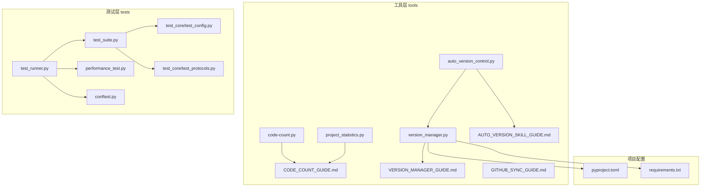
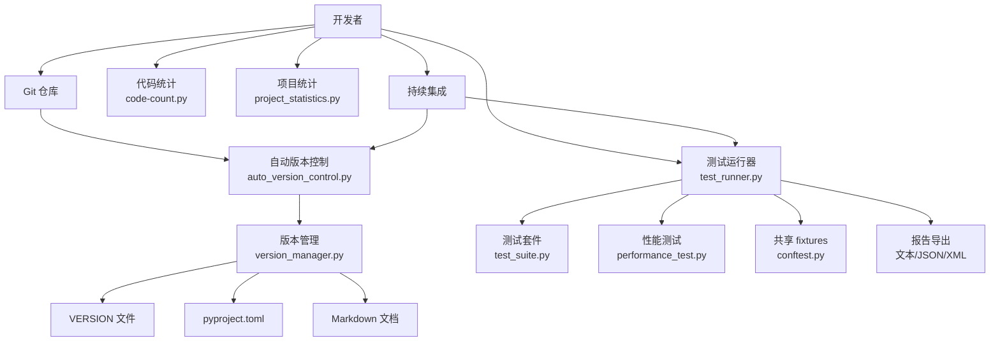
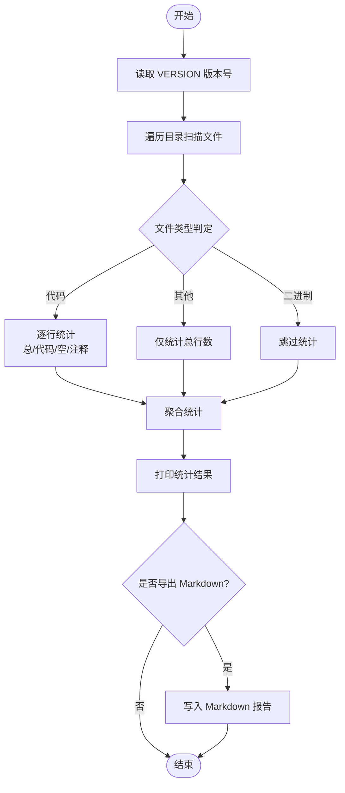
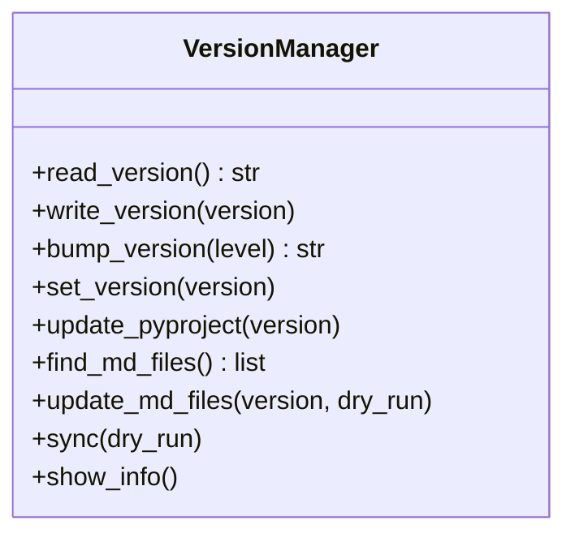
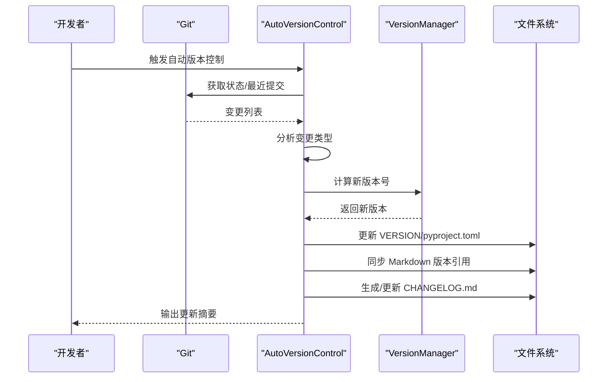
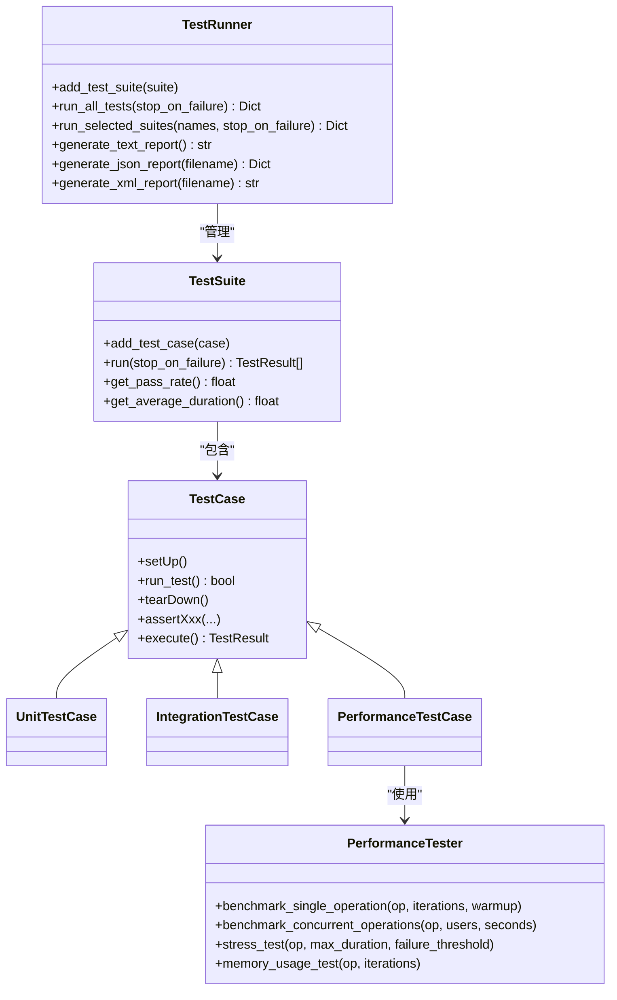
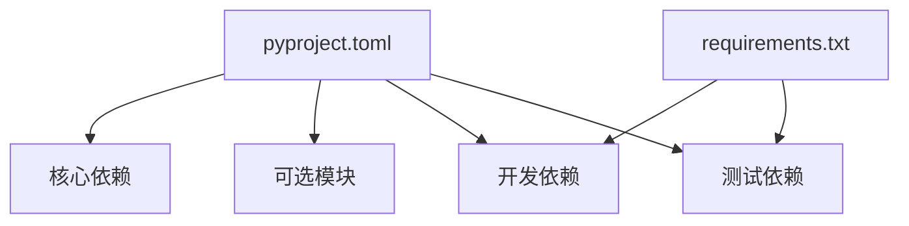

# 开发工具与测试

<cite>
**本文引用的文件**
- [tools/code-count.py](file://tools/code-count.py)
- [tools/project_statistics.py](file://tools/project_statistics.py)
- [tools/auto_version_control.py](file://tools/auto_version_control.py)
- [tools/version_manager.py](file://tools/version_manager.py)
- [tools/CODE_COUNT_GUIDE.md](file://tools/CODE_COUNT_GUIDE.md)
- [tools/VERSION_MANAGER_GUIDE.md](file://tools/VERSION_MANAGER_GUIDE.md)
- [tools/AUTO_VERSION_SKILL_GUIDE.md](file://tools/AUTO_VERSION_SKILL_GUIDE.md)
- [tools/GITHUB_SYNC_GUIDE.md](file://tools/GITHUB_SYNC_GUIDE.md)
- [tests/test_runner.py](file://tests/test_runner.py)
- [tests/performance_test.py](file://tests/performance_test.py)
- [tests/test_suite.py](file://tests/test_suite.py)
- [tests/conftest.py](file://tests/conftest.py)
- [tests/test_core/test_config.py](file://tests/test_core/test_config.py)
- [tests/test_core/test_protocols.py](file://tests/test_core/test_protocols.py)
- [pyproject.toml](file://pyproject.toml)
- [requirements.txt](file://requirements.txt)
</cite>

## 目录
1. [引言](#引言)
2. [项目结构](#项目结构)
3. [核心组件](#核心组件)
4. [架构总览](#架构总览)
5. [详细组件分析](#详细组件分析)
6. [依赖分析](#依赖分析)
7. [性能考量](#性能考量)
8. [故障排查指南](#故障排查指南)
9. [结论](#结论)
10. [附录](#附录)

## 引言
本文件面向 NecoRAG 的开发与测试团队，系统化梳理“开发工具与测试”相关实现，覆盖以下主题：
- 代码统计工具：行数统计、按文件类型分布、Markdown 报告导出
- 版本管理工具：集中式版本号、自动递增、批量同步、更新日志生成
- 测试框架：单元测试、集成测试、性能测试、测试报告与多种格式导出
- 质量保证流程：代码审查、测试覆盖率、持续集成（CI）建议
- 开发环境搭建与配置
- 测试用例编写指南与最佳实践
- 性能测试与基准测试方法
- 工具链使用与维护
- 测试自动化与优化策略

## 项目结构
围绕“开发工具与测试”的关键目录与文件如下：
- tools：代码统计、版本管理、仓库同步、质量工具
- tests：测试运行器、测试套件、性能测试、共享 fixtures
- pyproject.toml 与 requirements.txt：项目元数据与依赖声明
- README/Wiki/指南文档：使用说明与最佳实践

**图表来源**
- [tools/code-count.py:1-413](file://tools/code-count.py#L1-L413)
- [tools/project_statistics.py:1-433](file://tools/project_statistics.py#L1-L433)
- [tools/version_manager.py:1-387](file://tools/version_manager.py#L1-L387)
- [tools/auto_version_control.py:1-462](file://tools/auto_version_control.py#L1-L462)
- [tests/test_runner.py:1-327](file://tests/test_runner.py#L1-L327)
- [tests/test_suite.py:1-287](file://tests/test_suite.py#L1-L287)
- [tests/performance_test.py:1-322](file://tests/performance_test.py#L1-L322)
- [tests/conftest.py:1-330](file://tests/conftest.py#L1-L330)
- [pyproject.toml:1-101](file://pyproject.toml#L1-L101)
- [requirements.txt:1-161](file://requirements.txt#L1-L161)

**章节来源**
- [tools/code-count.py:1-413](file://tools/code-count.py#L1-L413)
- [tools/project_statistics.py:1-433](file://tools/project_statistics.py#L1-L433)
- [tools/version_manager.py:1-387](file://tools/version_manager.py#L1-L387)
- [tools/auto_version_control.py:1-462](file://tools/auto_version_control.py#L1-L462)
- [tests/test_runner.py:1-327](file://tests/test_runner.py#L1-L327)
- [tests/test_suite.py:1-287](file://tests/test_suite.py#L1-L287)
- [tests/performance_test.py:1-322](file://tests/performance_test.py#L1-L322)
- [tests/conftest.py:1-330](file://tests/conftest.py#L1-L330)
- [pyproject.toml:1-101](file://pyproject.toml#L1-L101)
- [requirements.txt:1-161](file://requirements.txt#L1-L161)

## 核心组件
- 代码统计工具：提供终端输出与 Markdown 报告导出，支持按扩展名统计与行数分布
- 项目统计工具：面向整体项目规模与目录结构的统计与导出
- 版本管理工具：集中式版本号、语义化版本递增、批量同步到配置与文档
- 自动版本控制：基于 Git 的变更检测与智能递增，生成更新日志
- 测试框架：统一的测试运行器、测试套件、断言与报告（文本/JSON/XML）
- 性能测试：单操作基准、并发基准、压力测试、内存使用测试
- 共享 fixtures：测试配置、Mock 客户端、样本数据
- 依赖与打包：pyproject.toml 与 requirements.txt

**章节来源**
- [tools/code-count.py:1-413](file://tools/code-count.py#L1-L413)
- [tools/project_statistics.py:1-433](file://tools/project_statistics.py#L1-L433)
- [tools/version_manager.py:1-387](file://tools/version_manager.py#L1-L387)
- [tools/auto_version_control.py:1-462](file://tools/auto_version_control.py#L1-L462)
- [tests/test_runner.py:1-327](file://tests/test_runner.py#L1-L327)
- [tests/performance_test.py:1-322](file://tests/performance_test.py#L1-L322)
- [tests/test_suite.py:1-287](file://tests/test_suite.py#L1-L287)
- [tests/conftest.py:1-330](file://tests/conftest.py#L1-L330)
- [pyproject.toml:1-101](file://pyproject.toml#L1-L101)
- [requirements.txt:1-161](file://requirements.txt#L1-L161)

## 架构总览
下图展示“开发工具与测试”在项目中的角色与交互：

**图表来源**
- [tools/auto_version_control.py:1-462](file://tools/auto_version_control.py#L1-L462)
- [tools/version_manager.py:1-387](file://tools/version_manager.py#L1-L387)
- [tools/code-count.py:1-413](file://tools/code-count.py#L1-L413)
- [tools/project_statistics.py:1-433](file://tools/project_statistics.py#L1-L433)
- [tests/test_runner.py:1-327](file://tests/test_runner.py#L1-L327)
- [tests/test_suite.py:1-287](file://tests/test_suite.py#L1-L287)
- [tests/performance_test.py:1-322](file://tests/performance_test.py#L1-L322)
- [tests/conftest.py:1-330](file://tests/conftest.py#L1-L330)

## 详细组件分析

### 代码统计工具（code-count.py 与 project_statistics.py）
- 功能要点
  - 自动读取 VERSION 文件作为版本号来源
  - 统计文件总数、代码文件数、二进制文件数、其他文件数
  - 区分总行数、代码行数、空行数、注释行数，并计算占比
  - 按扩展名统计文件数量与行数分布，输出 Top-N
  - 导出 Markdown 报告，包含版本号与时间戳
- 使用方式
  - Python 脚本：支持路径、输出文件、详细模式等参数
  - Shell 快捷脚本：推荐在项目根目录使用
- 输出内容
  - 终端输出：版本、时间戳、文件统计、行数统计、类型分布、行数分布
  - Markdown 报告：表格化统计、版本与时间戳、可归档

**图表来源**
- [tools/code-count.py:121-189](file://tools/code-count.py#L121-L189)
- [tools/code-count.py:192-264](file://tools/code-count.py#L192-L264)
- [tools/code-count.py:267-328](file://tools/code-count.py#L267-L328)

**章节来源**
- [tools/code-count.py:1-413](file://tools/code-count.py#L1-L413)
- [tools/project_statistics.py:1-433](file://tools/project_statistics.py#L1-L433)
- [tools/CODE_COUNT_GUIDE.md:1-458](file://tools/CODE_COUNT_GUIDE.md#L1-L458)

### 版本管理工具（version_manager.py）
- 功能要点
  - 读取/设置版本号（语义化版本）
  - 递增主/次/补丁版本
  - 同步到 pyproject.toml 与所有 Markdown 文档中的版本引用
  - 智能识别多种版本号模式并更新
- 使用方式
  - CLI：show/bump/set/sync，支持 dry-run 预览
  - 与自动版本控制配合使用

**图表来源**
- [tools/version_manager.py:27-304](file://tools/version_manager.py#L27-L304)

**章节来源**
- [tools/version_manager.py:1-387](file://tools/version_manager.py#L1-L387)
- [tools/VERSION_MANAGER_GUIDE.md:1-302](file://tools/VERSION_MANAGER_GUIDE.md#L1-L302)

### 自动版本控制（auto_version_control.py）
- 功能要点
  - 基于 Git 检测变更（新增/修改/删除），分析最近提交
  - 智能判断变更类型（重大重构/新功能/Bug 修复/文档/配置/测试）
  - 计算新版本号并执行更新
  - 同步到 VERSION、pyproject.toml、Markdown 文档
  - 生成更新日志（CHANGELOG.md）
- 使用方式
  - 命令行：自动/交互/预览/完全自动模式
  - 集成到 Git Hooks 或 CI/CD

**图表来源**
- [tools/auto_version_control.py:84-142](file://tools/auto_version_control.py#L84-L142)
- [tools/auto_version_control.py:229-294](file://tools/auto_version_control.py#L229-L294)
- [tools/version_manager.py:77-123](file://tools/version_manager.py#L77-L123)

**章节来源**
- [tools/auto_version_control.py:1-462](file://tools/auto_version_control.py#L1-L462)
- [tools/AUTO_VERSION_SKILL_GUIDE.md:1-359](file://tools/AUTO_VERSION_SKILL_GUIDE.md#L1-L359)

### 测试框架（test_runner.py、test_suite.py、performance_test.py、conftest.py）
- 测试运行器
  - 统一运行多个测试套件，支持失败即停
  - 生成文本/JSON/XML 报告，包含统计与按套件分组详情
- 测试套件与用例
  - TestCase 基类提供 setUp/tearDown/断言方法
  - TestSuite 管理用例集合，统计通过率与平均耗时
  - 预定义单元/集成/性能测试基类
- 性能测试
  - 单操作基准、并发基准、压力测试、内存使用测试
  - 计算最小/最大/平均/中位数/标准差/吞吐量/百分位数
- 共享 fixtures
  - 提供配置、Mock 客户端、样本数据与文本样本
  - 便于单元测试与集成测试复用

**图表来源**
- [tests/test_runner.py:16-327](file://tests/test_runner.py#L16-L327)
- [tests/test_suite.py:14-287](file://tests/test_suite.py#L14-L287)
- [tests/performance_test.py:31-291](file://tests/performance_test.py#L31-L291)

**章节来源**
- [tests/test_runner.py:1-327](file://tests/test_runner.py#L1-L327)
- [tests/test_suite.py:1-287](file://tests/test_suite.py#L1-L287)
- [tests/performance_test.py:1-322](file://tests/performance_test.py#L1-L322)
- [tests/conftest.py:1-330](file://tests/conftest.py#L1-L330)

### 质量保证流程（代码审查、测试覆盖率、持续集成）
- 代码审查
  - 使用自动版本控制与更新日志，确保每次变更可追溯
  - 通过双仓库同步（Gitee/GitHub）提升协作透明度
- 测试覆盖率
  - requirements.txt 中包含 pytest 与 pytest-cov
  - 建议在 CI 中启用覆盖率统计与阈值检查
- 持续集成
  - 建议在 CI 中集成：自动版本控制、测试运行、覆盖率报告、文档更新
  - 可参考自动版本控制的 Git Hook 集成方式

**章节来源**
- [tools/AUTO_VERSION_SKILL_GUIDE.md:56-98](file://tools/AUTO_VERSION_SKILL_GUIDE.md#L56-L98)
- [tools/GITHUB_SYNC_GUIDE.md:1-462](file://tools/GITHUB_SYNC_GUIDE.md#L1-L462)
- [requirements.txt:129-133](file://requirements.txt#L129-L133)

### 开发环境搭建与配置
- Python 版本与依赖
  - pyproject.toml 指定 Python 版本与依赖
  - requirements.txt 提供完整依赖清单与安装指引
- 开发工具
  - black、flake8、mypy 用于代码风格与静态检查
  - pytest 与 pytest-asyncio 用于测试
- 环境建议
  - 使用虚拟环境隔离依赖
  - 安装开发依赖后运行测试与格式化检查

**章节来源**
- [pyproject.toml:1-101](file://pyproject.toml#L1-L101)
- [requirements.txt:1-161](file://requirements.txt#L1-L161)

### 测试用例编写指南与最佳实践
- 单元测试
  - 使用 conftest.py 提供共享 fixtures，减少重复
  - 使用断言方法（assertEqual/assertTrue/assertIn 等）保证可读性
- 集成测试
  - 基于真实配置与 Mock 客户端进行端到端验证
- 性能测试
  - 使用 PerformanceTester 的基准与压力测试方法
  - 关注吞吐量、延迟分布与内存使用
- 报告与归档
  - 使用 TestRunner 导出文本/JSON/XML 报告
  - 将报告纳入 CI 归档与趋势分析

**章节来源**
- [tests/conftest.py:1-330](file://tests/conftest.py#L1-L330)
- [tests/test_suite.py:35-143](file://tests/test_suite.py#L35-L143)
- [tests/performance_test.py:31-291](file://tests/performance_test.py#L31-L291)
- [tests/test_runner.py:97-234](file://tests/test_runner.py#L97-L234)

### 性能测试与基准测试方法
- 单操作基准
  - 预热 + 多轮执行，统计执行时间分布与吞吐量
- 并发基准
  - 多线程并发执行，评估系统在高负载下的稳定性
- 压力测试
  - 持续运行直至失败率超过阈值，记录失败率与性能指标
- 内存使用测试
  - 采样进程内存，统计峰值与平均值

**章节来源**
- [tests/performance_test.py:31-291](file://tests/performance_test.py#L31-L291)

### 工具链使用与维护
- 代码统计
  - 定期生成报告，对比历史数据，追踪代码密度与注释率
- 版本管理
  - 使用集中式 VERSION 文件，统一同步到 pyproject.toml 与文档
  - 自动版本控制结合 Git 提交信息，智能递增版本
- 仓库同步
  - 双仓库同步（Gitee/GitHub），支持工具化一键推送与状态检查

**章节来源**
- [tools/CODE_COUNT_GUIDE.md:1-458](file://tools/CODE_COUNT_GUIDE.md#L1-L458)
- [tools/VERSION_MANAGER_GUIDE.md:1-302](file://tools/VERSION_MANAGER_GUIDE.md#L1-L302)
- [tools/AUTO_VERSION_SKILL_GUIDE.md:1-359](file://tools/AUTO_VERSION_SKILL_GUIDE.md#L1-L359)
- [tools/GITHUB_SYNC_GUIDE.md:1-462](file://tools/GITHUB_SYNC_GUIDE.md#L1-L462)

### 测试自动化与优化策略
- 自动化
  - Git Hooks 集成自动版本控制
  - CI 中自动运行测试与覆盖率统计
- 优化
  - 使用 fixtures 减少测试初始化成本
  - 性能测试中合理设置预热与采样点
  - 报告导出多样化，便于不同场景消费

**章节来源**
- [tools/AUTO_VERSION_SKILL_GUIDE.md:56-98](file://tools/AUTO_VERSION_SKILL_GUIDE.md#L56-L98)
- [tests/test_runner.py:162-234](file://tests/test_runner.py#L162-L234)
- [tests/conftest.py:1-330](file://tests/conftest.py#L1-L330)

## 依赖分析
- 项目依赖
  - 核心依赖：numpy、packaging、python-dateutil 等
  - 可选模块：dashboard、monitoring、security、intent 等
- 开发依赖
  - pytest、pytest-asyncio、pytest-cov、black、flake8、mypy
- 测试依赖
  - pytest 与 pytest-cov 用于测试与覆盖率

**图表来源**
- [pyproject.toml:27-80](file://pyproject.toml#L27-L80)
- [requirements.txt:129-139](file://requirements.txt#L129-L139)

**章节来源**
- [pyproject.toml:1-101](file://pyproject.toml#L1-L101)
- [requirements.txt:1-161](file://requirements.txt#L1-L161)

## 性能考量
- 代码统计
  - 大文件与大量小文件会影响扫描性能，建议使用详细模式观察进度
- 版本管理
  - 同步 Markdown 文件时注意文件数量与权限
- 测试运行
  - 并发测试与压力测试需合理设置线程数与持续时间
  - 性能测试中关注预热轮次与采样点，避免抖动

[本节为通用指导，无需特定文件引用]

## 故障排查指南
- 代码统计
  - 版本号缺失：确认 VERSION 文件存在且格式正确
  - 路径错误：使用绝对路径或检查相对路径
- 版本管理
  - 版本号格式错误：遵循语义化版本格式
  - 同步失败：检查文件权限与排除目录配置
- 自动版本控制
  - 无法检测变更：确认处于 Git 仓库；必要时初始化仓库
  - 同步失败：修复权限后重试
- 仓库同步
  - 认证失败：使用 PAT 或配置凭证管理器
  - 内容不一致：比较提交历史并强制同步

**章节来源**
- [tools/CODE_COUNT_GUIDE.md:328-424](file://tools/CODE_COUNT_GUIDE.md#L328-L424)
- [tools/VERSION_MANAGER_GUIDE.md:251-286](file://tools/VERSION_MANAGER_GUIDE.md#L251-L286)
- [tools/AUTO_VERSION_SKILL_GUIDE.md:252-297](file://tools/AUTO_VERSION_SKILL_GUIDE.md#L252-L297)
- [tools/GITHUB_SYNC_GUIDE.md:263-334](file://tools/GITHUB_SYNC_GUIDE.md#L263-L334)

## 结论
通过代码统计、集中式版本管理、完善的测试框架与自动化工具链，NecoRAG 能够：
- 保持版本一致性与可追溯性
- 持续产出高质量的测试报告与性能指标
- 提升开发效率与协作透明度
建议在 CI 中集成自动版本控制与测试运行，形成闭环的质量保障体系。

[本节为总结性内容，无需特定文件引用]

## 附录
- 测试用例示例
  - 配置模块测试：覆盖默认值、自定义值、序列化/反序列化、预设配置
  - 数据协议测试：覆盖枚举类型、数据模型字段与验证
- 报告导出
  - 文本/JSON/XML 报告便于不同工具链消费与归档

**章节来源**
- [tests/test_core/test_config.py:1-397](file://tests/test_core/test_config.py#L1-L397)
- [tests/test_core/test_protocols.py:1-494](file://tests/test_core/test_protocols.py#L1-L494)
- [tests/test_runner.py:97-234](file://tests/test_runner.py#L97-L234)