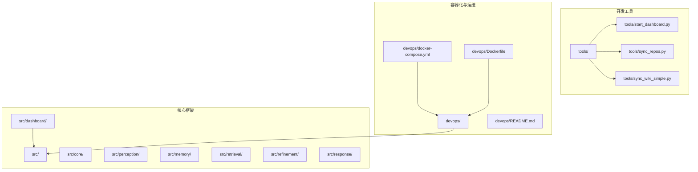
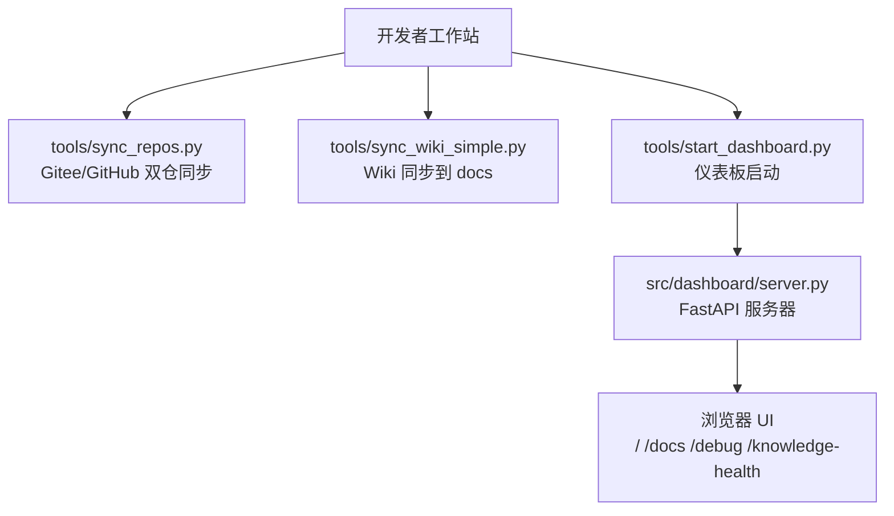
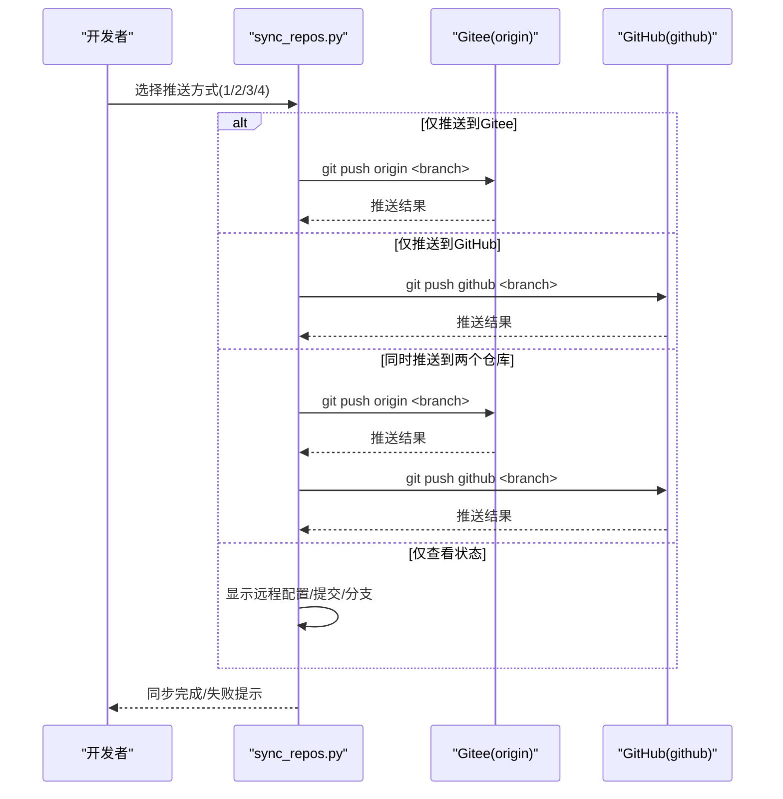
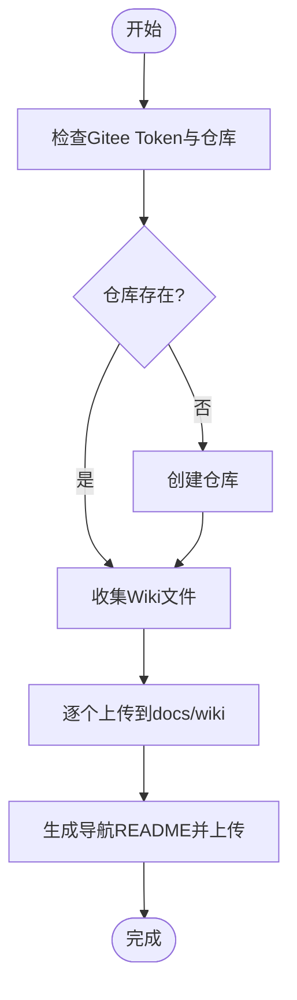
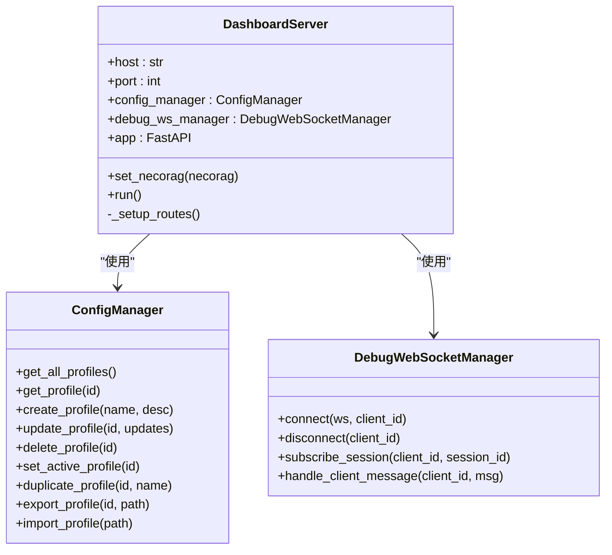
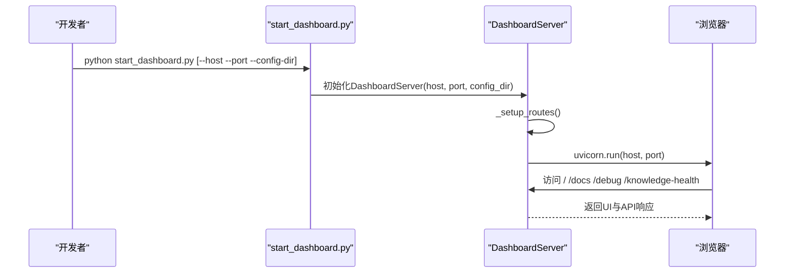
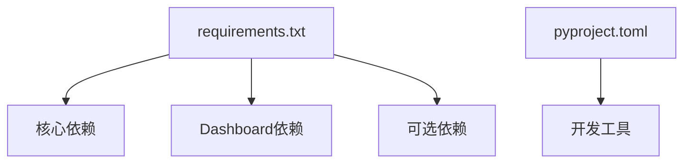

# 开发环境配置

<cite>
**本文档引用的文件**
- [README.md](file://README.md)
- [QUICKSTART.md](file://QUICKSTART.md)
- [CONTRIBUTING.md](file://CONTRIBUTING.md)
- [requirements.txt](file://requirements.txt)
- [pyproject.toml](file://pyproject.toml)
- [devops/README.md](file://devops/README.md)
- [devops/docker-compose.yml](file://devops/docker-compose.yml)
- [devops/Dockerfile](file://devops/Dockerfile)
- [tools/GITHUB_SYNC_GUIDE.md](file://tools/GITHUB_SYNC_GUIDE.md)
- [tools/SYNC_SETUP_COMPLETE.md](file://tools/SYNC_SETUP_COMPLETE.md)
- [tools/start_dashboard.py](file://tools/start_dashboard.py)
- [tools/start_dashboard.sh](file://tools/start_dashboard.sh)
- [tools/sync_repos.py](file://tools/sync_repos.py)
- [tools/sync_wiki_to_gitee.py](file://tools/sync_wiki_to_gitee.py)
- [tools/sync_wiki_simple.py](file://tools/sync_wiki_simple.py)
- [src/dashboard/server.py](file://src/dashboard/server.py)
- [src/dashboard/dashboard.py](file://src/dashboard/dashboard.py)
</cite>

## 目录
1. [简介](#简介)
2. [项目结构](#项目结构)
3. [核心组件](#核心组件)
4. [架构总览](#架构总览)
5. [详细组件分析](#详细组件分析)
6. [依赖分析](#依赖分析)
7. [性能考虑](#性能考虑)
8. [故障排除指南](#故障排除指南)
9. [结论](#结论)
10. [附录](#附录)

## 简介
本文件面向NecoRAG开发团队，提供一套完整的开发环境配置实现文档，涵盖以下关键目标：
- 代码同步工具实现：GitHub与Gitee仓库的双向同步、Wiki页面同步与分支管理策略
- 开发环境搭建：Python环境配置、依赖安装与IDE设置
- 项目仪表板启动与配置：开发服务器启动、前端资源编译与热重载
- 开发工具链集成：代码格式化、静态分析与自动化流程
- 故障排除与性能优化建议
- 团队协作规范与代码提交流程

## 项目结构
NecoRAG采用模块化分层架构，开发环境围绕以下关键目录组织：
- src：核心框架与模块（感知、记忆、检索、精炼、响应、仪表板、调试等）
- devops：容器化与运维脚本（Docker Compose、Dockerfile、脚本）
- tools：开发辅助工具（同步、仪表板启动、Wiki同步等）
- tests：测试套件
- wiki：结构化文档（用于生成Wiki导航与同步）

**图表来源**
- [devops/docker-compose.yml:1-164](file://devops/docker-compose.yml#L1-L164)
- [devops/Dockerfile:1-39](file://devops/Dockerfile#L1-L39)
- [devops/README.md:1-336](file://devops/README.md#L1-L336)
- [src/dashboard/server.py:1-568](file://src/dashboard/server.py#L1-L568)
- [tools/start_dashboard.py:1-56](file://tools/start_dashboard.py#L1-L56)
- [tools/sync_repos.py:1-245](file://tools/sync_repos.py#L1-L245)
- [tools/sync_wiki_simple.py:1-291](file://tools/sync_wiki_simple.py#L1-L291)

**章节来源**
- [devops/README.md:1-336](file://devops/README.md#L1-L336)
- [devops/docker-compose.yml:1-164](file://devops/docker-compose.yml#L1-L164)
- [devops/Dockerfile:1-39](file://devops/Dockerfile#L1-L39)

## 核心组件
- 代码同步工具：提供Gitee与GitHub双仓同步、分支与标签管理、Token与SSH配置、自动化脚本
- Wiki同步工具：支持将结构化文档同步到Gitee仓库或生成导航README
- 仪表板服务器：基于FastAPI的Web管理界面，提供REST API与WebSocket调试通道
- 开发服务器启动：Python脚本与Shell脚本两种方式，支持主机与端口参数
- 容器化部署：Docker Compose一键编排，包含Redis/Qdrant/Neo4j/Ollama/Grafana与应用服务

**章节来源**
- [tools/GITHUB_SYNC_GUIDE.md:1-462](file://tools/GITHUB_SYNC_GUIDE.md#L1-L462)
- [tools/SYNC_SETUP_COMPLETE.md:1-501](file://tools/SYNC_SETUP_COMPLETE.md#L1-L501)
- [tools/sync_repos.py:1-245](file://tools/sync_repos.py#L1-L245)
- [tools/sync_wiki_to_gitee.py:1-332](file://tools/sync_wiki_to_gitee.py#L1-L332)
- [tools/sync_wiki_simple.py:1-291](file://tools/sync_wiki_simple.py#L1-L291)
- [src/dashboard/server.py:1-568](file://src/dashboard/server.py#L1-L568)
- [tools/start_dashboard.py:1-56](file://tools/start_dashboard.py#L1-L56)
- [tools/start_dashboard.sh:1-26](file://tools/start_dashboard.sh#L1-L26)
- [devops/docker-compose.yml:1-164](file://devops/docker-compose.yml#L1-L164)

## 架构总览
下图展示了开发环境的关键交互：开发者通过本地脚本与工具进行同步与启动，仪表板提供Web界面与API，容器化编排统一管理各服务。

**图表来源**
- [tools/sync_repos.py:1-245](file://tools/sync_repos.py#L1-L245)
- [tools/sync_wiki_simple.py:1-291](file://tools/sync_wiki_simple.py#L1-L291)
- [tools/start_dashboard.py:1-56](file://tools/start_dashboard.py#L1-L56)
- [src/dashboard/server.py:1-568](file://src/dashboard/server.py#L1-L568)

## 详细组件分析

### 代码同步工具（Gitee 与 GitHub 双仓）
- 功能特性
  - 交互式菜单、彩色输出、状态检查、错误处理与详细提示
  - 支持仅推送到Gitee、仅GitHub、同时推送与仅查看状态
  - 自动检查Git状态、远程仓库配置与分支信息
- 使用方式
  - Python工具：进入tools目录执行同步脚本，按提示选择推送方式
  - Shell脚本：在Linux/Mac环境下使用启动脚本
  - 手动推送：直接git push origin/main 与 git push github/main
- 配置要点
  - 添加GitHub远程仓库：git remote add github <URL>
  - 配置个人访问令牌或SSH密钥以避免频繁输入凭据
  - 建议配置Git别名以简化常用操作
- 分支与标签管理
  - 日常开发：本地提交后使用工具一键同步到两个仓库
  - 版本发布：创建标签后同步到两个仓库
  - 分支策略：遵循约定式提交与语义化版本

**图表来源**
- [tools/sync_repos.py:178-241](file://tools/sync_repos.py#L178-L241)

**章节来源**
- [tools/GITHUB_SYNC_GUIDE.md:1-462](file://tools/GITHUB_SYNC_GUIDE.md#L1-L462)
- [tools/SYNC_SETUP_COMPLETE.md:1-501](file://tools/SYNC_SETUP_COMPLETE.md#L1-L501)
- [tools/sync_repos.py:1-245](file://tools/sync_repos.py#L1-L245)
- [tools/start_dashboard.sh:1-26](file://tools/start_dashboard.sh#L1-L26)

### Wiki 页面同步工具
- 简化版同步（docs/wiki）
  - 将Wiki内容整理并上传到仓库的docs/wiki目录，生成导航README
  - 通过Gitee API上传文件，支持更新与SHA校验
- Gitee Wiki 同步（Issues模拟）
  - 通过创建Issue模拟Wiki页面，便于在Gitee上管理文档
  - 生成主Wiki导航README并上传到仓库根目录

**图表来源**
- [tools/sync_wiki_simple.py:203-267](file://tools/sync_wiki_simple.py#L203-L267)
- [tools/sync_wiki_to_gitee.py:249-308](file://tools/sync_wiki_to_gitee.py#L249-L308)

**章节来源**
- [tools/sync_wiki_simple.py:1-291](file://tools/sync_wiki_simple.py#L1-L291)
- [tools/sync_wiki_to_gitee.py:1-332](file://tools/sync_wiki_to_gitee.py#L1-L332)

### 仪表板服务器（Dashboard）
- 启动方式
  - Python脚本：支持host/port/config-dir参数
  - 模块入口：python -m src.dashboard.dashboard
  - Shell脚本：Linux/Mac一键启动
- 功能特性
  - RESTful API：Profile管理、模块参数配置、统计信息、知识演化接口
  - WebSocket：调试面板实时推送（思维链可视化等）
  - Web UI：主控制台、调试面板、知识库健康仪表盘
- 依赖与配置
  - FastAPI + Uvicorn
  - CORS中间件、静态文件服务、调试WebSocket管理器
  - 配置目录默认./configs，可通过参数覆盖

**图表来源**
- [src/dashboard/server.py:51-108](file://src/dashboard/server.py#L51-L108)
- [src/dashboard/server.py:113-418](file://src/dashboard/server.py#L113-L418)
- [src/dashboard/server.py:544-557](file://src/dashboard/server.py#L544-L557)

**章节来源**
- [src/dashboard/server.py:1-568](file://src/dashboard/server.py#L1-L568)
- [src/dashboard/dashboard.py:1-31](file://src/dashboard/dashboard.py#L1-L31)
- [tools/start_dashboard.py:1-56](file://tools/start_dashboard.py#L1-L56)
- [tools/start_dashboard.sh:1-26](file://tools/start_dashboard.sh#L1-L26)

### 开发服务器启动与配置
- Python脚本启动
  - 支持--host/--port/--config-dir参数
  - 默认监听0.0.0.0:8000，配置目录./configs
- Shell脚本启动
  - 检查Python3可用性，输出访问地址与API文档地址
- Docker容器启动
  - Dockerfile中设置健康检查与CMD启动仪表板
  - docker-compose编排应用与数据库/可视化服务

**图表来源**
- [tools/start_dashboard.py:16-51](file://tools/start_dashboard.py#L16-L51)
- [src/dashboard/server.py:544-557](file://src/dashboard/server.py#L544-L557)

**章节来源**
- [tools/start_dashboard.py:1-56](file://tools/start_dashboard.py#L1-L56)
- [tools/start_dashboard.sh:1-26](file://tools/start_dashboard.sh#L1-L26)
- [devops/Dockerfile:37-39](file://devops/Dockerfile#L37-L39)
- [devops/docker-compose.yml:118-147](file://devops/docker-compose.yml#L118-L147)

### 开发工具链集成
- 代码格式化：Black（line-length=100）
- 静态检查：Flake8、Mypy（Python 3.9+）
- 测试：pytest + pytest-asyncio + pytest-cov
- 可选模块依赖：按需安装（意图分析、监控、安全、可视化等）
- 项目打包：pyproject.toml定义依赖与可选依赖

**章节来源**
- [requirements.txt:1-161](file://requirements.txt#L1-L161)
- [pyproject.toml:1-101](file://pyproject.toml#L1-L101)

## 依赖分析
- 核心依赖：numpy、packaging、python-dateutil、aiohttp、requests、pydantic
- Dashboard框架：FastAPI、Uvicorn、websockets
- 可选组件：Qdrant、Neo4j、Redis、Prometheus、JWT/OAuth2、Plotly、Scikit-learn等
- 开发工具：pytest、black、flake8、mypy

**图表来源**
- [requirements.txt:1-161](file://requirements.txt#L1-L161)
- [pyproject.toml:27-80](file://pyproject.toml#L27-L80)

**章节来源**
- [requirements.txt:1-161](file://requirements.txt#L1-L161)
- [pyproject.toml:1-101](file://pyproject.toml#L1-L101)

## 性能考虑
- 仪表板启动与API响应：合理设置并发与日志级别，避免阻塞
- 容器资源限制：在docker-compose中为各服务设置CPU/内存上限
- 缓存优化：Redis热点数据缓存、向量数据库索引优化
- 监控集成：Prometheus + Grafana实时观测系统指标
- 端口与网络：避免端口冲突，使用容器网络隔离

[本节为通用指导，无需具体文件引用]

## 故障排除指南
- Dashboard启动失败
  - 检查端口占用：lsof -i :8000；更换端口启动
  - 确认依赖安装：pip install -r requirements.txt
  - Docker环境：docker-compose config与logs诊断
- 代码同步失败
  - GitHub认证：使用Personal Access Token或SSH密钥
  - 网络问题：使用镜像或代理；必要时清除凭证缓存
- Wiki同步失败
  - Gitee Token缺失：检查.env配置；仓库存在性验证
  - API限制：增加延时或降低请求频率
- 容器健康检查失败
  - 查看服务日志：docker-compose logs -f <service>
  - 网络与端口：确认容器间网络与映射正确

**章节来源**
- [QUICKSTART.md:380-431](file://QUICKSTART.md#L380-L431)
- [devops/README.md:239-281](file://devops/README.md#L239-L281)
- [tools/GITHUB_SYNC_GUIDE.md:263-335](file://tools/GITHUB_SYNC_GUIDE.md#L263-L335)
- [tools/sync_wiki_simple.py:270-287](file://tools/sync_wiki_simple.py#L270-L287)

## 结论
通过上述工具与流程，NecoRAG实现了：
- 高可用的双仓库同步策略，覆盖国内外开发者社区
- 完整的开发环境配置与仪表板启动方案
- 可扩展的Wiki同步与导航生成机制
- 可观测、可维护的容器化部署与监控体系
团队可据此快速搭建开发环境并开展协作开发。

[本节为总结性内容，无需具体文件引用]

## 附录

### 开发环境搭建步骤
- Python环境
  - 推荐Python 3.9+，使用venv或Conda创建虚拟环境
  - 安装依赖：pip install -r requirements.txt
- IDE设置
  - 配置Python解释器为虚拟环境
  - 启用Black、Flake8、Mypy插件
  - 设置运行配置：tools/start_dashboard.py（带host/port参数）
- 仪表板启动
  - Python脚本：python tools/start_dashboard.py
  - Shell脚本：./tools/start_dashboard.sh
  - 访问 http://localhost:8000 与 http://localhost:8000/docs

**章节来源**
- [README.md:185-280](file://README.md#L185-L280)
- [QUICKSTART.md:15-86](file://QUICKSTART.md#L15-L86)
- [tools/start_dashboard.py:16-51](file://tools/start_dashboard.py#L16-L51)
- [tools/start_dashboard.sh:1-26](file://tools/start_dashboard.sh#L1-L26)

### 团队协作规范与提交流程
- 提交规范：遵循Conventional Commits（feat/fix/docs/style/refactor/test/chore）
- 分支策略：main（生产）、develop（开发）、feature/*、hotfix/*
- 同步频率：每次提交后立即同步到两个仓库；每日结束与版本发布前验证一致性
- 代码质量：通过pytest、pytest-cov、Black、Flake8、Mypy检查

**章节来源**
- [CONTRIBUTING.md:47-90](file://CONTRIBUTING.md#L47-L90)
- [tools/GITHUB_SYNC_GUIDE.md:351-389](file://tools/GITHUB_SYNC_GUIDE.md#L351-L389)