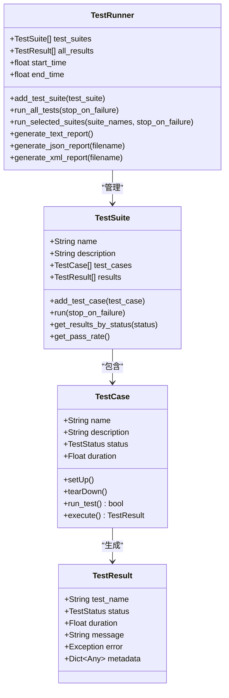
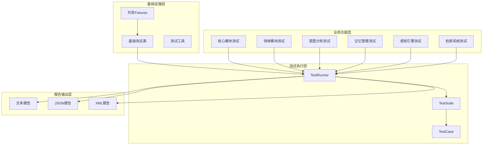
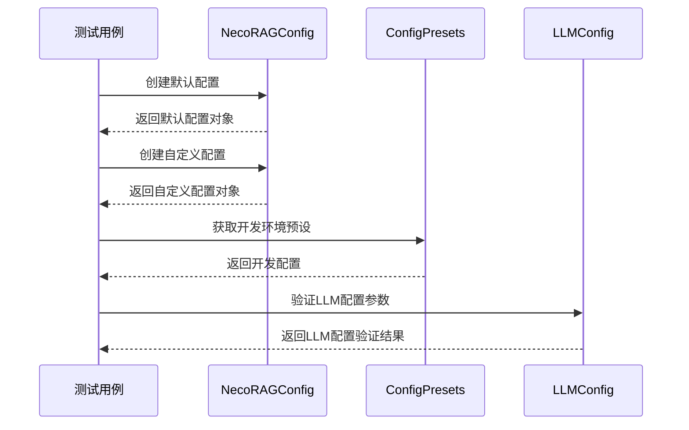
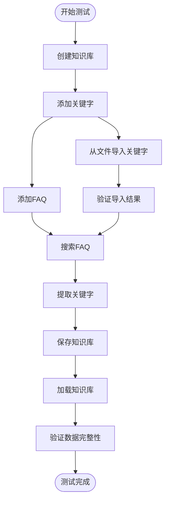
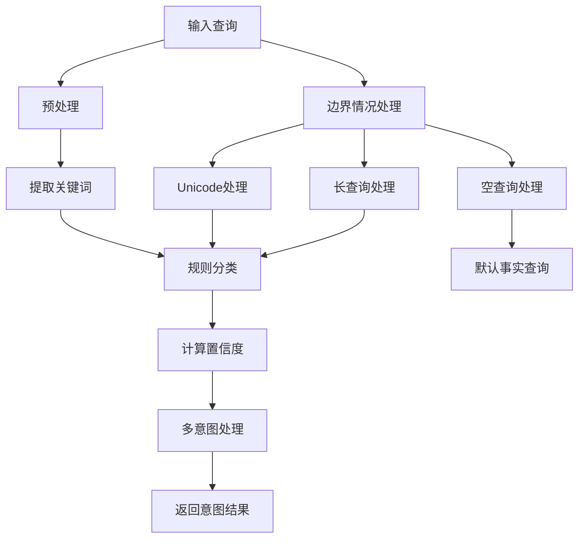
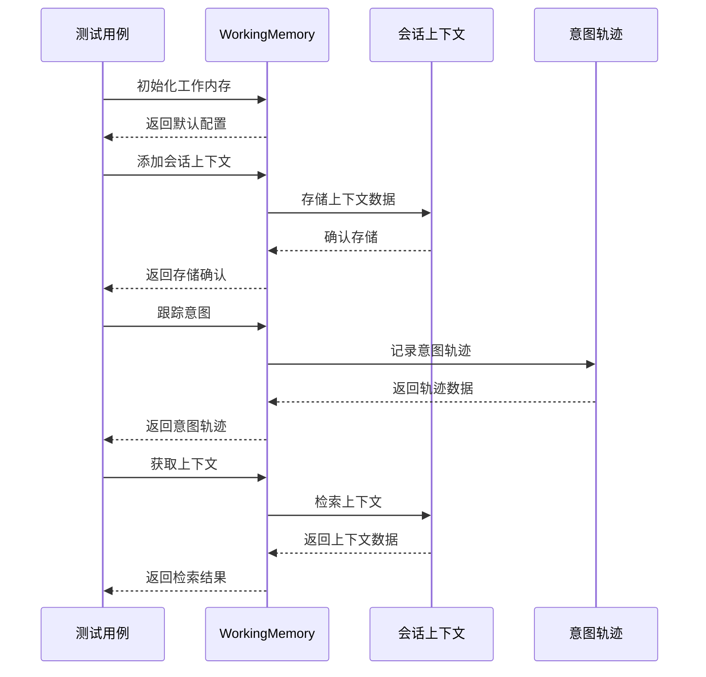
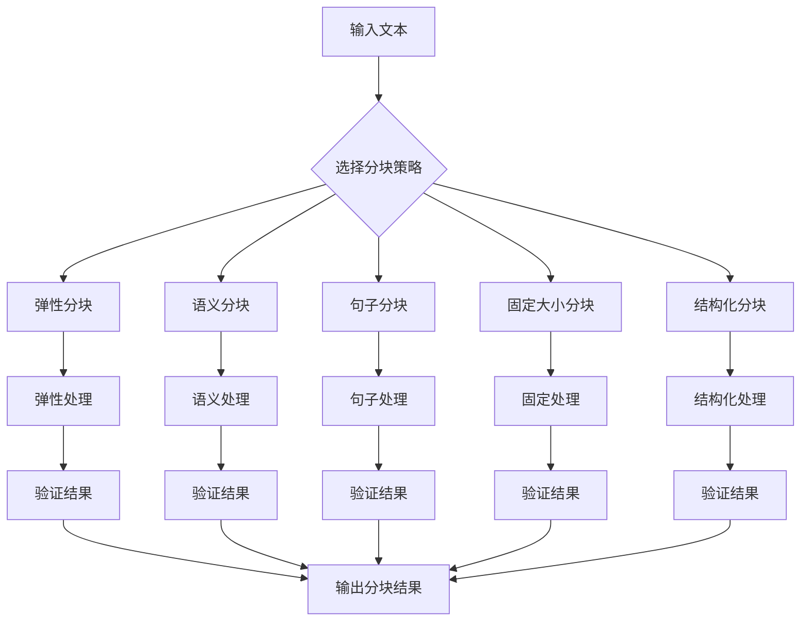
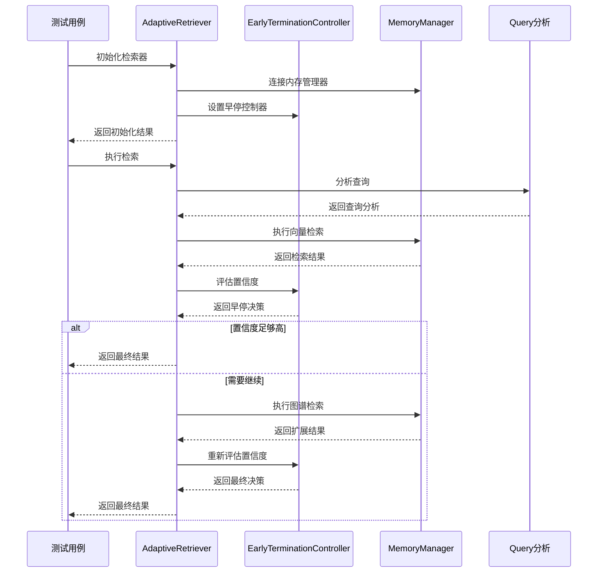
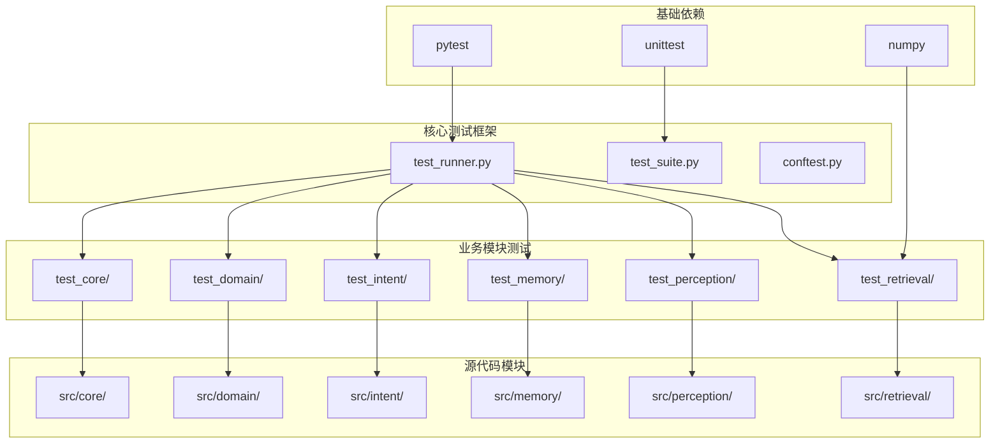

# 单元测试模块

<cite>
**本文档引用的文件**
- [tests/__init__.py](file://tests/__init__.py)
- [tests/conftest.py](file://tests/conftest.py)
- [tests/test_runner.py](file://tests/test_runner.py)
- [tests/test_suite.py](file://tests/test_suite.py)
- [tests/demo_test_runner.py](file://tests/demo_test_runner.py)
- [tests/test_core/test_config.py](file://tests/test_core/test_config.py)
- [tests/test_core/test_protocols.py](file://tests/test_core/test_protocols.py)
- [tests/test_intent/test_classifier.py](file://tests/test_intent/test_classifier.py)
- [tests/test_memory/test_decay.py](file://tests/test_memory/test_decay.py)
- [tests/test_memory/test_working_memory.py](file://tests/test_memory/test_working_memory.py)
- [tests/test_perception/test_chunker.py](file://tests/test_perception/test_chunker.py)
- [tests/test_retrieval/test_retriever.py](file://tests/test_retrieval/test_retriever.py)
- [tests/test_retrieval/test_smart_routing.py](file://tests/test_retrieval/test_smart_routing.py)
- [tests/test_domain/test_knowledge_base.py](file://tests/test_domain/test_knowledge_base.py)
- [tests/test_domain/test_knowledge_base_simple.py](file://tests/test_domain/test_knowledge_base_simple.py)
</cite>

## 目录
1. [简介](#简介)
2. [项目结构](#项目结构)
3. [核心组件](#核心组件)
4. [架构概览](#架构概览)
5. [详细组件分析](#详细组件分析)
6. [依赖分析](#依赖分析)
7. [性能考虑](#性能考虑)
8. [故障排除指南](#故障排除指南)
9. [结论](#结论)

## 简介

NecoRAG单元测试模块是一个全面的测试框架，为整个NecoRAG系统提供了完整的单元测试、集成测试和性能测试能力。该测试模块采用模块化设计，涵盖了从核心架构到具体业务功能的各个层面，确保系统的稳定性和可靠性。

测试框架的核心特点包括：
- **模块化测试组织**：按照功能模块划分测试套件
- **丰富的测试策略**：涵盖单元测试、集成测试、性能测试
- **完善的断言机制**：提供多种断言方法和测试工具
- **灵活的配置管理**：支持多种配置场景和测试环境
- **详细的报告生成**：提供多种格式的测试报告

## 项目结构

测试模块采用清晰的层次化组织结构，按照功能模块进行划分：

```mermaid
graph TB
subgraph "测试根目录"
Tests[tests/]
Init[__init__.py]
Conftest[conftest.py]
Runner[test_runner.py]
Suite[test_suite.py]
Demo[demo_test_runner.py]
end
subgraph "核心模块测试"
Core[test_core/]
Config[test_config.py]
Protocols[test_protocols.py]
end
subgraph "领域特定测试"
Domain[test_domain/]
KB[test_knowledge_base.py]
KBSimple[test_knowledge_base_simple.py]
end
subgraph "意图分析测试"
Intent[test_intent/]
Classifier[test_classifier.py]
end
subgraph "记忆管理测试"
Memory[test_memory/]
Decay[test_decay.py]
WM[test_working_memory.py]
end
subgraph "感知引擎测试"
Perception[test_perception/]
Chunker[test_chunker.py]
end
subgraph "检索系统测试"
Retrieval[test_retrieval/]
Retriever[test_retriever.py]
SmartRouting[test_smart_routing.py]
end
Tests --> Core
Tests --> Domain
Tests --> Intent
Tests --> Memory
Tests --> Perception
Tests --> Retrieval
```

**图表来源**
- [tests/__init__.py:1-20](file://tests/__init__.py#L1-L20)
- [tests/conftest.py:1-330](file://tests/conftest.py#L1-L330)

**章节来源**
- [tests/__init__.py:1-20](file://tests/__init__.py#L1-L20)
- [tests/conftest.py:1-330](file://tests/conftest.py#L1-L330)

## 核心组件

### 测试运行器系统

测试运行器系统是整个测试框架的核心，提供了统一的测试执行和管理能力。

**图表来源**
- [tests/test_runner.py:16-327](file://tests/test_runner.py#L16-L327)
- [tests/test_suite.py:145-287](file://tests/test_suite.py#L145-L287)

### 测试套件管理

测试套件提供了灵活的测试组织和执行机制，支持多种测试类型和配置选项。

**章节来源**
- [tests/test_runner.py:16-327](file://tests/test_runner.py#L16-L327)
- [tests/test_suite.py:145-287](file://tests/test_suite.py#L145-L287)

## 架构概览

测试框架的整体架构采用了分层设计，从底层的测试基础设施到上层的业务功能测试，形成了完整的测试体系。

**图表来源**
- [tests/conftest.py:1-330](file://tests/conftest.py#L1-L330)
- [tests/test_runner.py:16-327](file://tests/test_runner.py#L16-L327)

## 详细组件分析

### 核心模块测试

核心模块测试主要覆盖NecoRAG的基础架构和数据模型，确保系统的核心功能正常运行。

#### 配置系统测试

配置系统测试验证了NecoRAG的各种配置选项和预设配置的正确性。

**图表来源**
- [tests/test_core/test_config.py:35-397](file://tests/test_core/test_config.py#L35-L397)

#### 数据协议测试

数据协议测试确保了NecoRAG统一数据模型的正确性和完整性。

**章节来源**
- [tests/test_core/test_config.py:35-397](file://tests/test_core/test_config.py#L35-L397)
- [tests/test_core/test_protocols.py:46-494](file://tests/test_core/test_protocols.py#L46-L494)

### 领域特定测试

领域特定测试专注于知识库管理和领域知识处理功能。

#### 知识库管理测试

知识库管理测试验证了知识库的创建、维护和查询功能。

**图表来源**
- [tests/test_domain/test_knowledge_base.py:77-320](file://tests/test_domain/test_knowledge_base.py#L77-L320)

**章节来源**
- [tests/test_domain/test_knowledge_base.py:77-320](file://tests/test_domain/test_knowledge_base.py#L77-L320)
- [tests/test_domain/test_knowledge_base_simple.py:22-202](file://tests/test_domain/test_knowledge_base_simple.py#L22-L202)

### 意图分析测试

意图分析测试专注于查询意图的识别和分类功能。

#### 意图分类器测试

意图分类器测试验证了不同查询类型的分类准确性和鲁棒性。

**图表来源**
- [tests/test_intent/test_classifier.py:18-493](file://tests/test_intent/test_classifier.py#L18-L493)

**章节来源**
- [tests/test_intent/test_classifier.py:18-493](file://tests/test_intent/test_classifier.py#L18-L493)

### 记忆管理测试

记忆管理测试涵盖了工作记忆和长期记忆的各种功能。

#### 工作记忆测试

工作记忆测试验证了会话管理和上下文存储功能。

**图表来源**
- [tests/test_memory/test_working_memory.py:18-307](file://tests/test_memory/test_working_memory.py#L18-L307)

**章节来源**
- [tests/test_memory/test_working_memory.py:18-307](file://tests/test_memory/test_working_memory.py#L18-L307)
- [tests/test_memory/test_decay.py:19-544](file://tests/test_memory/test_decay.py#L19-L544)

### 感知引擎测试

感知引擎测试专注于文档分块和文本处理功能。

#### 分块策略测试

分块策略测试验证了多种分块算法的正确性和效率。

**图表来源**
- [tests/test_perception/test_chunker.py:43-532](file://tests/test_perception/test_chunker.py#L43-L532)

**章节来源**
- [tests/test_perception/test_chunker.py:43-532](file://tests/test_perception/test_chunker.py#L43-L532)

### 检索系统测试

检索系统测试涵盖了基础检索和智能路由功能。

#### 自适应检索器测试

自适应检索器测试验证了检索流程和早停机制。

**图表来源**
- [tests/test_retrieval/test_retriever.py:19-410](file://tests/test_retrieval/test_retriever.py#L19-L410)

**章节来源**
- [tests/test_retrieval/test_retriever.py:19-410](file://tests/test_retrieval/test_retriever.py#L19-L410)
- [tests/test_retrieval/test_smart_routing.py:19-324](file://tests/test_retrieval/test_smart_routing.py#L19-L324)

## 依赖分析

测试模块之间的依赖关系体现了清晰的层次化设计：

**图表来源**
- [tests/__init__.py:9-20](file://tests/__init__.py#L9-L20)
- [tests/conftest.py:15-43](file://tests/conftest.py#L15-L43)

**章节来源**
- [tests/__init__.py:9-20](file://tests/__init__.py#L9-L20)
- [tests/conftest.py:15-43](file://tests/conftest.py#L15-L43)

## 性能考虑

测试框架在设计时充分考虑了性能优化：

### 测试执行优化
- **并行测试执行**：支持多个测试套件同时运行
- **智能早停机制**：遇到失败时可选择停止后续测试
- **内存管理**：合理控制测试数据的内存占用

### 测试数据管理
- **共享Fixture**：通过conftest.py提供测试数据复用
- **Mock对象**：使用MockLLMClient减少外部依赖
- **测试隔离**：确保测试间的相互独立

### 报告生成优化
- **多格式支持**：提供文本、JSON、XML等多种报告格式
- **统计信息**：自动计算通过率、执行时间等关键指标
- **详细日志**：提供完整的测试执行日志

## 故障排除指南

### 常见问题及解决方案

#### 测试环境问题
- **问题**：导入模块失败
- **解决方案**：检查PYTHONPATH配置，确保项目根目录在路径中

#### Mock对象问题
- **问题**：MockLLMClient初始化失败
- **解决方案**：验证LLM配置参数，确保维度设置正确

#### 内存不足问题
- **问题**：测试执行过程中内存溢出
- **解决方案**：减少测试数据规模，优化测试用例设计

#### 依赖冲突问题
- **问题**：pytest版本不兼容
- **解决方案**：检查requirements.txt，确保依赖版本匹配

### 调试技巧

1. **启用详细日志**：使用pytest的-v参数获取详细输出
2. **分步调试**：使用pytest的-x参数在失败时停止
3. **隔离测试**：使用pytest的-k参数运行特定测试
4. **性能分析**：使用pytest-benchmark插件分析测试性能

**章节来源**
- [tests/demo_test_runner.py:110-292](file://tests/demo_test_runner.py#L110-L292)

## 结论

NecoRAG单元测试模块展现了现代软件测试框架的最佳实践，通过模块化的测试组织、完善的断言机制和灵活的配置管理，为整个系统的质量和稳定性提供了有力保障。

测试框架的主要优势包括：
- **全面覆盖**：从核心架构到业务功能的全方位测试
- **灵活配置**：支持多种测试场景和配置选项
- **高效执行**：优化的测试执行和报告生成机制
- **易于维护**：清晰的代码结构和文档说明

通过持续的测试实践和改进，NecoRAG测试模块将继续为系统的可靠性和可维护性提供坚实基础。