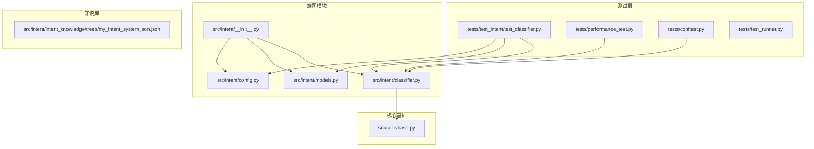
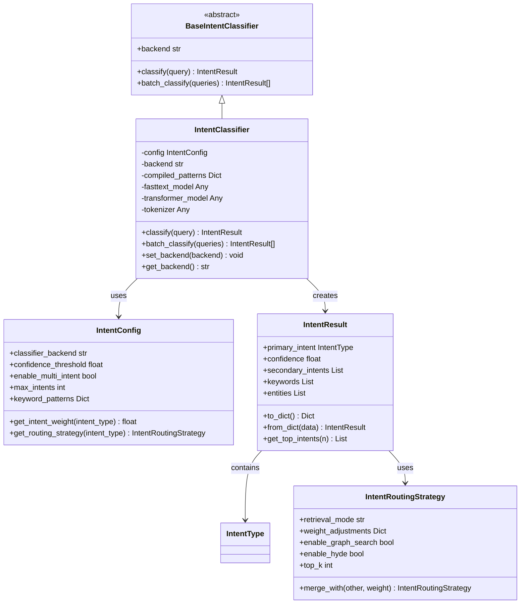
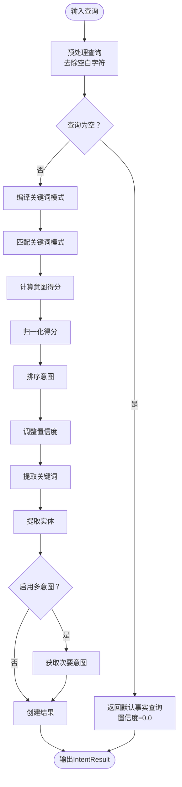
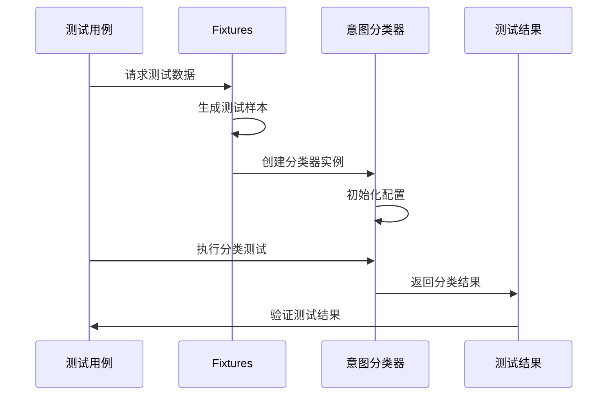
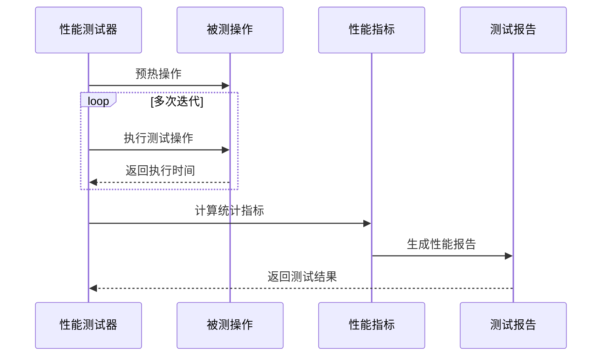

# 意图模块测试

<cite>
**本文档引用的文件**
- [tests/test_intent/test_classifier.py](file://tests/test_intent/test_classifier.py)
- [src/intent/classifier.py](file://src/intent/classifier.py)
- [src/intent/models.py](file://src/intent/models.py)
- [src/intent/config.py](file://src/intent/config.py)
- [src/intent/__init__.py](file://src/intent/__init__.py)
- [src/core/base.py](file://src/core/base.py)
- [tests/performance_test.py](file://tests/performance_test.py)
- [tests/conftest.py](file://tests/conftest.py)
- [tests/test_runner.py](file://tests/test_runner.py)
- [src/intent/intent_knowledge/trees/my_intent_system.json.json](file://src/intent/intent_knowledge/trees/my_intent_system.json.json)
</cite>

## 目录
1. [简介](#简介)
2. [项目结构](#项目结构)
3. [核心组件](#核心组件)
4. [架构概览](#架构概览)
5. [详细组件分析](#详细组件分析)
6. [测试策略与方法](#测试策略与方法)
7. [测试数据准备](#测试数据准备)
8. [评估指标与计算方法](#评估指标与计算方法)
9. [性能基准测试](#性能基准测试)
10. [最佳实践与验证策略](#最佳实践与验证策略)
11. [故障排除指南](#故障排除指南)
12. [结论](#结论)

## 简介

NecoRAG意图模块测试旨在确保意图分类器的准确性和可靠性。该测试框架涵盖了分类准确性测试、分类边界测试和性能基准测试，为意图分析系统的质量保证提供了全面的保障。

## 项目结构

NecoRAG项目采用模块化的架构设计，意图模块位于`src/intent/`目录下，测试文件位于`tests/test_intent/`目录下。这种结构清晰地分离了生产代码和测试代码，便于维护和扩展。

**图表来源**
- [tests/test_intent/test_classifier.py:1-493](file://tests/test_intent/test_classifier.py#L1-L493)
- [src/intent/classifier.py:1-493](file://src/intent/classifier.py#L1-L493)
- [src/intent/models.py:1-231](file://src/intent/models.py#L1-L231)

**章节来源**
- [tests/test_intent/test_classifier.py:1-493](file://tests/test_intent/test_classifier.py#L1-L493)
- [src/intent/classifier.py:1-493](file://src/intent/classifier.py#L1-L493)

## 核心组件

### 意图分类器 (IntentClassifier)

意图分类器是整个测试框架的核心组件，支持多种分类后端：
- **规则分类 (rule_based)**: 基于预定义的关键词模式进行分类
- **FastText分类**: 使用预训练的FastText模型
- **Transformer分类**: 使用BERT等预训练Transformer模型

### 数据模型

系统定义了完整的数据模型体系：
- **IntentType**: 意图类型枚举，包含8种不同的意图类别
- **IntentResult**: 意图分类结果数据结构
- **IntentRoutingStrategy**: 意图路由策略配置
- **SemanticAnalysisResult**: 完整的语义分析结果

### 配置系统

IntentConfig提供了灵活的配置选项：
- 分类器后端选择
- 置信度阈值设置
- 多意图支持配置
- 关键词模式配置
- 路由策略配置

**章节来源**
- [src/intent/classifier.py:20-493](file://src/intent/classifier.py#L20-L493)
- [src/intent/models.py:12-231](file://src/intent/models.py#L12-L231)
- [src/intent/config.py:18-333](file://src/intent/config.py#L18-L333)

## 架构概览

**图表来源**
- [src/core/base.py:661-695](file://src/core/base.py#L661-L695)
- [src/intent/classifier.py:20-493](file://src/intent/classifier.py#L20-L493)
- [src/intent/models.py:27-188](file://src/intent/models.py#L27-L188)
- [src/intent/config.py:18-333](file://src/intent/config.py#L18-L333)

## 详细组件分析

### 规则分类算法

规则分类器实现了基于关键词模式匹配的分类算法：

**图表来源**
- [src/intent/classifier.py:114-206](file://src/intent/classifier.py#L114-L206)

### 关键词提取机制

系统实现了多层次的关键词提取策略：

1. **优先使用jieba分词**：提供高质量的中文关键词提取
2. **备用简单提取**：当jieba不可用时使用基础算法
3. **混合语言支持**：同时支持中文和英文文本

**章节来源**
- [src/intent/classifier.py:208-324](file://src/intent/classifier.py#L208-L324)

### 实体识别系统

实体识别采用多策略融合：
- **中文命名实体**：使用jieba词性标注
- **英文专有名词**：识别大写字母开头的词汇
- **引号内容提取**：提取引号中的特定实体
- **技术术语识别**：识别包含大写字母或数字的词汇

**章节来源**
- [src/intent/classifier.py:271-324](file://src/intent/classifier.py#L271-L324)

## 测试策略与方法

### 分类准确性测试

测试框架提供了全面的分类准确性测试：

#### 基于规则的分类测试
- **解释类意图**: 测试"什么是"、"定义"等关键词
- **操作指导意图**: 测试"如何"、"怎么"、"步骤"等关键词
- **比较分析意图**: 测试"区别"、"比较"、"差异"等关键词
- **推理演绎意图**: 测试"为什么"、"原因"、"因为"等关键词
- **摘要总结意图**: 测试"总结"、"概括"、"要点"等关键词
- **探索发散意图**: 测试"有哪些"、"有什么"、"列举"等关键词
- **事实查询意图**: 测试"多少"、"哪里"、"哪个"等关键词

#### 多语言支持测试
- **中文测试**: 验证中文关键词模式的有效性
- **英文测试**: 确保英文关键词模式的准确性
- **混合语言测试**: 测试中英文混合文本的处理能力

**章节来源**
- [tests/test_intent/test_classifier.py:49-134](file://tests/test_intent/test_classifier.py#L49-L134)

### 分类边界测试

边界测试确保系统在极端情况下的稳定性：

#### 输入边界测试
- **空查询测试**: 验证空字符串的处理
- **空白字符测试**: 测试纯空白字符的处理
- **Unicode字符测试**: 验证Unicode字符的支持
- **超长查询测试**: 测试超长文本的处理能力

#### 置信度边界测试
- **置信度范围限制**: 确保置信度在0-1范围内
- **默认置信度测试**: 验证无匹配时的默认行为
- **置信度调整测试**: 测试相似意图间的置信度调整

**章节来源**
- [tests/test_intent/test_classifier.py:136-174](file://tests/test_intent/test_classifier.py#L136-L174)
- [tests/test_intent/test_classifier.py:193-208](file://tests/test_intent/test_classifier.py#L193-L208)

### 多意图支持测试

系统支持多意图识别功能：

#### 多意图启用测试
- **启用多意图**: 验证多意图识别功能
- **禁用多意图**: 确保单一意图识别的正确性
- **最大意图数量**: 测试max_intents参数的影响

#### 次要意图阈值测试
- **置信度阈值**: 验证次要意图的识别阈值
- **意图排序**: 确保主要意图和次要意图的正确排序

**章节来源**
- [tests/test_intent/test_classifier.py:310-332](file://tests/test_intent/test_classifier.py#L310-L332)

### 后端切换测试

系统支持动态后端切换：

#### 后端有效性测试
- **有效后端测试**: 验证合法后端的设置
- **无效后端测试**: 确保无效后端的回退机制
- **后端状态保持**: 验证后端切换后的状态一致性

#### 模型回退测试
- **FastText回退**: 验证FastText模型缺失时的回退
- **Transformer回退**: 确保Transformer模型缺失时的回退

**章节来源**
- [tests/test_intent/test_classifier.py:334-373](file://tests/test_intent/test_classifier.py#L334-L373)

## 测试数据准备

### 测试样本设计

测试框架提供了丰富的测试样本：

#### 正样本测试
- **明确意图查询**: 包含明确关键词的查询
- **多语言正样本**: 中文和英文的正样本平衡
- **复杂查询**: 包含多个意图的复合查询

#### 负样本测试
- **无关查询**: 与意图分类无关的查询
- **噪声数据**: 包含噪声和干扰的查询
- **边界情况**: 处于分类边界附近的查询

#### 混淆样本测试
- **相似意图混淆**: 不同意图间的混淆测试
- **关键词冲突**: 关键词冲突导致的分类歧义
- **语言混淆**: 中英文混合作品的分类挑战

### 测试数据管理

测试数据通过fixtures系统统一管理：

**图表来源**
- [tests/conftest.py:15-330](file://tests/conftest.py#L15-L330)

**章节来源**
- [tests/conftest.py:15-330](file://tests/conftest.py#L15-L330)

## 评估指标与计算方法

### 分类准确性指标

系统支持多种评估指标：

#### 基础指标
- **准确率 (Accuracy)**: 正确分类的样本比例
- **精确率 (Precision)**: 预测为正类中实际为正类的比例
- **召回率 (Recall)**: 实际正类中被正确预测的比例
- **F1分数**: 精确率和召回率的调和平均

#### 置信度评估
- **置信度分布**: 分析置信度的分布情况
- **置信度阈值**: 测试不同阈值下的性能表现
- **置信度校准**: 验证置信度的可靠性

### 性能指标

#### 基准性能指标
- **响应时间**: 单次分类的平均响应时间
- **吞吐量**: 每秒处理的查询数量
- **内存使用**: 分类器的内存占用情况
- **CPU利用率**: 分类过程的CPU使用情况

#### 压力测试指标
- **并发处理能力**: 多用户并发时的性能表现
- **稳定性**: 长时间运行的稳定性
- **资源泄漏**: 内存和资源的泄漏检测

**章节来源**
- [tests/performance_test.py:17-322](file://tests/performance_test.py#L17-L322)

## 性能基准测试

### 基准测试框架

性能测试框架提供了全面的性能评估能力：

#### 单操作基准测试
- **迭代次数**: 支持可配置的测试迭代次数
- **预热阶段**: 自动进行预热以消除冷启动影响
- **统计分析**: 提供完整的统计分析结果

#### 并发性能测试
- **并发用户数**: 支持可配置的并发用户数量
- **持续时间**: 可配置的测试持续时间
- **负载均衡**: 分析系统在高并发下的表现

#### 压力测试
- **最大持续时间**: 支持长时间的压力测试
- **失败率阈值**: 可配置的失败率容忍度
- **性能监控**: 实时监控系统性能指标

### 性能测试执行

**图表来源**
- [tests/performance_test.py:31-193](file://tests/performance_test.py#L31-L193)

**章节来源**
- [tests/performance_test.py:31-193](file://tests/performance_test.py#L31-L193)

## 最佳实践与验证策略

### 测试设计最佳实践

#### 测试用例设计原则
- **覆盖性原则**: 确保测试用例覆盖所有意图类型
- **平衡性原则**: 正样本、负样本和混淆样本的平衡
- **边界性原则**: 重点关注边界情况和异常情况
- **可重复性原则**: 确保测试结果的可重复性

#### 测试数据管理
- **数据版本控制**: 测试数据的版本管理和变更追踪
- **数据质量保证**: 确保测试数据的准确性和代表性
- **数据安全保护**: 敏感数据的保护和匿名化处理

### 模型验证策略

#### 在线验证策略
- **A/B测试**: 对比新旧模型的性能表现
- **实时监控**: 监控模型性能的实时变化
- **回归检测**: 及时发现模型性能的下降

#### 离线验证策略
- **交叉验证**: 使用交叉验证评估模型稳定性
- **时间序列验证**: 验证模型在不同时间段的表现
- **领域适应性**: 测试模型在不同领域的适用性

### 持续集成策略

#### 自动化测试流水线
- **单元测试**: 每次代码变更后的快速测试
- **集成测试**: 验证模块间的协作功能
- **性能测试**: 定期执行性能基准测试
- **回归测试**: 确保新功能不影响现有功能

#### 测试报告与反馈
- **测试报告生成**: 自动生成详细的测试报告
- **性能趋势分析**: 分析性能指标的变化趋势
- **问题跟踪**: 跟踪和解决测试中发现的问题

**章节来源**
- [tests/test_runner.py:16-327](file://tests/test_runner.py#L16-L327)

## 故障排除指南

### 常见问题诊断

#### 分类错误诊断
- **关键词模式问题**: 检查关键词模式的准确性和完整性
- **置信度阈值问题**: 调整置信度阈值以改善分类效果
- **多意图冲突**: 分析多意图识别中的冲突情况

#### 性能问题诊断
- **内存泄漏**: 使用内存使用测试检测内存泄漏
- **CPU瓶颈**: 分析CPU使用情况识别性能瓶颈
- **I/O等待**: 检查外部依赖的响应时间

### 调试工具使用

#### 日志分析
- **调试日志**: 启用详细日志以追踪问题
- **性能日志**: 分析性能相关的日志信息
- **错误日志**: 检查错误日志以定位问题

#### 性能分析
- **基准测试**: 使用基准测试工具分析性能
- **内存分析**: 使用内存分析工具检测内存问题
- **并发分析**: 分析并发场景下的性能表现

**章节来源**
- [tests/performance_test.py:194-229](file://tests/performance_test.py#L194-L229)

## 结论

NecoRAG意图模块测试框架提供了全面的质量保证体系，涵盖了从基础功能测试到性能基准测试的各个方面。通过精心设计的测试策略和完善的评估指标，确保了意图分类器的准确性、稳定性和性能表现。

测试框架的主要优势包括：
- **全面的测试覆盖**: 涵盖所有意图类型和边界情况
- **灵活的配置系统**: 支持多种测试配置和参数调整
- **强大的性能测试**: 提供完整的性能基准和压力测试能力
- **自动化测试流程**: 支持持续集成和自动化测试执行

通过遵循本文档中介绍的测试策略和最佳实践，可以确保NecoRAG意图模块的高质量和高可靠性，为整个系统的稳定运行提供坚实的基础。