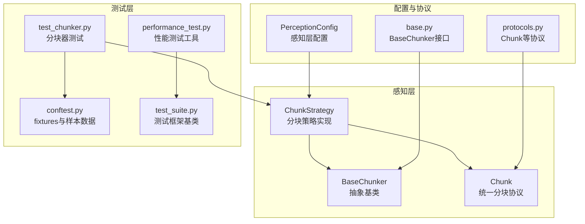
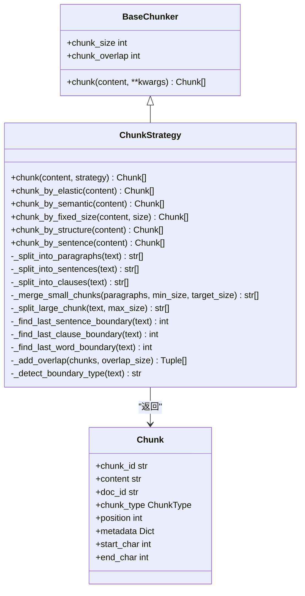
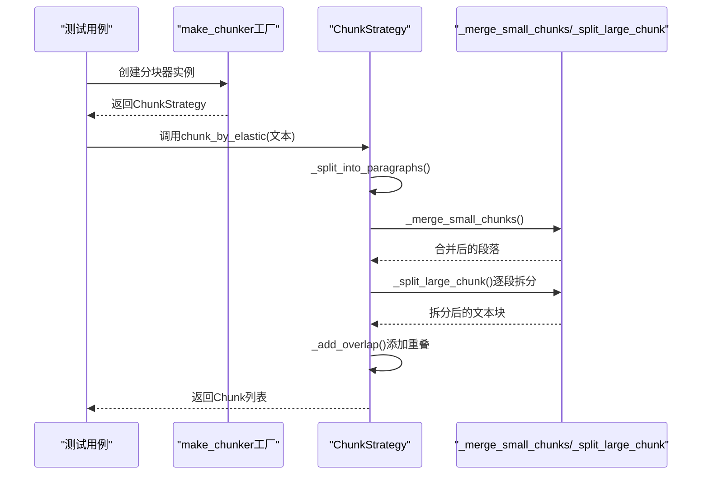
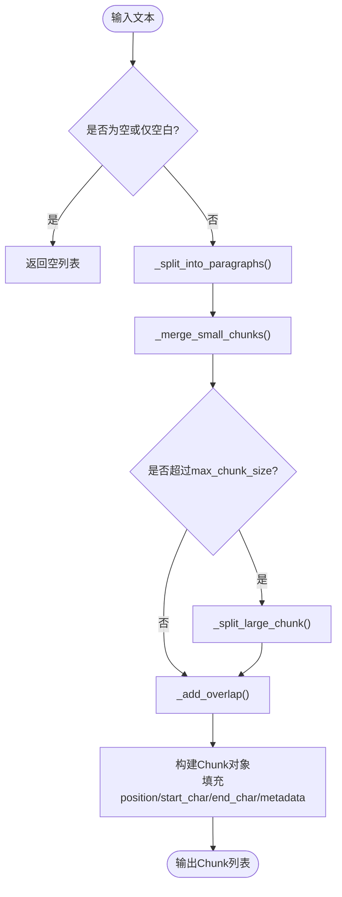
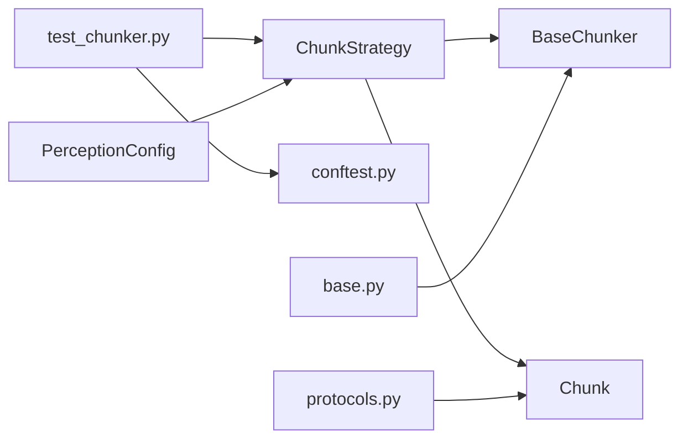

# 感知模块测试

<cite>
**本文档引用的文件**
- [src/perception/chunker.py](file://src/perception/chunker.py)
- [tests/test_perception/test_chunker.py](file://tests/test_perception/test_chunker.py)
- [src/core/base.py](file://src/core/base.py)
- [src/core/protocols.py](file://src/core/protocols.py)
- [src/core/config.py](file://src/core/config.py)
- [tests/conftest.py](file://tests/conftest.py)
- [tests/performance_test.py](file://tests/performance_test.py)
- [tests/test_suite.py](file://tests/test_suite.py)
</cite>

## 目录
1. [引言](#引言)
2. [项目结构](#项目结构)
3. [核心组件](#核心组件)
4. [架构概览](#架构概览)
5. [详细组件分析](#详细组件分析)
6. [依赖分析](#依赖分析)
7. [性能考量](#性能考量)
8. [故障排查指南](#故障排查指南)
9. [结论](#结论)
10. [附录](#附录)

## 引言
本文件面向NecoRAG感知模块的测试实现，聚焦“文档分块器”（Chunker）的测试策略与最佳实践。文档涵盖以下方面：
- 分块算法测试：弹性分块、语义分块、固定大小分块、结构化分块、句子级分块
- 文本处理测试：中英文混合、边界条件、异常处理
- 性能测试：吞吐量、延迟分布、并发与压力测试
- 分块质量评估：准确性、完整性、边界对齐、重叠上下文
- 测试数据构建与评估标准：样本文本、参数扰动、回归基线
- 算法验证策略：策略路由、边界检测、重叠计算、大小约束

## 项目结构
感知模块位于src/perception，核心实现为ChunkStrategy类，继承自BaseChunker抽象基类。测试位于tests/test_perception/test_chunker.py，并通过tests/conftest.py提供的fixtures构造测试数据。

图表来源
- [src/perception/chunker.py:12-101](file://src/perception/chunker.py#L12-L101)
- [src/core/base.py:66-101](file://src/core/base.py#L66-L101)
- [src/core/protocols.py:101-117](file://src/core/protocols.py#L101-L117)
- [src/core/config.py:105-132](file://src/core/config.py#L105-L132)
- [tests/test_perception/test_chunker.py:12-41](file://tests/test_perception/test_chunker.py#L12-L41)
- [tests/conftest.py:151-310](file://tests/conftest.py#L151-L310)
- [tests/performance_test.py:31-193](file://tests/performance_test.py#L31-L193)
- [tests/test_suite.py:145-245](file://tests/test_suite.py#L145-L245)

章节来源
- [src/perception/chunker.py:12-101](file://src/perception/chunker.py#L12-L101)
- [src/core/base.py:66-101](file://src/core/base.py#L66-L101)
- [src/core/protocols.py:101-117](file://src/core/protocols.py#L101-L117)
- [src/core/config.py:105-132](file://src/core/config.py#L105-L132)
- [tests/test_perception/test_chunker.py:12-41](file://tests/test_perception/test_chunker.py#L12-L41)
- [tests/conftest.py:151-310](file://tests/conftest.py#L151-L310)
- [tests/performance_test.py:31-193](file://tests/performance_test.py#L31-L193)
- [tests/test_suite.py:145-245](file://tests/test_suite.py#L145-L245)

## 核心组件
- ChunkStrategy：实现多种分块策略，统一入口chunk()根据策略路由至具体实现；支持弹性分块、语义分块、固定大小分块、结构化分块、句子级分块。
- BaseChunker：定义分块器抽象接口，提供chunk_size、chunk_overlap属性及chunk()方法约定。
- Chunk：统一分块数据结构，包含content、position、start_char、end_char、metadata等字段。
- PerceptionConfig：感知层配置，包含chunk_size、chunk_overlap、min_chunk_size、target_chunk_size、max_chunk_size、enable_elastic_chunking等参数。
- 测试fixtures：提供sample_text_*系列文本样本、make_chunker工厂fixture、perception_config等。

章节来源
- [src/perception/chunker.py:49-85](file://src/perception/chunker.py#L49-L85)
- [src/core/base.py:66-101](file://src/core/base.py#L66-L101)
- [src/core/protocols.py:101-117](file://src/core/protocols.py#L101-L117)
- [src/core/config.py:105-132](file://src/core/config.py#L105-L132)
- [tests/conftest.py:257-310](file://tests/conftest.py#L257-L310)

## 架构概览
分块器采用策略模式，统一入口根据策略参数选择具体实现。弹性分块通过段落合并、大块拆分、边界检测与重叠添加实现高质量分块；语义分块按段落保持语义完整性；固定大小分块使用滑动窗口；句子级分块按中英文标点分割；结构化分块复用语义分块并标注策略。

图表来源
- [src/core/base.py:66-101](file://src/core/base.py#L66-L101)
- [src/perception/chunker.py:12-567](file://src/perception/chunker.py#L12-L567)
- [src/core/protocols.py:101-117](file://src/core/protocols.py#L101-L117)

## 详细组件分析

### 分块策略与算法测试
- 统一入口测试：验证默认策略、显式策略、无效策略抛错。
- 弹性分块测试：最小/目标/最大块大小参数影响、合并小段落、拆分大块、尊重最大大小限制、中英文混合文本。
- 语义分块测试：按段落保持完整性、边界信息正确。
- 固定大小分块测试：滑动窗口、重叠、自定义大小。
- 结构化分块测试：基于语义分块扩展。
- 句子级分块测试：中英文标点分割、边界对齐。

图表来源
- [tests/test_perception/test_chunker.py:141-219](file://tests/test_perception/test_chunker.py#L141-L219)
- [src/perception/chunker.py:89-141](file://src/perception/chunker.py#L89-L141)

章节来源
- [tests/test_perception/test_chunker.py:76-139](file://tests/test_perception/test_chunker.py#L76-L139)
- [tests/test_perception/test_chunker.py:141-219](file://tests/test_perception/test_chunker.py#L141-L219)
- [tests/test_perception/test_chunker.py:221-243](file://tests/test_perception/test_chunker.py#L221-L243)
- [tests/test_perception/test_chunker.py:275-305](file://tests/test_perception/test_chunker.py#L275-L305)
- [tests/test_perception/test_chunker.py:307-318](file://tests/test_perception/test_chunker.py#L307-L318)
- [tests/test_perception/test_chunker.py:245-273](file://tests/test_perception/test_chunker.py#L245-L273)

### 文本处理与边界条件测试
- 空文本、仅空白、单字符、超长文本、无段落分隔、仅标点等边界场景全覆盖。
- 中英文混合句子分割、标点识别、CJK词边界处理。
- 重叠上下文添加、位置信息校验、元数据完整性。

图表来源
- [tests/test_perception/test_chunker.py:320-388](file://tests/test_perception/test_chunker.py#L320-L388)
- [src/perception/chunker.py:269-538](file://src/perception/chunker.py#L269-L538)

章节来源
- [tests/test_perception/test_chunker.py:320-388](file://tests/test_perception/test_chunker.py#L320-L388)
- [src/perception/chunker.py:269-538](file://src/perception/chunker.py#L269-L538)

### 分块质量评估测试
- 准确性：策略标记正确（chunk_strategy）、边界类型检测（semantic_boundary）。
- 完整性：位置信息start_char/end_char单调递增、position连续。
- 边界对齐：句子/子句/词边界查找与截断，避免强制切割过早。
- 重叠上下文：重叠长度与前后块拼接正确。

章节来源
- [tests/test_perception/test_chunker.py:390-424](file://tests/test_perception/test_chunker.py#L390-L424)
- [tests/test_perception/test_chunker.py:426-490](file://tests/test_perception/test_chunker.py#L426-L490)
- [src/perception/chunker.py:502-567](file://src/perception/chunker.py#L502-L567)

### 异常处理测试
- 无效策略参数：抛出ValueError并包含提示信息。
- 导入/实例化异常：通过pytest.skip跳过不可用模块，避免中断测试套件。

章节来源
- [tests/test_perception/test_chunker.py:131-139](file://tests/test_perception/test_chunker.py#L131-L139)
- [tests/test_perception/test_chunker.py:14-27](file://tests/test_perception/test_chunker.py#L14-L27)

### 测试数据构建与评估标准
- 样本数据：短/中/长文本、中文/英文/混合文本、带段落/无段落等。
- 参数扰动：min_chunk_size/target_chunk_size/max_chunk_size组合变化，观察块数量与长度分布。
- 回归基线：固定大小分块作为基准，对比弹性分块的块数量与平均长度。

章节来源
- [tests/conftest.py:257-310](file://tests/conftest.py#L257-L310)
- [tests/test_perception/test_chunker.py:492-532](file://tests/test_perception/test_chunker.py#L492-L532)

### 算法验证策略
- 策略路由：统一入口根据strategy参数选择具体实现，确保兼容性与可替换性。
- 边界检测：多级优先级（句子→子句→词边界），最后强制切割，兼顾语义与性能。
- 重叠计算：前一块末尾与当前块拼接，避免首块添加重叠，保证上下文连贯。

章节来源
- [src/perception/chunker.py:49-85](file://src/perception/chunker.py#L49-L85)
- [src/perception/chunker.py:381-433](file://src/perception/chunker.py#L381-L433)
- [src/perception/chunker.py:502-538](file://src/perception/chunker.py#L502-L538)

## 依赖分析
- 组件耦合：ChunkStrategy依赖BaseChunker接口与Chunk协议；测试依赖conftest提供的fixtures。
- 外部依赖：正则表达式用于文本分割与边界查找；pytest用于测试运行与断言。
- 配置依赖：PerceptionConfig驱动分块参数，确保测试与生产一致。

图表来源
- [src/perception/chunker.py:12-101](file://src/perception/chunker.py#L12-L101)
- [src/core/base.py:66-101](file://src/core/base.py#L66-L101)
- [src/core/protocols.py:101-117](file://src/core/protocols.py#L101-L117)
- [src/core/config.py:105-132](file://src/core/config.py#L105-L132)
- [tests/test_perception/test_chunker.py:12-41](file://tests/test_perception/test_chunker.py#L12-L41)
- [tests/conftest.py:151-310](file://tests/conftest.py#L151-L310)

章节来源
- [src/perception/chunker.py:12-101](file://src/perception/chunker.py#L12-L101)
- [src/core/base.py:66-101](file://src/core/base.py#L66-L101)
- [src/core/protocols.py:101-117](file://src/core/protocols.py#L101-L117)
- [src/core/config.py:105-132](file://src/core/config.py#L105-L132)
- [tests/test_perception/test_chunker.py:12-41](file://tests/test_perception/test_chunker.py#L12-L41)
- [tests/conftest.py:151-310](file://tests/conftest.py#L151-L310)

## 性能考量
- 基准测试：使用PerformanceTester.benchmark_single_operation测量单操作平均耗时、吞吐量、中位数与95分位延迟。
- 并发测试：PerformanceTester.benchmark_concurrent_operations模拟多用户并发，统计总操作数与吞吐。
- 压力测试：PerformanceTester.stress_test在限定时间内持续执行，统计失败率与稳定阈值。
- 内存测试：PerformanceTester.memory_usage_test采样进程内存，评估峰值与增长趋势。
- 测试框架：tests/test_suite.py提供统一的测试基类与套件管理，便于集成性能测试。

章节来源
- [tests/performance_test.py:31-193](file://tests/performance_test.py#L31-L193)
- [tests/test_suite.py:145-245](file://tests/test_suite.py#L145-L245)

## 故障排查指南
- 导入/实例化失败：检查make_chunker工厂与pytest.skip逻辑，确认ChunkStrategy可用性。
- 分块异常：核对策略参数范围（min/target/max），确保enable_elastic与策略匹配。
- 边界检测异常：检查正则表达式与标点集合，验证中英文标点覆盖。
- 性能退化：使用PerformanceTester定位瓶颈，关注大文本拆分与重叠拼接开销。

章节来源
- [tests/test_perception/test_chunker.py:14-27](file://tests/test_perception/test_chunker.py#L14-L27)
- [tests/test_perception/test_chunker.py:131-139](file://tests/test_perception/test_chunker.py#L131-L139)
- [src/perception/chunker.py:286-501](file://src/perception/chunker.py#L286-L501)

## 结论
本测试文档系统化梳理了NecoRAG感知模块分块器的测试策略与实现要点，覆盖算法、文本处理、边界条件、异常处理与性能测试。通过统一的测试夹具与协议，确保分块质量与稳定性；借助性能测试工具，量化吞吐与延迟，为生产部署提供可靠保障。

## 附录
- 测试最佳实践
  - 使用fixtures提供多样化样本文本，覆盖中英文、混合与极端场景。
  - 参数扰动测试：系统性变更min/target/max，观察块数量与长度分布。
  - 策略对比：固定大小分块作为基线，弹性分块作为实验组，对比召回与检索效率。
  - 性能回归：定期运行基准与压力测试，建立性能基线与阈值。
  - 异常隔离：对导入/实例化失败进行skip处理，避免阻断整体测试套件。