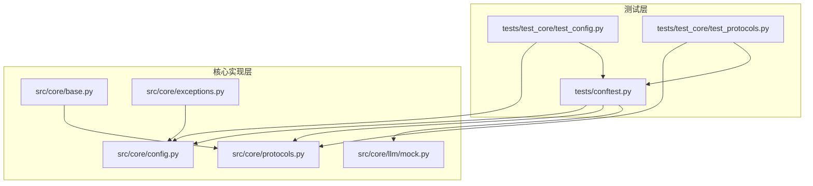
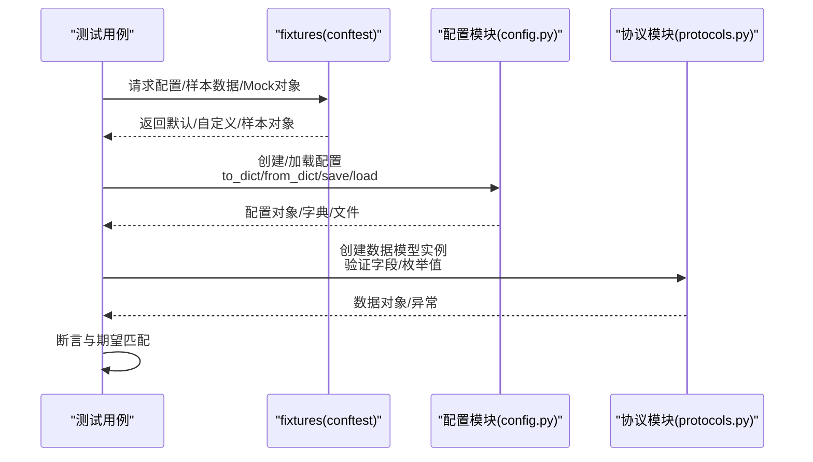
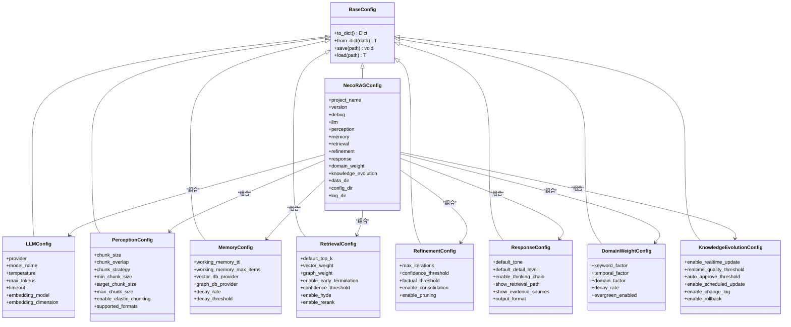
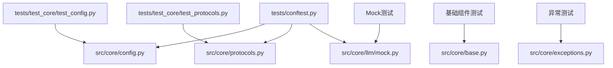

# 核心模块测试

<cite>
**本文档引用的文件**
- [tests/test_core/test_config.py](file://tests/test_core/test_config.py)
- [tests/test_core/test_protocols.py](file://tests/test_core/test_protocols.py)
- [src/core/config.py](file://src/core/config.py)
- [src/core/protocols.py](file://src/core/protocols.py)
- [src/core/base.py](file://src/core/base.py)
- [src/core/exceptions.py](file://src/core/exceptions.py)
- [src/core/llm/mock.py](file://src/core/llm/mock.py)
- [tests/conftest.py](file://tests/conftest.py)
</cite>

## 目录
1. [引言](#引言)
2. [项目结构](#项目结构)
3. [核心组件](#核心组件)
4. [架构总览](#架构总览)
5. [详细组件分析](#详细组件分析)
6. [依赖分析](#依赖分析)
7. [性能考虑](#性能考虑)
8. [故障排除指南](#故障排除指南)
9. [结论](#结论)
10. [附录](#附录)

## 引言
本文件面向NecoRAG核心模块测试，聚焦配置测试与协议测试两大主题，系统梳理测试用例设计思路、断言方法、测试数据准备与mock对象使用策略，并总结最佳实践与常见问题解决方案。通过对配置模块（含预设配置、序列化/反序列化、环境变量覆盖）与协议模块（统一数据模型与枚举类型）的深入分析，帮助开发者高效构建稳定可靠的测试体系。

## 项目结构
核心测试位于tests/test_core目录，分别覆盖配置与协议两大部分；核心实现位于src/core目录，包含配置管理、数据协议、抽象基类、异常定义以及Mock LLM客户端；测试共享fixtures位于tests/conftest.py，提供跨测试复用的配置、样本数据与Mock对象。

**图表来源**
- [tests/test_core/test_config.py:1-397](file://tests/test_core/test_config.py#L1-L397)
- [tests/test_core/test_protocols.py:1-494](file://tests/test_core/test_protocols.py#L1-L494)
- [src/core/config.py:1-420](file://src/core/config.py#L1-L420)
- [src/core/protocols.py:1-298](file://src/core/protocols.py#L1-L298)
- [src/core/base.py:1-800](file://src/core/base.py#L1-L800)
- [src/core/exceptions.py:1-455](file://src/core/exceptions.py#L1-L455)
- [src/core/llm/mock.py:1-313](file://src/core/llm/mock.py#L1-L313)
- [tests/conftest.py:1-330](file://tests/conftest.py#L1-L330)

**章节来源**
- [tests/test_core/test_config.py:1-397](file://tests/test_core/test_config.py#L1-L397)
- [tests/test_core/test_protocols.py:1-494](file://tests/test_core/test_protocols.py#L1-L494)
- [src/core/config.py:1-420](file://src/core/config.py#L1-L420)
- [src/core/protocols.py:1-298](file://src/core/protocols.py#L1-L298)
- [tests/conftest.py:1-330](file://tests/conftest.py#L1-L330)

## 核心组件
- 配置模块：提供全局配置类与各子配置类，支持默认值、自定义值、字典序列化/反序列化、文件加载、环境变量覆盖与预设配置。
- 协议模块：定义统一数据模型（文档、分块、向量、记忆、实体、关系、查询、检索结果、响应、用户画像等）与枚举类型，确保模块间数据交换一致性。
- 抽象基类：定义感知层、记忆层、检索层、巩固层、LLM客户端、响应适配器等抽象接口，保证实现的一致性与可替换性。
- 异常定义：统一异常体系，按模块分类，便于错误处理与追踪。
- Mock LLM客户端：提供确定性响应与向量生成，便于测试与演示。

**章节来源**
- [src/core/config.py:1-420](file://src/core/config.py#L1-L420)
- [src/core/protocols.py:1-298](file://src/core/protocols.py#L1-L298)
- [src/core/base.py:1-800](file://src/core/base.py#L1-L800)
- [src/core/exceptions.py:1-455](file://src/core/exceptions.py#L1-L455)
- [src/core/llm/mock.py:1-313](file://src/core/llm/mock.py#L1-L313)

## 架构总览
核心模块测试围绕“配置验证”和“协议接口验证”两条主线展开，通过pytest fixtures提供稳定的测试数据与Mock对象，确保测试的可重复性与隔离性。

**图表来源**
- [tests/conftest.py:1-330](file://tests/conftest.py#L1-L330)
- [src/core/config.py:1-420](file://src/core/config.py#L1-L420)
- [src/core/protocols.py:1-298](file://src/core/protocols.py#L1-L298)

## 详细组件分析

### 配置测试分析
配置测试覆盖默认值、自定义值、子配置完整性、序列化/反序列化、文件保存/加载、枚举类型、预设配置与环境变量覆盖等关键场景。

- 默认值与自定义值验证
  - 通过构造默认配置与自定义配置，断言关键字段值与类型正确性。
  - 示例断言路径：[tests/test_core/test_config.py:38-56](file://tests/test_core/test_config.py#L38-L56)

- 子配置完整性
  - 断言全局配置包含所有子配置对象类型正确。
  - 示例断言路径：[tests/test_core/test_config.py:57-69](file://tests/test_core/test_config.py#L57-L69)

- 字典序列化/反序列化
  - to_dict输出为字典且包含关键键；from_dict从字典重建配置。
  - 示例断言路径：[tests/test_core/test_config.py:70-99](file://tests/test_core/test_config.py#L70-L99)

- 文件保存/加载
  - 临时文件写入与读取，验证保存/加载一致性；对JSON序列化异常进行跳过处理。
  - 示例断言路径：[tests/test_core/test_config.py:101-122](file://tests/test_core/test_config.py#L101-L122)

- 枚举类型测试
  - LLMProvider、VectorDBProvider、GraphDBProvider等枚举值正确。
  - 示例断言路径：[tests/test_core/test_config.py:145-153](file://tests/test_core/test_config.py#L145-L153)

- 预设配置
  - development/production/minimal预设配置的关键开关与默认值验证。
  - 示例断言路径：[tests/test_core/test_config.py:312-338](file://tests/test_core/test_config.py#L312-L338)

- 配置加载函数
  - load_config支持默认值、文件加载与环境变量覆盖，返回NecoRAGConfig实例。
  - 示例断言路径：[tests/test_core/test_config.py:364-397](file://tests/test_core/test_config.py#L364-L397)

- 配置类继承关系
  - BaseConfig提供通用序列化/反序列化/文件IO能力；NecoRAGConfig递归处理子配置枚举。
  - 示例断言路径：[src/core/config.py:45-77](file://src/core/config.py#L45-L77)、[src/core/config.py:303-334](file://src/core/config.py#L303-L334)

**图表来源**
- [src/core/config.py:45-420](file://src/core/config.py#L45-L420)

**章节来源**
- [tests/test_core/test_config.py:35-397](file://tests/test_core/test_config.py#L35-L397)
- [src/core/config.py:45-420](file://src/core/config.py#L45-L420)

### 协议测试分析
协议测试覆盖所有统一数据模型与枚举类型的创建与字段验证，确保跨模块数据交换的稳定性与一致性。

- 枚举类型测试
  - DocumentType、ChunkType、MemoryLayer、RetrievalSource、ResponseTone、DetailLevel、IntentType等枚举值正确。
  - 示例断言路径：[tests/test_core/test_protocols.py:49-102](file://tests/test_core/test_protocols.py#L49-L102)

- 文档与分块
  - Document默认字段与自动标题推断；Chunk位置信息与链表字段验证。
  - 示例断言路径：[tests/test_core/test_protocols.py:107-180](file://tests/test_core/test_protocols.py#L107-L180)

- 情境标签
  - ContextTag默认值与自定义值验证。
  - 示例断言路径：[tests/test_core/test_protocols.py:185-210](file://tests/test_core/test_protocols.py#L185-L210)

- 向量与编码分块
  - Embedding维度自动推断与稀疏向量支持；EncodedChunk包含向量与实体信息。
  - 示例断言路径：[tests/test_core/test_protocols.py:215-257](file://tests/test_core/test_protocols.py#L215-L257)

- 记忆、实体与关系
  - Memory访问计数与时间戳更新；Entity/Relation属性验证。
  - 示例断言路径：[tests/test_core/test_protocols.py:262-330](file://tests/test_core/test_protocols.py#L262-L330)

- 查询与检索结果
  - Query默认字段与自定义值；RetrievalResult评分与来源验证。
  - 示例断言路径：[tests/test_core/test_protocols.py:335-384](file://tests/test_core/test_protocols.py#L335-L384)

- 响应与用户画像
  - GeneratedAnswer/CritiqueResult/HallucinationReport字段验证；Response默认值与自定义值；UserProfile偏好与兴趣验证。
  - 示例断言路径：[tests/test_core/test_protocols.py:389-494](file://tests/test_core/test_protocols.py#L389-L494)

```mermaid
classDiagram
class Document {
+doc_id
+content
+doc_type
+file_path
+title
+metadata
+created_at
}
class Chunk {
+chunk_id
+content
+doc_id
+chunk_type
+position
+metadata
+start_char
+end_char
+prev_chunk_id
+next_chunk_id
}
class ContextTag {
+time_tag
+emotion_tag
+importance
+topics
+entities
}
class Embedding {
+embedding_id
+chunk_id
+dense_vector
+sparse_vector
+dimension
+model_name
}
class EncodedChunk {
+chunk_id
+content
+dense_vector
+sparse_vector
+entities
+context_tags
+metadata
}
class Memory {
+memory_id
+content
+layer
+vector
+weight
+access_count
+created_at
+last_accessed
+metadata
+update_access()
}
class Entity {
+entity_id
+name
+entity_type
+properties
+created_at
}
class Relation {
+relation_id
+source_id
+target_id
+relation_type
+weight
+properties
+created_at
}
class Query {
+query_id
+text
+user_id
+session_id
+vector
+filters
+top_k
+threshold
+created_at
}
class RetrievalResult {
+result_id
+memory_id
+content
+score
+source
+metadata
+retrieval_path
}
class GeneratedAnswer {
+answer_id
+content
+confidence
+evidence
+sources
+iteration
+is_refined
}
class CritiqueResult {
+critique_id
+is_valid
+issues
+suggestions
+scores
}
class HallucinationReport {
+report_id
+has_hallucination
+factual_score
+logical_score
+evidence_score
+issues
}
class Response {
+response_id
+query_id
+content
+confidence
+sources
+thinking_chain
+tone
+detail_level
+citations
+metadata
+created_at
}
class UserProfile {
+user_id
+name
+profession
+knowledge_level
+preferred_tone
+preferred_detail
+interests
+preferred_domains
+query_history
+interaction_count
+metadata
+created_at
+updated_at
}
```

**图表来源**
- [src/core/protocols.py:83-298](file://src/core/protocols.py#L83-L298)

**章节来源**
- [tests/test_core/test_protocols.py:46-494](file://tests/test_core/test_protocols.py#L46-L494)
- [src/core/protocols.py:14-298](file://src/core/protocols.py#L14-L298)

### 基础组件测试分析
基础组件测试关注抽象基类的接口契约与实现一致性，确保各层组件遵循统一规范。

- 抽象基类覆盖范围
  - 感知层：BaseParser、BaseChunker、BaseEncoder、BaseTagger
  - 记忆层：BaseMemoryStore、BaseVectorStore、BaseGraphStore
  - 检索层：BaseRetriever、BaseReranker
  - 巩固层：BaseGenerator、BaseCritic、BaseRefiner、BaseHallucinationDetector
  - LLM：BaseLLMClient、BaseAsyncLLMClient
  - 响应层：BaseResponseAdapter

- 接口契约验证
  - 通过pytest标记与类型注解，确保实现类满足抽象接口约束。
  - 示例断言路径：[src/core/base.py:32-800](file://src/core/base.py#L32-L800)

- 异常体系
  - 统一异常基类与按模块细分的异常类型，便于测试中捕获与断言。
  - 示例断言路径：[src/core/exceptions.py:10-455](file://src/core/exceptions.py#L10-L455)

**章节来源**
- [src/core/base.py:1-800](file://src/core/base.py#L1-L800)
- [src/core/exceptions.py:1-455](file://src/core/exceptions.py#L1-L455)

### 测试数据准备与Mock对象策略
- fixtures设计
  - 配置fixtures：default_config、development_config、minimal_config、custom_config等，覆盖默认、开发、最小化与自定义场景。
  - 样本数据fixtures：sample_document、sample_chunks、sample_query、sample_entity、sample_relation、sample_user_profile、sample_memory等，提供标准化测试数据。
  - 文本样本fixtures：sample_text_short、sample_text_medium、sample_text_long、sample_text_chinese、sample_text_english、sample_text_mixed，覆盖多语言与长度场景。
  - Mock客户端fixtures：mock_llm_client、mock_llm_client_small_dim，支持确定性响应与不同维度向量。
  - 示例断言路径：[tests/conftest.py:48-330](file://tests/conftest.py#L48-L330)

- Mock LLM客户端
  - MockLLMClient提供确定性生成与嵌入，支持响应类型检测与模板填充。
  - MockLLMClientWithMemory提供调用历史记录，便于测试验证。
  - 示例断言路径：[src/core/llm/mock.py:16-313](file://src/core/llm/mock.py#L16-L313)

**章节来源**
- [tests/conftest.py:1-330](file://tests/conftest.py#L1-L330)
- [src/core/llm/mock.py:1-313](file://src/core/llm/mock.py#L1-L313)

## 依赖分析
- 测试对实现的依赖
  - 配置测试依赖config.py中的配置类与工具函数。
  - 协议测试依赖protocols.py中的数据模型与枚举。
  - 基础组件测试依赖base.py中的抽象接口。
  - 异常测试依赖exceptions.py中的异常类型。
  - Mock对象依赖llm/mock.py中的MockLLMClient实现。
- fixtures对实现的依赖
  - conftest.py中的fixtures直接依赖src/core下的配置、协议与Mock实现。

**图表来源**
- [tests/test_core/test_config.py:16-32](file://tests/test_core/test_config.py#L16-L32)
- [tests/test_core/test_protocols.py:13-43](file://tests/test_core/test_protocols.py#L13-L43)
- [src/core/config.py:1-420](file://src/core/config.py#L1-L420)
- [src/core/protocols.py:1-298](file://src/core/protocols.py#L1-L298)
- [src/core/base.py:1-800](file://src/core/base.py#L1-L800)
- [src/core/exceptions.py:1-455](file://src/core/exceptions.py#L1-L455)
- [src/core/llm/mock.py:1-313](file://src/core/llm/mock.py#L1-L313)
- [tests/conftest.py:15-43](file://tests/conftest.py#L15-L43)

**章节来源**
- [tests/test_core/test_config.py:16-32](file://tests/test_core/test_config.py#L16-L32)
- [tests/test_core/test_protocols.py:13-43](file://tests/test_core/test_protocols.py#L13-L43)
- [tests/conftest.py:15-43](file://tests/conftest.py#L15-L43)

## 性能考虑
- 测试执行效率
  - 使用pytest fixtures减少重复创建对象的成本，提升测试运行速度。
  - 对Mock LLM客户端进行确定性响应，避免外部依赖导致的不稳定与耗时。
- 序列化/反序列化开销
  - 配置的to_dict/from_dict与文件IO操作在测试中应尽量使用内存或临时文件，避免磁盘IO影响。
- 并行测试
  - 配置与协议测试均为纯数据验证，适合并行执行；注意避免共享状态污染。

## 故障排除指南
- 配置序列化问题
  - 当出现枚举无法JSON序列化的错误时，测试中使用skip跳过，确保不影响整体测试流程。
  - 参考断言路径：[tests/test_core/test_config.py:114-118](file://tests/test_core/test_config.py#L114-L118)

- 环境变量覆盖
  - load_config支持环境变量覆盖，若未生效需检查环境变量前缀与键名是否正确。
  - 参考实现路径：[src/core/config.py:338-377](file://src/core/config.py#L338-L377)

- Mock LLM客户端行为
  - 若响应不符合预期，检查响应类型检测逻辑与模板选择策略。
  - 参考实现路径：[src/core/llm/mock.py:72-117](file://src/core/llm/mock.py#L72-L117)

**章节来源**
- [tests/test_core/test_config.py:114-118](file://tests/test_core/test_config.py#L114-L118)
- [src/core/config.py:338-377](file://src/core/config.py#L338-L377)
- [src/core/llm/mock.py:72-117](file://src/core/llm/mock.py#L72-L117)

## 结论
本测试文档系统梳理了NecoRAG核心模块的配置与协议测试，明确了测试用例设计思路、断言方法与数据准备策略。通过fixtures与Mock对象的合理使用，确保测试的稳定性与可维护性；通过抽象基类与异常体系的完善，保障模块间接口契约与错误处理的一致性。建议在后续迭代中持续扩展测试覆盖面，特别是异常路径与边界条件的验证。

## 附录
- 最佳实践
  - 使用fixtures集中管理测试数据与Mock对象，保持测试用例的独立性。
  - 对配置与协议的默认值与边界值进行充分验证，确保实现与文档一致。
  - 对序列化/反序列化与文件IO进行隔离测试，避免外部依赖干扰。
  - 利用Mock LLM客户端的确定性特性，简化复杂流程的测试验证。
- 常见问题
  - 枚举序列化失败：在测试中使用skip处理，同时完善配置类的to_dict实现。
  - 环境变量未生效：核对环境变量前缀与键名映射。
  - 响应类型识别偏差：优化响应类型检测逻辑与模板选择策略。