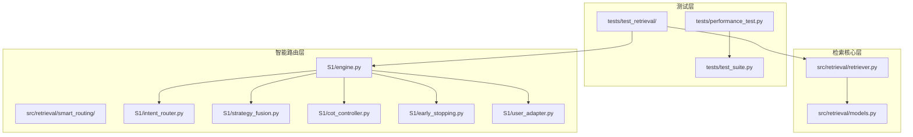
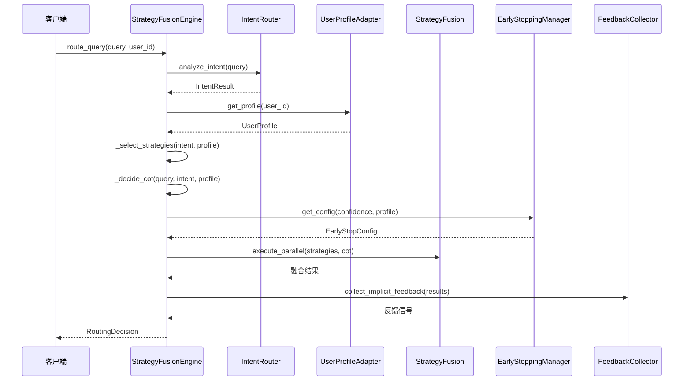
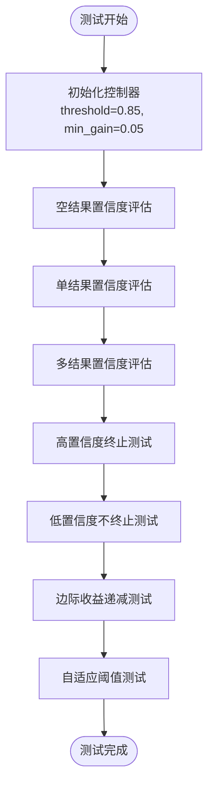
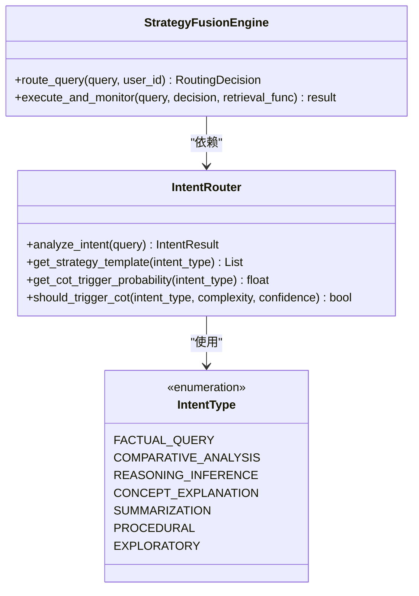
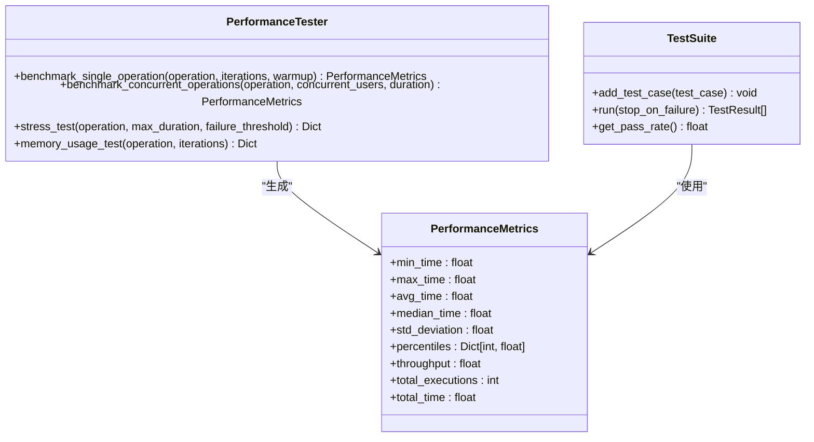
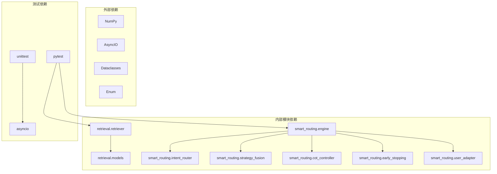

# 检索模块测试

<cite>
**本文档引用的文件**
- [tests/test_retrieval/test_retriever.py](file://tests/test_retrieval/test_retriever.py)
- [tests/test_retrieval/test_smart_routing.py](file://tests/test_retrieval/test_smart_routing.py)
- [src/retrieval/retriever.py](file://src/retrieval/retriever.py)
- [src/retrieval/smart_routing/engine.py](file://src/retrieval/smart_routing/engine.py)
- [src/retrieval/smart_routing/intent_router.py](file://src/retrieval/smart_routing/intent_router.py)
- [src/retrieval/smart_routing/strategy_fusion.py](file://src/retrieval/smart_routing/strategy_fusion.py)
- [src/retrieval/smart_routing/cot_controller.py](file://src/retrieval/smart_routing/cot_controller.py)
- [src/retrieval/smart_routing/early_stopping.py](file://src/retrieval/smart_routing/early_stopping.py)
- [src/retrieval/smart_routing/user_adapter.py](file://src/retrieval/smart_routing/user_adapter.py)
- [src/retrieval/models.py](file://src/retrieval/models.py)
- [tests/performance_test.py](file://tests/performance_test.py)
- [tests/test_suite.py](file://tests/test_suite.py)
</cite>

## 目录
1. [引言](#引言)
2. [项目结构](#项目结构)
3. [核心组件](#核心组件)
4. [架构概览](#架构概览)
5. [详细组件分析](#详细组件分析)
6. [依赖分析](#依赖分析)
7. [性能考虑](#性能考虑)
8. [故障排除指南](#故障排除指南)
9. [结论](#结论)
10. [附录](#附录)

## 引言

本文档为NecoRAG检索模块测试提供了全面的技术实现文档。重点涵盖两个核心测试领域：检索器测试和智能路由测试。文档深入解释了以下关键方面：

- **检索准确性测试策略**：包括相似度计算验证、结果排序测试和多路检索测试
- **路由决策测试**：智能路由的决策逻辑验证和异常情况处理
- **性能基准测试**：单操作基准测试、并发性能测试和压力测试
- **测试用例设计**：针对检索算法和智能路由的系统化测试方案
- **最佳实践指南**：测试实施的最佳实践和性能优化建议

## 项目结构

NecoRAG检索模块采用分层架构设计，主要包含以下核心目录结构：

**图表来源**
- [tests/test_retrieval/test_retriever.py:1-410](file://tests/test_retrieval/test_retriever.py#L1-L410)
- [src/retrieval/retriever.py:1-644](file://src/retrieval/retriever.py#L1-L644)
- [src/retrieval/smart_routing/engine.py:1-274](file://src/retrieval/smart_routing/engine.py#L1-L274)

**章节来源**
- [tests/test_retrieval/test_retriever.py:1-50](file://tests/test_retrieval/test_retriever.py#L1-L50)
- [src/retrieval/retriever.py:1-50](file://src/retrieval/retriever.py#L1-L50)

## 核心组件

### 检索器组件

检索器模块的核心组件包括：

1. **EarlyTerminationController** - 早停控制器，实现智能检索终止策略
2. **AdaptiveRetriever** - 自适应检索器，集成多种检索策略
3. **RetrievalResult** - 检索结果数据模型
4. **QueryAnalysis** - 查询分析结果数据模型

### 智能路由组件

智能路由模块包含七个核心组件：

1. **StrategyFusionEngine** - 主引擎，协调所有子模块
2. **IntentRouter** - 意图路由器，识别查询语义意图
3. **StrategyFusion** - 策略融合引擎，多策略并行执行
4. **CoTController** - 思维链控制器，智能推理触发
5. **EarlyStoppingManager** - 早停管理器，性能监控与降级
6. **UserProfileAdapter** - 用户画像适配器，个性化定制
7. **FeedbackCollector/StrategyLearner** - 反馈收集与策略学习

**章节来源**
- [src/retrieval/retriever.py:43-133](file://src/retrieval/retriever.py#L43-L133)
- [src/retrieval/smart_routing/engine.py:34-130](file://src/retrieval/smart_routing/engine.py#L34-L130)

## 架构概览

NecoRAG检索模块采用三层智能路由架构：

**图表来源**
- [src/retrieval/smart_routing/engine.py:68-129](file://src/retrieval/smart_routing/engine.py#L68-L129)
- [src/retrieval/smart_routing/intent_router.py:115-155](file://src/retrieval/smart_routing/intent_router.py#L115-L155)

## 详细组件分析

### 检索器测试分析

#### 早停控制器测试

早停控制器测试涵盖了以下关键场景：

**图表来源**
- [tests/test_retrieval/test_retriever.py:19-117](file://tests/test_retrieval/test_retriever.py#L19-L117)

**章节来源**
- [tests/test_retrieval/test_retriever.py:19-117](file://tests/test_retrieval/test_retriever.py#L19-L117)
- [src/retrieval/retriever.py:43-133](file://src/retrieval/retriever.py#L43-L133)

#### 自适应检索器测试

自适应检索器测试包括：

1. **初始化测试**：验证默认参数和自定义配置
2. **基本检索测试**：验证检索流程和结果格式
3. **参数控制测试**：top_k、min_score、查询向量等参数验证
4. **查询分析测试**：查询类型和复杂度分析
5. **HyDE增强测试**：假设文档检索功能
6. **多跳检索测试**：图谱多跳查询

**章节来源**
- [tests/test_retrieval/test_retriever.py:119-410](file://tests/test_retrieval/test_retriever.py#L119-L410)

### 智能路由测试分析

#### 意图路由器测试

意图路由器测试验证了七种语义意图的识别能力：

**图表来源**
- [src/retrieval/smart_routing/intent_router.py:13-22](file://src/retrieval/smart_routing/intent_router.py#L13-L22)
- [src/retrieval/smart_routing/engine.py:68-129](file://src/retrieval/smart_routing/engine.py#L68-L129)

**章节来源**
- [tests/test_retrieval/test_smart_routing.py:19-72](file://tests/test_retrieval/test_smart_routing.py#L19-L72)

#### 用户画像适配器测试

用户画像适配器测试涵盖了：

1. **用户画像获取测试**：异步获取用户画像功能
2. **专业度更新测试**：用户专业度的学习和更新
3. **专业度分类测试**：基于专业度数值的分类
4. **响应风格适配测试**：根据用户偏好调整响应风格

**章节来源**
- [tests/test_retrieval/test_smart_routing.py:74-121](file://tests/test_retrieval/test_smart_routing.py#L74-L121)

#### CoT控制器测试

CoT（思维链）控制器测试验证了：

1. **推理触发判断测试**：基于复杂度和置信度的触发逻辑
2. **深度确定测试**：根据用户画像和意图复杂度确定推理深度
3. **专家用户处理测试**：为不同专业度用户提供合适的推理深度

**章节来源**
- [tests/test_retrieval/test_smart_routing.py:123-174](file://tests/test_retrieval/test_smart_routing.py#L123-L174)

#### 早停机制测试

早停机制测试包括：

1. **置信度阈值早停测试**：高置信度时的早停判断
2. **延迟预算早停测试**：基于性能预算的早停
3. **降级等级测试**：不同延迟水平下的降级策略

**章节来源**
- [tests/test_retrieval/test_smart_routing.py:176-218](file://tests/test_retrieval/test_smart_routing.py#L176-L218)

### 性能测试分析

性能测试模块提供了全面的性能基准测试能力：

**图表来源**
- [tests/performance_test.py:31-291](file://tests/performance_test.py#L31-L291)
- [tests/test_suite.py:145-245](file://tests/test_suite.py#L145-L245)

**章节来源**
- [tests/performance_test.py:31-322](file://tests/performance_test.py#L31-L322)
- [tests/test_suite.py:35-287](file://tests/test_suite.py#L35-L287)

## 依赖分析

检索模块的依赖关系呈现清晰的分层结构：

**图表来源**
- [src/retrieval/retriever.py:1-25](file://src/retrieval/retriever.py#L1-L25)
- [src/retrieval/smart_routing/engine.py:7-18](file://src/retrieval/smart_routing/engine.py#L7-L18)

**章节来源**
- [src/retrieval/retriever.py:1-644](file://src/retrieval/retriever.py#L1-L644)
- [src/retrieval/smart_routing/engine.py:1-274](file://src/retrieval/smart_routing/engine.py#L1-L274)

## 性能考虑

### 检索性能优化

1. **早停策略优化**：通过置信度评估和边际收益判断避免不必要的计算
2. **多路检索融合**：使用倒数秩融合算法提高检索效率
3. **领域权重应用**：根据查询关键字和时间因素动态调整权重
4. **异步处理**：支持互联网搜索回退的异步执行

### 智能路由性能优化

1. **并行策略执行**：多策略并行处理提高响应速度
2. **动态降级机制**：根据延迟预算自动调整策略复杂度
3. **用户画像缓存**：LRU缓存机制减少重复查询开销
4. **性能监控**：实时统计平均处理时间和触发率

### 性能测试最佳实践

1. **预热机制**：在正式测试前进行预热以消除冷启动影响
2. **并发测试**：模拟真实用户并发场景进行压力测试
3. **内存监控**：跟踪内存使用情况防止内存泄漏
4. **统计分析**：使用百分位数分析尾延迟分布

**章节来源**
- [src/retrieval/retriever.py:224-308](file://src/retrieval/retriever.py#L224-L308)
- [src/retrieval/smart_routing/early_stopping.py:39-184](file://src/retrieval/smart_routing/early_stopping.py#L39-L184)

## 故障排除指南

### 常见问题诊断

1. **检索结果为空**
   - 检查查询向量是否正确生成
   - 验证领域权重配置是否正确
   - 确认最小分数过滤条件

2. **智能路由决策异常**
   - 检查意图分类器配置
   - 验证用户画像数据完整性
   - 确认策略权重配置

3. **性能问题**
   - 分析早停触发频率
   - 检查降级事件统计
   - 监控内存使用情况

### 调试工具使用

1. **检索追踪**：使用`get_retrieval_trace()`获取详细的检索步骤
2. **性能统计**：通过`get_stats()`获取引擎运行统计信息
3. **日志分析**：利用详细日志定位问题根因

**章节来源**
- [src/retrieval/retriever.py:424-431](file://src/retrieval/retriever.py#L424-L431)
- [src/retrieval/smart_routing/engine.py:266-273](file://src/retrieval/smart_routing/engine.py#L266-L273)

## 结论

NecoRAG检索模块测试文档提供了全面的测试策略和技术实现指南。通过系统化的测试覆盖，包括检索准确性、路由决策、性能基准和异常处理，确保了检索系统的可靠性、性能和用户体验。

关键测试成果包括：

1. **完整的测试覆盖**：从单元测试到集成测试的多层次验证
2. **性能基准建立**：建立了可靠的性能测试框架和指标体系
3. **智能路由验证**：验证了多层智能决策的有效性和鲁棒性
4. **异常处理测试**：涵盖了各种边界情况和异常场景

这些测试实践为NecoRAG检索模块的持续改进和生产部署提供了坚实的技术保障。

## 附录

### 测试用例设计最佳实践

1. **测试金字塔原则**：单元测试（70%）+ 集成测试（20%）+ 端到端测试（10%）
2. **参数化测试**：使用不同参数组合验证边界条件
3. **异步测试**：充分利用pytest的asyncio支持进行异步测试
4. **性能回归测试**：定期运行性能测试防止性能退化

### 检索算法测试要点

1. **相似度计算验证**：确保向量相似度计算的准确性
2. **排序稳定性测试**：验证结果排序的一致性和稳定性
3. **融合算法测试**：验证多策略融合的正确性和有效性
4. **领域权重测试**：确保权重计算符合预期行为

### 智能路由测试要点

1. **意图识别准确性**：验证七种语义意图的识别精度
2. **用户画像适配**：测试个性化响应的正确性
3. **策略选择逻辑**：验证策略权重分配的合理性
4. **降级机制**：测试在高延迟情况下的降级行为