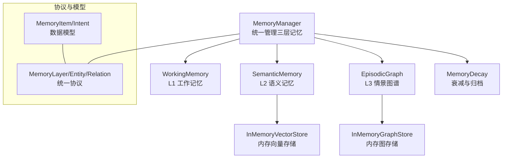
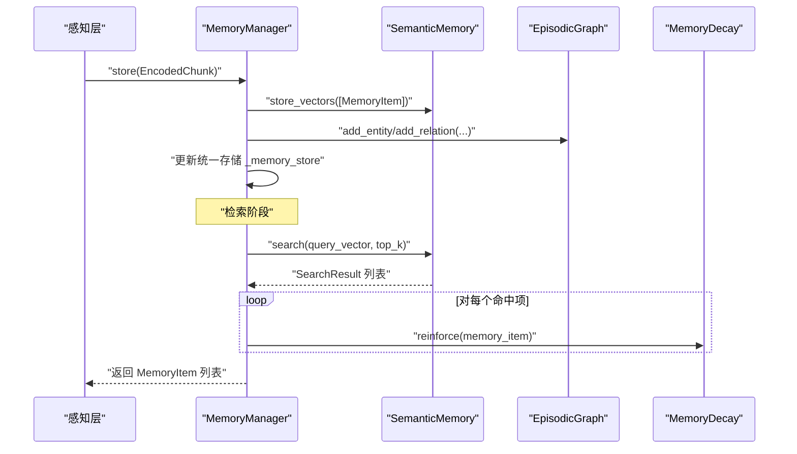
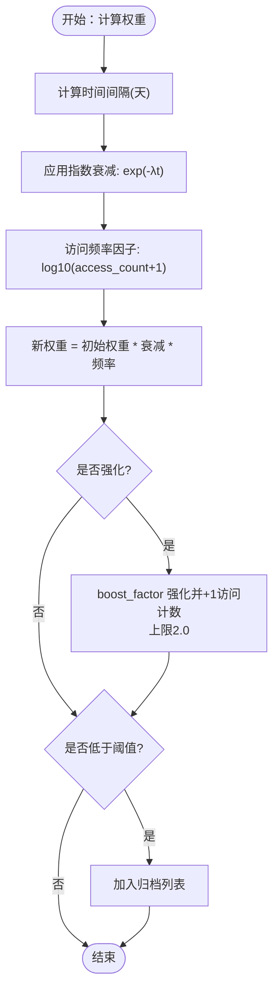
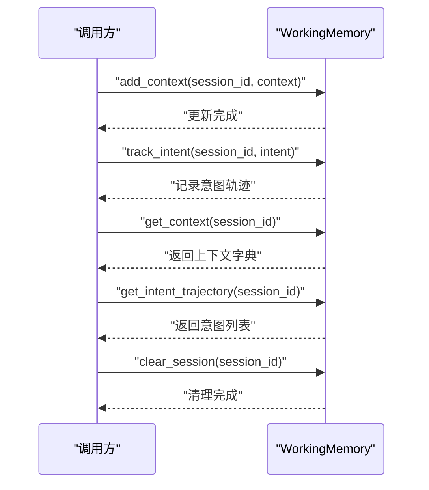
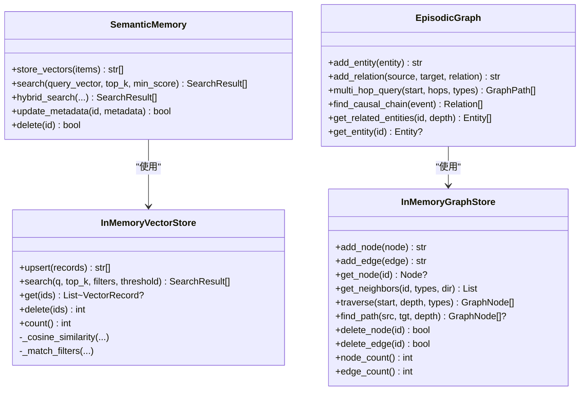
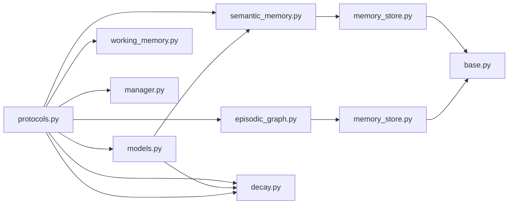

# 记忆模块测试

<cite>
**本文档引用的文件**
- [src/memory/__init__.py](file://src/memory/__init__.py)
- [src/memory/manager.py](file://src/memory/manager.py)
- [src/memory/working_memory.py](file://src/memory/working_memory.py)
- [src/memory/decay.py](file://src/memory/decay.py)
- [src/memory/models.py](file://src/memory/models.py)
- [src/memory/semantic_memory.py](file://src/memory/semantic_memory.py)
- [src/memory/episodic_graph.py](file://src/memory/episodic_graph.py)
- [src/memory/backends/base.py](file://src/memory/backends/base.py)
- [src/memory/backends/memory_store.py](file://src/memory/backends/memory_store.py)
- [src/core/protocols.py](file://src/core/protocols.py)
- [tests/test_memory/test_decay.py](file://tests/test_memory/test_decay.py)
- [tests/test_memory/test_working_memory.py](file://tests/test_memory/test_working_memory.py)
- [tests/performance_test.py](file://tests/performance_test.py)
- [wiki/wiki/记忆管理层/记忆存储后端.md](file://wiki/wiki/记忆管理层/记忆存储后端.md)
- [wiki/wiki/记忆管理层/记忆管理层.md](file://wiki/wiki/记忆管理层/记忆管理层.md)
</cite>

## 目录
1. [简介](#简介)
2. [项目结构](#项目结构)
3. [核心组件](#核心组件)
4. [架构总览](#架构总览)
5. [详细组件分析](#详细组件分析)
6. [依赖分析](#依赖分析)
7. [性能考虑](#性能考虑)
8. [故障排查指南](#故障排查指南)
9. [结论](#结论)
10. [附录](#附录)

## 简介
本文件面向 NecoRAG 记忆模块的测试实现，聚焦以下目标：
- 记忆衰减测试：验证衰减算法、归档策略与强化机制的正确性与鲁棒性
- 工作记忆测试：覆盖上下文存储/检索、意图轨迹、会话管理与容量边界
- 记忆存储测试：基于内存实现的向量与图存储的增删改查与过滤能力
- 访问性能测试：通过基准测试框架评估吞吐与延迟，支持并发场景
- 并发访问测试：结合现有内存实现的并发风险与建议方案
- 稳定性与最佳实践：提供测试用例设计原则、故障排查与优化建议

## 项目结构
记忆模块位于 src/memory 下，采用分层设计：
- L1 工作记忆：基于内存的会话上下文与意图轨迹存储
- L2 语义记忆：基于内存的向量检索与元数据管理
- L3 情景图谱：基于内存的实体关系网络与多跳查询
- 衰减机制：统一的权重计算、强化与归档策略
- 存储后端：抽象基类与内存实现，便于替换为真实数据库

**图表来源**
- [src/memory/manager.py:20-212](file://src/memory/manager.py#L20-L212)
- [src/memory/working_memory.py:11-120](file://src/memory/working_memory.py#L11-L120)
- [src/memory/semantic_memory.py:21-179](file://src/memory/semantic_memory.py#L21-L179)
- [src/memory/episodic_graph.py:10-194](file://src/memory/episodic_graph.py#L10-L194)
- [src/memory/decay.py:11-155](file://src/memory/decay.py#L11-L155)
- [src/memory/backends/memory_store.py:20-381](file://src/memory/backends/memory_store.py#L20-L381)
- [src/core/protocols.py:36-298](file://src/core/protocols.py#L36-L298)
- [src/memory/models.py:14-43](file://src/memory/models.py#L14-L43)

**章节来源**
- [src/memory/__init__.py:6-28](file://src/memory/__init__.py#L6-L28)
- [src/memory/manager.py:20-212](file://src/memory/manager.py#L20-L212)

## 核心组件
- MemoryManager：统一协调三层记忆与衰减策略，提供存储、检索、巩固与主动遗忘能力
- WorkingMemory：L1 工作记忆，支持会话上下文、意图轨迹与会话清理
- SemanticMemory：L2 语义记忆，基于内存的向量存储与检索
- EpisodicGraph：L3 情景图谱，基于内存的实体关系网络与多跳查询
- MemoryDecay：衰减与归档策略，包含权重计算、强化与阈值判断
- 存储后端：BaseVectorStore/BaseGraphStore 抽象与 InMemoryVectorStore/InMemoryGraphStore 实现

**章节来源**
- [src/memory/manager.py:20-212](file://src/memory/manager.py#L20-L212)
- [src/memory/working_memory.py:11-120](file://src/memory/working_memory.py#L11-L120)
- [src/memory/semantic_memory.py:21-179](file://src/memory/semantic_memory.py#L21-L179)
- [src/memory/episodic_graph.py:10-194](file://src/memory/episodic_graph.py#L10-L194)
- [src/memory/decay.py:11-155](file://src/memory/decay.py#L11-L155)
- [src/memory/backends/base.py:61-314](file://src/memory/backends/base.py#L61-L314)
- [src/memory/backends/memory_store.py:20-381](file://src/memory/backends/memory_store.py#L20-L381)

## 架构总览
记忆模块通过 MemoryManager 统一入口，将感知层编码的 EncodedChunk 转换为 MemoryItem，分别持久化到 L2 语义向量库与 L3 图谱，同时在统一存储中维护映射。检索时优先从 L2 向量库进行相似度搜索，并在命中后通过 MemoryDecay.reinforce 强化权重，实现“用进废退”的生物启发机制。

**图表来源**
- [src/memory/manager.py:52-159](file://src/memory/manager.py#L52-L159)
- [src/memory/semantic_memory.py:50-118](file://src/memory/semantic_memory.py#L50-L118)
- [src/memory/decay.py:120-142](file://src/memory/decay.py#L120-L142)

## 详细组件分析

### 记忆衰减测试（MemoryDecay）
- 测试目标
  - 衰减算法正确性：时间衰减与访问频率因子的组合
  - 归档阈值判断：低权重记忆的自动归档
  - 强化机制：访问强化对权重与访问计数的影响
  - 边界与异常：未来时间、零权重、极高访问次数等
- 关键测试点
  - 初始权重与一天/十天后的权重对比
  - 高访问次数 vs 低访问次数的权重差异
  - 批量衰减与阈值自定义
  - 强化因子与最大权重限制
  - 零衰减率与高衰减率的行为差异
  - 未来创建时间与极旧记忆的处理

**图表来源**
- [src/memory/decay.py:39-142](file://src/memory/decay.py#L39-L142)

**章节来源**
- [tests/test_memory/test_decay.py:19-544](file://tests/test_memory/test_decay.py#L19-L544)
- [src/memory/decay.py:11-155](file://src/memory/decay.py#L11-L155)

### 工作记忆测试（WorkingMemory）
- 测试目标
  - 上下文存储与检索：新增、合并、覆盖与时间戳
  - 意图轨迹：多意图顺序与类型保持
  - 会话管理：存在性检查、清理与多会话隔离
  - 边界与异常：空上下文、超大上下文、特殊字符、Unicode
- 关键测试点
  - 新建与已有会话上下文的合并更新
  - 意图列表的顺序与完整性
  - 会话清理后数据完全消失
  - 多会话之间互不干扰
  - 特殊场景下的健壮性

**图表来源**
- [src/memory/working_memory.py:36-95](file://src/memory/working_memory.py#L36-L95)

**章节来源**
- [tests/test_memory/test_working_memory.py:18-307](file://tests/test_memory/test_working_memory.py#L18-L307)
- [src/memory/working_memory.py:11-120](file://src/memory/working_memory.py#L11-L120)

### 记忆存储测试（SemanticMemory 与 EpisodicGraph）
- 测试目标
  - 向量存储：插入、检索、元数据更新与删除
  - 图存储：节点与边的添加、邻居查询、多跳遍历与路径查找
  - 过滤与阈值：元数据过滤、最小相似度阈值
- 关键测试点
  - 向量维度校验与相似度计算
  - 元数据过滤与结果排序
  - 节点/边存在性与邻接关系
  - BFS 多跳与路径查找的可达性
  - 清空与统计接口

**图表来源**
- [src/memory/semantic_memory.py:21-179](file://src/memory/semantic_memory.py#L21-L179)
- [src/memory/episodic_graph.py:10-194](file://src/memory/episodic_graph.py#L10-L194)
- [src/memory/backends/memory_store.py:20-381](file://src/memory/backends/memory_store.py#L20-L381)

**章节来源**
- [src/memory/semantic_memory.py:21-179](file://src/memory/semantic_memory.py#L21-L179)
- [src/memory/episodic_graph.py:10-194](file://src/memory/episodic_graph.py#L10-L194)
- [src/memory/backends/memory_store.py:20-381](file://src/memory/backends/memory_store.py#L20-L381)

### 记忆操作测试用例设计
- 增删改查测试
  - 衰减：权重计算、批量衰减、阈值归档、强化
  - 工作记忆：上下文 CRUD、意图轨迹、会话清理
  - 语义记忆：向量插入、相似度检索、元数据更新、删除
  - 情景图谱：实体/关系 CRUD、邻居查询、多跳遍历、路径查找
- 批量操作测试
  - 批量插入向量记录与批量删除
  - 批量应用衰减与批量归档
- 并发访问测试
  - 现状：内存实现未内置并发控制，适合单线程或本地测试
  - 建议：生产环境使用真实 Redis/向量/图数据库，配合锁或事务

**章节来源**
- [tests/test_memory/test_decay.py:19-544](file://tests/test_memory/test_decay.py#L19-L544)
- [tests/test_memory/test_working_memory.py:18-307](file://tests/test_memory/test_working_memory.py#L18-L307)
- [src/memory/backends/memory_store.py:20-381](file://src/memory/backends/memory_store.py#L20-L381)
- [wiki/wiki/记忆管理层/记忆存储后端.md:232-238](file://wiki/wiki/记忆管理层/记忆存储后端.md#L232-L238)

## 依赖分析
- 组件耦合
  - MemoryManager 依赖 WorkingMemory、SemanticMemory、EpisodicGraph、MemoryDecay
  - SemanticMemory 依赖 MemoryItem 与向量存储后端
  - EpisodicGraph 依赖 Entity/Relation 与图存储后端
  - 所有模块共享 src/core/protocols 中的统一枚举与数据类
- 外部依赖
  - numpy（向量运算）
  - datetime（时间戳与衰减计算）

**图表来源**
- [src/core/protocols.py:36-298](file://src/core/protocols.py#L36-L298)
- [src/memory/models.py:14-43](file://src/memory/models.py#L14-L43)
- [src/memory/manager.py:6-14](file://src/memory/manager.py#L6-L14)
- [src/memory/backends/base.py:61-314](file://src/memory/backends/base.py#L61-L314)
- [src/memory/backends/memory_store.py:13-17](file://src/memory/backends/memory_store.py#L13-L17)

**章节来源**
- [src/memory/manager.py:6-14](file://src/memory/manager.py#L6-L14)
- [src/memory/backends/base.py:61-314](file://src/memory/backends/base.py#L61-L314)

## 性能考虑
- 向量检索复杂度：当前内存实现为 O(N) 相似度计算，建议在生产环境接入 HNSW/FAISS/Qdrant 等索引以降至 O(log N)/O(k)
- 图遍历复杂度：BFS/DFS 多跳查询在稀疏图上较高效，但深度增加会导致组合爆炸，需限制 max_relation_depth
- 内存占用：统一存储与向量/图内存实现会随数据增长而上升，建议定期 consolidate/forget 与分片部署
- 并发与一致性：工作记忆模拟未实现并发安全，生产环境需替换为真实 Redis 并启用事务/锁
- 调优建议：合理设置 decay_rate 与 archive_threshold，平衡保留与清理节奏；top_k 与 min_score/threshold 控制召回与质量

**章节来源**
- [wiki/wiki/记忆管理层/记忆管理层.md:315-332](file://wiki/wiki/记忆管理层/记忆管理层.md#L315-L332)

## 故障排查指南
- 存储失败（维度不匹配）：检查向量维度与集合配置，确保编码器输出一致
- 检索无结果：确认 query_vector 非空且与存储向量维度一致；检查 min_score 与 top_k 设置
- 图查询异常：确保实体 ID 存在且关系方向/类型过滤正确；注意 BFS 深度限制
- 权重异常：检查 decay_rate 与 access_count 是否异常；确认 reinforce 是否被调用
- 配置加载失败：确认 DomainConfigManager 的配置目录存在且 JSON 文件格式正确
- 并发问题：内存实现未内置锁，生产环境请使用真实后端并启用并发控制

**章节来源**
- [wiki/wiki/记忆管理层/记忆管理层.md:327-332](file://wiki/wiki/记忆管理层/记忆管理层.md#L327-L332)
- [wiki/wiki/记忆管理层/记忆存储后端.md:232-238](file://wiki/wiki/记忆管理层/记忆存储后端.md#L232-L238)

## 结论
本测试文档围绕记忆衰减与工作记忆两大核心，结合现有内存实现，提供了系统化的测试策略与用例设计。针对生产环境，建议替换为真实后端并完善并发控制与性能索引，以满足高并发、低延迟与可扩展性的需求。

## 附录
- 访问性能测试方法
  - 使用基准测试框架进行单线程与并发场景测试，采集平均耗时、吞吐与内存使用
  - 并发测试支持多线程/多用户持续运行，统计成功率与资源峰值
- 最佳实践
  - 明确衰减参数与归档阈值，定期执行 consolidate/forget
  - 严格校验向量维度与元数据结构，避免检索阶段异常
  - 在测试环境中充分覆盖边界与异常分支，确保生产稳定

**章节来源**
- [tests/performance_test.py:68-235](file://tests/performance_test.py#L68-L235)