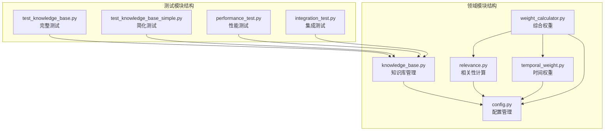
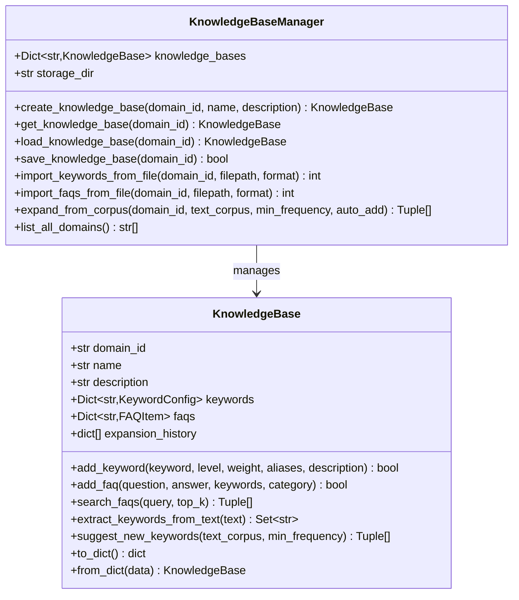
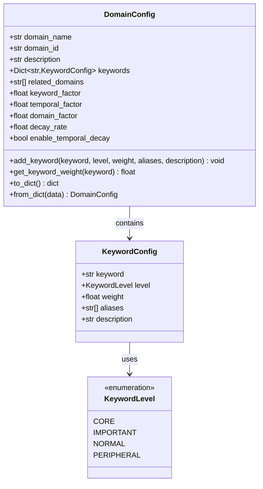
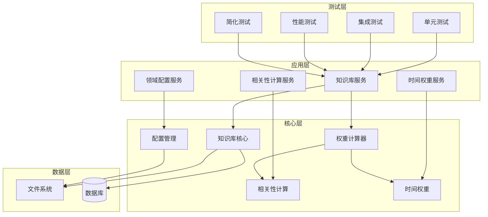
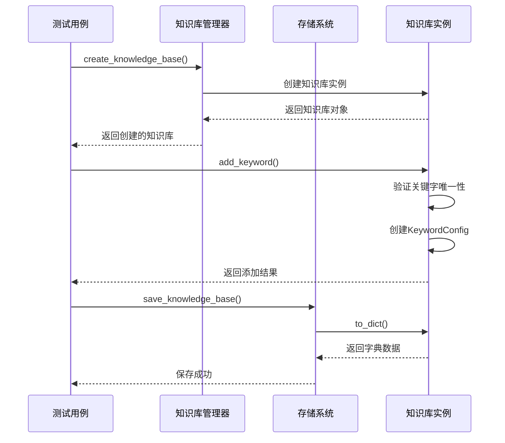
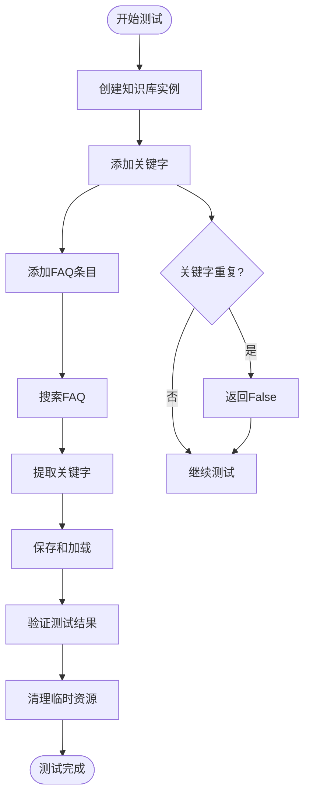
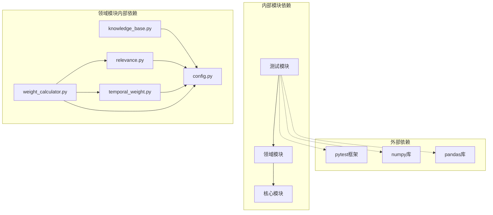
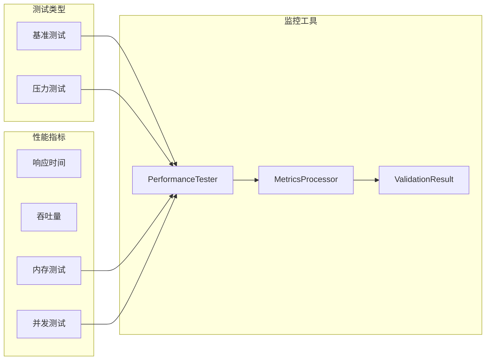

# 领域模块测试

<cite>
**本文档引用的文件**
- [tests/test_domain/test_knowledge_base.py](file://tests/test_domain/test_knowledge_base.py)
- [tests/test_domain/test_knowledge_base_simple.py](file://tests/test_domain/test_knowledge_base_simple.py)
- [src/domain/knowledge_base.py](file://src/domain/knowledge_base.py)
- [src/domain/config.py](file://src/domain/config.py)
- [src/domain/relevance.py](file://src/domain/relevance.py)
- [src/domain/temporal_weight.py](file://src/domain/temporal_weight.py)
- [src/domain/weight_calculator.py](file://src/domain/weight_calculator.py)
- [tests/conftest.py](file://tests/conftest.py)
- [tests/performance_test.py](file://tests/performance_test.py)
- [tests/integration_test.py](file://tests/integration_test.py)
- [tests/test_runner.py](file://tests/test_runner.py)
</cite>

## 目录
1. [简介](#简介)
2. [项目结构](#项目结构)
3. [核心组件](#核心组件)
4. [架构概览](#架构概览)
5. [详细组件分析](#详细组件分析)
6. [依赖分析](#依赖分析)
7. [性能考虑](#性能考虑)
8. [故障排除指南](#故障排除指南)
9. [结论](#结论)
10. [附录](#附录)

## 简介

NecoRAG领域模块测试文档为开发者提供了全面的测试策略和最佳实践指南。本文档深入解释了知识库测试的实现策略，包括完整知识库测试和简化知识库测试的设计思路。详细描述了知识库操作测试、知识条目管理测试和领域配置测试的实现方法。

领域模块测试涵盖了从单元测试到集成测试的完整测试金字塔，包括：
- **单元测试**：针对知识库管理器、FAQ条目、关键字配置等核心组件的精确测试
- **集成测试**：验证知识库与领域配置系统的协同工作能力
- **性能测试**：评估知识库操作的性能表现和并发处理能力
- **简化测试**：提供快速验证和开发调试的轻量级测试方案

## 项目结构

领域模块位于`src/domain/`目录下，包含以下核心组件：

**图表来源**
- [src/domain/knowledge_base.py:1-564](file://src/domain/knowledge_base.py#L1-L564)
- [src/domain/config.py:1-285](file://src/domain/config.py#L1-L285)
- [tests/test_domain/test_knowledge_base.py:1-320](file://tests/test_domain/test_knowledge_base.py#L1-L320)

**章节来源**
- [src/domain/knowledge_base.py:1-564](file://src/domain/knowledge_base.py#L1-L564)
- [src/domain/config.py:1-285](file://src/domain/config.py#L1-L285)
- [tests/test_domain/test_knowledge_base.py:1-320](file://tests/test_domain/test_knowledge_base.py#L1-L320)

## 核心组件

### 知识库管理器 (KnowledgeBaseManager)

知识库管理器是领域模块的核心组件，负责知识库的创建、管理和持久化操作：

**图表来源**
- [src/domain/knowledge_base.py:64-264](file://src/domain/knowledge_base.py#L64-L264)
- [src/domain/knowledge_base.py:266-518](file://src/domain/knowledge_base.py#L266-L518)

### 关键字配置系统

领域模块实现了完整的关键字配置系统，支持不同级别的关键字权重管理：

**图表来源**
- [src/domain/config.py:14-51](file://src/domain/config.py#L14-L51)
- [src/domain/config.py:30-96](file://src/domain/config.py#L30-L96)
- [src/domain/config.py:53-160](file://src/domain/config.py#L53-L160)

**章节来源**
- [src/domain/knowledge_base.py:64-518](file://src/domain/knowledge_base.py#L64-L518)
- [src/domain/config.py:14-160](file://src/domain/config.py#L14-L160)

## 架构概览

领域模块采用分层架构设计，各组件之间具有清晰的职责分离和依赖关系：

**图表来源**
- [src/domain/knowledge_base.py:266-518](file://src/domain/knowledge_base.py#L266-L518)
- [src/domain/weight_calculator.py:56-277](file://src/domain/weight_calculator.py#L56-L277)

## 详细组件分析

### 完整知识库测试策略

完整知识库测试提供了全面的功能验证，涵盖所有核心功能和边界情况：

#### 测试设计原则

1. **全面性测试**：覆盖所有公开API和内部方法
2. **边界条件测试**：验证异常输入和边界值处理
3. **数据完整性测试**：确保数据序列化和反序列化的正确性
4. **并发安全性测试**：验证多线程环境下的数据一致性

#### 关键测试场景

**图表来源**
- [tests/test_domain/test_knowledge_base.py:208-243](file://tests/test_domain/test_knowledge_base.py#L208-L243)
- [src/domain/knowledge_base.py:284-322](file://src/domain/knowledge_base.py#L284-L322)

#### 测试数据管理

完整测试采用了完善的测试数据管理机制：

| 测试类型 | 数据管理方式 | 生命周期 | 清理机制 |
|---------|-------------|----------|----------|
| 单元测试 | 内存数据 | 函数级别 | 自动垃圾回收 |
| 集成测试 | 临时目录 | 测试会话级别 | pytest fixture自动清理 |
| 性能测试 | 临时文件 | 测试执行级别 | 上下文管理器清理 |

**章节来源**
- [tests/test_domain/test_knowledge_base.py:200-207](file://tests/test_domain/test_knowledge_base.py#L200-L207)
- [tests/test_domain/test_knowledge_base.py:244-287](file://tests/test_domain/test_knowledge_base.py#L244-L287)

### 简化知识库测试策略

简化知识库测试提供了快速验证和开发调试的轻量级解决方案：

#### 设计目标

1. **快速反馈**：提供即时的测试结果
2. **易于理解**：代码结构简洁明了
3. **便于维护**：减少测试代码的复杂性
4. **实用性强**：专注于核心功能验证

#### 测试流程

**图表来源**
- [tests/test_domain/test_knowledge_base_simple.py:22-67](file://tests/test_domain/test_knowledge_base_simple.py#L22-L67)

**章节来源**
- [tests/test_domain/test_knowledge_base_simple.py:22-142](file://tests/test_domain/test_knowledge_base_simple.py#L22-L142)

### 知识库操作测试

知识库操作测试验证了核心数据操作功能的正确性：

#### 关键字管理测试

关键字管理是知识库的核心功能，测试涵盖了以下场景：

1. **关键字添加**：验证唯一性约束和别名索引
2. **关键字查询**：测试关键字权重获取和别名解析
3. **关键字更新**：验证关键字配置的修改能力
4. **关键字删除**：测试关键字的移除和索引清理

#### FAQ管理测试

FAQ管理功能提供了问答对的存储和检索能力：

1. **FAQ创建**：验证问题和答案的存储
2. **FAQ搜索**：测试基于内容的全文搜索
3. **FAQ更新**：验证FAQ条目的修改功能
4. **FAQ删除**：测试FAQ条目的移除机制

**章节来源**
- [tests/test_domain/test_knowledge_base.py:117-182](file://tests/test_domain/test_knowledge_base.py#L117-L182)
- [src/domain/knowledge_base.py:99-171](file://src/domain/knowledge_base.py#L99-L171)

### 领域配置测试

领域配置测试验证了领域权重系统和相关性计算的正确性：

#### 相关性计算测试

相关性计算是领域模块的重要功能，测试包括：

1. **关键字匹配**：验证关键字的识别和权重计算
2. **密度计算**：测试关键字密度的计算逻辑
3. **等级判定**：验证领域相关性的等级分类
4. **权重应用**：测试领域权重在最终评分中的应用

#### 时间权重测试

时间权重系统提供了基于时间的知识权重衰减机制：

1. **时间层级划分**：验证不同时间段的权重范围
2. **指数衰减计算**：测试时间衰减公式的正确性
3. **权重插值**：验证时间层级间的权重插值
4. **常青内容处理**：测试不受时间影响的内容权重

**章节来源**
- [src/domain/relevance.py:198-242](file://src/domain/relevance.py#L198-L242)
- [src/domain/temporal_weight.py:160-195](file://src/domain/temporal_weight.py#L160-L195)

## 依赖分析

领域模块的依赖关系体现了清晰的分层架构设计：

**图表来源**
- [src/domain/knowledge_base.py:15-20](file://src/domain/knowledge_base.py#L15-L20)
- [src/domain/weight_calculator.py:11-13](file://src/domain/weight_calculator.py#L11-L13)

### 组件耦合度分析

领域模块展现了良好的内聚性和低耦合性：

| 组件 | 内聚性 | 耦合度 | 主要职责 |
|------|--------|--------|----------|
| KnowledgeBase | 高 | 低 | 知识库数据结构和操作 |
| KnowledgeBaseManager | 高 | 中 | 知识库生命周期管理 |
| KeywordConfig | 高 | 低 | 关键字配置管理 |
| DomainConfig | 高 | 中 | 领域配置管理 |
| DomainRelevanceCalculator | 高 | 低 | 相关性计算 |
| TemporalWeightCalculator | 高 | 低 | 时间权重计算 |
| CompositeWeightCalculator | 中 | 高 | 综合权重计算 |

**章节来源**
- [src/domain/knowledge_base.py:64-518](file://src/domain/knowledge_base.py#L64-L518)
- [src/domain/config.py:53-284](file://src/domain/config.py#L53-L284)

## 性能考虑

领域模块测试包含了全面的性能测试策略，确保系统在高负载下的稳定性：

### 性能测试框架

性能测试框架提供了多种测试模式：

1. **基准测试**：测量单个操作的性能指标
2. **并发测试**：验证多线程环境下的性能表现
3. **压力测试**：评估系统在极限条件下的稳定性
4. **内存测试**：监控内存使用情况和泄漏检测

### 性能指标监控

**图表来源**
- [tests/performance_test.py:31-82](file://tests/performance_test.py#L31-L82)

### 性能优化策略

基于测试结果，推荐以下优化策略：

1. **缓存机制**：实现关键字索引和计算结果的缓存
2. **异步处理**：对耗时操作采用异步处理模式
3. **批量操作**：支持批量关键字和FAQ的导入导出
4. **连接池**：优化文件系统和数据库访问的连接管理

**章节来源**
- [tests/performance_test.py:31-322](file://tests/performance_test.py#L31-L322)

## 故障排除指南

### 常见问题诊断

领域模块测试中可能遇到的问题及解决方案：

#### 知识库加载失败

**问题症状**：`load_knowledge_base()`返回None
**可能原因**：
- 文件不存在或权限不足
- JSON文件格式错误
- 序列化数据损坏

**解决步骤**：
1. 检查文件路径和权限
2. 验证JSON文件格式
3. 使用`to_dict()`和`from_dict()`进行数据验证

#### 关键字重复添加

**问题症状**：`add_keyword()`返回False
**可能原因**：
- 关键字已存在
- 别名冲突
- 大小写敏感问题

**解决步骤**：
1. 检查关键字的大小写转换
2. 验证别名列表的唯一性
3. 使用`get_keyword_weight()`确认关键字状态

#### 相关性计算异常

**问题症状**：`calculate_relevance()`返回意外结果
**可能原因**：
- 关键字权重配置错误
- 文本预处理问题
- 配置文件加载失败

**解决步骤**：
1. 验证DomainConfig的正确性
2. 检查关键字正则表达式
3. 确认文本编码和预处理

**章节来源**
- [tests/test_domain/test_knowledge_base.py:288-297](file://tests/test_domain/test_knowledge_base.py#L288-L297)
- [src/domain/relevance.py:198-242](file://src/domain/relevance.py#L198-L242)

### 调试技巧

1. **日志记录**：使用详细的日志输出跟踪执行流程
2. **断点调试**：在关键节点设置断点进行变量检查
3. **单元测试**：编写针对性的单元测试隔离问题
4. **性能分析**：使用性能分析工具识别瓶颈

## 结论

NecoRAG领域模块测试文档提供了全面的测试策略和最佳实践指南。通过完整测试和简化测试相结合的方式，确保了领域模块的可靠性、性能和可维护性。

### 主要成就

1. **全面的功能覆盖**：测试用例涵盖了所有核心功能和边界情况
2. **灵活的测试策略**：提供了从单元测试到集成测试的完整测试金字塔
3. **性能保障**：通过性能测试确保系统在高负载下的稳定性
4. **易于维护**：清晰的测试结构和完善的清理机制

### 未来改进建议

1. **测试自动化**：集成CI/CD管道实现自动化测试
2. **覆盖率提升**：增加代码覆盖率监控和改进
3. **性能监控**：建立持续的性能监控和回归测试
4. **文档完善**：补充更多的测试用例和使用示例

## 附录

### 测试最佳实践清单

- **测试命名规范**：使用描述性的测试方法命名
- **断言策略**：使用具体的断言消息和错误信息
- **测试数据管理**：确保测试数据的独立性和可重复性
- **清理机制**：实现完整的测试资源清理
- **错误处理**：验证异常情况和错误处理逻辑

### 性能测试配置

| 测试类型 | 迭代次数 | 预热次数 | 并发用户数 | 测试时长 |
|----------|----------|----------|------------|----------|
| 基准测试 | 1000 | 100 | - | - |
| 并发测试 | - | - | 10 | 30秒 |
| 压力测试 | - | - | - | 5分钟 |
| 内存测试 | 100 | - | - | - |