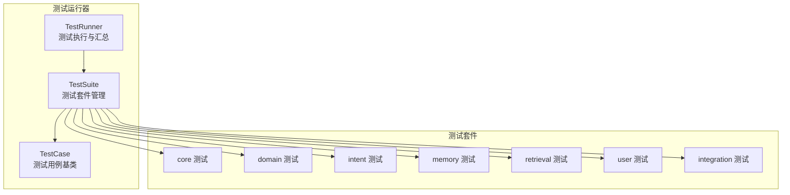
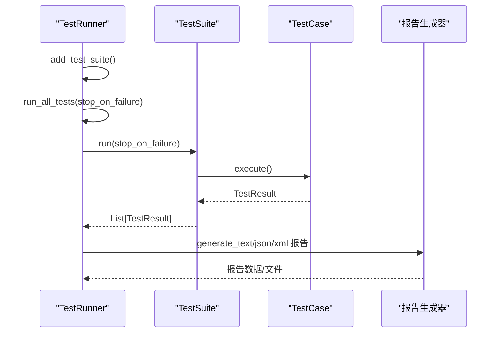
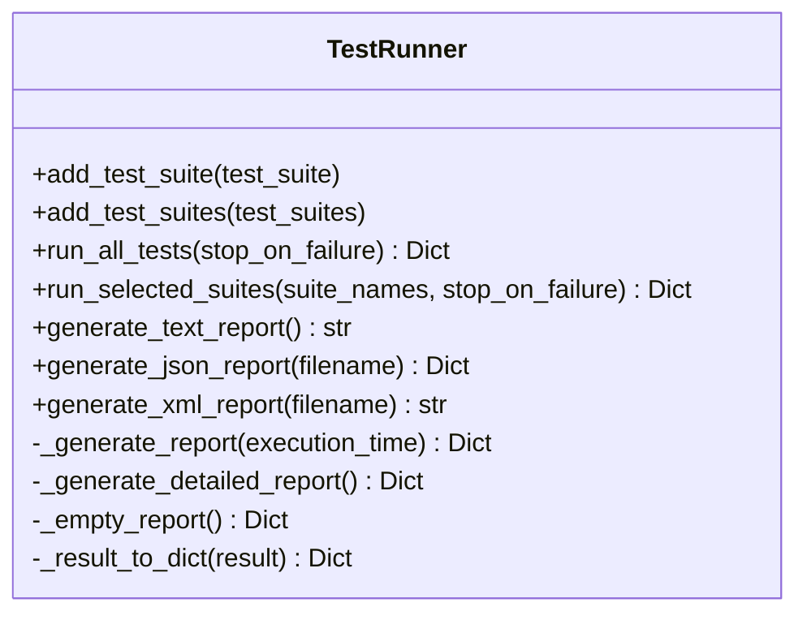
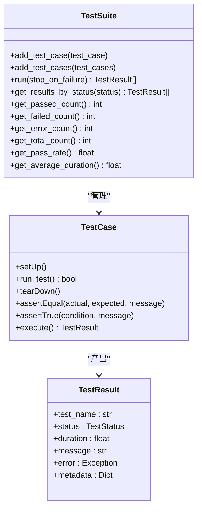
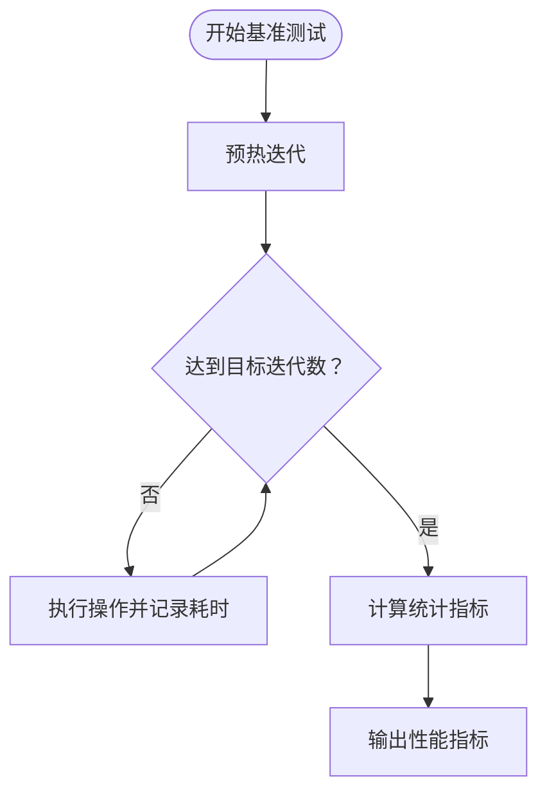
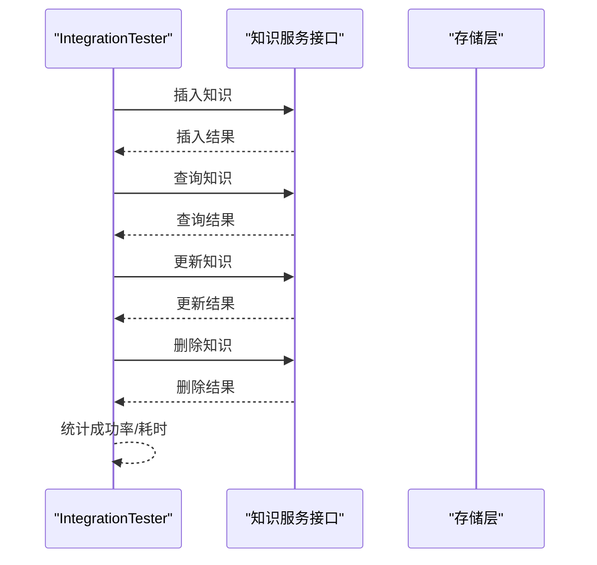
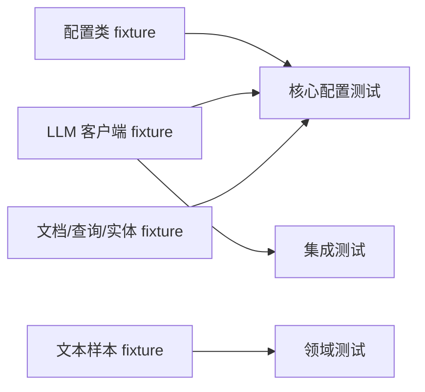
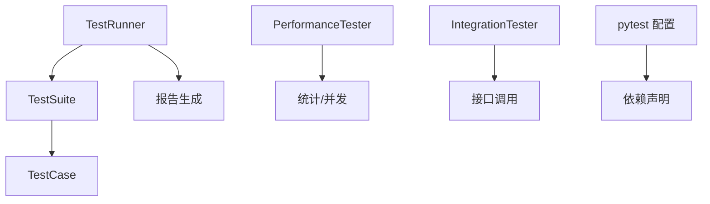

# 测试框架

<cite>
**本文引用的文件**
- [tests/conftest.py](file://tests/conftest.py)
- [tests/test_runner.py](file://tests/test_runner.py)
- [tests/demo_test_runner.py](file://tests/demo_test_runner.py)
- [tests/integration_test.py](file://tests/integration_test.py)
- [tests/performance_test.py](file://tests/performance_test.py)
- [tests/test_suite.py](file://tests/test_suite.py)
- [tests/test_core/test_config.py](file://tests/test_core/test_config.py)
- [tests/test_core/test_protocols.py](file://tests/test_core/test_protocols.py)
- [tests/test_domain/test_knowledge_base.py](file://tests/test_domain/test_knowledge_base.py)
- [tests/test_integration/test_necorag.py](file://tests/test_integration/test_necorag.py)
- [tests/test_intent/test_classifier.py](file://tests/test_intent/test_classifier.py)
- [tests/test_memory/test_working_memory.py](file://tests/test_memory/test_working_memory.py)
- [tests/test_retrieval/test_retriever.py](file://tests/test_retrieval/test_retriever.py)
- [tests/test_user/test_multi_user_system.py](file://tests/test_user/test_multi_user_system.py)
- [pyproject.toml](file://pyproject.toml)
- [requirements.txt](file://requirements.txt)
</cite>

## 目录
1. [简介](#简介)
2. [项目结构](#项目结构)
3. [核心组件](#核心组件)
4. [架构总览](#架构总览)
5. [详细组件分析](#详细组件分析)
6. [依赖分析](#依赖分析)
7. [性能考虑](#性能考虑)
8. [故障排查指南](#故障排查指南)
9. [结论](#结论)
10. [附录](#附录)

## 简介
本文件面向 NecoRAG 测试框架，系统化阐述测试运行器的设计架构、测试发现与执行顺序控制、结果汇总与报告生成；梳理核心功能测试、领域特定测试、集成测试与性能测试的组织方式；解释测试配置管理（pytest 配置、fixture 定义与测试环境设置）；给出测试用例编写规范（单元、集成、端到端）与覆盖率分析、质量度量方法，并提供测试自动化与持续集成的实现思路。

## 项目结构
测试相关代码主要位于 tests 目录，采用“按功能域分层 + 按测试类型分层”的组织方式：
- tests/test_core：核心配置与协议的单元测试
- tests/test_domain：领域知识库模块测试
- tests/test_intent：意图分析模块测试
- tests/test_memory：工作记忆模块测试
- tests/test_retrieval：检索模块测试
- tests/test_user：多用户系统测试
- tests/test_integration：端到端集成测试
- tests/test_runner.py、tests/test_suite.py：自研测试运行器与套件管理
- tests/conftest.py：pytest 共享 fixture 与测试环境配置
- tests/performance_test.py、tests/integration_test.py：性能与集成测试工具
- tests/demo_test_runner.py：测试运行器使用示例与演示

**图表来源**
- [tests/test_runner.py:16-66](file://tests/test_runner.py#L16-L66)
- [tests/test_suite.py:145-198](file://tests/test_suite.py#L145-L198)
- [tests/test_core/test_config.py:1-397](file://tests/test_core/test_config.py#L1-L397)
- [tests/test_domain/test_knowledge_base.py:1-320](file://tests/test_domain/test_knowledge_base.py#L1-L320)
- [tests/test_intent/test_classifier.py:1-493](file://tests/test_intent/test_classifier.py#L1-L493)
- [tests/test_memory/test_working_memory.py:1-307](file://tests/test_memory/test_working_memory.py#L1-L307)
- [tests/test_retrieval/test_retriever.py:1-410](file://tests/test_retrieval/test_retriever.py#L1-L410)
- [tests/test_user/test_multi_user_system.py:1-420](file://tests/test_user/test_multi_user_system.py#L1-L420)
- [tests/test_integration/test_necorag.py:1-580](file://tests/test_integration/test_necorag.py#L1-L580)

**章节来源**
- [tests/test_runner.py:16-66](file://tests/test_runner.py#L16-L66)
- [tests/test_suite.py:145-198](file://tests/test_suite.py#L145-L198)

## 核心组件
- 测试运行器 TestRunner：负责测试套件的添加、批量执行、失败早停、结果聚合与报告生成（文本、JSON、JUnit XML）。
- 测试套件 TestSuite：管理测试用例集合，提供运行、统计与汇总能力。
- 测试用例基类 TestCase：提供断言方法、生命周期钩子（setUp/tearDown）、状态机与结果封装。
- 性能测试器 PerformanceTester：提供单操作基准、并发基准、压力测试、内存使用测试与统计指标计算。
- 集成测试器 IntegrationTester：提供完整查询流水线、数据生命周期、并发访问等集成测试能力。
- pytest 共享 fixture：集中定义配置、Mock 客户端、样本数据与辅助对象，便于跨模块复用。

**章节来源**
- [tests/test_runner.py:16-327](file://tests/test_runner.py#L16-L327)
- [tests/test_suite.py:35-143](file://tests/test_suite.py#L35-L143)
- [tests/performance_test.py:31-322](file://tests/performance_test.py#L31-L322)
- [tests/integration_test.py:14-381](file://tests/integration_test.py#L14-L381)
- [tests/conftest.py:46-330](file://tests/conftest.py#L46-L330)

## 架构总览
测试框架采用“自研运行器 + pytest 共享 fixture + 功能域测试”的分层架构。自研运行器提供统一的执行入口、结果汇总与报告输出；pytest 共享 fixture 提供稳定的测试环境与样本数据；各功能域测试覆盖核心、领域、意图、记忆、检索、用户与集成层面。

**图表来源**
- [tests/test_runner.py:36-66](file://tests/test_runner.py#L36-L66)
- [tests/test_suite.py:165-198](file://tests/test_suite.py#L165-L198)
- [tests/test_suite.py:100-142](file://tests/test_suite.py#L100-L142)

## 详细组件分析

### 测试运行器 TestRunner
- 设计要点
  - 统一入口：add_test_suite/add_test_suites 管理测试套件集合。
  - 执行控制：run_all_tests 支持 stop_on_failure；run_selected_suites 支持按名称选择执行。
  - 结果汇总：按状态筛选、统计通过率、生成文本/JSON/JUnit XML 报告。
  - 时间统计：记录开始/结束时间，计算总耗时与平均耗时。
- 输出能力
  - 文本报告：逐套件汇总、用例明细与错误信息。
  - JSON 报告：结构化结果，便于 CI/CD 消费。
  - JUnit XML：兼容 CI 平台的测试报告格式。

**图表来源**
- [tests/test_runner.py:16-327](file://tests/test_runner.py#L16-L327)

**章节来源**
- [tests/test_runner.py:16-327](file://tests/test_runner.py#L16-L327)

### 测试套件与用例 TestSuite/TestCase
- TestSuite
  - 管理测试用例列表，支持批量添加、顺序执行、失败早停。
  - 提供按状态统计、通过率、平均耗时等汇总信息。
- TestCase
  - 提供断言方法（相等、包含、True/False、非空等）。
  - 生命周期钩子：setUp/tearDown，异常捕获并记录错误状态。
  - 结果封装：TestResult 包含状态、耗时、消息与错误对象。

**图表来源**
- [tests/test_suite.py:145-245](file://tests/test_suite.py#L145-L245)
- [tests/test_suite.py:35-143](file://tests/test_suite.py#L35-L143)
- [tests/test_suite.py:24-33](file://tests/test_suite.py#L24-L33)

**章节来源**
- [tests/test_suite.py:145-245](file://tests/test_suite.py#L145-L245)
- [tests/test_suite.py:35-143](file://tests/test_suite.py#L35-L143)

### 性能测试器 PerformanceTester
- 能力范围
  - 单操作基准：warmup、迭代执行、异常容忍、统计指标。
  - 并发基准：多线程并发、统一时长、吞吐量统计。
  - 压力测试：持续运行、失败率阈值控制、性能指标。
  - 内存使用测试：基于 psutil 的内存采样与统计。
- 指标输出
  - 基础：min/max/avg/median/std、吞吐量、总执行次数/时间。
  - 高级：分位数（50/90/95/99）、百分位数计算。

**图表来源**
- [tests/performance_test.py:37-81](file://tests/performance_test.py#L37-L81)
- [tests/performance_test.py:230-276](file://tests/performance_test.py#L230-L276)

**章节来源**
- [tests/performance_test.py:31-322](file://tests/performance_test.py#L31-L322)

### 集成测试器 IntegrationTester
- 能力范围
  - 完整查询流水线：请求-响应-校验-耗时统计。
  - 数据生命周期：插入-查询-更新-删除全流程校验。
  - 并发访问：多线程模拟并发用户、统计成功率与响应时间。
  - 响应校验：结构完整性、结果数量、执行时间上限、内容匹配。
- 适用场景
  - 端到端系统验证、并发稳定性评估、数据一致性检查。

**图表来源**
- [tests/integration_test.py:88-183](file://tests/integration_test.py#L88-L183)
- [tests/integration_test.py:20-86](file://tests/integration_test.py#L20-L86)

**章节来源**
- [tests/integration_test.py:14-381](file://tests/integration_test.py#L14-L381)

### pytest 共享 fixture 与测试环境
- 配置类 fixture：NecoRAGConfig、LLMConfig、PerceptionConfig、MemoryConfig、RetrievalConfig 等。
- Mock 客户端 fixture：MockLLMClient 及不同维度变体。
- 数据类 fixture：Document、Chunk、Query、Entity、Relation、UserProfile、Memory 等。
- 文本样本 fixture：短/中/长、中文/英文/混合文本。
- 辅助 fixture：当前时间、过去/未来时间。

**图表来源**
- [tests/conftest.py:46-330](file://tests/conftest.py#L46-L330)

**章节来源**
- [tests/conftest.py:46-330](file://tests/conftest.py#L46-L330)

### 测试用例编写规范
- 单元测试
  - 针对单一模块或类的方法，使用 conftest 提供的最小化配置与 Mock。
  - 断言覆盖正常路径、边界条件与异常路径。
- 集成测试
  - 覆盖真实模块间交互，使用 IntegrationTester 的流水线与生命周期测试。
  - 关注并发、错误恢复与资源释放。
- 端到端测试
  - 使用 pytest 标记与工厂 fixture，避免导入异常导致的测试失败。
  - 覆盖导入、查询、搜索、意图分析、知识演化、反馈与统计等完整流程。

**章节来源**
- [tests/test_integration/test_necorag.py:28-32](file://tests/test_integration/test_necorag.py#L28-L32)
- [tests/test_integration/test_necorag.py:35-46](file://tests/test_integration/test_necorag.py#L35-L46)

## 依赖分析
- 测试运行器与套件
  - TestRunner 依赖 TestSuite 与 TestResult；TestSuite 依赖 TestCase 与断言工具。
- 性能与集成测试
  - PerformanceTester 依赖统计与并发模块；IntegrationTester 依赖接口与日志。
- pytest 配置与依赖
  - pyproject.toml 定义项目元数据与可选依赖；requirements.txt 提供完整依赖清单与测试依赖（pytest、pytest-asyncio、pytest-cov）。

**图表来源**
- [tests/test_runner.py:16-66](file://tests/test_runner.py#L16-L66)
- [tests/test_suite.py:145-198](file://tests/test_suite.py#L145-L198)
- [tests/performance_test.py:31-81](file://tests/performance_test.py#L31-L81)
- [tests/integration_test.py:14-86](file://tests/integration_test.py#L14-L86)
- [pyproject.toml:1-101](file://pyproject.toml#L1-L101)
- [requirements.txt:129-133](file://requirements.txt#L129-L133)

**章节来源**
- [pyproject.toml:1-101](file://pyproject.toml#L1-L101)
- [requirements.txt:129-133](file://requirements.txt#L129-L133)

## 性能考虑
- 基准测试
  - 使用 warmup 预热减少冷启动影响；迭代次数与失败容忍平衡精度与稳定性。
- 并发测试
  - 控制并发用户数与测试时长，关注吞吐量与响应时间分布。
- 压力测试
  - 设置失败率阈值，及时中断异常场景，避免资源耗尽。
- 报告与可视化
  - 优先输出 JSON/XML 报告，便于 CI 平台采集指标与趋势分析。

[本节为通用指导，无需具体文件分析]

## 故障排查指南
- 测试运行器
  - 检查 stop_on_failure 行为与套件过滤逻辑；确认报告生成路径与权限。
- 套件与用例
  - 关注异常捕获与错误状态记录；核对断言失败与消息输出。
- 性能测试
  - 检查 psutil 可用性与内存采样；确认并发线程安全与 stop_event 使用。
- 集成测试
  - 关注接口异常与响应校验；核对并发访问的资源竞争与超时设置。
- pytest 配置
  - 确认依赖安装（pytest、pytest-asyncio、pytest-cov）；检查 conftest 路径注入与导入异常。

**章节来源**
- [tests/test_runner.py:36-66](file://tests/test_runner.py#L36-L66)
- [tests/test_suite.py:100-142](file://tests/test_suite.py#L100-L142)
- [tests/performance_test.py:194-228](file://tests/performance_test.py#L194-L228)
- [tests/integration_test.py:185-281](file://tests/integration_test.py#L185-L281)
- [requirements.txt:129-133](file://requirements.txt#L129-L133)

## 结论
NecoRAG 测试框架以自研运行器为核心，结合 pytest 共享 fixture 与功能域测试，形成覆盖全面、可扩展、可自动化的测试体系。通过统一的执行与报告机制、完善的性能与集成测试工具，以及清晰的测试用例编写规范，能够有效保障核心功能、领域模块、系统集成与性能表现的质量与稳定性。

[本节为总结性内容，无需具体文件分析]

## 附录

### 测试配置管理与环境设置
- pytest 配置
  - 依赖：pytest、pytest-asyncio、pytest-cov。
  - 可选依赖：dev、dashboard、monitoring、security 等模块依赖。
- 测试环境
  - conftest 注入项目根路径，提供配置、Mock 与样本数据 fixture。
  - 集成测试使用工厂 fixture 处理导入异常，保证测试可执行性。

**章节来源**
- [pyproject.toml:33-80](file://pyproject.toml#L33-L80)
- [requirements.txt:129-133](file://requirements.txt#L129-L133)
- [tests/conftest.py:12-14](file://tests/conftest.py#L12-L14)
- [tests/test_integration/test_necorag.py:28-46](file://tests/test_integration/test_necorag.py#L28-L46)

### 测试覆盖率分析与质量度量
- 覆盖率工具
  - 使用 pytest-cov 进行覆盖率统计与报告生成。
- 质量度量
  - 通过 TestRunner 的统计指标（总用例、通过、失败、错误、成功率、执行时间）衡量质量。
  - 性能测试输出吞吐量、分位数与标准差，作为性能质量指标。

**章节来源**
- [requirements.txt:132-132](file://requirements.txt#L132-L132)
- [tests/test_runner.py:236-257](file://tests/test_runner.py#L236-L257)
- [tests/performance_test.py:230-276](file://tests/performance_test.py#L230-L276)

### 测试自动化与持续集成
- 自动化执行
  - 使用 TestRunner 统一入口，支持批量执行与报告生成。
  - demo_test_runner 提供示例，便于本地与 CI 环境复用。
- 持续集成
  - 生成 JUnit XML 报告，适配主流 CI 平台。
  - 结合 pytest-cov 输出覆盖率报告，纳入质量门禁。

**章节来源**
- [tests/demo_test_runner.py:233-292](file://tests/demo_test_runner.py#L233-L292)
- [tests/test_runner.py:173-234](file://tests/test_runner.py#L173-L234)