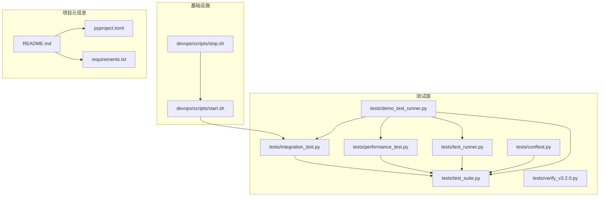
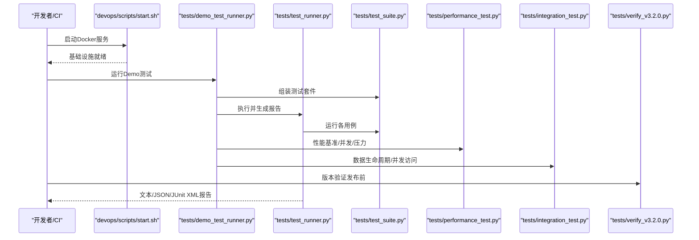
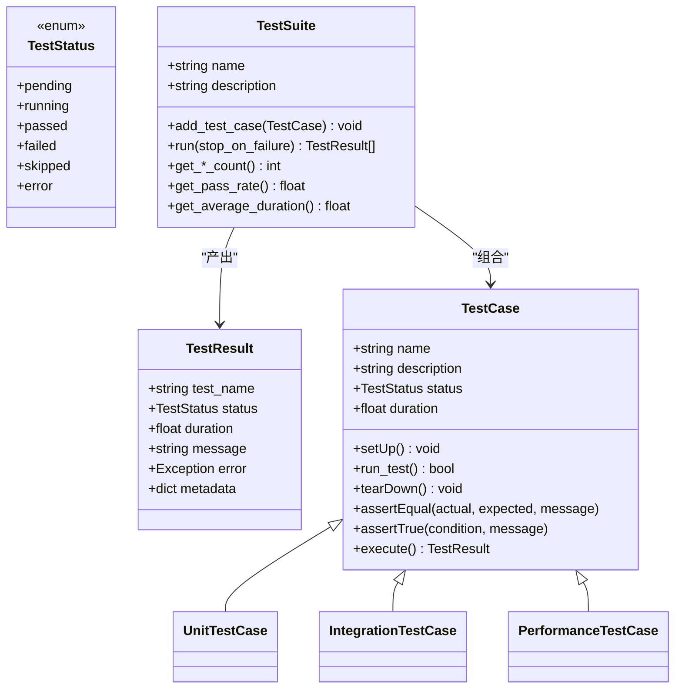
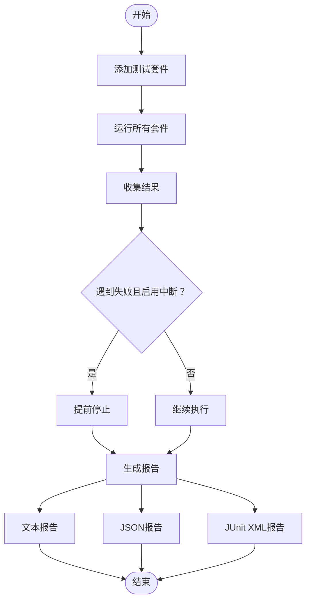
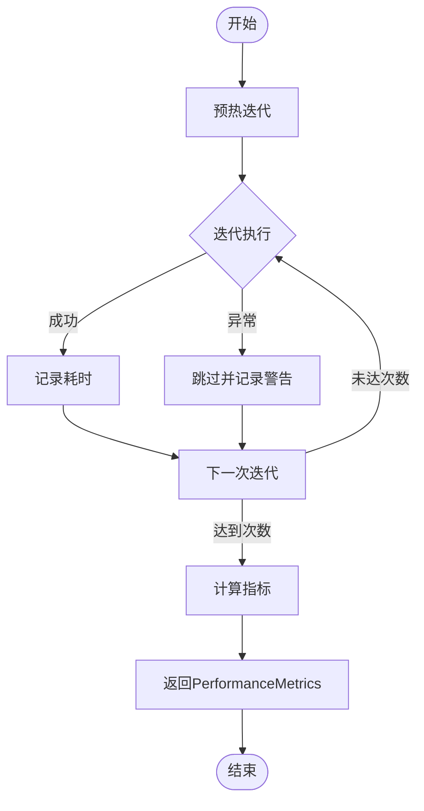
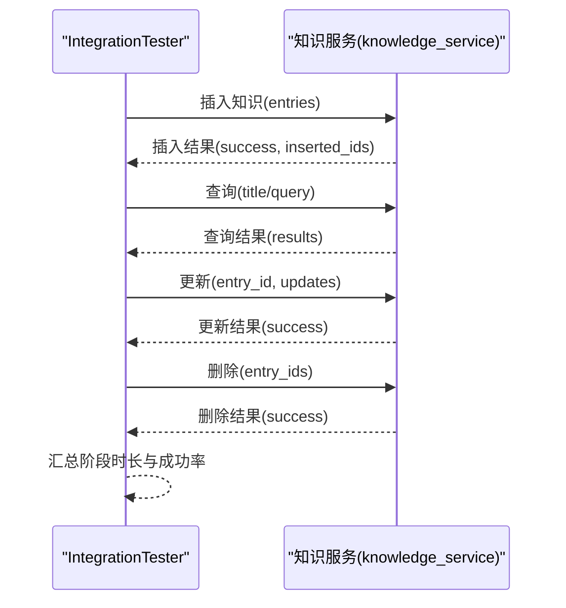
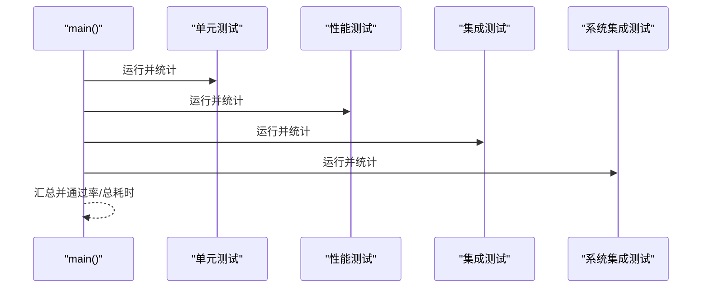
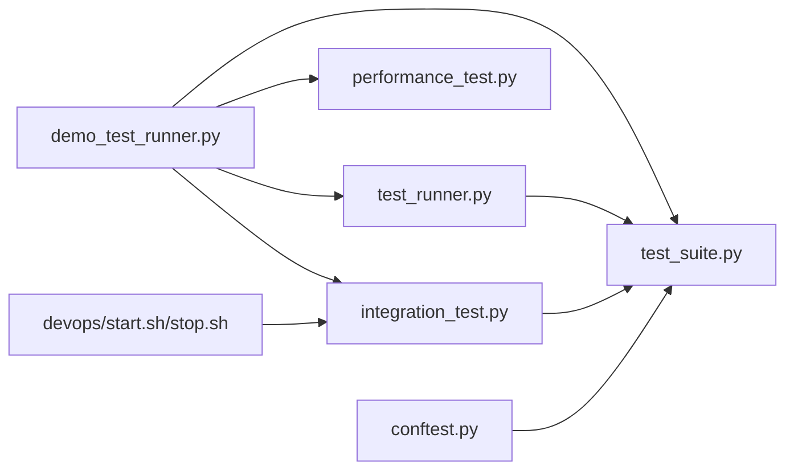

# 测试自动化与CI

<cite>
**本文引用的文件**
- [tests/demo_test_runner.py](file://tests/demo_test_runner.py)
- [tests/test_runner.py](file://tests/test_runner.py)
- [tests/test_suite.py](file://tests/test_suite.py)
- [tests/conftest.py](file://tests/conftest.py)
- [tests/performance_test.py](file://tests/performance_test.py)
- [tests/integration_test.py](file://tests/integration_test.py)
- [tests/verify_v3.2.0.py](file://tests/verify_v3.2.0.py)
- [devops/scripts/start.sh](file://devops/scripts/start.sh)
- [devops/scripts/stop.sh](file://devops/scripts/stop.sh)
- [README.md](file://README.md)
- [pyproject.toml](file://pyproject.toml)
- [requirements.txt](file://requirements.txt)
</cite>

## 目录
1. [引言](#引言)
2. [项目结构](#项目结构)
3. [核心组件](#核心组件)
4. [架构总览](#架构总览)
5. [详细组件分析](#详细组件分析)
6. [依赖分析](#依赖分析)
7. [性能考量](#性能考量)
8. [故障排查指南](#故障排查指南)
9. [结论](#结论)
10. [附录](#附录)

## 引言
本文件面向NecoRAG项目的测试自动化与持续集成，系统性阐述测试框架设计、Demo测试运行器的使用方法、测试验证流程（版本验证与回归测试）、测试报告生成与分析（文本、JSON、JUnit XML），以及CI/CD最佳实践（并行化、缓存策略、失败恢复）。文档以仓库现有实现为依据，避免臆造，确保读者可直接对照源码落地实施。

## 项目结构
围绕测试与CI的关键目录与文件如下：
- tests：测试框架与示例、性能/集成测试、版本验证脚本
- devops/scripts：Docker环境启动/停止脚本（为CI提供基础设施）
- README.md、pyproject.toml、requirements.txt：项目整体说明与依赖声明

**图表来源**
- [tests/test_suite.py](file://tests/test_suite.py)
- [tests/test_runner.py](file://tests/test_runner.py)
- [tests/demo_test_runner.py](file://tests/demo_test_runner.py)
- [tests/performance_test.py](file://tests/performance_test.py)
- [tests/integration_test.py](file://tests/integration_test.py)
- [tests/conftest.py](file://tests/conftest.py)
- [tests/verify_v3.2.0.py](file://tests/verify_v3.2.0.py)
- [devops/scripts/start.sh](file://devops/scripts/start.sh)
- [devops/scripts/stop.sh](file://devops/scripts/stop.sh)
- [README.md](file://README.md)
- [pyproject.toml](file://pyproject.toml)
- [requirements.txt](file://requirements.txt)

**章节来源**
- [README.md](file://README.md)
- [pyproject.toml](file://pyproject.toml)
- [requirements.txt](file://requirements.txt)

## 核心组件
- 测试套件与用例基类：统一的测试生命周期、断言与结果封装，支持装饰器注册与基类继承两种用例形式。
- 测试运行器：集中执行、统计、报告生成（文本/JSON/JUnit XML）。
- 性能测试器：基准、并发、压力与内存测试，输出多维指标。
- 集成测试器：数据生命周期、并发访问、查询流水线验证。
- Demo测试运行器：演示如何组合单元、性能、集成与系统集成测试，并输出汇总报告。
- pytest fixtures：提供配置、Mock与样本数据，便于测试复用。
- 版本验证脚本：验证版本号、模块导入、Docker镜像指南、README架构、Git状态。

**章节来源**
- [tests/test_suite.py](file://tests/test_suite.py)
- [tests/test_runner.py](file://tests/test_runner.py)
- [tests/performance_test.py](file://tests/performance_test.py)
- [tests/integration_test.py](file://tests/integration_test.py)
- [tests/demo_test_runner.py](file://tests/demo_test_runner.py)
- [tests/conftest.py](file://tests/conftest.py)
- [tests/verify_v3.2.0.py](file://tests/verify_v3.2.0.py)

## 架构总览
测试自动化与CI的整体流程如下：开发者在本地或CI环境中准备Docker基础设施，运行Demo测试或独立测试套件，生成文本/JSON/JUnit XML报告；版本验证脚本作为发布前校验；pytest fixtures提供稳定输入。

**图表来源**
- [devops/scripts/start.sh](file://devops/scripts/start.sh)
- [tests/demo_test_runner.py](file://tests/demo_test_runner.py)
- [tests/test_runner.py](file://tests/test_runner.py)
- [tests/test_suite.py](file://tests/test_suite.py)
- [tests/performance_test.py](file://tests/performance_test.py)
- [tests/integration_test.py](file://tests/integration_test.py)
- [tests/verify_v3.2.0.py](file://tests/verify_v3.2.0.py)

## 详细组件分析

### 测试框架与用例基类（test_suite.py）
- 设计要点
  - TestStatus枚举与TestResult数据类统一状态与结果。
  - TestCase抽象基类提供setUp/tearDown/断言方法与execute执行流程。
  - TestSuite负责批量执行、统计与日志。
  - 装饰器test_case与基类UnitTestCase/IntegrationTestCase/PerformanceTestCase提供灵活的用例组织方式。
- 关键流程
  - 用例执行：设置状态→前置准备→运行→后置清理→记录时长与状态→产出TestResult。
  - 套件统计：通过/失败/错误/跳过计数、通过率、平均耗时。
- 断言与错误处理
  - 断言失败抛出异常，捕获后记录为FAILED；异常捕获记录为ERROR。

**图表来源**
- [tests/test_suite.py](file://tests/test_suite.py)

**章节来源**
- [tests/test_suite.py](file://tests/test_suite.py)

### 测试运行器（test_runner.py）
- 功能
  - 管理多个TestSuite，集中执行与统计。
  - 生成文本报告、JSON报告与JUnit XML报告。
  - 支持按套件选择执行与失败中断。
- 报告生成
  - 文本报告：摘要与按套件分组详情。
  - JSON报告：包含summary与suite_groups。
  - JUnit XML报告：testsuites/testsuite/testcase/failure/error节点映射。
- 统计属性
  - total_tests/passed_tests/failed_tests/error_tests/success_rate。

**图表来源**
- [tests/test_runner.py](file://tests/test_runner.py)

**章节来源**
- [tests/test_runner.py](file://tests/test_runner.py)

### 性能测试器（performance_test.py）
- 能力
  - 单操作基准：warmup、多次迭代、统计指标（min/max/avg/median/std/percentiles/throughput）。
  - 并发基准：多线程并发执行，统计吞吐与响应分布。
  - 压力测试：持续运行直到失败率阈值或最大时长。
  - 内存使用测试：采样RSS，统计峰值/平均/增量。
- 输出
  - PerformanceMetrics数据类封装指标；stress_test返回综合统计与可选性能指标。

**图表来源**
- [tests/performance_test.py](file://tests/performance_test.py)

**章节来源**
- [tests/performance_test.py](file://tests/performance_test.py)

### 集成测试器（integration_test.py）
- 能力
  - 完整查询流水线：请求→响应→验证（结构/数量/耗时/内容）。
  - 数据生命周期：插入→查询→更新→删除，逐阶段记录时长与成功状态。
  - 并发访问：多线程随机查询，统计成功率与响应时间分布。
- 验证策略
  - 结构校验：必需字段存在。
  - 数量校验：最小结果数。
  - 性能校验：最大执行时间。
  - 内容校验：期望片段包含。

**图表来源**
- [tests/integration_test.py](file://tests/integration_test.py)

**章节来源**
- [tests/integration_test.py](file://tests/integration_test.py)

### Demo测试运行器（demo_test_runner.py）
- 设计
  - 展示单元测试（类/装饰器两种）、性能测试、集成测试与系统集成测试的组合运行。
  - 输出每类测试的统计与总体汇总，便于快速验证。
- 使用方法
  - 直接运行脚本，按顺序执行四类测试，最终返回退出码。
  - 可作为CI入口脚本，或本地快速验证。

**图表来源**
- [tests/demo_test_runner.py](file://tests/demo_test_runner.py)

**章节来源**
- [tests/demo_test_runner.py](file://tests/demo_test_runner.py)

### pytest fixtures（conftest.py）
- 作用
  - 提供NecoRAG配置、协议模型、Mock LLM客户端与样本数据，统一测试输入。
  - 支持默认/开发/最小配置与自定义配置，便于不同测试场景。
- 价值
  - 降低测试耦合，提升可维护性与可重复性。

**章节来源**
- [tests/conftest.py](file://tests/conftest.py)

### 版本验证脚本（verify_v3.2.0.py）
- 验证内容
  - 版本号、核心模块导入、Docker镜像指南完整性、README架构标注、Git工作区状态。
- 适用场景
  - 发布前检查清单，确保版本一致性与文档完整性。

**章节来源**
- [tests/verify_v3.2.0.py](file://tests/verify_v3.2.0.py)

## 依赖分析
- 项目依赖
  - README与pyproject.toml/requirements.txt声明了核心依赖与可选模块，测试相关依赖集中在requirements.txt中的pytest系列。
- 测试依赖关系
  - Demo测试运行器依赖测试框架与性能/集成测试模块。
  - 集成测试依赖接口模块（知识服务）。
  - pytest fixtures依赖核心配置与协议模型。

**图表来源**
- [tests/demo_test_runner.py](file://tests/demo_test_runner.py)
- [tests/test_runner.py](file://tests/test_runner.py)
- [tests/test_suite.py](file://tests/test_suite.py)
- [tests/performance_test.py](file://tests/performance_test.py)
- [tests/integration_test.py](file://tests/integration_test.py)
- [tests/conftest.py](file://tests/conftest.py)
- [devops/scripts/start.sh](file://devops/scripts/start.sh)
- [devops/scripts/stop.sh](file://devops/scripts/stop.sh)

**章节来源**
- [README.md](file://README.md)
- [pyproject.toml](file://pyproject.toml)
- [requirements.txt](file://requirements.txt)

## 性能考量
- 测试执行效率
  - 使用TestSuite批量执行与统计，减少重复初始化开销。
  - 性能测试器提供预热与多维度指标，避免误判。
- 报告生成成本
  - 文本/JSON/XML三种格式按需生成，避免冗余IO。
- CI并行化建议
  - 将单元、性能、集成、系统集成测试拆分为独立Job并行执行。
  - 使用Docker Compose按需启动Redis/Qdrant/Neo4j等后端服务，缩短冷启动时间。
- 缓存策略
  - 缓存Python依赖与Docker镜像层，减少重复下载。
  - 缓存测试产物（如报告）以便回溯分析。
- 失败恢复
  - 对不稳定测试（如网络/外部服务）增加重试与降级策略。
  - 在CI中对失败Job进行自动重试，超过阈值再阻断。

## 故障排查指南
- 常见问题定位
  - 测试用例断言失败：检查断言方法与输入数据，关注TestResult.message与error。
  - 性能测试异常：确认warmup迭代、异常捕获与指标计算逻辑。
  - 集成测试失败：核对知识服务接口、后端服务状态与并发限制。
  - 版本验证失败：核对版本号文件、模块导入路径与文档完整性。
- 日志与报告
  - 测试运行器与套件均输出日志，结合文本/JSON/JUnit XML报告定位根因。
- 基础设施
  - 使用devops脚本确保Docker服务可用，必要时清理数据卷后重试。

**章节来源**
- [tests/test_runner.py](file://tests/test_runner.py)
- [tests/test_suite.py](file://tests/test_suite.py)
- [tests/performance_test.py](file://tests/performance_test.py)
- [tests/integration_test.py](file://tests/integration_test.py)
- [tests/verify_v3.2.0.py](file://tests/verify_v3.2.0.py)
- [devops/scripts/start.sh](file://devops/scripts/start.sh)
- [devops/scripts/stop.sh](file://devops/scripts/stop.sh)

## 结论
NecoRAG测试自动化以统一的测试框架为核心，辅以性能与集成测试器，Demo运行器提供端到端演示。结合pytest fixtures与版本验证脚本，形成从单元到系统、从稳定性到合规性的完整验证体系。配合CI并行化、缓存与失败恢复策略，可显著提升交付质量与效率。

## 附录

### 测试报告格式与使用场景
- 文本报告
  - 适合本地快速审阅与人工对比。
- JSON报告
  - 适合CI系统归档与二次分析（趋势、指标聚合）。
- JUnit XML报告
  - 适合与CI平台的测试结果展示与告警联动。

**章节来源**
- [tests/test_runner.py](file://tests/test_runner.py)

### Docker环境与CI集成要点
- 启动/停止脚本
  - start.sh支持多种模式（完整/开发/最小/带LLM），便于CI按需拉起服务。
  - stop.sh支持保留/清理数据卷，便于状态重置。
- CI建议
  - 在Job中先执行start.sh，再运行测试，最后执行stop.sh。
  - 对LLM服务可使用profile分离，避免每次拉取模型导致超时。

**章节来源**
- [devops/scripts/start.sh](file://devops/scripts/start.sh)
- [devops/scripts/stop.sh](file://devops/scripts/stop.sh)