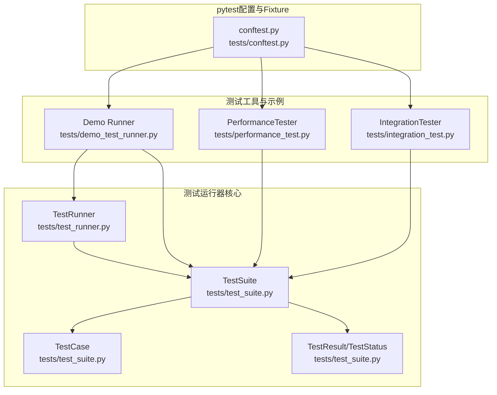
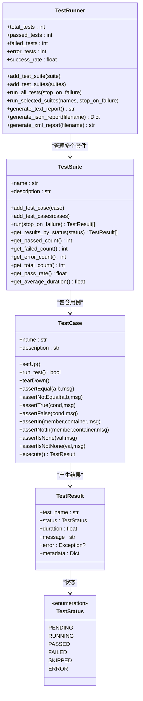
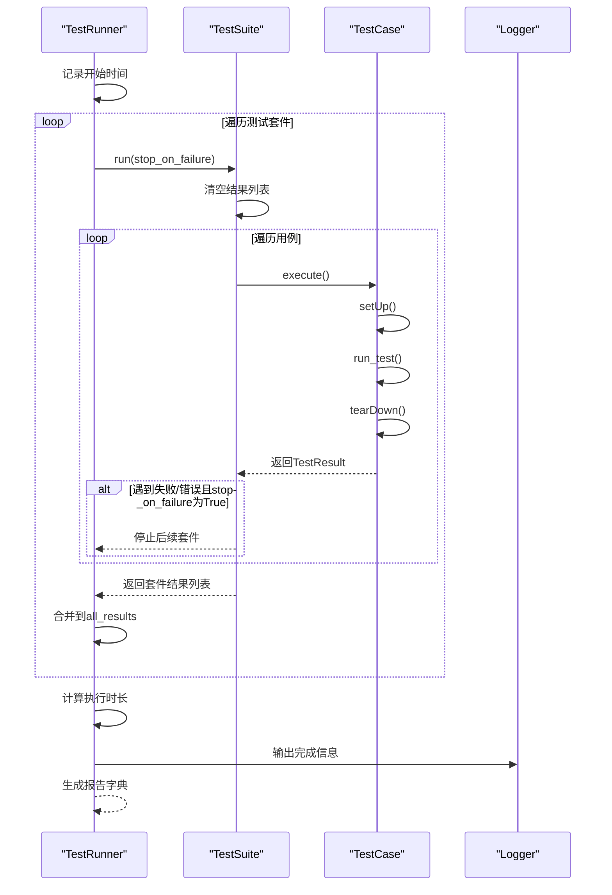
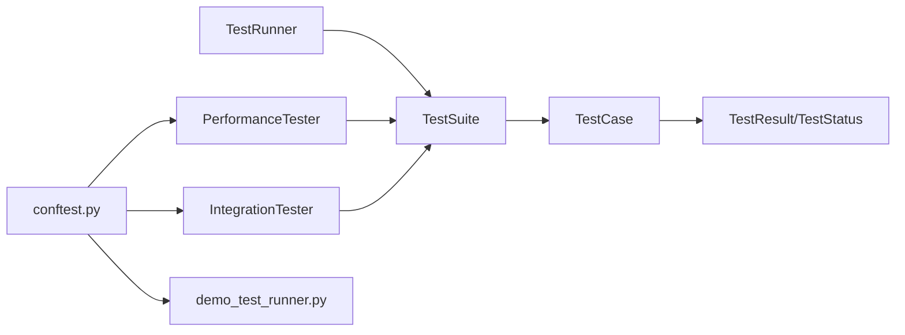

# 测试运行器核心

<cite>
**本文引用的文件**
- [tests/test_runner.py](file://tests/test_runner.py)
- [tests/test_suite.py](file://tests/test_suite.py)
- [tests/conftest.py](file://tests/conftest.py)
- [tests/demo_test_runner.py](file://tests/demo_test_runner.py)
- [tests/performance_test.py](file://tests/performance_test.py)
- [tests/integration_test.py](file://tests/integration_test.py)
- [tests/test_core/test_config.py](file://tests/test_core/test_config.py)
- [tests/test_core/test_protocols.py](file://tests/test_core/test_protocols.py)
- [tests/test_integration/test_necorag.py](file://tests/test_integration/test_necorag.py)
</cite>

## 目录
1. [引言](#引言)
2. [项目结构](#项目结构)
3. [核心组件](#核心组件)
4. [架构总览](#架构总览)
5. [详细组件分析](#详细组件分析)
6. [依赖分析](#依赖分析)
7. [性能考量](#性能考量)
8. [故障排查指南](#故障排查指南)
9. [结论](#结论)
10. [附录](#附录)

## 引言
本文件面向NecoRAG测试运行器核心，系统化梳理TestRunner与TestSuite的设计架构、测试发现与执行顺序控制、结果汇总与报告生成；同时阐述测试套件生命周期管理（初始化、执行、清理）、pytest配置与fixture定义（测试环境设置与依赖注入），并提供使用示例与最佳实践（含并行执行与错误处理策略）。文档兼顾技术细节与可读性，适合不同层次读者。

## 项目结构
围绕测试运行器的核心代码位于tests目录下，主要由以下模块组成：
- 测试运行器与套件：tests/test_runner.py、tests/test_suite.py
- pytest共享fixtures：tests/conftest.py
- 性能与集成测试工具：tests/performance_test.py、tests/integration_test.py
- 使用示例与演示：tests/demo_test_runner.py
- 其他模块的pytest测试：tests/test_core/test_config.py、tests/test_core/test_protocols.py、tests/test_integration/test_necorag.py

图表来源
- [tests/test_runner.py:16-327](file://tests/test_runner.py#L16-L327)
- [tests/test_suite.py:14-287](file://tests/test_suite.py#L14-L287)
- [tests/performance_test.py:31-322](file://tests/performance_test.py#L31-L322)
- [tests/integration_test.py:14-377](file://tests/integration_test.py#L14-L377)
- [tests/conftest.py:1-330](file://tests/conftest.py#L1-L330)
- [tests/demo_test_runner.py:1-292](file://tests/demo_test_runner.py#L1-L292)

章节来源
- [tests/test_runner.py:16-327](file://tests/test_runner.py#L16-L327)
- [tests/test_suite.py:14-287](file://tests/test_suite.py#L14-L287)
- [tests/conftest.py:1-330](file://tests/conftest.py#L1-L330)
- [tests/demo_test_runner.py:1-292](file://tests/demo_test_runner.py#L1-L292)
- [tests/performance_test.py:31-322](file://tests/performance_test.py#L31-L322)
- [tests/integration_test.py:14-377](file://tests/integration_test.py#L14-L377)

## 核心组件
- TestRunner：负责聚合多个TestSuite，协调执行顺序与失败中断策略，汇总统计并生成多种格式报告（文本、JSON、JUnit XML）。
- TestSuite：封装一组TestCase，按序执行，支持“遇错即停”策略，并提供按状态筛选与统计能力。
- TestCase/TestStatus/TestResult：抽象测试用例基类、测试状态枚举与结果数据结构，提供断言工具与执行生命周期（setUp/tearDown/run_test）。
- PerformanceTester/IntegrationTester：提供性能基准、并发、压力测试与系统集成测试能力，作为测试套件的补充工具。
- pytest fixtures：集中定义配置、Mock客户端、样本数据等，便于跨模块复用与依赖注入。

章节来源
- [tests/test_runner.py:16-327](file://tests/test_runner.py#L16-L327)
- [tests/test_suite.py:14-287](file://tests/test_suite.py#L14-L287)
- [tests/performance_test.py:31-322](file://tests/performance_test.py#L31-L322)
- [tests/integration_test.py:14-377](file://tests/integration_test.py#L14-L377)
- [tests/conftest.py:1-330](file://tests/conftest.py#L1-L330)

## 架构总览
测试运行器采用“套件-用例-结果”的分层架构：
- TestRunner持有多个TestSuite，逐个调度执行，支持按名称选择性运行与失败中断。
- TestSuite维护用例列表，逐一执行并收集TestResult，支持按状态统计与平均耗时。
- TestCase定义统一的执行生命周期与断言方法，TestResult承载状态、耗时、消息与错误信息。
- pytest fixtures提供跨模块共享的配置与Mock对象，减少重复初始化成本。

图表来源
- [tests/test_runner.py:16-327](file://tests/test_runner.py#L16-L327)
- [tests/test_suite.py:14-287](file://tests/test_suite.py#L14-L287)

## 详细组件分析

### TestRunner：测试运行器
- 职责
  - 管理测试套件集合，支持批量添加与按名称选择性运行。
  - 控制执行顺序与失败中断策略（stop_on_failure）。
  - 汇总所有结果并生成统计报告，支持文本、JSON、JUnit XML三种输出。
- 关键方法
  - add_test_suite/add_test_suites：注册测试套件。
  - run_all_tests：遍历执行，遇到失败可提前停止。
  - run_selected_suites：临时替换套件列表后执行，再恢复。
  - generate_text_report/generate_json_report/generate_xml_report：生成报告。
  - 属性：total_tests/passed_tests/failed_tests/error_tests/success_rate。
- 执行流程（run_all_tests）
  - 记录起止时间，清空历史结果。
  - 依次执行每个TestSuite.run，若开启stop_on_failure且当前套件出现失败或错误，则中断后续套件执行。
  - 统计执行时长并生成报告字典与详细报告（按套件分组）。

图表来源
- [tests/test_runner.py:36-66](file://tests/test_runner.py#L36-L66)
- [tests/test_suite.py:165-198](file://tests/test_suite.py#L165-L198)

章节来源
- [tests/test_runner.py:16-327](file://tests/test_runner.py#L16-L327)

### TestSuite：测试套件
- 职责
  - 维护测试用例列表，按序执行并收集结果。
  - 支持“遇错即停”，并提供按状态筛选与统计方法。
- 关键方法
  - add_test_case/add_test_cases：添加用例。
  - run：执行所有用例，支持stop_on_failure。
  - 统计方法：get_results_by_status/get_passed_count/get_failed_count/get_error_count/get_total_count/get_pass_rate/get_average_duration/_log_summary。
- 执行流程（run）
  - 清空历史结果，逐个调用TestCase.execute，捕获异常并记录为ERROR。
  - 若stop_on_failure为True且当前结果为FAILED/ERROR则中断。

章节来源
- [tests/test_suite.py:145-245](file://tests/test_suite.py#L145-L245)

### TestCase/TestStatus/TestResult：测试用例与结果
- TestCase
  - 生命周期：setUp -> run_test -> tearDown。
  - 断言方法：assertEqual/assertNotEqual/assertTrue/assertFalse/assertIn/assertNotIn/assertIsNone/assertIsNotNone。
  - execute：统一入口，记录开始时间、状态、耗时，异常捕获并标记为ERROR。
- TestStatus/TestResult
  - TestStatus：PENDING/RUNNING/PASSED/FAILED/SKIPPED/ERROR。
  - TestResult：包含测试名、状态、耗时、消息、错误对象与元数据。

章节来源
- [tests/test_suite.py:35-143](file://tests/test_suite.py#L35-L143)
- [tests/test_suite.py:14-33](file://tests/test_suite.py#L14-L33)

### 性能测试器（PerformanceTester）
- 能力
  - 单操作基准测试：warmup + iterations，统计min/max/avg/median/std/percentiles/throughput。
  - 并发基准测试：多线程并发执行，统计吞吐与耗时。
  - 压力测试：持续运行直到失败率超过阈值或超时。
  - 内存使用测试：基于psutil采样内存变化。
- 适用场景
  - 验证API/服务端点性能、并发稳定性与资源消耗。

章节来源
- [tests/performance_test.py:31-322](file://tests/performance_test.py#L31-L322)

### 集成测试器（IntegrationTester）
- 能力
  - 完整查询流水线测试：对knowledge_service.query_knowledge进行端到端验证。
  - 数据生命周期测试：插入->查询->更新->删除，验证各阶段成功与耗时。
  - 并发访问测试：多线程随机查询，统计成功率与响应时间。
- 适用场景
  - 验证系统整体功能、数据一致性与并发健壮性。

章节来源
- [tests/integration_test.py:14-377](file://tests/integration_test.py#L14-L377)

### pytest配置与Fixture（conftest.py）
- 目标
  - 在tests目录下提供共享的配置、Mock客户端与样本数据，便于跨模块复用。
- 关键内容
  - 配置fixtures：default_config/development_config/minimal_config/custom_config/llm_config/perception_config/memory_config/retrieval_config等。
  - Mock客户端：mock_llm_client/mock_llm_client_small_dim。
  - 样本数据：sample_document/sample_chunks/sample_query/sample_entity/sample_relation/sample_user_profile/sample_memory及多语言文本样本。
  - 时间类：current_time/past_time/future_time。
- 使用方式
  - 在具体测试文件中通过参数注入使用上述fixtures，避免重复初始化与硬编码。

章节来源
- [tests/conftest.py:1-330](file://tests/conftest.py#L1-L330)

### 使用示例与演示（demo_test_runner.py）
- 示例内容
  - 单元测试用例：MathUnitTest/StringProcessingTest。
  - 装饰器用例：test_list_operations/test_dict_operations。
  - 性能测试：PerformanceTester.benchmark_single_operation。
  - 集成测试：IntegrationTester.test_data_lifecycle/test_full_query_pipeline/test_concurrent_access。
  - 系统集成测试：FullSystemIntegrationTest。
- 运行方式
  - 直接执行脚本，按顺序运行各类测试并输出汇总报告。

章节来源
- [tests/demo_test_runner.py:1-292](file://tests/demo_test_runner.py#L1-L292)

## 依赖分析
- TestRunner依赖TestSuite与TestResult/TestStatus。
- TestSuite依赖TestCase与logging。
- TestCase依赖logging与time。
- PerformanceTester/IntegrationTester依赖TestSuite的测试基类与logging。
- pytest fixtures在conftest.py中集中定义，被各测试模块通过参数注入使用。

图表来源
- [tests/test_runner.py:16-327](file://tests/test_runner.py#L16-L327)
- [tests/test_suite.py:14-287](file://tests/test_suite.py#L14-L287)
- [tests/performance_test.py:31-322](file://tests/performance_test.py#L31-L322)
- [tests/integration_test.py:14-377](file://tests/integration_test.py#L14-L377)
- [tests/conftest.py:1-330](file://tests/conftest.py#L1-L330)
- [tests/demo_test_runner.py:1-292](file://tests/demo_test_runner.py#L1-L292)

章节来源
- [tests/test_runner.py:16-327](file://tests/test_runner.py#L16-L327)
- [tests/test_suite.py:14-287](file://tests/test_suite.py#L14-L287)
- [tests/conftest.py:1-330](file://tests/conftest.py#L1-L330)

## 性能考量
- 执行顺序与失败中断
  - TestRunner在run_all_tests中按添加顺序执行套件；当stop_on_failure为True时，遇到失败/错误即停止后续套件执行，缩短整体耗时。
  - TestSuite在run中对单个用例失败/异常也支持立即停止，避免无效重试。
- 报告生成
  - Text/JSON/XML三类报告分别适用于不同消费场景：本地查看、CI系统、测试平台。
- 并发与压力测试
  - PerformanceTester提供并发基准与压力测试，帮助定位瓶颈与资源上限。
- 日志与统计
  - 统一使用logging记录关键事件，便于问题定位与审计。
- 建议
  - 在CI中优先使用JSON/XML报告，便于自动化处理。
  - 对热点模块使用PerformanceTester进行回归性能监控。
  - 对关键路径使用stop_on_failure加速失败收敛。

[本节为通用指导，不直接分析特定文件]

## 故障排查指南
- 常见问题
  - 套件未执行：确认TestRunner.add_test_suite已正确注册；检查run_selected_suites传入的名称是否匹配。
  - 结果为空：检查TestSuite是否添加了用例；确认TestCase.execute未抛出未捕获异常。
  - 报告缺失：确认generate_*_report已调用；检查文件写入权限。
  - pytest导入失败：确认conftest.py路径与依赖模块可用；必要时使用pytestmark跳过。
- 定位手段
  - 查看TestRunner/TestSuite日志输出，关注失败/错误用例与消息。
  - 使用get_results_by_status筛选特定状态，结合TestResult.message与error定位根因。
  - 在PerformanceTester/IntegrationTester中查看详细统计与trace信息。

章节来源
- [tests/test_runner.py:36-66](file://tests/test_runner.py#L36-L66)
- [tests/test_suite.py:165-198](file://tests/test_suite.py#L165-L198)
- [tests/conftest.py:28-32](file://tests/conftest.py#L28-L32)

## 结论
NecoRAG测试运行器核心以TestRunner/TestSuite/TestResult为核心，配合pytest fixtures与性能/集成测试工具，构建了可扩展、可观测、可报告的测试体系。通过统一的执行顺序控制、失败中断策略与多格式报告，既能满足日常开发调试，也能支撑CI与回归测试。建议在实际工程中结合并行与压力测试，持续监控性能与稳定性。

[本节为总结性内容，不直接分析特定文件]

## 附录

### 使用示例与最佳实践
- 基本用法
  - 创建TestSuite并添加用例，调用run_all_tests或run_selected_suites。
  - 使用generate_text_report/generate_json_report/generate_xml_report输出报告。
- 并行执行
  - 当前TestRunner/TestSuite为串行执行。若需并行，可在外部通过多进程/多线程调度多个TestRunner实例，注意共享资源隔离与报告合并。
- 错误处理策略
  - stop_on_failure：快速失败，缩短回归周期。
  - 异常捕获：TestCase.execute统一捕获异常并标记为ERROR，便于报告与统计。
  - pytest fixtures：通过conftest.py集中管理配置与Mock，减少环境差异导致的失败。

章节来源
- [tests/test_runner.py:36-66](file://tests/test_runner.py#L36-L66)
- [tests/test_suite.py:165-198](file://tests/test_suite.py#L165-L198)
- [tests/conftest.py:1-330](file://tests/conftest.py#L1-L330)

### 测试覆盖参考
- 配置与协议：通过test_core下的pytest测试验证配置与数据协议的正确性。
- 端到端集成：通过test_integration下的pytest测试验证系统工作流与边界情况。

章节来源
- [tests/test_core/test_config.py:1-397](file://tests/test_core/test_config.py#L1-L397)
- [tests/test_core/test_protocols.py:1-494](file://tests/test_core/test_protocols.py#L1-L494)
- [tests/test_integration/test_necorag.py:1-580](file://tests/test_integration/test_necorag.py#L1-L580)