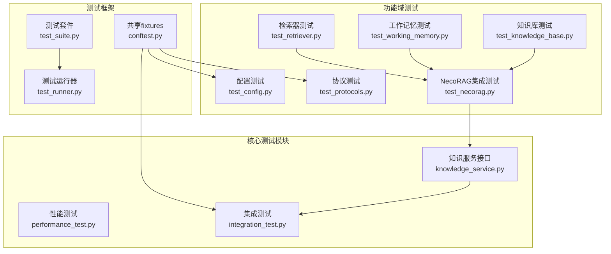
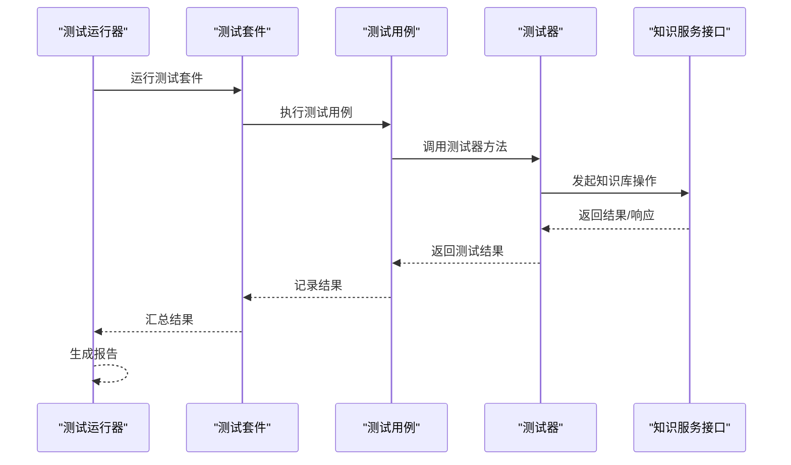
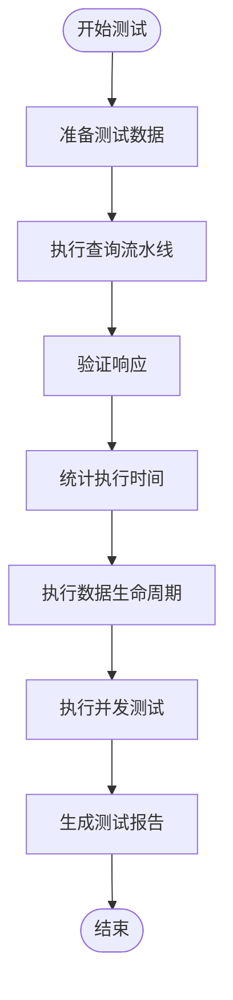
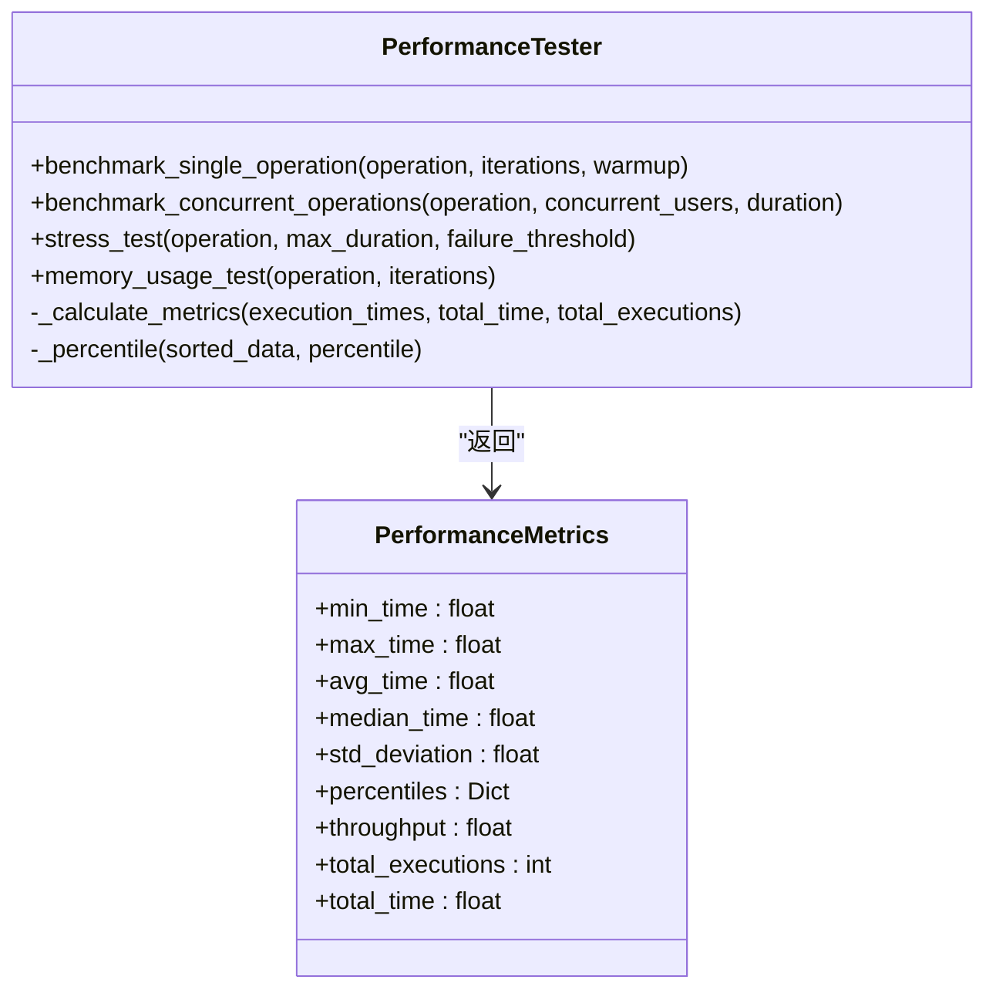
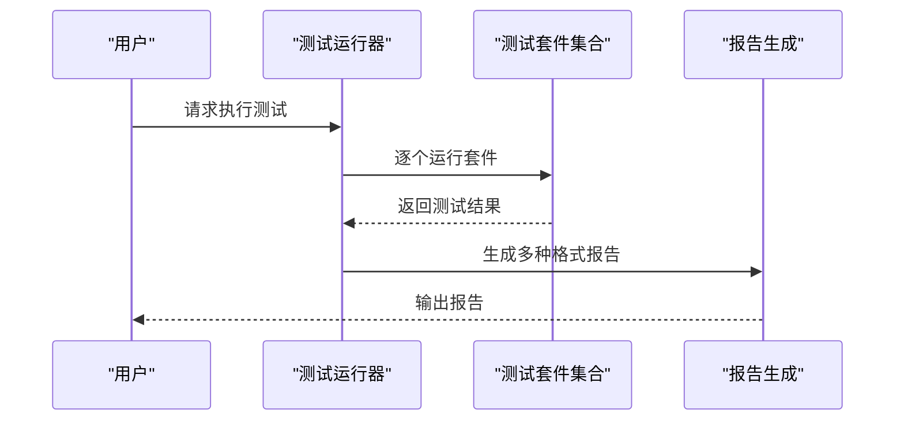
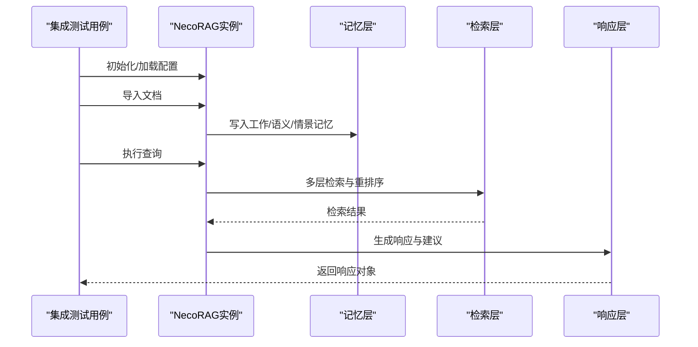
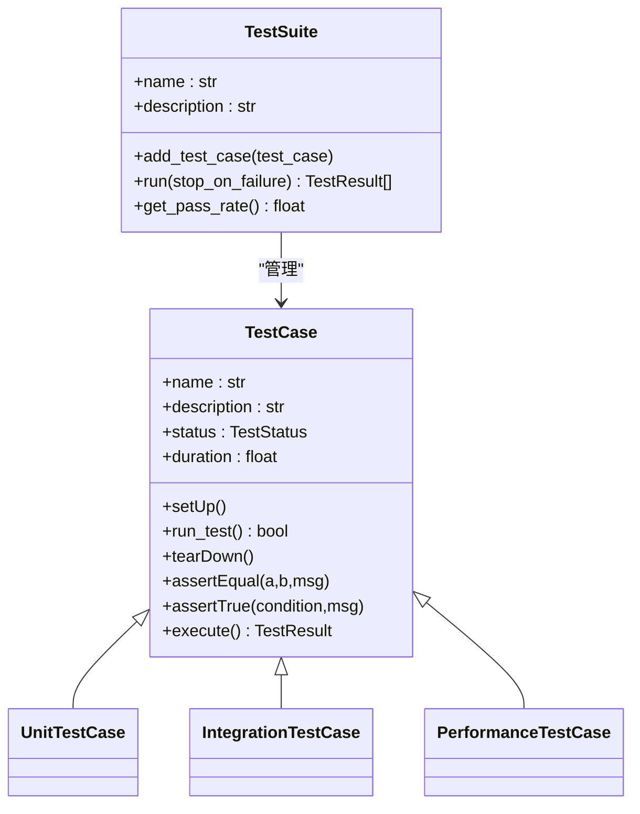
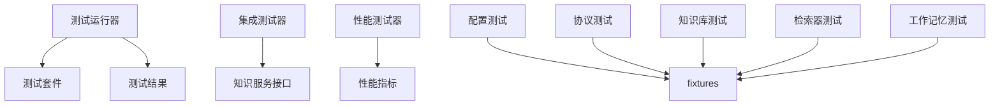

# 集成与性能测试

<cite>
**本文档引用的文件**
- [integration_test.py](file://tests/integration_test.py)
- [performance_test.py](file://tests/performance_test.py)
- [test_runner.py](file://tests/test_runner.py)
- [test_suite.py](file://tests/test_suite.py)
- [conftest.py](file://tests/conftest.py)
- [knowledge_service.py](file://interface/knowledge_service.py)
- [test_necorag.py](file://tests/test_integration/test_necorag.py)
- [test_config.py](file://tests/test_core/test_config.py)
- [test_protocols.py](file://tests/test_core/test_protocols.py)
- [test_knowledge_base.py](file://tests/test_domain/test_knowledge_base.py)
- [test_retriever.py](file://tests/test_retrieval/test_retriever.py)
- [test_working_memory.py](file://tests/test_memory/test_working_memory.py)
- [demo_test_runner.py](file://tests/demo_test_runner.py)
- [verify_v3.2.0.py](file://tests/verify_v3.2.0.py)
</cite>

## 目录
1. [简介](#简介)
2. [项目结构](#项目结构)
3. [核心组件](#核心组件)
4. [架构概览](#架构概览)
5. [详细组件分析](#详细组件分析)
6. [依赖分析](#依赖分析)
7. [性能考量](#性能考量)
8. [故障排除指南](#故障排除指南)
9. [结论](#结论)
10. [附录](#附录)

## 简介
本文件面向NecoRAG项目的集成与性能测试，系统化阐述测试架构设计、端到端测试流程、组件间交互验证、数据流测试、性能基准与压力测试、并发测试与内存监控，以及插件与接口测试的特殊考虑。文档同时提供测试环境配置与测试数据管理说明，并给出性能基准与优化建议。

## 项目结构
测试相关代码主要位于tests目录，采用按功能域划分的层次化组织：
- tests/test_core：核心配置与协议测试
- tests/test_domain：领域知识库测试
- tests/test_integration：系统集成测试与端到端工作流
- tests/test_retrieval：检索层测试
- tests/test_memory：记忆层测试
- tests/performance_test.py：性能测试模块
- tests/integration_test.py：集成测试器
- tests/test_runner.py：测试运行器与报告生成
- tests/test_suite.py：测试基类与套件管理
- tests/conftest.py：pytest共享fixtures
- interface/knowledge_service.py：知识服务接口封装

**图表来源**
- [test_suite.py:145-245](file://tests/test_suite.py#L145-L245)
- [test_runner.py:16-66](file://tests/test_runner.py#L16-L66)
- [performance_test.py:31-136](file://tests/performance_test.py#L31-L136)
- [integration_test.py:14-184](file://tests/integration_test.py#L14-L184)
- [knowledge_service.py:27-307](file://interface/knowledge_service.py#L27-L307)
- [test_necorag.py:48-580](file://tests/test_integration/test_necorag.py#L48-L580)

**章节来源**
- [test_suite.py:1-287](file://tests/test_suite.py#L1-L287)
- [test_runner.py:1-327](file://tests/test_runner.py#L1-L327)
- [performance_test.py:1-322](file://tests/performance_test.py#L1-L322)
- [integration_test.py:1-377](file://tests/integration_test.py#L1-L377)
- [knowledge_service.py:1-307](file://interface/knowledge_service.py#L1-L307)

## 核心组件
- 测试基类与套件：提供统一的测试生命周期、断言方法、结果收集与统计。
- 测试运行器：负责执行测试套件、聚合结果、生成多种格式报告（文本、JSON、JUnit XML）。
- 集成测试器：封装端到端查询流水线、数据生命周期（插入-查询-更新-删除）、并发访问测试。
- 性能测试器：提供单操作基准、并发基准、压力测试与内存使用监控。
- 知识服务接口：封装查询、插入、更新、删除等核心操作，作为集成测试的调用目标。

**章节来源**
- [test_suite.py:35-143](file://tests/test_suite.py#L35-L143)
- [test_runner.py:16-327](file://tests/test_runner.py#L16-L327)
- [integration_test.py:14-321](file://tests/integration_test.py#L14-L321)
- [performance_test.py:31-291](file://tests/performance_test.py#L31-L291)
- [knowledge_service.py:27-307](file://interface/knowledge_service.py#L27-L307)

## 架构概览
下图展示了测试执行的总体架构与数据流：

**图表来源**
- [test_runner.py:36-66](file://tests/test_runner.py#L36-L66)
- [test_suite.py:165-198](file://tests/test_suite.py#L165-L198)
- [integration_test.py:20-86](file://tests/integration_test.py#L20-L86)
- [knowledge_service.py:45-185](file://interface/knowledge_service.py#L45-L185)

## 详细组件分析

### 集成测试器（IntegrationTester）
- 完整查询流水线测试：对输入请求执行查询，验证响应结构与预期结果，统计执行时间并计算成功率。
- 数据生命周期测试：覆盖插入、查询、更新、删除四个阶段，记录各阶段耗时与成功状态。
- 并发访问测试：多线程模拟并发用户，随机选择查询内容，统计吞吐量与响应时间分布。
- 响应验证：校验响应字段完整性、结果数量、执行时间上限与内容匹配。

**图表来源**
- [integration_test.py:20-86](file://tests/integration_test.py#L20-L86)
- [integration_test.py:88-183](file://tests/integration_test.py#L88-L183)
- [integration_test.py:185-281](file://tests/integration_test.py#L185-L281)

**章节来源**
- [integration_test.py:14-321](file://tests/integration_test.py#L14-L321)

### 性能测试器（PerformanceTester）
- 单操作基准：支持预热迭代与多次执行，输出最小/最大/平均/中位数、标准差、百分位数、吞吐量等指标。
- 并发基准：多线程并发执行指定时长，统计总操作数与吞吐量。
- 压力测试：持续执行直到失败率超过阈值或达到最大时长，输出失败率与性能指标。
- 内存监控：使用psutil采集初始与最终内存，统计峰值与平均内存占用。

**图表来源**
- [performance_test.py:31-291](file://tests/performance_test.py#L31-L291)

**章节来源**
- [performance_test.py:17-291](file://tests/performance_test.py#L17-L291)

### 测试运行器与报告生成
- 统一执行入口：支持全量执行与按套件名称选择执行，可配置遇到失败时停止。
- 结果聚合：按状态统计总数、通过数、失败数、错误数与成功率。
- 报告格式：文本报告、JSON报告、JUnit XML报告，便于CI集成。

**图表来源**
- [test_runner.py:36-66](file://tests/test_runner.py#L36-L66)
- [test_runner.py:162-234](file://tests/test_runner.py#L162-L234)

**章节来源**
- [test_runner.py:16-327](file://tests/test_runner.py#L16-L327)

### 端到端系统集成测试
- NecoRAG主类初始化与配置：验证默认配置、自定义配置、开发/最小预设配置与自定义LLM客户端。
- 文档导入与查询：测试文本/文件/目录导入，查询响应结构与统计更新。
- 意图分析与知识演化：验证意图检测、知识更新、健康报告与学习指标。
- 边界情况：Unicode内容、超长文本、特殊字符、空目录等。

**图表来源**
- [test_necorag.py:48-580](file://tests/test_integration/test_necorag.py#L48-L580)

**章节来源**
- [test_necorag.py:1-580](file://tests/test_integration/test_necorag.py#L1-L580)

### 测试基类与断言体系
- TestCase基类：提供setUp/tearDown、断言方法（相等、包含、True/False、None等）、执行与结果记录。
- TestSuite：统一管理测试用例，支持按状态筛选、通过率与平均耗时统计。
- 预定义测试类型：UnitTestCase、IntegrationTestCase、PerformanceTestCase。

**图表来源**
- [test_suite.py:35-143](file://tests/test_suite.py#L35-L143)
- [test_suite.py:145-245](file://tests/test_suite.py#L145-L245)

**章节来源**
- [test_suite.py:1-287](file://tests/test_suite.py#L1-L287)

### 测试数据与环境配置
- pytest fixtures：提供默认/开发/最小配置、Mock LLM客户端、样本数据（文档、分块、查询、实体、关系、用户画像、文本样本）。
- 配置测试：验证NecoRAGConfig及其子配置、序列化/反序列化、预设配置。
- 协议测试：验证统一数据模型（枚举、Document、Chunk、Query、Response、UserProfile等）。

**章节来源**
- [conftest.py:1-330](file://tests/conftest.py#L1-L330)
- [test_config.py:1-397](file://tests/test_core/test_config.py#L1-L397)
- [test_protocols.py:1-494](file://tests/test_core/test_protocols.py#L1-L494)

### 功能域专项测试
- 知识库管理：FAQ增删改查、关键字提取与建议、关键词导入、知识库持久化。
- 检索器：早停控制器、HyDE增强、多跳检索、检索路径追踪。
- 工作记忆：上下文存储/检索、会话管理、意图轨迹跟踪。

**章节来源**
- [test_knowledge_base.py:1-320](file://tests/test_domain/test_knowledge_base.py#L1-L320)
- [test_retriever.py:1-410](file://tests/test_retrieval/test_retriever.py#L1-L410)
- [test_working_memory.py:1-307](file://tests/test_memory/test_working_memory.py#L1-L307)

## 依赖分析
测试模块之间的依赖关系如下：
- 测试运行器依赖测试套件与测试结果数据结构。
- 集成测试器依赖知识服务接口与测试断言。
- 性能测试器独立，但可与测试运行器配合执行性能专项。
- 各功能域测试依赖conftest提供的fixtures与核心配置/协议。

**图表来源**
- [test_runner.py:16-66](file://tests/test_runner.py#L16-L66)
- [integration_test.py:14-321](file://tests/integration_test.py#L14-L321)
- [performance_test.py:31-291](file://tests/performance_test.py#L31-L291)
- [conftest.py:1-330](file://tests/conftest.py#L1-L330)

**章节来源**
- [test_runner.py:1-327](file://tests/test_runner.py#L1-L327)
- [integration_test.py:1-377](file://tests/integration_test.py#L1-L377)
- [performance_test.py:1-322](file://tests/performance_test.py#L1-L322)
- [conftest.py:1-330](file://tests/conftest.py#L1-L330)

## 性能考量
- 基准测试：建议针对关键操作（查询、插入、更新、删除）分别执行单操作基准与并发基准，记录吞吐量与延迟分布。
- 压力测试：设定失败率阈值与最大时长，观察系统在极限负载下的稳定性与恢复能力。
- 内存监控：结合psutil进行内存采样，关注峰值与增长趋势，定位内存泄漏或异常增长点。
- 并发策略：合理设置并发用户数与测试时长，避免资源争用导致的误判；对慢查询与阻塞操作进行隔离测试。
- 指标解读：优先关注P50/P95/P99延迟与失败率，结合吞吐量评估系统整体性能表现。

## 故障排除指南
- 测试运行失败：检查测试运行器的日志输出，定位具体失败用例与错误信息。
- 集成测试超时：确认知识服务接口可用性与后端依赖（如数据库、缓存）状态。
- 性能测试异常：检查psutil依赖安装与权限，确保内存监控可用；核对基准测试的预热迭代设置。
- 配置加载问题：验证配置文件路径与格式，确保序列化/反序列化正常。
- 端到端测试中断：检查NecoRAG实例化与模块导入依赖，必要时使用pytest.skip跳过不可用模块。

**章节来源**
- [test_runner.py:236-290](file://tests/test_runner.py#L236-L290)
- [integration_test.py:64-71](file://tests/integration_test.py#L64-L71)
- [performance_test.py:203-208](file://tests/performance_test.py#L203-L208)
- [test_config.py:101-121](file://tests/test_core/test_config.py#L101-L121)

## 结论
NecoRAG的测试体系以统一的测试基类与运行器为核心，结合集成测试器与性能测试器，实现了从单元到端到端、从功能到性能的全面覆盖。通过规范化的报告生成与丰富的fixtures，测试具备良好的可维护性与扩展性。建议在持续集成中定期运行集成与性能测试，结合内存监控与压力测试，持续优化系统性能与稳定性。

## 附录
- 版本验证脚本：验证版本号、核心模块导入、Docker镜像指南、README技术栈与Git状态。
- Demo测试运行器：演示如何使用测试框架执行各类测试并生成报告。

**章节来源**
- [verify_v3.2.0.py:1-226](file://tests/verify_v3.2.0.py#L1-L226)
- [demo_test_runner.py:1-292](file://tests/demo_test_runner.py#L1-L292)