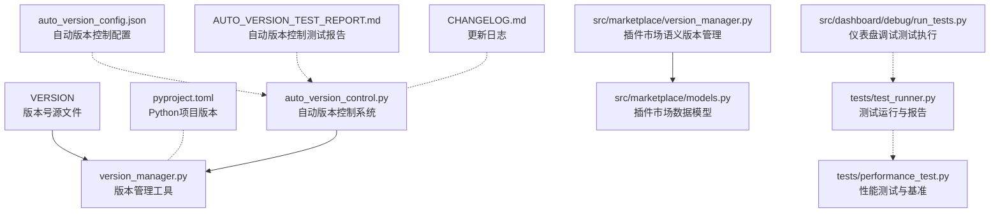
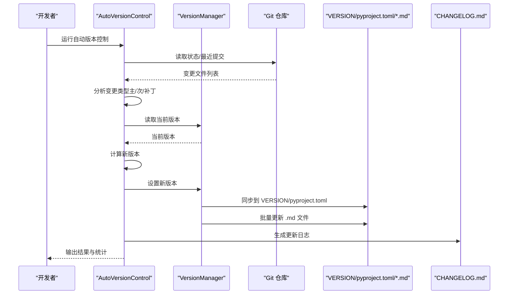
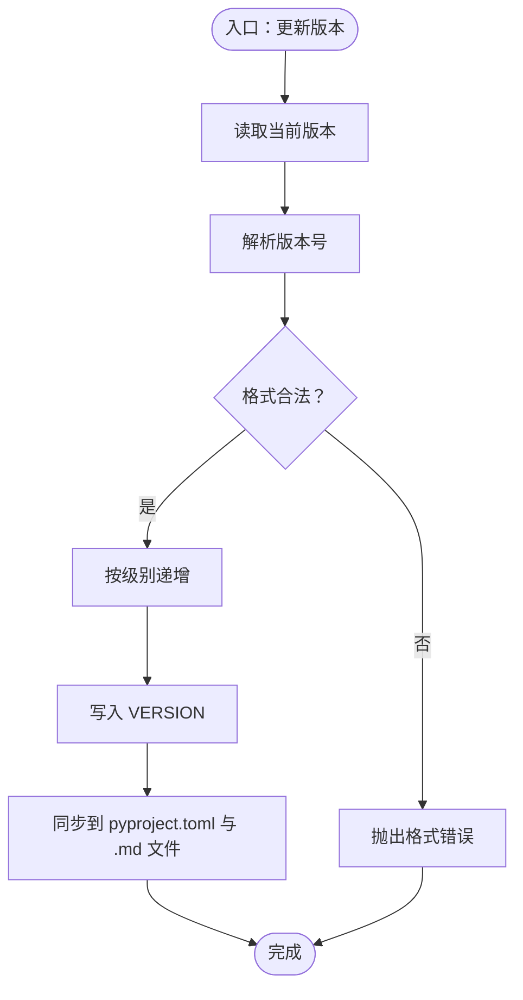
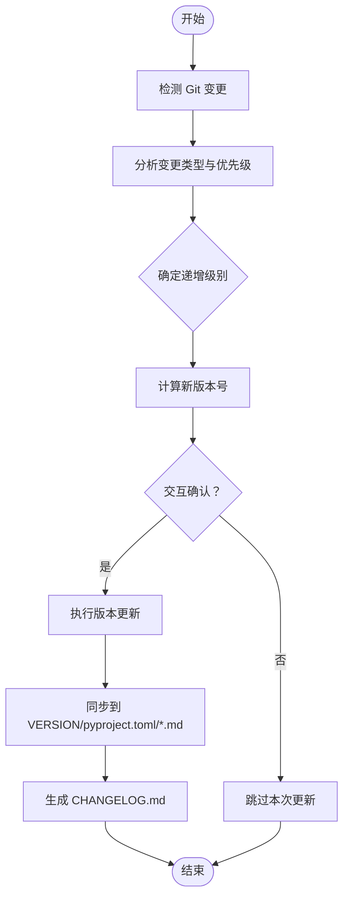
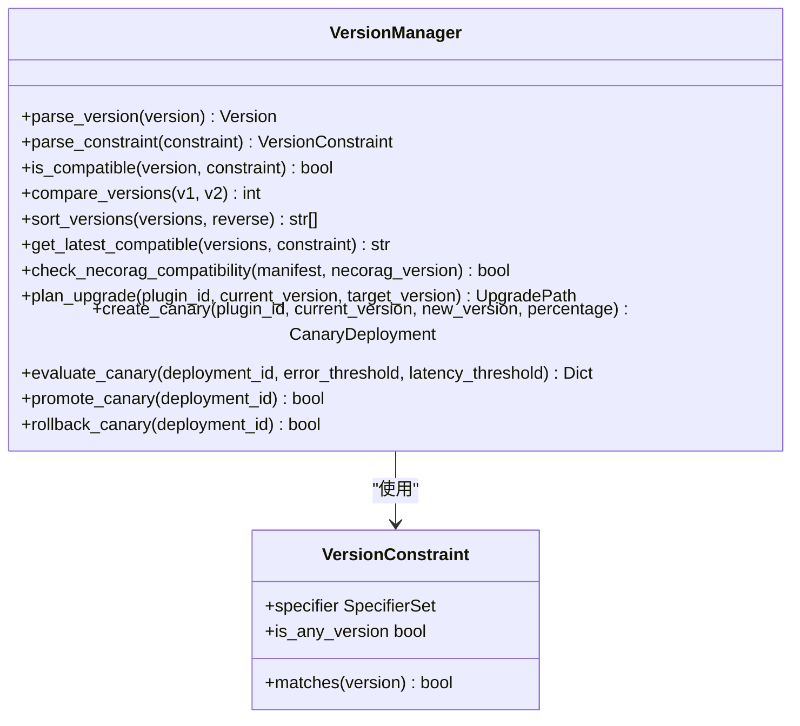
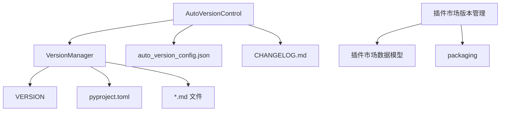

# 版本管理工具

<cite>
**本文引用的文件**
- [tools/version_manager.py](file://tools/version_manager.py)
- [tools/auto_version_control.py](file://tools/auto_version_control.py)
- [tools/auto_version_config.json](file://tools/auto_version_config.json)
- [tools/AUTO_VERSION_TEST_REPORT.md](file://tools/AUTO_VERSION_TEST_REPORT.md)
- [tools/VERSION_MANAGER_GUIDE.md](file://tools/VERSION_MANAGER_GUIDE.md)
- [tools/version_examples.sh](file://tools/version_examples.sh)
- [VERSION](file://VERSION)
- [pyproject.toml](file://pyproject.toml)
- [CHANGELOG.md](file://CHANGELOG.md)
- [src/marketplace/version_manager.py](file://src/marketplace/version_manager.py)
- [src/marketplace/models.py](file://src/marketplace/models.py)
- [tests/test_runner.py](file://tests/test_runner.py)
- [tests/performance_test.py](file://tests/performance_test.py)
- [src/dashboard/debug/run_tests.py](file://src/dashboard/debug/run_tests.py)
</cite>

## 目录
1. [简介](#简介)
2. [项目结构](#项目结构)
3. [核心组件](#核心组件)
4. [架构总览](#架构总览)
5. [详细组件分析](#详细组件分析)
6. [依赖分析](#依赖分析)
7. [性能考量](#性能考量)
8. [故障排查指南](#故障排查指南)
9. [结论](#结论)
10. [附录](#附录)

## 简介
本文件面向 NecoRAG 的版本管理工具，系统性阐述自动版本控制系统的工作原理、版本号生成与语义化版本控制、版本配置管理、测试报告生成、发布流程、回滚与降级操作，以及最佳实践与团队协作规范。文档同时涵盖插件市场的语义版本约束与兼容性检查能力，帮助团队在复杂生态中实现安全、可控的版本演进。

## 项目结构
围绕版本管理的关键文件与职责如下：
- 版本号统一源：VERSION
- Python 项目版本同步：pyproject.toml
- 自动版本控制：tools/auto_version_control.py
- 版本管理工具：tools/version_manager.py
- 自动版本控制配置：tools/auto_version_config.json
- 自动版本控制测试报告：tools/AUTO_VERSION_TEST_REPORT.md
- 版本管理使用指南：tools/VERSION_MANAGER_GUIDE.md
- 版本管理命令示例：tools/version_examples.sh
- 更新日志：CHANGELOG.md
- 插件市场语义版本管理：src/marketplace/version_manager.py
- 插件市场数据模型：src/marketplace/models.py
- 测试运行与报告：tests/test_runner.py
- 性能测试与基准：tests/performance_test.py
- 仪表盘调试测试执行：src/dashboard/debug/run_tests.py

图表来源
- [tools/version_manager.py:1-387](file://tools/version_manager.py#L1-L387)
- [tools/auto_version_control.py:1-462](file://tools/auto_version_control.py#L1-L462)
- [tools/auto_version_config.json:1-59](file://tools/auto_version_config.json#L1-L59)
- [tools/AUTO_VERSION_TEST_REPORT.md:1-321](file://tools/AUTO_VERSION_TEST_REPORT.md#L1-L321)
- [VERSION:1-2](file://VERSION#L1-L2)
- [pyproject.toml:1-101](file://pyproject.toml#L1-L101)
- [CHANGELOG.md:1-54](file://CHANGELOG.md#L1-L54)
- [src/marketplace/version_manager.py:1-800](file://src/marketplace/version_manager.py#L1-L800)
- [src/marketplace/models.py:1-200](file://src/marketplace/models.py#L1-L200)
- [tests/test_runner.py:1-327](file://tests/test_runner.py#L1-L327)
- [tests/performance_test.py:1-322](file://tests/performance_test.py#L1-L322)
- [src/dashboard/debug/run_tests.py:53-88](file://src/dashboard/debug/run_tests.py#L53-L88)

章节来源
- [tools/version_manager.py:1-387](file://tools/version_manager.py#L1-L387)
- [tools/auto_version_control.py:1-462](file://tools/auto_version_control.py#L1-L462)
- [tools/auto_version_config.json:1-59](file://tools/auto_version_config.json#L1-L59)
- [tools/AUTO_VERSION_TEST_REPORT.md:1-321](file://tools/AUTO_VERSION_TEST_REPORT.md#L1-L321)
- [tools/VERSION_MANAGER_GUIDE.md:1-302](file://tools/VERSION_MANAGER_GUIDE.md#L1-L302)
- [tools/version_examples.sh:1-55](file://tools/version_examples.sh#L1-L55)
- [VERSION:1-2](file://VERSION#L1-L2)
- [pyproject.toml:1-101](file://pyproject.toml#L1-L101)
- [CHANGELOG.md:1-54](file://CHANGELOG.md#L1-L54)
- [src/marketplace/version_manager.py:1-800](file://src/marketplace/version_manager.py#L1-L800)
- [src/marketplace/models.py:1-200](file://src/marketplace/models.py#L1-L200)
- [tests/test_runner.py:1-327](file://tests/test_runner.py#L1-L327)
- [tests/performance_test.py:1-322](file://tests/performance_test.py#L1-L322)
- [src/dashboard/debug/run_tests.py:53-88](file://src/dashboard/debug/run_tests.py#L53-L88)

## 核心组件
- 版本管理器（VersionManager）
  - 读取/写入 VERSION 文件
  - 递增版本号（主/次/补丁）
  - 同步版本到 pyproject.toml
  - 批量更新 Markdown 文件中的版本引用
  - 预览模式与统计信息
- 自动版本控制系统（AutoVersionControl）
  - 基于 Git 的变更检测
  - 变更类型智能分析（重大重构/新功能/Bug 修复/文档/配置/测试）
  - 自动计算新版本号并执行同步
  - 生成更新日志（CHANGELOG.md）
  - 支持交互模式、预览模式与完全自动模式
- 配置文件（auto_version_config.json）
  - 控制自动模式、交互模式、预览模式、提交行为、日志生成
  - 排除模式、核心文件集合、版本递增规则、Git 集成与日志配置
- 插件市场语义版本管理
  - 版本约束解析（^、~、范围、精确版本）
  - 版本比较与排序
  - 兼容性检查（NecoRAG 版本与插件版本）
  - 升级路径规划（主版本跨步）
  - 灰度部署与评估（错误率、延迟阈值）

章节来源
- [tools/version_manager.py:27-304](file://tools/version_manager.py#L27-L304)
- [tools/auto_version_control.py:31-404](file://tools/auto_version_control.py#L31-L404)
- [tools/auto_version_config.json:1-59](file://tools/auto_version_config.json#L1-L59)
- [src/marketplace/version_manager.py:23-800](file://src/marketplace/version_manager.py#L23-L800)

## 架构总览
自动版本控制系统通过 Git 状态检测与变更分析，确定版本递增级别，并调用版本管理器同步到所有相关文件，最终生成更新日志。插件市场侧提供语义版本约束与兼容性检查，保障生态系统的版本一致性与安全性。

图表来源
- [tools/auto_version_control.py:229-294](file://tools/auto_version_control.py#L229-L294)
- [tools/version_manager.py:124-276](file://tools/version_manager.py#L124-L276)
- [CHANGELOG.md:1-54](file://CHANGELOG.md#L1-L54)

## 详细组件分析

### 版本管理器（VersionManager）
- 职责
  - 统一版本号来源（VERSION）
  - 同步版本到 pyproject.toml
  - 批量更新 Markdown 文件中的版本引用（含徽章、标题、纯文本、短版本号、最后更新日期）
  - 预览模式与统计输出
- 关键算法
  - 版本号格式校验与解析（主/次/补丁/预发布标识）
  - 递增规则（major/minor/patch）
  - Markdown 文件扫描与多模式替换（优先级顺序避免重复匹配）
- 错误处理
  - 版本号格式错误、文件不存在、写入权限问题
  - 排除目录与模式过滤

图表来源
- [tools/version_manager.py:44-123](file://tools/version_manager.py#L44-L123)
- [tools/version_manager.py:124-276](file://tools/version_manager.py#L124-L276)

章节来源
- [tools/version_manager.py:27-304](file://tools/version_manager.py#L27-L304)

### 自动版本控制系统（AutoVersionControl）
- 职责
  - 基于 Git 的变更检测与分析
  - 变更类型优先级（重大重构 > 新功能 > Bug 修复 > 文档/配置/测试）
  - 自动计算新版本并执行同步
  - 生成更新日志（CHANGELOG.md）
  - 支持交互确认、预览模式与完全自动模式
- 配置
  - auto_mode、interactive、dry_run、commit_changes、generate_changelog
  - 排除模式、核心文件集合、版本递增规则、Git 集成与日志配置
- 测试验证
  - 预览模式、自动执行、文件同步、日志生成均通过测试报告验证

图表来源
- [tools/auto_version_control.py:84-294](file://tools/auto_version_control.py#L84-L294)
- [tools/auto_version_config.json:1-59](file://tools/auto_version_config.json#L1-L59)
- [tools/AUTO_VERSION_TEST_REPORT.md:1-321](file://tools/AUTO_VERSION_TEST_REPORT.md#L1-L321)

章节来源
- [tools/auto_version_control.py:31-404](file://tools/auto_version_control.py#L31-L404)
- [tools/auto_version_config.json:1-59](file://tools/auto_version_config.json#L1-L59)
- [tools/AUTO_VERSION_TEST_REPORT.md:1-321](file://tools/AUTO_VERSION_TEST_REPORT.md#L1-L321)

### 插件市场语义版本管理
- 职责
  - 版本约束解析（^、~、范围、精确版本）
  - 版本比较与排序
  - 兼容性检查（NecoRAG 版本与插件版本）
  - 升级路径规划（主版本跨步）
  - 灰度部署与评估（错误率、延迟阈值）
- 数据模型
  - 插件清单、发布稳定性、安装状态、权限枚举等

图表来源
- [src/marketplace/version_manager.py:23-800](file://src/marketplace/version_manager.py#L23-L800)
- [src/marketplace/models.py:135-200](file://src/marketplace/models.py#L135-L200)

章节来源
- [src/marketplace/version_manager.py:179-800](file://src/marketplace/version_manager.py#L179-L800)
- [src/marketplace/models.py:1-200](file://src/marketplace/models.py#L1-L200)

### 版本配置管理
- 版本号格式与语义化版本控制
  - 主版本号：重大破坏性变更
  - 次版本号：向后兼容的新功能
  - 补丁号：向后兼容的缺陷修复
  - 预发布标识：-alpha、-beta、-rc 等
- 配置文件与环境变量
  - VERSION 为唯一版本号源
  - pyproject.toml 同步版本
  - 自动版本控制配置文件（auto_version_config.json）
  - 环境变量配置（如 LLM、向量/图数据库、端口等）用于运行时覆盖

章节来源
- [tools/VERSION_MANAGER_GUIDE.md:18-31](file://tools/VERSION_MANAGER_GUIDE.md#L18-L31)
- [VERSION:1-2](file://VERSION#L1-L2)
- [pyproject.toml:5-25](file://pyproject.toml#L5-L25)
- [tools/auto_version_config.json:1-59](file://tools/auto_version_config.json#L1-L59)
- [wiki/wiki/部署与运维/生产环境配置.md:135-160](file://wiki/wiki/部署与运维/生产环境配置.md#L135-L160)

### 版本测试报告生成
- 测试运行器（TestRunner）
  - 运行测试套件、聚合结果、生成文本/JSON/JUnit XML 报告
  - 统计通过/失败/错误/跳过数量与成功率
- 性能测试（PerformanceTester）
  - 单操作基准、并发基准、压力测试、内存使用测试
  - 输出最小/最大/平均/中位数/标准差、吞吐量、百分位数
- 仪表盘调试测试执行
  - 批量执行测试文件，汇总通过率

章节来源
- [tests/test_runner.py:16-327](file://tests/test_runner.py#L16-L327)
- [tests/performance_test.py:31-322](file://tests/performance_test.py#L31-L322)
- [src/dashboard/debug/run_tests.py:53-88](file://src/dashboard/debug/run_tests.py#L53-L88)

### 版本发布流程
- 标准发布流程
  - 查看当前版本、递增版本号（按变更类型选择）、预览同步、提交更改、打标签（可选）
- 自动化集成
  - CI/CD 中调用版本管理工具，自动提交版本变更
- 更新日志
  - 自动生成 CHANGELOG.md，包含版本、日期、变更摘要与文件列表

章节来源
- [tools/VERSION_MANAGER_GUIDE.md:130-167](file://tools/VERSION_MANAGER_GUIDE.md#L130-L167)
- [tools/AUTO_VERSION_TEST_REPORT.md:247-263](file://tools/AUTO_VERSION_TEST_REPORT.md#L247-L263)
- [CHANGELOG.md:1-54](file://CHANGELOG.md#L1-L54)

### 版本回滚与降级操作
- 版本回滚
  - 使用 Git 标签与提交历史进行回滚
  - 通过版本管理工具设置回退版本并同步到相关文件
- 插件降级
  - 使用插件市场语义版本管理的兼容性检查与升级路径规划
  - 灰度回滚（rollback_canary）与推广（promote_canary）

章节来源
- [src/marketplace/version_manager.py:749-781](file://src/marketplace/version_manager.py#L749-L781)
- [src/marketplace/version_manager.py:716-748](file://src/marketplace/version_manager.py#L716-L748)

### 版本管理最佳实践与团队协作规范
- 推荐做法
  - 每次发布都更新版本，遵循语义化版本规范
  - 在提交前同步版本，确保文档与代码一致
  - 使用预发布标识区分开发/测试/候选版本
- 避免的做法
  - 不要手动修改 VERSION 文件
  - 不要跳过同步步骤
  - 不要随意跳号
- 工作流建议
  - 日常开发提交前自动更新版本
  - 发布新版本前批量同步
  - 维护版本历史记录

章节来源
- [tools/VERSION_MANAGER_GUIDE.md:168-203](file://tools/VERSION_MANAGER_GUIDE.md#L168-L203)

## 依赖分析
- 组件耦合
  - AutoVersionControl 依赖 VersionManager
  - VersionManager 依赖 VERSION、pyproject.toml、Markdown 文件
  - 插件市场版本管理独立于核心版本管理，但共享语义化版本理念
- 外部依赖
  - Git（变更检测）
  - packaging（语义版本解析与比较）
  - 测试框架（pytest 等）

图表来源
- [tools/auto_version_control.py:45-47](file://tools/auto_version_control.py#L45-L47)
- [tools/version_manager.py:41-42](file://tools/version_manager.py#L41-L42)
- [src/marketplace/version_manager.py:12-18](file://src/marketplace/version_manager.py#L12-L18)

章节来源
- [tools/auto_version_control.py:45-47](file://tools/auto_version_control.py#L45-L47)
- [tools/version_manager.py:41-42](file://tools/version_manager.py#L41-L42)
- [src/marketplace/version_manager.py:12-18](file://src/marketplace/version_manager.py#L12-L18)

## 性能考量
- 自动版本控制性能
  - Git 状态读取、变更分析、文件扫描、版本同步的性能表现良好
- 测试与性能基准
  - 测试运行器支持多种报告格式，性能测试器提供基准与压力测试能力
- 建议
  - 在大型仓库中合理配置排除模式，减少不必要的文件扫描
  - 使用预览模式验证大规模同步的影响

章节来源
- [tools/AUTO_VERSION_TEST_REPORT.md:213-223](file://tools/AUTO_VERSION_TEST_REPORT.md#L213-L223)
- [tests/test_runner.py:36-66](file://tests/test_runner.py#L36-L66)
- [tests/performance_test.py:31-193](file://tests/performance_test.py#L31-L193)

## 故障排查指南
- 版本号格式错误
  - 使用正确的语义化版本格式（主.次.补丁-预发布标识）
- 某些文件未更新
  - 检查是否位于排除目录或模式中
- 同步失败
  - 使用预览模式查看详细错误，检查文件权限
- Git 状态不可用
  - 当前目录不是 Git 仓库时会跳过变更检测

章节来源
- [tools/VERSION_MANAGER_GUIDE.md:251-287](file://tools/VERSION_MANAGER_GUIDE.md#L251-L287)
- [tools/auto_version_control.py:135-141](file://tools/auto_version_control.py#L135-L141)

## 结论
NecoRAG 的版本管理工具通过集中式版本号源、自动版本控制与批量同步，实现了跨文档与配置文件的一致性。配合语义化版本控制与插件市场的兼容性检查，团队能够在快速迭代的同时保证生态系统的稳定性与可维护性。建议在日常开发中严格执行版本更新与同步流程，并结合测试与性能基准持续优化发布质量。

## 附录
- 快速开始命令示例
  - 查看当前版本、递增补丁/次/主版本、同步版本、生成更新日志
- 版本历史
  - 参考版本管理指南中的版本历史表格

章节来源
- [tools/version_examples.sh:1-55](file://tools/version_examples.sh#L1-L55)
- [tools/VERSION_MANAGER_GUIDE.md:242-250](file://tools/VERSION_MANAGER_GUIDE.md#L242-L250)