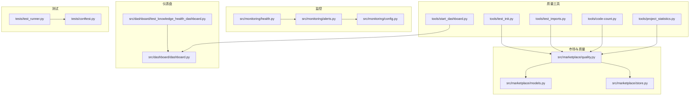
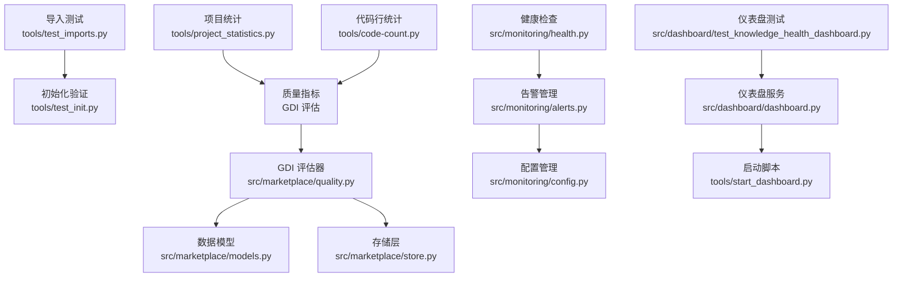
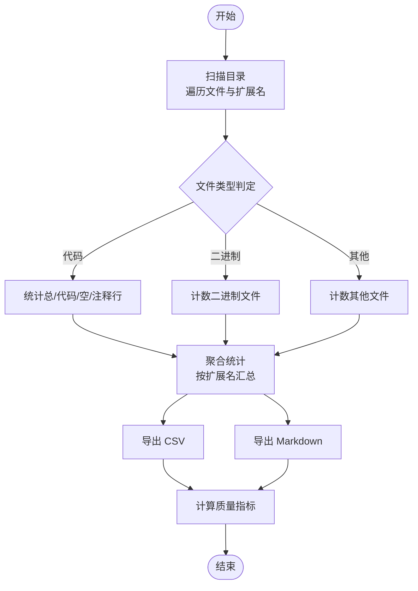
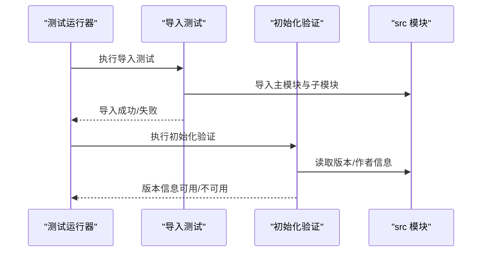
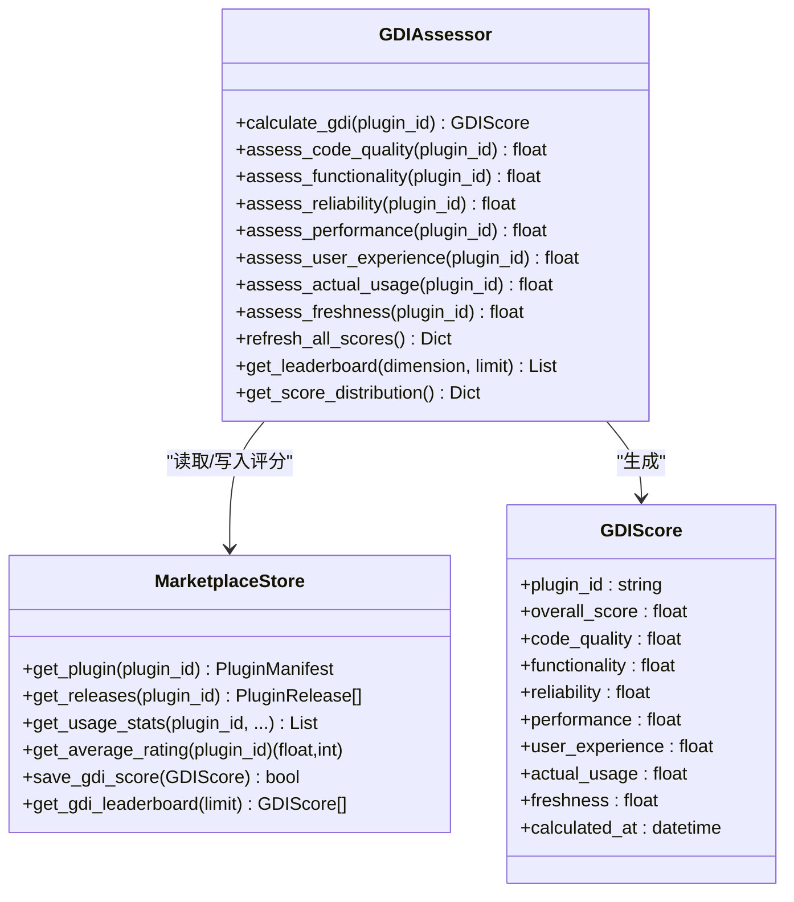
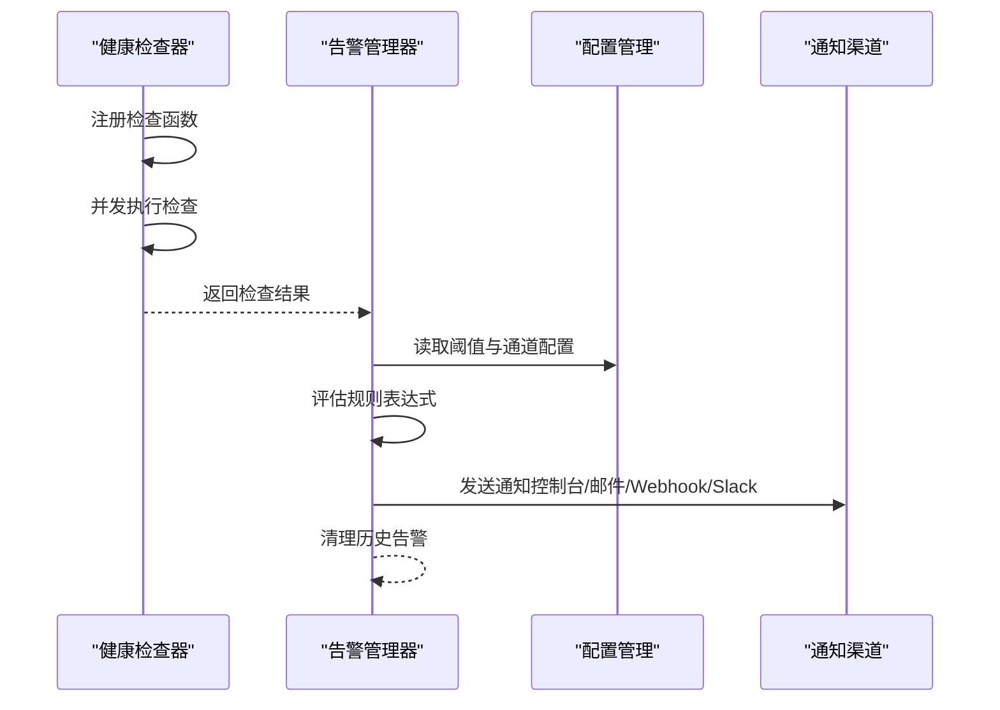
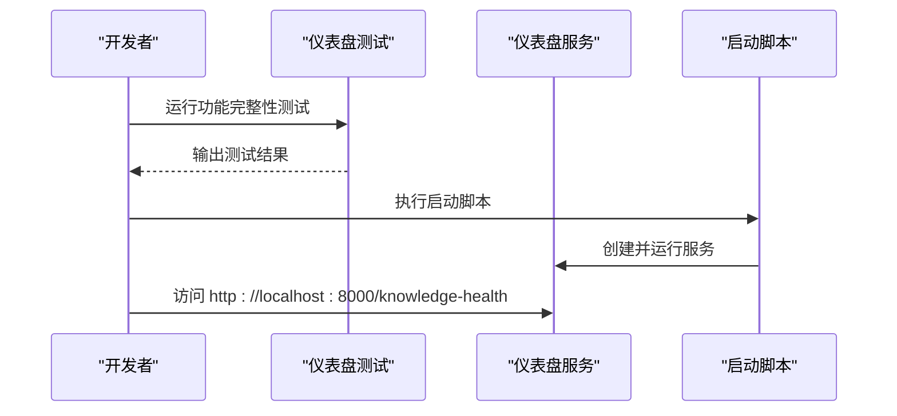
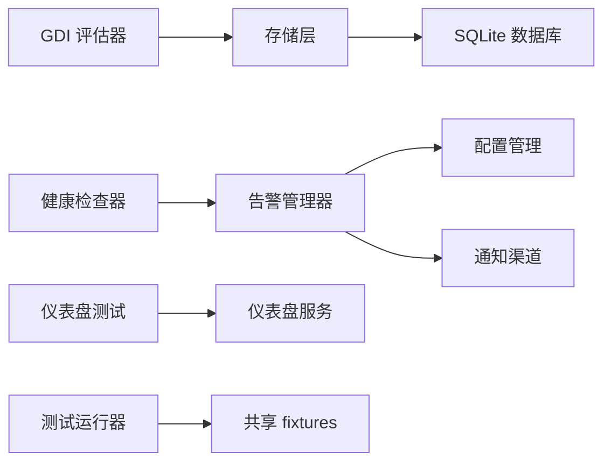

# 质量保证

<cite>
**本文引用的文件**
- [tools/project_statistics.py](file://tools/project_statistics.py)
- [tools/code-count.py](file://tools/code-count.py)
- [tools/test_imports.py](file://tools/test_imports.py)
- [tools/test_init.py](file://tools/test_init.py)
- [src/marketplace/quality.py](file://src/marketplace/quality.py)
- [src/marketplace/models.py](file://src/marketplace/models.py)
- [src/marketplace/store.py](file://src/marketplace/store.py)
- [src/monitoring/health.py](file://src/monitoring/health.py)
- [src/monitoring/alerts.py](file://src/monitoring/alerts.py)
- [src/monitoring/config.py](file://src/monitoring/config.py)
- [src/dashboard/test_knowledge_health_dashboard.py](file://src/dashboard/test_knowledge_health_dashboard.py)
- [src/dashboard/dashboard.py](file://src/dashboard/dashboard.py)
- [tools/start_dashboard.py](file://tools/start_dashboard.py)
- [tests/test_runner.py](file://tests/test_runner.py)
- [tests/conftest.py](file://tests/conftest.py)
</cite>

## 目录
1. [简介](#简介)
2. [项目结构](#项目结构)
3. [核心组件](#核心组件)
4. [架构总览](#架构总览)
5. [详细组件分析](#详细组件分析)
6. [依赖分析](#依赖分析)
7. [性能考虑](#性能考虑)
8. [故障排查指南](#故障排查指南)
9. [结论](#结论)
10. [附录](#附录)

## 简介
本文件面向 NecoRAG 的质量保证流程，系统化梳理并解释以下能力：
- 代码质量检查工具：导入测试、初始化验证、依赖完整性检查
- 项目统计分析：代码质量指标、技术债务评估、项目健康度监控
- 质量报告生成：HTML 报表、CSV 数据导出、可视化展示
- 质量门禁：阈值配置、违规检测、修复建议
- 质量改进策略与持续优化：自动化流程与监控告警机制

## 项目结构
围绕质量保证的关键目录与文件如下：
- tools：质量工具集合（项目统计、代码行统计、导入测试、仪表盘启动）
- src/marketplace：插件市场与质量评估（GDI 评分、数据模型、存储）
- src/monitoring：健康检查、告警、配置
- src/dashboard：知识健康仪表盘测试与启动
- tests：测试运行器与共享 fixtures

图表来源
- [tools/project_statistics.py:1-433](file://tools/project_statistics.py#L1-L433)
- [tools/code-count.py:1-413](file://tools/code-count.py#L1-L413)
- [tools/test_imports.py:1-64](file://tools/test_imports.py#L1-L64)
- [tools/test_init.py:1-26](file://tools/test_init.py#L1-L26)
- [src/marketplace/quality.py:1-756](file://src/marketplace/quality.py#L1-L756)
- [src/marketplace/models.py:1-756](file://src/marketplace/models.py#L1-L756)
- [src/marketplace/store.py:1-800](file://src/marketplace/store.py#L1-L800)
- [src/monitoring/health.py:1-300](file://src/monitoring/health.py#L1-L300)
- [src/monitoring/alerts.py:1-435](file://src/monitoring/alerts.py#L1-L435)
- [src/monitoring/config.py:1-117](file://src/monitoring/config.py#L1-L117)
- [src/dashboard/test_knowledge_health_dashboard.py:1-259](file://src/dashboard/test_knowledge_health_dashboard.py#L1-L259)
- [src/dashboard/dashboard.py:1-31](file://src/dashboard/dashboard.py#L1-L31)
- [tools/start_dashboard.py:1-56](file://tools/start_dashboard.py#L1-L56)
- [tests/test_runner.py:1-327](file://tests/test_runner.py#L1-L327)
- [tests/conftest.py:1-330](file://tests/conftest.py#L1-L330)

章节来源
- [tools/project_statistics.py:1-433](file://tools/project_statistics.py#L1-L433)
- [tools/code-count.py:1-413](file://tools/code-count.py#L1-L413)
- [tools/test_imports.py:1-64](file://tools/test_imports.py#L1-L64)
- [tools/test_init.py:1-26](file://tools/test_init.py#L1-L26)
- [src/marketplace/quality.py:1-756](file://src/marketplace/quality.py#L1-L756)
- [src/marketplace/models.py:1-756](file://src/marketplace/models.py#L1-L756)
- [src/marketplace/store.py:1-800](file://src/marketplace/store.py#L1-L800)
- [src/monitoring/health.py:1-300](file://src/monitoring/health.py#L1-L300)
- [src/monitoring/alerts.py:1-435](file://src/monitoring/alerts.py#L1-L435)
- [src/monitoring/config.py:1-117](file://src/monitoring/config.py#L1-L117)
- [src/dashboard/test_knowledge_health_dashboard.py:1-259](file://src/dashboard/test_knowledge_health_dashboard.py#L1-L259)
- [src/dashboard/dashboard.py:1-31](file://src/dashboard/dashboard.py#L1-L31)
- [tools/start_dashboard.py:1-56](file://tools/start_dashboard.py#L1-L56)
- [tests/test_runner.py:1-327](file://tests/test_runner.py#L1-L327)
- [tests/conftest.py:1-330](file://tests/conftest.py#L1-L330)

## 核心组件
- 项目统计与代码行统计：提供文件/行数统计、Markdown/CSV 导出、质量指标计算
- 导入测试与初始化验证：确保模块可导入、基础对象可实例化、版本信息可用
- 插件市场质量评估（GDI）：多维度评分（代码质量、功能完整性、可靠性、性能、用户体验、实际使用），支持排行榜与分布统计
- 健康检查与告警：异步健康检查、规则评估、多通道通知（控制台、邮件、Webhook、Slack）
- 仪表盘与可视化：知识健康仪表盘测试、启动脚本与服务端

章节来源
- [tools/project_statistics.py:16-433](file://tools/project_statistics.py#L16-L433)
- [tools/code-count.py:1-413](file://tools/code-count.py#L1-L413)
- [tools/test_imports.py:1-64](file://tools/test_imports.py#L1-L64)
- [tools/test_init.py:1-26](file://tools/test_init.py#L1-L26)
- [src/marketplace/quality.py:33-756](file://src/marketplace/quality.py#L33-L756)
- [src/monitoring/health.py:34-300](file://src/monitoring/health.py#L34-L300)
- [src/monitoring/alerts.py:237-435](file://src/monitoring/alerts.py#L237-L435)
- [src/dashboard/test_knowledge_health_dashboard.py:1-259](file://src/dashboard/test_knowledge_health_dashboard.py#L1-L259)

## 架构总览
质量保证体系由“工具层—评估层—监控层—展示层”构成，形成闭环：
- 工具层：统计与测试工具负责采集数据与验证基础能力
- 评估层：GDI 评分系统对插件进行多维度质量评估
- 监控层：健康检查与告警系统对运行态进行持续监控
- 展示层：仪表盘与报告输出可视化质量状况

图表来源
- [tools/test_imports.py:1-64](file://tools/test_imports.py#L1-L64)
- [tools/test_init.py:1-26](file://tools/test_init.py#L1-L26)
- [tools/project_statistics.py:1-433](file://tools/project_statistics.py#L1-L433)
- [tools/code-count.py:1-413](file://tools/code-count.py#L1-L413)
- [src/marketplace/quality.py:1-756](file://src/marketplace/quality.py#L1-L756)
- [src/marketplace/models.py:1-756](file://src/marketplace/models.py#L1-L756)
- [src/marketplace/store.py:1-800](file://src/marketplace/store.py#L1-L800)
- [src/monitoring/health.py:1-300](file://src/monitoring/health.py#L1-L300)
- [src/monitoring/alerts.py:1-435](file://src/monitoring/alerts.py#L1-L435)
- [src/monitoring/config.py:1-117](file://src/monitoring/config.py#L1-L117)
- [src/dashboard/test_knowledge_health_dashboard.py:1-259](file://src/dashboard/test_knowledge_health_dashboard.py#L1-L259)
- [src/dashboard/dashboard.py:1-31](file://src/dashboard/dashboard.py#L1-L31)
- [tools/start_dashboard.py:1-56](file://tools/start_dashboard.py#L1-L56)

## 详细组件分析

### 项目统计与代码行统计
- 功能要点
  - 扫描项目目录，区分代码/二进制/其他文件，统计总文件数、代码行数、空行、注释行
  - 按扩展名统计文件数量与行数，计算占比与平均每文件行数
  - 导出 CSV 与 Markdown 报告，包含质量指标（代码密度、文档化程度）
- 关键实现
  - 项目统计：[tools/project_statistics.py:16-433](file://tools/project_statistics.py#L16-L433)
  - 代码行统计：[tools/code-count.py:1-413](file://tools/code-count.py#L1-L413)

图表来源
- [tools/project_statistics.py:146-307](file://tools/project_statistics.py#L146-L307)
- [tools/code-count.py:121-189](file://tools/code-count.py#L121-L189)

章节来源
- [tools/project_statistics.py:16-433](file://tools/project_statistics.py#L16-L433)
- [tools/code-count.py:1-413](file://tools/code-count.py#L1-L413)

### 导入测试与初始化验证
- 功能要点
  - 验证主模块与子模块可导入，关键类可实例化
  - 校验初始化导出与版本信息
- 关键实现
  - 导入测试：[tools/test_imports.py:1-64](file://tools/test_imports.py#L1-L64)
  - 初始化验证：[tools/test_init.py:1-26](file://tools/test_init.py#L1-L26)

图表来源
- [tools/test_imports.py:7-42](file://tools/test_imports.py#L7-L42)
- [tools/test_init.py:6-26](file://tools/test_init.py#L6-L26)

章节来源
- [tools/test_imports.py:1-64](file://tools/test_imports.py#L1-L64)
- [tools/test_init.py:1-26](file://tools/test_init.py#L1-L26)

### 插件市场质量评估（GDI）
- 功能要点
  - 多维度评分：代码质量、功能完整性、可靠性、性能、用户体验、实际使用、新鲜度
  - 权重配置与综合评分计算
  - 排行榜、评分分布统计
  - 评分持久化与查询
- 关键实现
  - GDI 评估器：[src/marketplace/quality.py:33-756](file://src/marketplace/quality.py#L33-L756)
  - 数据模型：[src/marketplace/models.py:135-463](file://src/marketplace/models.py#L135-L463)
  - 存储层：[src/marketplace/store.py:41-800](file://src/marketplace/store.py#L41-L800)

图表来源
- [src/marketplace/quality.py:33-756](file://src/marketplace/quality.py#L33-L756)
- [src/marketplace/models.py:390-463](file://src/marketplace/models.py#L390-L463)
- [src/marketplace/store.py:1-800](file://src/marketplace/store.py#L1-L800)

章节来源
- [src/marketplace/quality.py:1-756](file://src/marketplace/quality.py#L1-L756)
- [src/marketplace/models.py:1-756](file://src/marketplace/models.py#L1-L756)
- [src/marketplace/store.py:1-800](file://src/marketplace/store.py#L1-L800)

### 健康检查与告警
- 功能要点
  - 健康检查器：注册检查函数、并发执行、历史记录、整体状态判定
  - 告警管理器：规则评估、表达式简化、多通道通知、历史保留
  - 配置管理：阈值、端口、路径、通知渠道等
- 关键实现
  - 健康检查：[src/monitoring/health.py:34-300](file://src/monitoring/health.py#L34-L300)
  - 告警管理：[src/monitoring/alerts.py:237-435](file://src/monitoring/alerts.py#L237-L435)
  - 配置管理：[src/monitoring/config.py:27-117](file://src/monitoring/config.py#L27-L117)

图表来源
- [src/monitoring/health.py:107-184](file://src/monitoring/health.py#L107-L184)
- [src/monitoring/alerts.py:291-344](file://src/monitoring/alerts.py#L291-L344)
- [src/monitoring/config.py:66-117](file://src/monitoring/config.py#L66-L117)

章节来源
- [src/monitoring/health.py:1-300](file://src/monitoring/health.py#L1-L300)
- [src/monitoring/alerts.py:1-435](file://src/monitoring/alerts.py#L1-L435)
- [src/monitoring/config.py:1-117](file://src/monitoring/config.py#L1-L117)

### 仪表盘与可视化
- 功能要点
  - 知识健康仪表盘功能完整性测试：HTML 结构、API 端点、响应式设计
  - 仪表盘服务启动与访问
- 关键实现
  - 仪表盘测试：[src/dashboard/test_knowledge_health_dashboard.py:1-259](file://src/dashboard/test_knowledge_health_dashboard.py#L1-L259)
  - 仪表盘服务：[src/dashboard/dashboard.py:1-31](file://src/dashboard/dashboard.py#L1-L31)
  - 启动脚本：[tools/start_dashboard.py:1-56](file://tools/start_dashboard.py#L1-L56)

图表来源
- [src/dashboard/test_knowledge_health_dashboard.py:216-259](file://src/dashboard/test_knowledge_health_dashboard.py#L216-L259)
- [src/dashboard/dashboard.py:10-27](file://src/dashboard/dashboard.py#L10-L27)
- [tools/start_dashboard.py:16-51](file://tools/start_dashboard.py#L16-L51)

章节来源
- [src/dashboard/test_knowledge_health_dashboard.py:1-259](file://src/dashboard/test_knowledge_health_dashboard.py#L1-L259)
- [src/dashboard/dashboard.py:1-31](file://src/dashboard/dashboard.py#L1-L31)
- [tools/start_dashboard.py:1-56](file://tools/start_dashboard.py#L1-L56)

### 测试运行与报告
- 功能要点
  - 测试运行器：执行测试套件、统计结果、生成文本/JSON/JUnit XML 报告
  - 共享 fixtures：配置、Mock、样本数据
- 关键实现
  - 测试运行器：[tests/test_runner.py:16-327](file://tests/test_runner.py#L16-L327)
  - 共享 fixtures：[tests/conftest.py:1-330](file://tests/conftest.py#L1-L330)

章节来源
- [tests/test_runner.py:1-327](file://tests/test_runner.py#L1-L327)
- [tests/conftest.py:1-330](file://tests/conftest.py#L1-L330)

## 依赖分析
- 组件耦合
  - GDI 评估器依赖存储层以读取插件、发布、使用统计与评分数据
  - 健康检查器与告警管理器相互配合，健康状态可作为告警规则输入
  - 仪表盘测试依赖仪表盘服务与静态资源
- 外部依赖
  - SQLite 存储（插件市场）
  - 异步 HTTP 客户端（通知渠道）
  - 配置环境变量（监控阈值与通道）

图表来源
- [src/marketplace/quality.py:67-116](file://src/marketplace/quality.py#L67-L116)
- [src/marketplace/store.py:1-800](file://src/marketplace/store.py#L1-L800)
- [src/monitoring/health.py:107-184](file://src/monitoring/health.py#L107-L184)
- [src/monitoring/alerts.py:291-344](file://src/monitoring/alerts.py#L291-L344)
- [src/monitoring/config.py:66-117](file://src/monitoring/config.py#L66-L117)
- [src/dashboard/test_knowledge_health_dashboard.py:140-182](file://src/dashboard/test_knowledge_health_dashboard.py#L140-L182)
- [src/dashboard/dashboard.py:10-27](file://src/dashboard/dashboard.py#L10-L27)
- [tests/test_runner.py:16-92](file://tests/test_runner.py#L16-L92)
- [tests/conftest.py:12-81](file://tests/conftest.py#L12-L81)

章节来源
- [src/marketplace/quality.py:1-756](file://src/marketplace/quality.py#L1-L756)
- [src/marketplace/store.py:1-800](file://src/marketplace/store.py#L1-L800)
- [src/monitoring/health.py:1-300](file://src/monitoring/health.py#L1-L300)
- [src/monitoring/alerts.py:1-435](file://src/monitoring/alerts.py#L1-L435)
- [src/monitoring/config.py:1-117](file://src/monitoring/config.py#L1-L117)
- [src/dashboard/test_knowledge_health_dashboard.py:1-259](file://src/dashboard/test_knowledge_health_dashboard.py#L1-L259)
- [src/dashboard/dashboard.py:1-31](file://src/dashboard/dashboard.py#L1-L31)
- [tests/test_runner.py:1-327](file://tests/test_runner.py#L1-L327)
- [tests/conftest.py:1-330](file://tests/conftest.py#L1-L330)

## 性能考虑
- 统计与评估
  - 项目统计采用单次遍历与字典聚合，时间复杂度 O(N)，适合大型仓库
  - GDI 评估器对每个插件独立计算，批量刷新时注意数据库连接池与事务开销
- 健康检查与告警
  - 健康检查并发执行，避免阻塞；注意检查函数的超时与异常处理
  - 告警规则表达式简化实现，建议结合阈值配置与日志采样，减少误报
- 仪表盘
  - 响应式设计与静态资源缓存，降低前端渲染压力

## 故障排查指南
- 导入测试失败
  - 检查模块路径与 __init__.py 导出是否正确
  - 确认依赖安装与 Python 版本满足要求
- 项目统计异常
  - 检查忽略模式与编码错误处理
  - 确认目标目录存在且具备读取权限
- GDI 评分为空或异常
  - 核对存储层连接与表结构
  - 检查插件是否存在、发布记录与使用统计是否完整
- 健康检查未触发告警
  - 检查配置阈值与评估表达式
  - 确认通知渠道可用（SMTP、Webhook、Slack）
- 仪表盘页面空白
  - 检查静态资源路径与服务端路由
  - 确认启动参数与端口占用情况

章节来源
- [tools/test_imports.py:1-64](file://tools/test_imports.py#L1-L64)
- [tools/project_statistics.py:83-89](file://tools/project_statistics.py#L83-L89)
- [src/marketplace/store.py:51-86](file://src/marketplace/store.py#L51-L86)
- [src/monitoring/alerts.py:374-382](file://src/monitoring/alerts.py#L374-L382)
- [src/dashboard/test_knowledge_health_dashboard.py:140-182](file://src/dashboard/test_knowledge_health_dashboard.py#L140-L182)

## 结论
NecoRAG 的质量保证体系通过“工具采集—评估打分—监控告警—可视化展示”的闭环，实现了对项目规模、模块导入、插件质量与运行状态的全面把控。建议在 CI/CD 中集成导入测试、项目统计与 GDI 评估，并结合健康检查与告警阈值，形成可量化的质量门禁与持续优化机制。

## 附录
- 质量门禁建议
  - 导入测试：必须通过
  - 代码密度：≥ 某阈值（如 50%）
  - 注释密度：≥ 某阈值（如 20%）
  - GDI 综合分：≥ 某阈值（如 70）
  - 健康状态：必须为健康或降级（降级需限时修复）
- 自动化流程
  - CI 阶段：导入测试 → 代码行统计 → GDI 评估 → 健康检查 → 仪表盘可用性测试
  - 告警策略：CPU/内存/磁盘阈值、健康状态异常、性能相关错误事件
- 可视化与报告
  - 项目统计：CSV/Markdown 报告
  - GDI 排行榜与分布：仪表盘展示
  - 告警历史：按小时/天聚合统计