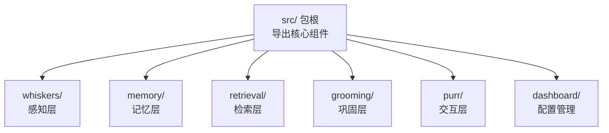
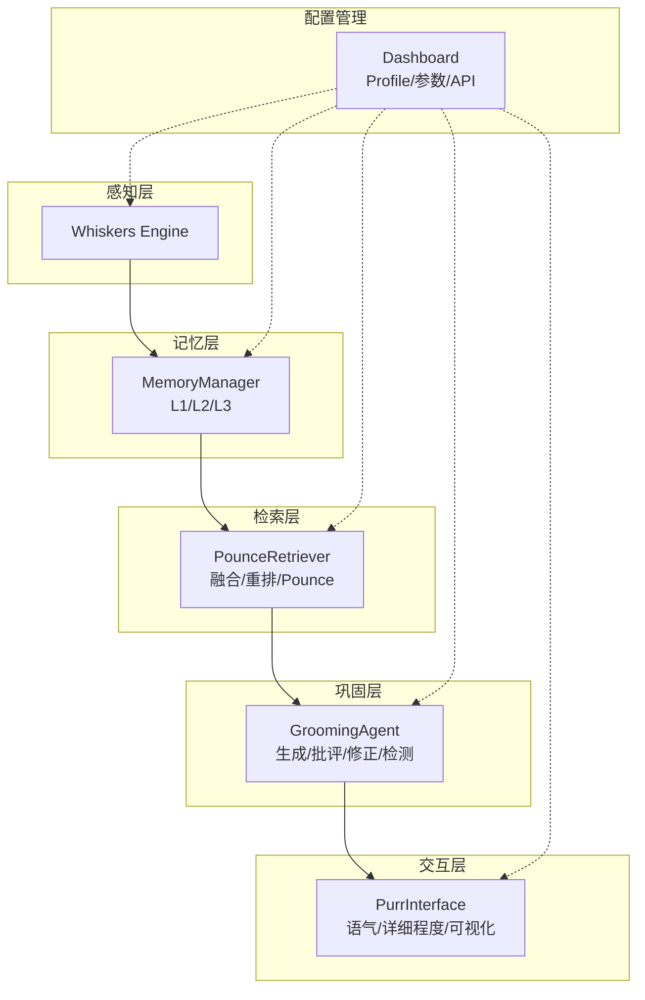
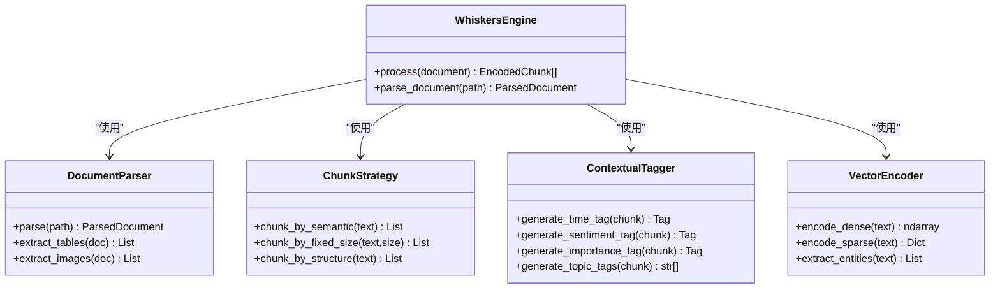
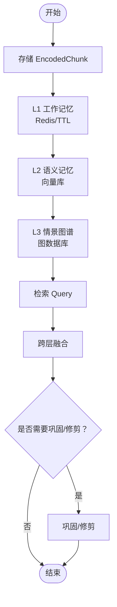
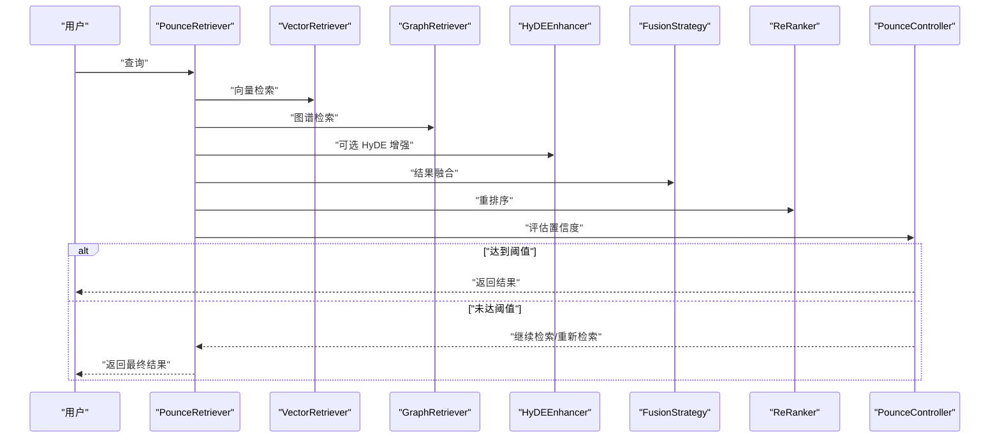
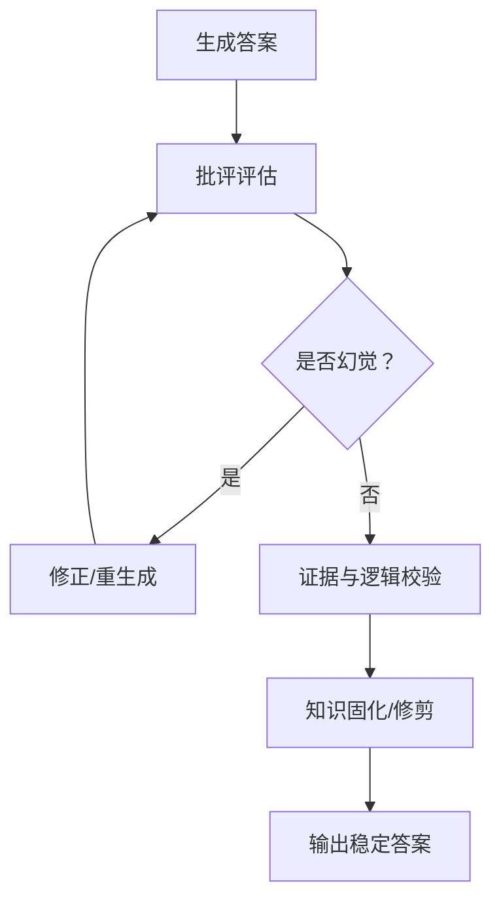
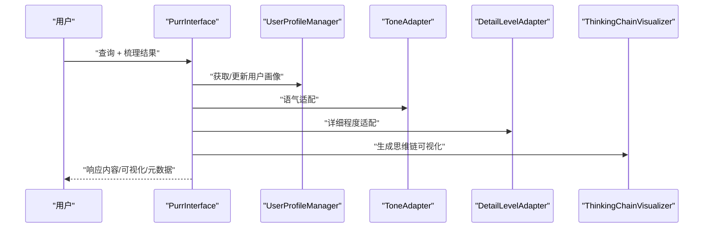
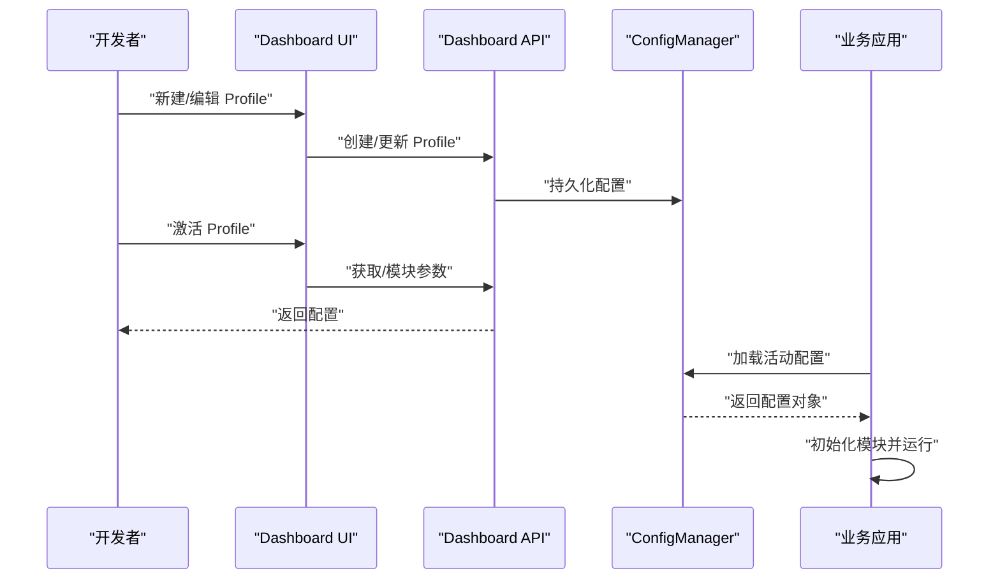
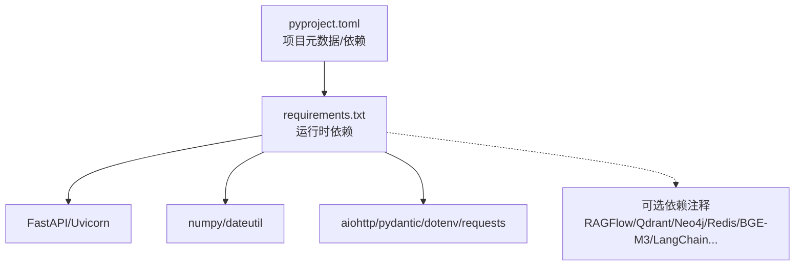

# 开发者指南

<cite>
**本文引用的文件**   
- [CONTRIBUTING.md](file://CONTRIBUTING.md)
- [QUICKSTART.md](file://QUICKSTART.md)
- [PROJECT_COMPLETE.md](file://PROJECT_COMPLETE.md)
- [DASHBOARD_GUIDE.md](file://DASHBOARD_GUIDE.md)
- [pyproject.toml](file://pyproject.toml)
- [requirements.txt](file://requirements.txt)
- [src/__init__.py](file://src/__init__.py)
- [src/whiskers/README.md](file://src/whiskers/README.md)
- [src/memory/README.md](file://src/memory/README.md)
- [src/retrieval/README.md](file://src/retrieval/README.md)
- [src/purr/README.md](file://src/purr/README.md)
- [src/dashboard/README.md](file://src/dashboard/README.md)
</cite>

## 目录
1. [简介](#简介)
2. [项目结构](#项目结构)
3. [核心组件](#核心组件)
4. [架构总览](#架构总览)
5. [详细组件分析](#详细组件分析)
6. [依赖分析](#依赖分析)
7. [性能考量](#性能考量)
8. [故障排除指南](#故障排除指南)
9. [结论](#结论)
10. [附录](#附录)

## 简介
本指南面向希望参与 NecoRAG 项目开发的工程师，覆盖贡献流程、开发环境搭建、测试与调试策略、代码结构与设计模式、扩展与插件机制、第三方集成方法、性能优化技巧、故障排除以及架构决策与未来规划。读者无需深入掌握所有模块即可上手，指南同时提供分层次的技术解读与可视化图示，帮助快速定位实现位置与扩展点。

## 项目结构
项目采用“五层架构”模块化组织，核心包位于 src/，包含感知层（Whiskers）、记忆层（Memory）、检索层（Retrieval）、巩固层（Grooming）、交互层（Purr），以及配置管理（Dashboard）。顶层入口导出各模块主类，便于直接按需导入。

**图表来源**
- [src/__init__.py:10-25](file://src/__init__.py#L10-L25)

**章节来源**
- [src/__init__.py:1-26](file://src/__init__.py#L1-L26)
- [PROJECT_COMPLETE.md:43-138](file://PROJECT_COMPLETE.md#L43-L138)

## 核心组件
- 感知层（Whiskers Engine）：文档解析、分块策略、情境标签生成、向量编码。
- 记忆层（Nine-Lives Memory）：L1 工作记忆（Redis）、L2 语义记忆（向量库）、L3 情景图谱（图数据库）、记忆衰减与巩固。
- 检索层（Pounce Strategy）：混合检索（向量/关键词/图谱/HyDE）、结果融合、新颖性重排序、Pounce 机制。
- 巩固层（Grooming Agent）：生成-批评-修正闭环、幻觉检测、知识固化与修剪。
- 交互层（Purr Interface）：用户画像、语气与详细程度适配、思维链可视化、多模态输出。
- 配置管理（Dashboard）：Web UI、REST API、Profile 管理、参数持久化与导入导出。

**章节来源**
- [src/whiskers/README.md:1-158](file://src/whiskers/README.md#L1-L158)
- [src/memory/README.md:1-244](file://src/memory/README.md#L1-L244)
- [src/retrieval/README.md:1-352](file://src/retrieval/README.md#L1-L352)
- [src/purr/README.md:1-398](file://src/purr/README.md#L1-L398)
- [src/dashboard/README.md:1-417](file://src/dashboard/README.md#L1-L417)

## 架构总览
五层架构从感知到交互形成闭环：感知层将多模态数据编码并打标；记忆层分层存储与管理；检索层进行多路并行检索与智能终止；巩固层对答案进行生成-评估-修正与幻觉检测；交互层根据用户画像与情境自适应输出，并可视化思维链。

**图表来源**
- [src/whiskers/README.md:31-55](file://src/whiskers/README.md#L31-L55)
- [src/memory/README.md:11-39](file://src/memory/README.md#L11-L39)
- [src/retrieval/README.md:11-41](file://src/retrieval/README.md#L11-L41)
- [src/purr/README.md:11-46](file://src/purr/README.md#L11-L46)
- [src/dashboard/README.md:11-36](file://src/dashboard/README.md#L11-L36)

## 详细组件分析

### 感知层（Whiskers Engine）
- 职责：文档解析、分块、情境标签、向量编码。
- 关键类与职责：
  - DocumentParser：统一解析多格式文档。
  - ChunkStrategy：支持语义/固定/结构化分块。
  - ContextualTagger：为每个 Chunk 打时间/情感/重要性/主题标签。
  - VectorEncoder：生成稠密/稀疏向量与实体三元组。
- 使用示例与参数：参考模块 README 的示例与参数表格。

**图表来源**
- [src/whiskers/README.md:59-98](file://src/whiskers/README.md#L59-L98)

**章节来源**
- [src/whiskers/README.md:1-158](file://src/whiskers/README.md#L1-L158)

### 记忆层（Nine-Lives Memory）
- 职责：三层记忆协同、动态权重衰减、主动遗忘与巩固。
- 关键类与职责：
  - MemoryManager：统一管理 L1/L2/L3，提供存储/检索/巩固/遗忘。
  - WorkingMemory（L1）：Redis 缓存层，TTL 管理。
  - SemanticMemory（L2）：向量库（如 Qdrant/Milvus）。
  - EpisodicGraph（L3）：图数据库（如 Neo4j/NebulaGraph）。
  - MemoryDecay：权重衰减与归档。
- 数据流：入库（L1→L2→L3）→检索（L1→L2→L3 融合）→巩固（高频→持久化，关联→图谱连接，低频→归档）。

**图表来源**
- [src/memory/README.md:182-192](file://src/memory/README.md#L182-L192)

**章节来源**
- [src/memory/README.md:1-244](file://src/memory/README.md#L1-L244)

### 检索层（Pounce Strategy）
- 职责：混合检索、HyDE 增强、新颖性重排序、Pounce 智能终止。
- 关键类与职责：
  - VectorRetriever/GraphRetriever：向量与图谱检索。
  - HyDEEnhancer：假设文档嵌入增强。
  - ReRanker：BGE-Reranker 精排与新颖性/多样性调整。
  - PounceController：置信度评估与终止判断。
  - FusionStrategy：RRF/加权融合。
- 检索流程：查询预处理→多路并行检索→融合→重排→Pounce 判断。

**图表来源**
- [src/retrieval/README.md:261-287](file://src/retrieval/README.md#L261-L287)

**章节来源**
- [src/retrieval/README.md:1-352](file://src/retrieval/README.md#L1-L352)

### 巩固层（Grooming Agent）
- 职责：生成-批评-修正闭环、幻觉检测、知识固化与修剪。
- 关键类与职责：
  - Generator/Critic/Refiner：生成答案、评估与修正。
  - HallucinationDetector：事实一致性/证据支撑度/逻辑连贯性。
  - KnowledgeConsolidator/MemoryPruner：知识固化与噪声修剪。
- 处理流程：生成→批评→修正→幻觉检测→固化/修剪。

**图表来源**
- [src/retrieval/README.md:304-310](file://src/retrieval/README.md#L304-L310)

**章节来源**
- [src/retrieval/README.md:304-310](file://src/retrieval/README.md#L304-L310)

### 交互层（Purr Interface）
- 职责：情境自适应生成、思维链可视化、多模态输出。
- 关键类与职责：
  - PurrInterface：主接口，接收梳理结果并生成响应。
  - UserProfileManager：用户画像管理。
  - ToneAdapter/DetailLevelAdapter：语气与详细程度适配。
  - ThinkingChainVisualizer：检索路径、证据来源、推理过程可视化。
- 交互流程：接收查询与梳理结果→获取/创建用户画像→语气与详细程度适配→多模态合成→生成思维链可视化→返回响应。

**图表来源**
- [src/purr/README.md:324-345](file://src/purr/README.md#L324-L345)

**章节来源**
- [src/purr/README.md:1-398](file://src/purr/README.md#L1-L398)

### 配置管理（Dashboard）
- 职责：Profile 管理、模块参数配置、统计监控、API 文档。
- 关键能力：
  - Web UI：Profile 列表、参数编辑器、活动切换、统计面板。
  - REST API：Profile CRUD、模块参数管理、统计信息、导入导出。
  - 配置持久化：JSON 文件存储，支持导入导出与多环境管理。
- 启动方式：命令行、Python 模块方式、在应用中集成。

**图表来源**
- [src/dashboard/README.md:86-203](file://src/dashboard/README.md#L86-L203)

**章节来源**
- [src/dashboard/README.md:1-417](file://src/dashboard/README.md#L1-L417)

## 依赖分析
- 项目元数据与打包：pyproject.toml 定义了项目元信息、许可证、关键字、分类器、依赖与可选开发依赖。
- 运行时依赖：requirements.txt 定义了核心库（numpy、dateutil）与 Dashboard（FastAPI、Uvicorn、Pydantic）等依赖。
- 可选依赖：文档解析（RAGFlow）、向量库（Qdrant/Milvus）、图库（Neo4j/NebulaGraph）、缓存（Redis）、嵌入模型（BGE-M3 等）、LLM（LangChain/LangGraph/OpenAI/Anthropic）、NLP 工具（spaCy/transformers）等，均以注释形式预留，便于按需集成。

**图表来源**
- [pyproject.toml:5-31](file://pyproject.toml#L5-L31)
- [requirements.txt:3-57](file://requirements.txt#L3-L57)

**章节来源**
- [pyproject.toml:1-59](file://pyproject.toml#L1-L59)
- [requirements.txt:1-57](file://requirements.txt#L1-L57)

## 性能考量
- 导入时间：< 2 秒；基础操作：< 100ms；Dashboard 启动：< 5 秒。
- 记忆层性能目标（示例）：L1 写入/检索延迟极低；L2 向量检索毫秒级；L3 图谱检索可达百毫秒级。
- 检索层性能目标：简单查询延迟 < 200ms；复杂查询延迟 < 800ms；Recall@10 > 85%，NDCG@10 > 0.8。
- 交互层性能目标：响应延迟 < 200ms；用户满意度、风格匹配度、可解释性评分均有明确目标。
- 优化建议：
  - 选择合适分块大小（512-1024 字符）与 top_k。
  - 调整 Pounce 阈值（0.85-0.90）与记忆衰减参数。
  - 合理使用 HyDE 与重排序模型，平衡准确率与延迟。
  - 使用缓存与批量操作，减少 I/O 与 API 调用开销。

**章节来源**
- [CONTRIBUTING.md:147-154](file://CONTRIBUTING.md#L147-L154)
- [src/memory/README.md:223-230](file://src/memory/README.md#L223-L230)
- [src/retrieval/README.md:329-337](file://src/retrieval/README.md#L329-L337)
- [src/purr/README.md:376-384](file://src/purr/README.md#L376-L384)

## 故障排除指南
- Dashboard 启动失败：检查端口占用，更换端口或关闭占用进程。
- 配置保存失败：检查配置目录写权限，或更换目录。
- API 返回 404：确认 Profile ID 存在，先获取列表再使用。
- 导入测试失败：确保依赖安装正确，运行导入测试脚本验证模块导入。
- Dashboard 无法访问：检查防火墙与端口开放情况。

**章节来源**
- [DASHBOARD_GUIDE.md:281-305](file://DASHBOARD_GUIDE.md#L281-L305)
- [QUICKSTART.md:237-277](file://QUICKSTART.md#L237-L277)

## 结论
NecoRAG 以“五层架构”实现从感知到交互的认知闭环，模块间职责清晰、耦合度低、扩展性强。通过 Dashboard 实现参数与配置的可视化管理，结合可解释性输出与情境自适应交互，既满足工程落地需求，也为后续集成真实组件与生态建设奠定基础。建议开发者遵循贡献规范、关注性能目标、按需引入可选依赖，并利用可视化图示与模块 README 快速定位实现与扩展点。

## 附录

### 贡献与开发流程
- 环境准备：克隆仓库、创建虚拟环境、安装依赖、运行导入测试。
- 代码规范：PEP 8、类型注解、中文文档字符串、语义化提交。
- 提交流程：特性分支、提交更改、推送 Fork、创建 PR、等待审核。
- 测试：导入测试、完整示例、Dashboard 启动测试。

**章节来源**
- [CONTRIBUTING.md:18-179](file://CONTRIBUTING.md#L18-L179)
- [QUICKSTART.md:5-61](file://QUICKSTART.md#L5-L61)

### 快速开始与最小工作示例
- 安装依赖、运行导入测试、执行完整示例、启动 Dashboard。
- 最小工作示例：初始化感知/记忆/检索模块，处理文本、存储知识、检索并查看结果。

**章节来源**
- [QUICKSTART.md:5-110](file://QUICKSTART.md#L5-L110)

### 架构决策与未来规划
- 技术选型：FastAPI/Web 框架、向量库/图库/缓存等可插拔组件。
- 设计原则：模块化、可扩展、可解释、高效。
- 发展规划：Phase 1 完成五层框架；Phase 2 集成真实组件（BGE-M3、Qdrant、Neo4j、RAGFlow、Redis、LangGraph）；Phase 3 异步固化、可视化调试面板、插件市场与社区生态。

**章节来源**
- [CONTRIBUTING.md:140-163](file://CONTRIBUTING.md#L140-L163)
- [PROJECT_COMPLETE.md:325-351](file://PROJECT_COMPLETE.md#L325-L351)