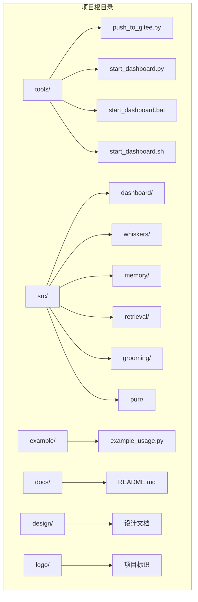
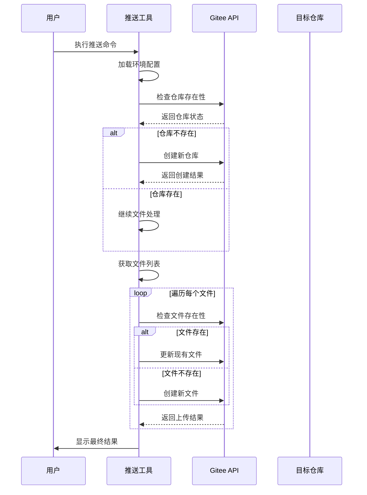
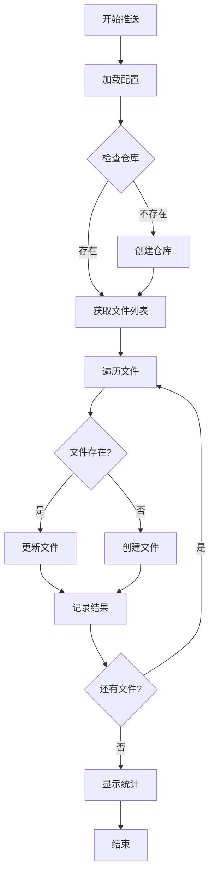
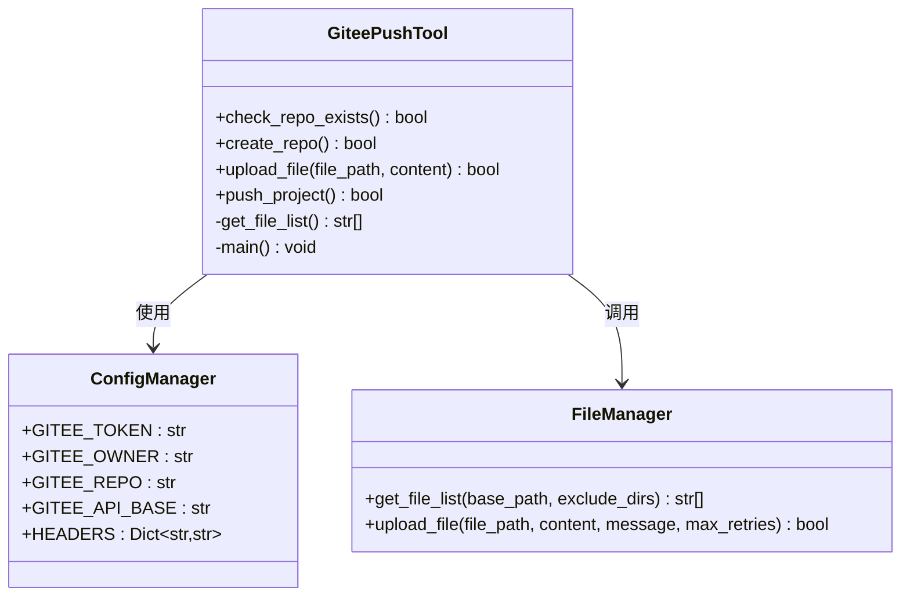
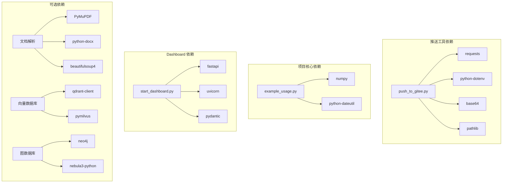

# Gitee 推送工具使用指南

<cite>
**本文档中引用的文件**
- [GITEE_PUSH_GUIDE.md](file://GITEE_PUSH_GUIDE.md)
- [push_to_gitee.py](file://tools/push_to_gitee.py)
- [requirements.txt](file://requirements.txt)
- [example_usage.py](file://example/example_usage.py)
- [start_dashboard.py](file://tools/start_dashboard.py)
- [QUICKSTART.md](file://QUICKSTART.md)
- [DASHBOARD_GUIDE.md](file://DASHBOARD_GUIDE.md)
- [CONTRIBUTING.md](file://CONTRIBUTING.md)
- [pyproject.toml](file://pyproject.toml)
</cite>

## 目录
1. [简介](#简介)
2. [项目结构](#项目结构)
3. [核心组件](#核心组件)
4. [架构概览](#架构概览)
5. [详细组件分析](#详细组件分析)
6. [依赖关系分析](#依赖关系分析)
7. [性能考虑](#性能考虑)
8. [故障排除指南](#故障排除指南)
9. [结论](#结论)
10. [附录](#附录)

## 简介

NecoRAG 是一个神经认知检索增强生成框架，该项目包含一个专门的 Gitee 推送工具，用于自动化将项目代码推送到 Gitee 平台。该工具提供了完整的项目推送解决方案，包括仓库管理、文件上传、错误处理和进度跟踪等功能。

本指南将详细介绍 Gitee 推送工具的配置、使用方法、技术实现和最佳实践，帮助开发者高效地管理项目版本和协作开发。

## 项目结构

NecoRAG 项目采用模块化的组织结构，主要包含以下关键目录：



**图表来源**
- [push_to_gitee.py](file://tools/push_to_gitee.py)
- [start_dashboard.py](file://tools/start_dashboard.py)
- [example_usage.py](file://example/example_usage.py)

**章节来源**
- [push_to_gitee.py](file://tools/push_to_gitee.py)
- [start_dashboard.py](file://tools/start_dashboard.py)
- [example_usage.py](file://example/example_usage.py)

## 核心组件

### Gitee 推送工具

Gitee 推送工具是一个完整的自动化脚本，具备以下核心功能：

#### 主要特性
- **自动仓库检测**：智能检查目标仓库是否存在，不存在时自动创建
- **智能文件上传**：支持新增和更新文件操作
- **目录结构保持**：完整保留项目原有的目录层次结构
- **错误重试机制**：网络问题时自动重试，提高成功率
- **进度显示**：实时显示上传进度和结果统计

#### 配置管理
工具使用环境变量进行配置，支持以下关键参数：
- `GITEE_TOKEN`：Gitee 访问令牌
- `GITEE_OWNER`：仓库拥有者用户名
- `GITEE_REPO`：目标仓库名称
- `GITEE_API_BASE`：Gitee API 基础地址

**章节来源**
- [GITEE_PUSH_GUIDE.md](file://GITEE_PUSH_GUIDE.md)
- [push_to_gitee.py](file://tools/push_to_gitee.py)

### 依赖管理系统

项目使用 `requirements.txt` 文件管理所有依赖项，包括核心库和可选组件：

#### 核心依赖
- **numpy>=1.24.0**：数值计算基础库
- **python-dateutil>=2.8.0**：日期时间处理
- **requests>=2.31.0**：HTTP 请求库（推送工具必需）
- **python-dotenv>=1.0.0**：环境变量管理（推送工具必需）

#### 可选依赖
项目还提供了丰富的可选依赖，用于不同的功能模块：
- **文档解析**：PyMuPDF、python-docx、beautifulsoup4
- **向量数据库**：qdrant-client、pymilvus
- **图数据库**：neo4j、nebula3-python
- **缓存系统**：redis
- **嵌入模型**：FlagEmbedding、sentence-transformers
- **LLM 集成**：langchain、langgraph、openai、anthropic

**章节来源**
- [requirements.txt](file://requirements.txt)
- [push_to_gitee.py](file://tools/push_to_gitee.py)

## 架构概览

Gitee 推送工具采用简洁高效的架构设计，主要包含以下几个核心组件：



**图表来源**
- [push_to_gitee.py](file://tools/push_to_gitee.py)

### 数据流架构



**图表来源**
- [push_to_gitee.py](file://tools/push_to_gitee.py)

## 详细组件分析

### 推送工具核心功能

#### 仓库管理功能

推送工具实现了完整的仓库生命周期管理：



**图表来源**
- [push_to_gitee.py](file://tools/push_to_gitee.py)

#### 文件处理机制

工具采用智能的文件处理策略，确保数据完整性和传输效率：

1. **文件扫描**：递归扫描项目目录，跳过指定的排除目录
2. **内容编码**：使用 Base64 编码确保二进制文件正确传输
3. **冲突解决**：自动检测文件存在性，选择创建或更新操作
4. **错误恢复**：实现重试机制处理网络异常

**章节来源**
- [push_to_gitee.py](file://tools/push_to_gitee.py)

### 配置管理

#### 环境变量配置

推送工具使用标准化的环境变量配置方式：

| 配置项 | 默认值 | 用途 | 必需性 |
|--------|--------|------|--------|
| GITEE_TOKEN | 无 | Gitee 访问令牌 | 必需 |
| GITEE_OWNER | qijie2026 | 仓库拥有者 | 可选 |
| GITEE_REPO | necorag | 目标仓库名 | 可选 |
| GITEE_API_BASE | https://gitee.com/api/v5 | API 基础地址 | 可选 |

#### 配置文件安全

项目通过 `.gitignore` 文件保护敏感配置信息，防止意外提交：

```gitignore
.env
*.env
config.json
```

**章节来源**
- [GITEE_PUSH_GUIDE.md](file://GITEE_PUSH_GUIDE.md)
- [push_to_gitee.py](file://tools/push_to_gitee.py)

## 依赖关系分析

### 核心依赖关系



**图表来源**
- [requirements.txt](file://requirements.txt)
- [push_to_gitee.py](file://tools/push_to_gitee.py)
- [start_dashboard.py](file://tools/start_dashboard.py)
- [example_usage.py](file://example/example_usage.py)

### 依赖版本兼容性

项目严格管理依赖版本，确保兼容性和稳定性：

- **Python 版本要求**：3.9+
- **核心库版本**：numpy>=1.24.0, python-dateutil>=2.8.0
- **Web 框架**：fastapi>=0.109.0, uvicorn[standard]>=0.27.0
- **配置管理**：pydantic>=2.5.0, python-dotenv>=1.0.0

**章节来源**
- [requirements.txt](file://requirements.txt)
- [pyproject.toml](file://pyproject.toml)

## 性能考虑

### 传输优化

推送工具在设计时充分考虑了性能优化：

1. **批量处理**：按文件顺序处理，避免内存峰值
2. **智能重试**：针对 500 错误实现指数退避重试
3. **进度反馈**：实时显示处理进度，提升用户体验
4. **错误隔离**：单个文件失败不影响整体进程

### 资源管理

- **内存使用**：逐文件处理，避免大文件内存溢出
- **网络连接**：合理设置超时时间，避免长时间阻塞
- **并发控制**：单线程处理，确保 Gitee API 兼容性

## 故障排除指南

### 常见问题及解决方案

#### 认证问题

| 错误代码 | 错误原因 | 解决方案 |
|----------|----------|----------|
| 401 Unauthorized | Token 无效或过期 | 检查 `.env` 文件中的 GITEE_TOKEN |
| 403 Forbidden | 权限不足 | 确认 Token 具有仓库管理权限 |
| 404 Not Found | 仓库不存在 | 确认 GITEE_OWNER 和 GITEE_REPO 配置 |

#### 网络问题

| 问题类型 | 解决方案 |
|----------|----------|
| 超时错误 | 检查网络连接，增加重试次数 |
| 连接失败 | 验证 GITEE_API_BASE 地址 |
| 500 服务器错误 | 稍后重试，检查 Gitee 服务状态 |

#### 文件处理问题

| 问题类型 | 解决方案 |
|----------|----------|
| 空文件错误 | 检查文件内容，避免上传空文件 |
| 大文件限制 | 使用 Git 命令行推送大文件 |
| 编码问题 | 确保文件使用 UTF-8 编码 |

**章节来源**
- [GITEE_PUSH_GUIDE.md](file://GITEE_PUSH_GUIDE.md)
- [push_to_gitee.py](file://tools/push_to_gitee.py)

### 调试和验证

#### 手动验证命令

```bash
# 验证 Token 有效性
python -c "import requests; from dotenv import load_dotenv; import os; load_dotenv(); token=os.getenv('GITEE_TOKEN'); r=requests.get('https://gitee.com/api/v5/user', headers={'Authorization': f'token {token}'}); print(f'Status: {r.status_code}')"

# 检查仓库状态
python -c "import requests; from dotenv import load_dotenv; import os; load_dotenv(); token=os.getenv('GITEE_TOKEN'); r=requests.get('https://gitee.com/api/v5/repos/qijie2026/NecoRAG', headers={'Authorization': f'token {token}'}); print(f'Repo exists: {r.status_code == 200}')"
```

#### 日志和诊断

推送工具提供详细的日志输出，包括：
- 文件处理进度
- API 调用结果
- 错误信息和重试次数
- 最终统计报告

**章节来源**
- [GITEE_PUSH_GUIDE.md](file://GITEE_PUSH_GUIDE.md)

## 结论

NecoRAG 的 Gitee 推送工具提供了一个完整、可靠的项目自动化推送解决方案。通过智能的仓库管理、高效的文件处理和完善的错误处理机制，该工具能够满足大多数项目的版本管理需求。

### 主要优势

1. **易用性强**：简单的命令行接口，无需复杂的配置
2. **可靠性高**：完善的错误处理和重试机制
3. **安全性好**：环境变量管理敏感信息
4. **扩展性佳**：模块化设计，易于维护和扩展

### 最佳实践建议

1. **定期更新 Token**：建议每 90 天更换一次 Gitee Token
2. **备份配置**：定期备份 `.env` 文件
3. **监控推送结果**：关注推送日志中的错误信息
4. **合理设置排除规则**：根据项目特点调整文件排除列表

## 附录

### 快速开始指南

```bash
# 1. 安装依赖
pip install -r requirements.txt

# 2. 配置环境变量
echo "GITEE_TOKEN=your_token_here" > .env
echo "GITEE_OWNER=your_username" >> .env
echo "GITEE_REPO=your_repo_name" >> .env

# 3. 执行推送
python tools/push_to_gitee.py
```

### 相关文档链接

- [项目快速开始](file://QUICKSTART.md)
- [Dashboard 使用指南](file://DASHBOARD_GUIDE.md)
- [贡献指南](file://CONTRIBUTING.md)