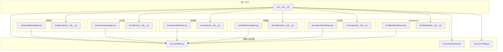
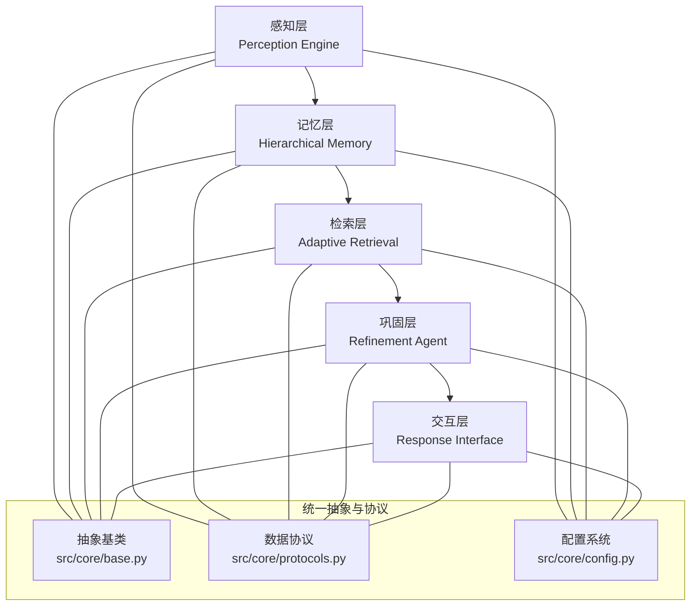
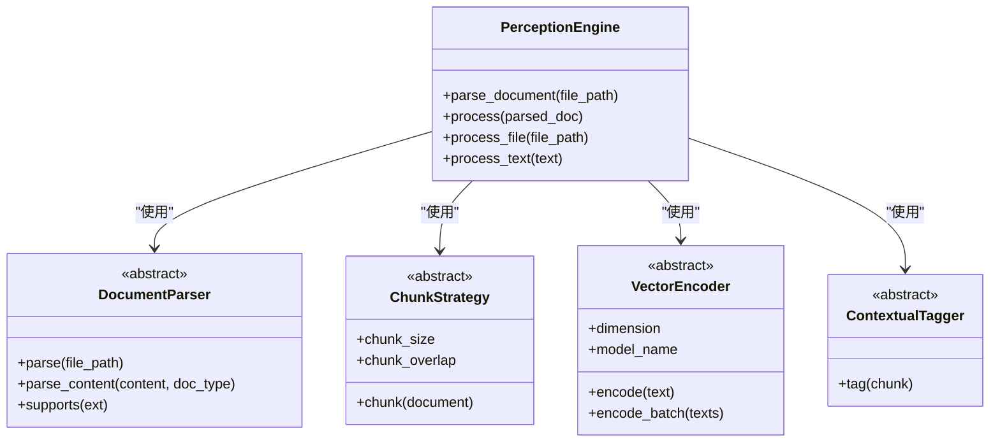
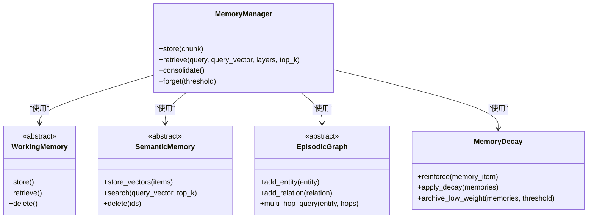
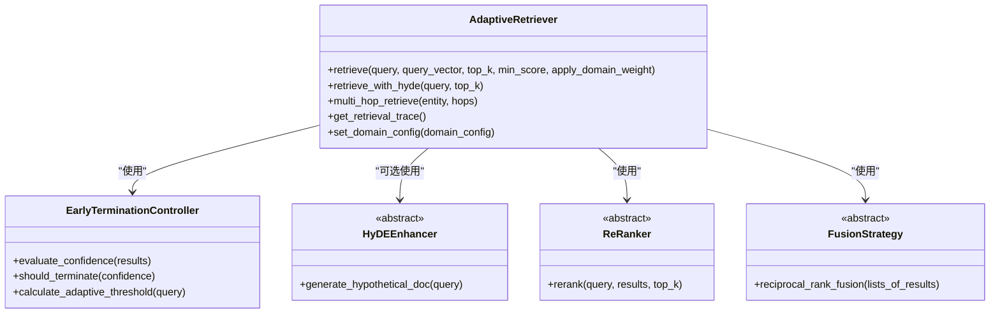
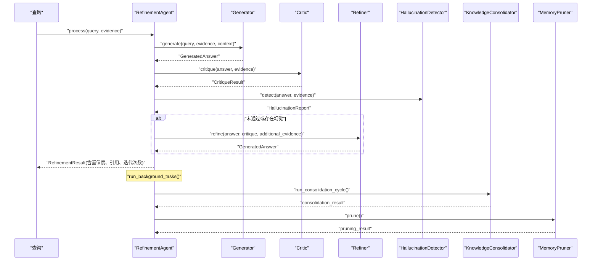
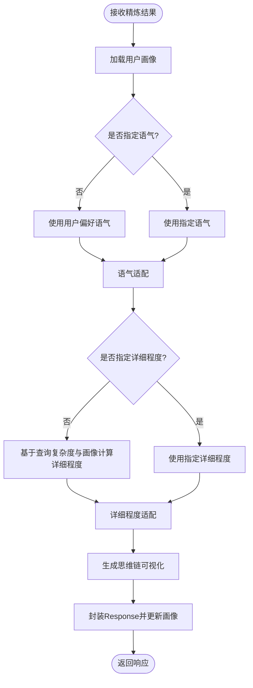
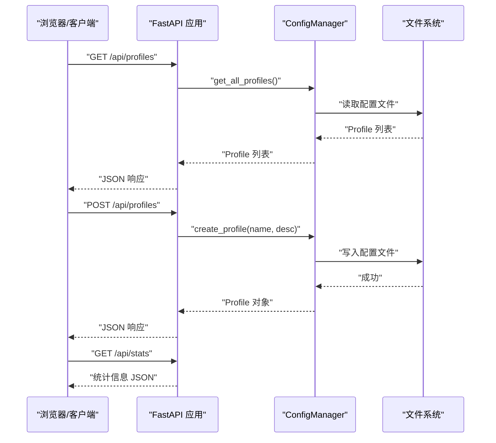
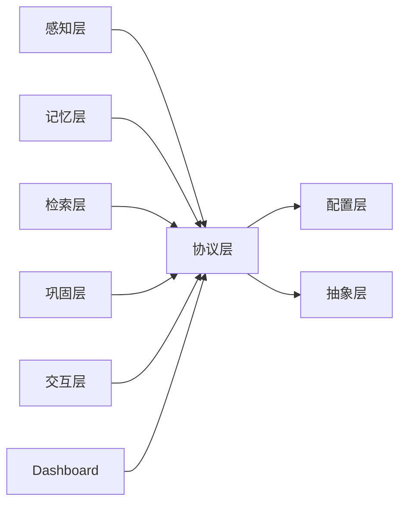

# 代码架构分析

<cite>
**本文引用的文件**
- [README.md](file://README.md)
- [design.md](file://design/design.md)
- [src/__init__.py](file://src/__init__.py)
- [src/core/base.py](file://src/core/base.py)
- [src/core/config.py](file://src/core/config.py)
- [src/core/protocols.py](file://src/core/protocols.py)
- [src/perception/__init__.py](file://src/perception/__init__.py)
- [src/perception/engine.py](file://src/perception/engine.py)
- [src/memory/__init__.py](file://src/memory/__init__.py)
- [src/memory/manager.py](file://src/memory/manager.py)
- [src/retrieval/__init__.py](file://src/retrieval/__init__.py)
- [src/retrieval/retriever.py](file://src/retrieval/retriever.py)
- [src/refinement/__init__.py](file://src/refinement/__init__.py)
- [src/refinement/agent.py](file://src/refinement/agent.py)
- [src/response/__init__.py](file://src/response/__init__.py)
- [src/response/interface.py](file://src/response/interface.py)
- [src/dashboard/__init__.py](file://src/dashboard/__init__.py)
- [src/dashboard/server.py](file://src/dashboard/server.py)
</cite>

## 目录
1. [引言](#引言)
2. [项目结构](#项目结构)
3. [核心组件](#核心组件)
4. [架构总览](#架构总览)
5. [详细组件分析](#详细组件分析)
6. [依赖分析](#依赖分析)
7. [性能考虑](#性能考虑)
8. [故障排查指南](#故障排查指南)
9. [结论](#结论)
10. [附录](#附录)

## 引言
本文件面向NecoRAG的整体代码架构，围绕其“五层认知”分层架构展开，系统梳理模块划分、组件职责、数据流与控制流、关键设计模式（策略模式、观察者模式、工厂模式等）、可扩展性与插件机制、架构演进与未来规划，并提供代码审查与重构指导原则。文档既服务于技术读者，也兼顾非技术读者的理解需求。

## 项目结构
NecoRAG采用模块化分层组织，核心分为五层（感知、记忆、检索、巩固、交互），并辅以统一的抽象层、协议层与配置层，以及可选的Dashboard管理界面。项目顶层通过src/__init__.py提供统一入口，导出各层主要类与工具。

**图表来源**
- [src/__init__.py:1-133](file://src/__init__.py#L1-L133)
- [src/core/base.py:1-658](file://src/core/base.py#L1-L658)
- [src/core/protocols.py:1-288](file://src/core/protocols.py#L1-L288)
- [src/core/config.py:1-370](file://src/core/config.py#L1-L370)
- [src/perception/engine.py:1-130](file://src/perception/engine.py#L1-L130)
- [src/memory/manager.py:1-186](file://src/memory/manager.py#L1-L186)
- [src/retrieval/retriever.py:1-440](file://src/retrieval/retriever.py#L1-L440)
- [src/refinement/agent.py:1-151](file://src/refinement/agent.py#L1-L151)
- [src/response/interface.py:1-224](file://src/response/interface.py#L1-L224)
- [src/dashboard/server.py:1-393](file://src/dashboard/server.py#L1-L393)

**章节来源**
- [README.md:35-85](file://README.md#L35-L85)
- [src/__init__.py:9-74](file://src/__init__.py#L9-L74)

## 核心组件
- 统一抽象层：定义感知、记忆、检索、巩固、响应等抽象基类与接口，确保实现的一致性与可替换性。
- 协议与数据模型：定义统一的数据类型（Document、Chunk、Embedding、Memory、Query、Response等）与枚举，保障模块间数据交换标准一致。
- 配置系统：提供全局配置与各层配置，支持从文件、环境变量加载，支持预设与动态覆盖。
- 五层核心模块：
  - 感知引擎：文档解析、分块、编码、情境标签生成。
  - 记忆管理：L1/L2/L3三层记忆统一管理与衰减。
  - 自适应检索：向量检索、图谱检索、HyDE增强、重排序、早停机制、领域权重融合。
  - 精炼代理：生成-批判-修正闭环，幻觉检测，知识固化与修剪。
  - 响应接口：用户画像适配、语气与详细程度适配、思维链可视化。
- Dashboard：FastAPI提供REST API与Web UI，支持配置Profile管理与统计信息展示。

**章节来源**
- [src/core/base.py:20-658](file://src/core/base.py#L20-L658)
- [src/core/protocols.py:14-288](file://src/core/protocols.py#L14-L288)
- [src/core/config.py:45-370](file://src/core/config.py#L45-L370)
- [src/perception/engine.py:14-130](file://src/perception/engine.py#L14-L130)
- [src/memory/manager.py:16-186](file://src/memory/manager.py#L16-L186)
- [src/retrieval/retriever.py:122-440](file://src/retrieval/retriever.py#L122-L440)
- [src/refinement/agent.py:16-151](file://src/refinement/agent.py#L16-L151)
- [src/response/interface.py:16-224](file://src/response/interface.py#L16-L224)
- [src/dashboard/server.py:43-393](file://src/dashboard/server.py#L43-L393)

## 架构总览
NecoRAG采用“五层认知”分层架构，从感知到交互形成完整的认知闭环。统一抽象层与协议层确保各层松耦合、可替换；配置层提供灵活的参数化能力；Dashboard提供可视化配置与监控。

**图表来源**
- [design.md:489-554](file://design/design.md#L489-L554)
- [src/core/base.py:1-658](file://src/core/base.py#L1-L658)
- [src/core/protocols.py:1-288](file://src/core/protocols.py#L1-L288)
- [src/core/config.py:1-370](file://src/core/config.py#L1-L370)

**章节来源**
- [design.md:489-554](file://design/design.md#L489-L554)
- [README.md:35-85](file://README.md#L35-L85)

## 详细组件分析

### 感知层（Perception Engine）
- 职责：多模态数据的高精度编码与情境标记，支持文件与文本输入，输出编码块（稠密向量、稀疏向量、实体三元组、情境标签）。
- 关键类：PerceptionEngine聚合解析器、分块器、编码器、情境标签生成器，提供一站式处理方法。
- 设计要点：组件组合（组合优于继承）、可插拔的编码器与标签器、统一的编码块数据结构。

**图表来源**
- [src/perception/engine.py:14-130](file://src/perception/engine.py#L14-L130)
- [src/core/base.py:22-143](file://src/core/base.py#L22-L143)

**章节来源**
- [src/perception/engine.py:14-130](file://src/perception/engine.py#L14-L130)
- [src/perception/__init__.py:6-22](file://src/perception/__init__.py#L6-L22)

### 记忆层（Hierarchical Memory）
- 职责：统一管理L1（工作记忆）、L2（语义记忆）、L3（情景图谱）三层记忆，提供存储、检索、巩固与主动遗忘。
- 关键类：MemoryManager聚合WorkingMemory、SemanticMemory、EpisodicGraph与MemoryDecay，实现跨层检索与权重衰减。
- 设计要点：三层记忆解耦、统一存储索引、衰减与归档策略、实体关系入库。

**图表来源**
- [src/memory/manager.py:16-186](file://src/memory/manager.py#L16-L186)
- [src/core/base.py:147-315](file://src/core/base.py#L147-L315)

**章节来源**
- [src/memory/manager.py:16-186](file://src/memory/manager.py#L16-L186)
- [src/memory/__init__.py:6-21](file://src/memory/__init__.py#L6-L21)

### 检索层（Adaptive Retrieval）
- 职责：混合检索与重排序，支持HyDE增强、多跳检索、早停机制、领域权重融合。
- 关键类：AdaptiveRetriever集成向量检索、图谱检索、融合策略、重排序器、早停控制器；可选领域权重计算器与查询增强器。
- 设计要点：策略模式（多路检索策略）、早停策略（阈值与边际收益）、领域权重融合（关键字、时间、领域相关性）。

**图表来源**
- [src/retrieval/retriever.py:122-440](file://src/retrieval/retriever.py#L122-L440)
- [src/core/base.py:319-363](file://src/core/base.py#L319-L363)

**章节来源**
- [src/retrieval/retriever.py:122-440](file://src/retrieval/retriever.py#L122-L440)
- [src/retrieval/__init__.py:6-18](file://src/retrieval/__init__.py#L6-L18)

### 巩固层（Refinement Agent）
- 职责：生成-批判-修正闭环，幻觉检测，异步知识固化与修剪。
- 关键类：RefinementAgent组合Generator、Critic、Refiner、HallucinationDetector、KnowledgeConsolidator、MemoryPruner。
- 设计要点：编排模式（状态机/循环编排）、异步任务调度、多轮迭代与收敛判断。

**图表来源**
- [src/refinement/agent.py:16-151](file://src/refinement/agent.py#L16-L151)
- [src/core/base.py:367-457](file://src/core/base.py#L367-L457)

**章节来源**
- [src/refinement/agent.py:16-151](file://src/refinement/agent.py#L16-L151)
- [src/refinement/__init__.py:6-25](file://src/refinement/__init__.py#L6-L25)

### 交互层（Response Interface）
- 职责：情境自适应生成、用户画像适配、思维链可视化、多模态输出。
- 关键类：ResponseInterface组合UserProfileManager、ToneAdapter、DetailLevelAdapter、ThinkingChainVisualizer。
- 设计要点：适配器模式（语气与详细程度）、策略模式（用户画像偏好）、可视化渲染。

**图表来源**
- [src/response/interface.py:55-224](file://src/response/interface.py#L55-L224)

**章节来源**
- [src/response/interface.py:16-224](file://src/response/interface.py#L16-L224)
- [src/response/__init__.py:6-22](file://src/response/__init__.py#L6-L22)

### Dashboard（配置管理与监控）
- 职责：提供REST API与Web UI，管理配置Profile、模块参数、统计信息。
- 关键类：DashboardServer基于FastAPI注册路由，ConfigManager管理Profile生命周期，DashboardStats提供统计信息。
- 设计要点：RESTful API设计、CORS配置、静态资源托管、前端简单UI回退。

**图表来源**
- [src/dashboard/server.py:94-253](file://src/dashboard/server.py#L94-L253)
- [src/dashboard/__init__.py:6-15](file://src/dashboard/__init__.py#L6-L15)

**章节来源**
- [src/dashboard/server.py:43-393](file://src/dashboard/server.py#L43-L393)
- [src/dashboard/__init__.py:1-16](file://src/dashboard/__init__.py#L1-L16)

## 依赖分析
- 模块内聚与耦合：
  - 各层内部高内聚，层间通过抽象基类与协议层耦合，降低实现细节暴露。
  - 统一抽象层与协议层为跨层协作提供契约，避免直接依赖具体实现。
- 外部依赖与集成点：
  - 感知层：可插拔的解析器、编码器、标签器。
  - 记忆层：可替换的向量存储、图存储、缓存实现。
  - 检索层：可替换的重排序模型、融合策略、领域权重计算器。
  - 巩固层：可替换的LLM客户端、编排引擎（LangGraph）。
  - 交互层：可替换的语气/详细程度适配器、可视化渲染器。
- 可能的循环依赖：
  - 通过抽象基类与协议层避免直接循环依赖；模块间通过接口通信。

**图表来源**
- [src/core/protocols.py:1-288](file://src/core/protocols.py#L1-L288)
- [src/core/config.py:1-370](file://src/core/config.py#L1-L370)
- [src/core/base.py:1-658](file://src/core/base.py#L1-L658)

**章节来源**
- [src/core/protocols.py:1-288](file://src/core/protocols.py#L1-L288)
- [src/core/config.py:1-370](file://src/core/config.py#L1-L370)
- [src/core/base.py:1-658](file://src/core/base.py#L1-L658)

## 性能考虑
- 检索性能：
  - 早停机制：基于置信度阈值与边际收益，避免无效检索，显著降低延迟。
  - 多路融合与重排序：Reciprocal Rank融合与新颖性惩罚，提升召回质量与多样性。
- 记忆与存储：
  - 动态权重衰减与主动遗忘，降低无效存储与检索开销。
  - L1 TTL机制与L2/L3分层存储，平衡速度与容量。
- 生成与编排：
  - 多轮迭代与幻觉检测闭环，通过早期收敛减少不必要的计算。
  - 异步知识固化与修剪，避免阻塞主线程。

[本节为通用性能讨论，无需列出具体文件来源]

## 故障排查指南
- 配置加载失败：
  - 检查配置文件路径与权限，确认环境变量前缀与键名正确。
  - 使用配置加载函数的优先级（环境变量 > 配置文件 > 默认值）定位问题。
- 检索结果为空或质量差：
  - 检查查询向量化是否成功，确认检索阈值与融合策略设置。
  - 开启早停阈值自适应或降低阈值以获取更多候选项。
- 记忆层异常：
  - 检查向量/图存储连接与可用性，确认衰减与归档策略参数合理。
- 巩固层迭代不收敛：
  - 调整最大迭代次数与最低置信度阈值，检查批判与幻觉检测逻辑。
- Dashboard API异常：
  - 检查CORS配置、路由注册与静态文件路径，确认端口未被占用。

**章节来源**
- [src/core/config.py:288-327](file://src/core/config.py#L288-L327)
- [src/retrieval/retriever.py:30-120](file://src/retrieval/retriever.py#L30-L120)
- [src/memory/manager.py:149-186](file://src/memory/manager.py#L149-L186)
- [src/refinement/agent.py:130-151](file://src/refinement/agent.py#L130-L151)
- [src/dashboard/server.py:79-93](file://src/dashboard/server.py#L79-L93)

## 结论
NecoRAG通过“五层认知”架构与统一抽象层、协议层、配置层的协同，实现了从感知到交互的完整闭环。其设计强调可替换性、可扩展性与可观测性，结合早停机制、领域权重融合、动态衰减与异步固化等关键技术，提升了检索质量与系统性能。Dashboard进一步增强了可运维性与可配置性。未来可在编排引擎深度集成、可视化调试面板、插件市场等方面持续演进。

[本节为总结性内容，无需列出具体文件来源]

## 附录

### 关键抽象类与接口设计思路
- 抽象基类：以“职责单一、接口稳定”为目标，定义稳定的抽象接口，屏蔽具体实现细节。
- 协议层：以数据为中心，统一数据结构与枚举，确保跨层数据一致性。
- 配置层：以“可覆盖、可预设”为目标，支持多来源配置合并与运行时覆盖。

**章节来源**
- [src/core/base.py:20-658](file://src/core/base.py#L20-L658)
- [src/core/protocols.py:14-288](file://src/core/protocols.py#L14-L288)
- [src/core/config.py:45-370](file://src/core/config.py#L45-L370)

### 设计模式应用
- 策略模式：检索层的多路检索策略、融合策略、重排序策略；交互层的语气与详细程度适配器。
- 观察者模式：通过回调与事件（如统计信息更新）实现松耦合通知。
- 工厂模式：配置层的预设配置（开发/生产/最小化）与模块参数工厂化管理。
- 编排模式：巩固层的生成-批判-修正闭环与异步任务编排。

**章节来源**
- [src/retrieval/retriever.py:122-440](file://src/retrieval/retriever.py#L122-L440)
- [src/response/interface.py:16-224](file://src/response/interface.py#L16-L224)
- [src/core/config.py:340-370](file://src/core/config.py#L340-L370)
- [src/refinement/agent.py:16-151](file://src/refinement/agent.py#L16-L151)

### 可扩展性设计与插件机制
- 插件化组件：解析器、编码器、标签器、向量存储、图存储、重排序器均可替换。
- 领域权重扩展：通过领域配置与权重计算器扩展新的权重因子与计算策略。
- Dashboard扩展：新增模块参数与Profile管理，支持导入/导出与实时监控。

**章节来源**
- [src/core/base.py:22-315](file://src/core/base.py#L22-L315)
- [src/core/config.py:217-284](file://src/core/config.py#L217-L284)
- [src/dashboard/server.py:94-253](file://src/dashboard/server.py#L94-L253)

### 架构演进历史与未来规划
- 阶段一（MVP）：完成感知与记忆基础对接、混合检索、SDK发布、Dashboard基础功能。
- 阶段二（注入大脑）：集成编排引擎实现精炼闭环、动态重排序与知识库实时更新。
- 阶段三（生态进化）：异步固化与自动遗忘、可视化调试面板、插件市场、社区运营。

**章节来源**
- [README.md:475-495](file://README.md#L475-L495)
- [design.md:594-619](file://design/design.md#L594-L619)

### 代码审查与重构指导原则
- 保持抽象层稳定：新增实现必须遵循抽象基类契约，避免破坏向后兼容。
- 协议层一致性：新增字段需在协议层统一声明，确保序列化/反序列化一致。
- 配置层可测试性：通过预设配置与环境变量覆盖，确保不同环境可验证。
- 检索策略可插拔：通过策略接口替换具体实现，避免硬编码分支。
- 异步与可观测：异步任务需明确错误处理与监控埋点，确保可观测性。
- Dashboard API健壮性：严格校验输入参数与返回状态，提供清晰的错误信息。

**章节来源**
- [src/core/base.py:1-658](file://src/core/base.py#L1-L658)
- [src/core/protocols.py:1-288](file://src/core/protocols.py#L1-L288)
- [src/core/config.py:288-370](file://src/core/config.py#L288-L370)
- [src/retrieval/retriever.py:122-440](file://src/retrieval/retriever.py#L122-L440)
- [src/refinement/agent.py:130-151](file://src/refinement/agent.py#L130-L151)
- [src/dashboard/server.py:94-393](file://src/dashboard/server.py#L94-L393)