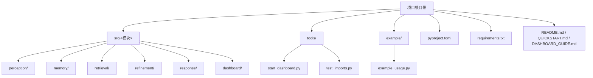
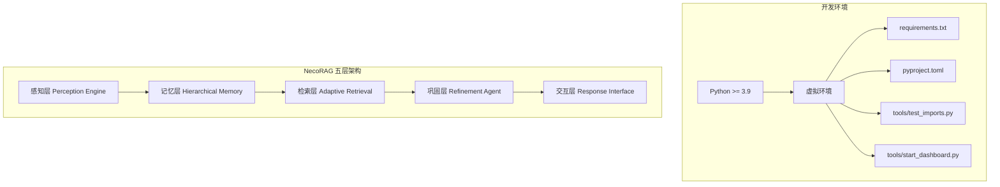
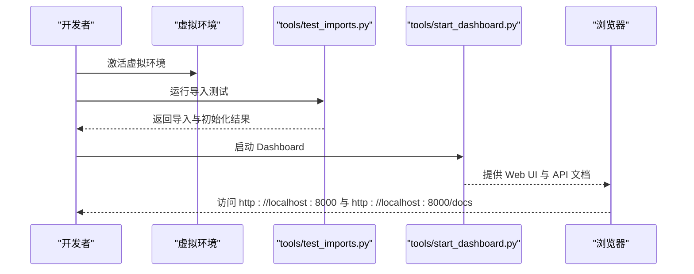
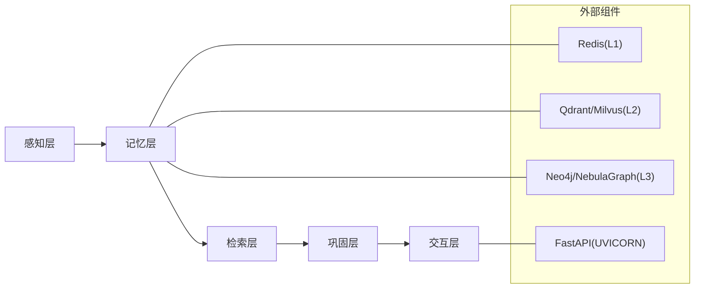

# 开发环境搭建

<cite>
**本文引用的文件**
- [README.md](file://README.md)
- [QUICKSTART.md](file://QUICKSTART.md)
- [CONTRIBUTING.md](file://CONTRIBUTING.md)
- [pyproject.toml](file://pyproject.toml)
- [requirements.txt](file://requirements.txt)
- [tools/test_imports.py](file://tools/test_imports.py)
- [tools/start_dashboard.py](file://tools/start_dashboard.py)
- [src/dashboard/README.md](file://src/dashboard/README.md)
- [DASHBOARD_GUIDE.md](file://DASHBOARD_GUIDE.md)
- [src/perception/README.md](file://src/perception/README.md)
- [src/memory/README.md](file://src/memory/README.md)
- [example/example_usage.py](file://example/example_usage.py)
</cite>

## 目录
1. [简介](#简介)
2. [项目结构](#项目结构)
3. [核心组件](#核心组件)
4. [架构总览](#架构总览)
5. [详细组件分析](#详细组件分析)
6. [依赖分析](#依赖分析)
7. [性能考虑](#性能考虑)
8. [故障排查指南](#故障排查指南)
9. [结论](#结论)
10. [附录](#附录)

## 简介
本指南面向希望在本地搭建 NecoRAG 开发环境的工程师与研究者，目标是帮助你在不同操作系统上完成系统要求、依赖安装、虚拟环境创建与激活、requirements.txt 与 pyproject.toml 的使用、测试环境配置与验证、以及常见问题排查。同时提供开发工具链与 IDE 配置建议，确保你可以顺利运行示例、启动 Dashboard 并进行二次开发。

## 项目结构
NecoRAG 采用模块化的分层架构，核心模块位于 src 目录，工具与示例位于 tools 与 example 目录，配置文件位于 pyproject.toml 与 requirements.txt。README 与 QUICKSTART 提供了安装与快速上手的步骤；DASHBOARD_GUIDE 与 src/dashboard/README.md 详细说明了 Dashboard 的使用与 API；各子模块 README 提供了模块功能与依赖说明。

图表来源
- [README.md](file://README.md)
- [QUICKSTART.md](file://QUICKSTART.md)
- [DASHBOARD_GUIDE.md](file://DASHBOARD_GUIDE.md)
- [pyproject.toml](file://pyproject.toml)
- [requirements.txt](file://requirements.txt)

章节来源
- [README.md](file://README.md)
- [QUICKSTART.md](file://QUICKSTART.md)
- [DASHBOARD_GUIDE.md](file://DASHBOARD_GUIDE.md)

## 核心组件
- Python 版本与打包配置：pyproject.toml 指定最低 Python 版本与可选开发依赖，便于使用现代工具链进行开发与测试。
- 依赖声明：requirements.txt 声明了核心依赖与可选组件（如 Dashboard、文档解析、向量/图数据库、缓存等），便于按需安装。
- 快速验证：tools/test_imports.py 用于验证模块导入与基础初始化，确保环境可用。
- Dashboard 启动：tools/start_dashboard.py 提供命令行参数支持，便于自定义主机、端口与配置目录。
- 模块文档：各子模块 README（如 perception、memory）提供了功能、参数与依赖说明，有助于理解组件边界与集成方式。

章节来源
- [pyproject.toml](file://pyproject.toml)
- [requirements.txt](file://requirements.txt)
- [tools/test_imports.py](file://tools/test_imports.py)
- [tools/start_dashboard.py](file://tools/start_dashboard.py)
- [src/perception/README.md](file://src/perception/README.md)
- [src/memory/README.md](file://src/memory/README.md)

## 架构总览
下图展示了 NecoRAG 的五层认知架构与开发环境中的关键组件关系。开发环境应满足 Python 版本要求，并根据需要安装 Dashboard 与可选的外部组件（如向量库、图数据库、缓存等）。

图表来源
- [README.md](file://README.md)
- [pyproject.toml](file://pyproject.toml)
- [requirements.txt](file://requirements.txt)
- [tools/test_imports.py](file://tools/test_imports.py)
- [tools/start_dashboard.py](file://tools/start_dashboard.py)

## 详细组件分析

### 系统要求与依赖安装
- Python 版本：pyproject.toml 指定最低版本为 3.9；建议使用 3.9–3.12 以获得最佳兼容性。
- 核心依赖：requirements.txt 中列出 numpy、python-dateutil 等基础依赖；Dashboard 依赖 fastapi、uvicorn、pydantic。
- 可选组件：根据实际需求安装文档解析（如 RAGFlow）、向量数据库（qdrant-client 或 milvus）、图数据库（neo4j 或 nebula3）、缓存（redis）、嵌入模型（FlagEmbedding/sentence-transformers）、LLM 集成（langchain/langgraph/openai/anthropic）与 NLP 工具（spaCy/transformers）。
- 安装方式：
  - 使用 requirements.txt 一次性安装（推荐先创建并激活虚拟环境）。
  - 使用 pip 安装 pyproject.toml 中声明的依赖（适用于核心依赖与可选开发工具）。

章节来源
- [pyproject.toml](file://pyproject.toml)
- [requirements.txt](file://requirements.txt)
- [README.md](file://README.md)

### 虚拟环境创建与激活
- 创建虚拟环境：使用标准 venv 创建隔离环境。
- 激活虚拟环境：
  - Linux/Mac：source venv/bin/activate
  - Windows：venv\Scripts\activate
- 在激活后的环境中安装依赖，确保后续测试与运行稳定。

章节来源
- [CONTRIBUTING.md](file://CONTRIBUTING.md)

### requirements.txt 与 pyproject.toml 的使用说明
- requirements.txt：集中声明项目依赖，适合一次性安装；可按需取消注释以启用特定外部组件。
- pyproject.toml：定义项目元数据、最低 Python 版本、许可证、可选开发依赖（pytest/black/flake8/mypy），并配置打包与格式化工具；适合在现代 Python 工具链中使用。

章节来源
- [requirements.txt](file://requirements.txt)
- [pyproject.toml](file://pyproject.toml)

### 测试环境配置与验证
- 导入测试：运行 tools/test_imports.py，验证核心模块导入与基础初始化是否成功。
- 示例运行：参考 example/example_usage.py，执行完整工作流示例，观察各模块协同输出。
- Dashboard 启动：使用 tools/start_dashboard.py 或命令行方式启动 Dashboard，访问 http://localhost:8000 与 http://localhost:8000/docs 进行验证。

图表来源
- [tools/test_imports.py](file://tools/test_imports.py)
- [tools/start_dashboard.py](file://tools/start_dashboard.py)
- [README.md](file://README.md)

章节来源
- [tools/test_imports.py](file://tools/test_imports.py)
- [example/example_usage.py](file://example/example_usage.py)
- [tools/start_dashboard.py](file://tools/start_dashboard.py)
- [README.md](file://README.md)

### Dashboard 配置与使用
- 启动方式：支持脚本、命令行参数、Windows 批处理、Linux/Mac Shell 与 Python 模块方式。
- 参数说明：支持 host、port、config-dir；默认端口 8000，配置目录 ./configs。
- Web 界面：Profile 管理、模块参数配置、统计面板与 API 文档。
- API：提供 Profile 管理、模块参数更新与统计信息接口，便于集成与自动化。

章节来源
- [tools/start_dashboard.py](file://tools/start_dashboard.py)
- [src/dashboard/README.md](file://src/dashboard/README.md)
- [DASHBOARD_GUIDE.md](file://DASHBOARD_GUIDE.md)

### 感知层与记忆层依赖
- 感知层（perception）：文档解析（RAGFlow）、向量化（BGE-M3）、情境标签生成等，建议按需安装相应依赖。
- 记忆层（memory）：L1（Redis）、L2（Qdrant/Milvus）、L3（Neo4j/NebulaGraph），建议根据部署环境选择并安装对应客户端。

章节来源
- [src/perception/README.md](file://src/perception/README.md)
- [src/memory/README.md](file://src/memory/README.md)

## 依赖分析
- 内部模块耦合：各层模块通过统一的接口与数据模型协作，感知层产出编码块，记忆层进行存储与检索，检索层进行融合与重排序，巩固层进行答案生成与幻觉检测，交互层提供情境自适应输出。
- 外部依赖：根据功能需求选择性安装，避免不必要的依赖污染；Dashboard 与核心模块分离，便于按需部署。

图表来源
- [README.md](file://README.md)
- [src/memory/README.md](file://src/memory/README.md)
- [src/perception/README.md](file://src/perception/README.md)

章节来源
- [README.md](file://README.md)
- [src/memory/README.md](file://src/memory/README.md)
- [src/perception/README.md](file://src/perception/README.md)

## 性能考虑
- 分块大小与重叠：合理设置感知层分块大小与重叠，平衡召回与上下文长度。
- 检索参数：根据业务场景调整 top_k、阈值等参数，兼顾准确率与延迟。
- 记忆衰减：根据数据规模与访问频率调整衰减参数，提升检索效率与存储利用率。
- Dashboard 启动与导入：确保导入时间与启动时间在可接受范围，避免阻塞开发流程。

## 故障排查指南
- 依赖安装失败
  - 确认 Python 版本满足要求（>=3.9）。
  - 在虚拟环境中安装，避免系统全局包冲突。
  - 按需安装可选组件，逐步排除问题。
- Dashboard 启动失败
  - 检查端口占用（默认 8000），必要时更换端口。
  - 确认配置目录存在且具备写权限。
- 导入测试失败
  - 确认虚拟环境已激活且依赖已安装。
  - 检查模块路径与包结构，确保可正常导入。
- 外部组件连接问题
  - 检查服务端口、认证与网络连通性。
  - 参考各模块 README 的依赖与配置说明进行修正。

章节来源
- [QUICKSTART.md](file://QUICKSTART.md)
- [DASHBOARD_GUIDE.md](file://DASHBOARD_GUIDE.md)
- [src/dashboard/README.md](file://src/dashboard/README.md)

## 结论
通过遵循本指南，你可以在本地成功搭建 NecoRAG 开发环境，完成虚拟环境创建、依赖安装、测试验证与 Dashboard 启动。建议按需安装外部组件，结合模块文档与 API 文档进行二次开发与集成，持续优化参数与性能，以满足实际应用场景的需求。

## 附录

### 不同操作系统下的安装指导
- Linux/Mac
  - 创建并激活虚拟环境
  - 安装依赖：pip install -r requirements.txt
  - 运行导入测试：python tools/test_imports.py
  - 启动 Dashboard：python tools/start_dashboard.py 或 chmod +x tools/start_dashboard.sh && ./tools/start_dashboard.sh
- Windows
  - 创建并激活虚拟环境
  - 安装依赖：pip install -r requirements.txt
  - 运行导入测试：python tools/test_imports.py
  - 启动 Dashboard：python tools/start_dashboard.py 或 双击 tools/start_dashboard.bat

章节来源
- [CONTRIBUTING.md](file://CONTRIBUTING.md)
- [QUICKSTART.md](file://QUICKSTART.md)
- [DASHBOARD_GUIDE.md](file://DASHBOARD_GUIDE.md)

### 开发工具链与 IDE 配置建议
- 代码格式化：使用 black，遵循 pyproject.toml 中的行宽与目标版本配置。
- 类型检查：使用 mypy，建议开启严格模式并配合类型注解。
- 代码风格：遵循 flake8 规范，保持一致的代码风格。
- 测试：使用 pytest 与 pytest-asyncio，确保模块导入与功能测试通过。
- IDE 推荐：PyCharm/VSCode，启用 Python 解释器指向虚拟环境，配置格式化与静态检查工具。

章节来源
- [pyproject.toml](file://pyproject.toml)
- [requirements.txt](file://requirements.txt)