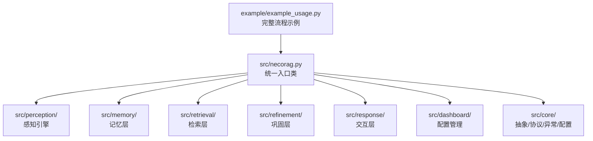
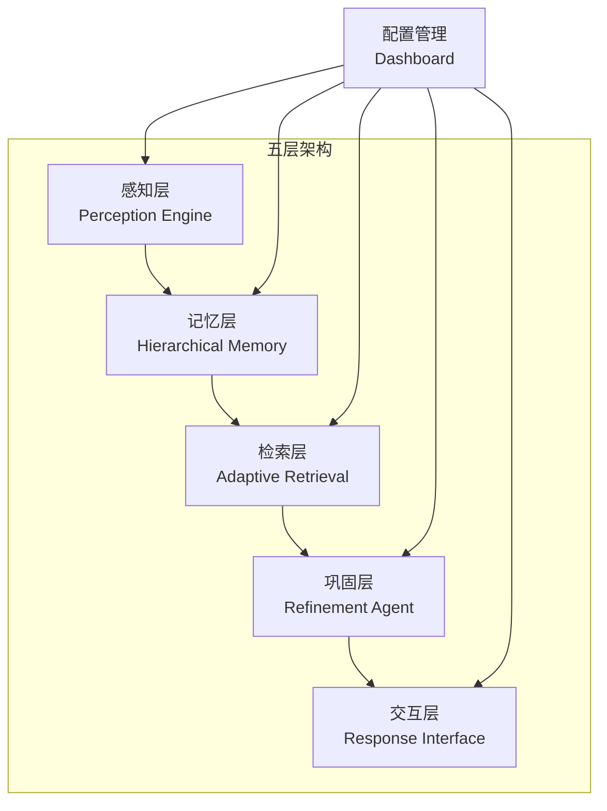
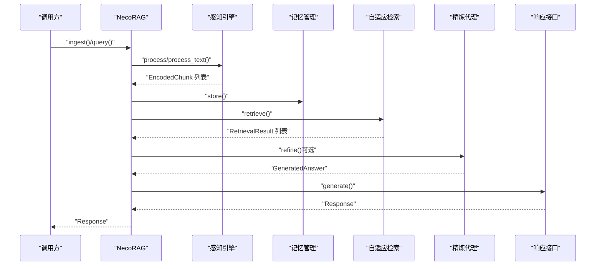
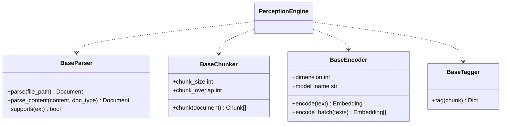
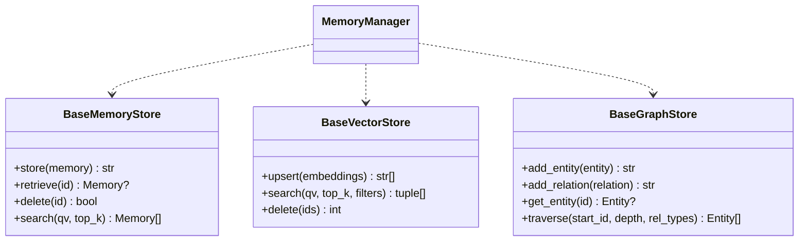
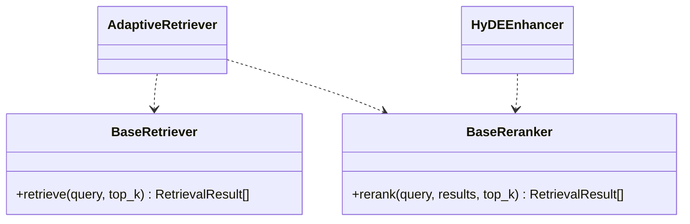
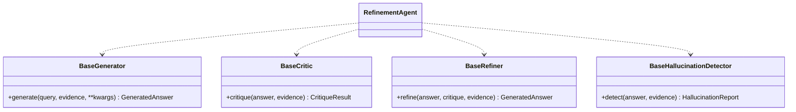
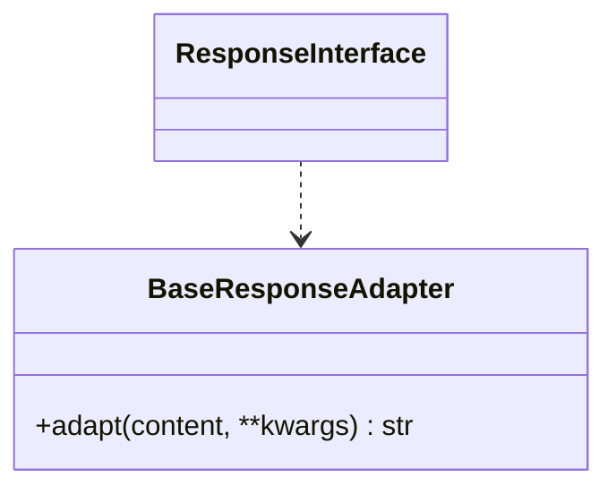
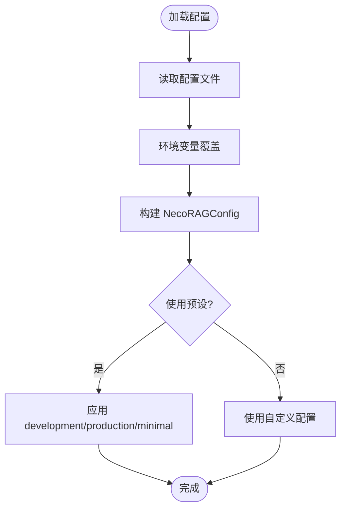
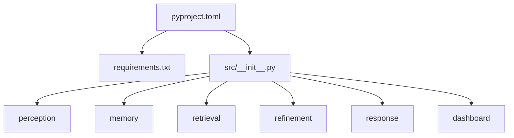

# 开发者指南

<cite>
**本文引用的文件**
- [README.md](file://README.md)
- [CONTRIBUTING.md](file://CONTRIBUTING.md)
- [QUICKSTART.md](file://QUICKSTART.md)
- [pyproject.toml](file://pyproject.toml)
- [requirements.txt](file://requirements.txt)
- [src/__init__.py](file://src/__init__.py)
- [src/core/base.py](file://src/core/base.py)
- [src/core/config.py](file://src/core/config.py)
- [src/core/exceptions.py](file://src/core/exceptions.py)
- [src/core/protocols.py](file://src/core/protocols.py)
- [src/necorag.py](file://src/necorag.py)
- [src/perception/__init__.py](file://src/perception/__init__.py)
- [src/memory/__init__.py](file://src/memory/__init__.py)
- [src/retrieval/__init__.py](file://src/retrieval/__init__.py)
- [src/refinement/__init__.py](file://src/refinement/__init__.py)
- [src/response/__init__.py](file://src/response/__init__.py)
- [src/dashboard/__init__.py](file://src/dashboard/__init__.py)
- [example/example_usage.py](file://example/example_usage.py)
</cite>

## 目录
1. [简介](#简介)
2. [项目结构](#项目结构)
3. [核心组件](#核心组件)
4. [架构总览](#架构总览)
5. [详细组件分析](#详细组件分析)
6. [依赖分析](#依赖分析)
7. [性能考量](#性能考量)
8. [故障排查指南](#故障排查指南)
9. [结论](#结论)
10. [附录](#附录)

## 简介
本指南面向希望参与 NecoRAG 框架开发与扩展的贡献者，涵盖开发环境搭建、代码贡献规范、测试策略、构建与发布流程、API 参考、扩展开发与插件开发指导，以及异常处理与错误诊断方法。文档同时提供代码结构分析、设计模式说明与最佳实践，帮助社区成员高效参与项目。

## 项目结构
NecoRAG 采用“五层认知”架构，模块化组织，核心位于 src 目录，包含感知、记忆、检索、巩固、交互五个层次，并提供 Dashboard 配置管理与统一入口。

**图表来源**
- [src/necorag.py:1-437](file://src/necorag.py#L1-L437)
- [src/perception/__init__.py:1-23](file://src/perception/__init__.py#L1-L23)
- [src/memory/__init__.py:1-22](file://src/memory/__init__.py#L1-L22)
- [src/retrieval/__init__.py:1-19](file://src/retrieval/__init__.py#L1-L19)
- [src/refinement/__init__.py:1-26](file://src/refinement/__init__.py#L1-L26)
- [src/response/__init__.py:1-23](file://src/response/__init__.py#L1-L23)
- [src/dashboard/__init__.py:1-16](file://src/dashboard/__init__.py#L1-L16)
- [example/example_usage.py:1-252](file://example/example_usage.py#L1-L252)

**章节来源**
- [README.md:35-85](file://README.md#L35-L85)
- [src/necorag.py:28-102](file://src/necorag.py#L28-L102)

## 核心组件
- 统一入口与编排：NecoRAG 类负责文档导入、查询检索与统计信息维护，协调感知、记忆、检索、巩固与交互模块。
- 抽象与协议：core/base.py 定义各层抽象接口；core/protocols.py 定义统一数据协议；core/exceptions.py 定义统一异常体系；core/config.py 提供配置管理与预设。
- 模块导出：src/__init__.py 汇总导出核心 API，支持可选 Dashboard 依赖。

**章节来源**
- [src/necorag.py:28-102](file://src/necorag.py#L28-L102)
- [src/core/base.py:1-571](file://src/core/base.py#L1-L571)
- [src/core/protocols.py:1-273](file://src/core/protocols.py#L1-L273)
- [src/core/exceptions.py:1-296](file://src/core/exceptions.py#L1-L296)
- [src/core/config.py:1-370](file://src/core/config.py#L1-L370)
- [src/__init__.py:1-111](file://src/__init__.py#L1-L111)

## 架构总览
NecoRAG 五层架构从感知到交互形成闭环：感知层对多模态输入进行编码与情境标记；记忆层分层存储（工作记忆、语义记忆、情景图谱）；检索层执行混合检索与重排序，并具备早停机制；巩固层通过生成-批判-修正闭环与幻觉检测提升答案质量；交互层提供情境自适应输出与思维链可视化。

**图表来源**
- [README.md:37-85](file://README.md#L37-L85)
- [src/necorag.py:28-102](file://src/necorag.py#L28-L102)

## 详细组件分析

### 统一入口与编排（NecoRAG）
- 职责：封装文档导入、查询检索、统计与生命周期管理；按需创建 LLM 客户端；协调各模块协作。
- 关键流程：导入文件/文本 → 感知编码 → 存储记忆 → 检索证据 → 答案精炼（可选）→ 生成响应 → 返回统一 Response。

**图表来源**
- [src/necorag.py:119-311](file://src/necorag.py#L119-L311)
- [src/perception/__init__.py:6-22](file://src/perception/__init__.py#L6-L22)
- [src/memory/__init__.py:6-21](file://src/memory/__init__.py#L6-L21)
- [src/retrieval/__init__.py:6-18](file://src/retrieval/__init__.py#L6-L18)
- [src/refinement/__init__.py:6-25](file://src/refinement/__init__.py#L6-L25)
- [src/response/__init__.py:6-22](file://src/response/__init__.py#L6-L22)

**章节来源**
- [src/necorag.py:28-437](file://src/necorag.py#L28-L437)

### 感知层（Perception Engine）
- 职责：文档解析、文本分块、向量编码、情境标签生成。
- 关键抽象：BaseParser、BaseChunker、BaseEncoder、BaseTagger。
- 模块导出：PerceptionEngine、DocumentParser、ChunkStrategy、ContextualTagger、VectorEncoder、模型类型等。

**图表来源**
- [src/core/base.py:21-142](file://src/core/base.py#L21-L142)
- [src/perception/__init__.py:6-22](file://src/perception/__init__.py#L6-L22)

**章节来源**
- [src/core/base.py:21-142](file://src/core/base.py#L21-L142)
- [src/perception/__init__.py:1-23](file://src/perception/__init__.py#L1-L23)

### 记忆层（Hierarchical Memory）
- 职责：分层存储（L1 工作记忆、L2 语义记忆、L3 情景图谱），支持权重衰减与主动遗忘。
- 关键抽象：BaseMemoryStore、BaseVectorStore、BaseGraphStore。
- 模块导出：MemoryManager、WorkingMemory、SemanticMemory、EpisodicGraph、MemoryDecay、模型类型等。

**图表来源**
- [src/core/base.py:146-314](file://src/core/base.py#L146-L314)
- [src/memory/__init__.py:6-21](file://src/memory/__init__.py#L6-L21)

**章节来源**
- [src/core/base.py:146-314](file://src/core/base.py#L146-L314)
- [src/memory/__init__.py:1-22](file://src/memory/__init__.py#L1-L22)

### 检索层（Adaptive Retrieval）
- 职责：混合检索、HyDE 增强、重排序、早停机制。
- 关键抽象：BaseRetriever、BaseReranker。
- 模块导出：AdaptiveRetriever、HyDEEnhancer、ReRanker、FusionStrategy、RetrievalResult 等。

**图表来源**
- [src/core/base.py:318-362](file://src/core/base.py#L318-L362)
- [src/retrieval/__init__.py:6-18](file://src/retrieval/__init__.py#L6-L18)

**章节来源**
- [src/core/base.py:318-362](file://src/core/base.py#L318-L362)
- [src/retrieval/__init__.py:1-19](file://src/retrieval/__init__.py#L1-L19)

### 巩固层（Refinement Agent）
- 职责：生成-批判-修正闭环、幻觉检测、知识固化与记忆修剪。
- 关键抽象：BaseGenerator、BaseCritic、BaseRefiner、BaseHallucinationDetector。
- 模块导出：RefinementAgent、Generator、Critic、Refiner、HallucinationDetector、KnowledgeConsolidator、MemoryPruner、模型类型等。

**图表来源**
- [src/core/base.py:366-456](file://src/core/base.py#L366-L456)
- [src/refinement/__init__.py:6-25](file://src/refinement/__init__.py#L6-L25)

**章节来源**
- [src/core/base.py:366-456](file://src/core/base.py#L366-L456)
- [src/refinement/__init__.py:1-26](file://src/refinement/__init__.py#L1-L26)

### 交互层（Response Interface）
- 职责：情境自适应生成、语气与详细程度适配、思维链可视化。
- 关键抽象：BaseResponseAdapter。
- 模块导出：ResponseInterface、UserProfileManager、ToneAdapter、DetailLevelAdapter、ThinkingChainVisualizer、模型类型等。

**图表来源**
- [src/core/base.py:555-571](file://src/core/base.py#L555-L571)
- [src/response/__init__.py:6-22](file://src/response/__init__.py#L6-L22)

**章节来源**
- [src/core/base.py:555-571](file://src/core/base.py#L555-L571)
- [src/response/__init__.py:1-23](file://src/response/__init__.py#L1-L23)

### 配置管理与统一异常
- 配置：NecoRAGConfig、各层子配置、预设（development/production/minimal）、环境变量覆盖。
- 异常：统一继承 NecoRAGError，按层细分 ParseError、ChunkingError、EncodingError、MemoryError、RetrievalError、GenerationError、LLMError、ConfigurationError、ValidationError 等。

**图表来源**
- [src/core/config.py:288-327](file://src/core/config.py#L288-L327)
- [src/core/config.py:340-370](file://src/core/config.py#L340-L370)

**章节来源**
- [src/core/config.py:1-370](file://src/core/config.py#L1-L370)
- [src/core/exceptions.py:1-296](file://src/core/exceptions.py#L1-L296)

### Dashboard 配置管理
- 职责：Profile 管理、模块参数配置、实时统计、RESTful API。
- 模块导出：DashboardServer、ConfigManager、ModuleConfig、RAGProfile。

**章节来源**
- [src/dashboard/__init__.py:1-16](file://src/dashboard/__init__.py#L1-L16)

## 依赖分析
- 构建与打包：pyproject.toml 定义项目元数据、依赖与可选开发依赖，使用 setuptools 构建后端。
- 运行时依赖：requirements.txt 列出核心与可选组件依赖（向量/图数据库、缓存、嵌入模型、LLM 集成、NLP 工具、FastAPI/Dashboard 等）。
- 包导出：src/__init__.py 汇总导出统一 API，含 Dashboard 可选依赖保护。

**图表来源**
- [pyproject.toml:1-59](file://pyproject.toml#L1-L59)
- [requirements.txt:1-57](file://requirements.txt#L1-L57)
- [src/__init__.py:1-111](file://src/__init__.py#L1-L111)

**章节来源**
- [pyproject.toml:1-59](file://pyproject.toml#L1-L59)
- [requirements.txt:1-57](file://requirements.txt#L1-L57)
- [src/__init__.py:1-111](file://src/__init__.py#L1-L111)

## 性能考量
- 导入时间：< 2s；基础操作：< 100ms；Dashboard 启动：< 5s（来自贡献指南性能基准）。
- 检索与回答：结合早停机制、重排序与精炼闭环，平衡准确率与延迟。
- 记忆衰减：通过权重衰减与主动遗忘降低上下文规模，提升响应速度。

**章节来源**
- [CONTRIBUTING.md:147-154](file://CONTRIBUTING.md#L147-L154)
- [README.md:465-474](file://README.md#L465-L474)

## 故障排查指南
- 常见问题定位
  - Dashboard 启动失败：检查端口占用并更换端口。
  - 导入测试失败：确认依赖安装与 Python 版本满足要求。
  - 配置未生效：检查环境变量前缀与配置文件路径。
- 日志与统计
  - NecoRAG 提供日志记录与统计信息（文档导入数、查询数、块数、内存条目数）。
- 异常处理
  - 使用统一异常体系，按模块细化错误类型，便于定位与恢复。

**章节来源**
- [QUICKSTART.md:245-259](file://QUICKSTART.md#L245-L259)
- [QUICKSTART.md:261-277](file://QUICKSTART.md#L261-L277)
- [src/necorag.py:349-358](file://src/necorag.py#L349-L358)
- [src/core/exceptions.py:1-296](file://src/core/exceptions.py#L1-L296)

## 结论
本指南提供了 NecoRAG 的开发与贡献全链路指引，从环境搭建、规范与测试，到架构理解、API 参考与扩展开发，帮助贡献者快速上手并在统一抽象与协议之上进行高质量扩展。

## 附录

### 开发环境搭建与测试
- 安装依赖：pip 安装 requirements.txt。
- 运行测试：执行导入测试脚本与示例脚本。
- 快速启动：参考快速开始文档与示例。

**章节来源**
- [QUICKSTART.md:5-41](file://QUICKSTART.md#L5-L41)
- [example/example_usage.py:1-252](file://example/example_usage.py#L1-L252)

### 代码贡献规范
- 分支与提交：使用语义化提交消息（feat/fix/docs/style/refactor/test/chore）。
- 代码风格：PEP 8；尽量添加类型注解；使用中文文档字符串。
- 提交流程：创建特性分支 → 提交更改 → 推送 → 创建 PR → 审查与合并。

**章节来源**
- [CONTRIBUTING.md:47-90](file://CONTRIBUTING.md#L47-L90)
- [CONTRIBUTING.md:40-46](file://CONTRIBUTING.md#L40-L46)

### 构建与发布流程
- 构建系统：setuptools；构建后端为 setuptools.build_meta。
- 项目元数据：名称、版本、许可证、关键字、分类器、URLs。
- 可选开发依赖：pytest、pytest-asyncio、black、flake8、mypy。
- 包发现：自动扫描 necorag* 包。

**章节来源**
- [pyproject.toml:1-59](file://pyproject.toml#L1-L59)

### API 参考（概览）
- 统一入口：NecoRAG、create_rag。
- 核心模块：PerceptionEngine、MemoryManager、AdaptiveRetriever、RefinementAgent、ResponseInterface。
- 领域权重：DomainConfig、DomainConfigManager、权重计算器、时间权重计算器、领域相关性计算器。
- Dashboard：DashboardServer、ConfigManager、ModuleConfig、RAGProfile。

**章节来源**
- [src/__init__.py:1-111](file://src/__init__.py#L1-L111)
- [src/necorag.py:414-437](file://src/necorag.py#L414-L437)

### 扩展开发与插件指导
- 基于抽象接口扩展：在 core/base.py 中定义的新实现需遵循相应抽象。
- 数据协议一致性：使用 core/protocols.py 中的数据类型，确保模块间兼容。
- 配置扩展：在 core/config.py 中新增配置项，并在 NecoRAGConfig 中聚合。
- 异常扩展：在 core/exceptions.py 中新增模块特定异常，保持统一错误结构。
- Dashboard 扩展：通过 ConfigManager 与 DashboardServer 提供参数配置与监控。

**章节来源**
- [src/core/base.py:1-571](file://src/core/base.py#L1-L571)
- [src/core/protocols.py:1-273](file://src/core/protocols.py#L1-L273)
- [src/core/config.py:1-370](file://src/core/config.py#L1-L370)
- [src/core/exceptions.py:1-296](file://src/core/exceptions.py#L1-L296)
- [src/dashboard/__init__.py:1-16](file://src/dashboard/__init__.py#L1-L16)