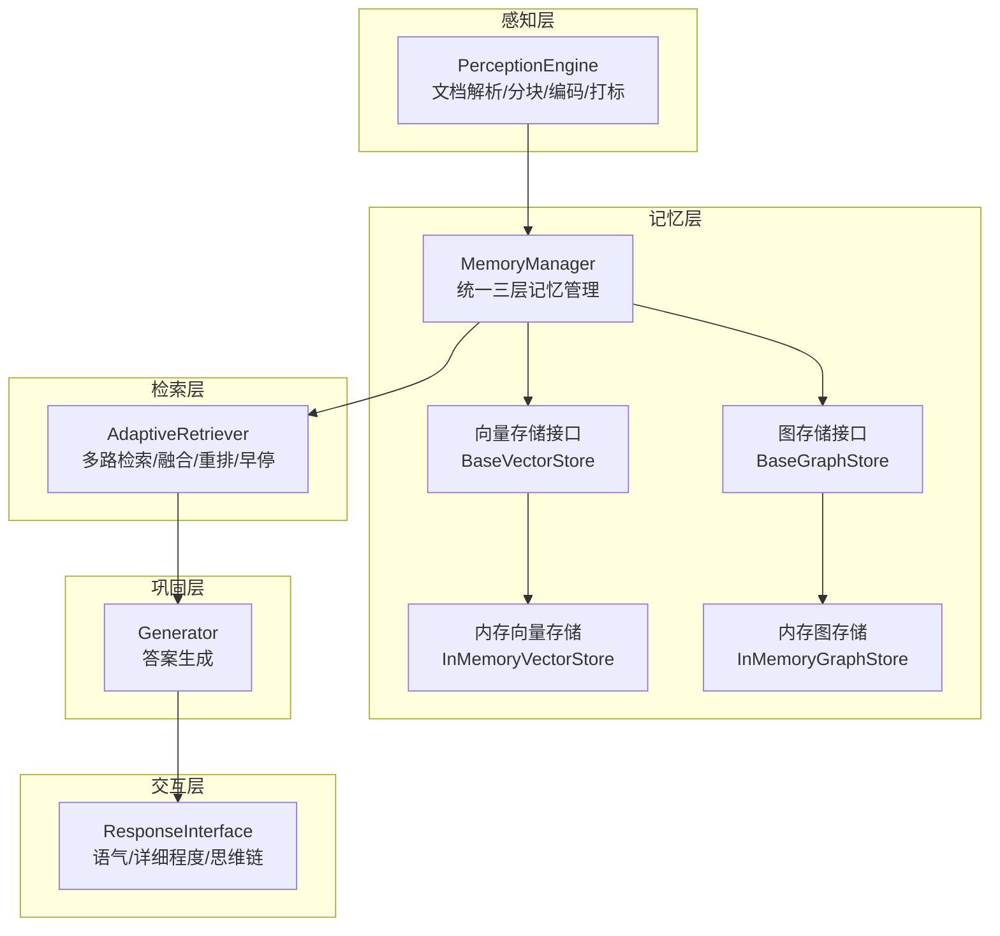
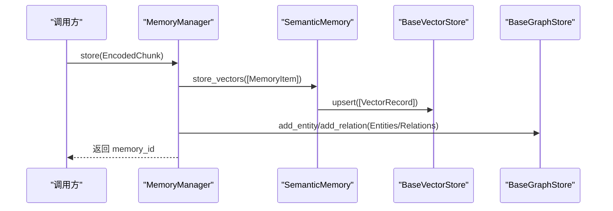
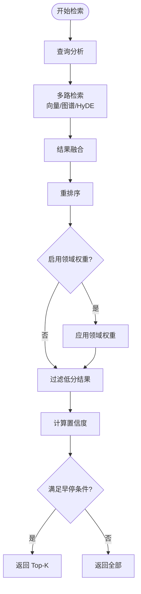
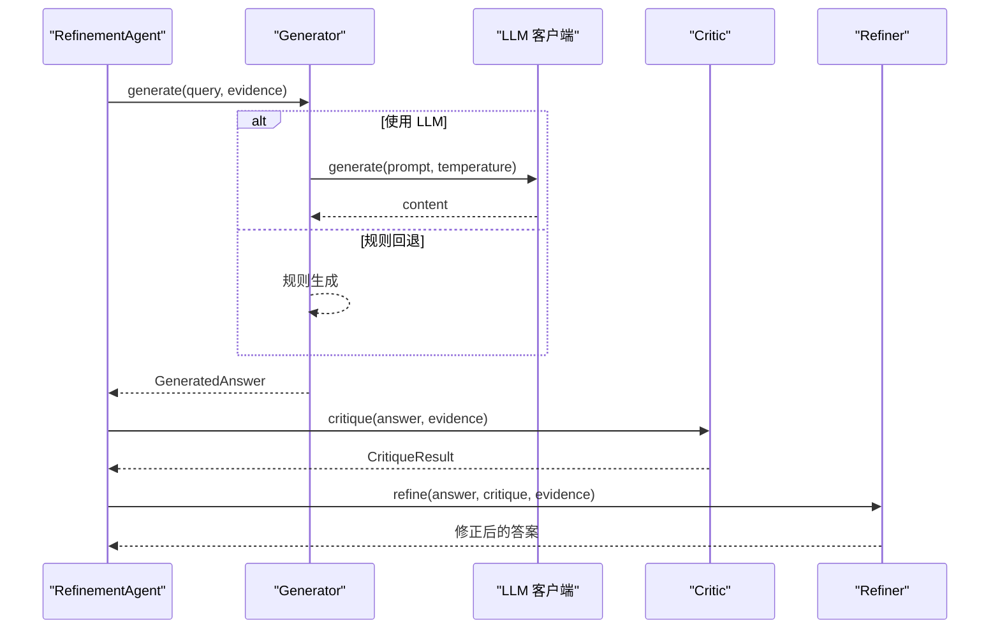
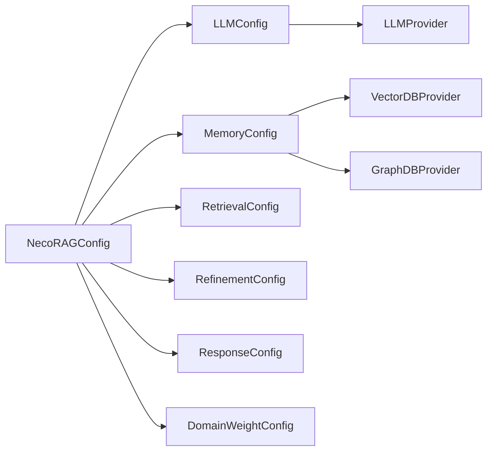

# 扩展开发指南

<cite>
**本文引用的文件**
- [src/core/base.py](file://src/core/base.py)
- [src/core/protocols.py](file://src/core/protocols.py)
- [src/core/config.py](file://src/core/config.py)
- [src/memory/backends/base.py](file://src/memory/backends/base.py)
- [src/memory/backends/memory_store.py](file://src/memory/backends/memory_store.py)
- [src/retrieval/retriever.py](file://src/retrieval/retriever.py)
- [src/response/interface.py](file://src/response/interface.py)
- [src/refinement/generator.py](file://src/refinement/generator.py)
- [src/perception/engine.py](file://src/perception/engine.py)
- [src/memory/manager.py](file://src/memory/manager.py)
- [src/domain/config.py](file://src/domain/config.py)
- [src/core/llm/base.py](file://src/core/llm/base.py)
- [README.md](file://README.md)
- [example/example_usage.py](file://example/example_usage.py)
</cite>

## 目录
1. [简介](#简介)
2. [项目结构](#项目结构)
3. [核心组件](#核心组件)
4. [架构总览](#架构总览)
5. [详细组件分析](#详细组件分析)
6. [依赖分析](#依赖分析)
7. [性能考虑](#性能考虑)
8. [故障排查指南](#故障排查指南)
9. [结论](#结论)
10. [附录](#附录)

## 简介
本指南面向希望在 NecoRAG 框架上进行扩展开发的工程师，目标是帮助你：
- 理解模块化架构设计与扩展点识别
- 掌握核心协议与接口的设计原则
- 明确自定义模块开发的完整流程
- 理解配置系统工作机制与扩展方法
- 掌握插件开发最佳实践与设计模式
- 针对内存后端、检索策略、响应适配器等扩展点给出技术指导
- 保持向后兼容性与版本管理的建议

## 项目结构
NecoRAG 采用“五层认知”分层架构，围绕统一协议与配置系统构建，便于替换与扩展：
- 感知层：文档解析、分块、编码、情境标签
- 记忆层：工作记忆、语义记忆、情景图谱，支持多种存储后端
- 检索层：自适应检索、HyDE 增强、重排序、早停机制
- 巩固层：答案生成、批判、修正、幻觉检测、知识固化与修剪
- 交互层：响应适配（语气、详细程度）、思维链可视化、用户画像

图表来源
- [src/perception/engine.py:14-130](file://src/perception/engine.py#L14-L130)
- [src/memory/manager.py:16-186](file://src/memory/manager.py#L16-L186)
- [src/memory/backends/base.py:54-297](file://src/memory/backends/base.py#L54-L297)
- [src/memory/backends/memory_store.py:20-381](file://src/memory/backends/memory_store.py#L20-L381)
- [src/retrieval/retriever.py:122-440](file://src/retrieval/retriever.py#L122-L440)
- [src/refinement/generator.py:15-208](file://src/refinement/generator.py#L15-L208)
- [src/response/interface.py:16-224](file://src/response/interface.py#L16-L224)

章节来源
- [README.md:35-85](file://README.md#L35-L85)
- [src/perception/engine.py:14-130](file://src/perception/engine.py#L14-L130)
- [src/memory/manager.py:16-186](file://src/memory/manager.py#L16-L186)
- [src/retrieval/retriever.py:122-440](file://src/retrieval/retriever.py#L122-L440)
- [src/refinement/generator.py:15-208](file://src/refinement/generator.py#L15-L208)
- [src/response/interface.py:16-224](file://src/response/interface.py#L16-L224)

## 核心组件
- 协议与数据模型：统一的数据类型与枚举，确保模块间数据交换一致
- 抽象基类：定义各层组件的接口契约，保证可替换性
- 配置系统：集中化的配置类与加载机制，支持文件与环境变量覆盖
- 存储后端：抽象的向量与图存储接口，提供内存实现作为参考

章节来源
- [src/core/protocols.py:1-288](file://src/core/protocols.py#L1-L288)
- [src/core/base.py:22-658](file://src/core/base.py#L22-L658)
- [src/core/config.py:45-370](file://src/core/config.py#L45-L370)
- [src/memory/backends/base.py:54-297](file://src/memory/backends/base.py#L54-L297)

## 架构总览
NecoRAG 的模块化设计以“协议 + 抽象基类 + 配置系统”为核心，通过依赖注入与组合实现灵活扩展。

```mermaid
classDiagram
class BaseParser {
+parse(file_path) Document
+parse_content(content, doc_type) Document
+supports(ext) bool
}
class BaseChunker {
+chunk(document) Chunk[]
+chunk_size int
+chunk_overlap int
}
class BaseEncoder {
+encode(text) Embedding
+encode_batch(texts) Embedding[]
+dimension int
+model_name str
}
class BaseTagger {
+tag(chunk) Dict
}
class BaseVectorStore {
+upsert(records) str[]
+search(q, top_k, filters, threshold) SearchResult[]
+get(ids) VectorRecord|None[]
+delete(ids) int
+count() int
+dimension int
}
class BaseGraphStore {
+add_node(node) str
+add_edge(edge) str
+get_node(id) GraphNode|None
+get_neighbors(id, types, direction) Tuple[]
+traverse(start_id, depth, types) GraphNode[]
+find_path(src, tgt, depth) GraphNode|None[]
+delete_node(id) bool
+delete_edge(id) bool
+node_count() int
+edge_count() int
}
class BaseRetriever {
+retrieve(query, top_k) RetrievalResult[]
}
class BaseReranker {
+rerank(query, results, top_k) RetrievalResult[]
}
class BaseGenerator {
+generate(query, evidence, **kwargs) GeneratedAnswer
}
class BaseResponseAdapter {
+adapt(content, **kwargs) str
}
class BaseLLMClient {
+generate(prompt, ...) str
+embed(text) float[]
+embed_batch(texts) List[]float~~
+model_name str
+embedding_dimension int
}
BaseParser <|.. PerceptionEngine
BaseChunker <|.. PerceptionEngine
BaseEncoder <|.. PerceptionEngine
BaseTagger <|.. PerceptionEngine
BaseVectorStore <|.. MemoryManager
BaseGraphStore <|.. MemoryManager
BaseRetriever <|.. AdaptiveRetriever
BaseReranker <|.. AdaptiveRetriever
BaseGenerator <|.. RefinementAgent
BaseResponseAdapter <|.. ResponseInterface
BaseLLMClient <|.. Generator
```

图表来源
- [src/core/base.py:22-658](file://src/core/base.py#L22-L658)
- [src/perception/engine.py:14-130](file://src/perception/engine.py#L14-L130)
- [src/memory/manager.py:16-186](file://src/memory/manager.py#L16-L186)
- [src/retrieval/retriever.py:122-440](file://src/retrieval/retriever.py#L122-L440)
- [src/refinement/generator.py:15-208](file://src/refinement/generator.py#L15-L208)
- [src/response/interface.py:16-224](file://src/response/interface.py#L16-L224)
- [src/core/llm/base.py:11-134](file://src/core/llm/base.py#L11-L134)

## 详细组件分析

### 感知层：文档解析、分块、编码与情境标签
- 设计要点
  - 通过抽象基类定义解析器、分块器、编码器、标签生成器的统一接口
  - 支持从文件路径与文本内容两种输入
  - 编码同时产出稠密向量、稀疏向量与实体三元组，便于后续检索与图谱构建
- 扩展建议
  - 新增解析器：实现 BaseParser 接口，注册支持的文件类型
  - 新增分块策略：实现 BaseChunker 接口，提供不同 chunk_size 与 overlap
  - 新增编码模型：实现 BaseEncoder 接口，适配新的嵌入模型
  - 新增标签策略：实现 BaseTagger 接口，扩展情境标签维度
- 开发流程
  1) 定义实现类并实现接口方法
  2) 在 PerceptionEngine 中注入新组件
  3) 通过配置或构造函数切换实现
- 参考实现
  - PerceptionEngine 将解析、分块、编码、打标串联为流水线

章节来源
- [src/core/base.py:22-143](file://src/core/base.py#L22-L143)
- [src/perception/engine.py:14-130](file://src/perception/engine.py#L14-L130)

### 记忆层：三层记忆与存储后端
- 设计要点
  - MemoryManager 统一管理 L1/L2/L3 三层记忆
  - 通过 BaseVectorStore 与 BaseGraphStore 抽象存储后端
  - InMemoryVectorStore 与 InMemoryGraphStore 提供内存实现，便于开发与测试
- 扩展建议
  - 新增向量存储后端：实现 BaseVectorStore 接口，支持外部向量库
  - 新增图存储后端：实现 BaseGraphStore 接口，支持外部图数据库
  - 新增记忆层：新增一层记忆并接入 MemoryManager
- 开发流程
  1) 实现存储接口
  2) 在 MemoryManager 中注入新后端
  3) 通过配置选择存储提供商
- 参考实现
  - MemoryManager.store/retrieve/consolidate/forget 的工作流

图表来源
- [src/memory/manager.py:48-112](file://src/memory/manager.py#L48-L112)
- [src/memory/backends/base.py:54-137](file://src/memory/backends/base.py#L54-L137)
- [src/memory/backends/base.py:139-276](file://src/memory/backends/base.py#L139-L276)

章节来源
- [src/memory/manager.py:16-186](file://src/memory/manager.py#L16-L186)
- [src/memory/backends/base.py:54-297](file://src/memory/backends/base.py#L54-L297)
- [src/memory/backends/memory_store.py:20-381](file://src/memory/backends/memory_store.py#L20-L381)

### 检索层：自适应检索、HyDE 增强、重排序与早停
- 设计要点
  - AdaptiveRetriever 集成多路检索、融合、重排序与早停
  - 支持向量检索、图谱检索、HyDE 增强与领域权重
  - EarlyTerminationController 基于置信度阈值与边际收益决定是否提前终止
- 扩展建议
  - 新增检索策略：实现 BaseRetriever 接口，接入融合策略
  - 新增重排序模型：实现 BaseReranker 接口，替换现有重排器
  - 新增领域权重：基于 DomainConfig 与权重计算器扩展
- 开发流程
  1) 实现检索/重排组件
  2) 在 AdaptiveRetriever 中注入并配置
  3) 通过配置开关启用/禁用特性
- 参考实现
  - AdaptiveRetriever.retrieve 的完整流程与早停逻辑

图表来源
- [src/retrieval/retriever.py:177-254](file://src/retrieval/retriever.py#L177-L254)
- [src/retrieval/retriever.py:30-120](file://src/retrieval/retriever.py#L30-L120)

章节来源
- [src/retrieval/retriever.py:122-440](file://src/retrieval/retriever.py#L122-L440)
- [src/domain/config.py:54-285](file://src/domain/config.py#L54-L285)

### 巩固层：答案生成、批判、修正与幻觉检测
- 设计要点
  - Generator 支持 LLM 客户端依赖注入与规则回退
  - 通过置信度估计与证据裁剪提升答案质量
- 扩展建议
  - 新增生成策略：实现 BaseGenerator 接口，替换或扩展生成器
  - 新增 LLM 客户端：实现 BaseLLMClient/BaseAsyncLLMClient
- 开发流程
  1) 实现 LLM 客户端或生成器
  2) 注入到 Generator 或 RefinementAgent
  3) 通过配置选择实现
- 参考实现
  - Generator.generate 的 LLM 与规则回退流程

图表来源
- [src/refinement/generator.py:67-141](file://src/refinement/generator.py#L67-L141)
- [src/core/llm/base.py:11-134](file://src/core/llm/base.py#L11-L134)

章节来源
- [src/refinement/generator.py:15-208](file://src/refinement/generator.py#L15-L208)
- [src/core/llm/base.py:11-134](file://src/core/llm/base.py#L11-L134)

### 交互层：响应适配与思维链可视化
- 设计要点
  - ResponseInterface 支持语气与详细程度适配
  - 基于用户画像与交互历史动态调整输出风格
  - 思维链可视化展示检索路径、证据来源与推理过程
- 扩展建议
  - 新增响应适配器：实现 BaseResponseAdapter 接口
  - 新增语气/详细程度策略：扩展 ToneAdapter/DetailLevelAdapter
- 开发流程
  1) 实现适配器
  2) 在 ResponseInterface 中注入并配置
  3) 通过配置或调用参数控制风格
- 参考实现
  - ResponseInterface.respond 的完整流程

章节来源
- [src/response/interface.py:16-224](file://src/response/interface.py#L16-L224)
- [src/core/base.py:556-571](file://src/core/base.py#L556-L571)

## 依赖分析
- 组件耦合与内聚
  - 各层通过统一协议与抽象基类解耦，内聚于各自职责
  - 存储后端通过接口抽象与 MemoryManager 解耦
  - 检索与巩固通过数据模型与配置系统连接
- 外部依赖与集成点
  - LLM 客户端通过 BaseLLMClient 抽象接入
  - 向量/图数据库通过 BaseVectorStore/BaseGraphStore 抽象接入
  - 配置系统通过 NecoRAGConfig 与子配置类集中管理
- 潜在循环依赖
  - 当前结构避免了直接循环依赖；扩展时需保持接口驱动

图表来源
- [src/core/config.py:232-284](file://src/core/config.py#L232-L284)
- [src/core/config.py:18-42](file://src/core/config.py#L18-L42)

章节来源
- [src/core/config.py:45-370](file://src/core/config.py#L45-L370)

## 性能考虑
- 检索性能
  - 启用早停机制减少无效计算
  - 合理设置 top_k 与阈值，避免过度检索
  - 使用重排序与领域权重提升命中质量
- 存储性能
  - 选择合适的向量/图数据库后端
  - 通过维度与过滤条件优化查询
- 生成性能
  - 控制证据数量与温度参数
  - 使用规则回退作为兜底，降低 LLM 调用成本

## 故障排查指南
- 常见问题
  - 向量维度不匹配：检查编码器维度与存储后端维度一致性
  - 查询为空或结果稀少：检查分块策略、编码质量与检索阈值
  - 置信度异常：检查证据数量、重排模型与早停阈值
- 调试建议
  - 使用检索追踪与思维链可视化定位问题
  - 逐步关闭特性（如 HyDE、重排）以缩小范围
  - 通过配置系统切换到内存后端验证逻辑正确性

章节来源
- [src/memory/backends/memory_store.py:41-141](file://src/memory/backends/memory_store.py#L41-L141)
- [src/retrieval/retriever.py:365-372](file://src/retrieval/retriever.py#L365-L372)
- [src/response/interface.py:167-211](file://src/response/interface.py#L167-L211)

## 结论
NecoRAG 通过统一协议、抽象基类与配置系统，提供了高度模块化与可扩展的架构。开发者可在不破坏整体结构的前提下，替换或扩展任意组件。遵循本文的扩展流程与最佳实践，可以高效地实现自定义模块并保持系统的稳定性与可维护性。

## 附录

### 自定义模块开发完整流程
- 感知层
  - 定义实现类并实现 BaseParser/BaseChunker/BaseEncoder/BaseTagger
  - 在 PerceptionEngine 中注入新组件
  - 通过配置或构造函数切换实现
- 记忆层
  - 实现 BaseVectorStore/BaseGraphStore 接口
  - 在 MemoryManager 中注入新后端
  - 通过配置选择提供商
- 检索层
  - 实现 BaseRetriever/BaseReranker 接口
  - 在 AdaptiveRetriever 中注入并配置
  - 通过配置开关启用/禁用特性
- 巩固层
  - 实现 BaseGenerator 或 BaseLLMClient
  - 注入到 Generator 或 RefinementAgent
  - 通过配置选择实现
- 交互层
  - 实现 BaseResponseAdapter
  - 在 ResponseInterface 中注入并配置

章节来源
- [src/core/base.py:22-658](file://src/core/base.py#L22-L658)
- [src/perception/engine.py:14-130](file://src/perception/engine.py#L14-L130)
- [src/memory/backends/base.py:54-297](file://src/memory/backends/base.py#L54-L297)
- [src/retrieval/retriever.py:122-440](file://src/retrieval/retriever.py#L122-L440)
- [src/refinement/generator.py:15-208](file://src/refinement/generator.py#L15-L208)
- [src/response/interface.py:16-224](file://src/response/interface.py#L16-L224)

### 配置系统工作机制与扩展方法
- 机制
  - NecoRAGConfig 聚合各层配置，支持 from_dict/to_dict/load/save
  - load_config 支持从文件与环境变量加载，环境变量优先级更高
- 扩展方法
  - 新增配置字段：在对应配置类中添加字段与默认值
  - 新增枚举类型：在对应配置类中使用枚举
  - 新增预设配置：在 ConfigPresets 中添加新方法
- 版本与兼容
  - 保留默认值，避免破坏既有行为
  - 通过环境变量与文件配置实现运行时切换

章节来源
- [src/core/config.py:232-370](file://src/core/config.py#L232-L370)

### 插件开发最佳实践与设计模式
- 依赖注入
  - 通过构造函数注入抽象接口，便于替换实现
- 工厂与策略
  - 使用工厂根据配置选择具体实现
  - 使用策略模式在运行时切换算法
- 装饰器与适配器
  - 使用适配器统一第三方接口
  - 使用装饰器增强日志与监控
- 配置驱动
  - 将可变行为通过配置控制，避免硬编码

### 内存后端、检索策略、响应适配器扩展技术指导
- 内存后端
  - 实现 BaseVectorStore/BaseGraphStore 接口，参考内存实现
  - 注意维度一致性、过滤条件与性能指标
- 检索策略
  - 实现 BaseRetriever/BaseReranker 接口
  - 与融合策略、早停机制协同工作
- 响应适配器
  - 实现 BaseResponseAdapter 接口
  - 与用户画像与交互历史结合，动态调整风格

章节来源
- [src/memory/backends/base.py:54-297](file://src/memory/backends/base.py#L54-L297)
- [src/memory/backends/memory_store.py:20-381](file://src/memory/backends/memory_store.py#L20-L381)
- [src/retrieval/retriever.py:122-440](file://src/retrieval/retriever.py#L122-L440)
- [src/response/interface.py:16-224](file://src/response/interface.py#L16-L224)

### 向后兼容性与版本管理建议
- 保持默认行为不变，新增字段提供默认值
- 通过环境变量与配置文件实现运行时切换
- 发布前提供迁移指南与兼容性矩阵
- 使用语义化版本号，重大变更升级主版本