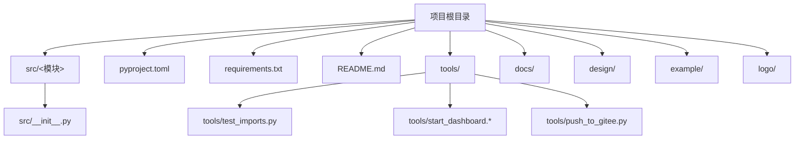
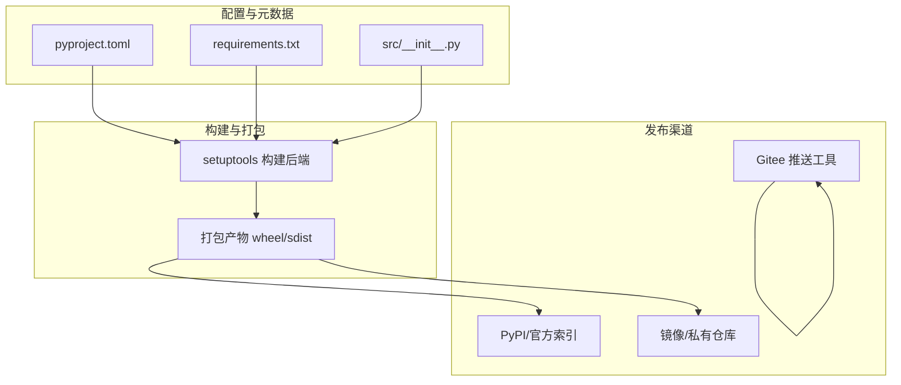
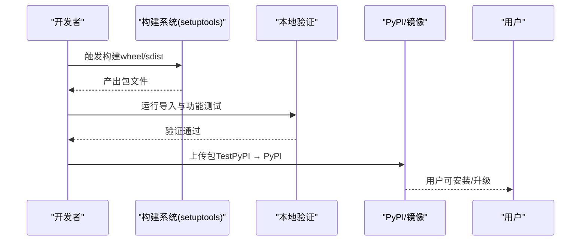
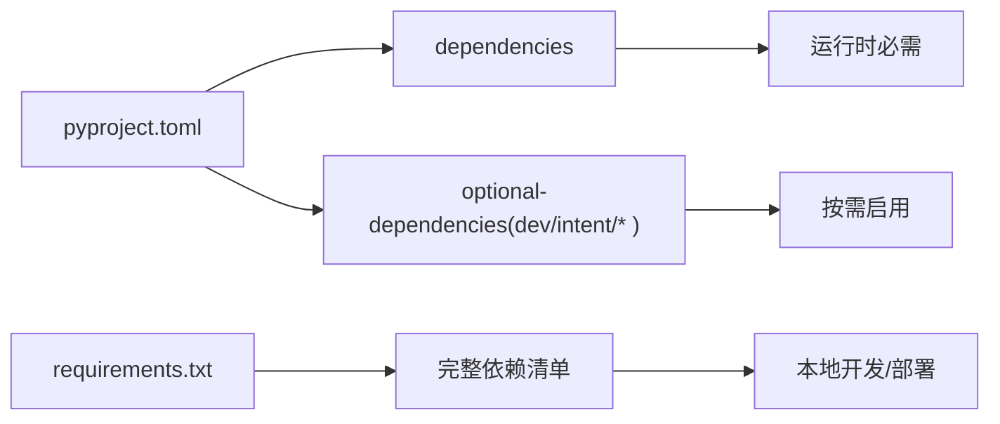

# 构建与发布

<cite>
**本文引用的文件**
- [pyproject.toml](file://pyproject.toml)
- [requirements.txt](file://requirements.txt)
- [README.md](file://README.md)
- [src/__init__.py](file://src/__init__.py)
- [tools/test_imports.py](file://tools/test_imports.py)
- [test_init.py](file://test_init.py)
- [CONTRIBUTING.md](file://CONTRIBUTING.md)
- [DASHBOARD_GUIDE.md](file://DASHBOARD_GUIDE.md)
- [GITEE_PUSH_GUIDE.md](file://GITEE_PUSH_GUIDE.md)
</cite>

## 目录
1. [引言](#引言)
2. [项目结构](#项目结构)
3. [核心组件](#核心组件)
4. [架构总览](#架构总览)
5. [详细组件分析](#详细组件分析)
6. [依赖分析](#依赖分析)
7. [性能考虑](#性能考虑)
8. [故障排查指南](#故障排查指南)
9. [结论](#结论)
10. [附录](#附录)

## 引言
本文件面向 NecoRAG 项目的维护者与贡献者，系统化阐述项目的构建与发布流程，包括：
- pyproject.toml 配置的作用与设置要点
- 包构建、打包与发布的完整流程
- 版本管理与标签策略
- 发布前检查清单与质量保证措施
- CI/CD 流程与自动化发布配置建议
- 发布后的验证与回滚策略
- 不同发布渠道的配置指导

## 项目结构
NecoRAG 采用标准的 Python 包结构，核心源码位于 src/ 下，顶层提供统一入口与模块导出；项目根目录包含构建配置、依赖清单与文档。

图表来源
- [pyproject.toml](file://pyproject.toml)
- [requirements.txt](file://requirements.txt)
- [README.md](file://README.md)
- [src/__init__.py](file://src/__init__.py)
- [tools/test_imports.py](file://tools/test_imports.py)

章节来源
- [pyproject.toml](file://pyproject.toml)
- [requirements.txt](file://requirements.txt)
- [README.md](file://README.md)
- [src/__init__.py](file://src/__init__.py)
- [tools/test_imports.py](file://tools/test_imports.py)

## 核心组件
本节聚焦与构建、发布直接相关的配置与入口文件，帮助读者快速定位关键设置。

- 构建系统与元数据
  - 构建系统：使用 setuptools 作为 build-backend，要求 setuptools≥61.0
  - 项目元数据：名称、版本、描述、许可证、作者、关键字、分类器等
  - 依赖与可选依赖：核心依赖与开发/意图分类等可选依赖集
  - 包扫描：通过 setuptools.find_packages 定位 necorag* 包
  - 工具配置：Black 与 MyPy 的基础规则

- 版本与入口
  - 包版本：在顶层统一版本号与作者信息
  - 模块导出：通过 src/__init__.py 暴露核心 API，并对可选依赖进行条件导入

- 依赖清单
  - requirements.txt 提供完整依赖清单，便于本地开发与部署

章节来源
- [pyproject.toml](file://pyproject.toml)
- [src/__init__.py](file://src/__init__.py)
- [requirements.txt](file://requirements.txt)

## 架构总览
下图展示了从配置到构建、打包与发布的整体流程，以及与可选依赖的关系。

图表来源
- [pyproject.toml](file://pyproject.toml)
- [requirements.txt](file://requirements.txt)
- [src/__init__.py](file://src/__init__.py)
- [GITEE_PUSH_GUIDE.md](file://GITEE_PUSH_GUIDE.md)

## 详细组件分析

### pyproject.toml 配置详解
- 构建系统
  - build-backend 指定 setuptools.build_meta
  - requires 指定 setuptools 版本下限
- 项目元数据
  - name、version、description、readme、license、authors、keywords、classifiers
  - Python 版本要求：>=3.9
- 依赖与可选依赖
  - dependencies：核心运行时依赖
  - optional-dependencies：dev、intent、intent-ml、intent-fasttext 等
- 项目链接
  - urls：主页、文档、仓库地址
- 包扫描
  - where/include：仅包含 necorag* 包，避免非源码文件进入包
- 工具配置
  - Black：行宽、目标 Python 版本
  - MyPy：Python 版本、警告策略

章节来源
- [pyproject.toml](file://pyproject.toml)

### 版本管理与标签策略
- 版本来源
  - 包版本由 pyproject.toml 的 version 字段与 src/__init__.py 的 __version__ 协调
  - 建议在发布前同步两者，确保导入与打包一致
- 标签策略
  - 建议遵循语义化版本（SemVer），结合 alpha/beta/rc 阶段标识
  - 发布前打 Tag，Tag 名称与版本号保持一致或采用 vX.Y.Z 前缀
- 变更记录
  - 结合 CHANGELOG.md 记录每次发布的重要变更，便于追踪

章节来源
- [pyproject.toml](file://pyproject.toml)
- [src/__init__.py](file://src/__init__.py)
- [README.md](file://README.md)

### 包构建、打包与发布流程
- 本地构建
  - 使用 setuptools 构建后端，生成 wheel 与 sdist
  - 确保 requirements.txt 与 pyproject.toml 的依赖一致
- 本地验证
  - 使用 tools/test_imports.py 验证模块导入与基础功能
  - 使用 test_init.py 验证顶层导出
- 发布到 PyPI
  - 使用 twine 上传至 TestPyPI 进行预检，再上传至 PyPI
  - 上传前确保版本号唯一且未被占用
- 发布到镜像/私有仓库
  - 配置 pypiserver 或 Artifactory，按团队流程上传
- Gitee 推送
  - 使用 GITEE_PUSH_GUIDE.md 中的工具与配置，自动推送代码到 Gitee

图表来源
- [pyproject.toml](file://pyproject.toml)
- [requirements.txt](file://requirements.txt)
- [tools/test_imports.py](file://tools/test_imports.py)
- [test_init.py](file://test_init.py)
- [GITEE_PUSH_GUIDE.md](file://GITEE_PUSH_GUIDE.md)

章节来源
- [pyproject.toml](file://pyproject.toml)
- [requirements.txt](file://requirements.txt)
- [tools/test_imports.py](file://tools/test_imports.py)
- [test_init.py](file://test_init.py)
- [GITEE_PUSH_GUIDE.md](file://GITEE_PUSH_GUIDE.md)

### CI/CD 流程与自动化发布配置建议
- 构建与测试
  - 在 CI 中执行：安装依赖、运行导入测试、静态检查（Black/Flake8/Mypy）
  - 使用 tox 或多 Python 版本矩阵测试
- 自动化发布
  - 当 Tag 推送触发流水线：构建包、上传至 TestPyPI 验证、通过后上传至 PyPI
  - Gitee 自动推送：在 CI 中读取 .env 凭据，调用推送脚本
- 安全与合规
  - 保护凭据（PyPI token、Gitee token），使用 CI 的加密变量
  - 生成并校验校验和（如 SHA256）

章节来源
- [CONTRIBUTING.md](file://CONTRIBUTING.md)
- [GITEE_PUSH_GUIDE.md](file://GITEE_PUSH_GUIDE.md)

### 发布后的验证与回滚策略
- 验证清单
  - 安装验证：pip install necorag 与从源码安装对比
  - 导入验证：tools/test_imports.py 与 test_init.py
  - 功能验证：README.md 中的基础使用示例
  - Dashboard 验证：参考 DASHBOARD_GUIDE.md 启动与 API 调用
- 回滚策略
  - 若发现严重问题，回退到上一个稳定 Tag 对应的版本
  - 通过 PyPI 标记废弃版本或撤销发布（若允许）
  - Gitee 回滚：删除错误 Tag 或推送回滚提交

章节来源
- [tools/test_imports.py](file://tools/test_imports.py)
- [test_init.py](file://test_init.py)
- [README.md](file://README.md)
- [DASHBOARD_GUIDE.md](file://DASHBOARD_GUIDE.md)

### 不同发布渠道的配置指导
- PyPI
  - 使用 twine 进行上传，确保 .pypirc 或环境变量配置
  - 建议先上传至 TestPyPI 验证
- 镜像/私有仓库
  - 配置仓库认证与上传策略，遵循团队规范
- Gitee
  - 使用 GITEE_PUSH_GUIDE.md 的工具与 .env 凭据
  - 注意文件大小限制与重试机制

章节来源
- [GITEE_PUSH_GUIDE.md](file://GITEE_PUSH_GUIDE.md)

## 依赖分析
- 运行时依赖
  - 核心依赖：numpy、python-dateutil
  - Dashboard 依赖：fastapi、uvicorn、pydantic
- 可选依赖
  - dev：pytest、pytest-asyncio、black、flake8、mypy
  - intent/intent-ml/intent-fasttext：根据意图分类需求选择
- 本地开发依赖
  - requirements.txt 提供完整依赖清单，便于一次性安装

图表来源
- [pyproject.toml](file://pyproject.toml)
- [requirements.txt](file://requirements.txt)

章节来源
- [pyproject.toml](file://pyproject.toml)
- [requirements.txt](file://requirements.txt)

## 性能考虑
- 构建性能
  - 控制包体积：仅包含 necorag* 包，避免多余文件
  - 依赖精简：按需启用可选依赖，减少安装时间
- 发布效率
  - 使用缓存与并行任务加速 CI 构建
  - 预检上传（TestPyPI）避免重复失败

## 故障排查指南
- 导入失败
  - 检查 src/__init__.py 的导出与异常捕获
  - 使用 tools/test_imports.py 逐项验证
- 版本不一致
  - 同步 pyproject.toml 与 src/__init__.py 的版本字段
- Gitee 推送失败
  - 检查 .env 中的 GITEE_TOKEN、仓库权限与分支配置
  - 参考 GITEE_PUSH_GUIDE.md 的常见错误与手动验证步骤

章节来源
- [src/__init__.py](file://src/__init__.py)
- [tools/test_imports.py](file://tools/test_imports.py)
- [GITEE_PUSH_GUIDE.md](file://GITEE_PUSH_GUIDE.md)

## 结论
通过明确的 pyproject.toml 配置、严格的版本与标签策略、完善的本地与 CI 验证流程，以及针对不同发布渠道的配置指导，NecoRAG 可以实现高质量、可重复的构建与发布。建议在团队内固化流程与检查清单，持续优化自动化与安全性。

## 附录
- 发布前检查清单
  - 版本号核对（pyproject.toml 与 src/__init__.py）
  - 依赖一致性（requirements.txt 与 pyproject.toml）
  - 导入与功能测试（tools/test_imports.py、test_init.py）
  - 文档与示例更新（README.md、DASHBOARD_GUIDE.md）
  - CI 预检（TestPyPI 上传与验证）
- 质量保证措施
  - 代码风格：Black
  - 静态类型：MyPy
  - 规范提交：CONTRIBUTING.md 的提交规范
  - Dashboard 验证：DASHBOARD_GUIDE.md 的启动与 API 测试

章节来源
- [CONTRIBUTING.md](file://CONTRIBUTING.md)
- [DASHBOARD_GUIDE.md](file://DASHBOARD_GUIDE.md)
- [README.md](file://README.md)