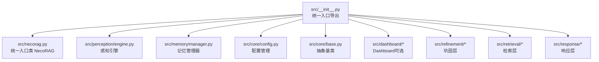
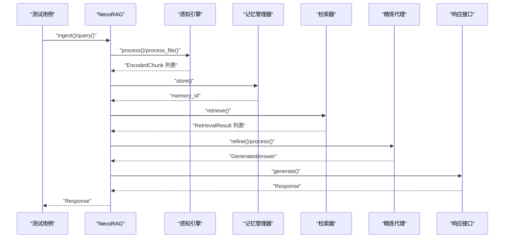
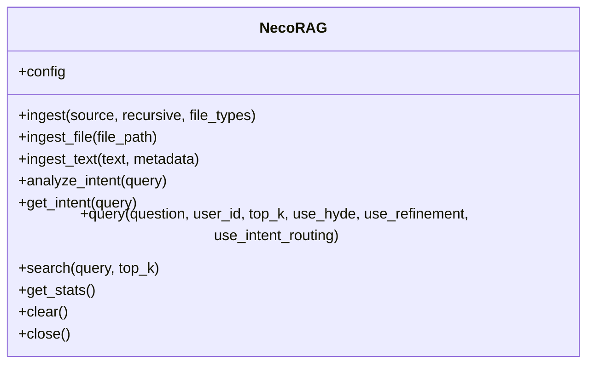
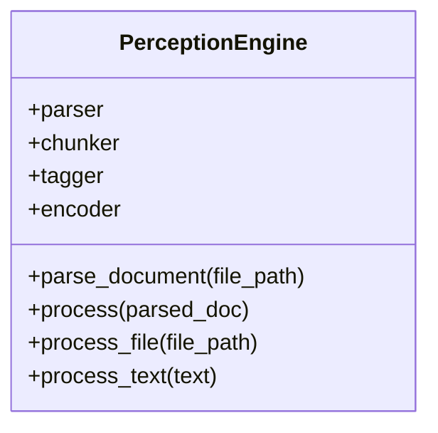
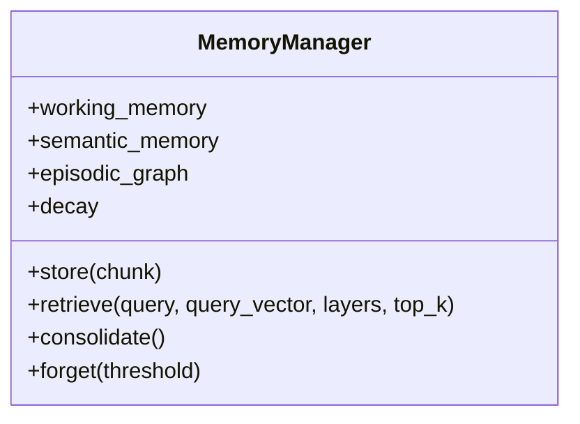
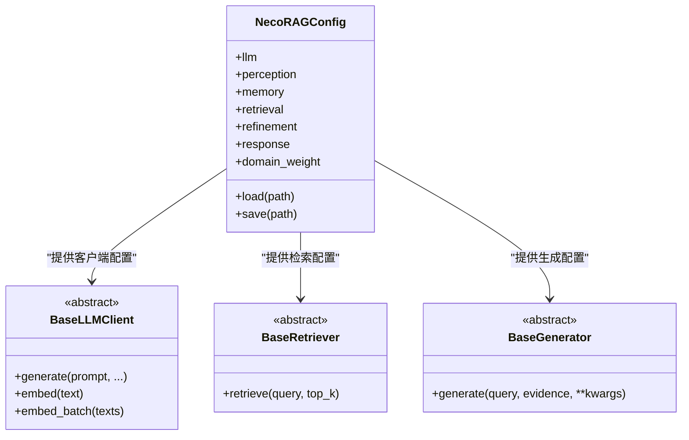
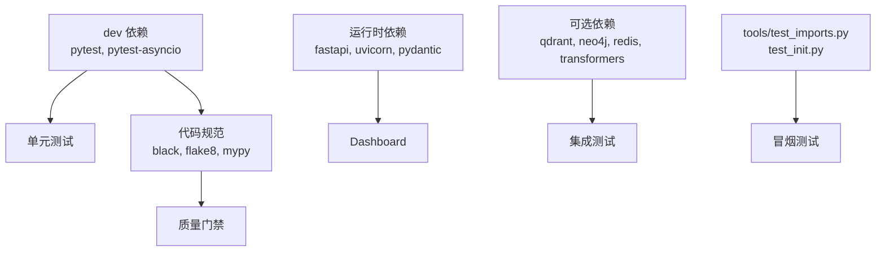

# 测试策略

<cite>
**本文引用的文件**
- [README.md](file://README.md)
- [pyproject.toml](file://pyproject.toml)
- [requirements.txt](file://requirements.txt)
- [tools/test_imports.py](file://tools/test_imports.py)
- [test_init.py](file://test_init.py)
- [src/__init__.py](file://src/__init__.py)
- [src/necorag.py](file://src/necorag.py)
- [src/core/base.py](file://src/core/base.py)
- [src/core/config.py](file://src/core/config.py)
- [src/perception/engine.py](file://src/perception/engine.py)
- [src/memory/manager.py](file://src/memory/manager.py)
- [CONTRIBUTING.md](file://CONTRIBUTING.md)
</cite>

## 目录
1. [引言](#引言)
2. [项目结构](#项目结构)
3. [核心组件](#核心组件)
4. [架构总览](#架构总览)
5. [详细组件分析](#详细组件分析)
6. [依赖分析](#依赖分析)
7. [性能考量](#性能考量)
8. [故障排查指南](#故障排查指南)
9. [结论](#结论)
10. [附录](#附录)

## 引言
本测试策略文档面向 NecoRAG 项目，旨在建立系统化的测试体系，覆盖单元测试、集成测试与端到端测试，明确测试框架选择与配置、测试用例编写指南与最佳实践、模块导入测试的重要性与执行方法、性能与基准测试策略、测试覆盖率与质量标准，以及持续集成与自动化测试流程。文档同时结合项目现有工具与模块结构，给出可落地的实施建议。

## 项目结构
NecoRAG 采用“五层认知”架构，核心模块包括感知层、记忆层、检索层、巩固层、响应层，并提供 Dashboard 配置管理与统一入口类 NecoRAG。项目通过 src 根包导出统一入口，便于外部按需导入与测试。

图表来源
- [src/__init__.py:1-133](file://src/__init__.py#L1-L133)
- [src/necorag.py:1-482](file://src/necorag.py#L1-L482)
- [src/perception/engine.py:1-130](file://src/perception/engine.py#L1-L130)
- [src/memory/manager.py:1-186](file://src/memory/manager.py#L1-L186)
- [src/core/config.py:1-370](file://src/core/config.py#L1-L370)
- [src/core/base.py:1-658](file://src/core/base.py#L1-L658)

章节来源
- [src/__init__.py:1-133](file://src/__init__.py#L1-L133)
- [README.md:158-433](file://README.md#L158-L433)

## 核心组件
- 统一入口类 NecoRAG：负责文档导入、查询检索、意图分析、HyDE 增强、检索与精炼闭环、响应生成与统计等。
- 感知引擎：文档解析、分块、情境标签生成、向量编码。
- 记忆管理器：三层记忆统一管理，支持向量检索、图谱实体关系维护与记忆衰减。
- 配置系统：集中管理 LLM、感知、记忆、检索、巩固、响应、领域权重等配置。
- 抽象基类：定义各层组件的接口契约，便于替换实现与测试替身。

章节来源
- [src/necorag.py:29-482](file://src/necorag.py#L29-L482)
- [src/perception/engine.py:14-130](file://src/perception/engine.py#L14-L130)
- [src/memory/manager.py:16-186](file://src/memory/manager.py#L16-L186)
- [src/core/config.py:45-370](file://src/core/config.py#L45-L370)
- [src/core/base.py:20-658](file://src/core/base.py#L20-L658)

## 架构总览
下图展示 NecoRAG 的调用链路与测试关注点：从统一入口发起文档导入与查询，经感知编码、记忆存储、检索与重排、巩固精炼、响应适配，最终输出结果；测试应覆盖各层组件的独立行为与组合行为。

图表来源
- [src/necorag.py:120-357](file://src/necorag.py#L120-L357)
- [src/perception/engine.py:42-130](file://src/perception/engine.py#L42-L130)
- [src/memory/manager.py:48-147](file://src/memory/manager.py#L48-L147)

## 详细组件分析

### 统一入口类 NecoRAG
- 设计要点：延迟初始化、可插拔 LLM 客户端、意图分析与路由、HyDE 增强、检索与精炼闭环、响应生成与统计。
- 测试关注点：构造与初始化、文档导入（单文件/批量）、查询流程（含意图路由、HyDE、精炼开关）、统计信息与资源清理。

图表来源
- [src/necorag.py:29-482](file://src/necorag.py#L29-L482)

章节来源
- [src/necorag.py:88-482](file://src/necorag.py#L88-L482)

### 感知引擎 PerceptionEngine
- 设计要点：解析器、分块器、情境标签生成器、向量编码器组合，支持文件与文本输入。
- 测试关注点：解析流程、分块策略、编码维度与实体抽取、情境标签生成、一站式处理流程。

图表来源
- [src/perception/engine.py:14-130](file://src/perception/engine.py#L14-L130)

章节来源
- [src/perception/engine.py:21-130](file://src/perception/engine.py#L21-L130)

### 记忆管理器 MemoryManager
- 设计要点：三层记忆统一管理、向量检索、图谱实体关系维护、记忆衰减与主动遗忘。
- 测试关注点：存储流程（向量与实体）、检索（向量搜索与强化）、记忆巩固与遗忘阈值控制。

图表来源
- [src/memory/manager.py:16-186](file://src/memory/manager.py#L16-L186)

章节来源
- [src/memory/manager.py:48-186](file://src/memory/manager.py#L48-L186)

### 配置系统与抽象基类
- 设计要点：集中配置、枚举化提供商、预设配置、抽象接口契约。
- 测试关注点：配置加载（文件/环境变量）、枚举映射、预设配置差异、接口实现一致性。

图表来源
- [src/core/config.py:45-370](file://src/core/config.py#L45-L370)
- [src/core/base.py:461-523](file://src/core/base.py#L461-L523)
- [src/core/base.py:319-338](file://src/core/base.py#L319-L338)
- [src/core/base.py:367-388](file://src/core/base.py#L367-L388)

章节来源
- [src/core/config.py:288-370](file://src/core/config.py#L288-L370)
- [src/core/base.py:461-523](file://src/core/base.py#L461-L523)

## 依赖分析
- 测试框架与工具：项目在 dev 依赖中声明了 pytest 与 pytest-asyncio，适合单元测试与异步测试；Black、Flake8、Mypy 用于代码风格与静态类型检查。
- 运行时依赖：FastAPI、Uvicorn、Pydantic 等用于 Dashboard；向量与图数据库、缓存、嵌入模型等为可选依赖，测试时可通过替身或内存实现隔离外部依赖。
- 导入测试：tools/test_imports.py 与 test_init.py 用于验证模块导入与基本可用性。

图表来源
- [pyproject.toml:32-39](file://pyproject.toml#L32-L39)
- [requirements.txt:7-37](file://requirements.txt#L7-L37)
- [tools/test_imports.py:1-64](file://tools/test_imports.py#L1-L64)
- [test_init.py:1-26](file://test_init.py#L1-L26)

章节来源
- [pyproject.toml:32-39](file://pyproject.toml#L32-L39)
- [requirements.txt:7-37](file://requirements.txt#L7-L37)
- [tools/test_imports.py:7-64](file://tools/test_imports.py#L7-L64)
- [test_init.py:9-26](file://test_init.py#L9-L26)

## 性能考量
- 导入时间：开发指南中建议导入时间小于 2 秒，测试时应监控首次导入耗时，避免不必要的延迟初始化。
- 基础操作：基础操作应在 100ms 以内，测试用例应覆盖典型路径的端到端时延。
- Dashboard 启动：启动时间应小于 5 秒，测试时可对启动流程进行基准测试。
- 检索与生成：结合配置阈值（如早停、重排、HyDE）进行性能回归测试，记录首字延迟、整体响应时间与吞吐。

章节来源
- [CONTRIBUTING.md:147-154](file://CONTRIBUTING.md#L147-L154)

## 故障排查指南
- 导入失败：使用 tools/test_imports.py 与 test_init.py 快速定位模块导入问题，确认 __all__ 导出与别名一致性。
- 统一入口异常：检查 NecoRAG 的延迟初始化与 LLM 客户端创建逻辑，必要时使用 MockLLMClient 进行隔离测试。
- 记忆层异常：验证向量维度、实体三元组格式与图谱插入流程，确保存储与检索路径一致。
- 配置加载异常：核对环境变量前缀与枚举映射，确保配置合并顺序（环境变量 > 配置文件 > 默认值）。

章节来源
- [tools/test_imports.py:7-64](file://tools/test_imports.py#L7-L64)
- [test_init.py:9-26](file://test_init.py#L9-L26)
- [src/necorag.py:106-118](file://src/necorag.py#L106-L118)
- [src/core/config.py:288-327](file://src/core/config.py#L288-L327)

## 结论
本测试策略以“分层覆盖、渐进深入”为核心：先以模块导入与基础功能冒烟测试保证可用性，再以单元测试验证接口契约与边界条件，随后通过集成测试与端到端测试验证跨层协作与性能目标。配合配置驱动与抽象基类，测试替身与内存实现可有效隔离外部依赖，提升稳定性与可重复性。建议将测试纳入 CI，设定覆盖率门槛与质量门禁，持续保障 NecoRAG 的演进质量。

## 附录

### 测试框架选择与配置
- 单元测试：pytest + pytest-asyncio，支持同步与异步测试用例。
- 代码规范：Black、Flake8、Mypy，CI 中作为质量门禁。
- 配置建议：在 pyproject.toml 的 dev 依赖中启用，确保本地与 CI 一致。

章节来源
- [pyproject.toml:32-39](file://pyproject.toml#L32-L39)

### 测试用例编写指南与最佳实践
- 单元测试
  - 针对抽象基类实现一致性：使用 MockLLMClient、内存向量存储、内存图存储替代真实外部依赖。
  - 边界与异常：覆盖空输入、无效枚举、超长文本、异常抛出路径。
  - 配置驱动：通过 NecoRAGConfig 与 ConfigPresets 控制行为差异。
- 集成测试
  - 跨层组合：感知→记忆→检索→精炼→响应的完整链路。
  - 外部依赖：使用替身或内存实现，避免真实数据库/缓存启动。
- 端到端测试
  - 场景驱动：典型问答、批量导入、意图路由、HyDE 增强、思维链可视化。
  - 回归与性能：记录关键指标（首字延迟、吞吐），纳入回归测试。

章节来源
- [src/core/base.py:461-523](file://src/core/base.py#L461-L523)
- [src/core/config.py:340-370](file://src/core/config.py#L340-L370)
- [src/necorag.py:273-357](file://src/necorag.py#L273-L357)

### 模块导入测试的重要性与执行方法
- 重要性：确保 __all__ 导出与别名一致，避免用户侧导入失败；验证 Dashboard 可选依赖的条件导入。
- 执行方法：使用 tools/test_imports.py 与 test_init.py，分别验证模块导入与基本初始化；在 CI 中加入导入测试作为必跑用例。

章节来源
- [tools/test_imports.py:7-64](file://tools/test_imports.py#L7-L64)
- [test_init.py:9-26](file://test_init.py#L9-L26)
- [src/__init__.py:43-49](file://src/__init__.py#L43-L49)

### 性能测试与基准测试策略
- 基准指标：导入时间、基础操作、Dashboard 启动、检索与生成延迟、吞吐量。
- 实施方法：pytest-benchmark（可选）或在 CI 中记录关键路径耗时；对检索与生成流程设置阈值，触发回归告警。
- 环境一致性：使用相同硬件/容器镜像，固定随机种子与缓存策略。

章节来源
- [CONTRIBUTING.md:147-154](file://CONTRIBUTING.md#L147-L154)

### 测试覆盖率要求与质量标准
- 覆盖率：建议语句覆盖率≥80%，分支覆盖率≥70%，关键路径与异常分支优先覆盖。
- 质量标准：通过 Black/Flake8/Mypy 检查；单元测试通过率100%；集成测试通过率100%；端到端场景通过率100%。
- 门禁：CI 中强制执行覆盖率与静态检查，阻断不达标合并。

章节来源
- [pyproject.toml:65-74](file://pyproject.toml#L65-L74)

### 持续集成与自动化测试流程
- 触发：push 与 pull_request 自动触发测试矩阵（不同 Python 版本、可选依赖组合）。
- 步骤：安装依赖（含 dev 与可选依赖）、运行导入测试、运行单元测试（含覆盖率）、运行集成/端到端测试（可选）、上传覆盖率报告、性能指标对比与告警。
- 缓存：缓存 pip/uv 缓存与构建产物，缩短流水线时间。

章节来源
- [requirements.txt:58-66](file://requirements.txt#L58-L66)
- [pyproject.toml:32-39](file://pyproject.toml#L32-L39)